# C语言深度解剖

Book：《C语言深度解剖——解开程序员笔试的秘密》 陈正冲

博客：[C语言深度解剖读书笔记_c语言深度解剖书怎么样-CSDN博客](https://blog.csdn.net/yhf19881015/article/details/11153931#:~:text=开始本节学习笔记之前)

## 第1章 关键字

32个关键词

- auto 声明自动变量，缺省时编译器一般默认为
- auto
  int 声明整型变量
- double 声明双精度变量
- long 声明长整型变量
- char 声明字符型变量
- float 声明浮点型变量
- short 声明短整型变量
- signed 声明有符号类型变量
- unsigned 声明无符号类型变量
- struct 声明结构体变量
- union 声明联合数据类型
- enum 声明枚举类型
- static 声明静态变量
- switch 用于开关语句
- case 开关语句分支
- default 开关语句中的‚其他‛分支
- break 跳出当前循环
- register 声明寄存器变量
- const 声明只读变量
- volatile 说明变量在程序执行中可被隐含地改变
- typedef 用以给数据类型取别名(当然还有其他作用)

### 1.2 最快的关键字 register

register：这个关键字请求编译器尽可能的将变量存在CPU 内部寄存器中而不是通过内存寻址访问以提高效率。只是尽可能，不是绝对，一个CPU 的寄存器也就那么几个或几十个，有限。

**注意点**：

register 变量必须是能被CPU 寄存器所接受的类型。意味着register 变量必须是一个单个的值，并且其长度应小于或等于整型的长度。而且register 变量可能不存放在内存中，所以不能用取址运算符“&”来获取register 变量的地址。（**register只是请求寄存器变量，但是不一定申请成功**）

### 1.3 static

对于static有两种用法：

- 修饰变量：  
  局部和全局变量，都存在内存的静态区  
  - 静态全局变量：作用域仅限于变量被定义的文件中，其他文件即使用extern 声明也没法使用它。准确地说作用域是从定义之处开始，到文件结尾处结束，在定义之处前面的那些代码也不能使用它。想要使用就得在前面再加extern。**最好在文件顶端定义**
  - 静态局部变量，在函数体里面定义的，就只能在这个函数里用了，同一个文档中的其他函数也用不了。由于被static 修饰的变量总是**存在内存的静态区**，所以**即使这个函数运行结束，这个静态变量的值还是不会被销毁，函数下次使用时仍然能用到这个值**。
- 修饰函数：  
  函数的作用域仅局限于本文件(所以又称内部函数)。使用内部函数的好处是：**不同的人编写不同的函数时，不用担心自己定义的函数，是否会与其它文件中的函数同名**。

### 1.10 goto

可能跳过变量的初始化、重要的计算等语句。

如果编译器不能发觉此类错误，每用一次goto 语句都可能留下隐患。

### 1.12 const

1、修饰只读变量，具有不可变行。（不是常量，真的常量是#define的和enum）

2、节省空间，避免不必要的内存分配，同时提高效率。  
const 定义的只读变量从汇编的角度来看，只是给出了对应的内存地址，而不是像#define一样给出的是立即数，所以，const 定义的只读变量在程序运行过程中只有一份拷贝（因为它是全局的只读变量，存放在静态区），而#define 定义的宏常量在内存中有若干个拷贝。  
#define 宏是在预编译阶段进行替换，而const 修饰的只读变量是在编译的时候确定其值。#define 宏没有类型，而const 修饰的只读变量具有特定的类型。

```c
#define M 3 //宏常量
const int N=5; //此时并未将N 放入内存中
......
int i=N; //此时为N 分配内存，以后不再分配！
int I=M; //预编译期间进行宏替换，分配内存
int j=N; //没有内存分配
int J=M; //再进行宏替换，又一次分配内存！
```

3、 const修饰的变量不能作为左值

其实const就是修饰变量，然后这个变量就不能当作左值了，当作左值，编译器就报错

4、const修饰指针的四种情况

```c
const int *p; // p 可变，p 指向的对象不可变
int const *p; // p 可变，p 指向的对象不可变
int *const p; // p 不可变，p 指向的对象可变
const int *const p; //指针p 和p 指向的对象都不可变
```

### 1.13 最易变的关键字 volatile

volatile 是易变的、不稳定的意思。

volatile 关键字和const 一样是一种类型修饰符，用它修饰的变量表示可以被某些编译器未知的因素更改，比如操作系统、硬件或者其它线程等。**volatile是告诉编译器不要对这个变量进行任何优化，直接在内存中进行取值。一般用在对寄存器进行赋值的时候，或修饰可能被多个线程访问的变量**。从而可以提供对特殊地址的稳定访问。

```c
volatile int i=10;
int j = i； //(3)语句
int k = i； //(4)语句
```

volatile 关键字告诉编译器i 是随时可能发生变化的，每次使用它的时候必须从内存中取出i的值，因而编译器生成的汇编代码会重新从i 的地址处读取数据放在k 中。

### 1.14 extern

extern 可以置于变量或者函数前，以标示变量或者函数的定义在别的文件中，下面的代码用到的这些变量或函数是外来的，不是本文件定义的，提示编译器遇到此变量和函数时在其他模块中寻找其定义

使用 `extern` 可以在一个文件中声明一个在另一个文件中定义的变量或函数，以便多个源文件之间共享。（**通常是用于声明，而不是定义**）

### 1.15 struct

在网络协议、通信控制、嵌入式系统、驱动开发等地方，我们经常要传送的不是简单的字节流（char 型数组），而是多种数据组合起来的一个整体，其表现形式是一个结构体。

经验不足的开发人员往往将所有需要传送的内容依顺序保存在char 型_______数组中，通过指针偏移的方法传送网络报文等信息。这样做编程复杂，易出错，而且一旦控制方式及通信协议有所变化，程序就要进行非常细致的修改，非常容易出错。

这个时候只需要一个结构体就能搞定。平时我们要求函数的参数尽量不多于4 个，如果函数的参数多于4 个使用起来非常容易出错（包括每个参数的意义和顺序都容易弄错），效率也会降低（与具体CPU 有关，ARM芯片对于超过4 个参数的处理就有讲究，具体请参考相关资料）。这个时候，可以用结构体压缩参数个数。

**结构体多大**：

结构体所占的内存大小是其成员所占内存之和

空结构体：编译器理所当然的认为你构造一个结构体数据类型是用来打包一些数据成员的，而最小的数据成员需要1 个byte，编译器为每个结构体类型数据至少预留1 个byte的空间。所以，空结构体的大小就定为1 个byte。（内存地址的最小单位是1个byte）

**struct 不class的区别**

struct成员默认是public

class成员默认是private

### 1.16 union

union 维护足够的空间来置放多个数据成员中的一种，而不是为每一个数据成员配置空间，在union 中所有的数据成员共用一个空间，同一时间只能储存其中一个数据成员，所有的数据成员具有相同的起始地址。

```
union StateMachine
{
    char character;
    int number;
    char *str;
    double exp;
};
```

一个union 只配置一个足够大的空间以来容纳最大长度的数据成员，以上例而言，最大长度是double 型态，所以StateMachine 的空间大小就是double 数据类型的大小。在C++里，union 的成员默认属性页为public。union 主要用来压缩空间。如果一些数据不可能在同一时间同时被用到，则可以使用union。（**union 型数据所占的空间等于其最大的成员所占的空间。对union 型的成员的存取都是相对于该联合体基地址的偏移量为0 处开始，也就是联合体的访问不论对哪个变量的存取都是从union 的首地址位置开始。**)

**大小端模式对union 类型数据的影响**

```c
union
{
    int i;
    char a[2];
}*p, u;
p =&u;
p->a[0] = 0x39; // 字数据的低字节
p->a[1] = 0x38; // 子数据的高字节
```

p.i 的值应该为多少呢？答：看大小端。大端模式：p->i = 0x3938；小端模式：p->i = 0x3839。

这里需要考虑存储模式：大端模式和小端模式。  
大端模式（Big_endian）：字数据的高字节存储在低地址中，而字数据的低字节则存放在高地址中。  
小端模式（Little_endian）：字数据的高字节存储在高地址中，而字数据的低字节则存放在低地址中。

**用程序确定当前系统的存储模式**

问题：请写一个C 函数，若处理器是Big_endian 的，则返回0；若是Little_endian 的，则返回1。

以大端模式存储，其内存布局如下图：

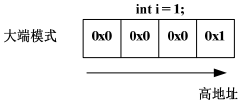

以小端模式存储，其内存布局如下图：

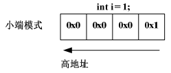

变量i 占4 个字节，但只有一个字节的值为1，另外三个字节的值都为0。如果取出低地址上的值为0，毫无疑问，这是大端模式；如果取出低地址上的值为1，毫无疑问，这是小端模式。

```c
int checkSystem( )
{
    union check
    {
        int i;
        char ch;
    } c;
    c.i = 1;
    return (c.ch ==1);
}
```

可以用这个函数来测试你当前系统的存储模式了。当然你也可以不用函数而直接去查看内存来确定当前系统的存储模式。

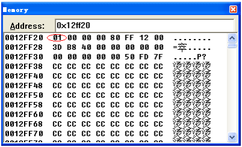

图中0x01 的值存在低地址上，说明当前系统为小端模式。

某些系统可能同时支持这两种存储模式，你可以用硬件跳线或在编译器的选项中设置其存储模式。

### 1.17 enum

**枚举与#define 宏的区别**：

1） #define 宏常量是在预编译阶段进行简单替换。枚举常量则是在编译的时候确定其值。

2） 一般在编译器里，**可以调试枚举常量，但是不能调试宏常量**。

3） 枚举可以一次定义大量相关的常量，而#define 宏一次只能定义一个。

### 1.18 typedef

1、typedef用于给一个已经存在的数据类型重新命名。

2、typedef并没有产生新的数据类型

3、typedef重定义的类型不能进行unsigned和signed进行扩展

原因在于typedef 定义新类型的时候应该定义全了，unsigned int是一个类型不能拆开的。

4、typedef 和 #define的区别：typedef是给已有的类型取别名，而#define只是简单的字符替换。区别如下图：

```c
#define PCHAR char*             PCHAR p3，p4;  //p3是char*型 p4是char型
typedef char* PCHAR;            PCHAR p1,p2;   //p1和p2都是 char*型
```

5、typedef与struct

```c
typedef struct student  
{  
}str，*str1;
```

str1 abc;  就是定义一个struct student *类型

str abc;  就是定义一个struct student 类型

## 第二章 符号

### 2.2 接续符和转义符

**接续符**：

C 语言里以反斜杠（\）表示断行。编译器会将反斜杠剔除掉，跟在反斜杠后面的字符自动接续到前一行。

**注意**：反斜杠之后不能有空格，反斜杠的下一行之前也不能有空格。

**转义符**：

转义符使用的时候，必须是出现在字符串中。

- `\n` 回车换行
- \t 横向跳到下一制表位置
- `\v` 竖向跳格
- `\b` 退格
- `\r` 回车
- `\f` 走纸换页
- `\\` 反斜扛符`"\"`
- `\'` 单引号符
- `\a` 鸣铃
- `\ddd` 1～3 位八进制数所代表的字符
- `\xhh` 1～2 位十六进制数所代表的字符

广义地讲，C 语言字符集中的任何一个字符均可用转义字符来表示。表中的`\ddd` 和`\xhh`
正是为此而提出的。ddd 和hh 分别为八进制和十六进制的ASCII 代码。如\102 表示字母"B"，
\134 表示反斜线，\X0A 表示换行等。

### 2.3 单引号、双引号

双引号引起来的都是字符串常量（2byte），单引号引起来的都是字符常量（1byte）。

```c
1，'1'，"1"。
```

第一个是整形常数，32 位系统下占4 个byte；  
第二个是字符常量，占1 个byte；  
第三个是字符串常量，占2 个byte。

字符在内存里是以ASCAII 码存储的，所以字符常量可以与整形常量或变量进行运算。
如：'A' + 1

### 2.9 运算符的优先级

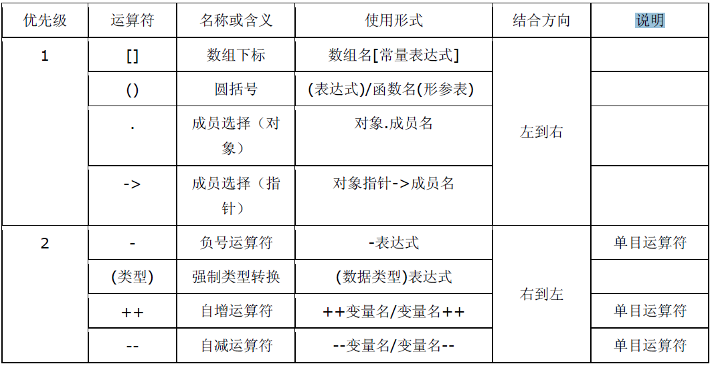

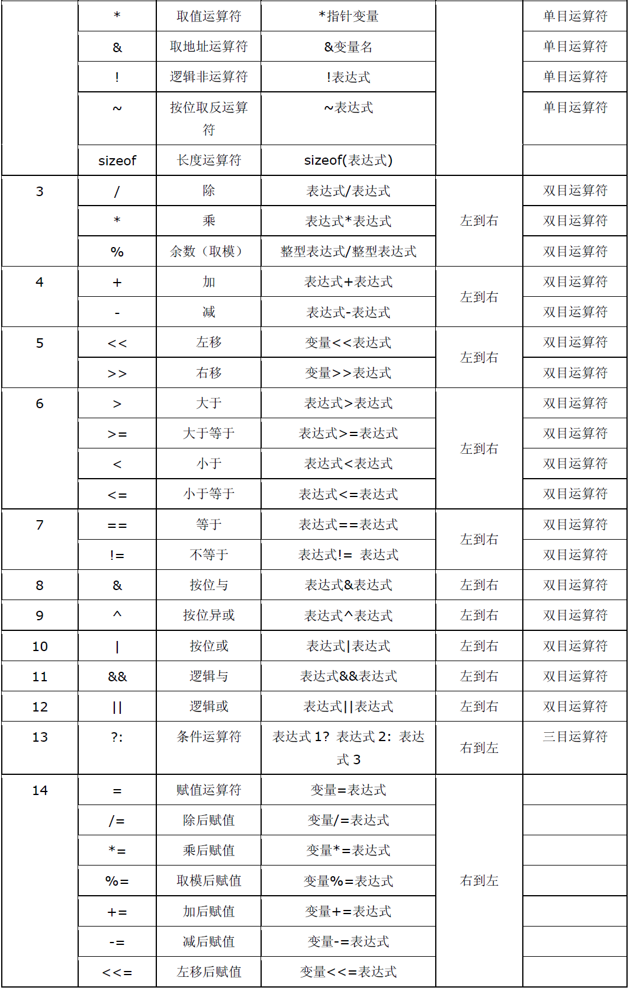

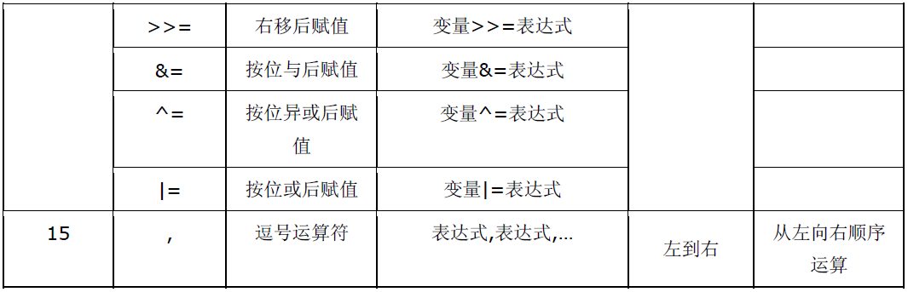

注：同一优先级的运算符，运算次序由结合方向所决定。（方便别人阅读你的源码，记得加上括号）

**一些容易出错的优先级问题**：

| 优先级问题                                     | 表达式               | 实际结果                                              |
| ---------------------------------------------- | -------------------- | ----------------------------------------------------- |
| . 的优先级高于\*<br />->操作符用于消除这个问题 | \*p.f                | 对 p 取 f 偏移，作为指针，然后进行解引用操作。\*(p.f) |
| []高于\*                                       | int \*ap[]           | ap是个元素为int指针的数组，int \*(ap[])               |
| 函数()高于\*                                   | int \*fp()           | fp是个函数，返回int \*<br />int \*(fp())              |
| == 和 != 高于位操作                            | (val \& mask != 0)   | val \& (mask != 0)                                    |
| == 和 != 高于赋值操作                          | c = getchar() != EOF | c = (getchar() != EOF)                                |
| 算术运算符高于位移运算符                       | msb << 4 + lsb       | msb << (4 + lsb)                                      |
| 逗号运算符在所有运算符中优先级最低             | i = 1, 2             | (i = 1), 2                                            |

### C语言中的类型转换

c语言中有两种转换类型，分别是：隐式转换和显示转换(强制类型转换)

  隐式转换的规则：

  a.算术运算中，低类型转换为高类型

  b.赋值运算中，表达式的类型转换为左边变量的类型

  c.函数调用时，实参转换成形参的类型

  d.函数返回值，return表达式转换为返回值的类型

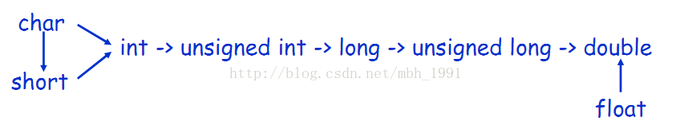

注意：在使用C语言的时候，应该特别注意数据的类型是否相同，尽量避免隐式转换带来的不必要的麻烦~~~

## 第三章 预处理

### 表-预处理指令

| 预处理名称 | 意义                                                         |
| ---------- | ------------------------------------------------------------ |
| #define    | 宏定义                                                       |
| #undef     | 撤销已定义过的宏名                                           |
| #include   | 使编译程序将另一源文件嵌入到带有#include 的源文件中          |
| #if        | #if 的一般含义是如果#if 后面的常量表达式为tue,则编译它与#endif间的代码，否则跳过这些代码。命令#endif标识一个#if块的结束。#else命令的功能有点象  语言中的 else ，#else 建立另一选择(在#if 失败的情况下)。#elif 命令意义与 else if 相同，它形成一个if else-if 阶梯状语句，可进行多种编译选择。 |
| #else      |                                                              |
| #elif      |                                                              |
| #endif     |                                                              |
| #ifdef     | 用#ifdef与#indef命令分别表示“如果有定义”及“如果无定义”，是条件编译的另一种方法。 |
| #ifndef    |                                                              |
| #line      | 改变当前行数和文件名称，它们是在编译程序中预先定义的标识符<br/>命令的基本形式如下:<br/>#ine number"filename" |
| #error     | 编译程序时，只要遇到 #error 就会生成一个编译错误提示消息，并停止编译 |
| #pragram   | 为实现时定义的命令，它允许向编译程序传送各种指令例如，编译程序可能有一种选择，它支持对程序执行的跟踪。可用#pragma 语句指定一个跟踪选择。 |

另外ANSI 标准C 还定义了如下几个宏：

`_LINE_` 表示正在编译的文件的行号

`_FILE_` 表示正在编译的文件的名字

`_DATE_`
表示编译时刻的日期字符串，例如： "25 Dec 2007"

`_TIME_`
表示编译时刻的时间字符串，例如： "12:30:55"

`_STDC_`
判断该文件是不是定义成标准 C 程序

如果编译器不是标准的，则可能仅支持以上宏的一部分，或根本不支持。当然编译器也有可能还提供其它预定义的宏名。注意：宏名的书写由标识符与两边各二条下划线构成。

### 3.1 宏定义

```c
// 数值宏常量
#define PI 3.141592654
// 字符串宏常量
#define ENG_PATH_1 E:\English\listen_to_this\listen_to_this_3
#define ENG_PATH_2 "E:\English\listen_to_this\listen_to_this_3"
```

#### 注意

- 一切宏都不能有分号
- 不能宏定义注释符号
- 宏定义表达式，不要吝啬括号（最外层的括号也不要省）。  
  宏函数在代码编译前会直接用你提供的参数替换掉函数中的形参，这个过程是文本替换；而不是函数调用时的参数传递（值传递，在函数调用时将参数的值传递到函数）。

### 3.3 #include 文件包含

表示预处理到系统规定的路径中去获得这个文件（即C 编译系统所提供的并存放在指定的子目录下的头文件）。找到文件后，用文件内容替换该语句。

```c
#include <filename>
```

双引号表示预处理应在当前目录中查找文件名为filename 的文件，若没有找到，则按系统指定的路径信息，搜索其他目录。找到文件后，用文件内容替换该语句。

```c
#include "filename"
```

#include 是将已存在文件的内容嵌入到当前文件中。支持相对路径，格式如trackant(蚁迹寻踪)所写：

```
.代表当前目录，..代表上层目录
```

### 3.4 #error 预处理

#error 预处理指令的作用是，编译程序时，只要遇到#error 就会生成一个编译错误提示消息，并停止编译。其语法格式为：

```c
#error error message
```

注意，宏串error-message 不用双引号包围。遇到#error 指令时，错误信息被显示可能同时还显示编译程序作者预先定义的其他内容。

### 3.5 #line 预处理

#line 的作用是改变当前行数和文件名称，它们是在编译程序中预先定义的标识符命令的基本形式如下：

```c
#line number["filename"] //其中[]内的文件名可以省略。
例如： #line 30 a.h
```

其中，文件名a.h 可以省略不写。这条指令可以改变当前的行号和文件名，例如上面的这条预处理指令就可以改变当前的行号为30，文件名是a.h。

初看起来似乎没有什么用，不过，他还是有点用的，那就是用在编译器的编写中，我们知道编译器对C 源码编译过程中会产生一些中间文件，通过这条指令，可以保证文件名是固定的，不会被这些中间文件代替，有利于进行分析。

### 3.6 #pragma 预处理

#pragma 指令的作用是设定编译器的状态或者是指示编译器完成一些特定的动作。

#pragma 指令对每个编译器给出了一个方法,在保持与C 和C ++语言完全兼容的情况下,给出主机或操作系统专有的特征。依据定义,编译指示是机器或操作系统专有的,且对于每个编译器都是不同的。

格式，其中para为参数：

```c
#pragma para
```

**#pragma message**

message 参数：能够在编译信息输出窗口中输出相应的信息。

```c
#pragma message("消息文本")
```

当编译器遇到这条指令时就在编译输出窗口中将消息文本打印出来。

当我们在程序中定义了许多宏来控制源代码版本的时候，我们自己有可能都会忘记有没有正确的设置这些宏，此时我们可以用这条指令在编译的时候就进行检查。假设我们希望判断自己有没有在源代码的什么地方定义了`_X86` 这个宏可以用下面的方法：

```c
#ifdef _X86
#Pragma message("_X86 macro activated!")
#endif
```

当定义了`_X86` 这个宏以后，应用程序在编译时就会在编译输出窗口里显示‚`"_X86 macro activated!"`。

**#pragme code_seg**

```c
#pragma code_seg( ["section-name"[,"section-class"] ] )
```

能够设置程序中函数代码存放的代码段，当我们开发驱动程序的时候就会使用到它

**#pragma once**

在头文件的最开始加入这条指令就能够保证头文件被编译一次，这条指令实际上在Visual C++6.0 中就已经有了，但是考虑到兼容性并没有太多的使用它。

**#pragma hdrstop**

#pragma hdrstop 表示预编译头文件到此为止，后面的头文件不进行预编译。

BCB 可以预编译头文件以加快链接的速度，但如果所有头文件都进行预编译又可能占太多磁盘空间，所以使用这个选项排除一些头文件。

有时单元之间有依赖关系，比如单元A 依赖单元B，所以单元B 要先于单元A 编译。你可以用#pragma startup 指定编译优先级，如果使用了#pragma package(smart_init) ，BCB就会根据优先级的大小先后编译。

**#pragma resource**

```c
#pragma resource "*.dfm" // 表示把*.dfm 文件中的资源加入工程。*.dfm 中包括窗体外观的定义。
```

**#pragma warning**

```c
#pragma warning( disable : 4507 34; once : 4385; error : 164 )
等价于：
#pragma warning(disable:4507 34) // 不显示 4507 和 34 号警告信息
#pragma warning(once:4385) // 4385 号警告信息仅报告一次
#pragma warning(error:164) // 把164 号警告信息作为一个错误。同时这个pragma warning 也支持如下格式：
#pragma warning( push [ ,n ] )
#pragma warning( pop )
这里n 代表一个警告等级(1---4)。
#pragma warning( push ) // 保存所有警告信息的现有的警告状态。
#pragma warning( push, n) // 保存所有警告信息的现有的警告状态，并且把全局警告等级设定为n。
#pragma warning( pop ) // 向栈中弹出最后一个警告信息，在入栈和出栈之间所作的一切改动取消。例如：
    
#pragma warning( push )
#pragma warning( disable : 4705 )
#pragma warning( disable : 4706 )
#pragma warning( disable : 4707 )
//.......
#pragma warning( pop )
在这段代码的最后，重新保存所有的警告信息(包括4705，4706 和4707)。

```

**#pragma comment**

```c
#pragma comment(...)
```

该指令将一个注释记录放入一个对象文件或可执行文件中。
常用的lib 关键字，可以帮我们连入一个库文件。比如：

```c
#pragma comment(lib, "user32.lib")
```

该指令用来将user32.lib 库文件加入到本工程中。

linker:将一个链接选项放入目标文件中,你可以使用这个指令来代替由命令行传入的或者在开发环境中设置的链接选项,你可以指定/include 选项来强制包含某个对象,例如:

```c
#pragma comment(linker, "/include:__mySymbol")
```

**#pragma pack**

```c
struct TestStruct1
{
    char c1;
    short s;
    char c2;
    int i;
};
```

**为什么会有内存对齐？**

字，双字，和四字在自然边界上不需要在内存中对齐。（对字、双字、四字来说，自然边界分别是偶数地址、可以被4 整除的地址、可以被8 整除的地址。）

为了提高程序的性能，数据结构（尤其是栈）应该尽可能地在自然边界上对齐。原因在于，为了访问未对齐的内存，处理器需要作两次内存访问；然而，对齐的内存访问仅需要一次访问。

一个字或双字操作数跨越了4 字节边界，或者一个四字操作数跨越了8 字节边界，被认为是未对齐的，从而需要两次总线周期来访问内存。

缺省情况下，编译器默认将结构、栈中的成员数据进行内存对齐。因此，上面的程序输出就变成了：

```c
c1 00000000, s 00000002, c2 00000004, i 00000008
```

编译器将未对齐的成员向后移，将每一个都成员对齐到自然边界上，从而也导致了整个结构的尺寸变大。尽管会牺牲一点空间（成员之间有部分内存空闲），但提高了性能。也正是这个原因，我们不可以断言sizeof(TestStruct1)的结果为8。在这个例子中，sizeof(TestStruct1)的结果为12。

**如何避免内存对齐的影响**

小技巧，将上述的结构体改成：

```c
struct TestStruct2
{
    char c1;
    char c2;
    short s;
    int i;
};
```

每个成员都对齐在其自然边界上，从而避免了编译器自动对齐。在这个例子中，sizeof(TestStruct2)的值为8。

这个技巧有一个重要的作用，尤其是这个结构作为API的一部分提供给第三方开发使用的时候。第三方开发者可能将编译器的默认对齐选项改变，从而造成这个结构在你的发行的DLL 中使用某种对齐方式，而在第三方开发者那里却使用另外一种对齐方式。这将会导致重大问题。

比如，TestStruct1 结构，我们的DLL 使用默认对齐选项，对齐为：

```
c1 00000000, s 00000002, c2 00000004, i 00000008，同时sizeof(TestStruct1)的值为12。
```

而第三方将对齐选项关闭，导致

```
c1 00000000, s 00000001, c2 00000003, i 00000004，同时sizeof(TestStruct1)的值为8。
```

还可以利用#pragma pack ()来改变编译器的默认对齐方式（当然一般编译器也提供了一些改变对齐方式的选项，这里不讨论）。

使用指令#pragma pack (n)，编译器将按照n 个字节对齐。
使用指令#pragma pack ()，编译器将取消自定义字节对齐方式。
在#pragma pack (n)和#pragma pack ()之间的代码按n 个字节对齐。

但是，成员对齐有一个重要的条件,即每个成员按自己的方式对齐。也就是说虽然指定了按n 字节对齐，但并不是所有的成员都是以n 字节对齐。其对齐的规则是，每个成员按其类型的对齐参数(通常是这个类型的大小)和指定对齐参数(这里是n 字节)中较小的一个对齐，即：min( n, sizeof( item )) 。并且结构的长度必须为所用过的所有对齐参数的整数倍,不够就补空字节。

### 补充 内存对齐

1、结构体为什么要内存对齐（也叫字节对齐）：

所谓的结构体地址，就是结构体第一个元素的地址。如果结构体各个元素之间不存在内存对齐问题，他们都挨着排放的。对于32位机，32位编译器(这是目前常见的环境，其他环境也会有内存对齐问题)，就很可能操作一个问题，就是当你想要去访问结构体中的一个数据的时候，需要你操作两次数据总线，因为这个数据卡在中间，如图：

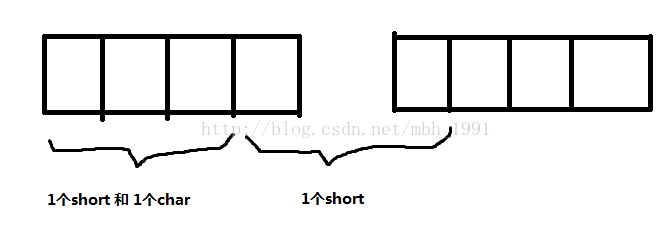

在上图中，对于第2个short数据进行访问的时候，在32位机器上就要操作两次数据总线。这样会非常影响数据读写的效率，所以就引入了内存对齐的问题。

另外一层不太重要的原因是：某些硬件平台只能从规定的地址处取某些特定类型的数据，否则会抛出硬件异常。

内存对齐的规则：

- 第一个成员起始于0偏移处
- 每个成员按其类型大小和指定对齐参数n中较小的一个进行对齐
- 结构体总长度必须为所有对齐参数的整数倍
- 对于数组，可以拆开看做n个数组元素

例子1：

```c
#include <stdio.h>  
struct _tag_str1  
{  
    char a;  
    int b;  
    short c;  
}str1;  
  
struct _tag_str2  
{  
    char a;  
    short c;  
    int b;  
}str2;  
  
int main()  
{  
    printf("sizeof str1 %d\n",sizeof(str1));  
    printf("sizeof str2 %d\n",sizeof(str2));  
    return 0;  
}   
```

输出的结果分别是：str1为12   str2为8，分析的过程如下图：

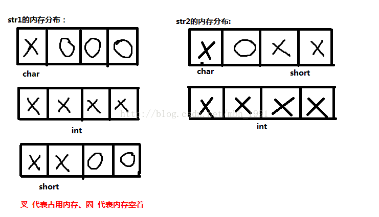

例子2：

```c
#include <stdio.h>  
  
#pragma pack(8)  
//#pragma pack(4)  
struct S1  
{  
    short a;  
    long b;  
};  
  
struct S2  
{  
    char c;  
    struct S1 d;  
    double e;  
};  
  
#pragma pack()  
  
int main()  
{  
    struct S2 s2;  
      
    printf("%d\n", sizeof(struct S1));  
    printf("%d\n", sizeof(struct S2));  
    printf("%d\n", (int)&(s2.d) - (int)&(s2.c));  
  
    return 0;  
}  
```

分析下在4字节对齐的情况输出的是：S2是20，S1是8：

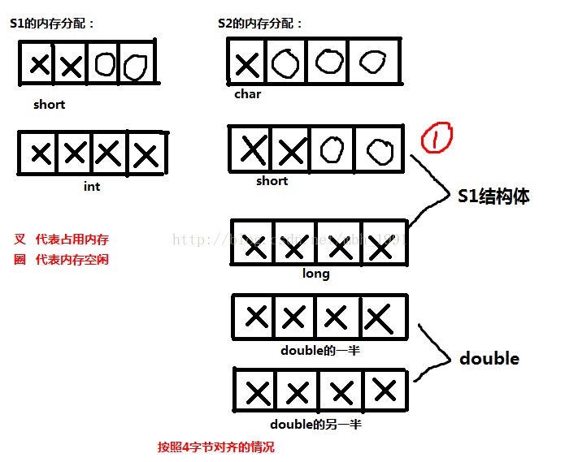

在4字节对齐的情况中，有一个问题值得注意：就是图中画1的地方。这里面本应short是可以上去的。但是对于结构体中的结构体一定要十分警惕，S1是一体的，short已经由于long进行了内存对齐，后面还空了两个字节的内存，其实此时的short已经变成了4个字节了！！！即结构体不可拆，不管是多少字节对齐，他们都是一体的。所有的圈都变成了叉。所以说结构体只能往前篡位置，不能改变整体。

分析下8字节对齐的情况，如图：

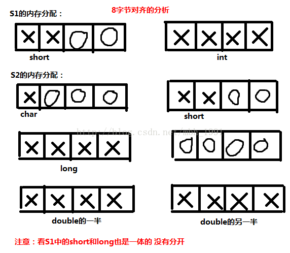

同样，到这里又有一个字节对齐的原则要好好重申一下：就是以什么为对齐参数，首先我们要知道编译器或者自己定义的是多少字节对齐的，这个数为n。

然后我们要看这个结构体中的各个数据类型，找到所占字节数最大的类型，为m。如果n大于m，就以m为对齐参数，比如说一个4字节对齐的结构体中都是short，那这个结构体以什么为对齐参数，当然是2了，如果m大于n，就以n为对齐参数，比如说在4字节对齐的情况下的double类型。

### 3.7 #运算符

如果希望在字符串中包含宏参数，可以使用"#"，可以把语言符号转化为字符串

```c
#define SQR(x) printf("The square of "#x" is %d.\n", ((x)*(x)));

// 使用SQR(8)，输出为：
The square of 8 is 64.
```

### 3.8 ##预算符

可以用于宏函数的替换部分。这个运算符把两个语言符号组合成单个语言符号。例子：

```c
#define XNAME(n) x ## n
```

XNAME(8)，会展开为x8。本质上就是一个粘合剂。

**注意：#号和##号都必须只能在宏定义中使用，不能使用在其他地方**

## 第四章 指针与数组

### 4.1 指针

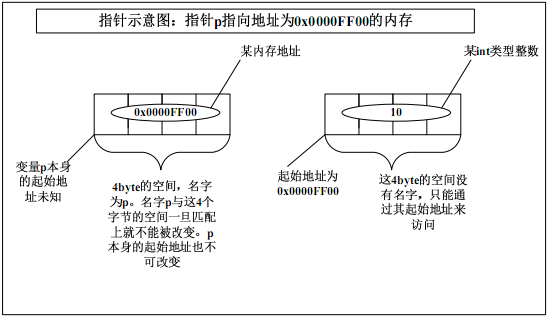

p 称为指针变量，p 里存储的内存地址处的内存称为p 所指向的内存。指针变量p 里存储的任何数据都将被当作地址来处理。

#### int \*p = NULL 和\*p = NULL 有什么区别

```c
int *p = NULL;
```

通过编译器查看p 的值为0x00000000。这句代码的意思是：定义一个指针变量p，其指向的内存里面保存的是int 类型的数据；在定义变量p 的同时把p 的值设置为0x00000000，而不是把*p 的值设置为0x00000000。

```c
int *p;
*p = NULL;
```

第一行代码，定义了一个指针变量p，其指向的内存里面保存的是int 类型的数据；但是这时候变量p 本身的值是多少不得而知，也就是说现在变量p 保存的有可能是一个非法的地址。

第二行代码，给*p 赋值为NULL，即给p指向的内存赋值为NULL；但是由于p 指向的内存可能是非法的，所以调试的时候编译器可能会报告一个内存访问错误。

（**所以说出现指针时，一定要初始化**）

### 4.2 数组

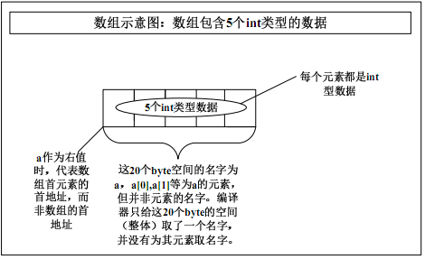

#### `&a[0]` 和 `&a` 的区别

在大多数情况下，`&a[0]` 和 `&a` 的值（即它们在内存中的地址）是相同的，因为它们都指向数组 `a` 的起始地址。不过，它们的类型不同：

- `&a[0]` 的类型是 `类型 *`（例如，如果 `a` 是 `int` 数组，那么它的类型是 `int *`）。
- `&a` 的类型是 `类型 (*)[N]`（例如，如果 `a` 是 `int` 数组且大小为 `N`，那么它的类型是 `int (*)[N]`）。

虽然值（地址）相同，但它们的类型不同，这可能会影响它们在运算或函数调用中的使用。

#### 数组名 a 作为左值和右值的区别

a 作为右值：

当a 作为右值的时候代表的是什么意思呢？很多书认为是数组的首地址，其实这是非常错误的。a 作为右值时其意义与&a[0]是一样，代表的是数组首元素的首地址，而不是数组的首地址。这是两码事。但是注意，这仅仅是代表，并没有一个地方（这只是简单的这么认为，其具体实现细节不作过多讨论）来存储这个地址，也就是说编译器并没有为数组a分配一块内存来存其地址，这一点就与指针有很大的差别。

a 不能作为左值：

编译器会认为数组名作为左值代表的意思是a 的首元素的首地址，但是这个地址开始的一块内存是一个总体，我们只能访问数组的某个元素而无法把数组当一个总体进行访问。所以我们可以把a[i]当左值，而无法把a当左值。其实我们完全可以把a 当一个普通的变量来看，只不过这个变量内部分为很多小块，我们只能通过分别访问这些小块来达到访问整个变量a 的目的。

### 4.3 指针与数组

| 指针                                                         | 数组                                                         |
| ------------------------------------------------------------ | ------------------------------------------------------------ |
| 保存数据的地址，任何存入指针变量p的数据都会被当作地址来处理。p本身的地址由编译器另外存储，存储在哪里我们并不知道。 | 保存数据，数组名a代表的是数组首元素的首地址而不是数组的首地址。<br />&a才是整个数组的首地址。a本身的地址由编译器另外存储，存储在哪里，我们并不知道。 |
| 间接访问数据，首先取得指针变量p的内容，把它作为地址，然后从这个地址提取数据或向这个地址写入数据。<br />指针可以以指针的形式访问`*(p+i)`; 也可以以下标的形式访问 p[i]但其本质都是先取p的内容然后加上`i*sizeof(类型)`个 byte 作为数据的真正地址。 | 直接访问数据，数组名a是整个数组的名字，数组内每个元素并没有名字。只能通过“具名+匿名”的方式来访问其某个元素，不能把数组当一个整体来进行读写操作。<br />数组可以以指针的形式访问`*(a+i)`:也可以以下标的形式访问 a[i]。但其本质都是a所代表的数组首元素的首地址加上`i*sizeof(类型)`个 byte 作为数据的真正地址: |
| 通常用于动态数据结构                                         | 通常用于存储固定数目且数据类型相同的元素。                   |
| 相关的函数为malloc和free                                     | 隐式分配和删除                                               |

### 4.4 指针数据和数组指针的内存布局

指针数据：指针数组：首先它是一个数组，数组的元素都是指针，数组占多少个字节由数组本身决定。它是“储存指针的数组”的简称。

数组指针：首先它是一个指针，它指向一个数组。在32 位系统下永远是占4 个字节，至于它指向的数组占多少字节，不知道。它是“指向数组的指针”的简称。

```c
A)，int *p1[10]; // 指针数组
B)，int (*p2)[10]; // 数组指针
```

“[]”的优先级比“\*”要高。p1 先与“[]”结合，构成一个数组的定义，数组名为p1，int *修饰的是数组的内容，即数组的每个元素。

p2 就更好理解了，在这里“（）”的优先级比“[]”高，“\*”号和p2 构成一个指针的定义，指针变量名为p2，int 修饰的是数组的内容，即数组的每个元素。数组在这里并没有名字，是个匿名数组。那现在我们清楚p2 是一个指针，它指向一个包含10 个int 类型数据的数组，即数组指针。我们可以借助下面的图加深理解：

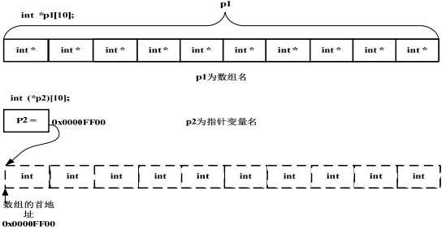

### 4.6 数组参数和指针参数

形参：声明或定义函数时的参数

实参：在调用函数时主调函数传递过来的实际值

#### 一维数组参数

一维数组作为函数的参数，应该是一个char*类型的参数；实际传递的数组大小与函数形参指定的数组大小没有关系（详见2的情况）。

```c
// 1、直接明确是个指针
void fun(char *p)
{
    char c = p[3]; //或者是char c = *(p+3);
}

// 2、传入b，b就是个char*；实际传递的数组大小与函数形参指定的数组大小没有关系
void fun(char a[10])
{
    char c = a[3];
}
int main()
{
    char b[100] = "abcdefg";
    fun(b);
    return 0;
}

// 3、改写成这样或许比较好，至少不会让人误会成只能传递一个10 个元素的数组。
void fun(char a[ ])
{
    char c = a[3];
}
```

#### 一级指针参数

**能否把指针变量本身传递给一个函数**

```c
void fun(char *p)
{
    char c = p[3]; //或者是char c = *(p+3);
}
intmain()
{
    char *p2 = ‚abcdefg‛;
    fun(p2);
    return 0;
}
```

p2 是main 函数内的一个局部变量，它只在main 函数内部有效。（这里需要澄清一个问题：main 函数内的变量不是全局变量，而是局部变量，只不过它的生命周期和全局变量一样长而已。全局变量一定是定义在函数外部的。初学者往往弄错这点。）既然它是局部变量，fun 函数肯定无法使用p2 的真身。那函数调用怎么办？好办：对实参做一份拷贝并传递给被调用的函数。即对p2 做一份拷贝，假设其拷贝名为`_p2`。那传递到函数内部的就是`_p2` 而并非p2 本身

**无法把指针变量本身传递给一个函数**

所以fun 函数实际运行时，用到的都是`_p2` 这个变量而非p2 本身

```c
void GetMemory（char * p, int num）
{
    p = (char *)malloc(num*sizeof(char));
}
int main()
{
    char *str = NULL;
    GetMemory(str，10);
    strcpy(str,"hello");
    free（str）；//free 并没有起作用，内存泄漏
    return 0;
}
```

在运行strcpy(str,‛hello‛)语句的时候发生错误。这时候观察str 的值，发现仍然为NULL。也就是说str 本身并没有改变，我们malloc 的内存的地址并没有赋给str，而是赋给了`_str`。而这个`_str` 是编译器自动分配和回收的，我们根本就无法使用。

方法一，用return：

```c
char * GetMemory（char * p, int num）
{
    p = (char *)malloc(num*sizeof(char));
    return p；
}
int main()
{
    char *str = NULL;
    str = GetMemory（str，10）;
    strcpy(str,‛hello‛);
    free（str）；
    return 0;
}
```

方法二，用二级指针：

```c
void GetMemory（char ** p, int num）
{
    *p = (char *)malloc(num*sizeof(char));
    return p；
}
intmain()
{
    char *str = NULL;
    GetMemory（&str，10）;
    strcpy(str,‛hello‛);
    free（str）；
    return 0;
}
```

这里的参数是\&str而非str。这样的话传递过去的是str 的地址，是一个值。在函数内部，用钥匙（“\*”）来开锁：\*(&str)，其值就是str。所以malloc 分配的内存地址是真正赋值给了str 本身。

### 4.7 函数指针

#### 函数指针的定义

函数指针就是函数的指针。它是一个指针，指向一个函数。

#### 函数指针与指针函数

1、对于函数名来说，它是函数的入口，其实函数的入口就是一个地址，这个函数名也就是这个地址。这一点用汇编语言的思想很容易理解。下面一段代码说明函数名其实就是一个地址：

```c
#include <stdio.h>  
#include <stdlib.h>  
#include <stdbool.h>  

void abc()  
{  
    printf("hello fun\n");  
}  
int main(int argc, char *argv[])   
{  
    void (*d)();  
    void (*p)();  
    p = abc;  
    abc();  
    printf("%p\n",abc);  
    printf("%p\n",&abc);//函数abc的地址0x40138c  
    p();  
    (*p)();       
    d = ((unsigned int*)0x40138c);  //其实就算d= 0x40138c这么给赋值也没问题   
    d();  
    return 0;  
}   
```

2、函数指针最重要的是它的应用环境，如回调函数(其实就是利用函数指针，把函数当作参数进行传递)，还有中断处理函数。

回调函数原理代码：

```c
#include <stdio.h>  
  
typedef int(*FUNCTION)(int);  // FUNCTION函数指针变量，指向一个函数
  
int g(int n, FUNCTION f)  
{  
    int i = 0;  
    int ret = 0;  
      
    for(i=1; i<=n; i++)  
    {  
        ret += i*f(i);  
    }  
      
    return ret;  
}  
  
int f1(int x)  
{  
    return x + 1;  
}  
  
int f2(int x)  
{  
    return 2*x - 1;  
}  
  
int f3(int x)  
{  
    return -x;  
}  
  
int main()  
{  
    printf("x * f1(x): %d\n", g(3, f1));  
    printf("x * f2(x): %d\n", g(3, &f2));  
    printf("x * f3(x): %d\n", g(3, f3));  
}  
```

**注意：可以使用函数名f2，函数名取地址&f2都可以，但是不能有括号**。

3、指针函数就是一个返回值为指针的函数而已

#### 函数指针数组

函数指针pf

```c
char* (*pf)(char* p)
```

函数指针数组，一个数组，数组名为pf，数组内存储了3个指向函数的指针。这些指针指向一些返回值类型为指向字符的指针、参数为一个指向字符的指针的函数。

```c
char* (*pf[3])(char* p)
```

使用：

```c
#include <stdio.h>
#include <string.h>
char* fun1(char* p)
{
    printf("%s\n",p);
    return p;
}
char* fun2(char* p)
{
    printf("%s\n",p);
    return p;
}
char* fun3(char* p)
{
    printf("%s\n",p);
    return p;
}
int main()
{
    char * (*pf[3])(char* p);
    pf[0] = fun1; // 可以直接用函数名
    pf[1] = &fun2; // 可以用函数名加上取地址符
    pf[2] = &fun3; 
    pf[0]("fun1"); // 调用 fun1，打印 "fun1"
    pf[0]("fun2"); // 调用 fun1，打印 "fun2"
    pf[0]("fun3"); // 调用 fun1，打印 "fun3"
    return 0;
}
```

## 第五章 内存管理

### 5.1 野指针

定义指针变量的同时最好初始化为NULL，用完指针之后也将指针变量的值设置为NULL。也就是说除了在使用时，别的时间都把指针“栓”到0 地址处。（就是内存的0 地址处，也就是NULL 地址处）

### 5.2 栈、堆和静态区

堆：heap；栈：stack，也翻译成堆栈。

**内存分为三个部分：静态区、栈、堆**

静态区：

- 保存自动全局变量和static 变量（包括static 全局和局部变量）。  
- 静态区的内容在总个程序的生命周期内都存在，由编译器在编译的时候分配。

栈：

- 保存局部变量。
- 栈上的内容只在函数的范围内存在，当函数运行结束，这些内容也会自动被销毁。
- 特点是效率高，但空间大小有限

堆：

- 由malloc 系列函数或new 操作符分配的内存。
- 其生命周期由free 或delete 决定。在没有释放之前一直存在，直到程序结束。
- 其特点是使用灵活，空间比较大，但容易出错。

### 5.3 常见的内存错误及对策

#### 1、指针没有指向一块合法的内存

定义了指针变量，但是没有为指针分配内存，即指针没有指向一块合法的内存。

##### **结构体成员指针未初始化**

```c
struct student
{
    char *name; // 只是给name这个指针变量本身分配了4 个字节。name 指针并没有指向一个合法的地址，这时候其内部存的只是一些乱码。
    int score;
}stu,*pstu;

int main()
{
    strcpy(stu.name,"Jimy"); // 所以在调用strcpy 函数时，会将字符串"Jimy"往乱码所指的内存上拷贝，而这块内存name 指针根本就无权访问，导致出错
    stu.score = 99;
    return 0;
}
```

```c
int main()
{
    pstu = (struct student*)malloc(sizeof(struct student)); // 为指针变量pstu 分配了内存，但是同样没有给name 指针分配内存。同样没有为name指针分配内存
    strcpy(pstu->name,"Jimy");
    pstu->score = 99;
    free(pstu);
    return 0;
}
```

解决的办法：为name 指针malloc 一块空间。

##### **没有为结构体指针分配足够的内存**

```c
int main()
{
    pstu = (struct student*)malloc(sizeof(struct student*));
    strcpy(pstu->name,"Jimy");
    pstu->score = 99;
    free(pstu);
    return 0;
}
```

为pstu 分配内存的时候，分配的内存大小不合适。这里把sizeof(struct student)误写为sizeof(struct student*)。当然name 指针同样没有被分配内存。解决办法同上。

##### **\*函数的入口校验**

在使用指针之前一定要确保指针是有效的。

一般**在函数入口处使用assert(NULL != p)对参数进行校验**。在**非参数的地方使用if（NULL != p）来校验**。但这都有一个**要求，即p 在定义的同时被初始化为NULL 了**。比如上面的例子，即使用if（NULL != p）校验也起不了作用，因为name 指针并没有被初始化为NULL，其内部是一个非NULL 的乱码。

> assert 是一个宏，而不是函数，包含在assert.h 头文件中。
>
> 如果其后面括号里的值为假，则程序终止运行，并提示出错；如果后面括号里的值为真，则继续运行后面的代码。这个宏只在Debug 版本上起作用，而在Release 版本被编译器完全优化掉，这样就不会影响代码的性能。
>
> **注意：assert 宏只是帮助我们调试代码用的，它的一切作用就是让我们尽可能的在调试函数的时候把错误排除掉，而不是等到Release 之后。它本身并没有除错功能。再有一点就是，参数出现错误并非本函数有问题，而是调用者传过来的实参有问题。assert 宏可以帮助我们定位错误，而不是排除错误。**

#### 2、为指针分配的内存太小

为指针分配了内存，但是内存大小不够，导致出现越界错误。

```c
char *p1 = "abcdefg";
char *p2 = (char*)malloc(sizeof(char)*strlen(p1));
strcpy(p2,p1);
```

p1 是字符串常量，其长度为7 个字符，但其所占内存大小为8 个byte。初学者往往忘了字符串常量的结束标志“\0”。这样的话将导致p1 字符串中最后一个空字符“\0”没有被拷贝到p2 中。

解决办法：加上这个字符串结束标识符

```c
char *p2 = (char *)malloc(sizeof(char)*strlen(p1)+1*sizeof(char));
```

**注意：只有字符串常量才有结束标志符**。以下写法就没有结束标识符：

```c
char a[7] = {‘a’,’b’,’c’,’d’,’e’,’f’,’g’};
```

不要因为char 类型大小为1 个byte 就省略sizof（char）这种写法。这样只会使你的代码可移植性下降。

#### 3、内存分配成功，但并未初始化

记得初识为一个有效的值，如：

```c
int i = 10；
char *p = (char *)malloc(sizeof(char))；
```

不确定变量的初值，可以初始化为0或NULL：

```c
int i = 0；
char *p = NULL；
```

定义的是**数组**，可以这样初始化：

```c
int a[10] = {0};
```

或者用memset函数来初始化为0：

```c
memset(a,0,sizeof(a));
```

memset 函数有三个参数，第一个是要被设置的内存起始地址；第二个参数是要被设置的值；第三个参数是要被设置的内存大小，单位为byte

如果指针变量如果未被初始化，会导致if 语句或assert 宏校验失败。

#### 4、内存越界

内存分配成功，且已经初始化，但是操作越过了内存的边界。这种错误经常是由于操作数组或指针时出现“多1”或“少1”。

```c
int a[10] = {0};
for (i=0; i<=10; i++)
{
    a[i] = i;
}
```

所以，for 循环的循环变量一定要使用半开半闭的区间，而且如果不是特殊情况，循环变量尽量从0 开始。

#### 5、内存泄漏

会产生泄漏的内存就是堆上的内存（这里不讨论资源或句柄等泄漏情况），也就是说由malloc 系列函数或new 操作符分配的内存。如果用完之后没有及时free 或delete，这块内存无法释放，直到整个程序终止。

##### 如何使用malloc函数

malloc函数原型：

```c
(void *)malloc(int size)
```

malloc 函数的返回值是一个void 类型的指针，参数为int 类型数据，即申请分配的内存大小，单位是byte。内存分配成功之后，malloc 函数返回这块内存的首地址。

需要一个指针来接收这个地址。但是由于函数的返回值是void *类型的，所以必须强制转换成你所接收的类型。也就是说，这块内存将要用来存储什么类型的数据。比如：

```c
char *p = (char *)malloc(100);
```

在堆上分配了100 个字节内存，返回这块内存的首地址，把地址强制转换成char \*类型后赋给char \*类型的指针变量p。同时告诉我们这块内存将用来存储char 类型的数据。也就是说你**只能通过指针变量p 来操作这块内存。这块内存本身并没有名字，对它的访问是匿名访问**。

**malloc函数同样要注意**：所申请的内存块大于目前堆上剩余内存块（整块），则内存分配会失败，函数返回NULL。注意这里说的“堆上剩余内存块”不是所有剩余内存块之和，因为**malloc 函数申请的是连续的一块内存**。

既然malloc 函数申请内存有不成功的可能，那我们在使用指向这块内存的指针时，**必须用if（NULL ！= p）语句来验证内存确实分配成功了**

##### 内存释放

free 函数只有一个参数，就是所要释放的内存块的首地址。比如上例：
free(p);

malloc 函数分配的内存块是属于p 的，因为我们对这块内存的访问都需要通过p 来进行。free 函数就是把这块内存和p 之间的所有关系斩断。从此p 和那块内存之间再无瓜葛。  
至至于指针变量p 本身保存的地址并没有改变，但是它对这个地址处的那块内存却已经没有所有权了。  
那块被释放的内存里面保存的值也没有改变，只是再也没有办法使用了。

> **malloc的使用次数一定要和free相等，否则必有错误**

##### 内存释放之后

释放之后，需要重新把p的值变为NULL；

```c
p = NULL;
```

在free（p）之后，你用if（NULL ！= p）这样的校验语句还能起作用吗？例：

```c
char *p = (char *)malloc(100);
strcpy(p, “hello”);
free(p); /* p 所指的内存被释放，但是p 所指的地址仍然不变*/
// ⋯
if (NULL != p)
{
    /* 没有起到防错作用*/
    strcpy(p, “world”); /* 出错*/
}
```

释放完块内存之后，没有把指针置NULL，这个指针就成为了“野指针”，也有书叫“悬垂指针”。这是很危险的，而且也是经常出错的地方。所以一定要记住一条：**free 完之后，一定要给指针置NULL**。

#### 6、内存已经被释放，但是继续通过指针来使用

第一种：就是上面所说的，free（p）之后，继续通过p 指针来访问内存。解决的办法就是给p 置NULL。

第二种：函数返回栈内存。这是初学者最容易犯的错误。比如在函数内部定义了一个数组，却用return 语句返回指向该数组的指针。解决的办法就是弄明白栈上变量的生命周期。

第三种：内存使用太复杂，弄不清到底哪块内存被释放，哪块没有被释放。解决的办法是重新设计程序，改善对象之间的调用关系。

## 第六章 函数

### 6.3 函数递归

#### 一个简单但易出错的递归例子

示例：


```c
void fun(int i)
{
    if (i>0)
    {
        fun(i/2);
    }
    printf("%d\n",i);
}
int main()
{
    fun(10);
    return 0;
}

// 输出：
0
1
2
5
10
    
// 展开过程：
void fun(int i)
{
if (i>0)
{
//fun(i/2);
if(i/2>0)
{
if(i/4>0)
{
…
}
printf("%d\n",i/4);
}
printf("%d\n",i/2);
}
printf("%d\n",i);
}
```

#### 不使用任何变量编写strlen函数

不允许调用库函数，也不允许使用任何全局或局部变量编写`int my_strlen(char *strDest)`;

使用递归来实现：

```c
int my_strlen( const char* strDest )
{
    assert(NULL != strDest);
    if ('\0' == *strDest)
    { 
        return 0;
    }
    else
    {
        return (1 + my_strlen(++strDest));
    }
}
```

第一步：用assert 宏做入口校验。  
第二步：确定参数传递过来的地址上的内存存储的是否为'\0'。如果是，表明这是一个空字符串，或者是字符串的结束标志。  
第三步：如果参数传递过来的地址上的内存不为'\0'，则说明这个地址上的内存上存储的是一个字符。既然这个地址上存储了一个字符，那就计数为1，然后将地址加1 个char类型元素的大小，然后再调用函数本身。如此循环，当地址加到字符串的结束标志符'\0'时，递归停止。

更简洁的版本：

```c
int my_strlen( const char* strDest )
{
    assert(NULL != strDest);
    return ('\0' != *strDest)?(1+my_strlen(strDest+1)):0;
}
```

**递归的问题**：

每调用一遍my_strlen 函数，其实只判断了一个字节上的内容。但是，如果传入的字符串很长的话，就需要连续多次函数调用，而函数调用的开销比循环来说要大得多，所以，递归的效率很低，递归的深度太大甚至可能出现错误（比如栈溢出）。

不到万不得已，尽量不要用递归。即便是要用递归，也要注意递归的层次不要太深，防止出现栈溢出的错误；同时递归的停止条件一定要正确，否则，递归可能没完没了。
