# myC

## 总体

### 编译、运行

编辑器

编译器

IDE（集成开发环境）

### 程序框架

```c
#include <stdio.h>
int main()
{
    return 0;
}
```


## ­­­­第二周

### 变量

#### 定义

标识符，只能由字母、数字和下划线组成，数字不可以出现第一个位置上，C语言的关键字（保留字）不能用来做变量名

```C
auto
break
case
char
const
continue
default
do
double
continue
enum
extern
float
for
got
if
int
long
register
return
short
signer
sizeof
static
struc
switch
typedef
union
unsigned
void
volatile
while
inline
restrict
```

在计算机中变量没有初始化赋值，原来的位置是什么值就是什么值

定义了变量的类型后，变量的类型永远不会变

C99可以在变量使用之前的位置定义变量，ANSI C只能在代码开头的地方定义变量

#### 输入：

```c
scanf(“%d”, &price)
```

输入时需要加&

用变量来保存数据

 

### 常量

```c
contst int AMOUNT = 100;
```

const时一个修饰符，给这个变量加上一个不变的属性

 

### 浮点数

10.0和10在C语言中是两个完全不一样的数

在计算中就是带小数点的数

double float双精度浮点型  

```c
scanf(“%lf”, &foot)  printf(“%f”,foot)
```

single float 单精度浮点数

 

### 表达式

一系列运算符和算子的结合，算子可能是常数，也可能是变量

### 自加自减

++a：执行完这一行的语句之前+1

a++：执行完这一行的语句之后+1

### 运算符优先级

单目的运算符优先级比* / 高，自右向左

| 优先级 | 运算符 | 运算     | 结合关系 |
| ------ | ------ | -------- | -------- |
| 1      | +      | 单目不变 | 自右向左 |
| 1      | -      | 单目取反 | 自右向左 |
| 2      | *      | 乘       | 自左向右 |
| 2      | /      | 除       | 自左向右 |
| 2      | %      | 取余     | 自左向右 |
| 3      | +      | 加       | 自左向右 |
| 3      | -      | 减       | 自左向右 |
| 4      | =      | 赋值     | 自右向左 |

## 第三周

### 条件

关系运算的结果，如果成立就是整数1，不成立就是整数0

所有关系运算符的优先级比算数运算的低，但是比赋值运算的高

### 注释

 // 单行注释   /* */ 多行代码块注释

### if

有大括号 {}，建议总用{}，即使只有一条语句的时候

没有大括号，只能有一句代码

else总是和最近的那个if匹配

 

#### if-else常见错误

1、忘了大括号

永远在if和else后面加上大括号

2、if后面不加分号

3、错误使用= =和=

 

#### 代码风格

if和else之后必须加上大括号形成语句块

大括号之间的语句缩进一个tab位置

### switch-case

控制表达是只能是整数型的结果

常量可以是常数，也可以是常数计算的表达式

语句后面习惯加break，

不然会顺序执行到下面的case里去，知道遇到一个break，或者switch结束

```c
switch (控制表达式)
{
case 常量:
    语句
case 常量:
    语句
    …
default:
    语句
}
```


## 第四周

### while

循环体里面要有改变条件的语句，不然循环会停止不了

```c
do
{
    循环语句
}while（循环条件）；
进入循环前不检查，执行完一轮循环体的代码之后，在检查循环条件是否满足；至少会做一遍
while（循环条件）
{
    语句
}
```

先判断再执行语句，可能循环里一次也没有执行

### 三种循环：

有固定次数 ，用for

 

必须执行一次，用do-while

其他情况用while

（while语句需要用到++，--）

break：跳出循环

continue：进行下一次循环

 

### 从嵌套的循环中跳出

#### 1、设置标志位exit

 

if (exit ==1) break;

 

#### 2、goto  out：

尽量不要用


## 第六周

### 数据类型

C是一种有类型的语言，

使用前必须定义，并且确定类型

 

#### 类型安全：

强类型，明确的类型有助于尽早发现程序中的简单错误

早期的语言、面向底层的语言强调类型

C语言需要类型，但是对类型的安全检查并不足够

#### 类型：


int、long、double

```
%d  %ld  %lf
```


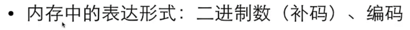

sizeof(int) sizeof(i)

给出某个类型在内存中所占据的字节数

静态运算符，结果在编译时刻就决定了

不要再sizeof的括号里做运算，这些运算不会做

#### 整数类型


##### 整数


##### 整数范围


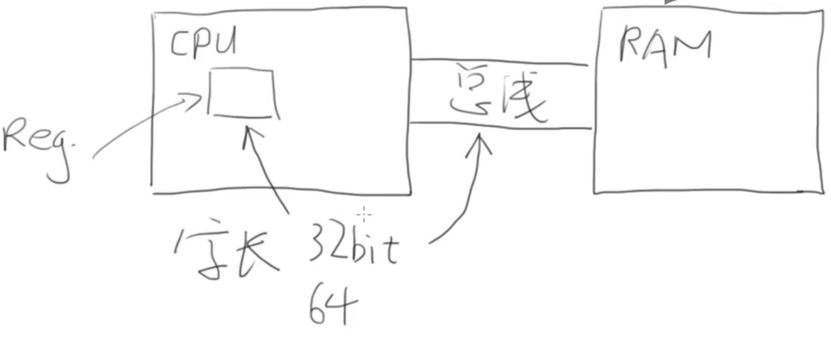

int一个寄存器的大小，cpu、reg.、总线上一样

##### 无符号

加个unsigned


#### 整数的内部表达

补码的意义就是拿补码和原码可以加出一个溢出的“零”

#### 整数的输入输出

 


0x：表示16进制

o：表示8进制

%o用于8进制，%x用于16进制

 

8进制和16进制只是如何把数字表达为字符串，与内部如何表达数字无关

16进制和适合表达二进制，因为4位二进制正好是一位16进制

 

%E 以科学计数法输出

 

#### 尽量选择整数类型

没有特殊需要就选择int

1）现在CPU的字长普遍是32位或64位，一次内存的读写就是一个int，一次计算也是一个int，选择更短的类型不会更快，甚至可能更慢

2）现在的编译器一般会设计内存对齐，所以更短的类型实际在内存中可能也占据一个int的大小（虽然sizeof告诉你更小）

3）unsigned与否只是输出的不同，内部的计算是一样的

#### 浮点类型

很接近0，0附近的数无法表达


计算机中的数是离散地表达的，比较多的位数打出来，有些数会没办法准确具体地表达


无穷大不能用整数表达，可以用浮点数表达

 

float需要用f或F后缀来表明身份


比能够表达的精度更小，以这种方式来表达判断相等

 

浮点数在计算时使用专用的硬件实现的


##### 没有特殊需要，只使用double

现代CPU能直接多double做硬件计算，性能不会比float差，在64位的机器上，数据存储的速度也不会比float慢

#### 字符类型

也是一种整数，特殊的类型：字符

%c 用来输入输出（%d会输出这个字符对应的数字，49和‘1’是相等的）

单引号表示字符

ASCII编码

#### bool类型

\#include <stdbool.h>

true/false 就是0、1

 

### 逃逸字符


### 类型转换

#### 自动类型转换


 

 

#### 强制类型转换

计算一个新的值出来，而不会改变变量的值和类型

强制类型转换的优先级高于四则运算


 

 

### 逻辑运算

x>4 && x<6


 


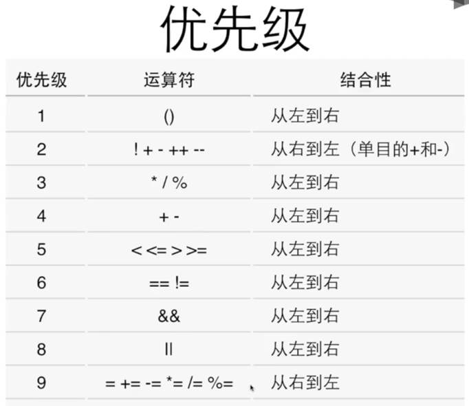

#### 短路：

如果左边的结果已经能够决定结果了，就不会做右边的计算


### 条件运算符


不希望使用嵌套的条件表达式

 

### 逗号运算符

在所有运算符里优先级最低

其实主要实在for中使用、

## 第七周

### 函数

代码复制时不良习惯

 

函数是一块代码，接受零个或多个参数，做一件事情，并返回零个或一个值

#### 函数定义


void表示没有返回值

#### 函数调用


函数知道是哪里调用它，会返回到正确的地方

 

#### return：


可以有多个return，但是一般不这样，因为出口太多

 

可以把返回值赋值给变量

可以再传递给函数

 

 


如果函数有返回值，必须使用带值的return

 

 

#### 函数原型、编译器

C的编译器自上而下顺序分析你的代码

函数的定义要写在前面

##### 正确方式

先函数声明（要以分好“;”结尾 ）

int main()

函数定义（定义和声明要相符合）

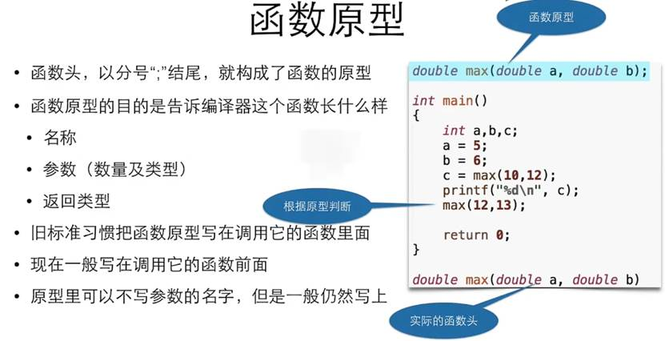

原型里可以不写参数的名字，但是一般仍然写上

 

#### 参数传递

##### 类型不匹配


##### 传值

 

C语言在调用函数时，永远只能传值给函数

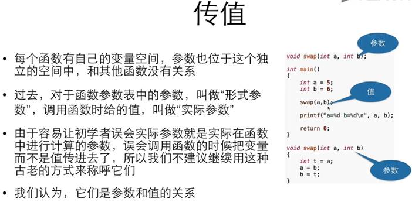

 

#### 本地变量

##### 定义

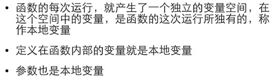

##### 变量的生存期和作用域


##### main里面的变量有自己的变量空间

##### 本地变量的规则

定义在块里面：函数的块内、语句的块内、随意拉一堆大括号来定义变量


### 一些细节


 

#### 确定函数没有参数，就要用void

#### 逗号运算符


#### main

C语言程序的如果，它本身也是个函数

可以int main()  int main(void)

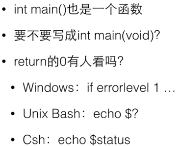

## 第八周

### 数组

#### 初试数组


#### 定义数组


 

所有元素具有相同的数据类型，一旦创建不能改变大小


#### 有效的下标范围

叫做下标或者索引

 

下标从0开始

 


 

长度为0的数组，int a[0] , 可以存在但是无用

#### 经典数组例子


### 数组运算

#### 集成初始化时的定位


 

#### 数组的大小

sizeof给出整个数组所占据的内容大小

 


 

数组变量本身不能被赋值，必须采用赋值


 

通常使用for循环


 

传入参数时还需用另一个参数length来传入数组的大小

 


### 二维数组

初始化


## 第九周

### 运算符&


 

%x：输出十六进制数

%p：输出地址

 

32位架构下是一样，64位下不一样

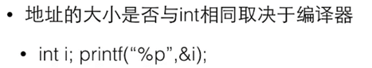

 

 

#### stack自高往低分配，4是一个int


 

#### 数组名是首地址

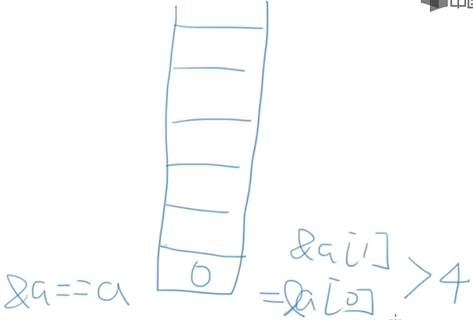

 

### scanf

如果能够将取得的变量的地址传递给一个函数，能否通过这个地址在那个函数内访问这个变量？

整数和地址不见得永远是相同的类型。

### 指针

就是保存地址的变量

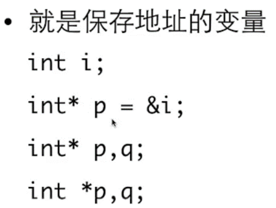

把*p作为一个整体，是一个int，指向指针的值所表示的地址上的变量


p里面的值就是i变量的地址

#### 指针变量


#### 作为参数的指针，要传入变量的地址


f函数里面拥有能够访问外面的i的能力

 

#### 访问那个地址上的变量*

这样可以


#### 左值之所以叫左值

不是变量而是值，是表达式计算

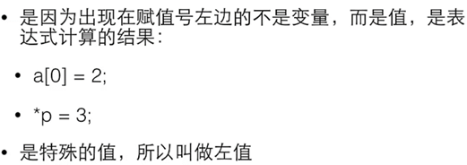

#### 指针的运算符& *]

互为相反的作用


#### 传入地址，

32系统里，地址和int类型的大小一样

编译没报错，结果会是错的

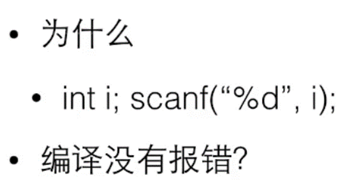

### 指针应用场景

#### 交换两个变量的值


 

#### 函数返回多个值，某些值就只能通过变量返回

传入的参数实际上是需要保存带回的结果的变量

#### 函数返回运算的状态，结果通过指针返回


### 常见错误

#### 定义了指针变量，还没有指向任何变量，就开始使用指针


直接使用*p，此时p里面的值可能是乱七八糟的值（这时指向指针的值所表示的地址上的变量）


#### 函数输入参数中的数组

 

其实是一个指针

int *a 和 int a[]

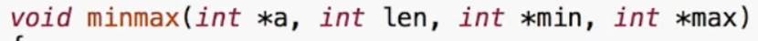


### 数组参数


### 数组变量是特殊的指针

#### 数组变量本身表达地址


#### []运算符可以对数组做，也可以对指针做


#### *运算符可以对指针做，也可以对数组做


#### 数组变量是const的指针，所以不能被赋值


所以，数组变量之间不能互相赋值

 

### 指针与const

指针是const


所指是const


 


1、2一样：指针所指向的东西不能被修改

3：指针不能被修改

 

#### 转换

当要传递的参数的类型比地址大的时候，能用比较少的字节数传递值给参数，又能避免函数对外面的变量的修改


#### const数组


#### 保护数组值

这样在sum函数里面，就不会对a这个数组做任何修改


### 指针运算


+1：对地址值加1，是加一个sizeof那个指针所指的类型，移到下一个单元去

 

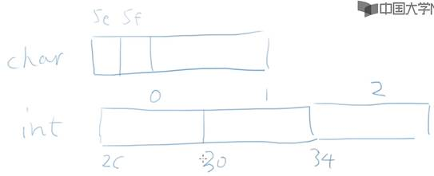

 

给一个指针加1表示要让指针指向下一个变量

 


指针如果不是指向一片连续分配的空间，如数组，则这种运算没有意义

 

char *p = ac；

char *p = &ac[5]；相等

 

### *p++

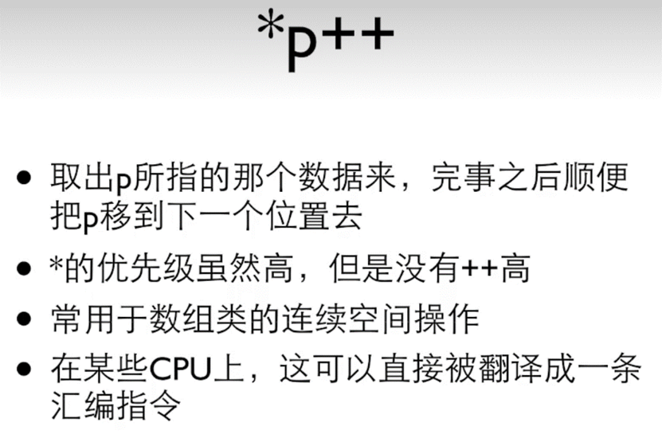

数组中单元的地址肯定是线性相加的

 

### 0地址，所有程序都有一个虚拟的0地址

NULL

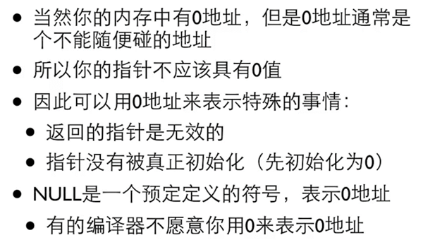

### 指针的类型


指向不同类型的指针不能直接相互赋值，避免用错指针

 

指针的类型转换


 

### 用指针来做什么：

1、需要传入较大数据时用作参数

2、传入数组后对数组做操作

3、函数返回不止一个结果

4、需要用函数来修改不止一个变量

5、动态申请的内存

 

### 动态内存分配

\#include <stdio.h>

\#include <stdlib.h>

 

int main(void)

{

​    int number;

​    int *a;

​    int i;

​    

​    printf("输入数量：");

​    scanf("%d",&number);

​    a= (int*)malloc(number*sizeof(int));

​    

​    for(i=0;i<number;i++){

​       scanf("%d",&a[i]);

​    }

​    for (i=number-1; i>0;i--);

​    {

​       printf("%d",a[i]);

​    }

​    free(a);

​    return 0;

}


 

\#include <stdio.h>

\#include <stdlib.h>

int main(void)

{

​    void *p;

​    int cnt=0;

​    while((p=malloc(100*1024*1024))){

​       cnt++;

​    }

​    printf("分配了%d00MB的空间\n",cnt)   ;

​    

​    return 0;

}

我的电脑上分配了17200MB的空间

 

free()


 

void *p =0;指针定义了之后都给它一个0值

 

#### 常见问题

申请了没free -》长时间运行内存逐渐下降

free过了再free

地址变过了，直接去free

 

## 第十周

### 字符串


 

 

字符串变量


 

字符串常量


 

字符串


 

### 字符串常量

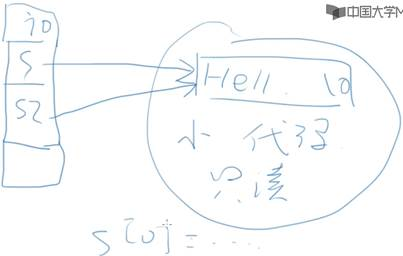

只读的地方

 


 

如果需要修改字符串应该用数组


char s3[]="hello world";

​    s3[0]='B';

​    printf("Here!s3[0]=%c\n",s3[0]);

 

 

 

 

指针还是数组


 

 

char* 不一定是字符串


 

### 字符串输入输出


 

安全的输入


 

 

 

 

 

常见错误


 

空字符串


 

###  字符串数组

char **a

a是一个指针，指向另一个指针，那个指针指向一个字符串

 

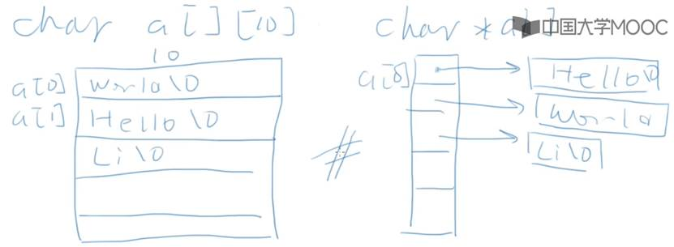

 

\#include <stdio.h>

 

int main(int argc, char const *argv[])

{

​    int i;

​    for (i=1;i<argc;i++){

​       printf("%d:%s\n",i,argv[i]);

​    }

​    return 0;

}

 

 


 

### 单字符输入输出，用 putchar和getchar

返回类型是int是为了返回EOF（-1）

windows  ctrl+z

Unix    ctrl+d

 

### 字符串函数

#### strlen 


 

#### strcmp


用数组，拿一个整数遍历所有下标；

或者直接用指针

int mycmp(const char* s1, const char* s2)

{

//   int idx =0;

//   while(s1[idx] == s2[idx] && s1[idx !='\0']) {

//      idx ++;

//   }

//   return s1[idx]- s2[idx];

​    

​    while( *s1 ==*s2 && *s1 != '\0') {

​       s1++;

​       s2++;

​    }

​    return *s1 - *s2;

}

 

#### strcpy

会大量地、准确地使用


 

复制一个字符串，+1是放下结尾的0

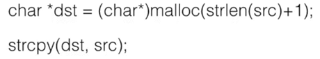

 

char* mycpy(char* dst, const char* src)

{

//   int idx =0;

//   while(src[idx] != '\0'){

//      dst[idx]=src[idx];

//      idx++;

//   }

//   dst[idx]='\0';

// return dst;

​    

​    char* ret =dst;

​    while(*src1='\0') {

​       *dst++ = *src++;

​    }

​    *dst='\0';

​    

​    return ret;

 

}

 

#### strcat 

拼接

 

安全版本


 

#### 字符串中找字符


 

字符串中找字符串


底下那个函数忽略大小写

 

## 第十一周

### 枚举

用符号而不是具体地数字来表示程序中的数字

用枚举而不是定义独立的const int 变量

 

 


 


声明了一种枚举类型叫做color，

enum color 来定义变量

 

 


 

最后一个NumCOLORS来表示枚举量的总个数

 


 

申明枚举量的时候可以指定值


 

枚举其实就是int

 

 

 

 

实际上很少用


 

### 结构类型


声明结构类型

结构里面的成员变量

 

不要漏了分号

 

在函数内部和函数外部都可以使用

 


 

 

#### 声明结构的形式


 

#### 结构变量

声明了结构类型之后用这个类型来定义很多个变量

 

#### 结构的初始化


 

#### 结构成员

数组用[]运算符和下标访问其成员

结构用.运算符合名字访问其成员，.的左边是结构变量


 

 

数组变量的名字就是地址，结构要用&运算符


 

### 结构与函数

#### 结构作为函数参数


 

#### 指向结构的指针


 


 

#### 结构数组


 

#### 结构中的结构，嵌套的结构


#### 结构中的结构的数组

 

 

### 类型定义

#### typedef

第一个原来的类型，第二个新的名字


 

#### 联合


公用一个内存地址空间

 

## 第十二周

__func__：表示当前这个函数的名字

 

#### 全局变量：

所有函数里面都可以访问

 

本地变量：

进函数时产生，函数结束消失

全局变量初始化：


 


这样不行

 


这样可以

 

*全局变量的值不应该和另一个变量联系在一起，不要再定义时赋来赋去

*函数内部存在与全局变量同名的变量，全局变量会被隐藏

 

 

#### 静态本地变量


 

#### *返回指针的函数


 

#### tips

不要使用全局变量在函数间传递参数和结果


 

### 宏定义

#### #开头的是编译预处理指令

\#define用来定义一个宏

 

.c源代码文件

编译预处理产生.i文件，所有的编译预处理

对.i文件真正由C的编译器去做编译，产生.s汇编代码文件

汇编代码文件去做汇编，产生目标代码文件.o

目标代码文件再经过链接和其他东西链接到一起之后，就形成一个可执行文件.out

.c -> .i -> .s -> .o -> a.out

 

结尾没有分好的语句不是C的语句


 

#### 宏


 

#### 没有值的宏

\#define _DEBUG

这类宏是用于条件编译的，后面有其他的编译预处理指令来检查这个宏时候已经被定义过了

 

#### 预定义的宏


 

#### 带参数的宏


##### 原则

所有东西都要有括号


 

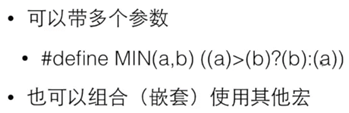

 

##### 宏的应用


 

### 多个源代码文件

一个.c文件是一个编译单元

编译器每次编译只处理一个编译单元

### 头文件


 

### #include


 

#### “”还是<>

 


 

#### 误区

把该文件的内容原封不动地插入到#include 这一行


#### 注意

*在使用和定义这个函数的地方都应该#include这个头文件

*一般的.c都有对应的同名的.h，把所有对外公开的函数的原型和全局变量的声明都放进去

*全局变量可以在多个.c之间共享

 

#### 不对外公开的函数


 

### 声明

int i；是变量的定义

extern int i；是变量的声明

 

声明是不产生代码的东西


 

只有声明可以被放在头文件里面


 

如果你的头文件里有结构的声明，很可能在一个编译单元里被#include多次


### 标准头文件结构


如果没有定义这个宏的话，就定义这个宏

如果已经定义了这个宏，中间的东西就不会出现你的.i文件里头

 

这样可以避免出现重复定义的问题

 


 

## 第十三周

### 格式化输入输出

#### printf


 

#### scanf


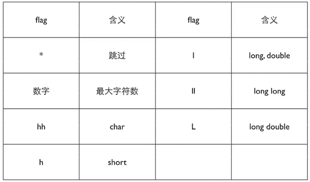

 

### 文件输入输出

用>和<做重定向

 

#### FILE


#### 打开文件的标准代码

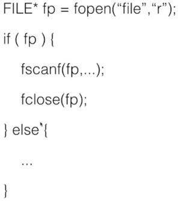

 

#### fopen


 

 

### 文本vs二进制

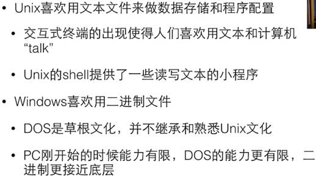


#### 二进制文件


 

 

#### 程序为什么要文件

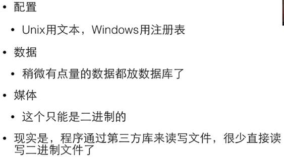

 

#### 二进制读写


sprintf向一个字符串输出

fwrite把数据以二进制的方式写到文件中去

#### 在文件中定位

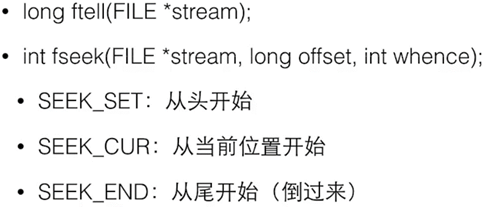

### 可移植性


 

### 按位运算


 

异或：不相等为1

### 移位运算

左移


 

右移


## 第十四周

### 位段

把一个int 的若干位组合成一个结构

底层硬件、寄存器操作


 

### 可变数组

·可以长大

·可以知道当前的大小

·能够访问到当中的单元

 

### 链表

一部分是数据，一部分是指针


结点：数据和指向下一个的指针

```c
typedef struct _node {
    int value;
    struct _node* next; //下一个还是这种类型的结构变量
};
```

 

 

