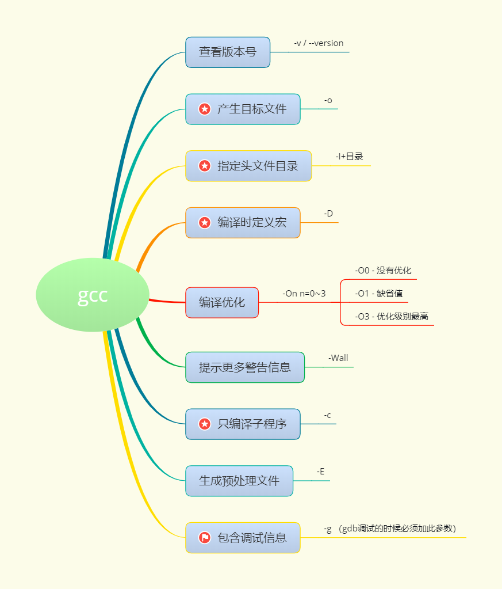

## gcc编译的四个阶段


-I：编译时指定头文件的位置

```bash
# -I指定头文件的位置
gcc main.c -I ./include -o app
```





## 静态库

### 命名格式

1. lib开头
2. 静态库名
3. .a结尾

### 描述

#### 优点

- 寻址方便，速度快
- 库被打包到可执行程序中，直接发布可执行程序即可使用

#### 缺点

- 静态库的代码在编译过程中已经被载入可执行程序，因此体积较大。
- 如果静态函数库改变了，那么你的程序必须重新编译。

#### 使用场合

- 在核心程序上使用，保证速度，可忽视空间
- 主流应用于80、90年代，现在很少用

### 制作

#### 1.得到 *.o

- gcc a.c b.c c.c -c

#### 2.得到静态库 libmytest.a

- ar rcs libmytest.a a.o b.o c.o 
  （就是一个打包.o文件的过程）
  - ar 工具不包含在gcc中
  - r --> 将文件插入静态库中
  - c --> 创建静态库，不管库是否存在
  - s --> 写入一个目标文件索引到库中，或者更新一个存在的目标文件索引。
- 查看库中的符号（函数、全局变量等）： nm libmytest.a

#### 使用静态库

- gcc + 源文件 + -L 静态库路径 + -l静态库名 + -I头文件目录 + -o 可执行文件名
  gcc main.c -L./ -lmytest -I./ -o app
  - -L --> 指定库所在的路径
  - -l --> 指定库的名字
    - 去掉前缀 lib
    - 去掉后缀 .a
    - 只留下中间部分
  - -I --> 头文件目录位置
- gcc + 源文件 + -I头文件 + libxxx.a
- 生成的静态库需要跟对应的头文件同时发布
  - 头文件中存放的是函数接口（函数声明）


## 动态库（共享库）

### 描述

#### 机制

- 共享库的代码是在可执行程序运行时才载入内存的，在编译过程中仅简单的引用，因此代码体积较小。

#### 优点

- 节省内存（共享）
- 易于更新（动态链接）
  - 停止运行程序
  - 使用新库覆盖旧库(保证新旧库名称一致，**接口一致**) “接口”
  - 重新启动程序。

#### 缺点

- 延时绑定，速度略慢
- 动态库没有打包到应用程序中，加载速度相对较慢
- 发布程序的时候，需要将动态库提供给用户

#### 使用场合

- 对速度要求不是很强烈的地方都应使用动态库

#### 注意事项

- 动态库是否加载到内存，取决于程序是否运行。

### 命名格式

1. lib开头
2. 动态库名
3. .so 结尾

### 制作

#### 1.生成“与位置无关”的目标文件

- gcc -fPIC a.c b.c c.c -c
  - 参数 -fPIC 表示生成与位置无关代码
  - 执行完毕后生成一系列的 .o 文件

#### 2.制作动态库

- gcc -shared -o libmytest.so a.o b.o c.o
  - 参数：-shared 制作动态库
  - -o：重命名生成的新文件

#### 使用动态库

- gcc main.c -L./ -lmytest -I./ -o app
  - -L --> 指定库所在的路径
  - 去掉前缀 lib
  - 去掉后缀 .so
  - 只留下中间部分
  - -I --> 头文件目录位置

#### 执行生成的可执行文件

- ./app --> 运行失败
  - 查看依赖的共享库：ldd app 发现 libmytest 找不到
  - 没有给动态链接器（ld-linux.so.2）指定好动态库 libmytest.so 的路径
  - 解决方案
    - 1. 临时设置：export LD_LIBRARY_PATH=库路径，将当前目录加入环境变量，但是终端退出了就无效了。
    - 2. 永久设置：将上条写入家目录下.bashrc文件中
    - 3. 粗暴设置：直接将libmytest.so文件拷贝到/usr/lib/【/lib】目录下。(受libc库的启发)
    - 4. 将libmytest.so所在绝对路径追加入到/etc/ld.so.conf文件，
         使用sudo ldconfig -v 更新


（还有一种方法，可以用于调试错误的程序，并不使用系统里自己建好的库：

在编译目标代码时指定程序**运行时**的动态库搜索路径。

-Wl,表示后面的参数将传给link程序ld（因为**gcc可能会自动调用ld**）。这里通过gcc 的参数”-Wl,-rpath=”指定

举一个例子：
这次我们还把上面得到的文件libtest.so移动到另一个地方去，如/root/test/lib下面，
因为我们需要在编译目标代码时指定可执行文件的动态库搜索路径，所以需要用gcc命令重新编译源程序test.c来生成可执行文件main。

```bash
gcc -o main -L. –ltest -Wl,-rpath=/root/test/lib test.c
```

）


### LD_LIBRARY_PATH

#### 作用

- 指定查找共享库（动态链接库）时除了默认路径之外的其他路径
- 该路径在默认路径之前查找

#### 设置方法

- 用export命令来设置值


## gdb调试

```
1.启动gdb
start -- 只执行一步
				n -- next
				s -- step(单步) -- 可以进入到函数体内部
				c - continue -- 直接停在断点的位置

2. 查看代码:
		l -- list，查看所在的源代码行附近的内容
		l 10（函数名）
		l filename：行号（函数名）
3. 设置断点:
		（断点需要在程序start后才能加）
		设置当前文件断点:
			b -- break
			b 10（函数名）
			
		设置指定文件断点:
			b fileName:行号（函数名）
		
		设置条件断点:
			b 10 if value==19
		删除断点:
			delete -- del - d
			d 断点的编号
				获取编号： info -- i
									info b
4. 查看设置的断点
5. 开始 执行gdb调试
		执行一步操作: 
			继续执行:
		执行多步, 直接停在断点处:
5. 单步调试
		进入函数体内部: s
			从函数体内部跳出: finish
		不进入函数体内部:
			n
		退出当前循环: u
6. 查看变量的值: p -- print
7. 查看变量的类型: ptype 变量名
8. 设置变量的值:	set var 变量名 = 赋值；没办法接收函数的返回值，直接p function()打印返回值
9. 设置追踪变量
		display
		取消追踪变量
		undisplay 编号
				获取编号： info display
10. 退出gdb调试
			quit
```


```
使用场景
	程序编译无误，但是有逻辑错误
	使用文字终端（shell），实现一个单步调试的功能
	生成可执行文件之前必须加参数 -g
		gcc hello.c -o hello -g
启动gdb调试
	gdb + 可执行文件 （如：gdb hello）
gdb相关命令
	l（list） --> 列出文件的代码清单
		l + 行号（l 32） --> 代码从第32行开始显示
		
	b（break）--> 设置断点
		b + 行号（b 12）--> 在第12行设置断点
		b + 行号（2） + 条件（if i=5） --> 在第2行设置断点，只有i等于5时生效
		
	info b（break）--> 查看断点信息
	
	info source --> 查看当前源代码文件的路径  info sources查看全部源代码
	
	r（run）--> 启动或重新启动程序，可加参数，会停在第一个断点处
	
	start --> 单步执行，运行程序，停在第一行执行语句
	
	disable/enable + 断点号 --> 设置断点是否有效
	
	d（delete）+ 断点号 --> 删除指定断点号对应的断点
	
	p(print) + 变量名 --> 打印变量值
	
	display + 变量名 --> 追踪变量
		之后每执行一步，该变量值都会被打印出来
		
	undisplay + 变量名编号 --> 取消跟踪
	
	n（next）--> 下一行（不会进入到函数体内部）
	
	s（step）--> 下一步（会进入到函数体内部）
	
	ptyte + 变量名 --> 查看变量的类型
	
	（fin）finish --> 结束当前函数，返回到函数调用点
	
	set --> 设置变量的值 set var n=100
	
	q（quit） --> 退出gdb
	
```

