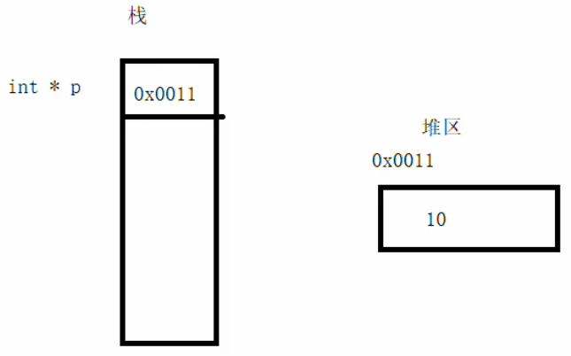

## 内存分区模型

C++程序在执行时，将内存大方向划分为**4个区域**

- 代码区：存放函数体的二进制代码，由操作系统进行管理的 
- 全局区：存放全局变量和静态变量以及常量（全局常量，const修饰的全局变量；字符串常量）
- 栈区：由编译器自动分配释放, 存放函数的参数值,局部变量,局部常量等
- 堆区：由程序员分配和释放,若程序员不释放,程序结束时由操作系统回收

<font color='red'>代码区和全局区是程序在运行前划分的两个区域</font>

<font color='red'>程序运行后才会有栈区和堆区</font>


**内存四区意义：**

不同区域存放的数据，赋予不同的生命周期, 给我们更大的灵活编程

### 1.1 程序运行前

​	在程序编译后，生成了exe可执行程序，**未执行该程序前**分为两个区域

​	**代码区：**

​		存放 CPU 执行的机器指令

​		代码区是**共享**的，共享的目的是对于频繁被执行的程序，只需要在内存中有一份代码即可

​		代码区是**只读**的，使其只读的原因是防止程序意外地修改了它的指令

​	**全局区：**

​		全局变量和静态变量存放在此.

​		全局区还包含了常量区, 字符串常量和其他常量（包括一些const修饰的变量）也存放在此.

​		<mark>该区域的数据在程序结束后由操作系统释放</mark>.

**示例：**

```cpp
//全局变量
int g_a = 10;
int g_b = 10;

//全局常量
const int c_g_a = 10;
const int c_g_b = 10;

int main() {

	//创建普通局部变量局部变量
	int a = 10;
	int b = 10;

	//打印地址
	cout << "局部变量a地址为： " << (int)&a << endl;
	cout << "局部变量b地址为： " << (int)&b << endl;

	cout << "全局变量g_a地址为： " <<  (int)&g_a << endl;
	cout << "全局变量g_b地址为： " <<  (int)&g_b << endl;

	//静态变量
	static int s_a = 10;
	static int s_b = 10;

	cout << "静态变量s_a地址为： " << (int)&s_a << endl;
	cout << "静态变量s_b地址为： " << (int)&s_b << endl;

	cout << "字符串常量地址为： " << (int)&"hello world" << endl;
	cout << "字符串常量地址为： " << (int)&"hello world1" << endl;

	cout << "全局常量c_g_a地址为： " << (int)&c_g_a << endl;
	cout << "全局常量c_g_b地址为： " << (int)&c_g_b << endl;

	const int c_l_a = 10;
	const int c_l_b = 10;
	cout << "局部常量c_l_a地址为： " << (int)&c_l_a << endl;
	cout << "局部常量c_l_b地址为： " << (int)&c_l_b << endl;

	system("pause");

	return 0;
}
```

打印结果：


总结：

* C++中在程序运行前分为全局区和代码区
* 代码区特点是共享和只读
* 全局区中存放全局变量、静态变量、常量
* 常量区中存放 const修饰的全局常量  和 字符串常量


### 1.2 程序运行后

​	**栈区：**

​		由编译器自动分配释放, 存放函数的参数值,局部变量等

​		注意事项：不要返回局部变量的地址，栈区开辟的数据由编译器自动释放

**示例：**

```cpp
int * func(int b)  //形参数据也会放在栈区
{
    b = 100；
	int a = 10;  //局部变量  存放在栈区，栈区的数据在函数执行完后自动释放
	return &a;  //返回局部变量的地址
}

int main() {

    //接收func函数的返回值
	int *p = func();

	cout << *p << endl;  //第一次可以打印正确的数字，是因为编译器做了保留
	cout << *p << endl;  //第二次这个数据就不在保留

	system("pause");

	return 0;
}
```


​	**堆区：**

​		由程序员分配释放,若程序员不释放,程序结束时由操作系统回收

​		在C++中主要利用new在堆区开辟内存

​	    <font color='red'>利用new创建的数据，会返回该数据对应的类型的指针</font>

**示例：**

```cpp
int* func()
{
    //利用new关键字  可以将数据开辟到堆区
	//利用new创建的数据，会返回该数据对应的类型的指针
	//指针  本质也是局部变量，放在栈区，指针保存的数据是放在堆区
	int* a = new int(10);
	return a;
}

int main() {

    //在堆区开辟数据
	int *p = func();

	cout << *p << endl;
	cout << *p << endl; //堆区数据由程序员来管理生死，只要不释放，10一直存活
    
	system("pause");

	return 0;
}
```

**总结：**

堆区数据由程序员管理开辟和释放

堆区数据利用new关键字进行开辟内存


### 1.3 new操作符

​	C++中利用<mark>new</mark>操作符在堆区开辟数据

​	堆区开辟的数据，由程序员手动开辟，手动释放，释放利用操作符<mark>delete</mark>

​	语法：` new 数据类型`

​	利用new创建的数据，会返回该数据对应的类型的指针

**示例1： 基本语法**

```cpp
int* func()
{
	int* a = new int(10);
	return a;
}

int main() {

	int *p = func();

	cout << *p << endl;
	cout << *p << endl;

	//利用delete释放堆区数据
	delete p;

	//cout << *p << endl; //报错，释放的空间不可访问

	system("pause");

	return 0;
}
```

**示例2：开辟数组**

```cpp
//堆区开辟数组
int main() {

	int* arr = new int[10];

	for (int i = 0; i < 10; i++)
	{
		arr[i] = i + 100;
	}

	for (int i = 0; i < 10; i++)
	{
		cout << arr[i] << endl;
	}
	//释放数组 delete 后加 []
	delete[] arr;

	system("pause");

	return 0;
}

```

只是把堆区这个数据的地址编号，用栈上的一个指针保存住了。解引用（*p）之后，拿到的数据是10




