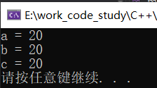

## 引用

### 1.1 引用的基本使用

**作用：** 给变量起别名

**语法：** `数据类型 &别名 = 原名`

<font color='red'>a和b操作的是同一块内存</font>

**示例：**

```cpp
int main() {

	int a = 10;
    //创建引用
	int &b = a;

	cout << "a = " << a << endl;
	cout << "b = " << b << endl;

	b = 100;

	cout << "a = " << a << endl;
	cout << "b = " << b << endl;

	system("pause");

	return 0;
}
```

### 1.2 引用注意事项

* 引用必须初始化
* 引用在初始化后，不可以改变

示例：

```cpp
int main() {

	int a = 10;
	int b = 20;
	//int &c; //错误，引用必须初始化
	int &c = a; //一旦初始化后，就不可以更改（不可以变成别人的别名） 再&c=b错误
	c = b; //这是赋值操作，不是更改引用

	cout << "a = " << a << endl;
	cout << "b = " << b << endl;
	cout << "c = " << c << endl;

	system("pause");

	return 0;
}
```



### 1.3 引用做函数参数

**作用：** 函数传参时，可以利用引用的技术让形参修饰实参

**优点：** 可以简化指针修改实参

**示例：**

```cpp
//1. 值传递，形参不会修饰实参
void mySwap01(int a, int b) {
	int temp = a;
	a = b;
	b = temp;
}

//2. 地址传递，用指针接收地址，形参会修饰实参
void mySwap02(int* a, int* b) {
	int temp = *a;
	*a = *b;
	*b = temp;
}

//3. 引用传递，形参会修饰实参，这个形参a、b是实参a、b的引用，操作的是同一块内存
void mySwap03(int& a, int& b) {
	int temp = a;
	a = b;
	b = temp;
}

int main() {

	int a = 10;
	int b = 20;

	mySwap01(a, b);
	cout << "a:" << a << " b:" << b << endl;

	mySwap02(&a, &b);
	cout << "a:" << a << " b:" << b << endl;

	mySwap03(a, b);
	cout << "a:" << a << " b:" << b << endl;

	system("pause");

	return 0;
}

```

> 总结：通过引用参数产生的效果同按地址传递是一样的。引用的语法更清楚简单

### 1.4 引用做函数返回值

作用：引用是可以作为函数的返回值存在的

注意：**不要返回局部变量引用**

用法：函数调用作为左值

**示例：**

```cpp
//返回局部变量引用
int& test01() {
	int a = 10; //局部变量
	return a;
}

//返回静态变量引用
int& test02() {
	static int a = 20;  //静态变量存放在全局区全局区上的数据在程序结束后系统释放
	return a;
}

int main() {

	//不能返回局部变量的引用
	int& ref = test01();
	cout << "ref = " << ref << endl;  //第一次结果正确，是因为编译器做了保留
	cout << "ref = " << ref << endl;  //第二次结果错误，是因为a的内存已经释放

	//静态变量程序结束后系统才释放
	int& ref2 = test02();
	cout << "ref2 = " << ref2 << endl;
	cout << "ref2 = " << ref2 << endl;

    //如果函数的返回值是引用，这个函数调用可以作为左值
    //返回a的引用，相当于把a的变量做一个返回，然后做了一个a=1000的操作
	test02() = 1000;

    //ref2本身是一个a的别名，所以也是1000，a是原名被赋值为1000
	cout << "ref2 = " << ref2 << endl;
	cout << "ref2 = " << ref2 << endl;

	system("pause");

	return 0;
}
```


### 1.5 引用的本质

本质：**引用的本质在c++内部实现是一个指针常量.**

引用必须绑定到一个有效值身上，不能是nullptr

<font color='red'>指针常量：指针的指向不可修改，指针指向的值是可以改变的</font>

讲解示例：

```cpp
//发现是引用，转换为 int* const ref = &a;
void func(int& ref){
	ref = 100; // ref是引用，转换为*ref = 100
}
int main(){
	int a = 10;
    
    //自动转换为 int* const ref = &a; 指针常量是指针指向不可改，也说明为什么引用不可更改
	int& ref = a; 
	ref = 20; //内部发现ref是引用，自动帮我们转换为: *ref = 20;
    
	cout << "a:" << a << endl;
	cout << "ref:" << ref << endl;
    
	func(a);
	return 0;
}
```


结论：C++推荐用引用技术，因为语法方便，引用本质是指针常量，但是所有的指针操作编译器都帮我们做了

### 2.6 常量引用

**作用：** 常量引用主要用来修饰形参，防止误操作

在函数形参列表中，可以加<mark>const修饰形参</mark>，防止形参改变实参

**示例：**

```cpp
//引用使用的场景，通常用来修饰形参
void showValue(const int& v) {
	//v += 10;  //没有const，main函数里的a也会被修改
    //加了const，v就无法修改，防止误操作，防止形参改变实参
	cout << v << endl;
}

int main() {

	//int& ref = 10;  引用本身需要一个合法的内存空间，因此这行错误
	//加入const就可以了，编译器优化代码，int temp = 10; const int& ref = temp;
	const int& ref = 10;

	//ref = 100;  //加入const后不可以修改变量，只读
	cout << ref << endl;

	//函数中利用常量引用防止误操作修改实参
	int a = 10;
	showValue(a);

	system("pause");

	return 0;
}
```


