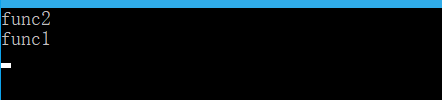
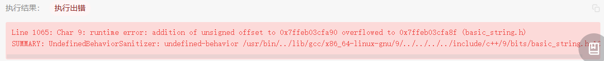

obsidian://open?vault=docs&file=Cpp%2FLesson%2F%E9%BB%91%E9%A9%ACCpp%2F02.Cpp%E5%9F%BA%E7%A1%80%E5%85%A5%E9%97%A8# myCpp

##  自己的知识点


返回值不可以作为重载的区分


### 引用

本质：**引用的本质在c++内部实现是一个指针常量.**

<font color='red'>指针常量：指针的指向不可修改，指针指向的值是可以改变的</font>

```cpp
//发现是引用，转换为 int* const ref = &a;
void func(int& ref){
	ref = 100; // ref是引用，转换为*ref = 100
}
int main(){
	int a = 10;
    
    //自动转换为 int* const ref = &a; 指针常量是指针指向不可改，也说明为什么引用不可更改
	int& ref = a; 
	ref = 20; //内部发现ref是引用，自动帮我们转换为: *ref = 20;
    
	cout << "a:" << a << endl;
	cout << "ref:" << ref << endl;
    
	func(a);
	return 0;
}
```


### new , delete

堆区程序员手动开辟，也需要手动释放，不delete掉的话会造成内存泄漏

利用new创建的数据，会返回该数据对应的类型的指针

```cpp
//利用new关键字  可以将数据开辟到堆区
//利用new创建的数据，会返回该数据对应的类型的指针
//指针  本质也是局部变量，放在栈区，指针保存的数据是放在堆区
int* a = new int(10);

//释放
delete a;

//释放数组 delete 后加 []
delete[] arr;
```

指针：本质也是局部变量，放在栈区
指针保存的数据放在堆区

当我们使用未初始化内存的指针时：
会导致程序无法进行，因为指针并没有指向一个合法的地址，这时候其内部存的只是一些乱码，所以在调用函数时，会使用乱码所指的内存，指针根本就无权访问，导致出错。
解决办法：new 为指针动态分配内存，之后再用delete将其释放


容器中*it是什么是

```cpp
for (vector<int>::iterator it = v.begin(); it != v.end(); it++) {
        //*it就是int
		cout << *it << " ";
	}
```


### 指针

#### 指针与常量

```cpp
int x;
int * p1 = &x; //指针可以被修改，值也可以被修改
const int * p2 = &x; //指针可以被修改，值不可以被修改（const int），常量指针
int * const p3 = &x; //指针不可以被修改（* const），值可以被修改，指针常量
const int * const p4 = &x; //指针不可以被修改，值也不可以被修改
```

#### 指针函数与函数指针

```cpp
// addition是指针函数，一个返回类型是指针的函数
int* addition(int a, int b) {
	int* sum = new int(a + b);
	return sum;
}
int subtraction(int a, int b) {
	return a - b;
}
int operation(int x, int y, int (*func)(int, int)) {
	return (*func)(x, y);
}

int* m = addition(1, 2);
// minus是函数指针，指向函数的指针
int (*minus)(int, int) = subtraction;
int n = operation(3, *m, minus);
```

#### 指向指针的引用

在函数调用时用指针或者引用做参数，表示把变量的地址传递给子函数，
但是子函数只能修改指针所指变量的值，并不能修改指针的指向。

<mark>如果想要修改指针的指向，就要用指针的指针，或者指针的引用</mark>

### 字符串

```cpp
string s; // 字符串
s[i]; // 字符串中取出来单个字符还是字符串
```


### 关键字

#### auto

就是根据后面的值，来自己推测前面的类型是什么。
作用就是为了简化变量初始化，如果这个变量有一个很长很长的初始化类型，就可以用auto代替。
用auto声明的变量必须初始化（auto是根据后面的值来推测这个变量的类型，如果后面没有值，自然会报错）

#### constexpr

 `constexpr` 是 C++11 引入的一个关键字，用于声明在编译时可以计算出结果的表达式或函数。使用 `constexpr` 声明的表达式或函数在编译时就会被计算出结果，而不是在程序运行时才计算。这样可以提高程序的性能和效率。

 `constexpr` 可以用于声明变量、函数和类成员函数。对于变量，使用 `constexpr` 声明的变量必须在编译时就能确定其值。对于函数，使用 `constexpr` 声明的函数必须能在编译时就能计算出结果。对于类成员函数，使用 `constexpr` 声明的成员函数必须能在编译时就能计算出结果，并且不能有任何副作用。

下面是一个使用 `constexpr` 声明的函数示例：

```cpp
constexpr int factorial(int n)
{
    return n <= 1 ? 1 : n * factorial(n-1);
}
```

这个函数计算一个整数的阶乘，并使用 `constexpr` 声明，因此可以在编译时就计算出结果。在使用时，可以将其作为常量表达式使用：

```cpp
int x = factorial(5); // x 的值为 120
constexpr int y = factorial(6); // y 的值为 720，在编译时就计算出结果
```

需要注意的是，`constexpr` 声明的函数必须满足一些限制，比如不能有任何副作用，不能包含循环语句等。


#### explict

 `explicit` 是 C++ 中的一个关键字，用于修饰构造函数，表示该构造函数只能用于显式地创建对象，而不能隐式地进行类型转换。举个例子，如果有一个类 A，它有一个带有一个参数的构造函数，如果这个构造函数被声明为 `explicit`，那么就不能像下面这样隐式地进行类型转换：

```cpp
A a = 1; // 错误，不能隐式地进行类型转换
A a(1); // 正确，可以显式地创建对象
```

如果该构造函数没有被声明为 `explicit`，那么上面的代码就会编译通过，因为编译器会自动把整型转换成类 Anb 的一个对象。`explicit` 关键字可以避免这种情况的发生，使代码更加明确和安全。


C++显式构造是指通过构造函数明确地创建对象，不允许进行隐式转换。这意味着在使用显式构造时，必须使用构造函数来创建对象，不能简单地将其他类型的值赋给该对象。显式构造可以避免一些意外的类型转换，提高代码的可读性和安全性。


#### extern

在C++中，`extern`是一个关键字，用于指示一个变量或函数是在其他文件中定义的。具体来说，如果一个变量或函数被声明为`extern`，那么编译器将在其他文件中查找该变量或函数的定义。这通常用于在多个源文件中共享变量或函数的定义。例如，如果你在一个源文件中定义了一个全局变量，并且想在另一个源文件中使用该变量，你可以在第二个源文件中使用`extern`关键字来引用该变量，而不需要重新定义它。

例如，假设你在一个源文件中定义了一个全局变量`int num = 10;`，你可以在另一个源文件中使用`extern int num;`来引用该变量，而不需要重新定义它。这样，编译器将在其他文件中查找该变量的定义，然后将其链接到你的程序中。

注意，`extern`关键字只是一个声明，它并不会分配内存或定义变量或函数。它只是告诉编译器该变量或函数在其他文件中定义，需要在链接时进行解析。


在 C++ 中，`extern` 是一个关键字，用于在当前文件以外的地方声明一个变量或函数。其作用有以下两个方面：

1. 声明外部变量：使用 `extern` 关键字可以在当前文件中声明一个在其他文件中定义的全局变量。这样，在当前文件中就可以使用这个变量，而不需要重新定义一遍。例如：

   ```cpp
   // file1.cpp
   extern int count;
   
   // file2.cpp
   int count = 0;
   
   // main.cpp
   #include <iostream>
   extern int count;
   
   int main() {
       std::cout << "count = " << count << std::endl;
       return 0;
   }
   ```

   在这个例子中，`count` 变量在 `file1.cpp` 中被声明为外部变量，然后在 `file2.cpp` 中被定义为 0。在 `main.cpp` 中，`count` 又被声明为外部变量，并被用于输出。

2. 声明外部函数：使用 `extern` 关键字可以在当前文件中声明一个在其他文件中定义的函数。这样，在当前文件中就可以调用这个函数，而不需要重新定义一遍。

3. `extern "C"`是使C++能够调用C写作的库文件的一个手段，如果要对编译器提示使用C的方式来处理函数的话，那么就要使用extern "C"来说明


#### final

在 C++ 中，`final` 是一个关键字，用于限制类、成员函数或虚函数的继承或覆盖。

1. `final` 修饰类：
   当一个类被声明为 `final` 时，表示该类不能被继承。任何试图从该类派生出新类的尝试都将导致编译错误。

   ```cpp
   class Base final {
     // ...
   };

   // 错误示例：无法从 final 类派生
   class Derived : public Base {
     // ...
   };
   ```

2. `final` 修饰成员函数：
   当一个成员函数被声明为 `final` 时，表示该函数不能被重写（覆盖）。

   ```cpp
   class Base {
   public:
     virtual void foo() const final {
       // ...
     }
   };

   class Derived : public Base {
   public:
     // 错误示例：无法重写 final 函数
     void foo() const override {
       // ...
     }
   };
   ```

3. `final` 修饰虚函数：
   当一个虚函数被声明为 `final` 时，表示该虚函数不能被子类再次重写（覆盖）。

   ```cpp
   class Base {
   public:
     virtual void foo() const final {
       // ...
     }
   };

   class Derived : public Base {
   public:
     // 错误示例：无法重写 final 虚函数
     void foo() const override {
       // ...
     }
   };
   ```

使用 `final` 关键字可以用于防止类被继承、成员函数被重写，或者虚函数在子类中被再次覆盖。这有助于强制执行设计意图，并提高代码的可靠性和可维护性。


#### friend

在C++中，`friend`是一个关键字，用于声明一个函数或类是另一个类的友元。友元可以访问声明它为友元的类的私有成员和保护成员，即使这些成员在其他地方是不可访问的。

具体来说，如果一个函数或类被声明为另一个类的友元，那么它就可以访问该类的私有成员和保护成员。这在某些情况下是非常有用的，例如在两个类之间需要共享数据时。但是，友元也可能导致代码的可维护性和安全性降低，因此应该谨慎使用。

友元可以声明在类的内部或外部，如果声明在类的内部，它将成为一个成员函数或成员类，如果声明在类的外部，它将成为一个普通函数或类。

下面是一个友元函数的例子：

```cpp
class A {
private:
    int x;
public:
    friend void setX(A& a, int x); // 声明setX为A的友元函数
};

void setX(A& a, int x) {
    a.x = x; // 可以访问A的私有成员x
}
```

在这个例子中，`setX`被声明为`A`的友元函数，因此它可以访问`A`的私有成员`x`。注意，`setX`并不是`A`的成员函数，因此它不能通过`this`指针访问`A`的成员。


#### inline

`inline` 是一个关键字，用于向编译器提供函数内联展开的建议。当函数被声明为 `inline` 时，编译器可以将函数的代码插入到调用该函数的地方，而不是通过函数调用的方式执行。这样可以减少函数调用的开销，提高代码的执行效率。

使用 `inline` 关键字的函数通常是**简短的函数**，函数体内部没有复杂的控制流和大量的代码。这样的函数在被频繁调用时，通过内联展开可以减少函数调用的开销，提高程序的性能。

需要注意的是，`inline` 关键字只是向编译器提供了一个建议，编译器是否真正将函数内联展开取决于编译器的实现和优化策略。编译器可能会根据函数的复杂性、调用频率等因素来决定是否进行内联展开。

```
在代码示例中，`inline int tid()` 表示将 `tid` 函数声明为内联函数。这意味着编译器可以选择将 `tid` 函数的代码插入到调用 `tid` 函数的地方，而不是通过函数调用的方式执行。这样可以避免函数调用的开销，提高获取线程 ID 的效率。
```


#### mutable

在 C++ 中，`mutable` 是一个关键字，用于修饰类的成员变量。当一个成员变量被声明为 `mutable` 时，表示该成员变量可以在 const 成员函数中修改。

通常情况下，const 成员函数不允许修改类的成员变量，因为 const 成员函数被认为是不会对对象的状态做出任何更改的函数。但有时候，我们可能需要在 const 成员函数中修改某些临时状态或计数器等非关键数据，这时就可以使用 `mutable` 关键字。

以下是一个示例：

```cpp
class Example {
  mutable int counter; // 使用 mutable 修饰的可变成员变量

public:
  void increment() const {
    counter++; // 在 const 成员函数中修改 mutable 成员变量
  }

  int getCounter() const {
    return counter; // 在 const 成员函数中访问 mutable 成员变量
  }
};
```

在上述示例中，`increment()` 是一个 const 成员函数，但由于 `counter` 被声明为 `mutable`，它可以在该函数中被递增。而 `getCounter()` 也是一个 const 成员函数，可以读取 `counter` 的值。

需要注意的是，虽然 `mutable` 关键字允许在 const 成员函数中修改特定的成员变量，但仍然需要谨慎使用。滥用 `mutable` 可能会导致代码变得难以理解和维护，因此应该遵循良好的代码设计原则并慎重决定是否使用 `mutable`。


#### namespace

`namespace` 是 C++ 中用于避免命名冲突的一种机制。可以将一组相关的函数、类、变量等放在一个命名空间中，从而避免与其他命名空间中的同名实体发生冲突。在 C++ 中，命名空间用 `namespace` 关键字来定义，语法如下：

```cpp
namespace namespace_name {
    // 命名空间内的代码
}
```

在命名空间内部定义的变量、函数等只在该命名空间内可见，可以通过 `namespace_name::` 来访问。例如，假设有一个名为 `my_namespace` 的命名空间，其中定义了一个名为 `my_function` 的函数，可以使用以下方式来调用该函数：

```cpp
my_namespace::my_function();
```

此外，还可以使用 `using namespace` 语句来指定使用哪个命名空间中的实体。例如，以下代码将使用 `my_namespace` 命名空间中的所有实体：

```cpp
using namespace my_namespace;
```

需要注意的是，使用 `using namespace` 语句可能会导致命名冲突，因此应谨慎使用。

#### noexcept

`noexcept` 是 C++11 引入的一个关键字，用于指示一个函数是否会抛出异常。可以在函数声明或定义时使用 `noexcept` 关键字来指示该函数是否可能抛出异常，例如：

```cpp
void func() noexcept {
    // 函数体
}
```

上述代码中，`noexcept` 关键字指示函数 `func()` 不会抛出异常。如果在函数体中抛出了异常，则程序会调用 `std::terminate()` 来终止程序。

`noexcept` 还可以用于模板参数和表达式中，例如：

```cpp
template <typename T>
void func(T&& t) noexcept(noexcept(std::forward<T>(t))) {
    // 函数体
}
```

上述代码中，`noexcept` 关键字用于模板参数 `T` 和表达式 `std::forward<T>(t)`，以指示函数 `func()` 是否会抛出异常。如果 `T` 或 `std::forward<T>(t)` 中包含了可能抛出异常的操作，则 `noexcept` 的值为 `false`，否则为 `true`。

使用 `noexcept` 关键字可以帮助编译器进行优化，提高程序的性能。


#### override

在 C++ 中，`override` 是一个关键字，用于显式地指示派生类的成员函数覆盖（重写）了基类中的虚函数。

当派生类继承自基类并且想要重写基类中的虚函数时，可以使用 `override` 关键字来提醒编译器检查是否正确地进行了函数的覆盖。这样可以避免一些因拼写错误或函数签名不匹配而导致的错误。

以下是一个示例：

```cpp
class Base {
public:
  virtual void foo() const;
};

class Derived : public Base {
public:
  void foo() const override; // 使用 override 关键字，确保正确重写基类的虚函数
};
```

在上述示例中，`Derived` 类继承自 `Base` 类，并重写了基类中的虚函数 `foo()`。通过在派生类中使用 `override` 关键字，编译器会检查是否存在与基类虚函数相匹配的函数。如果没有找到匹配的函数，或者函数签名不匹配，编译器将会报错。

使用 `override` 关键字可以增强代码的可读性和可维护性，并帮助捕获常见的重写错误。它是 C++11 引入的特性，但仅在虚函数重写时才需要使用，对于非虚函数没有必要使用 `override` 关键字。


#### static

C++中的`static`关键字有多种用法：

1. 声明静态变量：在函数内部使用`static`关键字声明的变量将成为静态变量，其生命周期将与程序的生命周期相同，而不是与函数的生命周期相同。
2. 声明静态成员变量：在类中使用`static`关键字声明的变量将成为静态成员变量，它们属于类而不是属于类的任何实例。静态成员变量在所有类的实例之间共享。
3. 声明静态成员函数：在类中使用`static`关键字声明的函数将成为静态成员函数，它们不属于任何特定的实例，可以直接通过类名调用。
4. 声明静态局部变量：在函数内部使用`static`关键字声明的变量将成为静态局部变量，其生命周期将与程序的生命周期相同，而不是与函数的生命周期相同。静态局部变量只能在声明的函数内部访问。

总的来说，`static`关键字的作用是限制变量或函数的作用域，并且可以使变量或函数在程序的生命周期内保持状态。

#### static_assert

`static_assert` 是 C++11 标准引入的一个关键字，用于在编译期检查表达式是否为真。它的语法形式如下：

```cpp
static_assert(expression, message);
```

其中，`expression` 是要进行检查的表达式，可以是任意的常量表达式，如果表达式的结果为 false，则编译器会在编译期间产生一条错误信息，并输出 `message`。`message` 是可选的，用于指定错误信息的提示消息。

`static_assert` 的作用是在编译期间检查程序的正确性，可以避免一些常见的编程错误。例如，可以使用 `static_assert` 来检查数组的大小是否符合要求，或者检查类型的大小是否满足某些限制。


#### typename

`typename` 是 C++ 中的一个关键字，通常用于模板元编程中。在模板中使用类型时，如果该类型依赖于模板参数，则需要使用 `typename` 关键字来告诉编译器该类型是一个类型而非一个变量或函数。例如：

```cpp
template<typename T>
void foo()
{
    typename T::value_type* ptr; // T::value_type 是一个依赖于模板参数 T 的类型
}
```

在上面的例子中，我们需要使用 `typename` 关键字来告诉编译器 `T::value_type` 是一个类型而非一个变量或函数。如果不使用 `typename`，编译器会将 `T::value_type` 解释为一个变量或函数，从而导致编译错误。


#### typedef、using、typename

不完全正确。在C++中，`typename` 关键字通常用于指示一个依赖类型（dependent type）。它在模板编程中经常用于告诉编译器某个名称是一个类型而不是一个值或静态成员。

`typename` 关键字通常在以下两种情况下使用：

1. 在模板中使用嵌套类型时，如果嵌套类型依赖于模板参数，需要使用 `typename` 来告诉编译器它是一个类型。例如：

```cpp
template <typename T>
void foo() {
    typename T::NestedType variable; // 告诉编译器 NestedType 是一个类型
    // ...
}
```

2. 在模板特化中引用依赖类型时，也需要使用 `typename`。例如：

```cpp
template <typename T>
struct MyStruct {
    typename T::NestedType member; // 告诉编译器 NestedType 是一个类型
    // ...
};
```

注意，`typename` 并非用于重命名类型的关键字。如果要重命名类型，可以使用 `typedef` 或 `using` 关键字。例如：

```cpp
typedef int MyInt; // 将 int 重命名为 MyInt

using MyType = std::vector<int>; // 将 std::vector<int> 重命名为 MyType
```

总结来说，`typename` 关键字用于指示依赖类型，而 `typedef` 或 `using` 关键字用于重命名类型。


#### volatile

在 C++ 中，`volatile` 是一个关键字，用于告诉编译器该变量的值可能会在程序的其他部分被修改，因此编译器不应该对该变量进行优化，例如缓存该变量的值，而应该每次都从内存中读取该变量的值。

`volatile` 通常用于多线程编程或者与硬件交互的程序中，因为在这些情况下，变量的值可能会在程序的其他部分被修改，而编译器可能会对变量进行优化，导致程序出现错误。使用 `volatile` 可以避免这种情况发生。

需要注意的是，`volatile` 并不是线程安全的解决方案，它只是告诉编译器该变量可能会被修改，编译器会相应地生成代码，但是如果多个线程同时修改该变量，仍然需要使用其他的线程安全机制来保证程序的正确性。


#### __thread

`__thread` 是一个GCC编译器提供的关键字，用于声明线程局部存储(thread-local storage)的变量。

线程局部存储是一种机制，可以使得每个线程都拥有自己独立的变量副本，各个线程之间互不干扰。通常情况下，全局变量和静态变量是所有线程共享的，而使用 `__thread` 声明的变量则是每个线程独有的。

使用 `__thread` 关键字声明的变量只能是基本数据类型或指针类型，并且其生命周期与所属线程的生命周期相同。每个线程对应的变量副本在线程创建时被初始化，在线程销毁时被销毁。

这种线程局部存储的机制在多线程编程中非常有用，可以避免多个线程之间对同一变量的竞争和冲突。常见的应用场景包括线程安全的日志记录、线程特定的缓存等。需要注意的是，`__thread` 关键字仅在一些特定的编译器中有效，因此在编写跨平台的代码时需谨慎使用。


### 内置函数

#### __builtin_expect

```
// 使用 __builtin_expect 内置函数来提高条件判断的性能
// __builtin_expect用于给编译器提示条件表达式的预期结果，以便优化生成的代码。
```


### 编程注意点

#### 优先队列和sort中的不同点

- `priority_queue<int, vector<int>, greater<int>> minHeap;`：这行代码创建了一个名为 `minHeap` 的 `std::priority_queue`，并使用 `std::greater<int>` 作为比较函数。在优先队列中，`std::greater<int>` 会导致元素按照升序排列，因此 `minHeap` 是一个小顶堆，最小的元素位于队列的顶部。
- `sort(res.begin(), res.end(), greater<int>());`：这行代码使用 `std::greater<int>` 作为比较函数来对 `res` 容器中的元素进行排序。在 `std::sort` 函数中，`std::greater<int>` 会导致元素按照降序排列，因此 `res` 容器的元素将会按照降序排列。

总结：

- 对于优先队列 `std::priority_queue`，`std::greater<int>` 作为比较函数会导致小顶堆的形式，最小的元素位于堆顶。
- 对于排序函数 `std::sort`，`std::greater<int>` 作为比较函数会导致降序排列，最大的元素位于容器的前面。


问题的关键在于比较函数的定义和上下文中的使用方式。

- **优先队列中的 `std::greater<int>`**：在优先队列中，`std::greater<int>` 作为比较函数，会导致元素按照升序排列，因为优先队列的特性是，堆顶元素是最小的。使用 `std::greater<int>` 作为比较函数确保较小的元素排在前面，创建了一个小顶堆。
- **排序函数中`的 std::greater<int>`**：在排序函数中，`std::greater<int>` 作为比较函数，会导致元素按照降序排列，因为该比较函数会将较大的元素排在前面，从而实现降序排列。

实际上，`std::greater<int>` 所做的事情是定义了一个“比较规则”，以决定元素之间的相对顺序。在优先队列中，这个比较规则用于确定元素在堆中的排列顺序，而在排序函数中，它用于确定元素在结果序列中的排列顺序。

所以，尽管在两个情境中都使用了 `std::greater<int>`，但是它们在不同的上下文中被用于不同的目的，从而产生了不同的效果。我希望这次的解释能够更加清楚地回答你的问题。如果还有疑惑，请随时继续提问。


## 其他知识点

#### 为什么有的时候指针delete后还需要赋值nullptr

在 C++ 中，使用 `delete` 关键字释放动态分配的内存时，被释放的指针仍然保留着之前分配的内存地址。这意味着，即使你已经释放了内存，该指针仍然拥有一个无效的地址，也称为野指针。

为了避免在对已释放内存进行误操作时出现问题，通常建议将指针赋值为 `nullptr`。`nullptr` 是 C++11 引入的特殊空指针值，表示指针不指向任何有效的对象或函数。

通过将指针赋值为 `nullptr`，你可以在后续引用指针时进行检查，并避免意外地使用已释放的内存。这样做能够增加代码的可读性和可靠性，帮助你更容易地发现并处理潜在的 bug。

下面是一个示例，展示了删除指针后赋值为 `nullptr` 的用法：

```cpp
int* ptr = new int(5); // 动态分配内存并初始化指针
// 使用指针进行一些操作
delete ptr; // 释放内存
ptr = nullptr; // 将指针赋值为 nullptr
```

注意，将指针赋值为 `nullptr` 只是一种良好的编程实践，并不是必需的操作。但是在多人协作或复杂的代码中，这样做可以提高代码的可维护性和安全性。


#### int main为什么可以不用return

在 C++ 的 `main` 函数中，可以省略 `return` 语句，并且默认情况下视为隐含了 `return 0;`。这是因为 C++ 标准规定，如果 `main` 函数没有显式指定返回值，则默认返回值为 0，表示程序成功地终止。

这种行为是由 C++ 标准定义的一种约定，用于简化编写入口函数的代码。当 `main` 函数执行完毕时，程序会自动返回 0。这对于绝大多数程序来说是合适的，因为返回 0 通常表示程序正常退出。

然而，也可以显式地在 `main` 函数中使用 `return` 语句，并提供其他的返回值，以便表示特定的程序状态或错误码。例如，返回一个非零值可能表示程序发生了某种错误或异常情况。

总之，在大多数情况下，如果在 `main` 函数中省略了 `return` 语句，编译器会自动插入 `return 0;` 作为默认的返回值。但为了代码的清晰和可读性，建议在 `main` 函数中显式地使用 `return` 语句，以明确指定返回值。


#### std::lock_guard\<std::mutex\> lock(m_mutex);

`std::lock_guard<std::mutex> lock(m_mutex);` 是一个常用的用法，它使用了 C++ 标准库中的 `std::lock_guard` 类来实现互斥锁的自动上锁和解锁。

在这个用法中，`m_mutex` 是一个 `std::mutex` 对象，表示一个互斥锁。`std::lock_guard` 类是一个轻量级的 RAII（资源获取即初始化）封装类，用于管理互斥锁的上锁和解锁。

当定义 `std::lock_guard<std::mutex> lock(m_mutex);` 时，构造函数会被调用，并且自动上锁 `m_mutex`。在 `lock_guard` 对象离开作用域时，析构函数会被调用，自动解锁 `m_mutex`。这样确保了在任何情况下都能正确地进行互斥锁的释放。

这种方式可以避免由于异常或代码中的早期返回而导致忘记手动解锁互斥锁的情况，从而更有效地编写线程安全的代码。

以下是一个简单示例，展示了如何使用 `std::lock_guard` 来保护一个临界区：

```cpp
#include <mutex>

std::mutex m_mutex;

void criticalSection() {
    std::lock_guard<std::mutex> lock(m_mutex);

    // 在这里执行需要保护的临界区代码
    // ...

} // lock_guard 的析构函数在这里自动解锁互斥锁
```

在上述示例中，`criticalSection()` 函数定义了一个临界区，在进入临界区之前使用 `std::lock_guard` 对 `m_mutex` 进行了上锁。当 `criticalSection()` 函数执行完毕时，`lock_guard` 的析构函数会自动解锁 `m_mutex`。

通过使用 `std::lock_guard`，我们可以确保在任何情况下都能正确地管理互斥锁的上锁和解锁操作。

希望对您有所帮助！如果您还有其他问题，请随时提问。

#### 匿名对象

C++中的匿名对象是指没有被命名或赋值给变量的临时对象。它们通常在表达式中使用，并且只在该表达式的作用域内存在。

匿名对象可以用于简化代码和对临时结果的处理。例如，在函数调用时，可以直接传递一个匿名对象作为参数，而无需显式定义一个变量来保存临时结果。另外，匿名对象还可以用于链式调用，如多个成员函数的连续调用。

然而，需要注意以下几点：

1. 生命周期：匿名对象的生命周期仅限于包含它的表达式的作用域。一旦该表达式结束，匿名对象将被销毁。

2. 可读性和可维护性：由于匿名对象没有名称，所以在代码阅读和维护时可能会增加困难。因此，过多地使用匿名对象可能降低代码的可读性。

3. 性能开销：如果一个匿名对象需要进行较为复杂的构造或析构操作，那么频繁创建和销毁匿名对象可能会带来一定的性能开销。在这种情况下，可以考虑使用命名对象来提高代码的可读性和性能。

总结来说，C++中的匿名对象是没有被命名或赋值给变量的临时对象。它们主要用于简化代码和处理临时结果，但需要注意生命周期、可读性和性能开销等方面的考虑。正确使用匿名对象可以提高代码的简洁性和可维护性。


#### std::lock_guard

`std::lock_guard` 是 C++ 标准库中的一个模板类，用于在作用域内自动管理互斥锁。

它是基于 RAII（Resource Acquisition Is Initialization）原则设计的，即资源获取即初始化。`std::lock_guard` 的主要作用是在构造时获取互斥锁，并在析构时释放互斥锁，确保在任何情况下都能正确释放锁。

下面是使用 `std::lock_guard` 的示例：

```cpp
#include <mutex>

std::mutex mtx;

void foo() {
    std::lock_guard<std::mutex> lock(mtx); // 在这里获取互斥锁
    
    // 临界区，执行需要互斥访问的代码块
    // ...
    
} // 在这里离开作用域，std::lock_guard 的析构函数会自动释放互斥锁
```

通过创建 `std::lock_guard` 对象并传入互斥锁，可以确保在退出作用域时自动释放互斥锁，避免了手动调用 `unlock()` 的麻烦，并且保证了异常安全性，即使在发生异常的情况下也能正确释放锁。

请注意，`std::lock_guard` 是一种辅助工具，用于简化互斥锁的使用。如果需要更复杂的锁操作，可以考虑使用 `std::unique_lock` 或 `std::shared_lock`。


#### BOOST_CHECK

`BOOST_CHECK` 是 Boost.Test 库中的一个断言宏，用于判断给定条件是否为真。如果条件为真，则测试继续进行；如果条件为假，则测试失败并输出相应的错误信息。


#### std::move

`std::move`是C++标准库中的一个函数模板，位于 `<utility>` 头文件中，用于实现右值引用语义，将左值转换为对应的右值引用。它的作用是将对象的所有权从一个对象移动到另一个对象，而不进行内存拷贝或额外的资源分配。

具体来说，`std::move`的使用方式如下：

```cpp
template <typename T>
typename std::remove_reference<T>::type&& move(T&& arg);
```

- 参数 `arg`：转移所有权的对象。

- 返回值：右值引用类型，即将参数转换为对应的右值引用。

以下是对 `std::move` 的详细解释和常见用法：

1. 转移语义（Move Semantics）：`std::move` 的主要目的是实现转移语义，通过将对象的资源所有权从一个对象转移到另一个对象，避免不必要的复制和资源分配，提高性能。

2. 右值引用（Rvalue Reference）：`std::move` 将左值强制转换为右值引用。右值引用表示临时对象、匿名对象或即将销毁的对象。通过右值引用，可以调用移动构造函数或移动赋值操作符，实现高效的资源管理。

3. 安全地交换对象：`std::move` 常用于容器类中的元素交换、移动语义的实现等场景。可以通过 `std::move` 将对象移动到容器或容器中的元素，避免不必要的复制和内存分配。

```cpp
std::vector<int> source = {1, 2, 3};
std::vector<int> destination;

destination = std::move(source); // 将source的内容移动到destination，并清空source
```

4. 注意事项：
   - 使用 `std::move` 后，原来的对象处于有效但未定义的状态，不应再访问该对象。
   - 被转移的对象，其资源所有权会被转移到目标对象，源对象不再拥有该资源。
   - `std::move` 并不实际移动数据，它只是改变了对象的状态，告诉编译器使用右值引用。

总结：`std::move` 是C++中实现转移语义的重要函数模板，通过将左值转换为对应的右值引用，实现高效的资源管理和对象交换。使用 `std::move` 可以显式地指定转移所有权，并提高代码的性能和效率。但需要注意的是，在使用 `std::move` 后，源对象的状态会发生改变，不应再对其进行访问。


#### std::atomic

`std::atomic` 是 C++ 标准库提供的模板类之一，位于 `<atomic>` 头文件中。它用于实现原子操作，提供了对共享变量的原子性访问和修改。

`std::atomic` 类的主要功能有：

1. 原子加载（load）：使用 `load()` 成员函数可以原子地获取当前存储在 `std::atomic` 对象中的值。
2. 原子存储（store）：使用 `store()` 成员函数可以原子地将指定的值存储到 `std::atomic` 对象中。
3. 原子交换（exchange）：使用 `exchange()` 成员函数可以原子地将新值存储到 `std::atomic` 对象中，并返回之前的值。
4. 原子比较和交换（compare-and-exchange）：使用 `compare_exchange_weak()` 或 `compare_exchange_strong()` 成员函数可以原子地比较 `std::atomic` 对象的值，并根据比较结果进行条件性的存储或交换操作。
5. 原子算术操作：`std::atomic` 提供了一系列的成员函数，如 `fetch_add


#### std::any

`std::any` 是 C++17 中引入的标准库类之一，位于 `<any>` 头文件中。它是一种类型安全的容器，可以存储任何可复制、可移动的类型。

`std::any` 类的主要功能有：

1. 存储和访问任意类型的值：`std::any` 可以存储任何类型的值，包括内置类型、用户定义的类型和标准库类型等。它使用类型擦除的机制，可以在运行时存储和提取值，而不需要提前知道具体的类型。
2. 类型安全的值提取：可以使用 `std::any_cast` 函数将存储在 `std::any` 中的值按照指定的类型进行提取，同时会进行类型检查，如果类型不匹配，则会抛出 `std::bad_any_cast` 异常。
3. 支持空状态：`std::any` 在默认构造时是空的，可以通过赋值操作或者 `emplace` 成员函数来设置非空值，也可以通过 `reset` 成员函数将其重置为空状态。
4. 支持复制和移动语义：`std::any` 可以通过复制构造函数和移动构造函数进行复制和移动操作，从一个 `std::any` 对象转移到另一个对象，并保持存储的值不变。

使用 `std::any` 可以灵活地处理不确定的数据类型，特别适用于需要在运行时处理不同类型数据的情况，同时提供了类型安全的访问机制。例如，在实现通用容器、配置解析等场景中，可以使用 `std::any` 存储和操作各种类型的值。


#### std::function

`std::function` 是 C++ 标准库中的一个模板类，用于封装可调用对象（callable object），并提供一种统一的接口来处理不同类型的可调用实体。

通过 `std::function`，可以将函数、函数指针、成员函数、lambda 表达式等各种可调用实体存储到同一类型的对象中，并能够在需要时进行调用。它提供了一种灵活且类型安全的方式来操作可调用实体。

使用 `std::function` 的语法如下：
```cpp
#include <functional>

// 定义一个 std::function 对象
std::function<返回类型(参数类型)> func;

// 绑定一个函数
func = 函数名;

// 绑定一个函数对象
func = 函数对象;

// 调用可调用实体
func(参数列表);
```

其中，`返回类型` 是函数或函数对象的返回类型，`参数类型` 是函数或函数对象的参数类型。

通过 `std::function`，可以实现函数的传递、回调、事件处理等功能。它还支持函数对象之间的复制和赋值操作，使得代码更加灵活和可重用。

需要注意的是，`std::function` 对于函数的调用可能会引入一定的开销，但在大多数情况下这种开销可以忽略不计。此外，`std::function` 不能存储非静态的成员变量指针，只能存储成员函数或静态成员函数。


#### std::bind

`std::bind` 是 C++ 标准库中的一个函数模板，用于创建一个可调用对象（callable object），将参数绑定到特定的函数或成员函数上。

通过 `std::bind`，可以实现对函数或成员函数进行参数绑定、占位符替换和部分应用等操作，以生成新的可调用对象。这样可以延迟函数的调用，并在需要时提供参数。

使用 `std::bind` 的语法如下：
```cpp
#include <functional>

// 绑定一个函数
auto boundFunc = std::bind(函数名, 参数1, 参数2, ...);

// 绑定成员函数
auto boundMemberFunc = std::bind(&类名::成员函数名, 对象指针, 参数1, 参数2, ...);

// 使用占位符进行参数绑定
auto boundFuncWithPlaceholder = std::bind(函数名, std::placeholders::_1, std::placeholders::_2, ...);
```

其中，`函数名` 是要绑定的函数或成员函数的名称，`参数1, 参数2, ...` 是要绑定的参数。对于成员函数，需要提供对象指针作为第一个参数。

通过 `std::bind` 绑定的可调用对象可以像普通函数一样进行调用，并根据绑定的参数来执行相应的操作。

除了参数绑定，`std::bind` 还支持占位符（placeholder）的使用。占位符使用 `std::placeholders::_N` 表示，其中 N 是参数的位置索引。通过占位符，可以在调用时提供缺失的参数，并将其绑定到正确的位置。

需要注意的是，`std::bind` 可以实现函数的柯里化（currying）和部分应用（partial application），以及对参数排序和重排等操作。它提供了更灵活的方式来处理函数对象，并可以用于实现回调、事件处理等功能。

然而，C++11 引入了 lambda 表达式，它提供了更简洁和直观的语法来处理函数对象和参数绑定的需求。在现代 C++ 中，通常推荐使用 lambda 表达式而不是 `std::bind`。


#### std::atomic_int

`std::atomic_int` 是 C++ 标准库中的一个原子类型，用于实现多线程环境下的原子操作。

原子操作是指在并发环境中不会被其他线程中断的操作。`std::atomic_int` 类型提供了一种线程安全的方式来使用整数类型变量（int），保证对该变量的读取和写入操作具有原子性。

通过 `std::atomic_int`，你可以进行原子的读取、写入、交换、自增/自减、比较与交换等操作。这些操作都能够确保在多线程环境下不会出现数据竞争或不一致的情况。

使用 `std::atomic_int` 的语法如下：
```cpp
std::atomic_int myAtomicInt; // 声明一个 std::atomic_int 类型的变量

myAtomicInt.store(42); // 存储值为 42
int value = myAtomicInt.load(); // 加载当前值

myAtomicInt.fetch_add(1); // 原子地将当前值加 1
```

需要注意的是，`std::atomic_int` 类型只适用于基本整数类型，例如 int、unsigned int、short 等等。如果需要原子操作其他类型的对象，可以使用 `std::atomic` 模板，并在模板参数中指定相应的类型。


#### syscall(SYS_gettid)

`syscall(SYS_gettid)` 是一个系统调用，用于获取当前线程的线程ID（Thread ID）。

在Linux系统中，每个线程都具有唯一的线程ID，可以通过 `syscall(SYS_gettid)` 来获取当前线程的线程ID。`SYS_gettid` 是一个宏定义，表示获取线程ID的系统调用号。

使用 `syscall(SYS_gettid)` 时需要包含头文件 `<sys/syscall.h>`。该调用返回一个整数值，表示当前线程的线程ID。

需要注意的是，`syscall()` 函数是一个底层的系统调用接口，直接调用底层的系统调用而不经过C库的封装。在一般情况下，我们更倾向于使用标准的C库函数或C++标准库提供的接口来进行线程相关的操作，如 `pthread_self()` 函数来获取线程ID。


#### linux下/usr/local/include、/usr/local/lib和/usr/include、/usr/lib的区别

`/usr/local/include` 和 `/usr/local/lib` 目录通常用于存放本地安装的软件的头文件和库文件，而 `/usr/include` 和 `/usr/lib` 目录则是系统默认的头文件和库文件的存放位置。

1. `/usr/local/include`：这个目录是用来存放本地安装的软件的头文件的。当你手动编译和安装某个软件时，它的头文件通常会被安装到 `/usr/local/include` 目录下。这样做的好处是可以将本地安装的软件与系统默认的软件区分开来，避免冲突。

2. `/usr/local/lib`：这个目录是用来存放本地安装的软件的库文件的。当你手动编译和安装某个软件时，它的库文件通常会被安装到 `/usr/local/lib` 目录下。同样地，这样做可以将本地安装的库文件与系统默认的库文件区分开来。

3. `/usr/include`：这个目录是系统默认的头文件的存放位置。它包含了系统提供的标准库的头文件以及其他系统级别的头文件。当你编译系统默认提供的库时，编译器会在 `/usr/include` 目录中查找相应的头文件。

4. `/usr/lib`：这个目录是系统默认的库文件的存放位置。它包含了系统提供的标准库以及其他系统级别的库文件。当你链接系统默认提供的库时，链接器会在 `/usr/lib` 目录中查找相应的库文件。

总结起来，`/usr/local/include` 和 `/usr/local/lib` 目录是用于存放本地安装的软件的头文件和库文件，而 `/usr/include` 和 `/usr/lib` 目录是系统默认的头文件和库文件的存放位置。这种分离可以帮助你管理本地安装的软件和系统默认的软件，并避免冲突。


#### __builtin_expect

`__builtin_expect` 是一个内置函数，用于给编译器提示条件表达式的预期结果，以便优化生成的代码。它的形式如下：

```cpp
__builtin_expect(expression, expected_value)
```

在这段代码中，`__builtin_expect(t_cachedTid == 0, 0)` 表示条件表达式 `t_cachedTid == 0` 的预期结果是 0。这个提示告诉编译器，条件 `t_cachedTid == 0` 很可能为假，以便编译器进行相应的优化。

通过使用 `__builtin_expect`，编译器可以根据预期结果对代码进行优化，使得更有可能的分支更容易被预测，从而提高代码的执行效率。在这个特定的例子中，条件表达式 `t_cachedTid == 0` 的预期结果为假（0），因此编译器可能会优化条件判断的分支，使得条件为假时的代码更容易被执行。这样可以提高程序的性能，特别是在条件判断的分支频繁发生且有明显的倾向性时。

需要注意的是，`__builtin_expect` 只是给编译器提供了一种提示，具体的优化效果还取决于编译器的实现。不同的编译器可能对 `__builtin_expect` 的处理方式有所不同。


#### 类里纯虚函数

在 C++ 中，纯虚函数是在基类中声明但没有实现的虚函数。它通过在函数声明的末尾使用 "= 0" 来表示。

纯虚函数的作用是为了将基类定义为一个抽象类，它只用于作为其他具体派生类的接口定义，而不能直接实例化。抽象类是一种不能创建对象的类，它只能被用作其他类的基类。

通过在基类中定义纯虚函数，可以强制要求派生类必须实现这个函数。派生类必须提供纯虚函数的具体实现，否则它也会成为一个抽象类，无法实例化。

纯虚函数可以被派生类重写，提供具体的实现。这样，通过基类指针或引用可以调用派生类的纯虚函数，实现多态的行为。

以下是一个示例：

```cpp
class Base {
public:
    virtual void pureVirtualFunction() = 0;  // 纯虚函数
};

class Derived : public Base {
public:
    void pureVirtualFunction() override {
        // 派生类提供的具体实现
    }
};

int main() {
    Base* ptr = new Derived();
    ptr->pureVirtualFunction();  // 通过基类指针调用派生类的纯虚函数
    delete ptr;
    return 0;
}
```

在上面的示例中，基类 `Base` 定义了一个纯虚函数 `pureVirtualFunction()`，派生类 `Derived` 重写了这个函数并提供了具体的实现。在 `main()` 函数中，通过基类指针 `ptr` 创建了一个派生类对象，并通过指针调用了纯虚函数。

纯虚函数的存在使得基类成为一个抽象类，它只用于定义接口，并提供了一种规范让派生类必须实现特定的功能。这种设计可以帮助实现多态性、代码的可扩展性和可维护性。


#### 虚析构函数

在 C++ 中，当一个类被设计为作为基类使用，并且可能会被其他类通过指针或引用来操作时，通常需要在该类中定义一个虚析构函数。

虚析构函数在基类中的作用是确保在通过基类指针或引用删除派生类对象时，能够正确调用派生类的析构函数。如果基类的析构函数不是虚函数，那么当通过基类指针或引用删除派生类对象时，只会调用基类的析构函数，而不会调用派生类的析构函数。这可能导致派生类中的资源没有得到正确释放，造成内存泄漏或其他问题。

通过在基类中定义虚析构函数，可以实现多态的析构行为。当通过基类指针或引用删除派生类对象时，会首先调用派生类的析构函数，然后再调用基类的析构函数。这样可以确保派生类中的资源得到正确释放，同时避免内存泄漏和未定义行为。

以下是一个示例：

```cpp
class Base {
public:
    virtual ~Base() {
        // 基类析构函数
    }
};

class Derived : public Base {
public:
    ~Derived() {
        // 派生类析构函数
    }
};

int main() {
    Base* ptr = new Derived();
    delete ptr;  // 通过基类指针删除派生类对象
    return 0;
}
```

在上面的示例中，基类 `Base` 定义了一个虚析构函数 `~Base()`，派生类 `Derived` 重写了析构函数 `~Derived()`。在 `main()` 函数中，通过基类指针 `ptr` 创建了一个派生类对象，并使用 `delete` 删除该对象。由于基类的析构函数是虚函数，所以会首先调用派生类的析构函数 `~Derived()`，然后再调用基类的析构函数 `~Base()`。

通过定义虚析构函数，可以正确释放派生类对象中的资源，确保程序的行为符合预期并避免潜在的问题。


#### std::weak_ptr

`std::weak_ptr<void>` 是一个弱引用指针，它可以用于跟踪一个被 `std::shared_ptr` 管理的对象，但不会增加对象的引用计数。由于 `std::weak_ptr` 是一个通用的模板类，它可以用于跟踪任何类型的对象。

在您提供的代码中，`tie_` 被声明为一个 `std::weak_ptr<void>` 类型的变量。这意味着 `tie_` 可以用于跟踪一个 `void` 类型的对象，或者跟踪任何类型的对象，因为 `void` 是一个通用的类型。

使用 `std::weak_ptr` 可以解决一些潜在的问题，例如循环引用。它允许您在需要时访问被 `std::shared_ptr` 管理的对象，但不会阻止对象的销毁。

请注意，由于 `std::weak_ptr` 是一个弱引用，如果被跟踪的对象已经被销毁，那么使用 `std::weak_ptr` 访问对象会返回一个空指针。


#### 变量名命名加_

系统库里的变量是\_在前，\_变量名

所以自建库里一般用 变量名\_，防止冲突


#### 变量作用域

命名空间最好都加上，防止污染

很多错误经常是没加上作用域导致的


#### C++绑定器

在 C++ 中，绑定器（Binder）是一种将函数与其参数部分绑定在一起创建新函数的机制。通过绑定器，我们可以创建一个新的函数对象，该对象包含了原始函数的部分参数。绑定器可以用于延迟函数调用、固定函数参数、改变函数签名等场景。

C++ 标准库中提供了 `std::bind` 函数，用于创建绑定器。`std::bind` 函数的基本语法如下：

```cpp
std::bind(Function, Arg1, Arg2, ...)
```

其中，`Function` 是被绑定的函数，`Arg1, Arg2, ...` 是需要绑定的参数。绑定器将返回一个新的函数对象，该对象可以像普通函数一样调用。

下面是一个简单的示例，演示如何使用 `std::bind` 创建绑定器：

```cpp
#include <iostream>
#include <functional>

void foo(int a, int b) {
    std::cout << "a + b = " << a + b << std::endl;
}

int main() {
    auto boundFunc = std::bind(foo, 10, std::placeholders::_1);
    boundFunc(20);  // 输出：a + b = 30

    return 0;
}
```

在上面的示例中，我们使用 `std::bind` 创建了一个绑定器 `boundFunc`，将 `foo` 函数的第一个参数绑定为 10，第二个参数使用占位符 `std::placeholders::_1` 表示在调用时传入。然后，我们通过调用 `boundFunc` 来执行绑定的函数调用。

绑定器还可以用于绑定成员函数、函数对象、函数指针等。通过灵活使用绑定器，我们可以实现更加灵活和可复用的函数调用方式。


#### .c_str()

在C++中，`.c_str()` 是一个字符串成员函数，用于返回一个指向以 null 结尾的字符数组（C 风格字符串）的指针。它通常用于将 C++ 的 `std::string` 对象转换为 C 风格字符串。

`std::string` 是 C++ 标准库中提供的字符串类，它提供了许多方便的操作和功能。然而，在某些情况下，你可能需要将 `std::string` 对象传递给接受 C 风格字符串的函数或库。这时，你可以使用 `.c_str()` 函数来获取一个以 null 结尾的字符数组。

例如，假设你有一个 `std::string` 对象 `str`，你可以通过调用 `str.c_str()` 来获取一个指向以 null 结尾的字符数组的指针。然后，你可以将该指针传递给需要 C 风格字符串的函数或库。

需要注意的是，返回的字符数组指针指向 `std::string` 对象内部的字符数据，因此在 `std::string` 对象被销毁之前，该指针是有效的。如果你需要在 `std::string` 对象被销毁后继续使用该字符数组，你需要将其复制到另一个字符数组中。


#### 函数对象和函数

在C++中，函数和函数对象（也称为函数符）之间有一些区别。

1. 函数是一段可执行的代码，用于执行特定的任务。函数可以通过函数名直接调用，例如：
```cpp
int add(int a, int b) {
    return a + b;
}

int result = add(2, 3);  // 调用函数
```

2. 函数对象是一种特殊类型的对象，它可以像函数一样被调用。在C++中，函数对象通常通过函数符（函数调用运算符`()`的重载）来实现。函数对象可以具有状态，并且可以在调用之间保留数据。例如：
```cpp
struct Add {
    int operator()(int a, int b) const {
        return a + b;
    }
};

Add add_obj;
int result = add_obj(2, 3);  // 调用函数对象
```
在上面的示例中，`Add`是一个函数对象，它重载了函数调用运算符`()`，使得`add_obj`可以像函数一样被调用。

总结：
- 函数是一段可执行的代码，用于执行特定任务。
- 函数对象是一种特殊类型的对象，它可以像函数一样被调用，通常通过函数符（函数调用运算符`()`）来实现。

需要注意的是，C++中的函数对象提供了更大的灵活性，因为它们可以具有状态和成员变量。此外，函数对象还可以作为参数传递给其他函数，从而实现更高级的编程模式，如函数式编程和泛型编程。


#### std::is_trivially_destructible

`std::is_trivially_destructible` 是 C++ 标准库 `<type_traits>` 头文件中定义的类型特征（type trait）。它用于判断一个类型是否是平凡可销毁的（trivially destructible）。

平凡可销毁的类型是指其析构函数是空操作且没有任何副作用的类型。换句话说，可以安全地销毁该对象而无需进行任何显式的清理或资源管理。

`std::is_trivially_destructible` 特征是一个在编译时确定的常量，如果给定类型是平凡可销毁的，则其值为 `true`，否则为 `false`。它可以根据类型的销毁性质有条件地启用或禁用某些代码优化或行为。

以下是一个示例用法：

```cpp
#include <iostream>
#include <type_traits>

struct MyType {
    int x;
    ~MyType() { std::cout << "析构函数被调用\n"; }
};

int main() {
    std::cout << std::boolalpha;
    std::cout << "MyType 是否是平凡可销毁的？"
              << std::is_trivially_destructible<MyType>::value << "\n";
    
    return 0;
}
```

在这个示例中，输出将是：

```
MyType 是否是平凡可销毁的？false
```

由于 `MyType` 的析构函数具有副作用（打印一条消息），它不是平凡可销毁的。


#### trivial destructor平凡析构函数

在C++中，根据C++标准（C++ Standard），一个类的析构函数（Destructor）被称为"trivial destructor"（平凡析构函数），如果满足以下条件之一：

1. 类没有虚函数（virtual function）和虚基类（virtual base class）。
2. 类的基类（base class）也有平凡析构函数并且是非虚的。
3. 类的所有非静态数据成员（non-static data members）也都有平凡析构函数。

当一个类的析构函数被认为是平凡的，意味着它不需要执行任何特殊的清理操作。编译器会自动生成一个默认的平凡析构函数，它会自动调用类的成员对象的析构函数，并释放类的内存。

平凡析构函数的存在可以对编译器进行优化，例如在某些情况下可以进行内存布局的优化，或者在数组和容器等数据结构中进行快速的析构操作。

需要注意的是，当类的析构函数不满足上述条件时，它将被认为是非平凡的（non-trivial），可能需要执行额外的清理操作，如释放资源、销毁对象等。非平凡析构函数需要由程序员显式定义和实现。

总结起来，C++中的平凡析构函数（trivial destructor）是指满足一定条件的类的析构函数，它不需要执行特殊的清理操作，并由编译器自动生成。这些条件包括类没有虚函数、虚基类和非静态数据成员都有平凡析构函数。非平凡析构函数则需要程序员显式定义和实现，并可能执行额外的清理操作。


#### 内存地址是按字节进行编码的

在大多数情况下，内存地址+1表示增加一个字节的大小。

内存地址是以字节为单位进行编址的，每个字节对应一个唯一的内存地址。因此，对一个内存地址进行加1操作，通常会使其指向下一个相邻的字节。

然而，需要注意的是，指针的自增操作并不一定严格等同于增加一个字节。指针的自增操作会根据指针所指向的数据类型的大小来进行增加。例如，对一个`char*`类型的指针进行自增操作，会使指针增加一个字节；而对一个`int*`类型的指针进行自增操作，会使指针增加四个字节（32位系统）或八个字节（64位系统）。

因此，当我们说内存地址+1表示增加一个字节的大小时，是基于通常情况下的假设，即指针的类型为`char*`或者我们希望以字节为单位进行地址操作。具体情况仍取决于指针的类型和所指向的数据类型的大小。


#### C++函数什么时候传入参数用&

在 C++ 函数中，传递参数时使用 `&` 的主要情况是为了实现引用传递（Pass-by-Reference），而不是传递参数的副本。以下是一些常见的情况：

1. 修改函数外部变量：
   如果希望在函数内部修改函数外部的变量，并且避免进行参数的复制，可以使用引用传递。

   ```cpp
   void increment(int& num) {
     num++; // 修改函数外部的变量
   }

   int main() {
     int value = 5;
     increment(value); // 通过引用传递参数
     cout << value; // 输出 6
     return 0;
   }
   ```

2. 避免大对象复制：
   当传递一个大的对象作为函数参数时，如果不希望发生对象的拷贝构造，可以使用引用传递来避免额外的开销。

   ```cpp
   void processObject(Object& obj) {
     // 对 obj 进行操作
   }

   int main() {
     Object obj; // 假设 Object 是一个大的对象类型
     processObject(obj); // 通过引用传递大对象
     // ...
     return 0;
   }
   ```

3. 返回多个值：
   在 C++ 中，函数只能返回一个值。如果需要从函数中返回多个值，可以使用引用参数，在函数中修改参数的值。

   ```cpp
   void calculateValues(int a, int b, int& sum, int& difference) {
     sum = a + b;
     difference = a - b;
   }

   int main() {
     int x = 5, y = 3;
     int resultSum, resultDifference;
     calculateValues(x, y, resultSum, resultDifference); // 通过引用传递返回多个值
     cout << "Sum: " << resultSum << ", Difference: " << resultDifference;
     return 0;
   }
   ```

总结：
使用 `&` 来传递参数时，可以实现引用传递，以便在函数内部修改函数外部的变量、避免大对象复制或返回多个值。这样可以提高效率和灵活性，并避免不必要的数据复制。


#### C++中return和exit

在 C++ 中，`return` 和 `exit` 是用于程序控制流程的关键字，但它们有不同的用途和行为。

1. `return`：
   - `return` 用于从函数中返回值，并终止当前函数的执行。当函数达到 `return` 语句时，它会立即返回并将指定的值传递给调用者。
   - `return` 可以在任何函数中使用，包括主函数 `main()`。在 `main()` 函数中，`return` 的参数将作为程序的退出状态码返回给操作系统。

   ```cpp
   int sum(int a, int b) {
     return a + b; // 返回 a+b 的结果，并终止函数执行
   }

   int main() {
     int result = sum(2, 3); // 调用 sum 函数并接收返回值
     return result; // 将 result 作为程序的退出状态码返回给操作系统
   }
   ```

2. `exit`：
   - `exit` 用于立即终止整个程序的执行，并返回给操作系统。它可以在任何地方被调用，不仅限于函数体内部。
   - `exit` 接受一个整数参数，作为程序的退出状态码。这个状态码可以用来向调用程序传递附加信息，通常用 0 表示成功，非零值表示错误。

   ```cpp
   #include <cstdlib>

   int main() {
     // 执行一些代码...

     if (someCondition) {
       exit(1); // 程序立即终止，并返回状态码 1 给操作系统表示错误
     }

     // 执行一些代码...

     return 0;
   }
   ```

总结：
- `return` 用于函数内部，用于从函数中返回值并终止函数的执行。
- `exit` 用于程序任何地方，用于立即终止整个程序的执行，并返回给操作系统一个状态码作为退出信息。


#### 静态static

在 C++ 中，静态成员变量和静态成员函数是属于类本身而不是类的实例的成员。它们与类相关联，而不是与类的每个对象实例相关联。

1. 静态成员变量：
   - 静态成员变量是在类中定义的，但不是在对象实例中分配内存的。它只有一个副本，被所有类的实例共享。
   - 静态成员变量可以在类定义中进行初始化，并且必须在类外部进行定义（通常在源文件中）以分配内存空间。
   - 访问静态成员变量时，使用类名加上作用域解析运算符 `::` 进行访问。

   ```cpp
   class MyClass {
   public:
     static int count; // 声明静态成员变量

     static void incrementCount() {
       count++;
     }
   };

   // 在类外部进行静态成员变量的定义和初始化
   int MyClass::count = 0;

   int main() {
     MyClass::incrementCount(); // 使用类名调用静态成员函数
     cout << "Count: " << MyClass::count << endl; // 使用类名访问静态成员变量
     return 0;
   }
   ```

2. 静态成员函数：
   - 静态成员函数在类的命名空间中存在，它们不操作特定对象的数据，因此没有隐式的 `this` 指针。
   - 静态成员函数可以直接从类名调用，无需创建对象实例。
   - 静态成员函数只能访问静态成员变量和其他静态成员函数。它们不能访问非静态成员变量或调用非静态成员函数。

   ```cpp
   class MyClass {
   public:
     static void printMessage() {
       cout << "This is a static member function." << endl;
     }
   };

   int main() {
     MyClass::printMessage(); // 使用类名调用静态成员函数
     return 0;
   }
   ```

通过使用静态成员变量和静态成员函数，我们可以在不创建类的实例的情况下，共享数据和功能，并为类提供一些全局性质的特性。


#### C++和java

C++同一个文件中，类要写在main函数之前

java同一个文件中，main函数写在类的前面或者后面无所谓，编译器并不关心它的位置。这是因为Java编译器会对整个文件进行扫描和解析，无论`main`函数在文件中的具体位置，它都能被正确地识别为程序的入口点。


#### 多个main问题

在VS中，会编译和链接所有源文件，会因重复定义main()函数而报错。

vscode中可以只编译和链接一个源文件，所以暂时没错。


#### C++类模板的声明和定义要放在同一个.h头文件

不是只能放在.h里面，但是推荐放在.h里面。STL模板实现全部是放在.h里面的。

编译能通过。
1）参与编译的只是.cpp文件，不会报错的原因，是因为它能在.h里面找到模板的声明。
链接错误。
1）链接的时候，需要实例化模板，这时候就需要找模板的具体实现了。假设在main函数中调用了一个模板函数，这时候就需要去实例化该类型的模板。注意main函数里面只包含了.h文件，也就是只有模板的声明，没有具体实现。就会报错。
2）而模板的实现.cpp里面，虽然有模板的具体实现，但是没有谁在该.cpp里面使用一个模板函数，就不会生成一个具体化的实例。
ps：模板是在需要的时候，才会去生成一个具体化的实例的，比如，你只要一个int型的实例，模板就只会给你生成一个int型的实例，模板本身是不会被执行的（也就是模板本身不产生汇编指令），是模板生成的具体化实例才产生指令（这个实例是隐藏的，我们是看不到的）

解决方案：
1）将模板实现写在.h里面
2）如果你非要写在.cpp里面，那么请在模板实现的.cpp文件里面（或者.h里面）显式的实例化一个模板。如果是这样的话，那模板就没有太大的意义了，难道你去自己手动实例化所有的实例？


#### 常量引用和引用引用

常量引用和引用引用（也称为右值引用）是 C++ 中两种不同的引用类型。

常量引用是指被引用对象的值不能被修改，而引用引用则是用于绑定到右值表达式上的引用类型，用于实现移动语义和完美转发。

具体来说，常量引用使用 const 关键字进行声明，例如：

```cpp
const int& ref = num;
```

这里的 ref 是一个常量引用，它指向 num 这个整数变量，并且不能修改 num 的值。

引用引用则使用 && 进行声明，例如：

```cpp
int&& ref = std::move(num);
```

这里的 ref 是一个引用引用，它指向 num 这个右值，并且可以用于实现移动语义和完美转发。

总的来说，常量引用和引用引用都是引用类型，但是它们的作用和使用场景有所不同。常量引用主要用于传递参数和返回值，以避免拷贝对象，而引用引用则主要用于实现移动语义和完美转发。


#### 指针指针

指针指针（double pointer）在 C++ 中通常用于传递指向指针的指针，或者在函数中动态分配内存并返回指向指针的指针。指针指针可以用来实现一些高级数据结构，如链表和树等。

一个常见的用法是在函数中动态分配内存并返回指向指针的指针。例如，如果你想在函数中创建一个数组，并返回该数组的指针，你可以使用指针指针来实现。下面是一个示例：

```cpp
int** createArray(int rows, int cols) {
    int** array = new int*[rows];
    for (int i = 0; i < rows; ++i) {
        array[i] = new int[cols];
    }
    return array;
}
```

这个函数创建一个 `rows` 行 `cols` 列的二维数组，并返回一个指向指针的指针。在这个函数中，我们首先创建一个指针数组 `array`，然后使用循环为每个指针分配一个数组。

另一个常见的用法是在函数中传递指向指针的指针，以便在函数中修改指针的值。这在某些情况下是非常有用的，例如，当你想在函数中创建一个新的对象并将其分配给一个指针时，你可以使用指针指针来修改指针的值。下面是一个示例：

```cpp
void createObject(Object** obj) {
    *obj = new Object();
}
```

这个函数创建一个新的 `Object` 对象，并将其分配给指向指针的指针 `obj`。在函数中，我们通过解引用指针指针来修改指针的值。

总之，指针指针在 C++ 中通常用于传递指向指针的指针，或者在函数中动态分配内存并返回指向指针的指针。

#### 结构体里的静态函数

在 C++ 中，结构体可以包含静态函数。静态函数是指不需要实例化结构体对象即可被调用的函数。静态函数可以使用结构体中的静态成员变量，但不能使用结构体中的非静态成员变量。

静态函数的语法与普通函数类似，只需要在函数前面加上 `static` 关键字即可。下面是一个示例：

```cpp
struct MyStruct {
  static int myStaticVar;

  static void myStaticFunc() {
    // 静态函数可以使用静态成员变量
    myStaticVar = 42;
    std::cout << "Hello from myStaticFunc!" << std::endl;
  }
};

// 静态成员变量需要在类外进行初始化
int MyStruct::myStaticVar = 0;

int main() {
  // 调用静态函数
  MyStruct::myStaticFunc();
  return 0;
}
```

注意，在结构体中定义静态函数时，函数的实现必须在结构体内部进行。另外，静态函数可以通过 `结构体名::函数名()` 的方式进行调用。


#### STL中的配接器和配置器的区别

STL中的配接器（adapter）和配置器（allocator）是两个不同的概念。

配接器是一种模式，用于将一个容器的接口转化为另一个容器的接口。STL中提供了多种配接器，如stack、queue、priority_queue等。这些配接器都是通过适配器模式来实现的，可以将一个容器适配为具有不同接口的容器。

而配置器则是用于控制容器的内存分配和释放的机制。STL中的容器都是通过配置器来进行内存管理的，配置器可以自定义内存分配和释放的方式，以满足不同的需求。STL中提供了默认的配置器std::allocator，也可以自定义配置器来实现更灵活的内存管理。

因此，配接器和配置器虽然都是STL中的重要概念，但是它们的作用和实现方式是不同的。


#### C++ iostream

C++ 的 iostream 库提供了输入输出流的支持，包括了 `iostream`、`fstream`、`stringstream` 等头文件。其中，`iostream` 用于控制台输入输出；`fstream` 用于文件输入输出；`stringstream` 用于字符串输入输出。

`iostream` 头文件中主要包含了 `cin`、`cout`、`cerr` 和 `clog` 四个对象，它们分别代表标准输入流、标准输出流、标准错误流和日志输出流。`cin` 和 `cout` 是最常用的输入输出流对象，分别用于从控制台读取输入和向控制台输出内容。`cerr` 和 `clog` 用于输出错误信息和日志信息，但它们的输出方式略有不同，`cerr` 直接输出到控制台，而 `clog` 输出到文件中。

除了对象之外，`iostream` 还提供了一些用于格式化输出的函数和操作符，例如 `setw`、`setprecision`、`fixed`、`scientific` 等等。这些函数和操作符可以帮助我们更方便地输出特定格式的内容。

总的来说，C++ 的 iostream 库提供了非常强大和灵活的输入输出功能，可以满足各种不同


#### STL中函数对象和算法的区别

STL中的函数对象和算法都是STL的重要组成部分，但它们的作用有所不同。

函数对象（Functor）是一种行为类似函数的对象。它们可以像函数一样被调用，但与函数不同的是，函数对象可以保存状态。STL中的函数对象通常用于排序、查找、遍历等算法中，以提供自定义的比较、判定、转换等操作。

算法（Algorithm）是STL中的另一个重要组成部分，它们是对容器中的元素进行操作的函数。STL中的算法包括查找、排序、遍历、删除等操作。这些算法通常需要一个或多个函数对象作为参数，以提供自定义的比较、判定、转换等操作。

因此，函数对象和算法是相互依存的关系，函数对象提供了算法所需的自定义操作，而算法则使用这些函数对象来完成具体的操作。


return static_cast\<bool\>(L.length);  //c++运算符，类型转换，将一个表达式转换为某种类型，但没有运行时的类型检查来保证转换的安全


 cerr<<"error"<<endl;  //输出到标准错误的ostream对象，常用于程序错误信息；


size_t：size type，一种用来记录大小的数据类型，表示C中任何对象所能达到的最大长度，它是无符号整数。size_t在32位系统上定义为 unsigned int，也就是32位无符号整型，4字节。在64位系统上定义为 unsigned long ，也就是64位无符号整形，8字节。


#### NULL和nullptr的区别

在C语言中，NULL：
是一个宏，被定义为空指针，定义如下：#define NULL ((void *)0) 
NULL实际上是一个空指针，如果在C语言中写入以下代码，编译是没有问题的，因为在C语言中把空指针赋给int和char指针的时候，发生了隐式类型转换，把void指针转换成了相应类型的指针。

```c
int  *pi = NULL;
char *pc = NULL;
```

C++程序中的NULL，因为C++是强类型语言，void*是不能隐式转换成其他类型的指针的，所以实际上编译器提供的头文件做了相应的处理：

```cpp
#ifdef __cplusplus
#define NULL 0
#else
#define NULL ((void *)0)
#endif
```

可见，在C++中，NULL实际上是0。因为C++中不能把void*类型的指针隐式转换成其他类型的指针，所以为了结果空指针的表示问题，C++引入了0来表示空指针，这样就有了上述代码中的NULL宏定义。
但是实际上，用NULL代替0表示空指针在函数重载时会出现问题，程序执行的结果会与我们的想法不同，举例如下：

```cpp
#include <iostream>
using namespace std;
 
void func(void* i)
{
	cout << "func1" << endl;
}
 
void func(int i)
{
	cout << "func2" << endl;
}
 
void main(int argc,char* argv[])
{
	func(NULL);
	func(nullptr);
	getchar();
}
```



在这段代码中，我们对函数func进行可重载，参数分别是void*类型和int类型，但是运行结果却与我们使用NULL的初衷是相违背的，因为我们本来是想用NULL来代替空指针，但是在将NULL输入到函数中时，它却选择了int形参这个函数版本，所以是有问题的，这就是用NULL代替空指针在C++程序中的二义性。

为解决NULL代指空指针存在的二义性问题，在C++11版本(2011年发布)中特意引入了nullptr这一新的关键字来代指空指针，从上面的例子中我们可以看到，使用nullptr作为实参，确实选择了正确的以void*作为形参的函数版本。

**总结：**NULL在C++中就是0，这是因为在C++中void* 类型是不允许隐式转换成其他类型的，所以之前C++中用0来代表空指针，但是在重载整形的情况下，会出现上述的问题。所以，C++11加入了nullptr，可以保证在任何情况下都代表空指针，而不会出现上述的情况，因此，建议以后还是都用nullptr替代NULL吧，而NULL就当做0使用


#### C++的for循环中++i和i++的区别：

最终输出的结果没有区别。
二者的实现代码如下：

```cpp
   A  operator ++()         //前++
    {
        i=i+1;
        return *this;
    }
 
    A  operator ++(int)      //后++
    {
        A t=*this;          //先保存一份变量
        ++(*this);          //调用前++
        return t;
     }
```

可以发现，i++需要一个暂时变量，然后将i加1后，返回的是暂时变量。而++i就是自增后返回i。
所以在**空间损耗**上，**i++要略高于++i**，因此，**在不影响代码逻辑的前提下，要尽量使用++i**。


#### 无穷大与无穷小

如果是int，可以用INT_MAX表示正无穷，INT_MIN表示负无穷，需要包含limits.h。
如果是double，可以用DBL_MAX表示正无穷，-DBL_MAX表示负无穷(注意不是DBL_MIN)，需要包含float.h。


返回值很奇怪，一般是没有初始化。




逻辑都正确，出现不应该出现的error，很可能是数组访问下标越界。


要把int改为long


#### template

C++中的模板（template）是一种通用的编程工具，可以让我们编写可以处理多种数据类型的代码。模板可以用于函数、类和类成员函数，它们可以接受任意类型的参数，包括基本数据类型、自定义类型和STL容器等。使用模板可以提高代码的复用性和灵活性，可以减少代码量，提高代码的可读性和可维护性。

##### 函数模板

建立一个通用函数，其函数返回值类型和形参类型可以不具体制定，用一个**虚拟的类型**来代表。

**语法：** 

```cpp
template<typename T>
函数声明或定义
```

**解释：**

template  ---  声明创建模板

typename  --- 表面其后面的符号是一种数据类型，可以用class代替

T    ---   通用的数据类型，名称可以替换，通常为大写字母


##### 类模板

类模板作用：

- 建立一个通用类，类中的成员 数据类型可以不具体制定，用一个**虚拟的类型**来代表。

**语法：** 

```cpp
template<typename T>
类
```

**解释：**

template  ---  声明创建模板

typename  --- 表面其后面的符号是一种数据类型，可以用class代替

T    ---   通用的数据类型，名称可以替换，通常为大写字母

类模板在模板参数列表中可以有默认参数


#### iterator_type base() const

函数后面加const关键字表示该函数一个const成员函数，它保证该函数不会修改对象的状态。

在迭代器中，base() 函数返回迭代器所指向的底层迭代器，因此它不需要修改迭代器对象本身的状态。


#### 证同函数

C++中的证同函数（identity function）通常用于模板编程中的类型转换或类型萃取。证同函数是一个模板函数，它接受一个参数并返回该参数，不对参数进行任何操作，因此被称为“证同函数”。

在模板编程中，有时需要对某个类型进行转换或者获取该类型的某些属性，但是不希望对该类型进行任何修改，这时可以使用证同函数来实现。例如，可以使用如下的证同函数来获取某个类型的 const 版本：

```cpp
template <typename T>
const T& as_const(const T& t) noexcept {
    return t;
}
```

在 C++11 中，也可以使用标准库中的 `std::identity` 函数模板来实现证同函数，例如：

```cpp
#include <functional>
#include <iostream>

int main() {
    std::cout << std::identity<int>()(42) << std::endl; // 输出 42
    std::cout << std::identity<const char*>()("hello") << std::endl; // 输出 "hello"
    return 0;
}
```

这里的 `std::identity<T>` 是一个函数对象，它的 `operator()` 实现了证同函数的功能。


#### const_cast

`const_cast` 是 C++ 中的一个类型转换运算符，用于将常量指针或引用转换为非常量指针或引用，以便在程序中修改其所指向的值。需要注意的是，`const_cast` 只能用于去除常量性，而不能用于添加常量性。

下面是一个示例：

```cpp
const int a = 10;
const int *p = &a;
int *q = const_cast<int *>(p);
*q = 20; // 合法，但是会导致未定义行为
```

在上面的示例中，`p` 是一个指向常量整数的指针，但是我们可以使用 `const_cast` 将其转换为一个指向非常量整数的指针 `q`，然后修改 `q` 所指向的值。需要注意的是，这样的行为会导致未定义行为，因为我们试图修改一个常量对象的值。因此，在实际编程中，我们应该避免这样的行为。


#### reinterpret_cast

`reinterpret_cast` 是 C++ 中的一种类型转换运算符，用于在不同类型之间进行强制转换。它可以将一个指针或引用转换为一个完全不相关的类型，甚至可以将一个整数类型转换为指针类型或反之。

`reinterpret_cast` 的语法如下：

```cpp
reinterpret_cast<new_type>(expression)
```

其中，`new_type` 是要转换为的目标类型，`expression` 是要转换的表达式。

下面是一些 `reinterpret_cast` 的使用示例：

1. 将指针类型转换为另一个指针类型：

```cpp
int* ptr = new int(42);
char* charPtr = reinterpret_cast<char*>(ptr);
```

在这个示例中，`ptr` 是一个 `int*` 类型的指针，通过 `reinterpret_cast` 将其转换为 `char*` 类型的指针 `charPtr`。这样做会改变指针的类型，但不会修改指针指向的数据。

2. 将指针类型转换为整数类型：

```cpp
int* ptr = new int(42);
uintptr_t intVal = reinterpret_cast<uintptr_t>(ptr);
```

在这个示例中，`ptr` 是一个 `int*` 类型的指针，通过 `reinterpret_cast` 将其转换为 `uintptr_t` 类型的整数 `intVal`。这样做可以将指针的值表示为一个整数，但不会修改指针指向的数据。

3. 将整数类型转换为指针类型：

```cpp
uintptr_t intVal = 12345;
int* ptr = reinterpret_cast<int*>(intVal);
```

在这个示例中，`intVal` 是一个 `uintptr_t` 类型的整数，通过 `reinterpret_cast` 将其转换为 `int*` 类型的指针 `ptr`。这样做会将整数解释为一个指针，但这可能是危险的，因为指针指向的数据可能是无效的。

需要注意的是，使用 `reinterpret_cast` 进行类型转换存在一些限制和风险。由于它执行的是一种底层的类型转换，编译器不会进行任何类型检查或安全性验证。因此，在使用 `reinterpret_cast` 进行类型转换时，需要确保转换是合法的，并且要小心处理指针类型的转换，以避免潜在的错误和未定义行为。


#### remove_const

`remove_const` 是 C++ 中的类型转换模板，用于去除类型中的 `const` 修饰符。它可以将一个类型中的 `const` 修饰符移除，返回一个新的类型，该类型与原始类型除去 `const` 修饰符外的其他部分完全相同。

`remove_const` 的定义位于 `<type_traits>` 头文件中，是 C++ 标准库中的一部分。下面是 `remove_const` 的语法：

```cpp
template <class T>
struct remove_const;

template <class T>
using remove_const_t = typename remove_const<T>::type;
```

`remove_const` 是一个模板结构体，它接受一个类型 `T` 作为模板参数，并定义了一个名为 `type` 的内部类型，该类型是去除 `T` 中的 `const` 修饰符后的结果类型。

`remove_const_t` 是一个类型别名模板，它使用 `remove_const` 结构体的 `type` 成员类型作为其类型。

下面是一些使用 `remove_const` 的示例：

```cpp
#include <type_traits>

int main() {
    using T1 = const int;
    using T2 = remove_const_t<T1>;  // T2 是 int 类型
    static_assert(std::is_same_v<T2, int>, "T2 should be int");

    using T3 = const double;
    using T4 = remove_const_t<T3>;  // T4 是 double 类型
    static_assert(std::is_same_v<T4, double>, "T4 should be double");

    return 0;
}
```

在上面的示例中，我们定义了两个类型 `T1` 和 `T3`，它们都是使用 `const` 修饰符修饰的类型。通过使用 `remove_const_t`，我们可以获得去除了 `const` 修饰符的类型 `T2` 和 `T4`，它们分别是 `int` 和 `double` 类型。

`remove_const` 在模板元编程中非常有用，可以帮助我们处理类型的特性和属性，并进行相应的类型转换和转型操作。


#### 可变参数模板

这是 C++ 中的可变参数模板（Variadic Templates）语法，它允许定义一个接受可变数量参数的模板函数或模板类。在模板参数列表中使用 `...` 表示可变参数，它可以接受任意数量的参数，包括零个参数。

例如，下面是一个接受任意数量参数的模板函数的定义：

```cpp
template <class... Args>
void my_function(Args... args) {
    // 函数体
}
```

在这个函数中，`Args...` 表示可变参数列表，`Args` 是参数包的名称，`args` 是参数包的实例。在函数体中，可以使用递归展开参数包，例如：

```cpp
template <class T>
void my_function(T t) {
    // 处理单个参数的情况
}

template <class T, class... Args>
void my_function(T t, Args... args) {
    // 处理多个参数的情况
    my_function(args...); // 递归展开参数包
}
```

这个函数会递归展开参数包，并对每个参数进行处理。例如，如果调用 `my_function(1, "hello", 3.14)`，则会依次调用 `my_function(1)`、`my_function("hello")` 和 `my_function(3.14)`。


#### 左值和右值

在C++中，左值（lvalue）和右值（rvalue）是用于描述表达式的值类别的概念。它们的区别可以通过以下几个方面来理解：

1. 定义：左值是可寻址的、有标识符的表达式，而右值是临时的、不可寻址的表达式。

2. 内存位置：左值表示一个具体的内存位置，可以通过地址运算符`&`获取其地址。右值表示一个临时的值，没有明确的内存位置。

3. 生命周期：左值有持久的生命周期，可以在程序中持续存在。右值通常具有临时的生命周期，它们在表达式求值后很快就会被销毁。

4. 可修改性：左值是可修改的，可以通过左值引用修改其值。右值通常是不可修改的，因为它们是临时的或常量。

5. 值类别：左值是一个标识符，可以出现在赋值运算符的左边和右边。右值是一个临时的值，可以出现在赋值运算符的右边。

下面是一些示例来说明左值和右值的区别：

```cpp
int x = 42;         // x是左值，具有持久的内存位置
int* ptr = &x;     // &x是左值，获取x的地址
int y = x;         // x是左值，可以用于赋值操作
int z = x + y;     // x和y是左值，可以用于表达式计算

int foo() {
    return 10;     // 10是右值，临时的，没有具体的内存位置
}

int* bar() {
    int value = 20;
    return &value;  // &value是右值，返回一个临时的指针
}

int main() {
    int a = 5;     // a是左值，具有持久的内存位置
    int b = foo(); // foo()的返回值是右值，可以用于赋值
    int* c = bar();  // bar()的返回值是右值，可以用于赋值

    return 0;
}
```

在上述示例中，变量`x`和`a`是左值，它们具有持久的内存位置，可以被引用和修改。函数`foo()`和`bar()`返回的是右值，它们是临时的、不可寻址的值。这些右值可以用于赋值操作，但它们的生命周期较短，不能被持久引用。

总的来说，左值和右值是C++中描述表达式值类别的概念。左值具有持久的内存位置，可以被引用和修改。

而右值是临时的、不可寻址的值。


#### 左值引用和右值引用

左值引用和右值引用有以下几个主要区别：

1. 绑定对象类型：左值引用只能绑定到左值（可寻址的、有标识符的对象），而右值引用只能绑定到右值（临时对象、字面量、表达式结果等）。

2. 生命周期：左值引用可以延长绑定对象的生命周期，因为左值引用可以持续引用一个对象，直到它超出作用域。右值引用通常用于临时对象，其生命周期通常较短，当右值引用超出作用域时，绑定对象会被销毁。

3. 修改对象：左值引用可以修改绑定对象的状态或资源所有权，因为左值引用提供了对对象的直接访问。右值引用通常用于移动语义，通过转移资源的所有权而不进行深拷贝，从而提高性能。

4. 完美转发：右值引用可以与模板结合使用，实现完美转发，将参数以原始类型转发给其他函数，保持参数的值类别。左值引用无法实现完美转发，因为它无法区分传递的是左值还是右值。

5. 语法表示：左值引用使用单个`&`符号表示，例如`int&`；右值引用使用双`&&`符号表示，例如`int&&`。

总的来说，左值引用和右值引用在绑定对象类型、生命周期、修改对象和完美转发等方面有着明显的区别。左值引用主要用于提供别名和修改对象的状态，而右值引用主要用于移动语义和完美转发，以及临时对象的优化。它们在C++中提供了更灵活和高效的编程方式。


左值引用和右值引用的区别可以通过以下具体例子来说明：

```cpp
#include <iostream>

void modifyValue(int& ref) {
    ref = 100;  // 修改绑定对象的值
}

void printValue(const int& ref) {
    std::cout << ref << std::endl;  // 读取绑定对象的值
}

int main() {
    int x = 42;

    modifyValue(x);  // 使用左值引用修改x的值
    printValue(x);   // 使用左值引用读取x的值

    modifyValue(10);  // 错误！无法将右值绑定到左值引用
    printValue(10);   // 正确！可以将右值绑定到常量左值引用

    return 0;
}
```

在上述示例中，`modifyValue`函数使用左值引用来修改绑定对象的值，而`printValue`函数使用常量左值引用来读取绑定对象的值。可以看到，左值引用可以修改绑定对象的值，并且可以持续引用一个对象。

然而，10是临时对象，当我们尝试将右值绑定到左值引用时（`modifyValue(10)`），会产生编译错误，因为左值引用只能绑定到左值。但是，我们可以将右值绑定到常量左值引用（`printValue(10)`），因为常量左值引用可以延长右值的生命周期，允许我们读取其值。

为了演示右值引用的使用，我们可以考虑以下示例：

```cpp
#include <iostream>

void printValue(int&& ref) {
    std::cout << ref << std::endl;  // 读取绑定对象的值
}

int main() {
    printValue(10);  // 使用右值引用读取临时对象的值

    int x = 42;
    printValue(std::move(x));  // 使用右值引用读取移动后的对象的值

    return 0;
}
```

在上述示例中，`printValue`函数使用右值引用来读取绑定对象的值。我们可以直接将临时对象（右值）传递给右值引用参数（`printValue(10)`），或者使用`std::move`将左值转换为右值引用（`printValue(std::move(x))`）。右值引用的主要作用是在移动语义中使用，例如在移动构造函数或移动赋值运算符中，通过转移资源的所有权而不进行深拷贝，提高性能。

这些例子展示了左值引用和右值引用在绑定对象、修改对象和传递参数等方面的区别。左值引用提供了对对象的直接访问和修改能力，而右值引用用于读取临时对象的值、实现移动语义和完美转发。


#### 右值引用&&

右值引用是C++11引入的特性，它主要用于解决两个问题：避免不必要的数据拷贝和实现移动语义。

右值引用通常用于以下情况：

1. 移动语义：当我们需要将资源（如动态分配的内存、文件句柄等）从一个对象转移给另一个对象时，可以使用右值引用来实现高效的移动语义，避免不必要的数据拷贝。例如：

```cpp
class MyString {
public:
    // 移动构造函数
    MyString(MyString&& other) noexcept {
        // 转移资源所有权
        data = other.data;
        length = other.length;
        // 清空原对象
        other.data = nullptr;
        other.length = 0;
    }

    // 移动赋值运算符
    MyString& operator=(MyString&& other) noexcept {
        if (this != &other) {
            // 释放当前对象的资源
            delete[] data;
            // 转移资源所有权
            data = other.data;
            length = other.length;
            // 清空原对象
            other.data = nullptr;
            other.length = 0;
        }
        return *this;
    }

private:
    char* data;
    size_t length;
};

// 使用移动语义创建对象
MyString str1("Hello");
MyString str2(std::move(str1));  // 调用移动构造函数
```

2. 完美转发：右值引用还可以与模板结合使用，实现完美转发（perfect forwarding），即将参数按照原始类型转发给其他函数，保持参数的值类别不变。这在实现通用函数和函数模板时非常有用。例如：

```cpp
template <typename T>
void process(T&& arg) {
    // 使用完美转发将参数传递给其他函数
    otherFunction(std::forward<T>(arg));
}

// 调用process函数
int value = 42;
process(value);        // 传递左值
process(123);          // 传递右值
process(std::string()); // 传递临时对象
```

在上述例子中，process函数接收一个通用引用（Universal Reference）参数，通过std::forward函数将参数arg以原始类型转发给otherFunction函数，保持了传递参数时的值类别。

总的来说，右值引用在需要实现高效的移动语义和完美转发时非常有用。它可以避免不必要的数据拷贝，提高性能，并允许更灵活地操作和管理对象的生命周期。


#### static_cast

`static_cast` 是 C++ 中的一种类型转换操作符，用于将一个类型的值转换为另一个类型的值。它可以用于将指针或引用类型转换为另一种指针或引用类型，也可以用于将一个算术类型转换为另一个算术类型。

`static_cast` 的语法如下：

```cpp
static_cast<type>(expression)
```

其中，`type` 是目标类型，`expression` 是要转换的表达式。

`static_cast` 的使用需要注意以下几点：

1. <mark>只能用于编译时已知的类型转换</mark>，不能用于运行时的类型转换。
2. 只能进行相对安全的类型转换，例如将一个指针类型转换为另一个指针类型，但不能将一个指针类型转换为一个整数类型。
3. 在将一个指针类型转换为另一个指针类型时，需要确保目标类型是合法的，否则会导致未定义的行为。
4. 在将一个整数类型转换为另一个整数类型时，需要注意可能会发生截断或溢出的问题。

总之，`static_cast` 是 C++ 中一种常用的类型转换操作符，但需要谨慎使用，避免出现未定义的行为。


#### 什么时候用const_cast和什么时候用static_cast

总之，`const_cast` 用于处理常量性的转换，而 `static_cast` 用于基本数据类型、类层次结构和指针之间的常见转换。在选择使用哪种转换操作时，要根据具体情况和类型安全性来进行判断，确保转换是合法且安全的。

  

#### assert

`assert` 是 C++ 标准库中的一个宏定义，用于在程序中进行断言检查。当程序运行到 `assert` 处时，会检查其参数是否为真，如果为假，则会触发一个断言错误，程序会终止并输出错误信息。

`assert` 宏的语法如下：

```cpp
#include <cassert>

assert(expression);
```

其中，`expression` 是一个返回值为 `bool` 类型的表达式，通常用于检查程序中的某些假设是否成立。如果 `expression` 为假，则 `assert` 会输出错误信息，并终止程序的执行。

在开发过程中，使用 `assert` 可以帮助我们快速发现程序中的错误，提高程序的健壮性和可靠性。但需要注意的是，`assert` 通常只在程序开发和调试阶段使用，发布版本中应该避免使用 `assert`。


#### cin

在 C++ 中，`cin` 默认以空白字符（包括空格、制表符和换行符）作为输入的分隔符。这意味着 `cin` 在读取输入时会忽略空格和制表符，并在遇到换行符时结束输入。

默认情况下，`cin` 在读取数据时会跳过前导空白字符（包括换行符），直到遇到非空白字符为止。然后，它会将非空白字符读入变量，并停止读取，不包括非空白字符后面的字符。


#### cin.get()

`cin.get()` 是 C++ 中用于从标准输入流（stdin）读取单个字符的函数。它可以用于读取输入中的换行符、空格或其他特殊字符。


#### const &

在 C++ 函数中，当传递参数时使用 `const &` 的主要情况是为了实现常量引用传递（Const Reference），这样可以提高性能并确保不会修改传入的参数。以下是一些常见的使用情况：

1. 避免不必要的复制：
   通过将参数声明为 `const &`，可以避免进行参数的复制构造函数调用，并且保证不会修改传入的参数。

   ```cpp
   void printMessage(const string& message) {
     cout << message;
   }

   int main() {
     string text = "Hello, World!";
     printMessage(text); // 通过常量引用传递参数
     return 0;
   }
   ```

2. 提高性能：
   对于大型对象或类类型的参数，使用 `const &` 可以减少内存开销和函数调用的时间，因为不需要进行参数的拷贝构造。

   ```cpp
   void processObject(const Object& obj) {
     // 对 obj 进行操作
   }

   int main() {
     Object obj; // 假设 Object 是一个大型对象类型
     processObject(obj); // 通过常量引用传递大型对象
     // ...
     return 0;
   }
   ```

3. 防止意外修改：
   将参数声明为 `const &` 可以明确表明函数不会修改传入的参数值，提供更好的代码可读性和安全性。

   ```cpp
   void displayVector(const vector<int>& numbers) {
     for (const int& num : numbers) {
       cout << num << " ";
     }
   }

   int main() {
     vector<int> nums = {1, 2, 3, 4, 5};
     displayVector(nums); // 通过常量引用传递参数
     return 0;
   }
   ```

总结：
使用 `const &` 来传递参数时，可以实现常量引用传递，避免不必要的复制、提高性能，并确保不会修改传入的参数。这样可以提高代码效率和安全性。


#### 闭包

在C++中，闭包（closure）通常指的是一个函数对象，它可以捕获并访问其定义范围之外的变量。这些被捕获的变量可以在闭包内部使用，就像局部变量一样。

闭包是一个可调用的实体，它不仅包含了代码块（函数体），还记录了一些状态信息，其中最重要的就是它所捕获的变量。通过捕获外部作用域的变量，闭包可以在其定义范围之外继续访问和操作这些变量，即使定义这个闭包的上下文已经消失。

使用闭包，我们可以在 C++ 中实现更灵活和功能强大的函数对象。闭包可以作为参数传递给其他函数，或者存储在容器中，以供后续使用。

以下是一个简单的示例，展示了 C++ 中闭包的使用：

```cpp
#include <iostream>

int main() {
    int x = 5;

    // 定义一个闭包，捕获变量x并进行操作
    auto increment = [&]() {
        x++;  // 增加变量x的值
    };

    // 调用闭包，增加变量x的值
    increment();

    std::cout << "Updated x: " << x << std::endl;

    return 0;
}
```

在上述示例中，我们定义了一个闭包 `increment`，它通过引用捕获了变量 `x`。在闭包的函数体内部，我们可以访问并操作变量 `x`。在调用闭包后，变量 `x` 的值被增加了一次。最后，我们打印出更新后的变量 `x` 的值。

通过使用闭包，我们可以轻松地访问和操作外部作用域的变量，而无需将这些变量作为参数传递给函数或使用全局变量。闭包提供了一种方便的方式来创建具有状态的函数对象，增强了 C++ 中函数式编程的能力。

## 1、单纯用{}把一段代码框起来

"即使没有特定的控制语句或其他上下文，单纯用 `{}` 把一段代码框起来在 C/C++ 中仍然有意义，主要体现在以下几个方面：

**1. 创建新的作用域**

用 `{}` 创建一个新的作用域（scope），在这个新作用域中声明的变量在外部是不可见的。这有助于控制变量的生命周期和避免命名冲突。

```c
int main() {
    int a = 10;
    {
        int a = 20; // 这是一个新的变量，与外部的 a 无关
        printf("%d\n", a); // 输出 20
    }
    printf("%d\n", a); // 输出 10
    return 0;
}
```

**2. 控制变量的生命周期**

在新作用域中声明的变量在离开作用域时会被销毁，这对于管理资源（如内存、文件描述符等）特别有用。

```c
int main() {
    {
        FILE *file = fopen("example.txt", "r");
        // 使用 file
        // 离开作用域时，file 会自动销毁
    }
    // 在这里 file 已经不可见了
    return 0;
}
```

**3. 临时代码块**

有时在调试或临时测试代码时，可以使用 `{}` 来隔离一些代码，以确保它不会影响其他部分。

```c
int main() {
    int x = 5;
    {
        int y = x + 10;
        printf("y = %d\n", y);
    }
    // y 在这里是不可见的
    return 0;
}
```

**4. 防止命名冲突**

在大型代码库或复杂函数中，使用 `{}` 可以避免局部变量名冲突。

```c
int main() {
    int value = 100;
    {
        int value = 200; // 与外部的 value 不冲突
        printf("Inner value: %d\n", value);
    }
    printf("Outer value: %d\n", value);
    return 0;
}
```

**总结**

即使没有特定的控制语句，单纯用 `{}` 把一段代码框起来仍然有其实际意义，主要是为了创建新的作用域，从而控制变量的可见性和生命周期，避免命名冲突，并有助于资源管理。


## 5、C++回调

在C++中，回调（Callback）是一种通过函数指针、函数对象或lambda表达式来实现的机制，使得一个函数可以在特定事件发生时调用另一个函数。回调通常用于异步编程、事件驱动编程或当某些操作完成后需要通知调用者的场景。

**（1）回调的实现方式**

1. **函数指针**：
   函数指针是最基本的回调实现方式。你可以将一个函数的地址传递给另一个函数，并在适当的时候调用这个函数。

   ```cpp
   // 回调函数
   void myCallbackFunction(int value) {
       std::cout << "Callback called with value: " << value << std::endl;
   }
   
   // 接受回调函数的函数
   void performOperation(void (*callback)(int)) {
       // 模拟一些操作
       int result = 42;
       // 调用回调函数
       callback(result);
   }
   
   int main() {
       // 将回调函数传递给另一个函数
       performOperation(myCallbackFunction);
       return 0;
   }
   ```

2. **函数对象**：
   函数对象（Function Object）是通过重载 `operator()` 的类或结构体实现的。它们比函数指针更灵活，可以携带状态。

   ```cpp
   // 定义函数对象
   struct MyCallback {
       void operator()(int value) const {
           std::cout << "Callback called with value: " << value << std::endl;
       }
   };
   
   // 接受回调函数的函数
   void performOperation(const MyCallback& callback) {
       int result = 42;
       callback(result);
   }
   
   int main() {
       MyCallback callback;
       performOperation(callback);
       return 0;
   }
   ```

3. **`std::function` 和 Lambda 表达式**：
   `std::function` 是 C++ 标准库中的一个通用多态函数包装器，可以存储任何可调用对象，包括函数指针、函数对象和lambda表达式。

   ```cpp
   #include <iostream>
   #include <functional>
   
   // 接受回调函数的函数
   void performOperation(const std::function<void(int)>& callback) {
       int result = 42;
       callback(result);
   }
   
   int main() {
       // 使用 lambda 表达式作为回调函数
       auto myCallback = [](int value) {
           std::cout << "Callback called with value: " << value << std::endl;
       };
   
       performOperation(myCallback);
       return 0;
   }
   ```

**（2）回调的应用场景**

1. **事件处理**：在图形用户界面编程中，回调常用于处理用户输入事件，如按钮点击、鼠标移动等。
2. **异步编程**：在异步操作（如网络请求、文件I/O）完成后，回调用于通知调用者操作的结果。
3. **库和框架**：许多库和框架提供回调机制，让用户可以自定义特定事件的处理逻辑。

**总结**

回调是一种强大的编程技术，允许函数间进行灵活的通信和控制流。通过函数指针、函数对象和 `std::function` 等方式，C++ 提供了多种实现回调的手段，使得编写灵活和可扩展的代码变得更加容易。


## 10、C中的回调

"在C语言中，回调（Callback）是一种通过函数指针实现的机制，使得一个函数可以在特定事件发生时调用另一个函数。回调函数常用于异步编程、事件驱动编程和库/框架中，以实现灵活的控制流和事件处理。

**（1）回调的实现**

1. **定义回调函数类型**：
   首先，需要定义一个函数指针类型，这个类型表示回调函数的签名。

   ```c
   typedef void (*callback_t)(int);
   ```

   上面的代码定义了一个名为 `callback_t` 的函数指针类型，该类型表示接收一个 `int` 参数并且没有返回值的函数。

2. **实现回调函数**：
   接下来，实现一个符合上述签名的回调函数。

   ```c
   void myCallbackFunction(int value) {
       printf("Callback called with value: %d\n", value);
   }
   ```

3. **实现接受回调函数的函数**：
   然后，实现一个可以接受回调函数作为参数的函数。

   ```c
   void performOperation(callback_t callback) {
       // 模拟一些操作
       int result = 42;
       // 调用回调函数
       callback(result);
   }
   ```

4. **调用接受回调函数的函数**：
   最后，在主函数中，将回调函数传递给接受回调函数的函数。

   ```c
   int main() {
       // 将回调函数传递给另一个函数
       performOperation(myCallbackFunction);
       return 0;
   }
   ```

**（2）完整示例**

以下是一个完整的示例代码，展示了如何在C语言中实现和使用回调函数：

```c
#include <stdio.h>

// 定义回调函数类型
typedef void (*callback_t)(int);

// 回调函数的实现
void myCallbackFunction(int value) {
    printf("Callback called with value: %d\n", value);
}

// 接受回调函数的函数
void performOperation(callback_t callback) {
    // 模拟一些操作
    int result = 42;
    // 调用回调函数
    callback(result);
}

int main() {
    // 将回调函数传递给另一个函数
    performOperation(myCallbackFunction);
    return 0;
}
```

**（3）回调的应用场景**

1. **事件处理**：在嵌入式系统或图形用户界面编程中，回调常用于处理外部事件，如按键按下、传感器数据到达等。
2. **异步编程**：在网络编程或文件I/O操作中，回调用于在异步操作完成后通知调用者。
3. **库和框架**：许多C语言库和框架提供回调机制，让用户可以自定义特定事件的处理逻辑。

**（4）总结**

在C语言中，回调是一种通过函数指针实现的机制，使得函数间可以灵活地进行通信和控制流。通过定义函数指针类型、实现回调函数和调用接受回调函数的函数，可以实现各种复杂的编程需求。"


## 15、C++中的struct和class区别

在C++中，`struct`和`class`是两种定义数据结构的基本方式，它们有许多相似之处，但也存在一些重要的区别。以下是它们的主要区别和相似点：

**（1）主要区别**

1. **默认访问权限**：

   - **`struct`**：成员的默认访问权限是`public`。
   - **`class`**：成员的默认访问权限是`private`。

   ```cpp
   struct MyStruct {
       int x; // 默认是 public
   };
   
   class MyClass {
       int x; // 默认是 private
   };
   ```

2. **继承的默认访问权限**：

   - **`struct`**：继承的默认访问权限是`public`。
   - **`class`**：继承的默认访问权限是`private`。

   ```cpp
   struct BaseStruct {};
   struct DerivedStruct : BaseStruct {}; // 默认是 public 继承
   
   class BaseClass {};
   class DerivedClass : BaseClass {}; // 默认是 private 继承
   ```

**（2）相似点**

1. **成员函数和成员变量**：

   - `struct`和`class`都可以包含成员函数和成员变量。

   ```cpp
   struct MyStruct {
       int x;
       void func() {}
   };
   
   class MyClass {
       int x;
       void func() {}
   };
   ```

2. **构造函数、析构函数、拷贝构造函数和赋值操作符**：

   - `struct`和`class`都可以有构造函数、析构函数、拷贝构造函数和赋值操作符。

   ```cpp
   struct MyStruct {
       MyStruct() {}
       ~MyStruct() {}
       MyStruct(const MyStruct&) {}
       MyStruct& operator=(const MyStruct&) { return *this; }
   };
   
   class MyClass {
       MyClass() {}
       ~MyClass() {}
       MyClass(const MyClass&) {}
       MyClass& operator=(const MyClass&) { return *this; }
   };
   ```

3. **继承和多态**：

   - `struct`和`class`都支持继承和多态。

   ```cpp
   struct BaseStruct {
       virtual void func() {}
   };
   
   struct DerivedStruct : BaseStruct {
       void func() override {}
   };
   
   class BaseClass {
       virtual void func() {}
   };
   
   class DerivedClass : BaseClass {
       void func() override {}
   };
   ```

**（3）何时使用`struct`和`class`**

1. **使用`struct`**：
   - 通常用于表示简单的数据结构，类似于C语言中的`struct`。
   - 主要用来存储数据，且默认访问权限为`public`。

2. **使用`class`**：
   - 通常用于表示更复杂的对象，包含数据和行为。
   - 主要用来封装数据和功能，且默认访问权限为`private`。

**（4）总结**

虽然`struct`和`class`在C++中有一些语法上的区别，但它们在功能上是非常相似的。选择使用哪一个主要取决于代码的风格和设计意图。一般来说，`struct`更适用于简单的数据结构，而`class`更适用于复杂的对象和面向对象编程。

## 25、指针符号存放地址

C的话指针符号`*`就靠左，

CPP的话指针符号 `*`就靠右

## 30、memset，sizeof

用类型的sizeof，而不用变量的sizeof

## 35、什么时候用size_t，什么时候用int

在C和C++编程中，选择使用`size_t`还是`int`取决于具体的上下文和需求。以下是一些指导原则：

**（1）使用`size_t`的情况**

1. **数组索引和大小**：`size_t`通常用于表示数组的索引和大小，因为它是一个无符号类型，能够表示更大的正整数范围。

   ```c
   size_t length = strlen(str);
   for (size_t i = 0; i < length; ++i) {
       // 操作数组元素
   }
   ```

2. **内存分配**：在与内存分配函数（如`malloc`、`calloc`、`realloc`）交互时，使用`size_t`来表示内存大小。

   ```c
   void* ptr = malloc(sizeof(int) * array_size);
   ```

3. **标准库函数**：许多标准库函数使用`size_t`作为参数类型或返回类型，如`strlen`、`sizeof`、`fread`、`fwrite`等。

   ```c
   size_t n = fread(buffer, sizeof(char), buffer_size, file);
   ```

**（2）使用`int`的情况**

1. **一般整数运算**：如果你需要进行一般的整数运算，特别是涉及负数的运算，使用`int`。

   ```c
   int a = 10;
   int b = -5;
   int result = a + b;
   ```

2. **计数器和循环**：在循环中，如果计数器可能变为负值或你需要进行负数运算，使用`int`。

   ```c
   for (int i = -10; i < 10; ++i) {
       // 处理
   }
   ```

3. **返回状态码**：函数通常使用`int`来返回状态码，因为状态码可能包括负值来表示错误。

   ```c
   int my_function() {
       if (error_occurred) {
           return -1;
       }
       return 0;
   }
   ```

**（3）比较`size_t`和`int`**

1. **无符号 vs. 有符号**：`size_t`是无符号类型，不能表示负数，而`int`是有符号类型，可以表示负数。
2. **范围**：`size_t`的范围通常比`int`大，因为它是无符号的，能够表示更大的正整数。
3. **类型匹配**：在使用标准库函数时，确保参数类型匹配。例如，`strlen`返回`size_t`，因此应使用`size_t`来接收它的返回值。

**（4）示例**

**使用`size_t`来处理数组和内存大小**

```c
#include <stdio.h>
#include <stdlib.h>
#include <string.h>

void process_array(const char* str) {
    size_t length = strlen(str);
    for (size_t i = 0; i < length; ++i) {
        printf("%c ", str[i]);
    }
    printf("\n");
}

int main() {
    const char* my_string = "Hello, world!";
    process_array(my_string);

    size_t array_size = 10;
    int* array = (int*)malloc(array_size * sizeof(int));
    if (array == NULL) {
        perror("Failed to allocate memory");
        return EXIT_FAILURE;
    }
    free(array);

    return EXIT_SUCCESS;
}
```

**使用`int`来处理一般整数运算和状态码**

```c
#include <stdio.h>

int add_numbers(int a, int b) {
    return a + b;
}

int main() {
    int result = add_numbers(5, -3);
    printf("Result: %d\n", result);

    int status = 0;
    if (result < 0) {
        status = -1;
    }
    return status;
}
```

总之，`size_t`主要用于表示大小和索引，而`int`用于一般的整数运算和需要表示负数的情况。根据具体需求选择合适的类型，以确保代码的正确性和可读性。


## 40、using namespace std;` 和 `namespace std { ... }

在 C++ 编程中，`using namespace std;` 和 `namespace std { ... }` 是两种不同的用法，通常用于不同的场景。以下是它们各自的优缺点及适用场景：

### `using namespace std;`

**优点**：

1. **简洁性**：可以减少代码中的前缀，使代码更简洁易读。例如，不需要在每个标准库的对象前加上 `std::`。

   ```cpp
   using namespace std;
   cout << "Hello, World!" << endl;
   ```

**缺点**：

1. **命名冲突**：引入整个命名空间可能会导致命名冲突，尤其是在大型项目或使用多个库时。
2. **全局污染**：在全局作用域中使用 `using namespace std;` 会将整个标准库命名空间引入到全局作用域，可能会导致意外的命名冲突。

**适用场景**：

- 小型程序或示例代码。
- 在函数或局部作用域中使用，以减少命名冲突的风险。

### `namespace std { ... }`

**优点**：

1. **避免命名冲突**：在定义自己的命名空间时，包裹标准库的代码可以避免命名冲突。

   ```cpp
   namespace mynamespace {
       using namespace std;
       void myFunction() {
           cout << "Hello from mynamespace!" << endl;
       }
   }
   ```

**缺点**：

1. **复杂性**：需要额外的命名空间管理，可能会增加代码的复杂性。
2. **误用风险**：直接在 `namespace std` 中定义内容是错误的做法，因为会修改标准库的行为。

**适用场景**：

- 定义自己的命名空间时，可以在命名空间内部使用 `using namespace std;`。
- **注意**：不要直接修改或扩展 `std` 命名空间，这会违反标准库的规则并可能导致未定义行为。

### 推荐做法

**1. 使用 `std::` 前缀**

在大型项目中，推荐始终使用 `std::` 前缀来避免命名冲突：

```cpp
#include <iostream>

int main() {
    std::cout << "Hello, World!" << std::endl;
    return 0;
}
```

**2. 在局部作用域中使用 `using`**

如果觉得代码中频繁使用 `std::` 前缀太繁琐，可以在局部作用域中使用 `using` 声明：

```cpp
#include <iostream>

int main() {
    using std::cout;
    using std::endl;

    cout << "Hello, World!" << endl;
    return 0;
}
```

**3. 避免在头文件中使用 `using namespace std;`**

在头文件中使用 `using namespace std;` 会影响所有包含该头文件的源文件，容易导致命名冲突。头文件中应避免使用这种方式。

**总结**

- **小型程序或示例代码**：可以使用 `using namespace std;` 以简化代码。
- **大型项目**：推荐始终使用 `std::` 前缀，或者在局部作用域中使用 `using` 声明。
- **头文件**：避免在头文件中使用 `using namespace std;`，以防止命名冲突和全局污染。


## 45、类里面的private和protected

类的private成员：只能类内部自己使用

类的protected成员：只能类内部和派生类内部访问（包括派生类的派生类）；你无法在某一个类里，建一个之前提到的派生类对象，然后企图访问其从基类继承到的protected成员


## 50、函数名的意义

函数名其实就是一个函数指针，它指向了函数的地址


## 55、虚函数和纯虚函数，子类继承后会怎么样

**虚函数**

虚函数是使用 `virtual` 关键字声明的成员函数，可以在派生类中被重写。当基类的指针或引用指向派生类对象时，调用虚函数会调用派生类的实现，而不是基类的实现。

**纯虚函数**

纯虚函数是没有实现的虚函数，用 `= 0` 来表示。包含纯虚函数的类是抽象类，不能实例化。派生类必须实现所有纯虚函数，否则它们也是抽象类。

**子类继承后的行为**

1. **虚函数**：如果子类重写了基类的虚函数，调用该函数时会执行子类的实现。如果子类没有重写，则调用基类的实现。
2. **纯虚函数**：子类必须实现所有继承的纯虚函数，否则子类本身也会成为抽象类，不能被实例化。


## 60、auto时要不要使用引用&

```cpp
auto masterPosition = AudioPositionMap.end(); 

for (auto& position : AudioPositionMap) {}
```

**使用 `auto&`**：在 `for` 循环中使用 `auto& position`可以避免复制每个元素，并直接操作原始元素

**初始化 `masterPosition`**：直接使用 `auto`，不需要引用，因为迭代器本身就是一个指针类型

## 错误

**Line 8: Char 42: error: reference to non-static member function must be called**
**sort(costs.begin(), costs.end(), compare);**

这个错误是因为你在调用`sort`函数时，传递了一个非静态成员函数`compare`作为比较函数。非静态成员函数需要通过对象来调用，而`sort`函数期望传递一个可调用的函数对象或函数指针作为比较函数。

要解决这个错误，你可以将`compare`函数改为静态成员函数或者将其定义为全局函数。这样就可以直接传递函数名作为比较函数，而不需要通过对象来调用。


#### 编译的时候std::any能找到没出错，但是vscode里编辑时找不到std::any

std::any是C++17才有的标准库类

如果你在编译时可以找到 `std::any` ，但在 VS Code 编辑器中无法找到它，可能是因为编辑器的标准库路径设置不正确导致的。

VS Code 默认使用编辑器的内置 IntelliSense 功能进行代码补全和语法检查，但它使用的标准库路径可能与你的项目配置或编译器配置不一致。为了解决这个问题，你可以尝试以下步骤：

1. 确认 C++ 标准版本：确保在 VS Code 中设置了正确的 C++ 标准版本。你可以在 `.vscode/settings.json` 文件中添加以下内容：

   ```json
   {
       "C_Cpp.default.cppStandard": "c++17"
   }
   ```

   这会将默认的 C++ 标准设置为 C++17，以匹配你的项目配置。

2. 更新 IntelliSense 配置：在 VS Code 中，你可以通过按下 `Ctrl+Shift+P` 并输入 "C/C++: Edit Configurations (JSON)" 来编辑 IntelliSense 配置文件。然后，在 `"configurations"` 下找到你的配置，并添加 `"includePath"` 和 `"compilerPath"` 字段，分别指定标准库的路径和编译器的路径。

   例如：

   ```json
   {
       "configurations": [
           {
               "name": "Linux",
               "includePath": [
                   "${workspaceFolder}/**",
                   "/usr/include/c++/10",
                   "/usr/include/x86_64-linux-gnu/c++/10",
                   "/usr/include/c++/10/backward",
                   "/usr/lib/gcc/x86_64-linux-gnu/10/include",
                   "/usr/local/include",
                   "/usr/lib/gcc/x86_64-linux-gnu/10/include-fixed",
                   "/usr/include/x86_64-linux-gnu",
                   "/usr/include"
               ],
               "compilerPath": "/usr/bin/g++"
           }
       ]
   }
   ```

   这样可以确保 IntelliSense 在编辑时能够正确找到标准库的位置。

3. 重启 VS Code：在进行以上更改后，重新启动 VS Code，以确保新的配置生效。

如果问题仍然存在，可能需要进一步检查你的 VS Code 配置、编译器设置和项目结构，以确定是否还有其他因素导致了此问题。

## 65、一个文件使用另一个文件的变量

[c语言a文件如何调用b文件变量 | PingCode智库](https://docs.pingcode.com/baike/1213792)


## 常用实例 

### 1、函数与库的对应

1、max()、min()、abs()、swap()、reverse()、sort()、find()、count()、search()在\<algorithm\>

2、内建函数对象，greater\<\>()、less\<\>()、bind()在\<functional\>

3、accumulate在\<numeric\>

4、unordered_map在\<unordered_map\>，unordered_set在\<unordered_set\>

### 2、常用操作

bool型数据输出true/false，而并不是1/0

```cpp
cout << boolalpha << ss.search(nums, target) << endl;
```


字符空格用‘ ’表示


### 3、数组

#### 动态创建数组并输出

```cpp
int n;   //输入数组长度
cin >> n;
int* p;  //声明一个指针
p = new int[n]; /*创建了一个长度为n的动态数组，并且返回这个数组的首地址给p，p就指向了这个动态数组，可以通过指针p来操作数组，因为创建的动态数组并没有名字，只返回了首地址给p，所以可以把p看作是这个动态数组的名字 */
for (int i = 0; i < n; i++) {
	cin >> p[i];
}
for (int i = 0; i < n; i++) {
    cout << p[i] << " ";
}
delete[]p;  //释放这个一维的动态数组，而不是释放指针p。用完以后要记得释放掉
```

```cpp
//无注释版
int n;
cin >> n;
int* p = new int[n];
for (int i = 0; i < n; i++) {
	cin >> p[i];
}
for (int i = 0; i < n; i++){
    cout << p[i] << " ";
}
delete[]p;
```


### 4、vector

#### vector创建不定长的一组数据

```cpp
vector<int> createVector() {
	vector<int> ivec;
	int num;
	do
	{
		cin >> num;
		ivec.push_back(num);
	} while (getchar() != '\n'); //检测到换行键时，停止输入
	return ivec;
}
//返回值vector<int>是要返回vector容器，int则是返回整数

vector<int> createVector() {
	vector<int> nums;
	int tmp;
	while(cin >> tmp){
		nums.push_back(tmp);
		if(cin.get() == '\n') break;
	}
	return nums;
}
```

> 注：
> a. 以空格为间隔输入数组
> b. 输入完成，回车必须紧跟最后一个数字，若回车前是空格，则此回车会像空格一样被忽略

#### 手动创建vector容器嵌套容器

```cpp
int main()
{
	vector<vector<int>> intervals = { {1, 2},{2, 3},{3, 4},{1, 3} };
	printVectorInVector(intervals);

	system("pause");
	return 0;
}
```

#### vector容器打印

```cpp
void printVector(vector<int>& v) {
    for (vector<int>::iterator it = v.begin(); it != v.end(); it++) {
        cout << *it << " ";
    }
    cout << endl;
}

void printVector(vector<int>& v) {
    for (int i = 0; i<v.size(); ++i) {
        cout << v[i] << " ";
    }
    cout << endl;
}
```

#### vector容器嵌套容器的打印

```cpp
void printVectorInVector(vector<vector<int>>& v) {
	//通过大容器，把所有数据遍历一遍
	for (vector<vector<int>>::iterator it = v.begin(); it != v.end(); it++) {
		//(*it) ---- 容器 vector<int>
		for (vector<int>::iterator vit = (*it).begin(); vit != (*it).end(); vit++) {
			cout << *vit << " ";
		}
		cout << endl;
	}
	//每一个小容器输出，输出完了做一个换行的操作
}
```

#### 求容器中的最大最小值

**方法：**
`min_element`和`max_element`
输入参数为`vector`迭代器，输出为单一元素迭代器，要获得变量需要加*

```cpp
#include <iostream>
#include <vector>

#include <algorithm>
using namespace std;

int main(){
    vector<int> a = { 2,4,6,7,1,0,8,9,6,3,2 };
    auto maxPosition = max_element(a.begin(), a.end());
    auto minPosition = min_element(a.begin(), a.end());
    cout << *maxPosition << " at the postion of " << maxPosition - a.begin() <<endl;
    cout << *minPosition << " at the postion of " << maxPosition - a.begin() <<endl;
    system("pause");
    return 0;
}
```


### 5、字符串

#### 输入一个不带空格的字符串

```cpp
string str;
cin >> str;
```

#### 输入一个带空格的字符串

```cpp
string str;
getline(cin, str);
```

#### 常用函数

substr

```cpp
// substr有2种用法：
// 假设：string s = "0123456789";

string sub1 = s.substr(5); //只有一个数字5表示从下标为5开始一直到结尾：sub1 = "56789"

string sub2 = s.substr(5, 3); //从下标为5开始截取长度为3位：sub2 = "567"
```


stoi
string->int
作用是将 n 进制的字符串转化为十进制，使用时包含头文件string.
定义如下：

```cpp
int stoi( const std::string& str, std::size_t* pos = nullptr, int base = 10 );

参数：
str - 待转换的字符
pos - 其取值可以是一个空字符，在这种情况下，pos未被使用；另外如果pos不是空指针，函数将pos的值设置为str中数字后面的第一个字符的位置。
base - 字符中数字的进制，默认为10进制，如果base取值为0，则进制由字符串中的格式决定。
```


### 6、链表

#### 尾插法创建不定长的单向链表（带头结点）

```cpp
//尾插法创建不定长的单向链表（带头结点）
void createListTail(ListNode* L) {
    //r、L指向头结点
	ListNode* r = L;
	do {
		ListNode* p = new ListNode;
		cin >> p->val;  //循环创建p，输入结点数据
		p->next = nullptr;
		r->next = p;
		r = p;
	} while (getchar() != '\n');
}
```

#### 尾插法创建不定长的单向链表（不带头结点）

```cpp
//不带头结点
void createListTail(ListNode* L) {
    //r、L直接指向首元结点而不是头结点
	ListNode* r = L;
    //第一次先输入首元结点的数据
	cin >> r->val;
	do {
		ListNode* p = new ListNode;
		cin >> p->val;  //循环创建p，输入结点数据
		p->next = nullptr;
		r->next = p;
		r = p;
	} while (getchar() != '\n');
}
```

```cpp
//尾插法创建不定长的单向链表
//不带头结点
//返回值类型直接为ListNode*
ListNode* createListTail() {
	ListNode* L= new ListNode;
	ListNode* r = L;
	cin >> r->val;
	do {
		ListNode* p = new ListNode;
		cin >> p->val;  //循环创建p，输入结点数据
		p->next = nullptr;
		r->next = p;
		r = p;
	} while (getchar() != '\n');
	return L;
}

//new出来的L，并且返回了，记得delete掉
delete L;
```


#### 输出链表元素（带头结点）

```cpp
//输出链表元素
void printList(ListNode* L) {
	ListNode* p = L->next;
	while (p) {
		cout << p->val<<" ";
		p = p->next;
	}
	cout << endl;
}
```

#### 输出链表元素（不带头结点）

```cpp
//输出链表元素
void printList(ListNode* L) {
	ListNode* p = L->next;
	while (p) {
		cout << p->val<<" ";
		p = p->next;
	}
	cout << endl;
}
```

### 7、树

#### 根据数组，层次法创建二叉树

```cpp
#include <vector>

//根据数组，层次法创建二叉树
TreeNode* createTree(vector<int>& nums, int i) //层次法创建二叉树
{
    if (i >= nums.size() || nums[i] == 0) //数值为0或超出数组范围
        return nullptr;
    TreeNode* root = new TreeNode(nums[i]);
    root->left = createTree(nums, i * 2 + 1);
    root->right = createTree(nums, i * 2 + 2);
    return root;
}

int main()
{
    //创建所使用的数组
    vector<int> nums = { 3,9,20,0,0,15,7 };
    TreeNode* root = createTree(nums, 0);
    levelOrderIter(root);

    system("pause");
    return 0;
}
```


#### 二叉树的遍历，并输出

```cpp
#include <queue>

//层次遍历，迭代法
void levelOrderIter(TreeNode* root) {
    queue<TreeNode*> que;
    que.push(root);
    while (!que.empty()) {
        cout << que.front()->val << " ";
        if (que.front()->left != nullptr) {
            que.push(que.front()->left);
        }
        if (que.front()->right != nullptr) {
            que.push(que.front()->right);
        }
        que.pop();
    }
    cout << endl;
}

//中序遍历，迭代法  左-根-右
void InOrderIter(TreeNode *root, vector<int> &nodes)
{ 
    stack<TreeNode *> stk;
    while (root || !stk.empty())
    {
        while (root)
        {
            stk.push(root);
            root = root->left;
        }
        root = stk.top();
        stk.pop();
        nodes.emplace_back(root->val);
        root = root->right;
    }
}


int main()
{
    vector<int> nums = { 3,9,20,0,0,15,7 };
    TreeNode* root = createTree(nums, 0);
    levelOrderIter(root);

    system("pause");
    return 0;
}
```

### 数学

#### 公倍数与公因数


## 70、回调函数，什么时候回调，谁来回调

### 异步调用为什么要有回调函数

异步调用中的回调函数是一个非常重要的概念，特别是在处理需要长时间运行或可能阻塞的操作时，如网络请求、文件I/O操作或定时任务等。以下是一些原因，解释为什么异步调用需要回调函数：

1. **避免阻塞主线程**：
    - 在单线程环境中（例如JavaScript的事件循环），如果一个操作需要很长时间才能完成（如网络请求），同步调用会阻塞主线程，导致应用程序无法响应其他事件。通过异步调用，可以让主线程继续处理其他任务，而在操作完成时通过回调函数通知主线程。

2. **提高性能和响应速度**：
    - 异步调用允许多个操作并发执行，而不必等待每个操作顺序完成。这种方式可以显著提高应用程序的性能和响应速度。例如，在处理大量I/O操作时，异步调用可以让程序更快地响应用户操作。

3. **处理并发操作**：
    - 回调函数使得处理并发操作变得更加容易。多个异步操作可以同时进行，每个操作完成后调用相应的回调函数，处理结果或错误。

4. **简化代码结构**：
    - 使用回调函数可以将异步操作的逻辑与其完成后的处理逻辑分开，使代码更清晰，更易于维护。例如，网络请求的回调函数可以专门处理请求成功或失败后的逻辑，而不需要将这些逻辑混杂在一起。

5. **灵活性**：
    - 回调函数提供了很大的灵活性，可以根据不同的操作结果执行不同的处理逻辑。例如，可以根据网络请求的响应状态码，在回调函数中执行不同的操作。

#### 总结

回调函数在异步调用中起到了关键作用，允许程序在长时间操作完成后执行特定的处理逻辑，而不阻塞主线程。这种机制提高了程序的性能和响应速度，使得处理并发操作变得更加容易和灵活。


好的，我们可以将上面的两个C++异步调用和回调函数示例改为C语言版本。以下是网络请求和文件I/O操作的C语言实现示例：

### 1. **网络请求**

在C语言中，我们可以使用libcurl库来实现异步HTTP GET请求，并使用回调函数处理响应。以下是一个示例：

```c
#include <stdio.h>
#include <stdlib.h>
#include <string.h>
#include <curl/curl.h>
#include <pthread.h>

// 回调函数，是libcurl在接收到HTTP响应数据时调用的函数，用于处理和存储接收到的数据
// 这个函数将接收到的数据追加到 userp 指向的缓冲区中，并返回处理的数据大小。
size_t WriteCallback(void* contents, size_t size, size_t nmemb, void* userp) {
    ((char*)userp)[strlen((char*)userp) + size * nmemb] = '\0';
    strncat((char*)userp, (char*)contents, size * nmemb);
    return size * nmemb;
}

// 线程函数，在线程中执行的函数，用于执行HTTP GET请求
// 该函数初始化libcurl，设置URL、写入回调函数和写入数据缓冲区，执行HTTP GET请求，并在请求完成后调用用户提供的回调函数处理响应数据
// 该函数分配内存存储URL和回调函数指针，创建并分离线程以执行HTTP GET请求。
void* asyncHttpGet(void* arg) {
    struct {
        const char* url;
        void (*callback)(const char*);
    } *params = arg;

    CURL* curl;
    CURLcode res;
    char readBuffer[4096] = {0};

    curl = curl_easy_init();
    if (curl) {
        curl_easy_setopt(curl, CURLOPT_URL, params->url);
        // 如果HTTP GET请求成功，libcurl会调用 WriteCallback 函数将响应数据写入 readBuffer。
        curl_easy_setopt(curl, CURLOPT_WRITEFUNCTION, WriteCallback);
        curl_easy_setopt(curl, CURLOPT_WRITEDATA, readBuffer);
        res = curl_easy_perform(curl);
        curl_easy_cleanup(curl);

        // 请求完成后，asyncHttpGet 调用用户提供的回调函数 params->callback，即 handleHttpResponse，传递读取到的HTTP响应数据。
        if (res == CURLE_OK) {
            params->callback(readBuffer); // 请求成功，调用回调函数
        } else {
            params->callback(""); // 请求失败，调用回调函数
        }
    }
    free(arg);
    return NULL;
}

// 异步HTTP GET请求函数
void startAsyncHttpGet(const char* url, void (*callback)(const char*)) {
    pthread_t thread;
    struct {
        const char* url;
        void (*callback)(const char*);
    } *params = malloc(sizeof(*params));
    params->url = url;
    params->callback = callback;
    pthread_create(&thread, NULL, asyncHttpGet, params);
    pthread_detach(thread);
}

// handleHttpResponse是一个用户定义的回调函数，用于处理完整的HTTP响应数据。它在异步HTTP GET请求完成后被调用
void handleHttpResponse(const char* response) {
    printf("HTTP响应: %s\n", response);
}

int main() {
    printf("开始异步HTTP GET请求...\n");
    startAsyncHttpGet("http://example.com", handleHttpResponse);

    sleep(3); // 等待一会儿以便看到异步操作的结果
    return 0;
}
```

### 2. **文件I/O**

在C语言中，我们可以使用标准库函数来实现异步文件读取，并使用回调函数处理读取的内容。以下是一个示例：

```c
#include <stdio.h>
#include <stdlib.h>
#include <string.h>
#include <pthread.h>

// 线程函数，用于读取文件内容
// 新线程启动后，执行 asyncReadFile 函数。
// asyncReadFile 函数尝试打开指定的文件并读取其内容。
void* asyncReadFile(void* arg) {
    struct {
        const char* filename;
        void (*callback)(const char*);
    } *params = arg;

    FILE* file = fopen(params->filename, "r");
    if (file) {
        fseek(file, 0, SEEK_END);
        long fileSize = ftell(file);
        rewind(file);
        char* content = (char*)malloc(fileSize + 1);
        fread(content, 1, fileSize, file);
        content[fileSize] = '\0';
        fclose(file);
        params->callback(content); // 文件读取成功，调用回调函数，并传递读取到的文件内容
        free(content);
    } else {
        params->callback(""); // 文件读取失败，调用回调函数
    }
    free(arg);
    return NULL;
}

// 异步文件读取函数
void startAsyncReadFile(const char* filename, void (*callback)(const char*)) {
    pthread_t thread;
    struct {
        const char* filename;
        void (*callback)(const char*);
    } *params = malloc(sizeof(*params));
    params->filename = filename;
    params->callback = callback;
    pthread_create(&thread, NULL, asyncReadFile, params);
    pthread_detach(thread);
}

// 回调函数定义
void handleFileContent(const char* content) {
    printf("文件内容: %s\n", content);
}

int main() {
    printf("开始异步文件读取...\n");
    // 在 main 函数中，调用 startAsyncReadFile 函数，传入文件名和回调函数 handleFileContent。
    startAsyncReadFile("example.txt", handleFileContent);

    sleep(2); // 等待一会儿以便看到异步操作的结果
    return 0;
}
```

### 总结

在C语言中实现异步调用和回调函数时，主要是通过使用线程（如pthread库）来实现异步操作，并在操作完成后调用回调函数。与C++相比，C语言的回调函数实现更为直接，但也更依赖于手动管理内存和线程。

好的，我可以为你提供一个使用定时器的示例。我们可以使用POSIX定时器（如 `timer_create` 和 `timer_settime`）来实现定时器功能。下面是一个简单的示例，演示如何创建一个定时器并在定时器到期时调用回调函数。

### 示例代码

```c
#include <stdio.h>
#include <stdlib.h>
#include <signal.h>
#include <time.h>
#include <string.h>
#include <unistd.h>

// 定时器到期时的回调函数
void timerCallback(union sigval sv) {
    char* message = (char*)sv.sival_ptr;
    printf("定时器到期: %s\n", message);
}

// 创建并启动定时器
void startTimer(int seconds, void (*callback)(union sigval), char* message) {
    struct sigevent sev;
    struct itimerspec its;
    timer_t timerid;

    // 配置定时器事件
    memset(&sev, 0, sizeof(struct sigevent));
    sev.sigev_notify = SIGEV_THREAD; // 使用线程通知
    sev.sigev_value.sival_ptr = message; // 传递给回调函数的参数
    sev.sigev_notify_function = callback; // 回调函数

    // 创建定时器
    if (timer_create(CLOCK_REALTIME, &sev, &timerid) == -1) {
        perror("timer_create");
        exit(EXIT_FAILURE);
    }

    // 配置定时器时间
    its.it_value.tv_sec = seconds;
    its.it_value.tv_nsec = 0;
    its.it_interval.tv_sec = 0; // 不重复
    its.it_interval.tv_nsec = 0;

    // 启动定时器
    if (timer_settime(timerid, 0, &its, NULL) == -1) {
        perror("timer_settime");
        exit(EXIT_FAILURE);
    }
}

int main() {
    printf("启动定时器...\n");
    startTimer(5, timerCallback, "定时器已到期!");

    // 主线程等待，确保定时器回调函数有机会运行
    sleep(6);

    return 0;
}
```

### 代码解释

1. **定时器到期时的回调函数 `timerCallback`**:
    - 这是定时器到期时调用的函数。
    ```c
    void timerCallback(union sigval sv) {
        char* message = (char*)sv.sival_ptr;
        printf("定时器到期: %s\n", message);
    }
    ```

2. **创建并启动定时器的函数 `startTimer`**:
    - 这个函数创建一个定时器并设置其到期时间和回调函数。
    ```c
    void startTimer(int seconds, void (*callback)(union sigval), char* message) {
        struct sigevent sev;
        struct itimerspec its;
        timer_t timerid;

        // 配置定时器事件
        memset(&sev, 0, sizeof(struct sigevent));
        sev.sigev_notify = SIGEV_THREAD; // 使用线程通知
        sev.sigev_value.sival_ptr = message; // 传递给回调函数的参数
        sev.sigev_notify_function = callback; // 回调函数

        // 创建定时器
        if (timer_create(CLOCK_REALTIME, &sev, &timerid) == -1) {
            perror("timer_create");
            exit(EXIT_FAILURE);
        }

        // 配置定时器时间
        its.it_value.tv_sec = seconds;
        its.it_value.tv_nsec = 0;
        its.it_interval.tv_sec = 0; // 不重复
        its.it_interval.tv_nsec = 0;

        // 启动定时器
        if (timer_settime(timerid, 0, &its, NULL) == -1) {
            perror("timer_settime");
            exit(EXIT_FAILURE);
        }
    }
    ```

3. **主函数 `main`**:
    - 主函数启动定时器并等待一段时间以确保定时器回调函数有机会运行。
    ```c
    int main() {
        printf("启动定时器...\n");
        startTimer(5, timerCallback, "定时器已到期!");

        // 主线程等待，确保定时器回调函数有机会运行
        sleep(6);

        return 0;
    }
    ```

### 总结

- **`timerCallback`** 是定时器到期时调用的回调函数。
- **`startTimer`** 创建并启动定时器，设置定时器到期时间和回调函数。
- **`main`** 函数启动定时器并等待一段时间以确保定时器回调函数有机会运行。

这个示例展示了如何使用POSIX定时器创建一个简单的定时器，并在定时器到期时调用回调函数。


## 75、类的static成员函数

是的，C++中的类的静态成员函数（`static` 成员函数）的声明和定义可以分开。静态成员函数是属于类本身的，而不是类的某个对象，因此它们可以在类外部进行定义。

### 示例代码

以下是一个简单的示例，展示了如何声明和定义一个类的静态成员函数。

#### 类声明（头文件）

首先，在头文件中声明类和静态成员函数：

```cpp
// MyClass.h
#ifndef MYCLASS_H
#define MYCLASS_H

class MyClass {
public:
    static void staticFunction();
};

#endif // MYCLASS_H
```

#### 类定义（源文件）

然后，在源文件中定义静态成员函数：

```cpp
// MyClass.cpp
#include "MyClass.h"
#include <iostream>

void MyClass::staticFunction() {
    std::cout << "This is a static member function." << std::endl;
}
```

#### 主函数（测试文件）

最后，在主函数中调用静态成员函数：

```cpp
// main.cpp
#include "MyClass.h"

int main() {
    MyClass::staticFunction();
    return 0;
}
```

### 解释

1. **类声明**：
    - 在 `MyClass.h` 中，声明了一个类 `MyClass`，并在类中声明了一个静态成员函数 `staticFunction`。
    ```cpp
    class MyClass {
    public:
        static void staticFunction();
    };
    ```

2. **类定义**：
    - 在 `MyClass.cpp` 中，定义了静态成员函数 `staticFunction`。注意在定义时需要使用类名 `MyClass::` 进行限定。
    ```cpp
    void MyClass::staticFunction() {
        std::cout << "This is a static member function." << std::endl;
    }
    ```

3. **主函数**：
    - 在 `main.cpp` 中，调用静态成员函数 `MyClass::staticFunction()`。
    ```cpp
    int main() {
        MyClass::staticFunction();
        return 0;
    }
    ```

### 总结

- 静态成员函数可以在类声明中进行声明，并在类外部进行定义。
- 定义静态成员函数时，需要使用类名进行限定。
- 静态成员函数可以通过类名直接调用，而不需要创建类的实例。

## 80、什么时候有必要像75这么做

理解什么时候将类的成员函数声明为 `static` 是设计和架构中一个重要的决策。以下是一些常见的情况和理由，说明什么时候有必要将类的成员函数声明为 `static`：

### 1. 不依赖于实例成员

**目的**：当函数不需要访问或修改类的实例成员时，将其声明为 `static`。

- **示例**：类的某些实用工具函数（utility functions），如数学计算、字符串操作等，不需要访问类的实例成员。
  
  ```cpp
  class MathUtil {
  public:
      static int add(int a, int b) {
          return a + b;
      }
  };
  ```

### 2. 全局唯一的行为

**目的**：当函数的行为在整个程序中是全局唯一的，并且不依赖于任何特定对象的状态。

- **示例**：单例模式中的获取实例函数。

  ```cpp
  class Singleton {
  public:
      static Singleton& getInstance() {
          static Singleton instance;
          return instance;
      }
  private:
      Singleton() {}
  };
  ```

### 3. 工厂方法

**目的**：当需要提供创建类实例的工厂方法时，可以将其声明为 `static`。

- **示例**：工厂方法模式，用于创建对象实例。

  ```cpp
  class Product {
  public:
      static Product* createProduct() {
          return new Product();
      }
  private:
      Product() {}
  };
  ```

### 4. 访问静态成员

**目的**：当函数需要访问或操作类的静态成员变量时，可以将其声明为 `static`。

- **示例**：计数器类，记录实例的数量。

  ```cpp
  class Counter {
  public:
      static int getCount() {
          return count;
      }
      Counter() {
          ++count;
      }
  private:
      static int count;
  };

  int Counter::count = 0;
  ```

### 5. 不需要多态行为

**目的**：当函数不需要虚函数的多态行为时，可以将其声明为 `static`。

- **示例**：实用工具函数不需要多态行为。

  ```cpp
  class Utility {
  public:
      static void printMessage() {
          std::cout << "Utility message" << std::endl;
      }
  };
  ```

### 6. 提高可读性和组织性

**目的**：将一些与对象无关的功能组织在类中，以提高代码的可读性和组织性。

- **示例**：将相关的实用工具函数组织在一个类中。

  ```cpp
  class StringUtil {
  public:
      static std::string toUpperCase(const std::string& str) {
          std::string result = str;
          std::transform(result.begin(), result.end(), result.begin(), ::toupper);
          return result;
      }
  };
  ```

### 总结

将类的成员函数声明为 `static` 的主要原因包括：

1. 函数不依赖于实例成员。
2. 函数的行为在全局范围内唯一。
3. 提供工厂方法创建实例。
4. 访问或操作类的静态成员变量。
5. 函数不需要多态行为。
6. 提高代码的可读性和组织性。

通过将合适的函数声明为 `static`，可以提高代码的清晰度、可维护性和性能。

## 85、this指针的作用

**1. this指针的用处:**
一个对象的this指针并不是对象本身的一部分，不会影响sizeof(对象)的结果。this[作用域](https://so.csdn.net/so/search?q=作用域&spm=1001.2101.3001.7020)是在类内部，当在类的非静态成员函数中访问类的非静态成员的时候，编译器会自动将对象本身的地址作为一个隐含参数传递给函数。也就是说，即使你没有写上this指针，编译器在编译的时候也是加上this的，它作为非静态成员函数的隐含形参，对各成员的访问均通过this进行。 　　例如，调用date.SetMonth(9) <===> SetMonth(&date, 9)，this帮助完成了这一转换 .
**2. 2.this指针的使用:**
一种情况就是，在类的非静态成员函数中返回类对象本身的时候，直接使用 return \*this；另外一种情况是当参数与成员变量名相同时，如this->n = n （不能写成n = n）。

## 90、类的虚函数声明

在C++中，函数声明后加上空的花括号 `{}` 表示该函数是一个空的实现。这在定义抽象基类或接口类时是常见的做法，尤其是当你希望提供一个默认的空实现，以便派生类可以选择性地覆盖这些方法。

1. **接口类**：为接口类中的虚函数提供默认的空实现，使得派生类可以选择性地实现这些方法。
2. **抽象基类**：为抽象基类中的虚函数提供默认的空实现，避免派生类必须实现所有的虚函数。

- **不加 `{}` 并且不提供定义**：编译器会报链接错误，除非这些函数是纯虚函数（使用 `= 0`）。
- **加 `{}`**：提供一个默认的空实现，派生类可以选择性地重载这些方法。
- **使用 `= 0`**：声明纯虚函数，强制派生类必须实现这些方法。

## 95、回调函数什么时候需要声明成静态

在编程中，回调函数（callback function）是一种通过函数指针传递的函数，它允许一个函数调用另一个函数。回调函数可以用于事件处理、异步操作等。回调函数是否需要声明为静态取决于具体的使用场景和需求。

### 什么时候需要声明回调函数为静态

1. **与类无关的回调函数**：
   - 如果回调函数不依赖于类的实例成员或状态，可以将其声明为静态函数。这种情况下，回调函数只需要访问静态成员或全局变量。
2. **与类实例无关的回调函数**：
   - 如果回调函数的逻辑与类的具体实例无关，声明为静态可以避免不必要的对象创建和传递。
3. **C 风格的回调函数**：
   - 在 C 语言中，回调函数通常是全局函数或静态函数（文件作用域），因为 C 不支持类和成员函数。
4. **避免对象实例传递**：
   - 在某些情况下，回调函数需要传递给 C 库或其他不支持成员函数回调的接口。这时，可以将回调函数声明为静态，以避免传递对象实例。

### 示例

#### 静态成员函数作为回调函数

假设我们有一个类 `MyClass`，其中有一个静态回调函数：

```cpp
#include <iostream>

class MyClass {
public:
    static void staticCallback(int value) {
        std::cout << "Static callback called with value: " << value << std::endl;
    }
};

void registerCallback(void (*callback)(int)) {
    // 模拟注册回调函数
    callback(42);
}

int main() {
    // 注册静态回调函数
    registerCallback(MyClass::staticCallback);
    return 0;
}
```

在上述示例中，`staticCallback` 是一个静态成员函数，它可以直接传递给 `registerCallback`，因为它不依赖于 `MyClass` 的实例。

#### 非静态成员函数作为回调函数

如果回调函数需要访问类的实例成员，可以使用 `std::function` 和 `std::bind`：

```cpp
#include <iostream>
#include <functional>

class MyClass {
public:
    void memberCallback(int value) {
        std::cout << "Member callback called with value: " << value << std::endl;
    }
};

void registerCallback(std::function<void(int)> callback) {
    // 模拟注册回调函数
    callback(42);
}

int main() {
    MyClass obj;
    // 使用 std::bind 将成员函数绑定到对象实例
    auto callback = std::bind(&MyClass::memberCallback, &obj, std::placeholders::_1);
    registerCallback(callback);
    return 0;
}
```

在这个示例中，`memberCallback` 是一个非静态成员函数。我们使用 `std::bind` 将其绑定到对象实例 `obj`，并传递给 `registerCallback`。

### 总结

回调函数声明为静态的情况主要包括：

1. 回调函数不依赖于类的实例成员或状态。
2. 回调函数的逻辑与类的具体实例无关。
3. 回调函数需要传递给不支持成员函数回调的接口。

在这些情况下，声明回调函数为静态可以简化代码，并避免不必要的对象创建和传递。如果回调函数需要访问类的实例成员，则可以考虑使用 `std::function` 和 `std::bind` 或其他类似的机制来实现。

## 100、switch-case中变量的作用域

case没加括号，变量在整个switch里都存在

```c
switch (test)
{
case 1:
    int x = 10;
case 2:
        
}
```

case加了括号，在case的括号没了之后，变量就没了

```c
switch (test)
{
case 1:
{
    int x = 10;         
}
case 2:
        
}
```

## 105、c_str

`c_str()` 方法返回一个指向字符串内部字符数组的指针。这个指针的生命周期与字符串对象的生命周期一致。也就是说，只要字符串对象存在并且没有被修改，`c_str()` 返回的指针就是有效的。

### 详细解释

`std::string::c_str()` 返回一个 `const char*`，指向字符串对象内部的字符数据。这个指针在以下情况下是安全的：

1. **字符串对象存在**：只要字符串对象本身没有被销毁。
2. **字符串对象未被修改**：只要字符串对象没有被修改（如通过非 `const` 方法）。


## 110、什么时候接口或回调函数传入\*或\*\*

```
const * ：不希望修改变量时
* ：需要对这个变量进行更改时，比如void* arg，经常需要进行类型强转
** ：1、需要修改指针本身时 2、释放内存的函数，需要将指针设置为null以避免悬空指针
```

## 示例

```c
/**
    * @brief                同步发送请求，并阻塞等待响应
    * @param conn_id        [IN] 连接id
    * @param req            [IN] 请求的内容
    * @param resp_data      [OUT] 响应的内容，上层需要传入一个指针的地址
    * @param resp_data_len  [OUT] resp_data的长度
    * @return               请求结果：200表示成功，其它失败(<0为自定义错误码 ucc_ucp_error_e)
    * @note                 resp_data使用后需要调用ucc_free_resp_data释放内存
    */
int (*ucc_conn_req_sync)(ucc_conn_id conn_id, const ucc_conn_req_t *req, char **resp_data, int* resp_data_len);
```

1. **动态分配内存并返回指针**：
   - 函数 `ucc_conn_req_sync` 需要在内部为响应数据分配内存，并将该内存的地址返回给调用者。
   - 如果使用 `char*`，函数只能修改局部变量的值，无法将新分配的内存地址传递回调用者。
   - 使用 `char**` 允许函数修改调用者传入的指针，使其指向新分配的内存。
2. **避免悬空指针**：
   - 当函数内部为 `resp_data` 分配内存时，使用 `char**` 允许函数确保调用者的指针指向有效的内存地址。
   - 这样可以避免调用者在函数返回后使用未初始化或无效的指针。

#### 函数实现示例

以下是一个可能的实现示例，展示了为什么需要使用 `char**`：

```c
#include <stdio.h>
#include <stdlib.h>
#include <string.h>

// 定义连接 ID 和请求类型（具体类型根据实际情况定义）
typedef int ucc_conn_id;
typedef struct {
    // 请求内容的具体字段
} ucc_conn_req_t;

// 自定义错误码（示例）
typedef enum {
    UCC_SUCCESS = 200,
    UCC_ERROR = -1
} ucc_ucp_error_e;

// 模拟的同步请求函数
int ucc_conn_req_sync(ucc_conn_id conn_id, const ucc_conn_req_t *req, char **resp_data, int* resp_data_len) {
    // 模拟响应数据
    const char* response = "Response from server";
    int len = strlen(response);

    // 分配内存并复制响应数据
    *resp_data = (char*)malloc(len + 1);
    if (*resp_data == NULL) {
        return UCC_ERROR; // 内存分配失败
    }
    strcpy(*resp_data, response);

    // 设置响应数据长度
    *resp_data_len = len;

    return UCC_SUCCESS;
}

// 释放响应数据的函数
void ucc_conn_free_resp_data(char** respData) {
    if (respData && *respData) {
        free(*respData);
        *respData = NULL; // 将指针置为 NULL 以避免悬空指针
    }
}

int main() {
    ucc_conn_id conn_id = 1;
    ucc_conn_req_t req;
    char* resp_data = NULL;
    int resp_data_len = 0;

    int result = ucc_conn_req_sync(conn_id, &req, &resp_data, &resp_data_len);
    if (result == UCC_SUCCESS) {
        printf("Response: %s\n", resp_data);
        printf("Response Length: %d\n", resp_data_len);
    } else {
        printf("Request failed with error code: %d\n", result);
    }

    // 释放响应数据
    ucc_conn_free_resp_data(&resp_data);

    // 确认内存已释放并且指针已置为 NULL
    if (resp_data == NULL) {
        printf("Response data memory has been freed and pointer is NULL.\n");
    } else {
        printf("Failed to free response data memory.\n");
    }

    return 0;
}
```

#### 解释

1. **动态内存分配**：
   - 在 `ucc_conn_req_sync` 函数中，使用 `malloc` 分配内存，并将分配的内存地址赋值给 `*resp_data`。
   - 由于 `resp_data` 是 `char**` 类型，`*resp_data` 是 `char*`，可以用来存储分配的内存地址。
2. **返回分配的内存地址**：
   - 函数返回后，调用者可以通过 `resp_data` 访问分配的内存，因为 `resp_data` 被传递的是指针的地址。
3. **避免悬空指针**：
   - 使用 `char**` 确保 `ucc_conn_req_sync` 函数可以正确地将分配的内存地址返回给调用者，避免调用者使用未初始化的指针。

#### 总结

使用 `char**` 是为了能够在函数内部为响应数据分配内存，并将分配的内存地址返回给调用者。这种方式确保了调用者能够正确接收到并使用分配的内存，从而避免悬空指针和未初始化指针的问题。

### 释放内存示例

#### 使用 `char*`

如果你只需要释放内存，但不需要修改指针本身，可以使用 `char*`：

```c
#include <stdlib.h>

void free_memory(char* ptr) {
    free(ptr);
    // 这里不能将 ptr 置为 NULL，因为 ptr 是局部变量，修改它不会影响到调用者的指针
}

int main() {
    char* str = (char*)malloc(100 * sizeof(char));
    // 使用 str ...
    free_memory(str);
    // 这里 str 仍然指向已经释放的内存，可能导致悬空指针问题
    return 0;
}
```

#### 使用 `char**`

如果你需要在释放内存后将指针设置为 `NULL`，以避免悬空指针问题，可以使用 `char**`：

```c
#include <stdlib.h>

void free_memory(char** ptr) {
    free(*ptr);
    *ptr = NULL; // 将指针设置为 NULL
}

int main() {
    char* str = (char*)malloc(100 * sizeof(char));
    // 使用 str ...
    free_memory(&str);
    // 这里 str 已经被设置为 NULL，不会导致悬空指针问题
    return 0;
}
```

#### 示例说明

- **使用 `char\*`**：只适用于释放内存，但不会修改调用者的指针。如果调用者继续使用该指针，可能会导致悬空指针问题。
- **使用 `char\**`**：适用于释放内存并将指针设置为 `NULL`，避免悬空指针问题。通过传递指针的地址，函数可以修改调用者的指针。

#### 总结

- **释放内存但不修改指针**：使用 `char*`。
- **释放内存并将指针设置为 `NULL`**：使用 `char**`。

## 115、指针终极理解

指针本身存放的东西是个地址，你在操作这个地址时，操作的是这个地址上的变量（即指针指向的变量）

如果想要操作指针本身，就得用 `**` (就是获取这个指针本身的地址)


## 120、明确std::mutex锁

1. **明确锁的作用域**：确保每个互斥锁只保护特定的数据区域。
2. **使用 RAII**：使用 `std::lock_guard` 或 `std::unique_lock` 自动管理锁的生命周期。
3. **避免死锁**：如果需要同时锁定多个互斥锁，确保总是以相同的顺序锁定它们。

```c
// 实现了具体的UCP客户端功能
class BlegClientUcp {
public:
    using Ptr = std::shared_ptr<BlegClientUcp>;

    BlegClientUcp();
    ~BlegClientUcp();
    BlegClientUcp(const BlegClientUcp&) = delete;
    BlegClientUcp& operator=(const BlegClientUcp&) = delete;

    bool            Init(const bleg_client_init_param_t* initParam);
    switch_status_t Start();
    void            Exit();
    TypeClientId    GetClientId() { return m_clientId; };
    void            UcpMessageHandle(const endpoint_ucp_message_cb_t* msg);                             // ucp回调处理入口
    void            UcpMsgRespParse(const char* url, const char* data, int dataLen);                    // 对ucp异步响应的消息进行解析
    void            UcpVarQuery();                                                                      // 定时发送变量查询消息
    switch_status_t SendMsgSync(const bleg_msg_t* msg, int timeout);                                    // 发送同步消息
    char*           GetVarSync(const char* varName, const bleg_get_var_param_t* varParam, int timeout); // 同步获取变量的值
    switch_status_t SubscribeVar(const char* varName, const bleg_sub_var_param_t* subParam);            // 变量订阅
    void            UnSubscribeVar(const char* varName, const bleg_msg_t* unsubMsg);                    // 变量解订阅
    std::string     DumpInfo();

    char*           GetVarSyncVideoSourceAuto(const char* data);

private:
    void            VarUnSubInternal(VarSubInfo::Ptr varInfo);

private:
    // 变量相关
    std::unordered_map<std::string, VarSubInfo::Ptr>    m_varInfoMap;           // 变量信息的索引表：key是var的name，value是varInfo
    std::mutex                                          m_varInfoMapMutex;
    std::map<UcpMsg, VarSubInfoVec, UcpMsgCompare>      m_varSendMap;           // 定时发送变量的msg映射表：key是ucp的get指令的msg，value是相同get-msg的变量集
    std::mutex                                          m_varSendMapMutex;
    std::unordered_map<std::string, VarSubInfoVec>      m_varRecvMap;           // 处理ucp响应的变量映射表：key是ucp的url，value是相同url的变量集
    std::mutex                                          m_varRecvMapMutex;

    // 连接相关
    TypeClientId                                        m_clientId = 0;
    endpoint_ucp_h                                      m_ucpHld = nullptr;
    bool                                                m_isConnected = false;  // 连接状态
    std::mutex                                          m_connectionMutex;
    std::string                                         m_remoteIp;
    std::string                                         m_localIp;
    int                                                 m_remotePort = 0;

    // 上层参数
    bleg_client_status_cb_f                             m_statusCb = nullptr;
    bleg_client_destroy_cb_f                            m_destroyCb = nullptr;
    void*                                               m_cbArg = nullptr;

    // 其他参数
    cell::timer_id_t m_varGetTimerId = 0;
};
```

### `std::lock_guard`

#### 1. `std::lock_guard` 什么时候释放

`std::lock_guard` 是一个 RAII 类型的锁管理器，它在构造时锁定互斥锁，并在析构时自动释放互斥锁。这意味着锁的释放是在 `std::lock_guard` 对象的生命周期结束时发生的。

具体来说，当 `std::lock_guard` 对象离开其作用域时（例如，当函数返回或作用域块结束时），它的析构函数会被调用，从而解锁互斥锁。

**示例**：

```cpp
#include <mutex>

std::mutex mtx;

void exampleFunction() {
    {
        std::lock_guard<std::mutex> lock(mtx); // Lock is acquired here
        // Critical section
        // Do some work with the shared resource
    } // Lock is released here when lock goes out of scope
    // Do other work
}
```

在上面的例子中，`std::lock_guard` 对象 `lock` 在创建时锁定了 `mtx`，并在离开作用域时自动解锁。

#### 2. 避免死锁：确保总是以相同的顺序锁定多个互斥锁

死锁发生在两个或多个线程相互等待对方持有的锁时，导致所有线程都无法继续执行。为了避免死锁，当需要同时锁定多个互斥锁时，必须确保所有线程以相同的顺序锁定这些锁。

**示例**：

假设有两个互斥锁 `mtx1` 和 `mtx2`，如果线程 A 和线程 B 以不同的顺序锁定它们，就可能发生死锁。

**错误示例（可能导致死锁）**：

```cpp
std::mutex mtx1;
std::mutex mtx2;

void threadA() {
    std::lock_guard<std::mutex> lock1(mtx1);
    std::lock_guard<std::mutex> lock2(mtx2);
    // Critical section
}

void threadB() {
    std::lock_guard<std::mutex> lock2(mtx2);
    std::lock_guard<std::mutex> lock1(mtx1);
    // Critical section
}
```

在上面的例子中，线程 A 先锁定 `mtx1`，然后锁定 `mtx2`，而线程 B 先锁定 `mtx2`，然后锁定 `mtx1`。如果线程 A 持有 `mtx1` 并等待 `mtx2`，而线程 B 持有 `mtx2` 并等待 `mtx1`，就会发生死锁。

**正确示例（避免死锁）**：

```cpp
std::mutex mtx1;
std::mutex mtx2;

void threadA() {
    std::lock_guard<std::mutex> lock1(mtx1);
    std::lock_guard<std::mutex> lock2(mtx2);
    // Critical section
}

void threadB() {
    std::lock_guard<std::mutex> lock1(mtx1);
    std::lock_guard<std::mutex> lock2(mtx2);
    // Critical section
}
```

在这个例子中，线程 A 和线程 B 都以相同的顺序锁定 `mtx1` 和 `mtx2`（先 `mtx1`，再 `mtx2`），因此不会发生死锁。

#### 使用 `std::lock` 来避免死锁

C++11 提供了 `std::lock` 函数，可以同时锁定多个互斥锁，并且避免死锁。`std::lock` 保证所有互斥锁都成功锁定，或者没有任何锁被锁定。

**示例**：

```cpp
#include <mutex>

std::mutex mtx1;
std::mutex mtx2;

void threadFunction() {
    std::lock(mtx1, mtx2); // Lock both mutexes without risk of deadlock
    std::lock_guard<std::mutex> lock1(mtx1, std::adopt_lock); // Adopt the lock
    std::lock_guard<std::mutex> lock2(mtx2, std::adopt_lock); // Adopt the lock
    // Critical section
    // Both mtx1 and mtx2 are locked
    // Locks are released when lock1 and lock2 go out of scope
}
```

在这个例子中，`std::lock` 同时锁定 `mtx1` 和 `mtx2`，并且 `std::lock_guard` 使用 `std::adopt_lock` 标记来表明互斥锁已经被锁定，从而避免了死锁的风险。

#### 总结

1. **`std::lock_guard` 的释放时机**：`std::lock_guard` 在其作用域结束时自动释放锁。
2. **避免死锁**：当需要同时锁定多个互斥锁时，确保所有线程以相同的顺序锁定这些锁。可以使用 `std::lock` 函数来同时锁定多个互斥锁，以避免死锁。

## 125、构建字符串前加不加R

在C++中，字符串字面值可以使用两种方式表示：带有R前缀的原始字符串字面值（Raw String Literal）和普通字符串字面值。

1. 原始字符串字面值（Raw String Literal）：带有R前缀的字符串字面值，例如 `R"(...)"`。使用原始字符串字面值时，可以在字符串中包含特殊字符（如反斜杠和引号）而无需进行转义。这对于包含大量特殊字符的字符串（例如JSON、正则表达式等）非常有用。
2. 普通字符串字面值：不带有R前缀的字符串字面值，例如 `"..."`。使用普通字符串字面值时，特殊字符需要进行转义，例如使用 `\"` 表示双引号。

## 130、函数的入参什么时候设置为const std::string&或 std::string&或 std::string

在函数的参数中，选择使用`const std::string&`、`std::string&`还是`std::string`取决于你对参数的使用需求和语义。

1. `const std::string&`：如果你只需要读取参数的值而不修改它，并且不需要复制参数的内容，可以使用`const std::string&`。这样做可以避免不必要的复制操作，并且显式地表明函数不会修改参数的值。例如：

```cpp
void printString(const std::string& str) {
    std::cout << str << std::endl;
}
```

2. `std::string&`：如果你需要修改参数的值，并且希望修改后的值在函数调用结束后对调用者可见，可以使用`std::string&`。这样做可以直接在函数中修改参数的值，而不需要进行额外的复制操作。例如：

```cpp
void appendWorld(std::string& str) {
    str += " World";
}
```

3. `std::string`：如果你需要在函数中对参数进行修改，但不需要修改后的值对调用者可见，或者你需要对参数进行复制操作以保留独立的副本，可以使用`std::string`。这样做会在函数调用时进行参数的复制，使得函数内部的修改不会影响到调用者的原始值。例如：

```cpp
std::string toUpperCase(std::string str) {
    for (char& c : str) {
        c = std::toupper(c);
    }
    return str;
}
```

需要注意的是，使用`std::string`作为参数类型会进行一次字符串的复制操作，可能会带来额外的性能开销。因此，如果只需要读取参数的值而不修改它，使用`const std::string&`更为高效。如果需要修改参数的值，并希望修改后的值对调用者可见，使用`std::string&`更为合适。

综上所述，你可以根据函数对参数的使用需求来选择适当的参数类型：`const std::string&`用于只读取参数值，`std::string&`用于修改参数值并使修改对调用者可见，`std::string`用于修改参数值但不需要对调用者可见或需要进行复制操作的情况。

## 135、struct和class里定义哪些必须赋初值

- **必须赋初值**：指针类型、引用类型、类类型（无默认构造函数）、文件或网络句柄等。**基本数据类型（如 `int`, `float`，最好也给个初值）**
- **可以不赋初值**：**基本数据类型（如 `int`, `float`，但要确保在使用前赋值，所有说最好也给个初值）**、标准库容器类型（如 `std::vector`，因为默认构造函数会初始化为空）。

## 140、类什么时候拥有默认构造函数

并非所有类在 C++ 中都自动拥有默认构造函数。默认构造函数的存在与否取决于类的定义和其成员的类型。以下是一些关于默认构造函数的详细说明：

### 默认构造函数的存在条件

1. **自动生成默认构造函数**：
   - 如果一个类没有定义任何构造函数，编译器会自动生成一个默认构造函数。
   - 例子：

   ```cpp
   class MyClass {
       // 没有定义任何构造函数，编译器会自动生成一个默认构造函数
   };
   ```

2. **用户定义的构造函数**：
   - 如果用户定义了任何构造函数（包括复制构造函数、移动构造函数等），编译器不会自动生成默认构造函数，除非显式声明。
   - 例子：

   ```cpp
   class MyClass {
   public:
       MyClass(int x) : value(x) {}  // 用户定义的构造函数
       int value;
   };
   
   MyClass obj;  // 错误：没有默认构造函数
   ```

3. **成员的类型决定默认构造函数的存在**：
   
   - 如果类的成员包含没有默认构造函数的类，编译器也不会生成默认构造函数。
- 例子：
  
   ```cpp
   class NoDefaultConstructor {
   public:
       NoDefaultConstructor(int x) : value(x) {}
   private:
       int value;
};
   
   class MyClass {
   public:
       NoDefaultConstructor member;  // 成员没有默认构造函数
   };
   
   MyClass obj;  // 错误：MyClass 没有默认构造函数
   ```

### 显式声明默认构造函数

如果需要默认构造函数而编译器不会自动生成，可以显式声明：

```cpp
class MyClass {
public:
    MyClass() = default;  // 显式声明默认构造函数
    MyClass(int x) : value(x) {}
private:
    int value;
};
```

## 145、`clear()` 和赋值操作 `str = ""` 

`clear()` 和赋值操作 `str = ""` 都可以用于清空 `std::string`，但它们在性能和内存管理上有一些差异。`clear()` 更快且保留容量，而赋值操作可能涉及内存重新分配。选择哪种方法取决于你的具体需求。

- 如果你希望清空字符串但保留其容量以便后续使用，建议使用 `clear()`。
- 如果你希望清空字符串并可能释放不再需要的内存，建议使用赋值操作 `str = ""`。

## 150、防止类的拷贝和赋值操作

这段代码是 C++ 中的一种常见技术，用于防止类的拷贝和赋值操作。具体来说，这段代码禁用了 `BlegClientUdp` 类的拷贝构造函数和拷贝赋值运算符。让我们详细解释一下：

1. **拷贝构造函数** (`BlegClientUdp(const BlegClientUdp&) = delete;`):
   - 这行代码声明并删除了 `BlegClientUdp` 类的拷贝构造函数。
   - 这意味着你不能通过拷贝现有的 `BlegClientUdp` 对象来创建新的 `BlegClientUdp` 对象。例如，以下代码将导致编译错误：
     ```cpp
     BlegClientUdp obj1;
     BlegClientUdp obj2 = obj1; // 错误：拷贝构造函数被删除
     ```

2. **拷贝赋值运算符** (`BlegClientUdp& operator=(const BlegClientUdp&) = delete;`):
   - 这行代码声明并删除了 `BlegClientUdp` 类的拷贝赋值运算符。
   - 这意味着你不能将一个 `BlegClientUdp` 对象赋值给另一个 `BlegClientUdp` 对象。例如，以下代码也会导致编译错误：
     ```cpp
     BlegClientUdp obj1;
     BlegClientUdp obj2;
     obj2 = obj1; // 错误：拷贝赋值运算符被删除
     ```

通过删除拷贝构造函数和拷贝赋值运算符，类的作者明确表示这个类的对象不应该被拷贝。这通常用于以下几种情况：

- **资源管理**：类可能管理某种资源（如文件句柄、网络连接、内存等），拷贝这些资源可能会导致资源管理问题（如双重释放、资源泄露等）。
- **单例模式**：类可能是单例模式的一部分，确保只有一个实例存在。
- **避免意外拷贝**：防止无意中拷贝对象，导致意料之外的行为或性能问题。

在现代 C++ 中，使用 `= delete` 是一种推荐的方法来显式禁用类的某些默认行为。


## 155、什么时候需要free内存

当函数内部，对于这个变量是通过malloc或者strdup产生的，

函数内部没释放，你外部就要释放

## 160、继承时使用std::enable_shared_from_this

```cpp
class VirtualDevice : public Element, public std::enable_shared_from_this<VirtualDevice>
```

- 继承 `std::enable_shared_from_this<VirtualDevice>` 允许 `VirtualDevice` 类使用 `shared_from_this()` 方法。
- `shared_from_this()` 方法返回一个 `std::shared_ptr<VirtualDevice>`，指向当前对象。

使用 `enable_shared_from_this` 可以避免一些常见的错误，例如：

- **避免重复创建 `shared_ptr`**：如果一个对象已经由一个 `shared_ptr` 管理，那么创建一个新的 `shared_ptr` 指向同一个对象可能会导致未定义行为。使用 `shared_from_this` 可以确保安全地获取一个现有的 `shared_ptr`。
- **确保对象的生命周期**：在类的成员函数中使用 `shared_from_this` 可以确保对象在使用期间不会被销毁。

## 165、在程序接口中传入指针又传出指针，要记得判空

1、传入指针给一个函数，要记得判空，不然会导致函数内部失败，程序崩溃

2、接口返回后，这个指针后要记得判空；不然你使用nlohmann::json去parse这种nullptr的指针时会出错

3、所有通过指针获取到东西的地方，都需要在传入函数之前判空，以及获取之后判断指针是否为空（包括普通指针和智能指针）

## 180、对于空字符串进入进出函数，也最好需要判断

也是要防止一些函数调用崩溃

## 170、nlohmann::json

nlohmann::json对象，如果是object、array置空是用nullptr，如果是字符串用“”

利用json取数据的时候，尽量用 `at`，而不用 `[]`，不然好像捕获不到异常

## 181、有些临时对象拷贝记得用std::move


