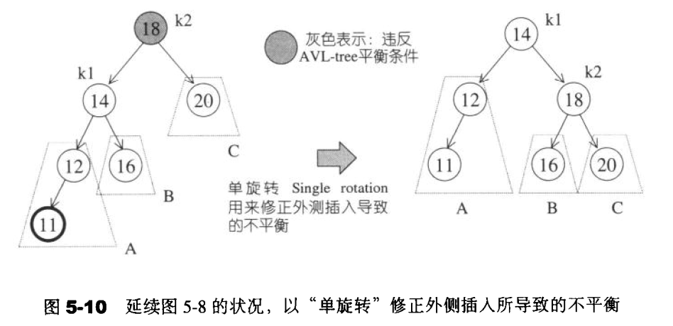
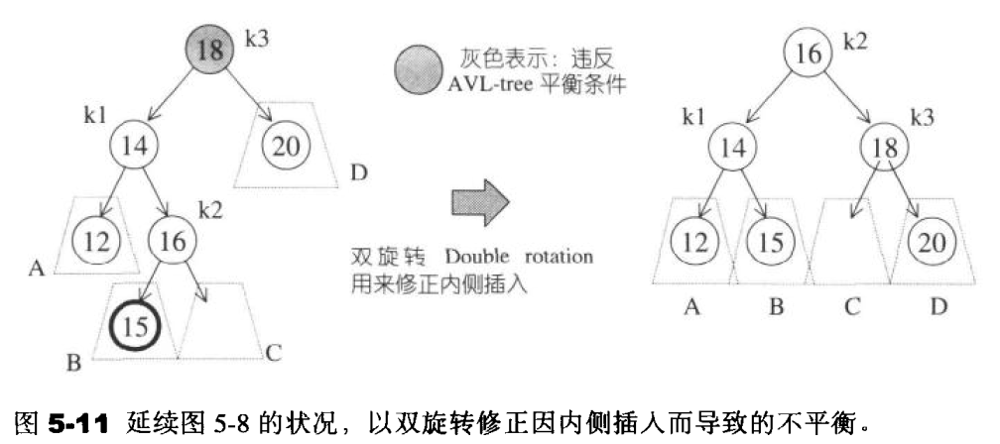
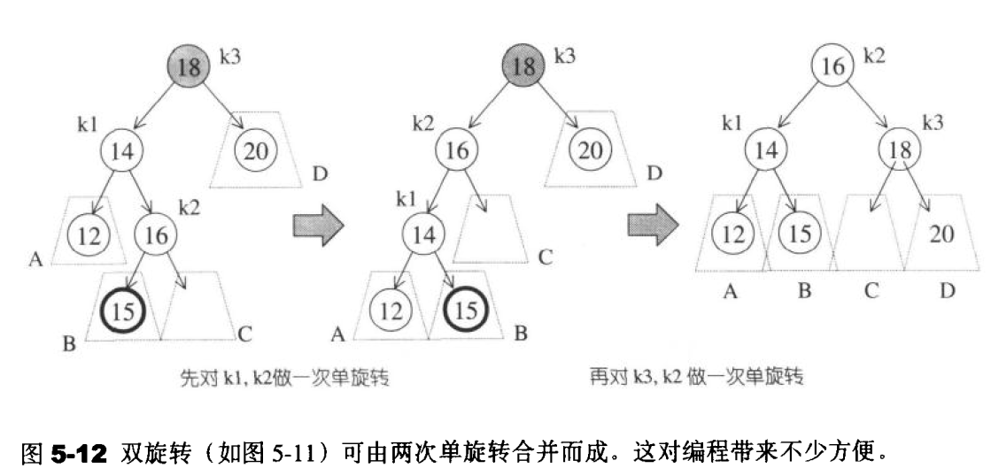
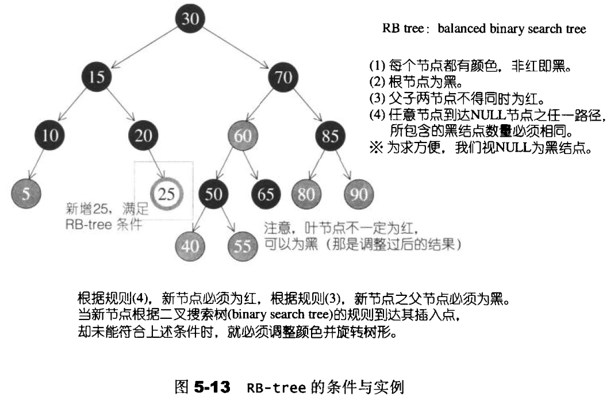
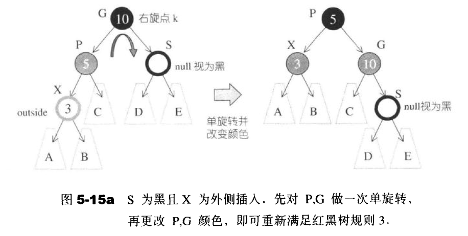
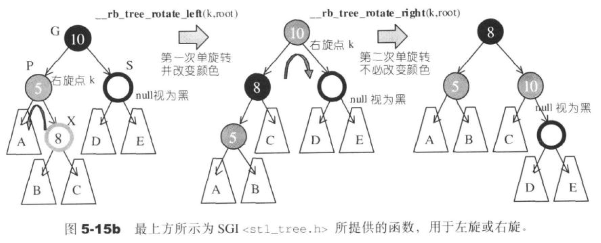
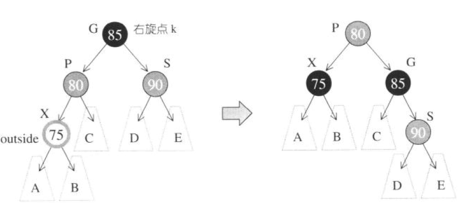
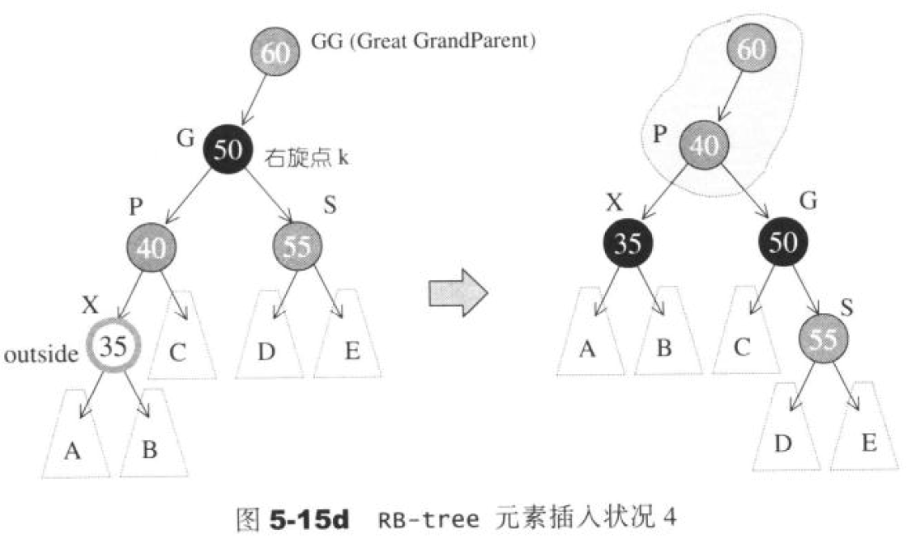
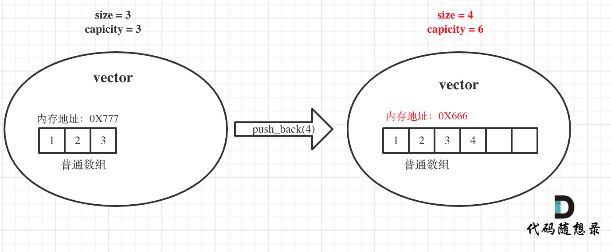

# STL

## 关联式容器

关联式容器没有所谓头尾(只有最大元素和最小元素)，所以不会有所谓push_back ( ) 、 push_front ( ) 、pop_back ( )、pop_front ( ). begin ( )、 end ()这样的操作行为。


### AVL平衡二叉树修正

#### 单旋转

在外侧插入状态中，k2“插人前平衡，插入后不平衡”的唯一情况如图5-10左侧所示。A子树成长了一层，致使它比C子树的深度多2。B子树不可能和A子树位于同一层，否则k2在插人前就处于不平衡状态了。B子树也不可能和C子树位于同一层，否则第一个违反平衡条件的将是k1而不是k2。



为了调整平衡状态,我们希望将A子树提高一层,并将C子树下降一层一这已经比AvL-tree所要求的平衡条件更进一步了。

图5-10右侧即是调整后的情况。我们可以这么想象，把k1向上提起，使k2自然下滑，并将B子树挂到k2的左侧。这么做是因为，二叉搜索树的规则使我们知道，k2 > k1，所以k2必须成为新树形中的kl的右子节点。二叉搜索树的规则也告诉我们，B子树的所有节点的键值都在k1和k2之间，所以新树形中的B子树必须落在k2的左侧。

以上所有调整操作都只需要将指针稍做搬移,就可迅速达成。完成后的新树形符合AVL-tree的平衡条件，不需再做调整。

#### 双旋转

图5-11左侧为内侧插人所造成的不平衡状态。单旋转无法解决这种情况。第一，我们不能再以k3为根节点，其次，我们不能将k3和k1做一次单旋转，因为旋转之后还是不平衡（你不妨自行画图试试）。

唯一的可能是以k2为新的根节点，这使得（根据二叉搜索树的规则）k1必须成为k2的左子节点，k3必须成为k2的右子节点，而这么一来也就完全决定了四个子树的位置。新的树形满足AVL-tree的平衡条件，并且，就像单旋转的情况一样，它恢复了节点插人之前的高度，因此保证不再需要任何调整。



**双旋转可利用两次单旋转完成**



### RB - tree （红黑树）

红黑树是二叉搜索树，但是不要求平衡，不严格控制左、右子树高度或节点数之差小于等于1。  

红黑树规定了：

1. 节点是红色或黑色。
2. 根节点是黑色。
3. 每个红色节点的两个子节点都是黑色。也就是说从每个叶子到根的所有路径上不能有两个连续的红色节点)。
4. 从任一节点到其每个叶子的所有路径都包含相同数目的黑色节点。
5. 每个叶子节点都是黑色的空节点（NIL节点）。

**根据规则4，新增节点必须为红;根据规则3，新增节点之父节点必须为黑。**当新节点根据二叉搜索树的规则到达其插人点，却未能符合上述条件时，就必须调整颜色并旋转树形。见图5-13说明。




#### 1 插入节点

为了方便讨论，让我先为某些特殊节点定义一些代名.以下讨论都将沿用这些代名。假设新节点为X，其父节点为P，祖父节点为G，伯父节点(父节点之兄弟节点）为S，曾祖父节点为GG。现在，根据二叉搜索树的规则，新节点X必为叶节点。根据红黑树规则4，X必为红。若Р亦为红（这就违反了规则3，必须调整树形)，则G必为黑（因为原为RB-tree，必须遵循规则3）。于是，根据X的插入位置及外围节点（S和GG）的颜色，有了以下四种考虑。

- 状况1: S为黑且X为外侧插入。对此情况，我们先对P,G做一次单旋转，再更改P,G颜色，即可重新满足红黑树的规则3。见图5-15a。



注意,此时可能产生不平衡状态(高度相差1以上)。例如图中的A和B为null,D或E不为 null。这倒没关系，因为 RB-tree 的平衡性本来就比AVL-tree 弱。然而RB-tree通常能够导致良好的平衡状态。是的，经验告诉我们，RB-tree的搜寻平均效率和AVL-tree几乎相等。

- 状况2: S为黑且X为内侧插人。对此情况，我们必须先对P,X做一次单旋转并更改G,X颜色，再将结果对G做一次单旋转，即可再次满足红黑树规则4。见图5-15b.



- 状况3: S 为红且X为外侧插人。对此情况，先对Р和G做一次单旋转，并改变X 的颜色。此时如果GG为黑，一切搞定，如图5-15c。但如果GG为红，则问题就比较大些，唔…见状况4。



- 状况4: S为红且X为外侧插入。对此情况，先对Р和G做一次单旋转，并改变X的颜色。此时如果GG亦为红，还得持续往上做，直到不再有父子连续为红的情况。




## 自己笔记

### STL

#### vector容器

emplace_back具有比push_back更好的性能

##### 底层

大家都知道对于普通数组，一旦定义了大小就不能改变，例如int a[10];，这个数组a至多只能放10个元素，改不了的。对于动态数组，就是可以不用关心初始时候的大小，可以随意往里放数据，那么耗时的原因就在于动态数组的底层实现。动态数组为什么可以不受初始大小的限制，可以随意push_back数据呢？

**首先vector的底层实现也是普通数组**。vector的大小有两个维度一个是size一个是capicity，size就是我们平时用来遍历vector时候用的，例如：

```cpp
for (int i = 0; i < vec.size(); i++) {

}
```

而capicity是vector底层数组（就是普通数组）的大小，capicity可不一定就是size。当insert数据的时候，如果已经大于capicity，capicity会成倍扩容，但对外暴漏的size其实仅仅是+1。

那么既然vector底层实现是普通数组，怎么扩容的？就是重新申请一个二倍于原数组大小的数组，然后把数据都拷贝过去，并释放原数组内存。（对，就是这么原始粗暴的方法！）

举一个例子，如图： 



原vector中的size和capicity相同都是3，初始化为1 2 3，此时要push_back一个元素4。那么底层其实就要申请一个大小为6的普通数组，并且把原元素拷贝过去，释放原数组内存，**注意图中底层数组的内存起始地址已经变了**。

**同时也注意此时capicity和size的变化，关键的地方我都标红了**。


#### set容器

- 所有元素插入时都会被自动排序，默认从小到大
- 容器内的各个元素都互不相等
- 自己主动插入重复的数字会被去掉

```cpp
s.begin()  // 正序迭代器
s.rbegin()  // 逆序迭代器，相当于正序的最后一个数
```

set容器不能用[]取值

#### unordered_set容器

- 等价为无序的set_容器

#### map容器

- map中所有的元素都是pair
- pair中第一个元素为key（键值），起到索引作用，第二个元素为value（实值）
- 所有元素都会根据元素的键值自动排序

#### unordered_map容器

- 等价为无序的map容器，其它都一样

#### stack容器

- stack是一种**先进后出**(First in Last Out)的数据结构，它只有一个出口

 构造函数：

- `stack<T> stk;`                                 //stack采用模板类实现， stack对象的默认构造形式
- `stack(const stack &stk);`            //拷贝构造函数

赋值操作：

- `stack& operator=(const stack &stk);`           //重载等号操作符

数据存取：

- `push(elem);`      //向栈顶添加元素
- `pop();`                //从栈顶移除第一个元素
- `top(); `                //返回栈顶元素

大小操作：

- `empty();`            //判断堆栈是否为空
- `size(); `              //返回栈的大小

#### queue容器

Queue是一种**先进先出**（First In First Out，FIFO）的数据结构

构造函数：

- `queue<T> que;`                                 //queue采用模板类实现，queue对象的默认构造形式
- `queue(const queue &que);`            //拷贝构造函数

赋值操作：

- `queue& operator=(const queue &que);`           //重载等号操作符

数据存取：

- `push(elem);`                             //往队尾添加元素
- `pop();`                                      //从队头移除第一个元素
- `back();`                                    //返回最后一个元素
- `front(); `                                  //返回第一个元素

大小操作：

- `empty();`            //判断堆栈是否为空
- `size(); `              //返回栈的大小

### STL-函数对象

#### 1 函数对象

##### 1.1 函数对象概念

**概念：**

- 重载**函数调用操作符**的类，其对象常称为**函数对象**
- **函数对象**使用重载的()时，行为类似函数调用，也叫**仿函数**

**本质：**

函数对象(仿函数)是一个**类**，不是一个函数

##### 1.2  函数对象使用

**特点：**

- 函数对象在使用时，可以像普通函数那样调用, 可以有参数，可以有返回值
- 函数对象超出普通函数的概念，函数对象可以有自己的状态
- 函数对象可以作为参数传递

#### 2  谓词

##### 2.1 谓词概念

**概念：**

- 返回bool类型的仿函数称为**谓词**
- 如果operator()接受一个参数，那么叫做一元谓词
- 如果operator()接受两个参数，那么叫做二元谓词

### STL-问题

#### 嵌套型别

在C++ STL（标准模板库）中，嵌套类型（Nested types）是指在一个类或模板类中定义的类型，这些类型被嵌套在类的内部，以提供更丰富的功能和灵活性。

STL中的容器类（如vector、list、map等）和算法类（如sort、find、transform等）通常都定义了一些嵌套类型。这些嵌套类型可以用于访问容器或算法的内部实现细节，或者用于返回特定类型的迭代器或其他辅助类型。

以下是一些常见的STL容器类中的嵌套类型：

1. value_type：表示容器中存储的元素类型。例如，对于vector\<int\>，value_type就是int。
2. iterator：表示容器的迭代器类型，用于遍历容器中的元素。
3. const_iterator：表示容器的常量迭代器类型，用于以只读方式遍历容器中的元素。
4. reverse_iterator：表示容器的反向迭代器类型，用于以逆序遍历容器中的元素。
5. const_reverse_iterator：表示容器的常量反向迭代器类型，用于以只读方式逆序遍历容器中的元素。

类似地，算法类中也可能定义了一些嵌套类型，例如函数对象类型、迭代器类型等，以支持算法的实现和使用。

通过使用这些嵌套类型，我们可以更方便地操作和访问STL容器和算法的内部元素和实现细节。

#### 为什么要判断是否能隐式转换

在 C++ STL 中，判断是否能进行隐式转换是为了确保算法和容器能够与不同类型的对象一起使用，从而提高代码的灵活性和可重用性。

STL 算法和容器是通用的，它们设计为可以处理各种不同类型的数据。例如，STL 的算法可以应用于不同类型的容器，如 `vector`、`list`、`set` 等，而不仅仅局限于特定的容器类型。这样的设计使得算法和容器能够适用于广泛的应用场景。

为了实现这种通用性，STL 使用了模板和泛型编程的技术。模板允许在编译时根据实际使用的类型生成具体的代码。然而，模板的泛化性也可能导致一些问题，比如可能会发生不期望的隐式类型转换。

为了避免不正确的隐式类型转换，STL 中的代码通常会使用一些技巧来判断是否能够进行隐式转换。这样可以确保在进行类型转换时不会发生意外的行为，同时也可以提供更好的类型安全性。

通过进行类型检查和判断，STL 能够在编译时捕获一些潜在的错误，从而提高代码的可靠性和可维护性。这种做法使得 STL 在处理不同类型的对象时更加健壮和可靠，同时也为开发者提供了更大的灵活性和可扩展性。


