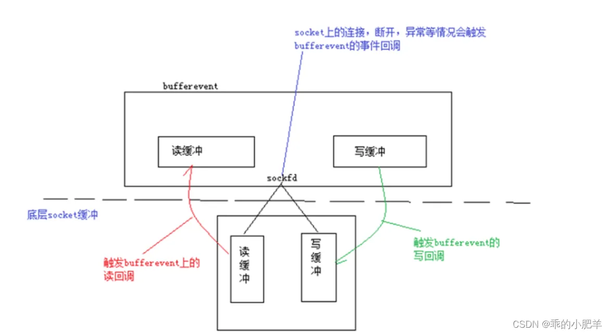

# libevent

## bufferevent

bufferevent是libevent中用于读写事件的结构体

`_std::lock_guard_` 是一个智能锁，它在构造时自动锁定`_mutex_`，并在析构时自动解锁，避免了忘记解锁导致的死锁问题

- `bufferevent_data_cb` 是一个函数指针类型，用于定义处理读写数据的回调函数；回调函数通常在缓冲区有数据可读或可写时被调用。
- 
- `bufferevent_event_cb` 是一个函数指针类型，用于定义处理事件的回调函数；事件包括读取错误、写入错误、EOF（文件结束）等。

## bufferevent的三种回调

**自带buffer的事件-bufferevent**

bufferevent实际上也是一个event, 只不过比普通的event高级一些, 它的内部有两个缓冲区, 以及一个文件描述符（网络套接字）。一个网络套接字有读和写两个缓冲区, bufferevent同样也带有两个缓冲区, 还有就是libevent事件驱动的核心回调函数, 那么四个缓冲区以及触发回调的关系如下：



从图中可以得知, 一个bufferevent对应两个缓冲区, 三个回调函数, 分别是写回调, 读回调和事件回调

bufferevent有三个回调函数：

**读回调** – 当bufferevent将底层读缓冲区的数据读到自身的读缓冲区时触发读事件回调.

**写回调** – 当bufferevent将自身写缓冲的数据写到底层写缓冲区的时候触发写事件回调, 由于数据最终是写入了内核的写缓冲区中, 应用程序已经无法控制, 这个事件对于应用程序来说基本没什么用, 只是通知功能.

**事件回调** – 当bufferevent绑定的socket连接, 断开或者异常的时候触发事件回调.


## 函数调用

### bufferevent_write

```c
/**
  向 bufferevent 缓冲区写入数据。

  bufferevent_write() 函数可用于将数据写入文件描述符。数据会被追加到输出缓冲区，并在文件描述符可写时自动写入。

  @param bufev 要写入的 bufferevent 对象
  @param data 指向要写入数据的指针
  @param size 数据的长度，以字节为单位
  @return 成功返回 0，发生错误返回 -1
  @see bufferevent_write_buffer()
  */
EVENT2_EXPORT_SYMBOL
int bufferevent_write(struct bufferevent *bufev,
                      const void *data, size_t size);
```

