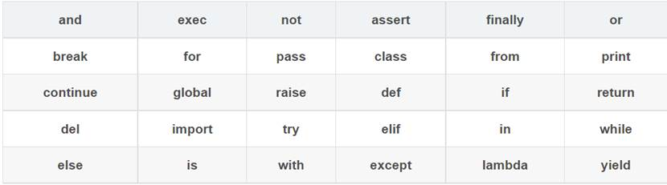
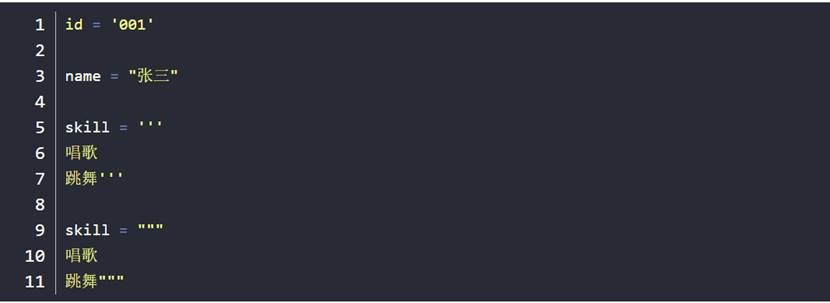
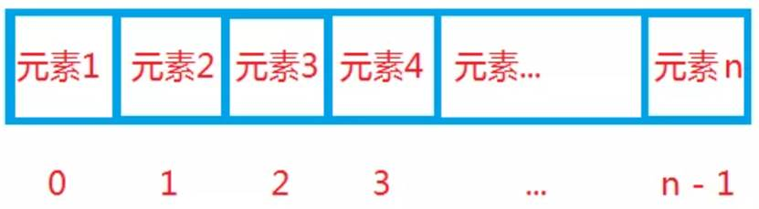
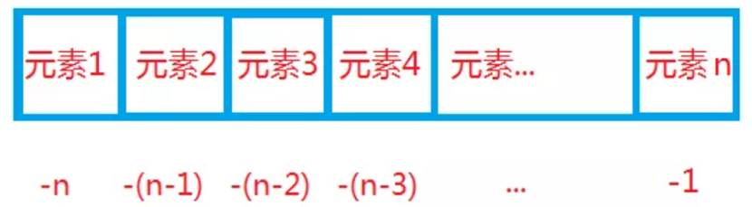
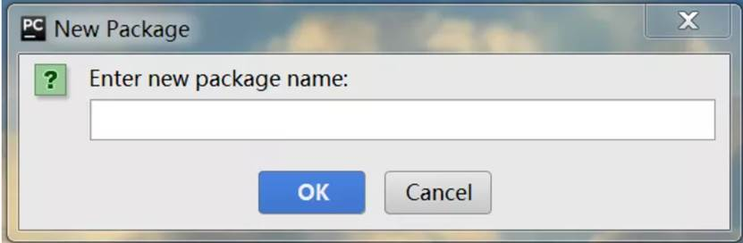
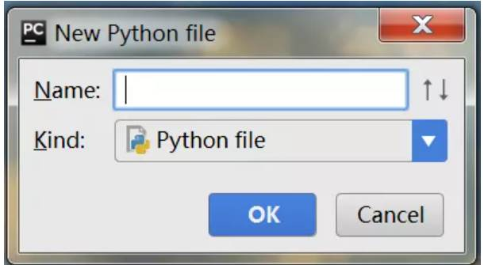
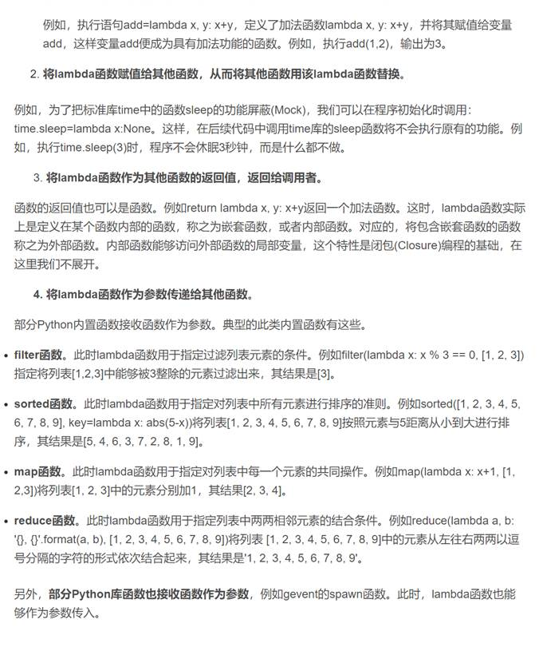
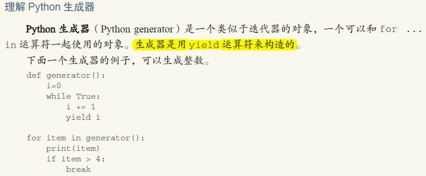
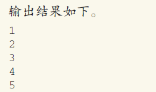

# python基础

## 入门必备知识

### 1 标识符

标识符是编程时使用的名字，用于给变量、函数、语句块等命名，Python 中标识符由字母、数字、下划线组成，不能以数字开头，区分大小写。

以下划线开头的标识符有特殊含义，单下划线开头的标识符，如：_xxx ，表示不能直接访问的类属性，需通过类提供的接口进行访问，不能用 from xxx import * 导入；双下划线开头的标识符，如：__xx，表示私有成员；双下划线开头和结尾的标识符，如：__xx__，表示 Python 中内置标识，如：__init__() 表示类的构造函数。

### 2 关键字

上面表中是 Python 中的关键字（保留字），我们在自定义标识符时不能使用关键字。

### 3 引号

Python 可以使用引号（'）、双引号（"）、三引号（''' 或 """）来表示字符串，引号的开始与结束须类型相同，三引号可以由多行组成。如下所示：

### 4 编码

Python2 中默认编码为 ASCII，假如内容为汉字，不指定编码便不能正确的输出及读取，比如我们想要指定编码为 UTF-8，Python 中通过在开头加入 # -*- coding: UTF-8 -*- 进行指定。

 

Python3 中默认编码为 UTF-8，因此在使用 Python3 时，我们通常不需指定编码。

### 5 输入输出

Python 输出使用 print()，内容加在括号中即可。如下所示：

 

print('Hello Python')

 

Python 提供了一个 input()，可以让用户输入字符串，并存放到一个变量里。如下所示：

 

name = input()

print('Hi',name)

### 6 缩进

Python 不使用 {} 来控制类、函数、逻辑判断等，而是使用缩进，缩进的空格可变。如下所示：

 

if True:

  print(True)

else:

  print(False)

### 7 多行

Python 中一般以新行作为语句的结束标识，可以使用 \ 将一行语句分为多行显示。如下所示：

 

a = 128

b = 1024

c = 512

d = a + \

  b - \

  c

如果包含在 []、{}、() 括号中，则不需要使用 \。如下所示：

 

arr = {

  a,

  b,

  c

}

### 8 注释

Python 中单行注释使用 #，多行注释使用三个单引号（'''）或三个双引号（"""）。如下所示：

 

\# 我是单行注释

 

'''

我是多行注释

我是多行注释

'''

 

"""

我是多行注释

我是多行注释

"""

### 9 数据类型

l 整数：可以为任意大小、包含负数

 

l 浮点数：就是小数

 

l 字符串：以单引号 '、双引号"、三引号 ''' 或 """括起来的文本

 

l 布尔：只有 True、False 两种值

 

l 空值：用 None 表示

 

l 变量：是可变的

 

l 常量：不可变

 

### 10 运算符

#### 10.1 常用运算符

运算符 描述    示例

\+   相加    a + b

\-    相减    a - b

\*   相乘    a * b

/    相除    a / b

%   取模    a % b

**  幂  a**b 表示 a 的 b 次幂

//   取整除 9 // 4 结果为 2

==  是否相等   a == b

!=  是否不等于 a != b

\>   是否大于   a > b

\>=  是否大于等于   a >= b

<=  是否小于等于   a <= b

=   简单的赋值运算符  a = b + c

+=  加法赋值运算符    a += b 等效于 a = a + b

-=   减法赋值运算符    a -= b 等效于 a = a - b

*=  乘法赋值运算符    a *= b 等效于 a = a * b

/=  除法赋值运算符    a /= b 等效于 a = a / b

%=  取模赋值运算符    a %= b 等效于 a = a % b

**= 幂赋值运算符   a **= b 等效于 a = a ** b

//= 取整除赋值运算符  a //= b 等效于 a = a // b

&   与  a & b

|   或  a | b

^   异或    a ^ b

~   取反    ~a

<<  左移动 a << 3

\>>  右移动 a >> 3

and 布尔类型与 a and b

or  布尔类型或 a or b

not 布尔类型非 not a

is   判断两个标识符是否引用同一个对象    a is b

is not   判断两个标识符是否引用不同对象  a is not b

#### 10.2 运算符优先级

运算符 描述（由上至下对应优先级由高到低）

**  幂运算

~ + -    取反、正号、负号

\* / % // 乘、除、取模、取整除

\+ -  加法、减法

\>> <<   右移、左移

&   与

^ |  异或、或

<= < > >=    比较运算符

== !=    是否等于、是否不等于

= %= /= //= -= += *= **=  赋值运算符

is is not 身份运算符

in not in 成员运算符

not and or   逻辑运算符

————————————————

版权声明：本文为CSDN博主「Python小二」的原创文章，遵循CC 4.0 BY-SA版权协议，转载请附上原文出处链接及本声明。

原文链接：https://blog.csdn.net/ityard/article/details/102807071

## 基本语句

### 1 条件语句

在进行逻辑判断时，我们需要用到条件语句，Python 提供了 if、elif、else 来进行逻辑判断。格式如下所示：

 

if 判断条件1:

  执行语句1...

elif 判断条件2:

  执行语句2...

elif 判断条件3:

  执行语句3...

else:

  执行语句4...

### 2 循环语句

当需要多次重复执行时，我们要用到循环语句，Python 提供了 for 循环和 while 循环。

#### 2.1 for 循环

for 循环可以遍历任何序列，比如：字符串。如下所示：

 

str = 'Python'

for s in str:

  print(s)

输出结果：

 

P

y

t

h

o

n

#### 2.2 while 循环

while 循环，满足条件时进行循环，不满足条件时退出循环。如下所示：

 

sum = 0

m = 10

while m > 0:

  sum = sum + m

  m = m - 1

print(sum)

输出结果：

 

55

#### 2.3 break

break 用在 for 循环和 while 循环语句中，用来终止整个循环。如下所示：

 

str = 'Python'

for s in str:

  if s == 'o':

​    break

  print(s)

输出结果：

 

P

y

t

h

#### 2.4 continue

continue 用在 for 循环和 while 循环语句中，用来终止本次循环。如下所示：

 

str = 'Python'

for s in str:

  if s == 'o':

​    continue

  print(s)

输出结果：

 

P

y

t

h

n

3 pass 语句

pass 是空语句，它不做任何事情，一般用做占位语句，作用是保持程序结构的完整性。如下所示：

 

if True:

pass

## 我是一个数字

序言

Hello，我是 Python 数据类型数字，大家之前对我可能已经有所耳闻，俗话说闻名不如见面，见面要先自我介绍，为了让大家对我有一个清晰的了解，下面我要向大家介绍一下自己。

### 1 数值类型

我有三种数值类型，分别是：整型（int）、浮点型（float）、复数（complex），如果你使用的还是我的低版本 Python2，那么还包含长整型（long）。

- **整型**：包括正整数、负整数。如：1024、-1024。整型有四种进制表示，分别为：二进制、八进制、十进制、十六进制，说明如下表所示：

| **种类** | **描述**                                     | **引导符** |
| -------- | -------------------------------------------- | ---------- |
| 二进制   | 由 0 和 1 组成                               | 0b 或 0B   |
| 八进制   | 由 0 到 7 组成                               | 0o 或 0O   |
| 十进制   | 默认情况                                     | 无         |
| 十六进制 | 由 0 到 9、a 到 f、A 到 F 组成，不区分大小写 | 0x 或 0X   |

- **浮点型**：由整数部分和小数部分组成。
- **复数**：由实数部分和虚数部分组成。

### 2 基本运算

我的基本运算见下表，整型和浮点型均支持下表中运算。

| **运算**      | **描述**                                     |
| ------------- | -------------------------------------------- |
| x + y         | x 和 y 的和                                  |
| x - y         | x 和 y 的差                                  |
| x * y         | x 和 y 的乘积                                |
| x / y         | x 和 y 的商                                  |
| x // y        | x 除以 y，取整除                             |
| x % y         | x 除以 y，取模                               |
| -x            | x 取反                                       |
| +x            | x 不变                                       |
| abs(x)        | x 的绝对值                                   |
| int(x)        | 将 x 转换为整数                              |
| float(x)      | 将 x 转换为浮点数                            |
| complex(x, y) | 一个带有实部 x 和虚部 y 的复数，y 默认为 0。 |
| divmod(x, y)  | (x // y, x % y)                              |
| pow(x, y)     | x 的 y 次幂                                  |
| x ** y        | x 的 y 次幂                                  |

### 3 数学函数

除了上面的基本运算外，我还可以借助数学模块 math 实现更多的运算。

首先要先引入数学模块 math。如下所示：

- import math

引入之后就可以使用了，以 math 模块中求平方根函数 sqrt(x) 为例。使用方式如下所示：

- import math

·    math.sqrt(1024)

math 模块中除了求平方根函数，还有很多可以使用的函数。如下表所示：

| **函数**     | **描述**                                      |
| ------------ | --------------------------------------------- |
| abs(x)       | 返回 x 的绝对值                               |
| ceil(x)      | 返回 x 的上入整数，如：math.ceil(1.1) 返回 2  |
| floor(x)     | 返回 x 的下舍整数，如：math.floor(1.1) 返回 1 |
| exp(x)       | 返回 e 的 x 次幂                              |
| log(x)       | 返回以 e 为底 x 的对数                        |
| log10(x)     | 返回以 10 为底 x 的对数                       |
| pow(x, y)    | 返回 x 的 y 次幂                              |
| sqrt(x)      | 返回 x 的平方根                               |
| factorial(x) | 返回 x 的阶乘                                 |

### 4 随机函数

在安全领域有时会用到随机数，random 模块对随机数的生成提供了支持。

首先还是要引入 random 模块。如下所示：

import random

下面简单介绍两个函数：

**random(x)****函数**

随机生成一个 0 到 1 范围内的实数。使用如下所示：

import random

random.random()

**uniform(x, y)****函数**

随机生成一个 x 到 y 范围内的实数。使用如下所示：

import random

random.uniform(1,10)

注:

- 文中的我、自己代指 Python 数据类型数字。
- 本文使用 Python3。

## 序列

### 1 简介

Python 中的序列是一块可存放多个值的连续内存空间，所有值按一定顺序排列，每个值所在位置都有一个编号，称其为索引，我们可以通过索引访问其对应值。

我们上一节说的Python 基础（四）：字符串就是序列结构，除此之外常见的序列结构还包括列表、元组等。

### 2 基本使用

#### 2.1 索引

序列索引支持非负数和负数，索引为非负数，从 0 开始，如下所示：

索引为负数由右向左计数，从 -1 开始，如图所示：

下面通过一个示例作进一步了解，以字符串为例，如下所示：

 

str = 'Python'

print('str[0] str[-6] =', str[0], str[-6])

print('str[5] str[-1] =', str[5], str[-1])

输出结果：

str[0] str[-6] = P Pstr[5] str[-1] = n n

从结果来看，我们使用非负数索引与负数索引得到的结果一致。

#### 2.2 切片

切片操作可以访问一定范围内的元素，语法如下所示：

sname[start : end : step]

- sname：表示序列的名称；
- start：开始索引位置（包括该位置），默认为 0；
- end：表示切片的结束索引位置（不包括该位置），默认为序列的长度；
- step：步长。

以字符串为例，如下所示：

str = 'Python'

print(str[:3])

print(str[3:])

print(str[:])

输出结果：

Pyt

hon

Python

#### 2.3 相加

Python 支持类型相同的序列使用 + 作相加操作，该操作不会去除重复的元素。以字符串为例，如下所示：

- str1     = 'Python'str2 = 'Python'
- print('str1     + str2 --> ',str1 + str2)

输出结果：

- str1     + str2 --> PythonPython

#### 2.4 相乘

Python 中，使用数字 n 乘以一个序列会生成新的序列，内容为原来序列被重复 n 次的结果。以字符串为例，如下所示：

- str     = 'Python'
- print('2     * str --> ',2 * str)

输出结果：

- 2     * str --> PythonPython

#### 2.5 元素是否在序列中

Python 使用 in 关键字检查某元素是否为序列的成员，语法如下：

val in seq

- val：要检查的元素；
- seq：指定的序列。

通过一个例子作进一步了解，以字符串为例，如下所示：

- str     = 'Python'
- print('on'in     str)

输出结果：

- True

#### 2.6 内置函数

| **函数**    | **描述**                                    |
| ----------- | ------------------------------------------- |
| len()       | 计算序列的长度                              |
| max()       | 找出序列中的最大元素                        |
| min()       | 找出序列中的最小元素                        |
| list()      | 将序列转换为列表                            |
| str()       | 将序列转换为字符串                          |
| sum()       | 计算元素的和                                |
| sorted()    | 对元素进行排序                              |
| enumerate() | 将序列组合为一个索引序列，多用在 for 循环中 |

简单举几个例子，如下所示：

- str     = 'dbcae'
- print('len     -->', len(str))
- print('max     -->', max(str))
- print('sorted     -->', sorted(str))

输出结果：

- len     --> 5
- max     --> e
- sorted     --> ['a', 'b', 'c', 'd', 'e']

## 列表与元祖

### 1列表

#### 1.1 简介

Python 中没有数组，而是加入了功能更强大的列表（list），列表可以存储任何类型的数据，同一个列表中的数据类型还可以不同；列表是序列结构，可以进行序列结构的基本操作：索引、切片、加、乘、检查成员。

#### 1.2 基本使用

##### ➢ 创建

列表中所有元素都放在一个中括号 [] 中，相邻元素之间用逗号 , 分隔，如下所示：

- l = [1024, 0.5, 'Python']

##### ➢ 访问

通过索引访问列表中的值，还可以使用 : 截取范围内的元素，如下所示：

- l = [1024, 0.5, 'Python']
- print('l[0] -->', l[0])
- print('l[1:] -->', l[1:])

输出结果：

- l[0] --> 1024
- l[1:] --> [0.5, 'Python']

##### ➢ 更新

除了对列表中现有元素进行修改外，还可以使用 append() 向列表中添加新元素，如下所示：

l = [1024, 0.5, 'Python']

\# 修改列表中第二个元素

l[1] = 5

\# 向列表中添加新元素

l.append('Hello')print('l[1] -->', l[1])

print('l -->', l)

输出结果：

l[1] --> 5

l --> [1024, 5, 'Python', 'Hello']

##### ➢ 删除

使用 del 删除列表中元素，如下所示：

- l = [1024, 0.5, 'Python']
- \# 删除列表中第二个元素
- del l[1]
- print('l -->', l)

输出结果：

- l --> [1024, 'Python']

##### ➢ 常用方法

###### ① count()

统计列表中某个元素出现的次数，使用如下所示：

- l = ['d', 'b', 'a', 'f', 'd']
- print("l.count('d') -->", l.count('d'))

输出结果：

l.count('d') --> 2

###### ② index()

查找某个元素在列表中首次出现的位置（即索引），使用如下所示：

- l = ['d', 'b', 'a', 'f', 'd']
- print("l.index('d') -->", l.index('d'))

输出结果：

- l.index('d') --> 0

###### ③ remove()

移除列表中某个值的首次匹配项，使用如下所示：

- l = ['d', 'b', 'a', 'f', 'd']
- l.remove('d')
- print("l -->", l)

输出结果：

- l --> ['b', 'a', 'f', 'd']

###### ④ sort()

对列表中元素进行排序，使用如下所示：

l = ['d', 'b', 'a', 'f', 'd']

l.sort()

print('l -->', l)

输出结果：

- l --> ['a', 'b', 'd', 'd', 'f']

###### ⑤ copy()

复制列表，使用如下所示：

- l = ['d', 'b', 'a', 'f', 'd']
- lc = l.copy()
- print('lc -->', lc)

输出结果：

- lc --> ['d', 'b', 'a', 'f', 'd']

### 2 元组

#### 2.1 简介

元组（tuple）与列表类似，但元组是不可变的，可简单将其看作是不可变的列表，元组常用于保存不可修改的内容。

#### 2.2 基本使用

##### ➢ 创建

元组中所有元素都放在一个小括号 () 中，相邻元素之间用逗号 , 分隔，如下所示：

t = (1024, 0.5, 'Python')

##### ➢ 访问

与访问列表中元素类似，如下所示：

t = (1024, 0.5, 'Python')

print('t[0] -->', t[0])

print('t[1:] -->', t[1:])

输出结果：

t[0] --> 1024

t[1:] --> (0.5, 'Python')

##### ➢ 修改

元组中元素不能被修改，我们要用重新赋值的方式操作，如下所示：

t = (1024, 0.5, 'Python')

t = (1024, 0.5, 'Python', 'Hello')

print('t -->', t)

输出结果：

t --> (1024, 0.5, 'Python', 'Hello')

##### ➢ 删除

元组中的元素不能被删除，我们只能删除整个元组，如下所示：

t = (1024, 0.5, 'Python')del tprint('t -->', t)

输出结果：

NameError: name 't' is not defined

由于元组实例被删除，所以输出了异常信息。

##### ➢ 常用方法

###### ① len()

计算元组中元素个数，使用如下所示：

t = (1024, 0.5, 'Python')

print('len(t) -->', len(t))

输出结果：

len(t) --> 3

###### ② max() 和 min()

返回元组中元素最大、最小值，使用如下所示：

t = ('d', 'b', 'a', 'f', 'd')

print('max(t) -->', max(t))

print('min(t) -->', min(t))

输出结果：

max(t) --> f

min(t) --> a

###### ③ tuple()

将列表转换为元组，使用如下所示：

l = ['d', 'b', 'a', 'f', 'd']

t = tuple(l)

print('t -->', t)

输出结果：

t --> ('d', 'b', 'a', 'f', 'd')

## 字典与集合

### 1 字典

当看到字典这个词时，有些人包括我自己在内，首先映入眼帘的便是新华字典

我清楚的记得，刚上小学时老师就让每一个学生准备一本新华字典，它的使用大家也应该都清楚，通过拼音、偏旁部首等进行查询；今天我们说的字典（dict）是 Python 的数据结构，因为都叫字典，我们不用想也知道它们是十分相似的，它们的内容都是以键-值（key-value）的方式存在的。

dict 拥有良好的查询速度，dict 中的值可以是任意 Python 对象，多次对一个 key 赋 value，后面的 value 会把前面的 value 覆盖。

#### 1.2 使用

字典的内容在花括号 {} 内，键-值（key-value）之间用冒号 : 分隔，键值对之间用逗号 , 分隔，比如创建字典 d，如下所示：

d = {'name':'小明', 'age':'18'}
 

\# 使用 dict 函数

\# 方式一

l = [('name', '小明'), ('age', 18)]

d = dict(l)

\# 方式二

d = dict(name='小明', age='18')
 \# 空字典

d = dict()

d = {}

 

字典中的值通过 key 进行访问，如下所示：

\>>> d = dict(name='小明', age='18')

\>>> d['name']'小明'
 \# 使用 get 方法

\>>> d.get('name')

'小明'

 

修改操作，以修改 age 为例，如下所示：

\>>> d = dict(name='小明', age='18')

\>>> d['age'] = '20'

\>>> d['age']

'20'

 

清空集合，如下所示：

\>>> d = dict(name='小明', age='18')

\>>> d.clear()

\>>> d

{}

 

获取字典的长度，如下所示：

\>>> d = dict(name='小明', age='18')

\>>> len(d)

2

### 2 集合

**2.1** **简介**

集合（set）与字典相同均存储 key，但也只存储 key，因 key 不可重复，所以 set 的中的值不可重复，也是无序的。

#### 2.2 使用

集合使用花括号 {} 或者 set() 函数创建，如果创建空集合只能使用 set() 函数，以创建集合 s 为例，如下所示：

s = {'a', 'b', 'c'}
 \# 使用 set 函数

s = set(['a', 'b', 'c'])
 \# 空集合

s = set()

 

集合中重复的元素会被自动过滤掉，如下所示：

\>>> s = {'a', 'a', 'b', 'c', 'c'}

\>>> s{'a', 'c', 'b'}

添加元素可以使用 add 或 update 方法，如果元素已经存在，则不进行操作，如下所示：

\>>> s = {'a', 'b', 'c'}

\>>> s.add('d')

\>>> s{'a', 'd', 'c', 'b'}

\>>> s.update('e')

\>>> s{'a', 'b', 'e', 'd', 'c'

}

\# 添加已经存在的元素

a>>> s.add('a')

\>>> s{'a', 'b', 'e', 'd', 'c'}

 

删除元素使用 remove 方法，如下所示：

\>>> s = {'a', 'b', 'c'}

\>>> s.remove('c')

\>>> s{'a', 'b'}

 

清空集合使用 clear 方法，如下所示：

\>>> s = {'a', 'b', 'c'}

\>>> s.clear()

\>>> sset()

 

获取集合的长度，同样使用 len 方法，如下所示：

\>>> s = {'a', 'b', 'c'}

\>>> len(s)

3

## 与时间相关的模块

### 1 time 模块

time 模块提供了很多与时间相关的类和函数，下面我们介绍一些常用的。

#### 1.1 struct_time 类

time 模块的 struct_time 类代表一个时间对象，可以通过索引和属性名访问值。对应关系如下所示：

| **索引** | **属性**                | **值**   |
| -------- | ----------------------- | -------- |
| 0        | tm_year（年）           | 如：1945 |
| 1        | tm_mon（月）            | 1  ~ 12  |
| 2        | tm_mday（日）           | 1  ~ 31  |
| 3        | tm_hour（时）           | 0  ~ 23  |
| 4        | tm_min（分）            | 0  ~ 59  |
| 5        | tm_sec（秒）            | 0  ~ 61  |
| 6        | tm_wday（周）           | 0  ~ 6   |
| 7        | tm_yday（一年内第几天） | 1  ~ 366 |
| 8        | tm_isdst（夏时令）      | -1、0、1 |

tm_sec 范围为 0 ~ 61，值 60 表示在闰秒的时间戳中有效，并且由于历史原因支持值 61。

localtime() 表示当前时间，返回类型为 struct_time 对象，示例如下所示：

import time

t = time.localtime()

print('t-->', t)

print('tm_year-->', t.tm_year)

print('tm_year-->', t[0])

输出结果：

t--> time.struct_time(tm_year=2019, tm_mon=12, tm_mday=1, tm_hour=19, tm_min=49, tm_sec=54, tm_wday=6, tm_yday=335, tm_isdst=0)

tm_year--> 2019

tm_year--> 2019

#### 1.2 常用函数

| **函数（常量）**       | **说明**                                                     |
| ---------------------- | ------------------------------------------------------------ |
| time()                 | 返回当前时间的时间戳                                         |
| gmtime([secs])         | 将时间戳转换为格林威治天文时间下的 struct_time，可选参数 secs 表示从 epoch 到现在的秒数，默认为当前时间 |
| localtime([secs])      | 与 gmtime() 相似，返回当地时间下的 struct_time               |
| mktime(t)              | localtime()  的反函数                                        |
| asctime([t])           | 接收一个 struct_time 表示的时间，返回形式为：Mon Dec  2 08:53:47 2019 的字符串 |
| ctime([secs])          | ctime(secs)  相当于  asctime(localtime(secs))                |
| strftime(format[,  t]) | 格式化日期，接收一个 struct_time 表示的时间，并返回以可读字符串表示的当地时间 |
| sleep(secs)            | 暂停执行调用线程指定的秒数                                   |
| altzone                | 本地 DST 时区的偏移量，以 UTC 为单位的秒数                   |
| timezone               | 本地（非 DST）时区的偏移量，UTC 以西的秒数（西欧大部分地区为负，美国为正，英国为零） |
| tzname                 | 两个字符串的元组：第一个是本地非 DST 时区的名称，第二个是本地 DST 时区的名称 |

epoch：1970-01-01 00:00:00 UTC

基本使用如下所示：

import time
 print(time.time())

print(time.gmtime())

print(time.localtime())

print(time.asctime(time.localtime()))

print(time.tzname)

\# strftime 使用

print(time.strftime('%Y-%m-%d %H:%M:%S', time.localtime()))

strftime 函数日期格式化符号说明如下所示：

| **符号** | **说明**                                                     |
| -------- | ------------------------------------------------------------ |
| %a       | 本地化的缩写星期中每日的名称                                 |
| %A       | 本地化的星期中每日的完整名称                                 |
| %b       | 本地化的月缩写名称                                           |
| %B       | 本地化的月完整名称                                           |
| %c       | 本地化的适当日期和时间表示                                   |
| %d       | 十进制数 [01,31] 表示的月中日                                |
| %H       | 十进制数 [00,23] 表示的小时（24小时制）                      |
| %I       | 十进制数 [01,12] 表示的小时（12小时制）                      |
| %j       | 十进制数 [001,366] 表示的年中日                              |
| %m       | 十进制数 [01,12] 表示的月                                    |
| %M       | 十进制数 [00,59] 表示的分钟                                  |
| %p       | 本地化的 AM 或 PM                                            |
| %S       | 十进制数 [00,61] 表示的秒                                    |
| %U       | 十进制数 [00,53] 表示的一年中的周数（星期日作为一周的第一天） |
| %w       | 十进制数 [0(星期日),6] 表示的周中日                          |
| %W       | 十进制数 [00,53] 表示的一年中的周数（星期一作为一周的第一天） |
| %x       | 本地化的适当日期表示                                         |
| %X       | 本地化的适当时间表示                                         |
| %y       | 十进制数 [00,99] 表示的没有世纪的年份                        |
| %Y       | 十进制数表示的带世纪的年份                                   |
| %z       | 时区偏移以格式 +HHMM 或 -HHMM 形式的 UTC/GMT 的正或负时差指示，其中 H 表示十进制小时数字，M 表示小数分钟数字 [-23:59, +23:59] |
| %Z       | 时区名称                                                     |
| %%       | 字面的 '%' 字符                                              |

### 2 datetime 模块

datatime 模块重新封装了 time 模块，提供了更多接口，变得更加直观和易于调用。

#### 2.1 date 类

date 类表示一个由年、月、日组成的日期，格式为：datetime.date(year, month, day)。

- year 范围为：[1, 9999]
- month 范围为：[1, 12]
- day 范围为 [1, 给定年月对应的天数]。

类方法和属性如下所示：

| **方法（属性）**         | **说明**                       |
| ------------------------ | ------------------------------ |
| today()                  | 返回当地的当前日期             |
| fromtimestamp(timestamp) | 根据给定的时间戮，返回本地日期 |
| min                      | date  所能表示的最小日期       |
| max                      | date  所能表示的最大日期       |

使用示例如下所示：

import datetime

import time
 print(datetime.date.today())

print(datetime.date.fromtimestamp(time.time()))

print(datetime.date.min)

print(datetime.date.max)

实例方法和属性如下所示：

| **方法（属性）**           | **说明**                                                     |
| -------------------------- | ------------------------------------------------------------ |
| replace(year,  month, day) | 生成一个新的日期对象，用参数指定的年，月，日代替原有对象中的属性 |
| timetuple()                | 返回日期对应的 struct_time 对象                              |
| weekday()                  | 返回一个整数代表星期几，星期一为 0，星期天为 6               |
| isoweekday()               | 返回一个整数代表星期几，星期一为 1，星期天为 7               |
| isocalendar()              | 返回格式为 (year，month，day) 的元组                         |
| isoformat()                | 返回格式如 YYYY-MM-DD 的字符串                               |
| strftime(format)           | 返回自定义格式的字符串                                       |
| year                       | 年                                                           |
| month                      | 月                                                           |
| day                        | 日                                                           |

使用示例如下所示：

import datetime
 td = datetime.date.today()

print(td.replace(year=1945, month=8, day=15))

print(td.timetuple())

print(td.weekday())

print(td.isoweekday())

print(td.isocalendar())

print(td.isoformat())

print(td.strftime('%Y %m %d %H:%M:%S %f'))

print(td.year)

print(td.month)

print(td.day)

#### 2.2 time 类

time 类表示由时、分、秒、微秒组成的时间，格式为：time(hour=0, minute=0, second=0, microsecond=0, tzinfo=None, *, fold=0)。

- hour 范围为：[0, 24)
- minute 范围为：[0, 60)
- second 范围为：[0, 60)
- microsecond 范围为：[0, 1000000)
- fold 范围为：[0, 1]

实例方法和属性如下所示：

| **方法（属性）**                                             | **说明**                                                     |
| ------------------------------------------------------------ | ------------------------------------------------------------ |
| isoformat()                                                  | 返回 HH:MM:SS 格式的字符串                                   |
| replace(hour,  minute, second, microsecond, tzinfo, * fold=0) | 创建一个新的时间对象，用参数指定的时、分、秒、微秒代替原有对象中的属性 |
| strftime(format)                                             | 返回自定义格式的字符串                                       |
| hour                                                         | 时                                                           |
| minute                                                       | 分                                                           |
| second                                                       | 秒                                                           |
| microsecond                                                  | 微秒                                                         |
| tzinfo                                                       | 时区                                                         |

使用示例如下所示：

import datetime
 t = datetime.time(10, 10, 10)

print(t.isoformat())

print(t.replace(hour=9, minute=9))

print(t.strftime('%I:%M:%S %p'))

print(t.hour)print(t.minute)

print(t.second)

print(t.microsecond)

print(t.tzinfo)

#### 2.3 datetime 类

datetime 包括了 date 与 time 的所有信息，格式为：datetime(year, month, day, hour=0, minute=0, second=0, microsecond=0, tzinfo=None, *, fold=0)，参数范围值参考 date 类与 time 类。

类方法和属性如下所示：

| **方法（属性）**                   | **说明**                               |
| ---------------------------------- | -------------------------------------- |
| today()                            | 返回当地的当前时间                     |
| now(tz=None)                       | 类似于 today()，可选参数 tz 可指定时区 |
| utcnow()                           | 返回当前 UTC 时间                      |
| fromtimestamp(timestamp,  tz=None) | 根据时间戳返回对应时间                 |
| utcfromtimestamp(timestamp)        | 根据时间戳返回对应 UTC 时间            |
| combine(date,  time)               | 根据 date 和 time 返回对应时间         |
| min                                | datetime  所能表示的最小日期           |
| max                                | datetime  所能表示的最大日期           |

使用示例如下所示：

import datetime
 print(datetime.datetime.today())

print(datetime.datetime.now())

print(datetime.datetime.utcnow())

print(datetime.datetime.fromtimestamp(time.time()))

print(datetime.datetime.utcfromtimestamp(time.time()))

print(datetime.datetime.combine(datetime.date(2019, 12, 1), datetime.time(10, 10, 10)))

print(datetime.datetime.min)

print(datetime.datetime.max)

实例方法和属性如下所示：

| **方法（属性）**                                             | **说明**                                                     |
| ------------------------------------------------------------ | ------------------------------------------------------------ |
| date()                                                       | 返回具有同样 year,month,day 值的 date 对象                   |
| time()                                                       | 返回具有同样 hour, minute, second, microsecond 和 fold 值的 time 对象 |
| replace(year,  month, day=self.day, hour, minute, second, microsecond, tzinfo, * fold=0) | 生成一个新的日期对象，用参数指定的年，月，日，时，分，秒...代替原有对象中的属性 |
| weekday()                                                    | 返回一个整数代表星期几，星期一为 0，星期天为 6               |
| isoweekday()                                                 | 返回一个整数代表星期几，星期一为 1，星期天为 7               |
| isocalendar()                                                | 返回格式为 (year，month，day) 的元组                         |
| isoformat()                                                  | 返回一个以 ISO 8601 格式表示日期和时间的字符串 YYYY-MM-DDTHH:MM:SS.ffffff |
| strftime(format)                                             | 返回自定义格式的字符串                                       |
| year                                                         | 年                                                           |
| month                                                        | 月                                                           |
| day                                                          | 日                                                           |
| hour                                                         | 时                                                           |
| minute                                                       | 分                                                           |
| second                                                       | 秒                                                           |
| microsecond                                                  | 微秒                                                         |
| tzinfo                                                       | 时区                                                         |

使用示例如下所示：

import datetime
 td = datetime.datetime.today()

print(td.date())

print(td.time())

print(td.replace(day=11, second=10))

print(td.weekday())

print(td.isoweekday())

print(td.isocalendar())

print(td.isoformat())

print(td.strftime('%Y-%m-%d %H:%M:%S .%f'))

print(td.year)

print(td.month)

print(td.month)

print(td.hour)

print(td.minute)

print(td.second)

print(td.microsecond)

print(td.tzinfo)

### 3 calendar 模块

calendar 模块提供了很多可以处理日历的函数。

#### 3.1 常用函数

| **方法**                            | **说明**                                           |
| ----------------------------------- | -------------------------------------------------- |
| setfirstweekday(weekday)            | 设置每一周的开始(0 表示星期一，6 表示星期天)       |
| firstweekday()                      | 返回当前设置的每星期的第一天的数值                 |
| isleap(year)                        | 如果 year 是闰年则返回 True ,否则返回 False        |
| leapdays(y1,  y2)                   | 返回 y1 至 y2 （包含 y1 和 y2 ）之间的闰年的数量   |
| weekday(year,  month, day)          | 返回指定日期的星期值                               |
| monthrange(year,  month)            | 返回指定年份的指定月份第一天是星期几和这个月的天数 |
| month(theyear,  themonth, w=0, l=0) | 返回月份日历                                       |
| prcal(year,  w=0, l=0, c=6, m=3)    | 返回年份日历                                       |

使用示例如下所示：

import calendar
 calendar.setfirstweekday(1)

print(calendar.firstweekday())

print(calendar.isleap(2019))

print(calendar.leapdays(1945, 2019))

print(calendar.weekday(2019, 12, 1))

print(calendar.monthrange(2019, 12))

print(calendar.month(2019, 12))

print(calendar.prcal(2019))

#### 3.2 Calendar 类

Calendar 对象提供了一些日历数据格式化的方法，实例方法如下所示：

| **方法**                     | **说明**                                    |
| ---------------------------- | ------------------------------------------- |
| iterweekdays()               | 返回一个迭代器，迭代器的内容为一星期的数字  |
| itermonthdates(year,  month) | 返回一个迭代器，迭代器的内容为年 、月的日期 |

使用示例如下所示：

from calendar import Calendar
 c = Calendar()

print(list(c.iterweekdays()))

for i in c.itermonthdates(2019, 12):

  print(i)

#### 3.3 TextCalendar 类

TextCalendar 为 Calendar子类，用来生成纯文本日历。实例方法如下所示：

| **方法**                                  | **说明**                                                     |
| ----------------------------------------- | ------------------------------------------------------------ |
| formatmonth(theyear,  themonth, w=0, l=0) | 返回一个多行字符串来表示指定年、月的日历                     |
| formatyear(theyear,  w=2, l=1, c=6, m=3)  | 返回一个 m 列日历，可选参数 w, l, 和 c 分别表示日期列数， 周的行数， 和月之间的间隔 |

使用示例如下所示：

from calendar import TextCalendar
 tc = TextCalendar()

print(tc.formatmonth(2019, 12))

print(tc.formatyear(2019))

#### 3.4 HTMLCalendar类

HTMLCalendar 类可以生成 HTML 日历。实例方法如下所示：

| **方法**                                                     | **说明**                                   |
| ------------------------------------------------------------ | ------------------------------------------ |
| formatmonth(theyear,  themonth, withyear=True)               | 返回一个 HTML 表格作为指定年、月的日历     |
| formatyear(theyear,  width=3)                                | 返回一个 HTML 表格作为指定年份的日历       |
| formatyearpage(theyear,  width=3, css='calendar.css', encoding=None) | 返回一个完整的 HTML 页面作为指定年份的日历 |

使用示例如下所示：

from calendar import HTMLCalendar
 hc = HTMLCalendar()

print(hc.formatmonth(2019, 12))

print(hc.formatyear(2019))

print(hc.formatyearpage(2019))

参考：

https://docs.python.org/zh-cn/3.7/library/time.html#time.process_time

https://docs.python.org/zh-cn/3.7/library/datetime.html?highlight=datetime#module-datetime

https://docs.python.org/zh-cn/3.7/library/calendar.html?highlight=calendar#module-calendar

## 函数

简单来说函数就是一段实现特定功能的代码，使用函数可以提高代码的重复利用率。Python 中有很多内置函数，比如之前常用的 print 函数，当内置函数不足以满足我们的需求时，我们还可以自定义函数。

### 2 自定义函数

Python 使用 def 关键字来声明函数，格式如下所示：

def 函数名(参数):

​    函数体

​    return 返回值

 

如果要定义一个无任何功能的空函数，函数体只写 pass 即可。格式如下所示：

def 函数名():

​    pass

 

当我们不确定参数的个数时，可以使用不定长参数，在参数名前加 * 进行声明，格式如下所示：

def 函数名(*参数名):

​    函数体

 

我们还可以使用 lambda 定义匿名函数，格式如下所示：

lambda 参数 : 表达式

*#* *空函数*

def my_empty():

  pass
 *#* *无返回值*

def my_print(name):

print('Hello', name)
 *#* *有返回值*

def my_sum(x, y):

  s = x + y

  print('s-->', s)

return s  

*#* *不定长参数*

def my_variable(*params):

for p in params:

​    print(p)
 *#* *匿名函数*

my_sub = lambda x, y: x - y

### 3 函数调用

调用一个函数只需要知道函数名和参数即可。 

 

my_empty()

my_print('Jhon')

result = my_sum(1, 2)

my_variable(1, 2, 3, 4, 5, 6)

print(my_sub(2, 1))

## 模块与包

### 1 简介

#### 1.1 模块

Python 中一个以 .py 结尾的文件就是一个模块，模块中定义了变量、函数等来实现一些类似的功能。Python 有很多自带的模块（标准库）和第三方模块，一个模块可以被其他模块引用，实现了代码的复用性。

#### 1.2 包

包是存放模块的文件夹，包中包含 __init__.py 和其他模块，__init__.py 可为空也可定义属性和方法，在 Python3.3 之前的版本，一个文件夹中只有包含 __init__.py，其他程序才能从该文件夹引入相应的模块、函数等，之后的版本没有 __init__.py 也能正常导入，简单来说就是 Python3.3 之前的版本，__init__.py 是包的标识，是必须要有的，之后的版本可以没有。

### 2 使用

#### 2.1 创建

##### 创建包

使用 PyCharm 创建包，步骤为：①打开 PyCharm 选中项目 ②右击鼠标选中 New 选项，然后再选中 Python Package 后单击鼠标，此时弹出创建窗口，如下所示：

我们填好名字后点击 OK 按钮即可。创建好后我们会发现 PyCharm 已经自动帮我们创建了空文件 __init__.py。

##### 创建模块

使用 PyCharm 创建模块，步骤为：①选中刚刚创建的包  ②右击鼠标选中 New 选项，然后再选中 Python File 后单击鼠标，此时弹出创建窗口，如下所示：

我们填好名字后点击 OK 按钮即可。

我们创建包和模块的最终目录结构为：

package|- pg1

|- - __init__.py

|- - a.py

|- - b.py

|- pg2

|- - __init__.py

|- - c.py

|- - d.py

 

a.py

def a():

  print('a')

b.py

def b():

  print('b')

c.py

def c():

  print('c')

d.py

def d():

  print('d')

#### 2.2 引用

从包中引入模块有如下两种方式：

import ...

import 包名1.包名2...模块名

from ... import ...

from 包名1.包名2... import 模块名

from 包名1.包名2...模块名 import 变量名/函数名

 

下面我们使用创建好的包和模块演示一下，如下所示：

\# a 模块中引入 b 模块

import pg1.b

from pg1 import b
 

\# a 模块中引入 c 模块

import pg2.c

from pg2 import c
 

\# a 模块中引入 c 模块和 d 模块

import pg2.c,pg2.d

from pg2 import c,d
 

\# a 模块中引入包 pg2 下的所有模块

from pg2 import *
 

\# a 模块中引入 d 模块中函数 d()

from pg2.d import d

\# 调用函数 d()

d()

## 面向对象

### 1 简介

面向对象（OOP）是一种对现实世界理解和抽象的方法，对象的含义是指在现实生活中能够看得见摸得着的具体事物，一句比较经典的描述是一切皆对象，Python 是一门面向对象的语言，面向对象编程简单来说就是一种封装代码的方式。

 

面向对象相关概念

l 类：描述具有相同属性和方法的集合，简单来说就是一个模板，通它来创建对象。

l 对象：类的实例。

l 方法：类中定义的函数。

l 类变量：定义在类中且在函数之外的变量，在所有实例化对象中公用。

l 局部变量：方法中定义的变量，只作用于当前实例。

 

面向对象三大特性

l 封装：隐藏对象的属性和实现细节，仅对外提供公共访问方式，提高复用性和安全性。

l 继承：一个类继承一个基类便可拥有基类的属性和方法，可提高代码的复用性。

l 多态：父类定义的引用变量可以指向子类的实例对象，提高了程序的拓展性。

 

### 2 基本操作

#### 2.1 类

Python 中类的定义使用 class 关键字，语法如下所示：

 

class 类名:

​    属性

​    ...

​    方法

​    ...

 

比如我们定义一个类 Cat，如下所示：

 

class Cat:

​    \# 属性

  color = 'black'

  \# 构造方法

  def __init__(self, name):

​    self.name = name

  \# 自定义方法

  def eat(self, food):

​    self.food = food

​    print(self.name, '正在吃'+food)

构造方法 __init__() 会在类实例化时自动调用。无论构造方法还是其他方法都需要将 self 作为第一个参数，它代表类的实例。

 

类创建好后，我们可以直接通过类名访问属性，格式为：类名.属性名，比如我们访问 Cat 类的 color 属性，如下所示：

print('color-->', Cat.color)

 

上面 Cat 类中定义的属性和方法都是公开的，除此之外我们还可以定义私有属性和方法，声明方式为：在属性名或方法名前加两条下划线，示例如下所示：

 

class Cat:

  __cid = '1'

  def __run(self):

​    pass

需要强调一点是：外部不能访问私有属性和调用私有方法，自然 Cat.__cid 是会报错的。

 

#### 2.2 对象

创建对象也称类的实例化，比如我们通过 Cat 类创建对象，如下所示：

 

 \# 创建对象

c = Cat('Tom')

 

创建好对象后，我们就可以使用它访问属性和调用方法了，如下所示：

 

\# 访问属性

print('name-->', c.name)

print('color-->', c.color)

\# 调用方法

c.eat('鱼')

 

同样对象 c 不能访问私有属性 __cid 及调用私有方法 __run，那我们会有这样一个疑问，这个私有属性和方法难道定义了却不能用吗？

 

我们来一起看个例子，如下所示：

 

class Cat:

  __cid = '1'

  def __run(self, speed):

​    print('__cid是'+self.__cid+'的猫', '以'+speed+'的速度奔跑')

  def run(self, speed):

​    self.__run(speed)

 

c.run('50迈')

输出结果：

__cid是1的猫 以50迈的速度奔跑

 

通过示例我们可以看出，在内部私有属性和方法是可以被访问和调用的。

 

#### 2.3 继承

Python 支持类的继承，而且支持多继承，语法格式为：

 

class 基类(子类1, 子类2 ...):

​    ...

 

示例如下所示：

 

\# 波斯猫类

class PersianCat(Cat):

  def __init__(self, name):

​    self.name = name

  def eat(self, food):

​    print(self.name, '正在吃'+food)

\#加菲猫类

class GarfieldCat(Cat):

  def __init__(self, name):

​    self.name = name

  def run(self, speed):

​    print(self.name, '正在以'+speed+'的速度奔跑')

\# 单继承

class SingleCat(PersianCat):

  pass

\# 多继承

class MultiCat(PersianCat, GarfieldCat):

  pass

 

\#调用

sc = SingleCat('波斯猫1号')

sc.eat('鱼')

 

mc = MultiCat('波斯加菲猫1号')

mc.eat('鱼')

mc.run('50迈')

 

如果继承的父类方法不能满足我们的需求，这时子类可以重写父类方法，如下所示：

 

class SingleCat(PersianCat):

  def eat(self, food ):

​    print(self.name, '正在吃'+food, '十分钟后', self.name+'吃饱了')

sc = SingleCat('波斯猫1号')

sc.eat('鱼')

## 文件操作

### 1 简介

在编程工作中文件操作还是比较常见的，基本文件操作包括：创建、读、写、关闭等，Python 中内置了一些文件操作函数，我们使用 Python 操作文件还是很方便的。

### 2 基本操作

#### 2.1 创建

Python 使用 open() 函数创建或打开文件，语法格式如下所示：

open(file, mode='r', buffering=-1, encoding=None, errors=None, newline=None, closefd=True, opener=None)

 

参数说明如下所示：

- **file**：表示将要打开的文件的路径，也可以是要被封装的整数类型文件描述符。
- **mode**：是一个可选字符串，用于指定打开文件的模式，默认值是 'r'（以文本模式打开并读取）。可选模式如下：

| **模式** | **描述**                         |
| -------- | -------------------------------- |
| r        | 读取（默认）                     |
| w        | 写入，并先截断文件               |
| x        | 排它性创建，如果文件已存在则失败 |
| a        | 写入，如果文件存在则在末尾追加   |
| b        | 二进制模式                       |
| t        | 文本模式（默认）                 |
| +        | 更新磁盘文件（读取并写入）       |

- **buffering**：是一个可选的整数，用于设置缓冲策略。
- **encoding**：用于解码或编码文件的编码的名称。
- **errors**：是一个可选的字符串，用于指定如何处理编码和解码错误（不能在二进制模式下使用）。
- **newline**：区分换行符。
- **closefd**：如果 closefd 为 False 并且给出了文件描述符而不是文件名，那么当文件关闭时，底层文件描述符将保持打开状态；如果给出文件名，closefd 为 True （默认值），否则将引发错误。
- **opener**：可以通过传递可调用的 opener 来使用自定义开启器。

 

以 txt 格式文件为例，我们不手动创建文件，通过代码方式来创建，如下所示：

open('test.txt', mode='w',encoding='utf-8')

执行完上述代码，就为我们创建好了 test.txt 文件。

#### 2.2 写入

上面我们创建的文件 test.txt 没有任何内容，我们向这个文件中写入一些信息，对于写操作，Python 文件对象提供了两个函数，如下所示：

| **函数**      | **描述**                           |
| ------------- | ---------------------------------- |
| write(str)    | 将字符串写入文件，返回写入字符长度 |
| writelines(s) | 向文件写入一个字符串列表           |

 

我们使用这两个函数向文件中写入一些信息，如下所示：

wf = open('test.txt', 'w', encoding='utf-8')

wf.write('Tom\n')

wf.writelines(['Hello\n', 'Python'])

\# 关闭

wf.close()

 

上面我们使用了 close() 函数进行关闭操作，如果打开的文件忘记了关闭，可能会对程序造成一些隐患，为了避免这个问题的出现，可以使用 with as 语句，通过这种方式，程序执行完成后会自动关闭已经打开的文件。如下所示：

with open('test.txt', 'w', encoding='utf-8') as wf:

  wf.write('Tom\n')

  wf.writelines(['Hello\n', 'Python'])

#### 2.3 读取

之前我们已经向文件中写入了一些内容，现在我们读取一下，对于文件的读操作，Python 文件对象提供了三个函数，如下所示：

| **函数**    | **描述**                                             |
| ----------- | ---------------------------------------------------- |
| read(size)  | 读取指定的字节数，参数可选，无参或参数为负时读取所有 |
| readline()  | 读取一行                                             |
| readlines() | 读取所有行并返回列表                                 |

我们使用上面三个函数读取一下之前写入的内容，如下所示：

with open('test.txt', 'r', encoding='utf-8') as rf:

print('readline-->', rf.readline())  

print('read-->', rf.read(6))  

print('readlines-->', rf.readlines())

#### 2.4 定位

Python 提供了两个与文件对象位置相关的函数，如下所示：

| **函数**                     | **描述**                                                     |
| ---------------------------- | ------------------------------------------------------------ |
| tell()                       | 返回文件对象在文件中的当前位置                               |
| file.seek(offset[,  whence]) | 将文件对象移动到指定的位置；offset 表示移动的偏移量；whence 为可选参数，值为 0 表示从文件开头起算（默认值）、值为 1 表示使用当前文件位置、值为 2 表示使用文件末尾作为参考点 |

 

下面通过示例对上述函数作进一步了解，如下所示：

with open('test.txt', 'rb+') as f:

f.write(b'123456789')  

\# 文件对象位置  

print(f.tell())  

\# 移动到文件的第四个字节  

f.seek(3)  

\# 读取一个字节，文件对象向后移动一位  

print(f.read(1))  

print(f.tell())  

\# 移动到倒数第二个字节  

f.seek(-2, 2)  

print(f.tell())  

print(f.read(1))

#### 2.5 其他

除了上面那些函数，Python 文件对象还有一些其他方法，如：isatty() 和 truncate()，但它们的出场率较低，没什么存在感。

 

直接通过示例简单了解一下，如下所示：

with open('test.txt', 'r+') as f:

\# 检测文件对象是否连接到终端设备  

print(f.isatty())  

\# 截取两个字节  

f.truncate(2)  

print(f.read())

## os模块

我们都知道 os 中文就是操作系统的意思，顾名思义，Python 的 os 模块提供了各种操作系统的接口，这些接口主要是用来操作文件和目录。

Python 中所有依赖于操作系统的内置模块统一设计方式为：对于不同操作系统可用的相同功能使用相同的接口，这样大大增加了代码的可移植性；当然，通过 os 模块操作某一系统的扩展功能也是可以的，但这样做会损害代码的可移植性。

### 2 常用函数

#### os.getcwd()

查看当前路径。

import os

print(os.getcwd())

 

#### os.listdir(path)

返回指定目录下包含的文件和目录名列表。

import os

print(os.listdir('E:/'))

 

#### os.path.abspath(path)

返回路径 path 的绝对路径。

import os

\# 当前路径（相对路径方式）

print(os.path.abspath('.'))

 

#### os.path.split(path)

将路径 path 拆分为目录和文件两部分，返回结果为元组类型。

import os

print(os.path.split('E:/tmp.txt'))

 

#### os.path.join(path, *paths)

将一个或多个 path（文件或目录） 进行拼接。

import os

print(os.path.join('E:/', 'tmp.txt'))

 

#### os.path.getctime(path)

返回 path（文件或目录） 在系统中的创建时间。

import os

import datetime

print(datetime.datetime.utcfromtimestamp(os.path.getctime('E:/tmp.txt')))

 

#### os.path.getmtime(path)

返回 path（文件或目录）的最后修改时间。

import os

import datetime

print(datetime.datetime.utcfromtimestamp(os.path.getmtime('E:/tmp.txt')))

 

#### os.path.getatime(path)

返回 path（文件或目录）的最后访问时间。

import os

import datetime

print(datetime.datetime.utcfromtimestamp(os.path.getatime('E:/tmp.txt')))

 

#### os.path.exists(path)

判断 path（文件或目录）是否存在，存在返回 True，否则返回 False。

import os

print(os.path.exists('E:/tmp.txt'))

 

#### os.path.isdir(path)

判断 path 是否为目录。

import os

print(os.path.isdir('E:/'))

 

#### os.path.isfile(path)

判断 path 是否为文件。

import os

print(os.path.isfile('E:/tmp.txt'))

 

#### os.path.getsize(path)

返回 path 的大小，以字节为单位，若 path 是目录则返回 0。

import os

print(os.path.getsize('E:/tmp.txt'))

print(os.path.getsize('E:/work'))

 

#### os.mkdir()

创建一个目录。

import os

os.mkdir('E:/test')

 

#### os.makedirs()

创建多级目录。

import os

os.makedirs('E:/test1/test2')

目录 test1、test2 均不存在，此时使用 os.mkdir() 创建会报错，也就是说

 os.mkdir() 创建目录时要保证末级目录之前的目录是存在的。

 

#### os.chdir(path)

将当前工作目录更改为 path。

import os

print(os.getcwd())

os.chdir('/test')

print(os.getcwd())

 

#### os.system(command)

调用 shell 脚本。

import os

print(os.system('ping www.baidu.com'))

如果出现乱码，可以通过修改编码解决，比如：我在 Windows 下 PyCharm 中出现乱码问题，可以将 PyCharm 中编码修改为 GBK 解决。

 

参考：

https://docs.python.org/zh-cn/3/library/os.html?highlight=os#module-os

 

# python编程进阶

## 1、lambda

### 1）一个语法

在Python中，lambda的语法是唯一的。其形式如下：

 

 lambda argument_list: expression

 

其中，lambda是Python预留的关键字，argument_list和expression由用户自定义。具体介绍如下。

 

\1. 这里的argument_list是参数列表，它的结构与Python中函数(function)的参数列表是一样的。具体来说，argument_list可以有非常多的形式。例如：

 

a, b

a=1, b=2

 *args

 **kwargs

 a, b=1, *args

空

......

\2. 这里的expression是一个关于参数的表达式。表达式中出现的参数需要在argument_list中有定义，并且表达式只能是单行的。以下都是合法的表达式：

 

1

 None

a + b

sum(a)

1 if a >10 else 0

 ......

\3. 这里的lambda argument_list: expression表示的是一个函数。这个函数叫做lambda函数。

### 2）三个特性

lambda函数有如下特性：

 

lambda函数是匿名的：所谓匿名函数，通俗地说就是没有名字的函数。lambda函数没有名字。

 

lambda函数有输入和输出：输入是传入到参数列表argument_list的值，输出是根据表达式expression计算得到的值。

 

lambda函数一般功能简单：单行expression决定了lambda函数不可能完成复杂的逻辑，只能完成非常简单的功能。由于其实现的功能一目了然，甚至不需要专门的名字来说明。

### 3）四个用法

## 2、理解python生成器

是一个类似于迭代器的对象，一个可以和for……in运算符一起使用的对象。生成器是用yield运算符来构造的。

 

# 自己的一些理解

1、库-包-模块(.py)-变量/函数