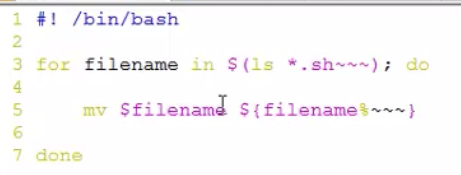

## 基本语法

> 数据类型全部都是字符串
>
> alias可以给命令取别名

```
### 变量

- $filename 取变量
- $(filename) 取变量中存的命令

export 将一个本地变量提升成环境变量

用**unset**命令可以**删除**已定义的环境变量或本地变量

### 文件名代换

​```bash
	* 匹配0个或多个任意字符
	? 匹配一个任意字符
	[若干字符] 匹配方括号中任意一个字符的一次出现

itcast$ ls /dev/ttyS*
itcast$ ls ch0?.doc
itcast$ ls ch0[0-2].doc
itcast$ ls ch[012] [0].doc
```

### 命令代换

由“`”反引号括起来的也是一条命令，Shell先执行该命令，然后将输出结果立刻代换到当前命令行中。例如定义一个变量存放date命令的输出：

```
itcast$ DATE=`date`
itcast$ echo $DATE

itcast$ DATE=$(date)
```

### 算术代换

```bash
使用$(())，用于算术计算，(())中的Shell变量取值将转换成整数，同样含义的$[ ]等价例如：
itcast$ VAR=45
itcast$ echo $(($VAR+3))	$((VAR+3))等价于echo $[VAR+3]或 $[$VAR+3]


$(())中只能用+-*/和()运算符，并且只能做整数运算。
$[base#n]，其中base表示进制，n按照base进制解释，后面再有运算数，按十进制解释。
echo $[2#10+11]
echo $[8#10+11]
echo $[16#10+11]
```

### 引号

和C语言同，Shell脚本中的单引号和双引号一样都是字符串的界定符（双引号下一节介绍），而不是字符的界定符。

单双引号可以互相嵌套，就可以显示出来


被双引号用括住的内容，将被视为单一字串。它防止通配符扩展，但允许变量扩展。这点与单引号的处理方式不同；**作为一种好的Shell编程习惯**，**应该总是把变量取值放在双引号之中**

```
"$VAR"
```


## shell脚本语法

### 条件测试

**命令test**或 [ 可以测试一个条件是否成立，如果测试结果为真，则该命令的Exit Status为0，如果测试结果为假，则命令的Exit Status为1（注意与C语言的逻辑表示正好相反）。

```bash
itcast@ubuntu:~$ echo $?    ## 返回上一个进程的返回值
```


虽然看起来很奇怪，但左方括号 [ 确实是一个命令的名字，传给命令的各参数之间应该用空格隔开，比如：$VAR、-gt、3、] 是 [ 命令的四个参数，它们之间必须用空格隔开。命令test或 [ 的参数形式是相同的，只不过test命令不需要 ] 参数。以 [ 命令为例，常见的测试命令如下表所示：

```bash
[ -d DIR ] 如果DIR存在并且是一个目录则为真
[ -f FILE ] 如果FILE存在且是一个普通文件则为真
[ -z STRING ] 如果STRING的长度为零则为真
[ -n STRING ] 如果STRING的长度非零则为真
[ STRING1 = STRING2 ] 如果两个字符串相同则为真
[ STRING1 != STRING2 ] 如果字符串不相同则为真
[ ARG1 OP ARG2 ] ARG1和ARG2应该是整数或者取值为整数的变量，OP是-eq（等于）-ne（不等于）-lt（小于）-le（小于等于）-gt（大于）-ge（大于等于）之中的一个
```

和C语言类似，测试条件之间还可以做与、或、非逻辑运算：

```bash
[ ! EXPR ] EXPR可以是上表中的任意一种测试条件，!表示“逻辑反(非)”

[ EXPR1 -a EXPR2 ] EXPR1和EXPR2可以是上表中的任意一种测试条件，-a表示“逻辑与”

[ EXPR1 -o EXPR2 ] EXPR1和EXPR2可以是上表中的任意一种测试条件，-o表示“逻辑或”
```


### 位置参数和特殊变量

```bash
$0 			相当于C语言main函数的argv[0]
$1、$2...	这些称为位置参数（Positional Parameter），相当于C语言main函数的argv[1]、argv[2]...
$## 			相当于C语言main函数的argc - 1，注意这里的#后面不表示注释
$@ 			表示参数列表"$1" "$2" ...，例如可以用在for循环中的in后面。
$* 			表示参数列表"$1" "$2" ...，同上
$? 			上一条命令的Exit Status
$$ 			当前进程号
```


$0不管放在函数里面还是函数外面，都是原来的第1个参数 ./func.sh

### 正则表达式

在正则表达式里面 ‘ ’ 和 “ ” 没什么差别

#### C语言中使用正则表达式

```C
int regcomp (regex_t *compiled, const char *pattern, int cflags)

		参数1：  结构体  --- 编译(字符串---结构体)存储正则表达式

		参数2：	 正则表达式串。

		参数3：	 标志位：  

				1. 扩展正则：REG_EXTENDED 

				2. 忽略大小写：REG_ICASE 

				3. 识别换行符：REG_NEWLINE   ---> ^ $ 

				4. 指定是否存储匹配结果：REG_NOSUB  --->  regexec函数参3取0值，并且参4取NULL


		返回值：成功0；失败错误号
```

```C
int regexec (regex_t *compiled, char *string, size_t nmatch, regmatch_t matchptr[], int eflags)

		参数1： regcomp编译后传出的 结构体

		参数2： 待用正则表达式 进行匹配的字符串

		参数3： 数组大小

		参数4： 用来存储返回结果的数组

		参数5： 标志位：

				1. REG_NOTBOL 使^无效

				2. REG_NOTEOL 使$无效

		返回值：成功0；失败错误号

```

```C
void regfree (regex_t *compiled)  ---> 释放结构体。

size_t regerror (int errcode, regex_t *compiled, char *buffer, size_t length)  --> 针对正则表达式的错误处理函数。
```

### grep

Linux系统中grep命令是一种强大的文本搜索工具，它能使用正则表达式搜索文本，并把匹配的行打印出来。grep全称是Global Regular Expression Print，表示全局正则表达式版本，它的使用权限是所有用户。

```
 grep -R "struct task_struct {"  /usr/src/ -n
```


### find

```bash
## find命令的一般形式为
find pathname -options [-print -exec -ok ...]
```

```
1. -name

	find ./ -name *.mp3

2. -type
	
	find ./ -type f/d/p/c/b/s/l

3. -size
	
	默认单位：512B-->0.5K-->一个扇区大小

	-M：不能m  find /home/itcast -size +3M -size -7M

	-k：不能K  find /home/itcast -size +47k -size -89k

4. -maxdepth：

	find ./ -maxdepth 2 -type d 

5. -exec、-ok   结果集一次性投入到缓冲区当中取执行命令

	find ./ -maxdepth 1 -name "*.sh" -exec rm -r {} \;

	find ./ -maxdepth 1 -name "*.sh" -ok rm -r {} \;

7. xargs    xargs会分批处理

	find ./ -maxdepth 1 -type f -print0 | xargs -0 ls -lh
	## print0把前面结尾的位置加上一个-0结束标记
	## xargs在拆分结果的时候按-0结束标记进行拆分

6. -print0

8. -atime  -- 访问时间
   -amin

   -mtime  -- 文件内容修改时间
   -mmin

   -ctime  -- 文件属性修改时间
   -cmin
```

```
find ./ -name "syslog.*.gz" -mtime -5 -exec ls -lh {} \;
```


\;  转义结束标记; 



%是用来在一个字符串进行截取的，把后面三个波浪号截掉

### sed

sed意为流编辑器（Stream Editor），在Shell脚本和Makefile中作为过滤器使用非常普遍，也就是把前一个程序的输出引入sed的输入，经过一系列编辑命令转换为另一种格式输出。sed和vi都源于早期UNIX的ed工具，所以很多sed命令和vi的末行命令是相同的。

```bash
## sed命令行的基本格式为
sed option 'script' file1 file2 ...
sed option -f scriptfile file1 file2 ...
```

```bash
$ sed 's/<.*>//g' testfile
## 结果是两个空行，把所有字符都过滤掉了。这是因为，正则表达式中的数量限定符会匹配尽可能长的字符串，这称为贪心的(Greedy)。比如sed在处理第一行时，<.*>匹配的并不是<html>或<head>这样的标签，而是
## <html><head><title>Hello World</title>

正确答案
$ sed 's/<[^<>]>//g' testfile    ## [^<>]:匹配除<>之外的任一字符
```


### awk

sed以行为单位处理文件，awk比sed强的地方在于不仅能以行为单位还能以列为单位处理文件。**awk****缺省的行分隔符是换行，缺省的列分隔符是连续的空格和Tab**，但是行分隔符和列分隔符都可以自定义，比如/etc/passwd文件的每一行有若干个字段，字段之间以:分隔，就可以重新定义awk的列分隔符为:并以列为单位处理这个文件。awk实际上是一门很复杂的脚本语言，还有像C语言一样的分支和循环结构，但是基本用法和sed类似，

```bash
## awk命令行的基本形式为：
awk option 'script' file1 file2 ...
awk option -f scriptfile file1 file2 ...
```

```
1. awk 参数 ‘脚本语句(/pattern/{actions})’ 待操作文件

2. awk 参数 -f ‘脚本文件’ 待操作文件

printf("%s\t%s\n", $11, $2);	

print $11 $2

BEGIN:	pattern 未匹配文件之前，执行某些操作。

		awk 'BEGIN {FS=":"} {print $7}' /etc/passwd

		awk -F: {print $7} /etc/passwd

END:	pattern 未匹配文件结束，执行某些操作。

		ps aux | awk '$2>6000 && $2<=7000 {num=num+1} END {print num}' 

		ps aux | awk  'BEGIN {FS=" "} $2>6000 && $2<=7000 {x=x+1} END {print x}' 

		ps aux | awk -F" " '$2>6000 && $2<=7000 {x=x+1} END {print x}'
```


## 操作

### 1、简单运行操作

#### 1.1 定义以开头：#!/bin/bash

\#!用来声明脚本由什么shell解释，否则使用默认shell


#### 1.2 单个"#"号代表注释当前行

###### 第一步：编写脚本文件


###### 第二步：加上可执行权限

chmod +x xxxx.sh


###### 第三步：运行


三种执行方式 （./xxx.sh bash xxx.sh . xxx.sh）

三种执行方式的不同点（./xxx.sh bash xxx.sh . xxx.sh）

 

./xxx.sh :先按照 文件中#!指定的解析器解析

如果#！指定指定的解析器不存在 才会使用系统默认的解析器

 

bash xxx.sh:指明先用bash解析器解析

如果bash不存在 才会使用默认解析器

 

. xxx.sh 直接使用默认解析器解析（不会执行第一行的#！指定的解析器）但是第一行还是要写的

 

三种执行情况：
 打开终端就会有以后个解释器，我们称为当前解释器
 我们指定解析器的时候（使用 ./xxx.sh 或 bash xxx.sh）时会创建一个子shell解析 脚本


### 2、利用git bash来运行脚本文件

安装git bash工具后就能执行linux命令，因为这些工具在windows实现了linux的功能。

Windows 和 Linux 提供给应用程序的功能接口是不一样的，所以这些应用不能直接在 Windows 中运行。要让这些程序运行，有两种办法，一个是修改程序的代码，让它在 Windows 中使用 Windows 的接口。另一个是在 Windows 中实现 Linux 的接口。

### 3、shell脚本并行执行matlab程序

```shell
#!/bin/sh
sim_time=5
ddl_factor=2
K=5
for Waves in 6 7
do
	for Load in 30 35 40 45 50 55 60
	do
		nohup matlab -nodisplay -nojvm -r 'var_par_NSFNET('${Load}','${K}','${ddl_factor}','${Waves}','${sim_time}'); exit;' test.out &
		echo -e "\n"
	done
done
```


 

 

## 知识点

### 2、解析器

ubutnu默认的解析器dash

/bin/sh  -> dash

 

dash解析器的解析效率很高，但是功能不如bash那么能打，因此在解析有些命令时，会出现找不到的错误。


可以修改默认脚本解析器为bash，方法如下： 1、命令行输入：sudo 

dpkg-reconfigure dash 2、选择  3、ls -l /bin/sh 查询确认

 

### 3、echo的作用

echo -n   输出之后不换行

echo -e   对于转义字符按对应的方式进行处理

echo `$i`   这里​`$`的作用是引用，i是变量，输出i的值

echo i     输出i


### 4、nohup

nohup是不挂起，关闭终端/退出账户后继续运行相应的进程

 

nohup python train.py > log.file 2>&1 &

 

注释：

nohup (no hang up)，不挂起。

python train.py 是原本运行程序的命令.

\>log.file 注意有>号，是将command的输出重定向到out.file文件，即输出内容不打印到屏幕上，而是输出到out.file文件中。（文件名可自定义，如output.log等）

2>&1 是将标准出错重定向到标准输出，这里的标准输出已经重定向到了log.file文件，即将标准出错也输出到out.file文件中。2与>结合代表错误重定向，而1则代表错误重定向到一个文件1，而不代表标准输出；换成2>&1，&与1结合就代表标准输出了，就变成错误重定向到标准输出。

**最后一个&， 是让该命令在后台执行。（不加&，ctrl+Z后加关掉终端，是会把程序打断的）** 

 

然后执行：

tail -f log.file 或者 tailf log.file

### 5、$的用法

 

### 6、> 和 >>的区别

\> 是覆盖原有内容

\>> 是追加内容

 

### 7、for循环

```
#!/bin/bash

**for((i=1;i<=10;i++));**

do 

    echo $(expr $i \* 3 + 1);

done
```

 

```
#!/bin/bash

**for i in $(seq 1 10)**

do 

    echo $(expr $i \* 3 + 1);

done
```


```
#!/bin/bash


**for i in {1..10}**

do

    echo $(expr $i \* 3 + 1);

done
```

循环常见场景：

 

```bash
　　##1、有限数字（用空格隔开）

　　for i in 1 2 3 4 5;do echo $i ;done　

　　##2、序列数据（seq 开始 步长 最后） ---步长默认1

　　for i in $(seq 1 3 100); do echo $i ;done

　　##3、命令结果（默认空格为分隔符）

　　for i in `cat 01.txt`;do echo $i ;done

　　for i in `ls | grep "heh"` ;do echo $i ;done

　　##4、语法循环（类似C，注意为双括号,分号隔开）

　　for ((i=1;i<3;i+=2));do echo i ;done

for ((;;);do echo"无限循环";done
```

 

### 8、shell数学计算

默认情况下，**Shell 不会直接进行算术运算**，而是把+两边的数据（数值或者变量）当做字符串，把+当做字符串连接符，最终的结果是把两个字符串拼接在一起形成一个新的字符串。

- **在 Bash Shell 中，如果不特别指明，每一个变量的值都是字符串，无论你给变量赋值时有没有使用引号，值都会以字符串的形式存储。**

**典型反面案例**

```shell
[c.biancheng.net]$ echo 2+8
2+8
[c.biancheng.net]$ a=23
[c.biancheng.net]$ b=$a+55
[c.biancheng.net]$ echo $b
23+55
[c.biancheng.net]$ b=90
[c.biancheng.net]$ c=$a+$b
[c.biancheng.net]$ echo $c
23+90
```


#### **数学计算命令**

| 运算操作符/运算命令 |                             说明                             |
| :------------------------------: | :----------------------------------------------------------: |
|      **(( ))**      |            **用于整数运算**，效率很高，推荐使用。            |
|         let         |                 用于整数运算，和 (()) 类似。                 |
|         $[]         |                用于整数运算，不如 (()) 灵活。                |
|        expr         | 可用于整数运算，也可以处理字符串。比较麻烦，需要注意各种细节，不推荐使用。 |
|       **bc**        | Linux下的一个计算器程序，可以**处理整数和小数**。Shell 本身只支持整数运算，想计算小数就得使用 bc 这个外部的计算器。 |
|     declare -i      | 将变量定义为整数，然后再进行数学运算时就不会被当做字符串了。功能有限，仅支持最基本的数学运算（加减乘除和取余），不支持逻辑运算、自增自减等，所以在实际开发中很少使用。 |

#### 对整数进行数学运算: (()) / let / $[] /expr

**(( )) 只能进行整数运算，不能对小数（浮点数）或者字符串进行运算**。

```
((表达式))
```

> 可以使用$获取 (( )) 命令的结果，这和使用$获得变量值是类似的。

```shell
[c.biancheng.net]$ echo $((1+1))
2
[c.biancheng.net]$ echo $((6-3))
3
[c.biancheng.net]$ i=5
[c.biancheng.net]$ ((i=i*2))  #可以简写为 ((i*=2))。
[c.biancheng.net]$ echo $i   #使用 echo 输出变量结果时要加 $。
10
```

```shell
[c.biancheng.net]$ ((a=1+2**3-4%3)) ##  **是求乘方运算符 这里是2^3
[c.biancheng.net]$ echo $a
8
[c.biancheng.net]$ b=$((1+2**3-4%3)) #运算后将结果赋值给变量，变量放在了括号的外面。
[c.biancheng.net]$ echo $b
8
[c.biancheng.net]$ echo $((1+2**3-4%3)) #也可以直接将表达式的结果输出，注意不要丢掉 $ 符号。
8
[c.biancheng.net]$ a=$((100*(100+1)/2)) #利用公式计算1+2+3+...+100的和。
[c.biancheng.net]$ echo $a
5050
[c.biancheng.net]$ echo $((100*(100+1)/2)) #也可以直接输出表达式的结果。
5050
```

```shell
[c.biancheng.net]$ a=10
[c.biancheng.net]$ echo $((a++))  #如果++在a的后面，那么在输出整个表达式时，会输出a的值,因为a为10，所以表达式的值为10。
10
[c.biancheng.net]$ echo $a #执行上面的表达式后，因为有a++，因此a会自增1，因此输出a的值为11。
11
[c.biancheng.net]$ a=11
[c.biancheng.net]$ echo $((a--)) #如果--在a的后面，那么在输出整个表达式时，会输出a的值，因为a为11，所以表达式的值的为11。
11
[c.biancheng.net]$ echo $a #执行上面的表达式后，因为有a--，因此a会自动减1，因此a为10。
10
[c.biancheng.net]$ a=10
[c.biancheng.net]$ echo $((--a))  #如果--在a的前面，那么在输出整个表达式时，先进行自增或自减计算，因为a为10，且要自减，所以表达式的值为9。
9
[c.biancheng.net]$ echo $a #执行上面的表达式后，a自减1,因此a为9。
9
[c.biancheng.net]$ echo $((++a))  #如果++在a的前面，输出整个表达式时，先进行自增或自减计算，因为a为9，且要自增1，所以输出10。
10
[c.biancheng.net]$ echo $a  #执行上面的表达式后，a自增1,因此a为10。
10
```

```shell
[c.biancheng.net]$ ((a=3+5, b=a+10))  #先计算第一个表达式，再计算第二个表达式
[c.biancheng.net]$ echo $a $b
8 18
[c.biancheng.net]$ c=$((4+8, a+b))  #以最后一个表达式的结果作为整个(())命令的执行结果
[c.biancheng.net]$ echo $c
26
```


#### bc命令：一款数学计算器

Linux bc 命令可以很方便的进行浮点运算，当然整数运算也不再话下。

在终端输入bc命令，然后回车即可进入 bc 进行交互式的数学计算。在 Shell 编程中，我们也可以通过管道和输入重定向来使用 bc。

例如你**不想输入 bc 命令后显示一堆没用的信息**，那么可以输入**bc -q**：


**内置变量**

| 变量名      | 作 用                                                        |
| ----------- | ------------------------------------------------------------ |
| scale       | 指定精度，也即小数点后的位数；默认为 0，也即不使用小数部分。 |
| ibase       | 指定输入的数字的进制，默认为十进制。                         |
| obase       | 指定输出的数字的进制，默认为十进制。                         |
| last 或者 . | 表示最近打印的数字                                           |

**【实例1】**scale 变量用法举例：
精度=3    精度=10


**【实例2】**ibase 和 obase 变量用法举例：
【注意】obase 要尽量放在 ibase 前面，因为 ibase 设置后，后面的数字都是以 ibase 的进制来换算的


**内置函数**

| 函数名  | 作用                               |
| ------- | ---------------------------------- |
| s(x)    | 计算 x 的正弦值，x 是弧度值。      |
| c(x)    | 计算 x 的余弦值，x 是弧度值。      |
| a(x)    | 计算 x 的反正切值，返回弧度值。    |
| l(x)    | 计算 x 的自然对数。                |
| e(x)    | 求 e 的 x 次方。                   |
| j(n, x) | 贝塞尔函数，计算从 n 到 x 的阶数。 |

要想使用这些数学函数，**在输入 bc 命令时需要使用-l选项，表示启用数学库。**


在一行中使用多个表达式，只要用分号;隔开就行


##### ==在 Shell 中使用 bc 计算器==

借助管道或者输入重定向来使用bc计算器

- **管道**是 Linux 进程间的一种通信机制，它可以**将前一个命令（进程）的输出作为下一个命令（进程）的输入**，两个命令之间使用竖线|分隔。
- 通常情况下，一个命令从终端获得用户输入的内容，如果让它从其他地方（比如文件）获得输入，那么就需要重定向。


直接输出 bc 的计算结果：

```shell
echo "expression" | bc
```

将 bc 的计算结果赋值给 Shell 变量：

```shell
variable=$(echo "expression" | bc)
```

【举例1】

```shell
[c.biancheng.net]$ echo "3*8"|bc
24
[c.biancheng.net]$ ret=$(echo "4+9"|bc)
[c.biancheng.net]$ echo $ret
13
```

【实例2】使用 bc 中的变量：

```shell
[c.biancheng.net]$ echo "scale=4;3*8/7"|bc
3.4285
[c.biancheng.net]$ echo "scale=4;3*8/7;last*5"|bc
3.4285
17.1425
```

【实例3】使用 Shell 脚本中的变量：

```shell
[c.biancheng.net]$ x=4
[c.biancheng.net]$ echo "scale=5;n=$x+2;e(n)"|bc -l
403.42879
```

【实例4】进制转换：

```shell
#十进制转十六进制
[mozhiyan@localhost ~]$ m=31
[mozhiyan@localhost ~]$ n=$(echo "obase=16;$m"|bc)
[mozhiyan@localhost ~]$ echo $n
1F
#十六进制转十进制
[mozhiyan@localhost ~]$ m=1E
[mozhiyan@localhost ~]$ n=$(echo "obase=10;ibase=16;$m"|bc)
[mozhiyan@localhost ~]$ echo $n
30
```


借助输入重定向使用bc计算器

```shell
variable=$(bc << EOF
expressions
EOF
)
```

- variable是 Shell 变量名
- express是要计算的数学表达式（可以换行，和进入 bc 以后的书写形式一样）
- EOF是数学表达式的开始和结束标识（你也可以换成其它的名字，比如 aaa、bbb 等）。
  【举例】

```shell
[c.biancheng.net]$ m=1E
[c.biancheng.net]$ n=$(bc << EOF
> obase=10;
> ibase=16;
> print $m
> EOF
> )
[c.biancheng.net]$ echo $n
30

```

### 9、shell中行末尾的“&”作用

& 代表非阻塞方式执行当前行，如果不加& 则必须等到执行完该指令后才能执行后来的指令。

### 10、shell脚本串行和并行

#### **串行改为并行**

首先，先来看一个串行的例子：

```shell
for i in `seq 1 10`
do
    sleep 1; echo $i
done

```

这是一个迭代次数为10的循环，每一个循环都会等待 1 秒，执行总时长约等于 10 秒。sleep 1 会阻塞循环，只有 sleep 1 执行结果，才会进入下一循环，这是典型的串行模式。

**shell** **提供了一种把命令提交到后台任务队列的机制，即使用** **命令 &** **将命令控制权交到后台并立即返回执行下个任务。**

```shell
for i in `seq 1 10`
do
    sleep 1 &; echo $i
done
```

还是这个例子，多了个 & 符，其作用是将命令 sleep 1 提交到后台去执行，而 for 无须等待就可进入下一次循环。所以上面的 for 循环在 1 秒未到的时间内就执行完毕，然后系统会逐个执行 sleep 1 并向终端报告命令执行结束。

#### **并行-等待模式**

上面将串行循环改为并行循环的例子，并没考虑这样的情况。

\>  for i in `seq 1 10`

do

​    sleep 1 &; echo $i

done

echo "all weakup"

这个例子要求在 for 循环中的所有命令（sleep 1）都执行完之后，打印 “all weakup”。如果按照这段脚本，发现情况并不是这样的，因为 for 循环不会等待 sleep 命令执行结束后才结束，而是把命令提交给系统后自己就退出了，进而还没有1个 sleep 执行完毕之前，“all weakup” 就已经打印了。

为了达到题目要求，需要在 echo "all weakup" 命令之前，加上 wait命令，意为等待上面所有 & 作用过的后台任务执行结束后才继续往下。

\>  for i in `seq 1 10`

do

​    sleep 1 &; echo $i

done

wait

echo "all weakup"

wait就是等待前面所有的命令、程序执行完，才执行接下来的任务

## 问题

### 1、./filename.sh文件 你没有足够权限 

1）chmod +x xxxx.sh

加上可执行权限

2）bash filename.sh

直接用bash解析器解析

#### 2、脚本中' ' 和` `的区别

在脚本编程中，`' '`（单引号）和 `` ` ``（反引号或称为反引号）具有不同的作用和用法。

1. `' '`（单引号）：在单引号内部的内容会被视为字符串字面量，其中的特殊字符和变量引用不会被解析或扩展。单引号字符串是一种保持字面值的方式，适用于不需要变量替换或特殊字符解析的情况。例如：

```bash
name='John'
echo 'Hello, $name'  # 输出：Hello, $name
```

在上述示例中，`$name` 不会被解析为变量，而是作为普通字符输出。

2. `` ` ``（反引号或称为反引号）：在反引号内部的内容会被视为命令替换，即反引号中的命令会被执行，并将其输出结果作为字符串返回。这种语法可以用于将命令的输出赋值给变量或在脚本中嵌入命令的执行结果。例如：

```bash
current_date=`date`
echo "Current date is: $current_date"
```

在上述示例中，`date` 命令被执行，并将其输出结果赋值给 `current_date` 变量，然后输出当前日期。

需要注意的是，在较新的 Bash 版本中，推荐使用 `$()` 语法来代替反引号，因为它更易读并且可以嵌套使用。例如：

```bash
current_date=$(date)
echo "Current date is: $current_date"
```

这两种语法的主要区别在于对特殊字符和变量的处理方式。单引号保持字面值，不解析特殊字符和变量引用；而反引号（或 `$()`）用于命令替换，执行命令并将其输出作为字符串返回。根据具体的需求，选择适合的语法来处理字符串和命令的解析需求。

 