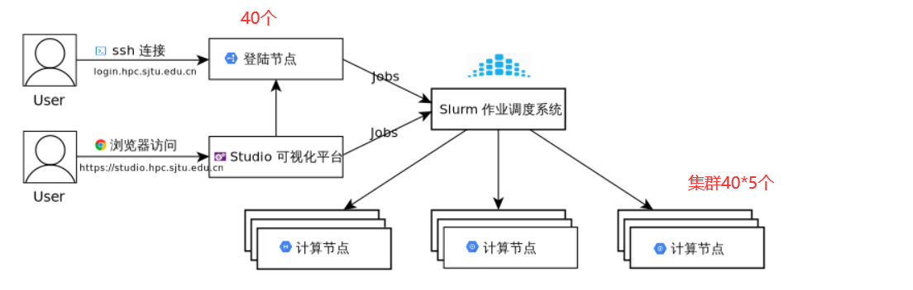
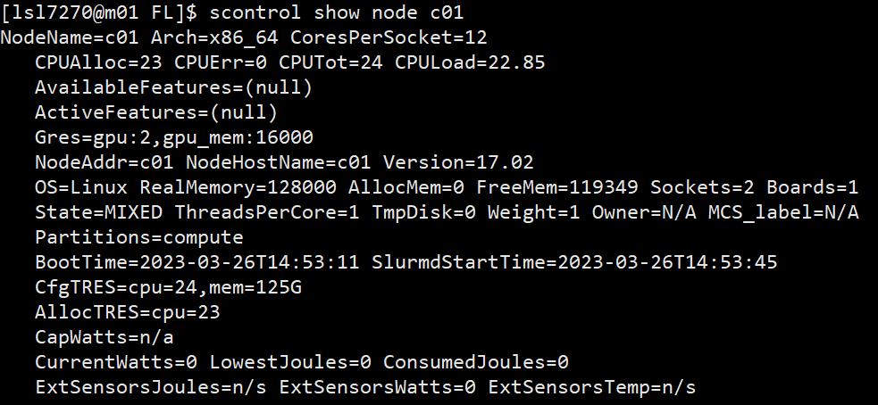

# slurm和sbatch

[SLURM](http://slurm.schedmd.com/) （Simple Linux Utility for Resource Management）是一种可扩展的工作负载管理器，已被全世界的国家超级计算机中心广泛采用。 它是免费且开源的，根据[GPL通用公共许可证](http://www.gnu.org/licenses/gpl.html)发行。

本文档将协助您通过 Slurm 管理作业。 在这里可以找到更多的工作样本。

如果我们可以提供任何帮助，请随时联系 [HPC 邮箱](mailto:hpc%40sjtu.edu.cn)。




## 查看节点

### sinfo查看集群状态

节点状态包括：

 `drain`(节点故障)，`alloc`(节点在用)，`idle`(节点可用)，`down`(节点下线)，`mix`(节点部分占用，但仍有剩余资源）。

| Slurm                    | 功能       |
| :----------------------- | :------- |
| `sinfo -N`               | 查看节点级信息  |
| `sinfo -N --states=idle` | 查看可用节点信息 |
| `sinfo --partition=cpu`  | 查看队列信息   |
| `sinfo --help`           | 查看所有选项   |

### scontrol show node查看节点信息

```bash
# 为了查看您可以使用的所有节点的详细信息：
scontrol show node

# 对于特定节点
scontrol show node "nodename"
```




## 作业管理

- 我们的联邦学习场景下，需要多个客户端通信，所以只能在一个节点下，申请的节点数不应超过1；
- 但是可以通过ntasks-per-node启动多个进程，或者通过cpus-per-task启动多个线程）
- 在我们联邦学习下最好通过cpus-per-task启动多个线程，
  - 多进程的程序要比多线程的程序健壮，但在进程切换时，耗费资源大，效率要差一些。
  - 进程在执行过程中拥有独立的内存单元，而多个线程共享内存，从而极大地提高了程序的运行效率。
  - 特别对于一些要求同时进行并且又要共享某些变量的并发操作，只能用线程，不能用进程。

### --nodes

申请计算节点的数量，在作业脚本里加入

```bash
#SBATCH --nodes=X
```

其中 `X` 是数量，需要的计算节点的个数

> 申请节点数为x=1，如果作业不能跨节点（MPI）运行，申请的节点数应不超过1

### --ntasks-per-node

控制每个计算节点上运行 task 的数量，一般与 `--nodes` 配合使用，例如

> MPI 程序需要 3 个计算节点，每节点 4 个进程，一共 12 个 task，对应 12 个 cpu 核
>
> ```bash
> #SBATCH --nodes=3
> #SBATCH --ntasks-per-node=4
> ```

还可以与 `--cpus-per-task` 选项配合使用，例如

> MPI 程序需要 3 个计算节点，每节点 2 个进程，每个进程使用 OpenMP 运行 8 个线程，一共 48 个 cpu 核
>
> ```bash
> #SBATCH --nodes=3
> #SBATCH --ntasks-per-node=2
> #SBATCH --cpus-per-task=8
> ```

> 每个节点上运行的任务数，如果程序不支持多进程（如openmp），这个数不应该超过1

==（钱老师服务器ntasks-per-node申请到13个及以上时，客户端间通信就不太行了；12个可以，所以可以10个客户端，1个服务器）==

### --cpus-per-task

单个 task 需要的 cpu 核数。一个 task 进程可以多线程，需要使用多个 cpu 核。此选项 Slurm 系统会保证一个 task 进程所在的计算节点上有指定数量的 cpu 核可用。

例如，每个计算节点有 4 个 cpu 核，一个计算作业需要 24 个 cpu 核

- 直接声明 24 个 task，Slurm 系统将分配 6 个计算节点
- 指定 `--cpus-per-task=3`，Slurm 系统将分配 8 个计算节点，确保一个 task 需要的 3 个 cpu 核是在同一个节点上

如果不设置此选项，Slurm 系统默认值是 1，即默认一个 task 分配一个 cpu 核

==（钱老师服务器cpus-per-task申请到13个及以上时，客户端间通信就不太行了；12个可以，所以可以10个客户端，1个服务器）==

## squeue查看作业信息

| Slurm              | 功能                 |
| :----------------- | :------------------- |
| `squeue -j jobid`  | 查看作业信息         |
| `squeue -l`        | 查看细节信息         |
| `squeue -n HOST`   | 查看特定节点作业信息 |
| `squeue`           | 查看USER_LIST的作业  |
| `squeue --state=R` | 查看特定状态的作业   |
| `squeue --help`    | 查看所有的选项       |

作业状态包括`R`(正在运行)，`PD`(正在排队)，`CG`(即将完成)，`CD`(已完成)。

默认情况下，`squeue`只会展示在排队或在运行的作业。

```shell
$ squeue
JOBID PARTITION     NAME     USER ST       TIME  NODES NODELIST(REASON)
18046      dgx2   ZXLing     eenl  R    1:35:53      1 vol04
17796      dgx2   python    eexdl  R 3-00:22:04      1 vol02
```

显示您自己账户下的作业：

```shell
$ squeue | grep lsl7270
JOBID PARTITION     NAME     USER ST       TIME  NODES NODELIST(REASON)
17923      dgx2     bash    hpcwj  R 1-12:59:05      1 vol05
$ squeue | grep lsl7270 -c  # 加个-c可以统计个数
```

 `-l`选项可以显示更细节的信息。

```shell
$ squeue -l
JOBID PARTITION     NAME     USER    STATE       TIME TIME_LIMI  NODES NODELIST(REASON)
17923      dgx2     bash    hpcwj  RUNNING 1-13:00:53 30-00:00:00    1 vol05
```


## scancel取消作业

取消队列中已提交的作业；

介绍几个使用使用案例，分别是，取消指定作业、取消自己上机账号上所有作业、取消自己上机账号上所有状态为PENDING的作业，最后介绍scancel常见的参数。

**取消指定作业；**

```shell
# 取消作业ID为123的作业
scancel 123
```

**取消指定用户的所有作业；**

```shell
scancel -u lsl7270
```

**取消指定用户所有状态为PENDING的作业；**

```shell
scancel -t PENDING -u lsl7270
```

**scancel常见参数;**

```shell
--help                # 显示scancel命令的使用帮助信息；
-A <account>        # 取消指定账户的作业，如果没有指定job_id,将取消所有；
-n <job_name>        # 取消指定作业名的作业；
-p <partition_name> # 取消指定分区的作业；
-q <qos>            # 取消指定qos的作业；
-t <job_state_name> # 取消指定作态的作业，"PENDING", "RUNNING" 或 "SUSPENDED"；
-u <user_name>        # 取消指定用户下的作业；
```


## Lenov LiCO下的slurm/sbatch

1.通过脚本.sh文件中的sbatch filename.sulrm语句将任务提交到计算节点（此时终端命令可用bash或者sbatch一样），bash 脚本名.sh，此时才能在lico的UI界面看到运行过程

```shell
#!/bin/bash
lstm_layernum=1
ann_layernum=1

for lookback in 5 10  
do
	for first_lstm in 32 64  
	do
		for first_ann in 64 128 256
		do
			JOBNAME=${lookback}_${first_lstm}_${first_ann}.slurm
			echo "#!/bin/bash" > $JOBNAME
			echo "#SBATCH --nodes=1" >> $JOBNAME
			echo "#SBATCH --ntasks-per-node=1" >> $JOBNAME
			echo "#SBATCH --cpus-per-task=1" >> $JOBNAME
			# echo "#SBATCH --gres=gpu:1" >> $JOBNAME
			echo "/home/share/lsl7270/anaconda3/bin/python train-FourGruOneAnn.py -lookback $lookback -lstm_layernum $lstm_layernum -ann_layernum $ann_layernum -first_lstm $first_lstm -first_ann $first_ann " >> $JOBNAME
			sbatch $JOBNAME   # 有这一句才能在lico的UI界面看到运行过程
		done
	done
done
```

```shell
#!/bin/bash
lstm_layernum=1
ann_layernum=1

lookback=10  
first_lstm=32  
first_ann=64

JOBNAME=${lookback}_${first_lstm}_${first_ann}.slurm
echo "#!/bin/bash" > $JOBNAME
echo "#SBATCH --nodes=1" >> $JOBNAME
echo "#SBATCH --ntasks-per-node=1" >> $JOBNAME
echo "#SBATCH --cpus-per-task=1" >> $JOBNAME
echo "/home/share/lsl7270/anaconda3/bin/python train-FourGruOneAnn.py -lookback $lookback -lstm_layernum $lstm_layernum -ann_layernum $ann_layernum -first_lstm $first_lstm -first_ann $first_ann " >> $JOBNAME
sbatch $JOBNAME    # 有这一句才能在lico的UI界面看到运行过程
```

 2.通过sbatch .sh/.slurm（里面有#SBATCH内容，但没有sbatch语句），可以将任务提交到计算节点，但是lico的UI界面看不到运行过程

```shell
#!/bin/bash
#SBATCH --nodes=1
#SBATCH --ntasks-per-node=1
#SBATCH --cpus-per-task=1

lstm_layernum=1
ann_layernum=1

lookback=5 
first_lstm=32  
first_ann=64
/home/share/lsl7270/anaconda3/bin/python train-FourGruOneAnn.py -lookback $lookback -lstm_layernum $lstm_layernum -ann_layernum $ann_layernum -first_lstm $first_lstm -first_ann $first_ann 
```


