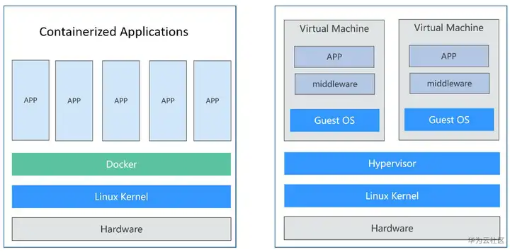
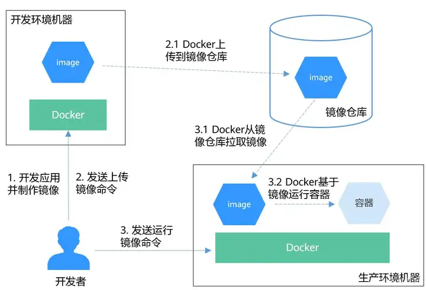

# Docker、容器、虚拟机

知乎文章链接：[容器、Docker、虚拟机，别再傻傻分不清 - 知乎 (zhihu.com)](https://zhuanlan.zhihu.com/p/271846374)

> **摘要**：容器技术起源于Linux，是一种内核虚拟化技术，提供轻量级的虚拟化，以便隔离进程和资源。尽管容器技术已经出现很久，却是随着Docker的出现而变得广为人知。

## 容器vs虚拟机

容器技术起源于Linux，是一种内核虚拟化技术，提供轻量级的虚拟化，以便隔离进程和资源。尽管容器技术已经出现很久，却是随着Docker的出现而变得广为人知。Docker是第一个使容器能在不同机器之间移植的系统。它不仅简化了打包应用的流程，也简化了打包应用的库和依赖，甚至整个操作系统的文件系统能被打包成一个简单的可移植的包，这个包可以被用来在任何其他运行Docker的机器上使用。

容器和虚拟机具有相似的资源隔离和分配方式，**容器虚拟化了操作系统而不是硬件，更加便携和高效**。

图1 容器 vs 虚拟机



相比于使用虚拟机，容器有如下优点：

- **更高效的利用系统资源**

由于容器不需要进行硬件虚拟以及运行完整操作系统等额外开销，容器对系统资源的利用率更高。无论是应用执行速度、内存损耗或者文件存储速度，都要比传统虚拟机技术更高效。因此，相比虚拟机技术，一个相同配置的主机，往往可以运行更多数量的应用。

- **更快速的启动时间**

传统的虚拟机技术启动应用服务往往需要数分钟，而Docker容器应用，由于直接运行于宿主内核，无需启动完整的操作系统，因此可以做到秒级、甚至毫秒级的启动时间，大大节约了开发、测试、部署的时间。

- **一致的运行环境**

开发过程中一个常见的问题是环境一致性问题。由于开发环境、测试环境、生产环境不一致，导致有些问题并未在开发过程中被发现。而Docker的镜像提供了除内核外完整的运行时环境，确保了应用运行环境一致性。

- **更轻松的迁移**

由于Docker确保了执行环境的一致性，使得应用的迁移更加容易。Docker可以在很多平台上运行，无论是物理机、虚拟机，其运行结果是一致的。因此可以很轻易的将在一个平台上运行的应用，迁移到另一个平台上，而不用担心运行环境的变化导致应用无法正常运行的情况。

- **更轻松的维护和扩展**

Docker使用的[分层存储](https://zhida.zhihu.com/search?content_id=148540460&content_type=Article&match_order=1&q=分层存储&zhida_source=entity)以及镜像的技术，使得应用重复部分的复用更为容易，也使得应用的维护更新更加简单，基于[基础镜像](https://zhida.zhihu.com/search?content_id=148540460&content_type=Article&match_order=1&q=基础镜像&zhida_source=entity)进一步扩展镜像也变得非常简单。此外，Docker团队同各个开源项目团队一起维护了大批高质量的官方镜像，既可以直接在生产环境使用，又可以作为基础进一步定制，大大的降低了应用服务的镜像制作成本。

## Docker容器典型使用流程

Docker容器有如下三个主要概念：

- **镜像**：Docker镜像里包含了已打包的应用程序及其所依赖的环境。它包含应用程序可用的文件系统和其他元数据，如镜像运行时的可执行文件路径。
- **镜像仓库**：Docker镜像仓库用于存放Docker镜像，以及促进不同人和不同电脑之间共享这些镜像。当编译镜像时，要么可以在编译它的电脑上运行，要么可以先上传镜像到一个镜像仓库，然后下载到另外一台电脑上并运行它。某些仓库是公开的，允许所有人从中拉取镜像，同时也有一些是私有的，仅部分人和机器可接入。
- **容器**：Docker容器通常是一个Linux容器，它基于Docker镜像被创建。**一个运行中的容器是一个运行在Docker主机上的进程**，但它和主机，以及所有运行在主机上的其他进程都是隔离的。这个进程也是资源受限的，意味着它只能访问和使用分配给它的资源（CPU、内存等）。

典型的使用流程如图2所示：



（1）首先开发者在开发环境机器上开发应用并制作镜像。

Docker执行命令，构建镜像并存储在机器上。

（2）开发者发送上传镜像命令。

Docker收到命令后，将本地镜像上传到镜像仓库。

（3）开发者向生产环境机器发送运行镜像命令。

生产环境机器收到命令后，Docker会从镜像仓库拉取镜像到机器上，然后基于镜像运行容器。

## 使用示例

下面使用Docker将基于Nginx镜像打包一个容器镜像，并基于容器镜像运行应用，然后推送到容器镜像仓库。

### 安装docker

Docker几乎支持在所有操作系统上安装，用户可以根据需要选择要安装的Docker版本。

在Linux操作系统下，可以使用如下命令快速安装Docker。

```text
curl -fsSL get.docker.com -o get-docker.sh
sh get-docker.sh
```

### Docker打包镜像

Docker提供了一种便捷的描述应用打包的方式，叫做Dockerfile，如下所示：

```dockfile
# 使用官方提供的Nginx镜像作为基础镜像
FROM nginx:alpine

# 执行一条命令修改Nginx镜像index.html的内容
RUN echo "hello world" > /usr/share/nginx/html/index.html

# 允许外界访问容器的80端口
EXPOSE 80
```

执行docker build命令打包镜像。

```shell
docker build -t hello .
```

其中-t表示给镜像加一个标签，也就是给镜像取名，这里镜像名为hello。. 表示在当前目录下执行该打包命令。

执行`docker images`命令查看镜像，可以看到hello镜像已经创建成功。您还可以看到一个Nginx镜像，这个镜像是从镜像仓库下载下来的，作为hello镜像的基础镜像使用。

```shell
# docker images
REPOSITORY          TAG                 IMAGE ID            CREATED             SIZE
hello               latest              d120ec16dcea        17 minutes ago      158MB
nginx               alpine              eeb27ee6b893        2 months ago        148MB
```

### 本地运行容器镜像

有了镜像后，您可以在本地执行docker run命令运行容器镜像。

```shell
docker run -p 8080:80 hello
```

docker run命令会启动一个容器，命令中-p是将本地机器的8080端口映射到容器的80端口，即本地机器的8080端口的流量会映射到容器的80端口，当您在本地机器访问 [http://127.0.0.1:8080](https://link.zhihu.com/?target=http%3A//127.0.0.1%3A8080)时，就会访问到容器中，此时浏览器中返回的内容应该就是“hello world”。

### 把镜像推送到镜像仓库

上传镜像前需要给镜像取一个完整的名称，如下所示：

（[http://swr.cn-east-3.myhuaweicloud.com](https://link.zhihu.com/?target=http%3A//swr.cn-east-3.myhuaweicloud.com)是仓库地址，container是组织名，v1则是hello镜像分配的版本号。这是针对华为云的，只是举个示例）

```sehll
docker tag hello swr.cn-east-3.myhuaweicloud.com/container/hello:v1
```

然后执行docker push命令就可以将镜像上传

```shell
docker push swr.cn-east-3.myhuaweicloud.com/container/hello:v1
```

