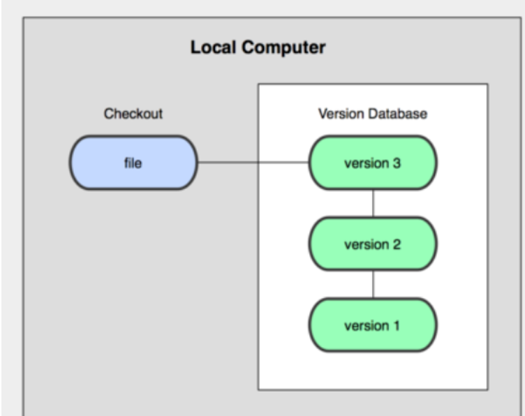
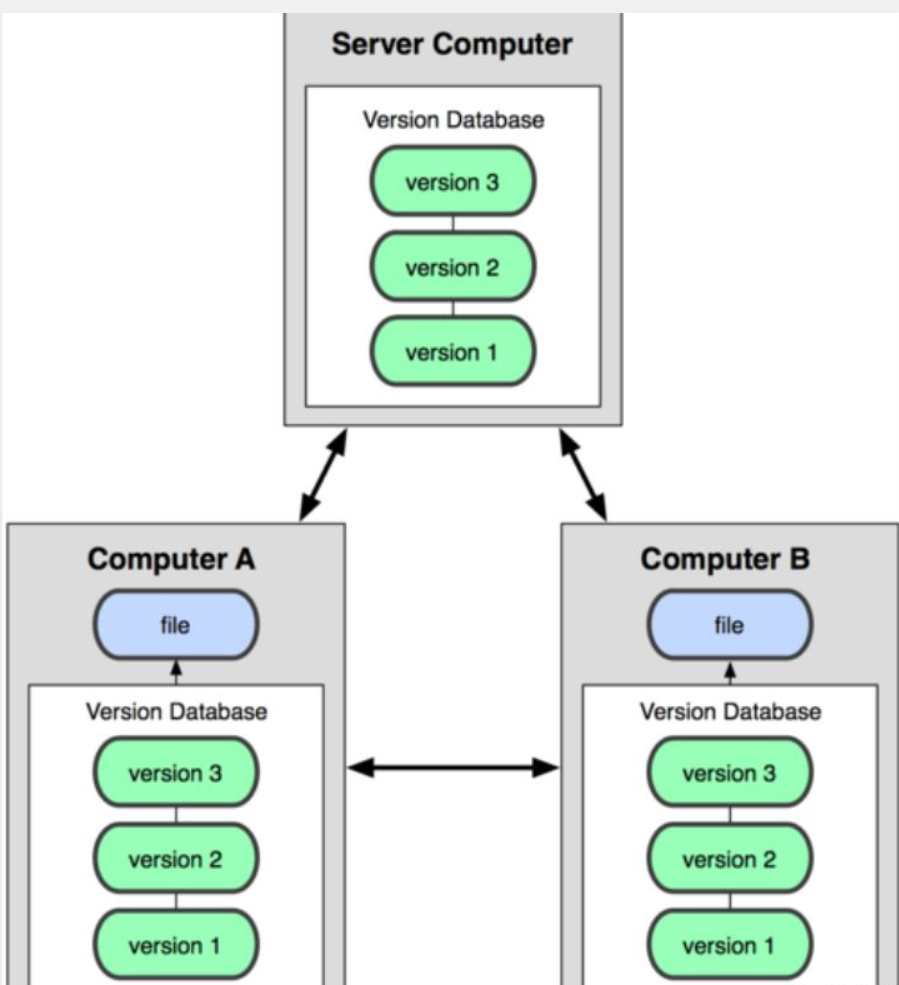
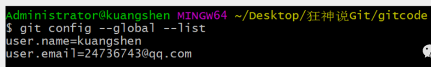
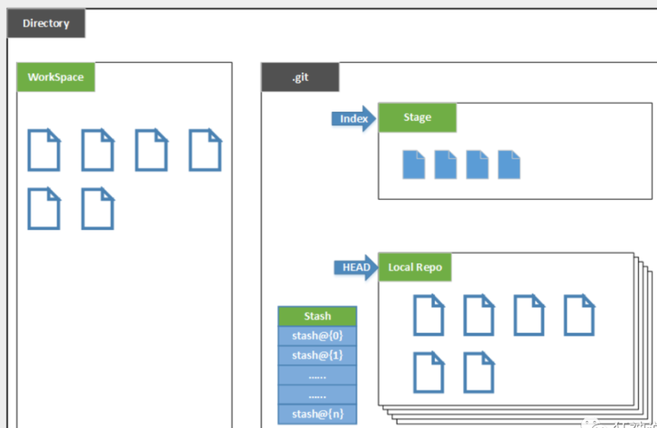
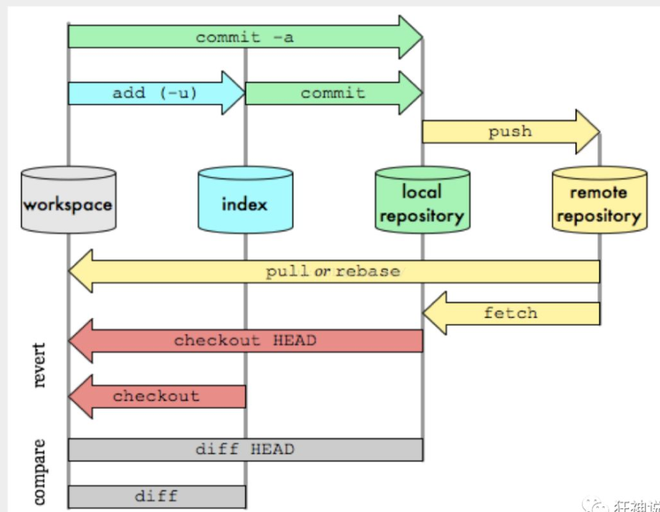
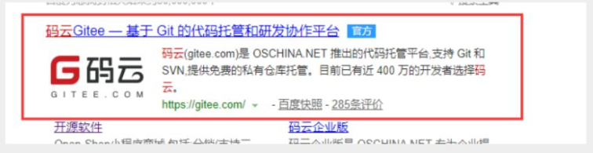
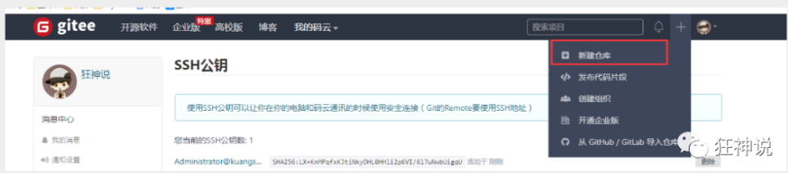
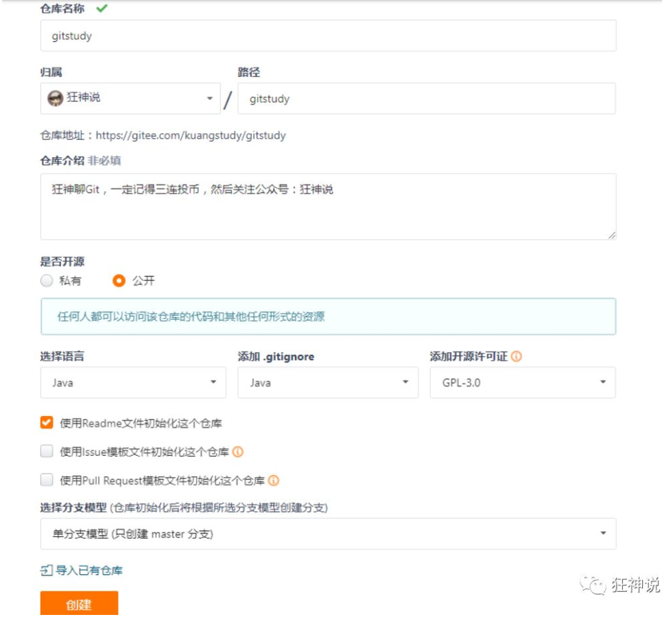
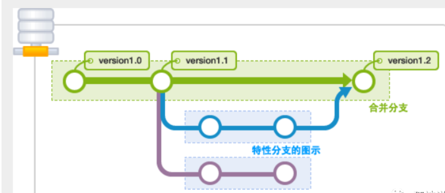
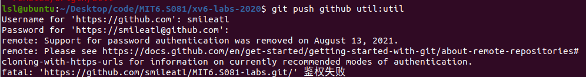

# Git

## 版本控制

### 什么是版本控制

版本控制（Revision control）是一种在开发的过程中用于管理我们对文件、目录或工程等内容的修改历史，方便查看更改历史记录，备份以便恢复以前的版本的软件工程技术。

*   实现跨区域多人协同开发
    
*   追踪和记载一个或者多个文件的历史记录
    
*   组织和保护你的源代码和文档
    
*   统计工作量
    
*   并行开发、提高开发效率
    
*   跟踪记录整个软件的开发过程
    
*   减轻开发人员的负担，节省时间，同时降低人为错误
    

简单说就是用于管理多人协同开发项目的技术。

没有进行版本控制或者版本控制本身缺乏正确的流程管理，在软件开发过程中将会引入很多问题，如软件代码的一致性、软件内容的冗余、软件过程的事物性、软件开发过程中的并发性、软件源代码的安全性，以及软件的整合等问题。

无论是工作还是学习，或者是自己做笔记，都经历过这样一个阶段！我们就迫切需要一个版本控制工具！


多人开发就必须要使用版本控制！

### 常见的版本控制工具

我们学习的东西，一定是当下最流行的！

主流的版本控制器有如下这些：

*   **Git**
    
*   **SVN**（Subversion）
    
*   **CVS**（Concurrent Versions System）
    
*   **VSS**（Micorosoft Visual SourceSafe）
    
*   **TFS**（Team Foundation Server）
    
*   Visual Studio Online
    

版本控制产品非常的多（Perforce、Rational ClearCase、RCS（GNU Revision Control System）、Serena Dimention、SVK、BitKeeper、Monotone、Bazaar、Mercurial、SourceGear Vault），现在影响力最大且使用最广泛的是Git与SVN

### 版本控制分类

**1、本地版本控制**

记录文件每次的更新，可以对每个版本做一个快照，或是记录补丁文件，适合个人用，如RCS。



**2、集中版本控制  SVN**

所有的版本数据都保存在服务器上，协同开发者从服务器上同步更新或上传自己的修改


所有的版本数据都存在服务器上，用户的本地只有自己以前所同步的版本，如果不连网的话，用户就看不到历史版本，也无法切换版本验证问题，或在不同分支工作。而且，所有数据都保存在单一的服务器上，有很大的风险这个服务器会损坏，这样就会丢失所有的数据，当然可以定期备份。代表产品：SVN、CVS、VSS

**3、分布式版本控制 Git**

每个人都拥有全部的代码！安全隐患！

所有版本信息仓库全部同步到本地的每个用户，这样就可以在本地查看所有版本历史，可以离线在本地提交，只需在连网时push到相应的服务器或其他用户那里。由于每个用户那里保存的都是所有的版本数据，只要有一个用户的设备没有问题就可以恢复所有的数据，但这增加了本地存储空间的占用。

不会因为服务器损坏或者网络问题，造成不能工作的情况！



### Git与SVN的主要区别

SVN是集中式版本控制系统，版本库是集中放在中央服务器的，而工作的时候，用的都是自己的电脑，所以首先要从中央服务器得到最新的版本，然后工作，完成工作后，需要把自己做完的活推送到中央服务器。集中式版本控制系统是必须联网才能工作，对网络带宽要求较高。

Git是分布式版本控制系统，没有中央服务器，每个人的电脑就是一个完整的版本库，工作的时候不需要联网了，因为版本都在自己电脑上。协同的方法是这样的：比如说自己在电脑上改了文件A，其他人也在电脑上改了文件A，这时，你们两之间只需把各自的修改推送给对方，就可以互相看到对方的修改了。Git可以直接看到更新了哪些代码和文件！

**Git是目前世界上最先进的分布式版本控制系统。**

  

## 聊聊Git的历史

同生活中的许多伟大事物一样，Git 诞生于一个极富纷争大举创新的年代。

Linux 内核开源项目有着为数众广的参与者。绝大多数的 Linux 内核维护工作都花在了提交补丁和保存归档的繁琐事务上(1991－2002年间)。到 2002 年，整个项目组开始启用一个专有的分布式版本控制系统 BitKeeper 来管理和维护代码。

Linux社区中存在很多的大佬！破解研究 BitKeeper ！

到了 2005 年，开发 BitKeeper 的商业公司同 Linux 内核开源社区的合作关系结束，他们收回了 Linux 内核社区免费使用 BitKeeper 的权力。这就迫使 Linux 开源社区(特别是 Linux 的缔造者 Linus Torvalds)基于使用 BitKeeper 时的经验教训，开发出自己的版本系统。（2周左右！） 也就是后来的 Git！

**Git是目前世界上最先进的分布式版本控制系统。**

Git是免费、开源的，最初Git是为辅助 Linux 内核开发的，来替代 BitKeeper！

  

## Git环境配置

### 软件下载

打开 \[git官网\] https://git-scm.com/，下载git对应操作系统的版本。

所有东西下载慢的话就可以去找镜像！

官网下载太慢，我们可以使用淘宝镜像下载：http://npm.taobao.org/mirrors/git-for-windows/


保证我们有git的环境变量

下载对应的版本即可安装！

安装：无脑下一步即可！安装完毕就可以使用了！

  

### 启动Git

安装成功后在开始菜单中会有Git项，菜单下有3个程序：任意文件夹下右键也可以看到对应的程序！


**Git Bash：**Unix与Linux风格的命令行，使用最多，推荐最多

**Git CMD：**Windows风格的命令行

**Git GUI**：图形界面的Git，不建议初学者使用，尽量先熟悉常用命令

  

### 常用的Linux命令

平时一定要多使用这些基础的命令！

1）、cd : 改变目录。

2）、cd . . 回退到上一个目录，直接cd进入默认目录

3）、pwd : 显示当前所在的目录路径。

4）、ls(ll):  都是列出当前目录中的所有文件，只不过ll(两个ll)列出的内容更为详细。

5）、touch : 新建一个文件 如 touch index.js 就会在当前目录下新建一个index.js文件。

6）、rm:  删除一个文件, rm index.js 就会把index.js文件删除。

7）、mkdir:  新建一个目录,就是新建一个文件夹。

8）、rm -r :  删除一个文件夹, rm -r src 删除src目录

```
rm -rf /  切勿在Linux中尝试！删除电脑中全部文件！
```

9）、mv 移动文件, mv index.html src index.html 是我们要移动的文件, src 是目标文件夹,当然, 这样写,必须保证文件和目标文件夹在同一目录下。

10）、reset 重新初始化终端/清屏。

11）、clear 清屏。

12）、history 查看命令历史。

13）、help 帮助。

14）、exit 退出。

15）、#表示注释

  

### Git配置

所有的配置文件，其实都保存在本地！

查看配置 git config -l (–list)


查看不同级别的配置文件：  

```
#查看系统config
git config --system --list
　　
#查看当前用户（global）配置
git config --global  --list
```

**Git相关的配置文件：**

1）、Git\\etc\\gitconfig  ：Git 安装目录下的 gitconfig     --system 系统级


2）、C:\\Users\\Administrator\\ .gitconfig    只适用于当前登录用户的配置  --global 全局


这里可以直接编辑配置文件，通过命令设置后会响应到这里。

  

### 设置用户名与邮箱（用户标识，必要）

当你安装Git后首先要做的事情是设置你的用户名称和e-mail地址。这是非常重要的，因为每次Git提交都会使用该信息。它被永远的嵌入到了你的提交中：

```bash
git config --global user.name "kuangshen"  #名称
git config --global user.email 24736743@qq.com   #邮箱
```

只需要做一次这个设置，如果你传递了--global 选项，因为Git将总是会使用该信息来处理你在系统中所做的一切操作。如果你希望在一个特定的项目中使用不同的名称或e-mail地址，你可以在该项目中运行该命令而不要--global选项。总之--global为全局配置，不加为某个项目的特定配置。



  

## Git基本理论

（核心所有的时间都需要源于这个理论）

### 三个区域

Git本地有三个工作区域：工作目录（Working Directory）、暂存区(Stage/Index)、资源库(Repository或Git Directory)。如果在加上远程的git仓库(Remote Directory)就可以分为四个工作区域。文件在这四个区域之间的转换关系如下：


*   Workspace：工作区，就是你平时存放项目代码的地方
    
*   Index / Stage：暂存区，用于临时存放你的改动，事实上它只是一个文件，保存即将提交到文件列表信息
    
*   Repository：仓库区（或本地仓库），就是安全存放数据的位置，这里面有你提交到所有版本的数据。其中HEAD指向最新放入仓库的版本
    
*   Remote：远程仓库，托管代码的服务器，可以简单的认为是你项目组中的一台电脑用于远程数据交换
    

本地的三个区域确切的说应该是git仓库中HEAD指向的版本：



*   Directory：使用Git管理的一个目录，也就是一个仓库，包含我们的工作空间和Git的管理空间。
    
*   WorkSpace：需要通过Git进行版本控制的目录和文件，这些目录和文件组成了工作空间。
    
*   .git：存放Git管理信息的目录，初始化仓库的时候自动创建。
    
*   Index/Stage：暂存区，或者叫待提交更新区，在提交进入repo之前，我们可以把所有的更新放在暂存区。
    
*   Local Repo：本地仓库，一个存放在本地的版本库；HEAD会只是当前的开发分支（branch）。
    
*   Stash：隐藏，是一个工作状态保存栈，用于保存/恢复WorkSpace中的临时状态。
    

  

### 工作流程

git的工作流程一般是这样的：

１、在工作目录中添加、修改文件；

２、将需要进行版本管理的文件放入暂存区域；

３、将暂存区域的文件提交到git仓库。

因此，git管理的文件有三种状态：已修改（modified）,已暂存（staged）,已提交(committed)



  

## Git项目搭建

### 创建工作目录与常用指令

工作目录（WorkSpace)一般就是你希望Git帮助你管理的文件夹，可以是你项目的目录，也可以是一个空目录，建议不要有中文。

日常使用只要记住下图6个命令：


### 本地仓库搭建

创建本地仓库的方法有两种：一种是创建全新的仓库，另一种是克隆远程仓库。

1、创建全新的仓库，需要用GIT管理的项目的根目录执行：

```bash
# 在当前目录新建一个Git代码库
$ git init
```

2、执行后可以看到，仅仅在项目目录多出了一个.git目录，关于版本等的所有信息都在这个目录里面。

### 克隆远程仓库

1、另一种方式是克隆远程目录，由于是将远程服务器上的仓库完全镜像一份至本地！

```bash
# 克隆一个项目和它的整个代码历史(版本信息)
$ git clone [url]  # https://gitee.com/kuangstudy/openclass.git

# 指定拉 master 分支代码
git clone -b master http://gitslab.yiqing.com/declare/about.git
```

2、去 gitee 或者 github 上克隆一个测试！

  

## Git文件操作

### 文件的四种状态

版本控制就是对文件的版本控制，要对文件进行修改、提交等操作，首先要知道文件当前在什么状态，不然可能会提交了现在还不想提交的文件，或者要提交的文件没提交上。

*   **Untracked**: 未跟踪, 此文件在文件夹中, 但并没有加入到git库, 不参与版本控制. 通过<mark></mark> 状态变为<mark>Staged</mark>.
*   **Unmodify**: 文件已经入库, 未修改, 即版本库中的文件快照内容与文件夹中完全一致. 这种类型的文件有两种去处, 如果它被修改, 而变为<mark>Modified</mark>.  如果使用<mark>git rm</mark>移出版本库, 则成为<mark>Untracked</mark>文件
*   **Modified**: 文件已修改, 仅仅是修改, 并没有进行其他的操作. 这个文件也有两个去处, 通过<mark>git add</mark>可进入暂存<mark>staged</mark>状态, 使用<mark>git checkout</mark> 则丢弃修改过, 返回到<mark>unmodify</mark>状态, 这个<mark>git checkout</mark>即从库中取出文件, 覆盖当前修改 !

（前三种状态都在workspace工作区）

*   **Staged**: 暂存状态. 执行<mark>git commit</mark>则将修改同步到库中, 这时库中的文件和本地文件又变为一致, 文件为<mark>Unmodify</mark>状态. 执行<mark>git reset HEAD filename</mark>取消暂存, 文件状态为Modified

### 查看文件状态

上面说文件有4种状态，通过如下命令可以查看到文件的状态：

```bash

#查看指定文件状态
git status [filename]

#查看所有文件状态
git status

git add .                  # 添加所有文件到暂存区
# 如果文件未被跟踪,即没有使用git add这个命令时,文件为红色,如果使用这个命令,则文件变为绿色. 

git commit -m "消息内容"    # 提交暂存区中的内容到本地仓库 -m 提交信息
git commit -m "new file hello.txt"
git commit -a -m "message"  # -a 参数表示，可以将所有已跟踪文件中的执行修改或删除操作的文件都提交到本地仓库，即使它们没有经过 git add 添加到暂存区。（或者直接 -am 一样）
```

  

### 忽略文件

有些时候我们不想把某些文件纳入版本控制中，比如数据库文件，临时文件，设计文件等

在主目录下建立".gitignore"文件，此文件有如下规则：

1.  忽略文件中的空行或以井号（#）开始的行将会被忽略。
    
2.  可以使用Linux通配符。例如：星号（\*）代表任意多个字符，问号（？）代表一个字符，方括号（\[abc\]）代表可选字符范围，大括号（{string1,string2,...}）代表可选的字符串等。
    
3.  如果名称的最前面有一个感叹号（!），表示例外规则，将不被忽略。
    
4.  如果名称的最前面是一个路径分隔符（/），表示要忽略的文件在此目录下，而子目录中的文件不忽略。
    
5.  如果名称的最后面是一个路径分隔符（/），表示要忽略的是此目录下该名称的子目录，而非文件（默认文件或目录都忽略）。
    

```bash

#为注释
*.txt        #忽略所有 .txt结尾的文件,这样的话上传就不会被选中！
!lib.txt     #但lib.txt除外
/temp        #仅忽略项目根目录下的temp文件,不包括其它目录temp
build/       #忽略build/目录下的所有文件
doc/*.txt    #会忽略 doc/notes.txt 但不包括 doc/server/arch.txt
```

  

## 使用码云

### github 是有墙的，比较慢，在国内的话，我们一般使用 gitee ，公司中有时候会搭建自己的gitlab服务器

这个其实可以作为大家未来找工作的一个重要信息！

1、注册登录码云，完善个人信息



2、设置本机绑定SSH公钥，实现免密码登录！（免密码登录，这一步挺重要的，码云是远程仓库，我们是平时工作在本地仓库！)

```bash
# 进入 C:\Users\Administrator\.ssh 目录
# 生成公钥
ssh-keygen （-t rsa)
```


3、将公钥信息public key 添加到码云账户中即可！


4、使用码云创建一个自己的仓库！



许可证：开源是否可以随意转载，开源但是不能商业使用，不能转载，...  限制！



克隆到本地！


  

## git提交代码到远程仓库

```bash
# 远程仓库地址别名(可以自定义,一般为origin)  远程仓库地址
git remote add origin https://github.com/smileatl/leetcode101.git
# 可以有多个，github一个，gitee一个
# 查看当前远程地址的别名
git remote -v

git remote rm origin # 远程仓库的名字修改了，可以先删除再重新添加

# git push 远程仓库地址别名 分支名称
git push origin master  # 推送远程分支
git push -u origin master # -u 记住推送地址及分支，下次推送只需要输入git push即可.

```

git push详细解析：

```bash
# git push命令用于从将本地的分支版本上传到远程并合并。
git push <远程主机名> <本地分支名>:<远程分支名>
# 如果本地分支名与远程分支名相同，则可以省略冒号：
git push <远程主机名> <本地分支名>
```

```bash
# 如果本地版本与远程版本有差异，但又要强制推送可以使用 --force 参数：
git push --force origin master

# 删除主机的分支可以使用 --delete 参数，以下命令表示删除 origin 主机的 master 分支：
git push origin --delete master

# HEAD是一个特别的指针，它是一个指向你正在工作的本地分支的指针
git push origin HEAD:master
```

git pull拉去远程仓库中最新的版本：

```bash
# 拉取远程仓库中最新的版本：git pull 远程仓库地址 远程地址分支名称
git pull origin master # 拉取origin仓库的master分支，与本地当前分支合并
```


## 查看版本，回退版本

```bash
git log # 显示所有提交记录
vs： git log --pretty=oneline   # 一行显示版本信息
补充：
git log lfa380b5O2a0Ob82bfc8d84c5ab5el5b8fbf7dac # 会显示所有关于这个id以及之前的修改记录
git log lfa380b5O2a0Ob82bfc8d84c5ab5el5b8fbf7dac -1 # 加上-1参数表示我们只想看到一行记录
而如果想要查看这条提交记录具体修改了什么内容，可以在命令中加入p参数，命令如下:
git log Ifa380b502a00b82bfc8d84c5ab5el5b8fbf7dac -1 -p
 
git reflog   # 查看所有版本信息

git reset  --hard 版本id  # 回退版本
# 在执行git checkout master或者git pull命令前，执行过git add .及commit命令git commit -m "xxx"，git工具才能给你记录你的版本变化（本地的）,否则丢失代码可能无可挽救。
```


说明：GIT分支
--------

分支在GIT中相对较难，分支就是科幻电影里面的平行宇宙，如果两个平行宇宙互不干扰，那对现在的你也没啥影响。不过，在某个时间点，两个平行宇宙合并了，我们就需要处理一些问题了！




git分支中常用指令：

```bash

# 列出所有本地分支
git branch
# 列出所有远程分支
git branch -r
# 显示所有分支，包括本地和远程分支
git branch -a

# 切换分支
git checkout [branch]

# 新建一个分支，但依然停留在当前分支
git branch [branch-name]

# 新建一个分支，并切换到该分支
git checkout -b [branch]

# 合并指定分支到当前分支，比如当前分支是util，branch是util_test，就是将util_test合并到util
$ git merge [branch]
# merge时最好也加消息信息
$ git merge [branch] -m "message"

# 删除分支
$ git branch -d [branch-name]

# 删除远程分支
$ git push origin --delete [branch-name]
$ git branch -dr [remote/branch]

# 重命名分支
# 在当前分支时
git branch -m new_branch_name
# 当不在当前分支时
git branch -m old_branch_name new_branch_name
```

### Git新建远程分支

现在我在master分支上，工作目标是干净的，也没有需要commit的：

`$ git branch`
 \* master
 release

```bash
$ git status
On branch master
Your branch is up-to-date with 'origin/master'.
nothing to commit, working directory clean
```

新建远程分支
新建一个本地分支：

```bash
$ git checkout -b localbranch
```

查看一下现在的分支状态:

```bash
$ git branch
*localbranch
 master
 release
```

星号(*)表示当前所在分支。现在的状态是成功创建的新的分支并且已经切换到新分支上。

把新建的本地分支push到远程服务器，远程分支与本地分支同名（当然可以随意起名）：

```bash
$ git push origin localbranch:localbranch
```

使用`git branch -a`查看所有分支，会看到`remotes/origin/localbranch`这个远程分支，说明新建远程分支成功。

删除远程分支
 我比较喜欢的简单方式，推送一个空分支到远程分支，其实就相当于删除远程分支：

`$ git push origin :localbranch`
 也可以使用：

`$ git push origin --delete localbranch`
 这两种方式都可以删除指定的远程分支


### 问题

多个分支如果并行执行，就会导致我们代码不冲突，也就是同时存在多个版本！


如果同一个文件在合并分支时都被修改了则会引起冲突：解决的办法是我们可以修改冲突文件后重新提交！选择要保留他的代码还是你的代码！

<mark>master主分支应该非常稳定，用来发布新版本，一般情况下不允许在上面工作，工作一般情况下在新建的dev分支上工作，工作完后，比如上要发布，或者说dev分支代码稳定后可以合并到主分支master上来。</mark>


## 常见问题

git中出现“interactive rebase in progress； onto 11dde1e”错误分析与解决方案

```bash
git rebase --continue   //使用该命令继续代码的提交
```


大家在做项目的时候经常会使用git，但同时也会遇到很多问题，比如刚修改后得代码突然后悔了，这时怎么办呢
1、未使用git add 的时候----在工作区

```bash
git checkout -- filepathname //放弃修改某个文件
例如： git checkout -- readme.md
git checkout .  //放弃所有修改的文件

git restore . //放弃所有修改的文件
```

2、已经使用git add 的时候----在暂存区

```bash
git reset HEAD filepathname //恢复某个文件到工作区
例如： git reset HEAD readme.md
git reset HEAD . //恢复所有文件到工作区
git  reset  //恢复所有文件到工作区

注意：这里只是恢复到了工作区，如果想放弃修改的代码还需要执行步骤1（工作区）中的操作
```

3、已经使用git commit提交的了代码----在版本区(本地仓库)

```bash
1、如果你想全部撤回并回到远程仓库最新的状态(不保存代码修改)
	1、git reset --hard HEAD^ //回退上一次commit的状态（本来2-2，现在1-1）
		//或git reset --hard commit_id //回退某个版本+id号就行
	2、git pull //拉取一下远程最新的
2、如果你想拉回工作区并保存修改。只撤销 commit 和 add(保存代码修改)（本来2-2，现在2-1，没有使用git add，文件为红色，表示文件不在暂存区） 
		git reset --mixed HEAD^
		或
		git reset HEAD^
3、如果你想撤销commit 但是不撤销 add(保存代码修改) （本来2-2，现在2-1，但是使用了git add，文件变为绿色，表示文件在暂存区）
		git reset --soft HEAD^ //只撤销了git commit ， 修改后的代码还在暂存区
4 、终极版，由于你太懒，不管是暂存区，版本区，你只想撤销修改并回到远程最新的版本(不保存代码修改)
 	1 、git fetch --all
 	2、git reset --hard origin/master //git reset --hard origin/远程分支名
	注意：这里只在暂存区和版本区
```

4、如果你git push 到了远程分支，这时候你后悔了怎么办

```bash
胆小误试，搞之前记得做备份
第一种
回滚远程分支的最近一次提交
git revert HEAD
git push origin 分支名
例如：我刚在master分支提交了一次
   git revert HEAD
   git push origin master
慎用啊~~~这种方式会在远程生成一个版本号

第二种
git reset --hard HEAD^ //回退上一个版本
或
git reset --hard commit_id //回退到某个版本 id就是你的版本号
git push origin HEAD --force //强制推送到远程，可能会受到保护
```


git中一般按q是退出


git diff

```bash
# 显示自上次提交以来对代码的更改，git diff origin/util将显示相对于初始xv6-labs-2020中util代码的更改
git diff origin/util
```


出现问题：[!remote rejected]:refusing to delete the current branch

```bash
# 删除远程分支
$ git push origin --delete [branch-name]
```

删除指定的分支是远程仓库当前的默认分支，所有无法删除

方法：修改默认分支


出现问题：remote: Support for password authentication was removed on August 13, 2021.
fatal: 'https://github.com/smileatl/MIT6.S081-labs.git/' 鉴权失败
2021.8.13起，github要求使用基于令牌的身份验证



重新去github上生成令牌，假设当前生成的令牌是：xxxxxxxxxxxxxxx

```bash
git remote set-url origin  https://<your_token>@github.com/<USERNAME>/<REPO>.git
git remote set-url github https://xxxxxxxxxxxxxxxx@github.com/smileatl/MITS6.S081-labs.git
```


```bash
# 如果出现远程库与本地库不一致造成的问题
git pull --rebase origin master
# 该命令的意思是把远程库中的更新合并到（pull=fetch+merge）本地库中，–-rebase的作用是取消掉本地库中刚刚的commit，并把他们接到更新后的版本库之中。出现如下图执行pull执行成功后，可以成功执行git push origin master操作。
```


### .gitignore规则不生效

.gitignore只能忽略那些原来没有被track的文件，如果某些文件已经被纳入了版本管理中，则修改.gitignore是无效的。

解决方法就是先把本地缓存删除（改变成未track状态），然后再提交:

```bash
git rm -r --cached .
git add .
git commit -m 'update .gitignore'
```


