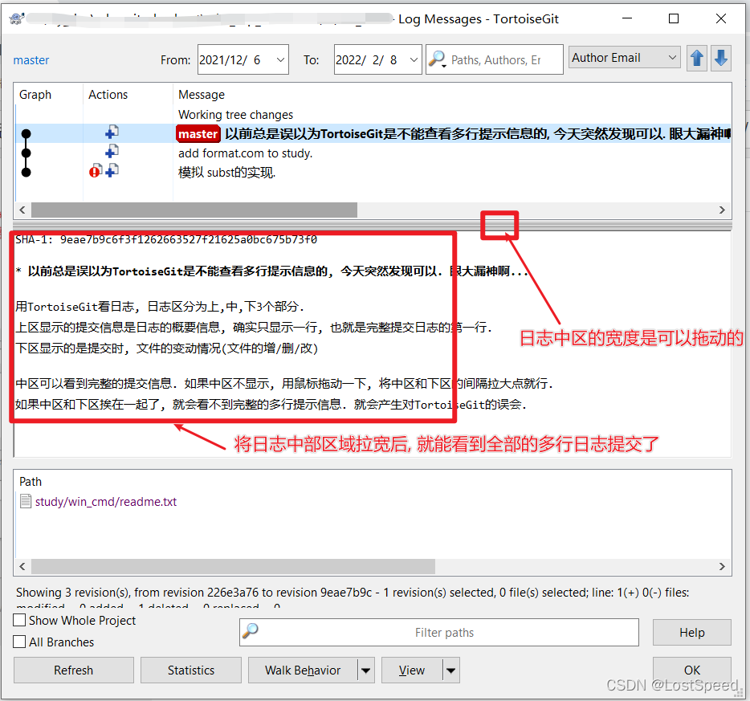

# tortoiseGit

## 对比本地dev和origin/dev的区别

"在 TortoiseGit 中，对比本地 `dev` 分支和远程 `origin/dev` 分支的区别，可以通过以下步骤实现：

1. **确保获取最新的远程分支信息**：
   - 右键点击你的项目文件夹，选择 `TortoiseGit` -> `Fetch`，确保你已经从远程仓库获取了最新的分支信息。
2. **打开 TortoiseGit 日志对话框**：
   - 右键点击你的项目文件夹，选择 `TortoiseGit` -> `Show Log`。
3. **选择本地 `dev` 分支**：
   - 在日志对话框中，找到并点击本地 `dev` 分支。
4. **选择远程 `origin/dev` 分支**：
   - 在日志对话框中，找到并点击远程 `origin/dev` 分支。你可以在分支列表中找到它，通常命名为 `remotes/origin/dev`。
5. **对比两个分支**：
   - 按住 `Ctrl` 键，分别点击本地 `dev` 和远程 `origin/dev` 分支，以便同时选择它们。
   - 右键点击其中一个选中的分支，选择 `Compare revisions` 或 `Compare with each other`，这将打开一个对比窗口，显示这两个分支之间的所有差异。

## 补充

### 1、未启动Pageant报错

使用TortoiseGit进行和远端输出项目时，Pageant必须启动且添加了对应的私钥。否则会报错

[【TortoiseGit】TortoiseGit安装和配置详细说明-CSDN博客](https://blog.csdn.net/weixin_44299027/article/details/121178817)

### 2、tortoiseGit查看多行提交日志

[TortoiseGit可以查看多行提交日志的完整信息_tortoisegit无法显示换行的日志-CSDN博客](https://blog.csdn.net/LostSpeed/article/details/122821093)

### 3、彻底解决tortoiseGit莫名奇妙的红点

大部分情况下都是由于曾经修改了文件/文件夹的大小写导致的

把待改名（出问题）的文件/文件夹先剪切到其他地方内 → 提交代码 → 然后再剪切到原本的目录下 → 提交代码。