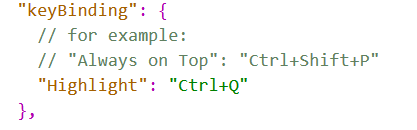

# typora

## 代码块格式化

要给代码块加上编程语言类型，然后再 `shift + tab`

## 修改快捷键

文件-偏好设置-通用-打开高级设置，编辑conf.user.json文件

如果这个快捷键一直不生效，先把这个复制"Highlight": "Ctrl+Shift+P"这一句，然后重启，这个快捷键就会生效。最后在改成"Highlight": "Ctrl+Q"，即你所需要的快捷键，就能够生效了。

