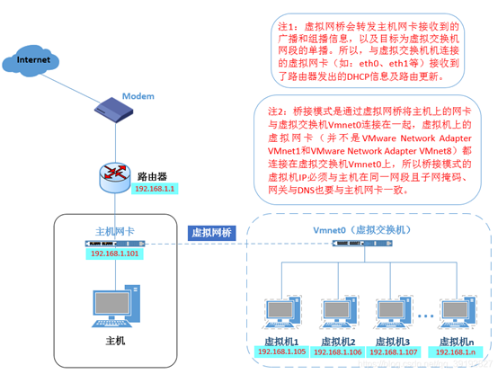
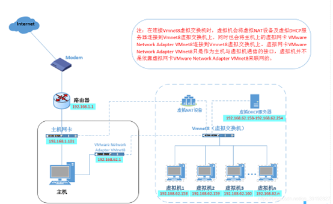
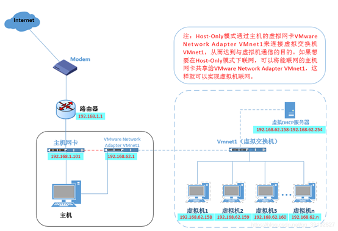

## 三种网络模式

### 桥接、仅主机、NAT

VMnet0：用于桥接模式下的虚拟交换机

VMnet1：用于仅主机模式下的虚拟交换机

VMnet8：用于NAT模式下的虚拟交换机

 

 

1.桥接模式：这种模式下，虚拟机和物理机连的是同一个网络，虚拟机和物理机是并列关系，地位是相当的。比如，你家有路由器，那么你的电脑和你的手机同时连接这个路由器提供的Wi-Fi，那么它们的关系就是这种模式。

 

2.NAT模式：这种模式下，物理机会充当一个“路由器”的角色，虚拟机要想上网，必须经过物理机，那物理机如果不能上网，虚拟机也就不能上网了。之所以说这种模式兼容性最好，是因为物理机的网络环境变化时，虚拟机的网络并不会有影响，比如，上班时你把物理机连接在公司的网络环境中，下班后又把物理机连接在你家的路由器上。你公司的网段有可能和你家的网段是不同的。

 

桥接模式下，虚拟机和物理机一样，都要自动获取IP才可以上网，而做实验的时候，是需要把虚拟机设置为静态IP的，这样就导致虚拟机网络不稳定。而设置为NAT模式，虚拟机的网络并不需要依赖你公司的网络环境或者你家的网络环境。

 

3.仅主机模式：这种模式下，相当于拿一根网线直连了物理机和虚拟机。

#### 一、桥接模式

桥接模式就是将主机网卡与虚拟的网卡利用虚拟网桥进行通信。类似于把物理主机虚拟为一个交换机，所有桥接设置的虚拟机连接到这个交换机的一个接口上，物理主机也同样插在这个交换机当中，所以所有桥接下的网卡与网卡都是交换模式的，相互可以访问而不干扰。在桥接模式下，虚拟机IP地址需要与主机在同一网段，如果需要联网，则网关与DNS需要与主机网卡一致。 

所以，桥接模式下的所有虚拟机都是和主机是在同一网段的，可以把它们看成是"平等"的关系，这就会带来一些麻烦，比如192.168.1段下只有254个主机地址，所以桥接模式下虚拟机和物理的总数不能超过这个数字！

#### 二、NAT模式

在NAT模式中，主机网卡直接与虚拟NAT设备相连，然后虚拟NAT设备与虚拟DHCP服务器一起连接在虚拟交换机VMnet8上，这样就实现了虚拟机联网。VMware Network Adapter VMnet8网卡是为了实现主机与虚拟机之间的通信。

 

可见NAT模式下主机更像是虚拟机们的"路由器"，通过VMnet8虚拟网卡为虚拟机分发地址。所以虚拟机和主机不再同一网段下，可以理解为主机是虚拟机的"上级"，这也就是为什么桥接模式没有VMnet0这个虚拟网卡，因为桥接模式下的虚拟机和主机是"平等"的，共用同一个路由器呀。

 

#### 三、仅主机模式

仅主机模式可有看成是NAT模式去除了虚拟NAT设备，然后使用VMware Network Adapter VMnet1虚拟网卡连接VMnet1虚拟交换机来与虚拟机通信的，Host-Only模式将虚拟机与外网隔开，使得虚拟机成为一个独立的系统，只与主机相互通讯。

## Windows与Ubuntu跨系统复制粘贴

打开终端，手动输入以下命令，再重启ubuntu系统就可以了

即通过安装VMtools实现了Windows与Ubuntu跨系统复制粘贴，也实现了Ubuntu窗口自适应

 

sudo apt-get autoremove open-vm-tools

sudo apt-get install open-vm-tools

sudo apt-get install open-vm-tools-desktop