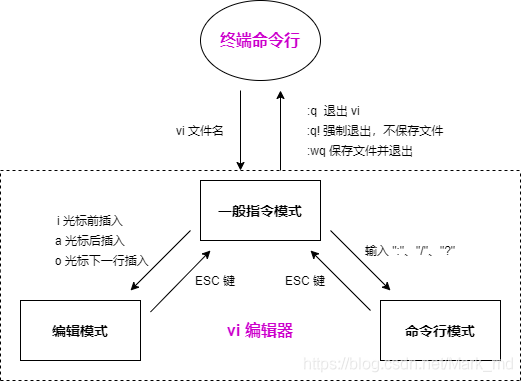

# vim

## 描述

是一个文本编辑程序

没有菜单，只有命令，且命令繁多

## 基本工作模式

### 命令模式 

- 移动光标

  - h: ← 左移
  - l: → 右移
  - j: ↓ 下移
  - k: ↑ 上移
  - gg: 光标移动文件开头
  - G: 光标移动到文件末尾
  - 0: 光标移动到行首
  - $: 光标移动到行尾
  - 123G：跳转到第123行

- 删除

  - x: 删除光标后一个字符,相当于 Del
  - X: 删除光标前一个字符,相当于 Backspace
  - dw: 删除光标开始位置的字,包含光标所在字符
    - 光标必须移动到删除单词的首字符上
  - d0: 删除光标前本行所有内容,不包含光标所在字符
  - D（d$）: 删除光标后本行所有内容,包含光标所在字符
  - dd: 删除光标所在行
  - n dd：删除指定的行数

  **并不是真的删除，实际上是剪切**

- 撤销操作

  - u: 一步一步撤销
  - Ctr-r: 反撤销

- 复制粘贴

  - yy: 复制当前行,n yy 复制 n 行
  - p: 在光标所在位置向下新开辟一行,粘贴
  - P: 从光标所在行, 开始粘贴

- 可视模式

  - v：按字移动

  配合 h、j、k、l 使用y复制选中内容

- 查找操作

  - /hello -> 从光标所在位置向后查找 hello
    - n: 下一个
    - N：上一个
  - ？hello -> 从光标所在位置向前查找 hello
    - n: 上一个
    - N：下一个
  - 在要查询的单词上使用 # 进行查找

- 替换操作

  - r: 替换当前字符

- 文本行移动

  - #>>: 文本行右移

  - <<: 文本行左移

- 查看 Man Page

  - 光标移动到函数上,Shift-k 光标移动到函数上
  - 3Shift-k,查看第三章的 ManPage

### 文本输入模式

- 进入输入模式
  - i: 插入光标前一个字符
  - I: 插入行首
  - a: 插入光标后一个字符
  - A: 插入行未
  - o: 向下新开一行,插入行首
  - O: 向上新开一行,插入行首
  - s: 删除光标所在的字符
  - S：删除当前行

### 末行模式

- 命令
  - 行跳转
    - :123 -> 跳转到第123行
  - 替换
    - 替换一行
      - :s/abc/123 -> 将当前行中的第一个abc替换为123
      - :s/abc/123/g -> 将当前行中的abc全部替换为123
    - 替换全部
      - :%s/abc/123 -> 将所有行中的第一个abc替换为123
      - :%s/abc/123/g -> 将所有行中的abc全部替换为123
    - 替换指定行
      - :10,30s/abc/123/g -> 将10-30行中的abc全部替换为123
  - 执行shell命令
    - 末行模式里输入!,后面跟命令

## 分屏操作

### 末行模式

- 命令：sp 将屏幕分为两部分 --> 水平
- 命令：vsp 将屏幕分为两部分 --> 垂直
- 命令：sp（vsp） + 文件名 水平或垂直拆分窗口显示两个不同的文件

操作：

- 命令：wqall 保存并退出所有屏幕
- 命令：wq 保存并退出光标所在的屏幕
- CTrl+ww 切换两个屏幕

## vim 打造 IDE

系统级配置文件目录：/etc/vim/vimrc

用户级配置文件目录：~/.vim/vimrc

修改配置文件vimrc或者.vimrc

## 三种模式转换图

