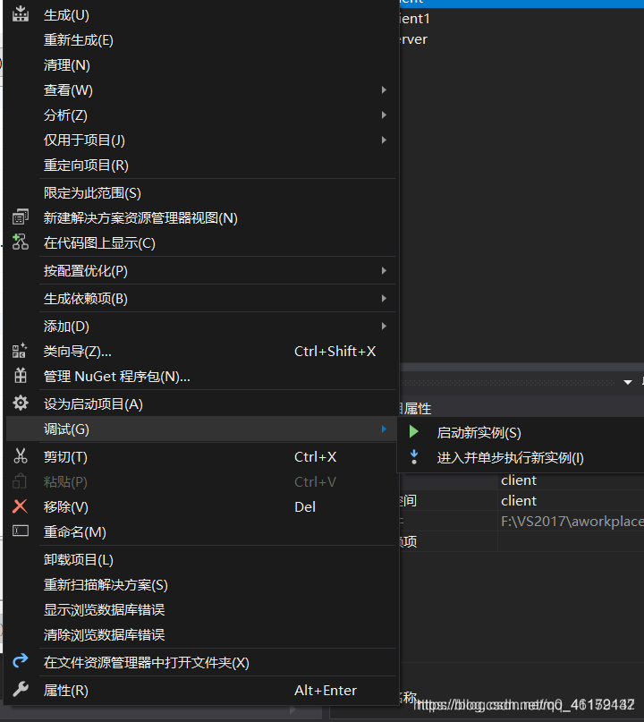

## 1、快捷键

`ctrl+,`可以快速查找文件

`ctrl+L`可以快速剪切一行

`ctrl+shift+u` 快速把文本转换为大写

## 5、部分格式编码乱掉问题如何快速解决

将文件删除，通过文件资源管理器右键新建文件的方式新增.cpp或.h文件

然后在visio studio中通过右键add existing item的方式，把文件加回来

## 10、visio studio中references和dependencies的区别

当在 Visual Studio 中开发项目时，以下四个概念在管理项目依赖关系和构建过程中起着重要的作用：

1. "References"（引用）：它用于管理项目对其他程序集的依赖关系。通过添加引用，你可以在项目中使用其他项目或程序集中的类型和成员。这些引用通常用于编译时解析，以确保在构建项目时可以访问所需的依赖项。（**Solution下的project互相引用，不使用就不需要引用，一般都是Solution下真正存在的project，而不是其他下载下来的编译好后的库**）

2. "Build Dependencies"（构建依赖）：它用于指定项目之间的构建顺序和依赖关系。通过设置项目之间的构建依赖关系，你可以确保在构建解决方案时，依赖的项目会在它们被依赖的项目之前进行构建。这对于确保正确的构建顺序和避免构建错误非常重要。（**Solution下project互相之间的构建依赖，一个project必须晚于其依赖项的构建，一般都是Solution下真正存在的project，而不是其他下载下来编译好后的后库**）

3. "General -> Additional Include Directories"（附加包含目录）：它是一个设置，用于指定编译器在搜索头文件时要查找的附加目录。通过将头文件的路径添加到这个设置中，编译器可以找到并包含所需的头文件。（**指定搜索头文件的目录，是会有下载下来的编译好后的库**）

4. "Linker -> Input"（链接器输入）：它是一个设置，用于指定链接器在链接过程中要使用的库文件。通过将库文件的路径添加到这个设置中，链接器可以找到并链接所需的库文件。（**链接库文件，是会有下载下来的编译好后的库**）

这些概念之间的关系和区别如下：

- "References" 和 "Build Dependencies" 都涉及项目之间的依赖关系，但从不同的角度管理这些依赖关系。"References" 管理项目对其他程序集的依赖关系，而 "Build Dependencies" 管理项目之间的构建顺序和依赖关系。

- "References" 和 "Build Dependencies" 都是在解决方案资源管理器中设置的，以确保在构建解决方案时正确处理依赖关系。

- "General -> Additional Include Directories" 和 "Linker -> Input" 是针对编译和链接过程中的文件路径的设置。"General -> Additional Include Directories" 设置用于指定编译器在搜索头文件时要查找的附加目录，而 "Linker -> Input" 设置用于指定链接器在链接过程中要使用的库文件。

- "General -> Additional Include Directories" 和 "Linker -> Input" 是**与文件路径相关的设置**，而 "References" 和 "Build Dependencies" 是**用于管理项目之间的依赖关系的机制**。

总结：
- "References" 管理项目对其他程序集的依赖关系。
- "Build Dependencies" 管理项目之间的构建顺序和依赖关系。
- "General -> Additional Include Directories" 设置用于指定编译器在搜索头文件时要查找的附加目录。
- "Linker -> Input" 设置用于指定链接器在链接过程中要使用的库文件。

希望这次解答对你有帮助。如果还有其他问题，请随时提问。

## 15、在开发过程中，visio studio 2019的一个solution里中有多个project，如何让其中几个project先不编译

### 方法一：修改解决方案配置

1. **打开解决方案配置管理器**：
   - 在菜单栏中，点击 `Build`（生成）菜单，然后选择 `Configuration Manager`（配置管理器）。

2. **配置项目的生成设置**：
   - 在 `Configuration Manager` 窗口中，你会看到一个包含所有项目的列表。在每个项目的 `Build` 列中，有一个复选框。
   - 取消选中你不想编译的项目的复选框。

3. **保存设置并关闭配置管理器**：
   - 关闭 `Configuration Manager` 窗口。现在，当你生成解决方案时，未选中的项目将不会被编译。

### 方法二：卸载项目

1. **在解决方案资源管理器中卸载项目**：
   - 在 `Solution Explorer`（解决方案资源管理器）中，右键点击你不想编译的项目。
   - 选择 `Unload Project`（卸载项目）。

2. **重新加载项目**：
   - 当你需要再次编译这些项目时，可以右键点击项目并选择 `Reload Project`（重新加载项目）。

### 方法三：修改项目依赖关系

1. **打开项目依赖关系设置**：
   - 在 `Solution Explorer` 中，右键点击解决方案名称，然后选择 `Project Dependencies`（项目依赖关系）。

2. **配置项目依赖关系**：
   - 在 `Project Dependencies` 窗口中，你可以设置哪些项目依赖于其他项目。通过调整依赖关系，可以控制哪些项目在生成时会被编译。

### 方法四：使用条件编译

如果你希望在代码层面控制某些项目的编译，可以使用条件编译指令（例如 `#ifdef`）来控制代码的编译。不过，这种方法通常用于控制代码片段的编译，而不是整个项目的编译。

### 修改解决方案配置

**优点**：

1. **灵活性**：可以根据不同的配置（如 Debug、Release）设置不同的编译选项。
2. **易于切换**：在 `Configuration Manager` 中可以方便地切换不同的配置，而不需要重新加载项目。
3. **细粒度控制**：可以单独控制每个项目是否参与编译，而不影响项目在解决方案中的存在。

**缺点**：

1. **仅影响编译**：项目仍然存在于解决方案中，只是不参与编译。项目的其他属性和依赖关系仍然存在。
2. **需要手动设置**：需要手动打开 `Configuration Manager` 并进行设置。

### 卸载项目

**优点**：

1. **完全移除**：项目被从解决方案中完全卸载，不会影响解决方案的加载和编译时间。
2. **清晰明了**：解决方案资源管理器中不会显示被卸载的项目，使界面更加清晰。

**缺点**：

1. **需要重新加载**：当需要编译或修改卸载的项目时，需要手动重新加载项目。
2. **依赖关系**：如果其他项目依赖于被卸载的项目，可能会导致编译错误或运行时问题。
3. **不适用于频繁切换**：如果需要频繁切换某些项目的编译状态，卸载和重新加载项目会比较繁琐。

### 总结

- **修改解决方案配置**：适用于需要在不同配置之间灵活切换，且希望项目仍然存在于解决方案中的情况。适合频繁切换编译状态的场景。
- **卸载项目**：适用于希望完全移除项目以简化解决方案，减少加载和编译时间的情况。适合不需要频繁切换编译状态的场景。

## 15、visio studio让一个文件暂时不编译

在左边文件目录树中，选中不参加编译的文件，点击鼠标右键-->在弹出的对话中，

选中并点击Setting-->弹出对话框中切入General选项卡-->选中“Exclude file from build”复

选框-->确定，完毕。

## 20、多启动项

[VS设置同时启动多个项目_vs多项目启动-CSDN博客](https://blog.csdn.net/y5492853/article/details/60331567)

1. 右键解决方案-属性-启动项目-多启动项目

2. 或者按照原来，设置一个主启动项目并启动，然后右键另一个项目-选择调试-启动新实例

