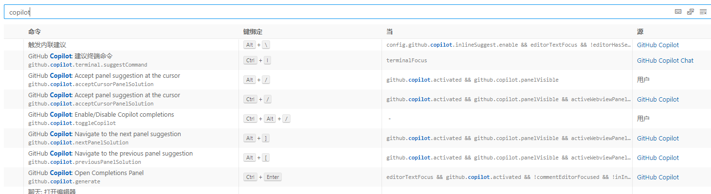
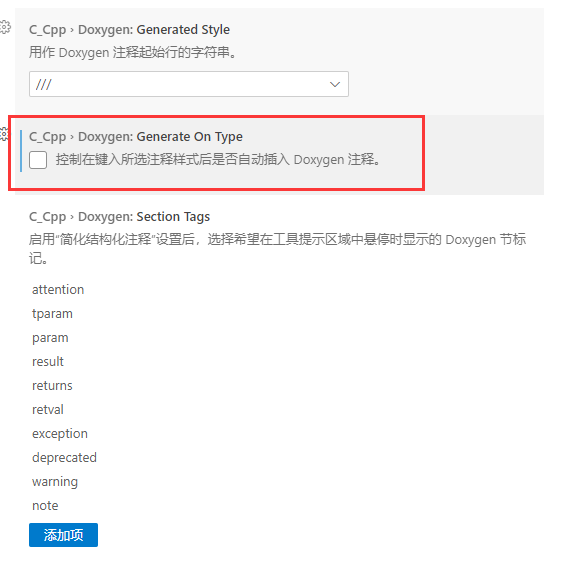

# Vscode

## 5、github copilot快捷键



## 6、显示空格

在设置里搜索Render Whitespace

## 8、格式化

windows下：ctrl+shift+F	格式化代码

linux下：ctrl+shift+i	格式化代码


## 10、github copilot和github copilot chat

GitHub Copilot 和 GitHub Copilot Chat 是两种不同的使用模式，但都是基于 OpenAI 的 Codex 模型。

1. GitHub Copilot：这是一个在你编写代码时提供代码建议的工具。当你在 Visual Studio Code 中编写代码时，GitHub Copilot 会自动在你的代码编辑器旁边显示建议。你可以选择接受这些建议，也可以忽略它们。
2. GitHub Copilot Chat：这是一个更加交互式的使用模式。你可以在 Chat 窗口中输入问题或请求，然后 GitHub Copilot 会生成一个响应。这种模式更像是和一个 AI 进行对话，而不仅仅是接受代码建议。

总的来说，GitHub Copilot 更注重在你编写代码时提供帮助，而 GitHub Copilot Chat 则更像是一个可以回答你问题的 AI 助手。

### github copilot快捷键

触发内联建议：atl+\

接受建议：tab

不接受建议：esc

看下一条建议：alt+]

看上一条建议：alt+[

查看所有建议：ctl+enter

启用/关闭copilot代码补全：ctrl+alt+/

### github copilot chat快捷键

打开建议终端命令：ctrl+i

产生建议（重新产生建议）：enter

接受建议：ctrl+enter

放弃：esc

## 15、vscode中的setting.json、tasks.json、launch.json

在 Visual Studio Code 中，`setting.json`、`tasks.json` 和 `launch.json` 是三个常用的配置文件，用于配置编辑器的设置、任务和调试器。下面是它们的作用和简要说明：

1. `settings.json`：这个文件用于配置 Visual Studio Code 的编辑器设置。你可以在其中指定各种编辑器选项，如字体大小、缩进设置、代码格式化规则等。该文件是针对整个工作区或用户的全局设置，可以通过 `File -> Preferences -> Settings` 打开。

2. `tasks.json`：这个文件用于配置任务（Tasks）。任务是一系列命令或脚本，可以在编辑器中运行，例如编译代码、运行测试等。你可以在 `tasks.json` 中定义自己的任务，并配置任务的命令、参数、工作目录等。该文件是针对当前工作区的设置，可以通过 `Terminal -> Run Task` 执行任务。

3. `launch.json`：这个文件用于配置调试器（Debugger）。你可以在其中定义调试配置，例如运行的程序、调试参数、环境变量等。通过配置 `launch.json`，你可以在 Visual Studio Code 中启动调试会话，并逐步执行代码、设置断点等。该文件也是针对当前工作区的设置，可以通过 `Run -> Start Debugging` 启动调试会话。

这些配置文件的具体内容和格式可以根据你的需求进行自定义。它们通常位于项目的根目录下的 `.vscode` 文件夹中，如果该文件夹不存在，你可以手动创建它。

请注意，这些文件的名称和用途是约定俗成的，你也可以自定义其他名称的配置文件，只要在相应的位置进行配置即可。


## 20、Doxygen

### 行注释

√不打，///行注释时不会自动生成@brief



### 块注释

自动生成块注释：/**，然后回车


### 我的doxygen注释风格

### 1文件注释

```cpp
/**
 * @file log.h
 * @author smileatl (songlei.lin@qq.com)
 * @brief 
 * @version 0.1
 * @date 2023-12-23
 * 
 * @copyright Copyright (c) 2023
 * 
 */
```

### 2、函数注释

```cpp
/**
  * @brief 函数描述
  * @param 参数描述
  * @return 返回描述
  * @retval 返回值描述
  */
```

### 3、类/结构体注释

```cpp
/**
 * @brief 类的详细描述
 */
```

### 4、宏定义注释

也是按照sylar作者的风格来注释的

```cpp
/**
 * @brief 宏定义的详细描述
 */
```

### 5、变量/常量

```cpp
/// 缓存大小
#define BUFSIZ 1024*4
#define BUFSIZ 1024*4 /// 缓存大小

/// n是什么
int n;
```


## 25、leetcode插件

1）[ERROR] session expired, please login again [code=-1] 

重新sign in就行


