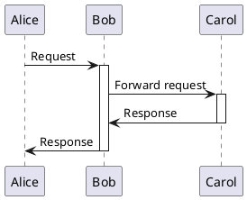

# plantuml

## 1、activate与deactivate

在 PlantUML 中，`activate` 和 `deactivate` 用于表示对象或参与者在时序图（Sequence Diagram）中的激活和停用状态。这些指令帮助你更清晰地展示对象的生命周期及其在交互过程中的活跃时间段。

### 例子：带有多个激活和停用的时序图

在这个例子中：

- `Alice` 向 `Bob` 发送请求。
- `Bob` 被激活以处理请求。
- `Bob` 将请求转发给 `Carol`。
- `Carol` 被激活以处理请求。
- `Carol` 向 `Bob` 发送响应并停用。
- `Bob` 将响应发送给 `Alice` 并停用。

## 2、时序图函数方向

从一个起点指向了一个终点，说明这个函数是起点的，然后通过这个函数跳转到了终点