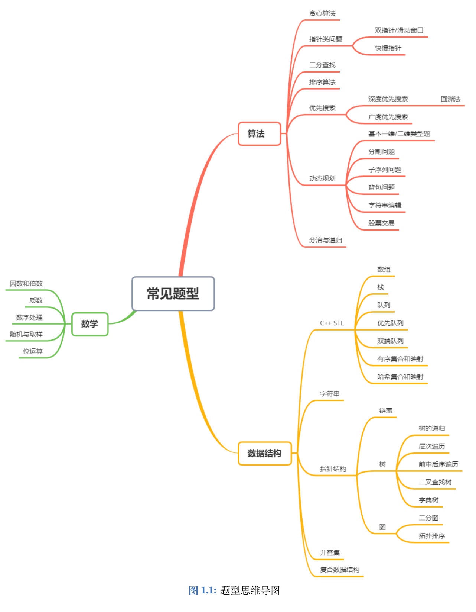
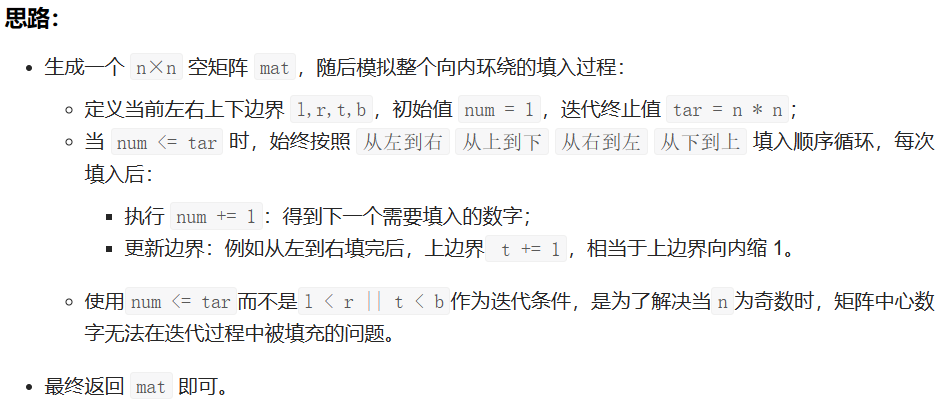
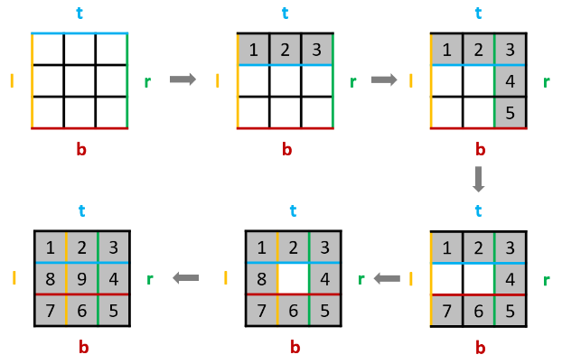

## 数组

### 414 第三大的数

#### 方法一：有序集合

我们可以遍历数组，同时用一个有序集合来维护数组中前三大的数。具体做法是每遍历一个数，就将其插入有序集合，若有序集合的大小超过 3，就删除集合中的最小元素。这样可以保证有序集合的大小至多为 3，且遍历结束后，若有序集合的大小为 3，其最小值就是数组中第三大的数；若有序集合的大小不足 3，那么就返回有序集合中的最大值。

```cpp
#include <iostream>
using namespace std;
#include <string>
#include <vector>
#include <map>
#include <algorithm>
#include <numeric>
#include <functional>
#include <set>

void printVector(vector<int>& v) {
    for (vector<int>::iterator it = v.begin(); it != v.end(); it++) {
        cout << *it << " ";
    }
    cout << endl;
}

class Solution {
public:
    int thirdMax(vector<int>& nums) {
        set<int> s;
        for (int num : nums) {
            s.insert(num);
            //大于3时，就把左边第一个数擦除
            if (s.size() > 3) {
                s.erase(s.begin());
            }
        }
        return s.size() == 3 ? *s.begin() : *s.rbegin();
    }
};

int main()
{
    vector<int> ivec;
    int num;
    do
    {
        cin >> num;
        ivec.push_back(num);
    } while (getchar() != '\n');

    //printVector(ivec);

    Solution s;
    cout << s.thirdMax(ivec)<<endl;

    system("pause");
    return 0;
}
```


### 581 最短无序连续子数组

#### 方法一：找无序列表下标的最大、最小值

从左向右，保存该过程的最大值，与当前值的max进行对比，如果小于说明已经到达了无序列表中了，就记录当前值，一直到有序列表为止，此时后半部分的有序列表中的第一个值，也要比前面的大或等于前面的最大值，记录下的位置就不会改动了

```cpp
#include <iostream>
using namespace std;
#include <string>
#include <vector>
#include <map>
#include <algorithm>
#include <numeric>
#include <functional>
#include <set>

void printVector(vector<int>& v) {
    for (vector<int>::iterator it = v.begin(); it != v.end(); it++) {
        cout << *it << " ";
    }
    cout << endl;
}

class Solution {
public:
    int findUnsortedSubarray(vector<int>& nums) {
        if (nums.size() <= 1) return 0;
        int len = nums.size(), low = 0, high = len - 1, maxNum = nums[0], minNum = nums[len - 1];
        for (int i = 1; i < len; i++) {
            maxNum = max(maxNum, nums[i]);
            minNum = min(minNum, nums[len - 1 - i]);
            //如果小于当前的最大值，说明到达了无序列表，记录当前值，一直到有序列表位置
            //后半部分的有序列表的第一个值，也要比前面大或等于前面的最大值
            if (nums[i] < maxNum) low = i;
            if (nums[len - 1 - i] > minNum) high = len - 1 - i;
        }
        return low > high ? low - high + 1 : 0;
    }
};

int main()
{
    vector<int> ivec;
    int num;
    do
    {
        cin >> num;
        ivec.push_back(num);
    } while (getchar() != '\n');

    printVector(ivec);

    Solution s;
    s.findUnsortedSubarray(ivec);
    cout << s.findUnsortedSubarray(ivec) << endl;;

    system("pause");
    return 0;
}
```

#### 第2次

```cpp
class Solution {
public:
    int findUnsortedSubarray(vector<int>& nums) {
        int n = nums.size();
        int maxn = INT_MIN, right = -1;
        int minn = INT_MAX, left = -1;
        for (int i = 0; i < n; i++) {
            if (maxn > nums[i]) {
                right = i;
            } else {
                maxn = nums[i];
            }
            if (minn < nums[n - i - 1]) {
                left = n - i - 1;
            } else {
                minn = nums[n - i - 1];
            }
        }
        return right == -1 ? 0 : right - left + 1;
    }
};

```


### 605 种花问题

#### 方法一：连续三个0

```cpp
class Solution {
public:
    bool canPlaceFlowers(vector<int>& flowerbed, int n) {
        int flag = 0;
        //左右两端各增加一个0，不用考虑边界条件，任意位置处只要连续出现三个0就可以栽上一颗花
        flowerbed.insert(flowerbed.begin(), 0);
        flowerbed.push_back(0);
        for (int i = 0; i < flowerbed.size(); ++i) {
            if (flowerbed[i] == 0) {
                if (i + 1 < flowerbed.size() && i + 2 < flowerbed.size()) {
                    if (flowerbed[i + 1] == 0 && flowerbed[i + 2] == 0) {
                        //i多加1，移动两个位置
                        i = i + 1;  //因为每连续三个0，中间的那个0才是用来种花的，
                        //比如连续5个0的情况
                        flag += 1;
                    }
                }
            }
        }
        return flag >= n;
    }
};
```

### 628 三个数的最大乘积

#### 方法一：排序

首先将数组排序。

如果数组中全是非负数，则排序后最大的三个数相乘即为最大乘积；如果全是非正数，则最大的三个数相乘同样也为最大乘积。

如果数组中有正数有负数，则最大乘积既可能是三个最大正数的乘积，也可能是两个最小负数（即绝对值最大）与最大正数的乘积。

综上，我们在给数组排序后，分别求出三个最大正数的乘积，以及两个最小负数与最大正数的乘积，二者之间的最大值即为所求答案。

```cpp
class Solution {
public:
    int maximumProduct(vector<int>& nums) {
        int product;
        int len = nums.size();
        sort(nums.begin(), nums.end());
        //如果数组中有正数有负数，则最大乘积既可能是三个最大正数的乘积，
        //也可能是两个最小负数（即绝对值最大）与最大正数的乘积。
        product = max(nums[0] * nums[1] * nums[len - 1], nums[len - 1] * nums[len - 2] * nums[len - 3]);
        return product;
    }
};
```


### 643 子数组的最大平均数

#### 方法一：滑动窗口

不这么做会超时

//滑动窗口的方式，减去当前子数组的第一个数，加上子数组的后一个数
  sum = sum - nums[i - k] + nums[i];

```cpp
class Solution {
public:
    double findMaxAverage(vector<int>& nums, int k) {
        int len = nums.size();
        //先计算一次sum
        double sum = accumulate(nums.begin(), nums.begin() + k, 0);
        double maxAverage = sum / k;
        for (int i = k; i < len; ++i) {
            //然后滑动窗口的方式，减去当前子数组的第一个数，加上子数组的后一个数
            //不这么做会超时
            sum = sum - nums[i - k] + nums[i];
            double currentAverage = sum / k;
            maxAverage = max(currentAverage, maxAverage);
        }
        return maxAverage;
    }
};
```


### 448 找到所有数组中消失的数字

#### 方法1：

把出现的数字在原数组出现的位置设为负数，最后仍然为正数的位置 即为没有出现过的数

```cpp
class Solution {
public:
    vector<int> findDisappearedNumbers(vector<int>& nums) {
        vector<int> ans;
        for (auto num : nums) {
            int pos = abs(num) - 1;
            if (nums[pos] > 0) {
                nums[pos] = -nums[pos];
            }
        }
        for (int i = 0; i < nums.size(); ++i) {
            if (nums[i] > 0) {
                ans.push_back(i + 1);
            }
        }
        return ans;
    }
};
```


### 59 螺旋矩阵 II

#### 方法1：模拟法，设定边界





```cpp
class Solution {
public:
    vector<vector<int>> generateMatrix(int n) {
        vector<vector<int>> mat(n, vector<int>(n, 0));
        int l = 0, r = n - 1, t = 0, b = n - 1;
        int num = 1, tar = n * n;
        while (num <= tar) {
            for (int i = l; i <= r; i++) mat[t][i] = num++; // left to right.
            ++t;
            for (int i = t; i <= b; i++) mat[i][r] = num++; // top to bottom.
            --r;
            for (int i = r; i >= l; i--) mat[b][i] = num++; // right to left.
            b--;
            for (int i = b; i >= t; i--) mat[i][l] = num++; // bottom to top.
            l++;
        }
        return mat;
    }
};
```


### 283 移动零

#### 方法1：一次遍历

参考快速排序的思想，用0作为中间点，把不等于0的放到中间点的左边，相当于把0放到右边

中间点就是 0 本身，所以实现起来比快速排序简单很多，我们使用两个指针 i 和 j，只要 nums[i]!=0，我们就交换 nums[i] 和 nums[j]

```cpp
class Solution {
public:
    void moveZeroes(vector<int>& nums) {
        if (nums.size() == 0) return;
        int j = 0;
        for (int i = 0; i < nums.size(); i++) {
            // 不为0就交换
            if (nums[i] != 0) {
                int tmp = nums[i];
                nums[i] = nums[j];
                nums[j] = tmp;
                j++;
            }
        }
    }
};
```


