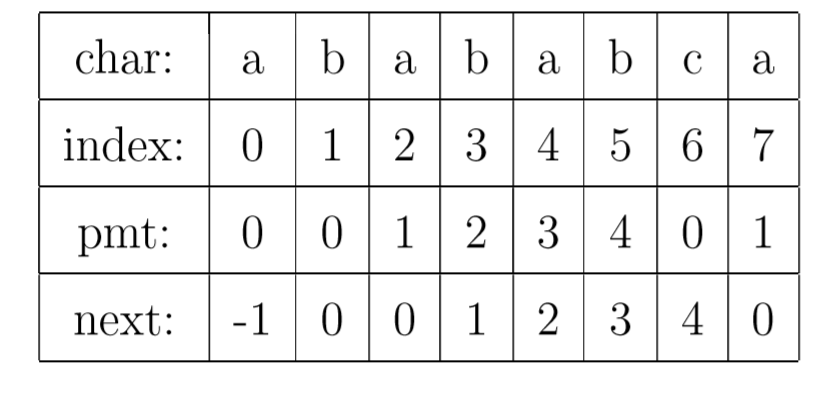
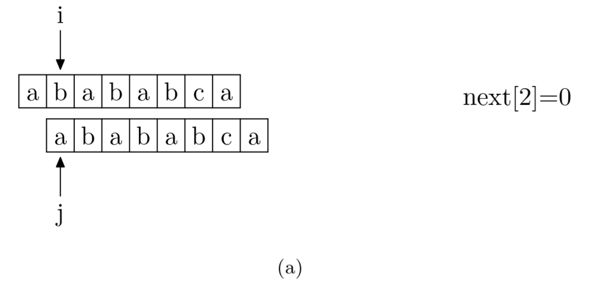
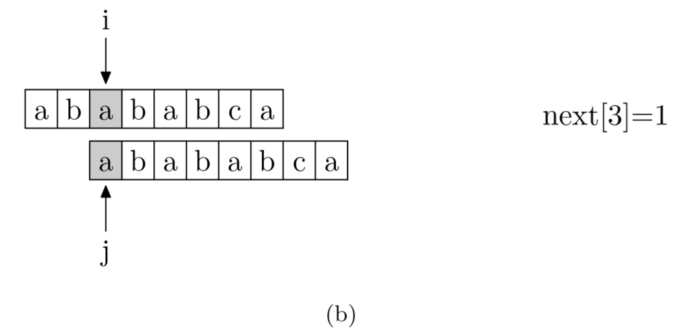
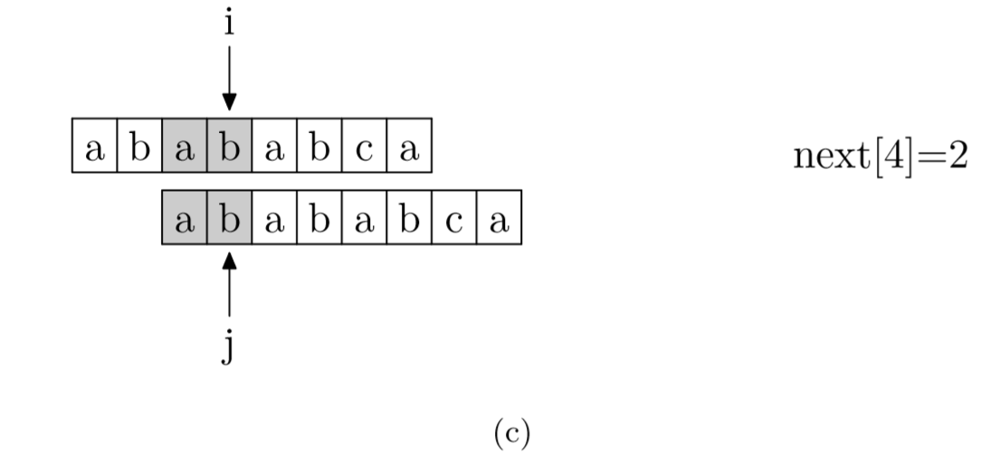
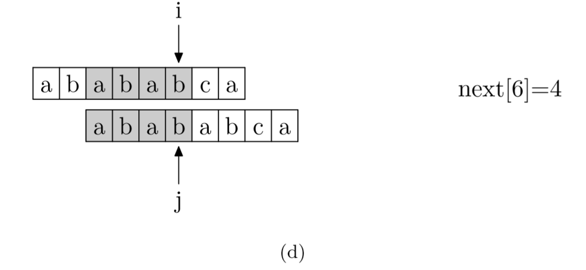
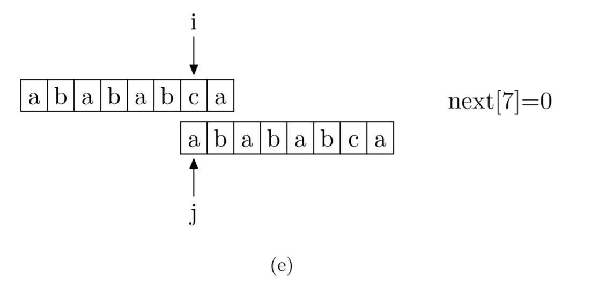
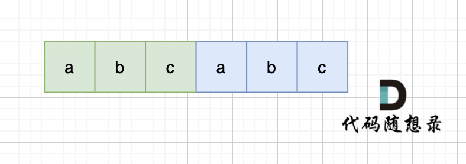
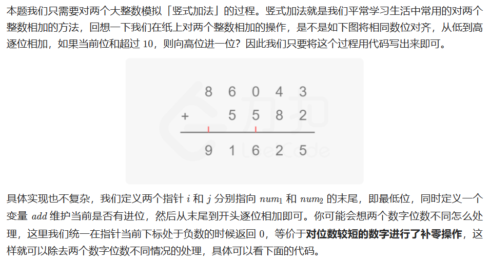

## 字符串

### 13 罗马数字转整数

#### 方法一：模拟

通常情况下，罗马数字中小的数字在大的数字的右边。若输入的字符串满足该情况，那么可以将每个字符视作一个单独的值，累加每个字符对应的数值即可。

```cpp 
#include <iostream>
using namespace std;
#include <string>
#include <vector>
#include <map>
#include <algorithm>
#include <numeric>
#include <functional>
#include <set>
#include <unordered_map>

class Solution {
public:
    int romanToInt(string s) {
        int ans = 0;
        int n = s.length();
        for (int i = 0; i < n; i++) {
            int value = symbolValues[s[i]];
            if (value < symbolValues[s[i + 1]]) {
                ans -= value;
            }
            else {
                ans += value;
            }
        }

        return ans
    }

    unordered_map<char, int> symbolValues = {
        {'I', 1},
        {'V', 5},
        {'X', 10},
        {'L', 50},
        {'C', 100},
        {'D', 500},
        {'M', 1000},
    };

};

int main()
{
    string s;
    cin >> s;
    cout << s << endl;

    Solution ss;
    cout << ss.romanToInt(s) << endl;

    system("pause");
    return 0;
}
```

### 12 整数转罗马数字

#### 方法1：

```cpp
class Solution {
public:
    string intToRoman(int num) {
        int values[] = {1000, 900, 500, 400, 100, 90, 50, 40, 10, 9, 5, 4, 1};
        string reps[] = {"M", "CM", "D", "CD", "C", "XC", "L", "XL", "X", "IX", "V", "IV", "I"};

        string res;
        for (int i = 0; i < 13; i ++ )  //这里不使用图里的count了，一遍一遍来就行了
            while(num >= values[i])
            {
                num -= values[i];
                res += reps[i];
            }
        return res;
    }
};
```


### 344 反转字符串

```cpp
class Solution {
public:
	void reverseString(vector<char>& s) {
		int l, r;
		for (int i = 0, j = s.size() - 1; i < s.size() / 2; i++, j--) {
			int tmp = s[j];
			s[j] = s[i];
			s[i] = tmp;
		}
	}
};
```


### 541 反转字符串II

#### 方法1：reverse

让 i += (2 * k)，i 每次移动 2 * k 就可以了，然后判断是否需要有反转的区间。要找的也就是每2 * k 区间的起点，这样写，程序会高效很多。

```cpp
class Solution {
public:
	string reverseStr(string s, int k) {
		for (int i = 0; i < s.size(); i += 2*k) {
			// 1. 每隔 2k 个字符的前 k 个字符进行反转
            // 2. 剩余字符小于 2k 但大于或等于 k 个，则反转前 k 个字符
			if (i + k <= s.size()) {
				reverse(s.begin() + i, s.begin() + i + k);
			}
			else {
                // 3. 剩余字符少于 k 个，则将剩余字符全部反转。
				reverse(s.begin() + i, s.end());
			}
		}
		return s;
	}
};
```

### 剑指offer 5 替换空格

**其实很多数组填充类的问题，都可以先预先给数组扩容带填充后的大小，然后在从后向前进行操作。**

这么做有两个好处：

1. 不用申请新数组。
2. 从后向前填充元素，避免了从前向后填充元素时，每次添加元素都要将添加元素之后的所有元素向后移动的问题。

```cpp
class Solution {
public:
	string replaceSpace(string s) {
		int count = 0;
		int sOldSize = s.size();
		for (int i = 0; i < s.size(); i++) {
			if (s[i] == ' ') {
				count++;
			}
		}
		// 扩充数组到每个空格替换成"%20"之后的大小
		s.resize(s.size() + 2 * count);
		int sNewSize = s.size();
        // 从后向前替换空格，也就是双指针法，过程如下：i指向新长度的末尾，j指向旧长度的末尾。
		for (int i = sNewSize - 1, j = sOldSize - 1; j < i; i--, j--) {
			if (s[j] != ' ') {
				s[i] = s[j];
			}
			else {
				s[i] = '0';
				s[i - 1] = '2';
				s[i - 2] = '%';
				i -= 2;
			}
		}
		return s;
	}
};
```

### 151 反转字符串中的单词

#### 方法1：

- 移除多余空格
- 将整个字符串反转
- 将每个单词反转

```cpp
class Solution {
public:
    void reverse(string& s, int start, int end){ //翻转，区间写法：左闭右闭 []
        for (int i = start, j = end; i < j; i++, j--) {
            swap(s[i], s[j]);
        }
    }

    void removeExtraSpaces(string& s) {//去除所有空格并在相邻单词之间添加空格, 快慢指针。
        int slow = 0;   //整体思想参考https://programmercarl.com/0027.移除元素.html
        for (int i = 0; i < s.size(); ++i) { //
            if (s[i] != ' ') { //遇到非空格就处理，即删除所有空格。
                if (slow != 0) s[slow++] = ' '; //手动控制空格，给单词之间添加空格。slow != 0说明不是第一个单词，需要在单词前添加空格。
                while (i < s.size() && s[i] != ' ') { //补上该单词，遇到空格说明单词结束。
                    s[slow++] = s[i++];
                }
            }
        }
        s.resize(slow); //slow的大小即为去除多余空格后的大小。
    }

    string reverseWords(string s) {
        removeExtraSpaces(s); //去除多余空格，保证单词之间之只有一个空格，且字符串首尾没空格。
        reverse(s, 0, s.size() - 1);
        int start = 0; //removeExtraSpaces后保证第一个单词的开始下标一定是0。
        for (int i = 0; i <= s.size(); ++i) {
            if (i == s.size() || s[i] == ' ') { //到达空格或者串尾，说明一个单词结束。进行翻转。
                reverse(s, start, i - 1); //翻转，注意是左闭右闭 []的翻转。
                start = i + 1; //更新下一个单词的开始下标start
            }
        }
        return s;
    }
};
```


### 28 找出字符串中第一个匹配项的下标

#### 方法1：KMP

[(1 封私信 / 18 条消息) 如何更好地理解和掌握 KMP 算法? - 知乎 (zhihu.com)](https://www.zhihu.com/question/21923021/answer/281346746)

**KMP**

我们看到如果是在 j 位 失配，那么影响 j 指针回溯的位置的其实是第 j −1 位的 PMT 值，所以为了编程的方便， 我们不直接使用[PMT数组](https://www.zhihu.com/search?q=PMT数组&search_source=Entity&hybrid_search_source=Entity&hybrid_search_extra={"sourceType"%3A"answer"%2C"sourceId"%3A281346746})，而是将PMT数组向后偏移一位。我们把新得到的这个数组称为[next数组](https://www.zhihu.com/search?q=next数组&search_source=Entity&hybrid_search_source=Entity&hybrid_search_extra={"sourceType"%3A"answer"%2C"sourceId"%3A281346746})。下面给出根据next数组进行字符串匹配加速的字符串匹配程序。其中要注意的一个技巧是，在把PMT进行向右偏移时，第0位的值，我们将其设成了-1，这只是为了编程的方便，并没有其他的意义。在本节的例子中，next数组如下表所示。



**获取next数组**

其实，求next数组的过程完全可以看成字符串匹配的过程，即以模式字符串为主字符串，以模式字符串的前缀为目标字符串，一旦字符串匹配成功，那么当前的next值就是匹配成功的字符串的长度。

具体来说，就是从模式字符串的第一位(注意，不包括第0位)开始对自身进行匹配运算。 在任一位置，能匹配的最长长度就是当前位置的next值。如下图所示。











```cpp
class Solution {
public:
	void getNext(int* next, string s) {
		next[0] = -1;
		int i = 0, j = -1;
		while (i < s.size() - 1) {
			if (j == -1 || s[i] == s[j]) {
				j++;
				i++;
				next[i] = j;
				// cout << next[i] << endl;
			}
			else {
				j = next[j];
			}
		}
	}

	int strStr(string haystack, string needle) {
		int i = 0;
		int j = 0;
		//int next[8] = { -1,0,0,1,2,3,4,0 };
		int next[needle.size()];
		getNext(next, needle);
		/*
		while((i<haystack.size())&&(j<needle.size()))//会报错
		因为计算给定字符串的（unsigned int型）长度，就是这一点！！！
		它的返回值是一个 unsigned int 类型。
		如果是 while ((i < haystack.size()) && (j < needle.size()))
		即j< needle.size()在执行时，
		由于两边的类型不一样所以要转换， 无符号比有符度号的内有效值范围大，
		所以将j转换成无符号的数字再比较， 这一转就出问题了，
		有符号的-1转换成无符号成了0xffffffff，这是无符号的最大值，
		所以i< needle.size()始终为false，所以我写的函数只要当j<0，必定跳出循环。
		在此建议使用 needle.size()函数的值作为条件循环时，应先赋值给int类型，或者使用c++中的string。
		*/
		int length_1 = haystack.size();
		int length_2 = needle.size();
		while (i < length_1 && j < length_2) {
			if (j == -1 || haystack[i] == needle[j]) {
				i++;
				j++;
			}
			else {
				j = next[j];
			}
		}
		if (j == needle.size())
			return i - j;
		return -1;
	}
};
```

### 459 重复的子字符串

#### 方法1：移动匹配

当一个字符串s：abcabc，内部由重复的子串组成，那么这个字符串的结构一定是这样的：由前后相同的子串组成。



那么既然前面有相同的子串，后面有相同的子串，用 s + s，这样组成的字符串中，后面的子串做前串，前后的子串做后串，就一定还能组成一个s，所以判断字符串s是否由重复子串组成，只要两个s拼接在一起，里面还出现一个s的话，就说明是由重复子串组成。如图：


暴力解法O(m*n)，库函数实现O(m+n)

```cpp
class Solution {
public:
	bool repeatedSubstringPattern(string s) {
		string t = s + s;
		t.erase(t.begin());
		t.erase(t.end() - 1); // 掐头去尾
		if (t.find(s) == -1) {
			return false;
		}
		else {
			return true;
		}
	}
};
```


### 165 比较版本号

#### 方法1：双指针

```cpp
class Solution {
public:
    int compareVersion(string version1, string version2) {
        int m=version1.size();
        int n=version2.size();
        int i=0;
        int j=0;
        while(i<m || j<n){
            long x=0;
            long y=0;
            for(;i<m && version1[i]!='.';i++){
                x=x*10+version1[i]-'0';
            }
            ++i; // 跳过点号
            for(;j<n && version2[j]!='.';j++){
                y=y*10+version2[j]-'0';
            }
            ++j; // 跳过点号
            if(x!=y){
                return x>y?1:-1;
            }
        }
        return 0;
    }
};
```


### 8. 字符串转换整数 (atoi)

解决思路：

1. 首先，去除字符串开头的空格。
2. 确定正负号，如果下一个字符是正号或负号，则根据符号确定最终结果的正负性，并将指针向后移动一位。
3. 逐个读取数字字符，将其转换为整数并累加到结果中，直到遇到非数字字符或字符串结束。
4. 如果结果超过了 32 位有符号整数的范围 [-2^31, 2^31 - 1]，则根据正负性返回 INT_MAX 或 INT_MIN。
5. 返回最终结果。

```cpp
class Solution {
public:
    int myAtoi(string s) {
        int i = 0;
        int n = s.length();
        
        // 去除开头的空格
        while (i < n && s[i] == ' ') {
            i++;
        }
        
        // 确定正负号
        int sign = 1;
        if (i < n && (s[i] == '+' || s[i] == '-')) {
            sign = (s[i] == '+') ? 1 : -1;
            i++;
        }
        
        // 逐个读取数字字符并转换为整数
        int result = 0;
        while (i < n && isdigit(s[i])) {
            int digit = s[i] - '0';
            
            // 检查是否超过 32 位有符号整数的范围
            if (result > INT_MAX / 10 || (result == INT_MAX / 10 && digit > INT_MAX % 10)) {
                return (sign == 1) ? INT_MAX : INT_MIN;
            }
            
            result = result * 10 + digit;
            i++;
        }
        
        return result * sign;
    }
};
```


### 470. 用 Rand7() 实现 Rand10()

使用 `rand7()` 生成 `rand10()` 的思路可以通过两次调用 `rand7()` 来实现。具体步骤如下：

1. 调用 `rand7()` 生成一个随机数 `num1`，表示范围为 [1, 7]。
2. 再次调用 `rand7()` 生成一个随机数 `num2`，表示范围为 [1, 7]。
3. 计算 `num = (num1 - 1) * 7 + num2`，此时 `num` 的范围为 [1, 49]，且每个数出现的概率相等。
4. 如果 `num <= 40`，则将 `num` 对 10 取模并加 1，得到的结果范围为 [1, 10]，且每个数出现的概率相等。
   - 如果 `num % 10 == 0`，则返回 10。
   - 否则返回 `num % 10`。
5. 如果 `num > 40`，则重复步骤 1-4，直到生成的数在范围 [1, 40] 内。

```cpp
// The rand7() API is already defined for you.
// int rand7();
// @return a random integer in the range 1 to 7

class Solution {
public:
    int rand10() {
        int num=0;

        // 生成范围为 [1, 49] 的随机数
        while(num>40 || num==0){
            int num1=rand7();
            int num2=rand7();
            num=(num1-1)*7+num2;
        }
		// 将范围为 [1, 40] 的随机数转换为范围为 [1, 10] 的随机数
        return num%10+1;
    }
};
```


### 415. 字符串相加

#### 第1次：列举所有情况

时间复杂度很差

要实现两个字符串形式的非负整数相加，可以使用模拟竖式相加的方法。具体思路如下：

1. 创建一个空字符串 `result` 用于存储相加的结果。
2. 初始化两个指针 `i` 和 `j` 分别指向 `num1` 和 `num2` 的末尾。
3. 初始化进位 `carry` 为 0。
4. 进行循环，直到 `i` 和 `j` 都达到字符串的起始位置：
   - 将 `num1[i]` 和 `num2[j]` 转换为数字，并将它们与进位 `carry` 相加，得到当前位的和 `sum`。
   - 将 `sum` 对 10 取余，得到当前位的值，并将其转换为字符，并将其插入到结果字符串 `result` 的开头。
   - 更新进位 `carry` 为 `sum / 10`。
   - 将指针 `i` 和 `j` 向前移动一位。
5. 如果 `i` 或 `j` 还没有达到字符串的起始位置，说明其中一个字符串比另一个字符串长，继续循环处理剩余的字符：
   - 将剩余的字符串转换为数字，并将其与进位 `carry` 相加，得到当前位的和 `sum`。
   - 将 `sum` 对 10 取余，得到当前位的值，并将其转换为字符，并将其插入到结果字符串 `result` 的开头。
   - 更新进位 `carry` 为 `sum / 10`。
   - 将指针 `i` 或 `j` 向前移动一位。
6. 如果进位 `carry` 不为 0，将进位的值转换为字符，并将其插入到结果字符串 `result` 的开头。
7. 返回结果字符串 `result`。

以下是使用 C++ 编写的代码，其中包含详细的注释：

```cpp
#include <iostream>
#include <string>
#include <algorithm>

using namespace std;

class Solution {
public:
    string addStrings(string num1, string num2) {
        string result;  // 存储相加的结果
        
        int i = num1.length() - 1;  // 指针 i 指向 num1 的末尾
        int j = num2.length() - 1;  // 指针 j 指向 num2 的末尾
        int carry = 0;  // 进位
        
        // 从末尾开始逐位相加，直到两个字符串都处理完
        while (i >= 0 || j >= 0) {
            int sum = carry;  // 当前位的和，初始为进位值
            
            // 如果指针 i 还在 num1 的范围内
            if (i >= 0) {
                sum += num1[i] - '0';  // 将 num1 当前位的字符转换为数字，并加到 sum 上
                i--;  // 指针 i 向前移动一位
            }
            
            // 如果指针 j 还在 num2 的范围内
            if (j >= 0) {
                sum += num2[j] - '0';  // 将 num2 当前位的字符转换为数字，并加到 sum 上
                j--;  // 指针 j 向前移动一位
            }
            
            result.insert(result.begin(), sum % 10 + '0');  // 将当前位的值插入到结果字符串的开头
            carry = sum / 10;  // 更新进位值
        }
        
        // 如果最高位有进位，将进位的值插入到结果字符串的开头
        if (carry != 0) {
            result.insert(result.begin(), carry + '0');
        }
        
        return result;  // 返回相加的结果
    }
};
```


#### 第2次：模拟



```cpp
class Solution {
public:
    string addStrings(string num1, string num2) {
        int i = num1.length() - 1, j = num2.length() - 1, add = 0;
        string ans = "";
        while (i >= 0 || j >= 0 || add != 0) {
            int x = i >= 0 ? num1[i] - '0' : 0;
            int y = j >= 0 ? num2[j] - '0' : 0;
            int result = x + y + add;
            ans.push_back('0' + result % 10);
            add = result / 10;
            i -= 1;
            j -= 1;
        }
        // 计算完以后的答案需要翻转过来
        reverse(ans.begin(), ans.end());
        return ans;
    }
};

```


### 43. 字符串相乘

```cpp
class Solution {
public:
    string multiply(string num1, string num2) {
        int m = num1.size();
        int n = num2.size();
        
        // 创建结果数组，初始值为 0
        vector<int> result(m + n, 0);
        
        // 从右往左遍历 num1 的每一位
        for (int i = m - 1; i >= 0; i--) {
            int x = num1[i] - '0';  // 将字符转换为数字
            
            // 从右往左遍历 num2 的每一位
            for (int j = n - 1; j >= 0; j--) {
                int y = num2[j] - '0';  // 将字符转换为数字
                
                // 计算乘积并累加到结果数组的对应位置上
                result[i + j + 1] += x * y;
            }
        }
        
        // 处理进位
        int carry = 0;
        for (int i = m + n - 1; i >= 0; i--) {
            int sum = result[i] + carry;
            result[i] = sum % 10;  // 当前位置的值
            carry = sum / 10;  // 进位
        }
        
        // 将结果数组转换为字符串
        string res;
        int i = 0;
        while (i < m + n && result[i] == 0) {
            i++;  // 跳过前导零
        }
        for (; i < m + n; i++) {
            res.push_back(result[i] + '0');  // 将数字转换为字符
        }
        
        return res.empty() ? "0" : res;
    }
};
```

#### 第2次

```cpp
class Solution {
public:
    string multiply(string num1, string num2) {
        int m=num1.size();
        int n=num2.size();

        vector<int> result(m+n, 0);

        for(int i=m-1;i>=0;i--){
            int x=num1[i]-'0';
            for(int j=n-1;j>=0;j--){
                int y=num2[j]-'0';
                result[i+j+1]+=x*y;
            }
        }

        int carry=0;
        for(int i=m+n-1;i>=0;i--){
            int sum =result[i]+carry;
            result[i]=sum%10;
            carry=sum/10;
        }

        int i=0;
        string ans;
        while(i<m+n && result[i]==0){
            i++;
        }

        for(;i<m+n;i++){
            ans+=result[i]+'0';
        }

        return ans.empty()?"0":ans;
    }
};
```


### 14. 最长公共前缀

采用逐个比较字符的方法。首先，我们将字符串数组中的第一个字符串作为初始的最长公共前缀。然后，我们逐个比较该前缀与数组中其他字符串的对应位置的字符，直到找到不匹配的字符或者遍历完所有字符串。最后，返回最长公共前缀。

```cpp
class Solution {
public:
    string longestCommonPrefix(vector<string>& strs) {
        // 如果字符串数组为空，直接返回空字符串
        if (strs.empty()) {
            return "";
        }

        // 将第一个字符串作为初始的最长公共前缀
        string prefix = strs[0];

        // 遍历数组中的每个字符串
        for (int i = 1; i < strs.size(); i++) {
            // 逐个比较前缀与当前字符串的对应位置的字符
            int j = 0;
            while (j < prefix.length() && j < strs[i].length() && prefix[j] == strs[i][j]) {
                j++;
            }

            // 更新最长公共前缀为相同的字符子串
            prefix = prefix.substr(0, j);

            // 如果最长公共前缀为空字符串，直接返回
            if (prefix.empty()) {
                return "";
            }
        }

        return prefix;
    }
};
```


### 125. 验证回文串

isalnum()判断字符是否位数字或者字母，是返回1，否返回0

```cpp

class Solution {
public:
    bool isPalindrome(string s) {
        int left = 0, right = s.length() - 1; // 左右指针

        while (left < right) {
            // 跳过非字母数字字符
            while (left < right && !isalnum(s[left])) {
                left++;
            }
            while (left < right && !isalnum(s[right])) {
                right--;
            }

            // 将字符转换为小写进行比较
            if (tolower(s[left]) != tolower(s[right])) {
                return false;
            }

            left++; // 左指针右移
            right--; // 右指针左移
        }

        return true; // 是回文串
    }
};
```


