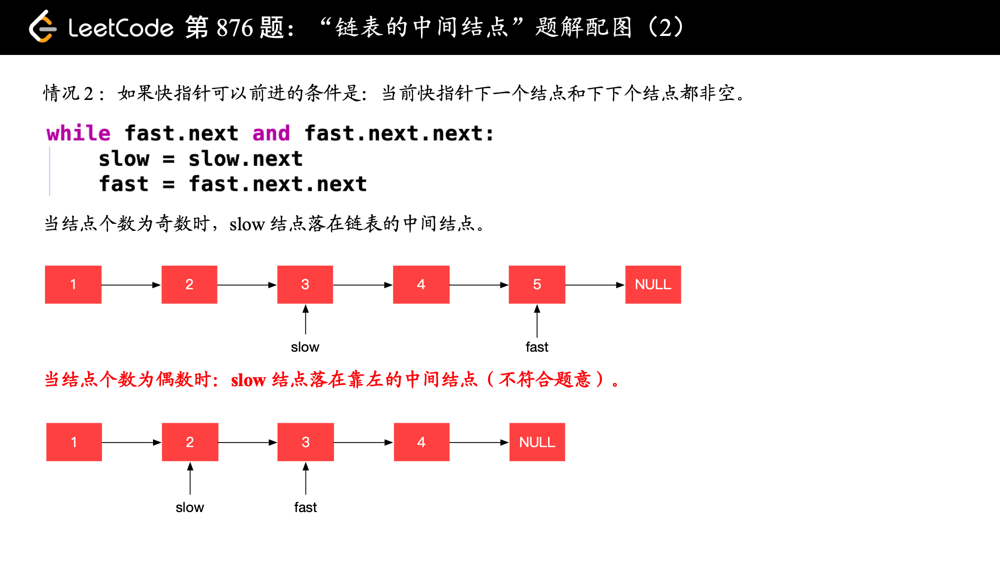

## 链表

### 141 环形链表

#### 方法1：快慢指针

当一个链表有环时，快慢指针都会陷入环中进行无限次移动，然后变成了追及问题。

当两个指针都进入环后，每轮移动使得慢指针到快指针的距离增加一，同时快指针到慢指针的距离也减少一，只要一直移动下去，快指针总会追上慢指针。

```cpp
根据上述表述得出，如果一个链表存在环，那么快慢指针必然会相遇。实现代码如下：


class Solution {
public:
    bool hasCycle(ListNode *head) {
        ListNode *slow = head;
        ListNode *fast = head;
        while(fast != nullptr) {
            fast = fast->next;
            if(fast != nullptr) {
                fast = fast->next;
            }
            if(fast == slow) {
                return true;
            }
            slow = slow->next;
        }
        return nullptr;
    }
};

class Solution {
public:
    bool hasCycle(ListNode *head) {
        if(head==nullptr) return false;
        ListNode* fast=head;
        ListNode* slow=head;
        while(fast->next!=nullptr && fast->next->next!=nullptr){
            fast=fast->next->next;
            slow=slow->next;
            if(fast==slow){
                return true;
            }  
        }
        return false;
    }
};

```


### 21 合并两个有序链表

#### 方法一：迭代（带头结点的版本，leetcode上不对）

```cpp
#include <iostream>
using namespace std;

//Definition for singly-linked list.
struct ListNode {
	int val;
	ListNode* next;
	ListNode() : val(0), next(nullptr) {}
	ListNode(int x) : val(x), next(nullptr) {}
	ListNode(int x, ListNode* next) : val(x), next(next) {}
};

//Definition for singly-linked list
class Solution {
public:
	ListNode* mergeTwoLists(ListNode* list1, ListNode* list2) {
		ListNode* p1 = list1->next; //指向list1的首元结点
		ListNode* p2 = list2->next; //指向list2的首元结点  
		ListNode* list3 = list1;    
		ListNode* p3 = list3; //指向头结点
		while (p1 && p2) {
			if (p1->val <= p2->val) {
				p3->next = p1; //从首元结点开始，而不是从头结点开始
				p3 = p3->next;
				p1 = p1->next;
			}
			else {
				p3->next = p2;
				p3 = p3->next;
				p2 = p2->next;
			}
		}
		//while循环执行完毕后，较长的链表还有余留一段元素，这段元素的起止地址就是pa或pb
		p3->next = (p1 ? p1 : p2);
		return list3;
	}
};

//尾插法创建不定长的单向链表
void createListTail(ListNode* L) {
	ListNode* r = L;
	do {
		ListNode* p = new ListNode;
		cin >> p->val;  //循环创建p，输入结点数据
		p->next = nullptr;
		r->next = p;
		r = p;
	} while (getchar() != '\n');
}

//输出链表元素
void printList(ListNode* L) {
	ListNode* p = L->next;
	while (p) {
		cout << p->val<<" ";
		p = p->next;
	}
	cout << endl;
}

int main()
{	
	ListNode* list1 = new ListNode;
	createListTail(list1);
	printList(list1);
	ListNode* list2 = new ListNode;
	createListTail(list2);
	printList(list2);

	Solution s;
	ListNode* list3 = s.mergeTwoLists(list1, list2);
	printList(list3);

	
	delete list2;
	delete list1;
	system("pause");
	return 0;
}
```

#### 方法 一：迭代（不带头结点的版本，leetcode上是对的）

1. 创建一个空表list3
2. 一次从list1或list2中摘取元素值较小的结点插入到list3表的最后，直到其中一个表变空为止
3. 继续将list1或list2其中一个表的剩余结点插入到list3表的最后

leetcode上面的链表都是不带头结点

```cpp
/**
 * Definition for singly-linked list.
 * struct ListNode {
 *     int val;
 *     ListNode *next;
 *     ListNode() : val(0), next(nullptr) {}
 *     ListNode(int x) : val(x), next(nullptr) {}
 *     ListNode(int x, ListNode *next) : val(x), next(next) {}
 * };
 */
class Solution {
public:
	ListNode* mergeTwoLists(ListNode* list1, ListNode* list2) {
		ListNode* p1 = list1; //list1没有头结点
		ListNode* p2 = list2; //list2没有头结点
		ListNode* list3 = new ListNode;    
		ListNode* p3 = list3;  //list3有头结点
		while (p1 && p2) {
			if (p1->val <= p2->val) {
				p3->next = p1; 
				p3 = p3->next;
				p1 = p1->next;
			}
			else {
				p3->next = p2;
				p3 = p3->next;
				p2 = p2->next;
			}
		}
		//while循环执行完毕后，较长的链表还有余留一段元素，这段元素的起止地址就是pa或pb
		p3->next = (p1 ? p1 : p2);
		return list3->next; //返回list3->next，因为list3是带头结点，头结点中的val为0
	}
};
```


### 23. 合并 K 个升序链表

#### 方法1：分治


```cpp
/**
 * Definition for singly-linked list.
 * struct ListNode {
 *     int val;
 *     ListNode *next;
 *     ListNode() : val(0), next(nullptr) {}
 *     ListNode(int x) : val(x), next(nullptr) {}
 *     ListNode(int x, ListNode *next) : val(x), next(next) {}
 * };
 */
class Solution {
public:
    ListNode* mergeTwoList(ListNode* list1, ListNode* list2){
        ListNode* dummyHead=new ListNode;
        ListNode* p3=dummyHead;
        ListNode* p1=list1;
        ListNode* p2=list2;
        while(p1 && p2){
            if(p1->val<=p2->val){
                p3->next=p1;
                p3=p3->next;
                p1=p1->next;
            }
            else{
                p3->next=p2;
                p2=p2->next;
                p3=p3->next;
            }
        }
        p3->next=p1?p1:p2;
        return dummyHead->next;
    }

    ListNode* merge(vector<ListNode*>& lists, int l, int r){
        if(l==r) return lists[l];
        if(l>r) return nullptr;
        int mid=(l+r)>>1;
        return mergeTwoList(merge(lists, l, mid), merge(lists, mid+1, r));
    }

    ListNode* mergeKLists(vector<ListNode*>& lists) {
        return merge(lists, 0, lists.size()-1);
    }
};
```


### 206 反转链表

#### 方法一：迭代（leetcode上不带头结点的版本）

- 定义两个指针：prev和curr
- 每次让curr的next指向prev，实现一次局部反转

```cpp
#include <iostream>
using namespace std;

/// <summary>
/// 不带头结点
/// </summary>

struct ListNode {
	int val;
	ListNode* next;
	ListNode() : val(0), next(nullptr) {}
	ListNode(int x) : val(x), next(nullptr) {}
	ListNode(int x, ListNode* next) : val(x), next(next) {}
};


class Solution {
public:
	ListNode* reverseList(ListNode* head) {
		ListNode* prev = nullptr;
		//首先curr指向首元结点
		ListNode* curr = head;
		while (curr) {
			//利用next暂时存储curr结点的下一结点
			ListNode* next = curr->next;
			//curr的next指针域指向上次循环存储的prev前一结点
			curr->next = prev;
			//prev指向当前结点
			prev = curr;
			//curr指向下一结点
			curr = next;
		}
		return prev;
	}
};


//尾插法创建不定长的单向链表
void createListTail(ListNode* L) {
	ListNode* r = L;
	cin >> r->val;
	do {
		ListNode* p = new ListNode;
		cin >> p->val;  //循环创建p，输入结点数据
		p->next = nullptr;
		r->next = p;
		r = p;
	} while (getchar() != '\n');
}

//输出链表元素
void printList(ListNode* L) {
	ListNode* p = L;
	while (p) {
		cout << p->val << " ";
		p = p->next;
	}
	cout << endl;
}

int main()
{
	ListNode* list1 = new ListNode;
	createListTail(list1);
	printList(list1);

	Solution s;
	printList(s.reverseList(list1));

	delete list1;

	system("pause");
	return 0;
}
```

首先定义一个cur指针，指向头结点，再定义一个pre指针，初始化为null。

然后就要开始反转了，首先要把 cur->next 节点用tmp指针保存一下，也就是保存一下这个节点。

为什么要保存一下这个节点呢，因为接下来要改变 cur->next 的指向了，将cur->next 指向pre ，此时已经反转了第一个节点了。

接下来，就是循环走如下代码逻辑了，继续移动pre和cur指针。

最后，cur 指针已经指向了null，循环结束，链表也反转完毕了。 此时我们return pre指针就可以了，pre指针就指向了新的头结点。


### 92 反转链表 II

```cpp
ListNode* reverseBetween(ListNode* head, int left, int right) {
    // 创建一个虚拟头节点，方便处理边界情况
    ListNode* dummy = new ListNode(-1);
    dummy->next = head;

    // 找到需要反转的起始位置的前一个节点
    ListNode* pre = dummy;
    for (int i = 0; i < left - 1; i++) {
        pre = pre->next;
    }

    // 定义反转区间的起始节点和当前节点
    ListNode* start = pre->next;
    ListNode* cur = start;

    // 反转链表，有点绕
    for (int i = left; i < right; i++) {
        ListNode* nextNode = cur->next;
        cur->next = nextNode->next;
        nextNode->next = pre->next;
        pre->next = nextNode;
    }

    return dummy->next;
}
```


### 24 两两交换链表中的结点

#### 方法一：迭代

```cpp
class Solution {
public:
	ListNode* swapPairs(ListNode* head) {
		//创建哑结点dummyHead，令dummyHead.next=head
		ListNode* dummyHead = new ListNode(0, head);
		//令temp表示当前到达的结点，初始化时temp=dummyHead
		ListNode* temp = dummyHead;
		ListNode* node1;
		ListNode* node2;
		//如果temp的后面没有结点或者只有一个结点，则结束交换
		while (temp->next && temp->next->next) { 
			//node1指向temp的下一结点，node2指向temp的下下个结点
			node1 = temp->next;
			node2 = temp->next->next;
			//两两交换
			//交换之前的节点关系是 temp -> node1 -> node2，
			//交换之后的节点关系要变成 temp -> node2 -> node1
			temp->next = node2;
			node1->next = node2->next;
			node2->next = node1;
			//令temp=node1
			temp = node1;
		}
		return dummyHead->next;
	}
};
```

#### 方法2：第2次写的迭代


```cpp
class Solution {
public:
	ListNode* swapPairs(ListNode* head) {
		ListNode* dummyHead = new ListNode(0);
		dummyHead->next = head;
		ListNode* cur = dummyHead;
		while (cur->next!=nullptr && cur->next->next!=nullptr) {
			ListNode* tmp1 = cur->next;
			ListNode* tmp2 = cur->next->next->next;

			cur->next = tmp1->next;
			cur->next->next = tmp1;
			tmp1->next = tmp2;
			
			
			cur = cur->next->next;
		}
		return dummyHead->next;
	}
};
```


### 160 相交链表

#### 方法一：相交的话必在相交的起始点相遇

如果不相交，则相遇处为NULL

```cpp
class Solution {
public:
	// 设A的长度为a+c，B的长度为b+c；其中c为A、B的公共部分；
	// 拼接AB、BA：A+B=a+c+b+c B+A=b+c+a+c；由于a+c+b=b+c+a，因此二者必定在c的起始点处相遇
	ListNode* getIntersectionNode(ListNode* headA, ListNode* headB) {
		ListNode* curA = headA, * curB = headB;
		while (curA != curB) {
			// 每次判断当前点是否为空的好处是：避免A B无公共部分，
			// 再走完A+B和B+A后，会在nullptr处相遇
			curA = curA ? curA->next : headB;
			curB = curB ? curB->next : headA;
		}
		return curA;
	}
};
```

### 234 回文链表

#### 方法一：复制到数组后采用双指针法

```cpp
#include <iostream>
using namespace std;
#include <vector>

/// <summary>
/// 不带头结点
/// </summary>


//Definition for singly-linked list.
struct ListNode {
	int val;
	ListNode* next;
	ListNode() : val(0), next(nullptr) {}
	ListNode(int x) : val(x), next(nullptr) {}
	ListNode(int x, ListNode* next) : val(x), next(next) {}
};


class Solution {
public:
	bool isPalindrome(ListNode* head) {
		vector<int> elem;
		ListNode* p = head;
		//将链表赋值到数组
		while (p) {
			elem.push_back(p->val);
			p = p->next;
		}

		//双指针法
		int low = 0, high = elem.size() - 1;
		while (low <= high) {
			//一旦前后指针搜索到的数组元素不相同，就返回false
			if (elem[low] != elem[high]) {
				return false;
			}
			//相同的话前后指针就继续移动
			else {
				++low;
				--high;
			}
		}
		//都相等就返回true
		return true;
	}
};

//尾插法创建不定长的单向链表
ListNode* createListTail() {
	ListNode* L= new ListNode;
	ListNode* r = L;
	cin >> r->val;
	do {
		ListNode* p = new ListNode;
		cin >> p->val;  //循环创建p，输入结点数据
		p->next = nullptr;
		r->next = p;
		r = p;
	} while (getchar() != '\n');
	return L;
}

//输出链表元素
void printList(ListNode* L) {
	ListNode* p = L;
	while (p) {
		cout << p->val << " ";
		p = p->next;
	}
	cout << endl;
}

int main()
{
	ListNode* list = createListTail();
	printList(list);

	Solution ss;
	cout << boolalpha << ss.isPalindrome(list) << endl;


	system("pause");
	return 0;
}
```

### 203 移除链表元素

#### 方法1：设置虚拟头结点

设置一个虚拟头结点，链表的所有结点都可以按照统一的方式进行移除

```cpp
class Solution {
public:
	ListNode* removeElements(ListNode* head, int val) {
		ListNode* dummyHead = new ListNode(0);
		dummyHead->next = head;
		ListNode* cur = dummyHead;
		while (cur->next != NULL) {
			if (cur->next->val == val) {
				ListNode* tmp = cur->next;
				cur->next = cur->next->next;
				delete tmp;
			}
			else {
				cur = cur->next;
			}
		}
		head = dummyHead->next;
		delete dummyHead;
		return head;
	}
};
```

### 19 删除链表的倒数第n个结点

#### 方法1：快慢指针

如果要删除倒数第n个节点，让fast移动n步，然后让fast和slow同时移动，直到fast指向链表末尾。删掉slow所指向的节点就可以了。

```cpp
class Solution {
public:
	ListNode* removeNthFromEnd(ListNode* head, int n) {
		ListNode* dummyHead = new ListNode(0);
		dummyHead->next = head;
		ListNode* slow = dummyHead;
		ListNode* fast = dummyHead;
		for (int i = 0; i < n; i++) {
			fast = fast->next;
		}
		while (fast->next!=NULL) {
			fast = fast->next;
			slow = slow->next;	
		}
		slow->next = slow->next->next;
		return dummyHead->next;
	}
};
```

### 面试题 02.07.链表相交

#### 方法1：双指针，提前移动到同一起点

简单来说，就是求两个链表交点节点的**指针**。 这里同学们要注意，交点不是数值相等，而是指针相等。

为了方便举例，假设节点元素数值相等，则节点指针相等。

看如下两个链表，目前curA指向链表A的头结点，curB指向链表B的头结点：


我们求出两个链表的长度，并求出两个链表长度的差值，然后让curA移动到，和curB 末尾对齐的位置，如图：


此时我们就可以比较curA和curB是否相同，如果不相同，同时向后移动curA和curB，如果遇到curA == curB，则找到交点。

否则循环退出返回空指针。

```cpp
class Solution {
public:
	ListNode* getIntersectionNode(ListNode* headA, ListNode* headB) {
		ListNode* curA = headA;
		ListNode* curB = headB;
		int lenA = getLength(headA);
		int lenB = getLength(headB);
		if (lenA > lenB) { //链表A更长，链表A往后移
			for (int i = 0; i < lenA - lenB; i++) {
				curA = curA->next;
			}
		}
		else if (lenA < lenB) { //链表B更长，链表B往后移到同一起点
			for (int i = 0; i < lenB - lenA; i++) {
				curB = curB->next;
			}
		}
		else { ; }

		for (int i = 0; i < lenB; i++) {
			if (curA == curB) return curA;
			curA = curA->next;
			curB = curB->next;
		}
		return nullptr;
	}

	int getLength(ListNode* head) {
		ListNode* p = head;
		int len = 0;
		while (p != NULL) {
			++len;
			p = p->next;
		}
		return len;
	}
};
```


### 876 链表的中间结点

#### 方法1：

==关键，两种情况的区别==




```cpp
class Solution {
public:
    ListNode* middleNode(ListNode* head) {
        if (head == nullptr) {
            return nullptr;
        }

        ListNode* slow = head;
        ListNode* fast = head;

        while (fast && fast->next) {
            slow = slow->next;
            fast = fast->next->next;
        }
        return slow;
    }
};
```


### 148 排序链表

#### 方法1：自顶向下归并排序

```cpp
class Solution {
public:
    ListNode* sortList(ListNode* head) {
        return sortList(head, nullptr);
    }

    // 找到链表的中点，以中点为分界，将链表拆分成两个子链表。寻找链表的中点可以使用快慢指针的做法，快指针每次移动 2 步，慢指针每次移动 1 步，当快指针到达链表末尾时，慢指针指向的链表节点即为链表的中点。
    ListNode* sortList(ListNode* head, ListNode* tail) {
        if (head == nullptr) return head;
        if (head->next == tail) {
            head->next = nullptr;
            return head;
        }
        ListNode* slow = head, * fast = head;
        while (fast != tail) {
            slow=slow->next;
            fast=fast->next;
            if (fast != tail) {
                fast = fast->next;
            }
        }
        ListNode* mid = slow;
        // 对两个子链表分别排序
        return merge(sortList(head, mid), sortList(mid, tail));
    }

    // 将两个排序后的子链表合并，得到完整的排序后的链表
    ListNode* merge(ListNode* head1, ListNode* head2) {
        ListNode* dummyHead = new ListNode(0);
        ListNode* temp = dummyHead, * temp1 = head1, * temp2 = head2;
        while (temp1 != nullptr && temp2 != nullptr) {
            if (temp1->val <= temp2->val) {
                temp->next = temp1;
                temp1 = temp1->next;
            }
            else {
                temp->next = temp2;
                temp2 = temp2->next;
            }
            temp = temp->next;
        }

        if (temp1 != nullptr) {
            temp->next = temp1;
        }
        else if (temp2 != nullptr) {
            temp->next = temp2;
        }
        return dummyHead->next;
    }
};
```

#### 方法2：归并排序（递归法）

降低时间复杂度，用二分法

**步骤1：分割环节**：找到当前链表中点，并从中点将链表断开

- 我们使用 `fast,slow` 快慢双指针法，奇数个节点找到中点，偶数个节点找到中心左边的节点。
- 找到中点 `slow` 后，执行 `slow.next = None` 将链表切断。
- 递归分割时，输入当前链表左端点 `head` 和中心节点 `slow` 的下一个节点 `tmp`(因为链表是从 `slow` 切断的)。
- **cut 递归终止条件：** 当 `head.next == None` 时，说明只有一个节点了，直接返回此节点。

**步骤2：合并环节**：将两个排序链表合并，转化为一个排序链表

- 双指针法合并，建立辅助 ListNode `h` 作为头部。
- 设置两指针 `left`, `right` 分别指向两链表头部，比较两指针处节点值大小，由小到大加入合并链表头部，指针交替前进，直至添加完两个链表。
- 返回辅助ListNode `h` 作为头部的下个节点 `h.next`。
- 时间复杂度 `O(l + r)`，`l, r` 分别代表两个链表长度。

当题目输入的 `head == None` 时，直接返回 None。


```cpp
/**
 * Definition for singly-linked list.
 * struct ListNode {
 *     int val;
 *     ListNode *next;
 *     ListNode() : val(0), next(nullptr) {}
 *     ListNode(int x) : val(x), next(nullptr) {}
 *     ListNode(int x, ListNode *next) : val(x), next(next) {}
 * };
 */
class Solution {
public:
    ListNode* sortList(ListNode* head) {
        if(head==nullptr || head->next==nullptr){
            return head;
        }

        ListNode* fast=head->next;
        ListNode* slow=head;
        while(fast!=nullptr && fast->next!=nullptr){
            slow=slow->next;
            fast=fast->next->next;
        }

        ListNode* tmp=slow->next;
        slow->next=nullptr;
        ListNode* left=sortList(head);
        ListNode* right=sortList(tmp);
        ListNode* dummy=new ListNode(0);

        ListNode* p=dummy;
        while(left!=nullptr && right!=nullptr){
            if(left->val<=right->val){
                p->next=left;
                p=p->next;
                left=left->next;
            }
            else{
                p->next=right;
                p=p->next;
                right=right->next;
            }
        }
        p->next=left!=nullptr?left:right;
        return dummy->next;
    }
};
```


### 25 K个一组翻转链表


```cpp
/**
 * Definition for singly-linked list.
 * struct ListNode {
 *     int val;
 *     ListNode *next;
 *     ListNode() : val(0), next(nullptr) {}
 *     ListNode(int x) : val(x), next(nullptr) {}
 *     ListNode(int x, ListNode *next) : val(x), next(next) {}
 * };
 */
class Solution {
public:
    ListNode* reverse(ListNode* head){
        ListNode* pre=new ListNode();
        ListNode* cur=head;
        while(cur!=nullptr){
            ListNode* tmp=cur->next;
            cur->next=pre;
            pre=cur;
            cur=tmp;
        }
        return pre;
    }

    ListNode* reverseKGroup(ListNode* head, int k) {
        ListNode* dummyHead=new ListNode(0);
        dummyHead->next=head;

        ListNode* pre=dummyHead;
        ListNode* end=dummyHead;
        while(end->next!=nullptr){
            for(int i=0;i<k && end!=nullptr ;i++){
                end=end->next;
            }
            if(end==nullptr){
                break;
            }
            ListNode* start=pre->next;
            ListNode* next=end->next;
            end->next=nullptr;
            pre->next=reverse(start);

            start->next=next;
            pre=start;
            end=start;
        }
        return dummyHead->next;
        
    }
};
```


#### 83. 删除排序链表中的重复元素

简单题

```cpp
/**
 * Definition for singly-linked list.
 * struct ListNode {
 *     int val;
 *     ListNode *next;
 *     ListNode() : val(0), next(nullptr) {}
 *     ListNode(int x) : val(x), next(nullptr) {}
 *     ListNode(int x, ListNode *next) : val(x), next(next) {}
 * };
 */
class Solution {
public:
    ListNode* deleteDuplicates(ListNode* head) {
        if(head==nullptr){
            return nullptr;
        }
        ListNode* node=head;
        while(node!=nullptr){
            //这里千万要判断node->next也不为空才可以
            while(node->next!=nullptr && node->val==node->next->val){
                node->next=node->next->next;
            }
            node=node->next;
        }
        return head;     
    }
};
```


#### 82. 删除排序链表中的重复元素 II

真的有点头脑不清醒


```cpp
/**
 * Definition for singly-linked list.
 * struct ListNode {
 *     int val;
 *     ListNode *next;
 *     ListNode() : val(0), next(nullptr) {}
 *     ListNode(int x) : val(x), next(nullptr) {}
 *     ListNode(int x, ListNode *next) : val(x), next(next) {}
 * };
 */
class Solution {
public:
    ListNode* deleteDuplicates(ListNode* head) {
        if(head==nullptr){
            return nullptr;
        }
        ListNode* dummyHead=new ListNode();
        dummyHead->next=head;
        ListNode* cur=dummyHead;
        while(cur->next && cur->next->next){
            if(cur->next->val==cur->next->next->val){
                int x=cur->next->val;
                while(cur->next && cur->next->val==x){
                    cout<<cur->next->val<<endl;
                    cur->next=cur->next->next;
                }
            }
            else{
                cur=cur->next;
            }
        }
        return dummyHead->next;
    }
};
```


### 143. 重排链表

```cpp
class Solution {
public:
    void reorderList(ListNode* head) {
        if (head == nullptr || head->next == nullptr || head->next->next == nullptr) 		 {
            return;  // 链表为空或只有一个、两个节点，无需重新排列
        }
        
        // 使用快慢指针找到链表的中间节点
        ListNode* slow = head;
        ListNode* fast = head;
        while (fast->next != nullptr && fast->next->next != nullptr) {
            slow = slow->next;
            fast = fast->next->next;
        }
        
        // 将后半部分链表反转
        ListNode* prev = nullptr;
        ListNode* curr = slow->next;
        while (curr != nullptr) {
            ListNode* next = curr->next;
            curr->next = prev;
            prev = curr;
            curr = next;
        }
        slow->next = nullptr;  // 将前半部分链表与后半部分链表断开
        
        // 交替合并前半部分链表和反转后的后半部分链表
        ListNode* p1 = head;
        ListNode* p2 = prev;
        while (p1 != nullptr && p2 != nullptr) {
            ListNode* next1 = p1->next;
            ListNode* next2 = p2->next;
            
            p1->next = p2;
            p2->next = next1;
            
            p1 = next1;
            p2 = next2;
        }
    }
};
```


### 61. 旋转链表

需要找到链表中倒数第 k 个节点，并将其作为新的链表头。首先，我们计算链表的长度，并将链表首尾连接起来形成一个循环链表。然后，我们找到倒数第 k 个节点的前一个节点，将其下一个节点作为新的链表头，并将倒数第 k 个节点的前一个节点的下一个节点置为 nullptr，从而断开循环链表。最后，返回新的链表头。

```cpp

class Solution {
public:
    ListNode* rotateRight(ListNode* head, int k) {
        // 如果链表为空或者只有一个节点，直接返回原链表
        if (head == nullptr || head->next == nullptr) {
            return head;
        }

        // 计算链表的长度
        int length = 1;
        ListNode* tail = head;
        while (tail->next != nullptr) {
            tail = tail->next;
            length++;
        }

        // 将链表首尾相连形成循环链表
        tail->next = head;

        // 计算实际需要移动的步数
        k = k % length;

        // 找到倒数第 k 个节点的前一个节点
        ListNode* newTail = head;
        for (int i = 0; i < length - k - 1; i++) {
            newTail = newTail->next;
        }

        // 新的链表头节点为倒数第 k 个节点的下一个节点
        ListNode* newHead = newTail->next;

        // 断开循环链表
        newTail->next = nullptr;

        return newHead;
    }
};
```


### 328. 奇偶链表

#### 方法1：双指针

可以使用两个指针，一个指向奇数节点的末尾，另一个指向偶数节点的末尾。然后我们遍历链表，将奇数节点连接到奇数节点末尾，偶数节点连接到偶数节点末尾。最后，将奇数节点的末尾连接到偶数节点的头部，形成最终的结果。

```cpp
class Solution {
public:
    ListNode* oddEvenList(ListNode* head) {
        if (head == nullptr || head->next == nullptr) {
            return head;
        }

        ListNode* oddTail = head;   // 奇数节点的末尾
        ListNode* evenHead = head->next;   // 偶数节点的头部
        ListNode* evenTail = evenHead;   // 偶数节点的末尾

        ListNode* curr = evenHead->next;   // 当前节点

        int index = 3;   // 当前节点的索引，从3开始

        while (curr != nullptr) {
            if (index % 2 == 1) {
                // 当前节点是奇数节点
                oddTail->next = curr;
                oddTail = curr;
            } else {
                // 当前节点是偶数节点
                evenTail->next = curr;
                evenTail = curr;
            }

            curr = curr->next;
            index++;
        }

        // 将奇数节点的末尾连接到偶数节点的头部
        oddTail->next = evenHead;

        // 将偶数节点的末尾置为nullptr，断开链表
        evenTail->next = nullptr;

        return head;
    }
};
```


#### 第2种

```cpp
#include <iostream>
using namespace std;

struct ListNode{
    int val;
    ListNode* next;
    ListNode(int _val):val(_val), next(nullptr){}
};

ListNode* oddEvenList(ListNode* head){
    // 只有两个节点也无需排序
    if(head==nullptr || head->next==nullptr || head->next->next==nullptr){
        return head;
    }

    ListNode* first=head;
    ListNode* second=head->next;
    ListNode* tmp=second;

    while(second!=nullptr && second->next!=nullptr){
        first->next=first->next->next;
        first=first->next;
        second->next=second->next->next;
        second=second->next;
    }

    first->next=tmp;
    return head;
}

ListNode* create(){
    ListNode* dummy=new ListNode(-1);
    ListNode* pre=dummy;
    int num;
    while(cin>>num){
        if(num==-1){
            pre->next=nullptr;
            break;
        }
        ListNode* cur=new ListNode(num);
        pre->next=cur;
        pre=cur;
    }
    return dummy->next;
}

int main(){
    ListNode* head=create();
    head=oddEvenList(head);
    while(head!=nullptr){
        cout<<head->val<<" ";
        head=head->next;
    }
}
```


### 82. 删除排序链表中的重复元素 II

```cpp
class Solution {
public:
    ListNode* deleteDuplicates(ListNode* head) {
        if(head==nullptr){
            return nullptr;
        }

        ListNode* dummy=new ListNode();
        dummy->next=head;
        ListNode* cur=dummy;
        while(cur->next && cur->next->next){
            if(cur->next->val==cur->next->next->val){
                int tmp=cur->next->val;
                while(cur->next && cur->next->val==tmp){
                    cur->next=cur->next->next;
                }
            }
            else{
                cur=cur->next;
            }
        }
        return dummy->next;
    }
};
```

