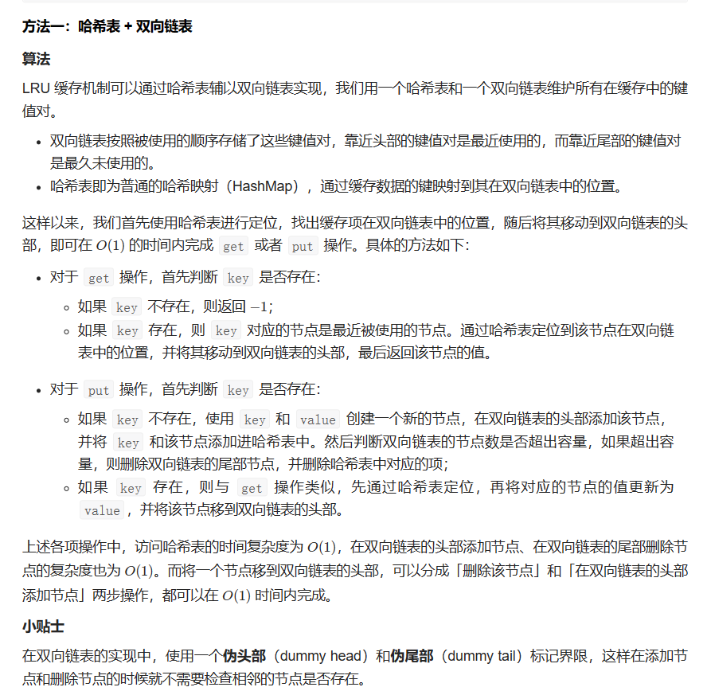
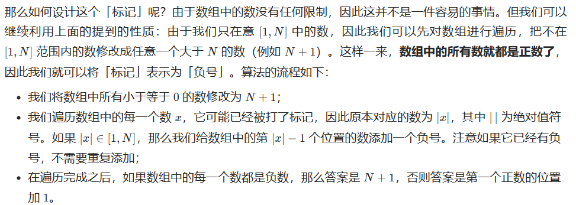
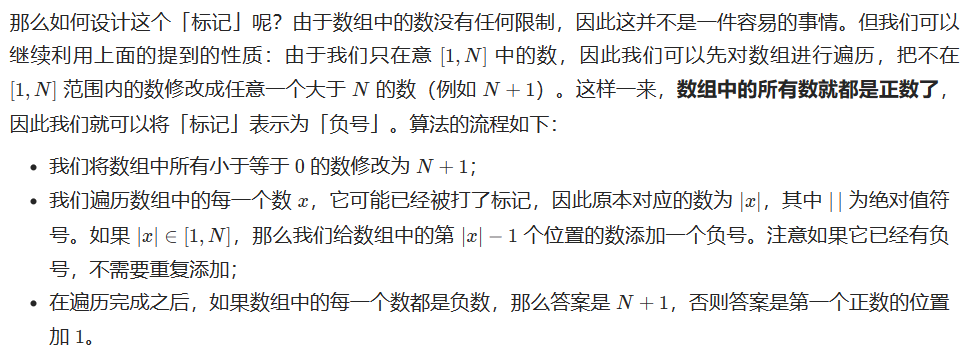
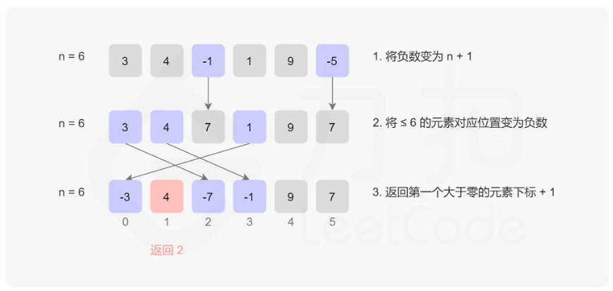

## 哈希表

### 242 有效字母的异位词

#### 方法1：数组哈希表

```cpp
class Solution {
public:
	bool isAnagram(string s, string t) {
		int record[26] = { 0 };
		for (int i = 0; i < s.size(); i++) {
			// s字符串中有就++
			record[s[i] - 'a']++;
		}
		for (int i = 0; i < t.size(); i++) {
			// t字符串中有就--
			record[t[i] - 'a']--;
		}
		for (int i = 0; i < 26; i++) {
			// 全为0就符合要求
			if (record[i] != 0) return false;
		}
		return true;
	}
};
```


### 128 最长连续序列

#### 方法1：哈希表

```cpp
class Solution {
public:
    int longestConsecutive(vector<int>& nums) {
        unordered_set<int> uset;
        for (auto num : nums) {
            uset.insert(num);
        }

        int longestStreak = 0;

        for(auto num:uset){
            if (!uset.count(num - 1)) {
                // 因为没有num-1那个数，所以num是当前连续序列的第一个数，此时才会进入内层循环
                int currentNum = num;
                int currentStreak = 1;

                // 如果有当前数的下一个数，就继续累加
                while (uset.count(currentNum + 1)) {
                    currentNum += 1;
                    currentStreak += 1;
                }
                longestStreak = max(currentStreak, longestStreak);
            }
        }
        return longestStreak;
    }
};
```


### 146 LRU缓存

#### 方法1：哈希表+双向链表

[146. LRU 缓存 - 力扣（LeetCode）](https://leetcode.cn/problems/lru-cache/solutions/259678/lruhuan-cun-ji-zhi-by-leetcode-solution/)

- 双向链表按照被使用的顺序存储了这些键值对，靠近头部的键值对是最近使用的，而靠近尾部的键值对是最久未使用的。
- 哈希表即为普通的哈希映射（HashMap），通过缓存数据的键映射到其在双向链表中的位置。



```cpp
struct DLinkedNode {
    int key, value;
    DLinkedNode* prev;
    DLinkedNode* next;
    DLinkedNode(): key(0), value(0), prev(nullptr), next(nullptr) {}
    DLinkedNode(int _key, int _value): key(_key), value(_value), prev(nullptr), next(nullptr) {}
};

class LRUCache {
private:
    unordered_map<int, DLinkedNode*> cache;
    DLinkedNode* head;
    DLinkedNode* tail;
    int size;
    int capacity;

public:
    LRUCache(int _capacity): capacity(_capacity), size(0) {
        // 使用伪头部和伪尾部节点
        head = new DLinkedNode();
        tail = new DLinkedNode();
        head->next = tail;
        tail->prev = head;
    }
    
    int get(int key) {
        if (!cache.count(key)) {
            return -1;
        }
        // 如果 key 存在，先通过哈希表定位，再移到头部
        DLinkedNode* node = cache[key];
        moveToHead(node);
        return node->value;
    }
    
    void put(int key, int value) {
        if (!cache.count(key)) {
            // 如果 key 不存在，创建一个新的节点
            DLinkedNode* node = new DLinkedNode(key, value);
            // 添加进哈希表
            cache[key] = node;
            // 添加至双向链表的头部
            addToHead(node);
            ++size;
            if (size > capacity) {
                // 如果超出容量，删除双向链表的尾部节点
                DLinkedNode* removed = removeTail();
                // 删除哈希表中对应的项
                cache.erase(removed->key);
                // 防止内存泄漏
                delete removed;
                --size;
            }
        }
        else {
            // 如果 key 存在，先通过哈希表定位，再修改 value，并移到头部
            DLinkedNode* node = cache[key];
            node->value = value;
            moveToHead(node);
        }
    }

    void addToHead(DLinkedNode* node) {
        node->prev = head;
        node->next = head->next;
        head->next->prev = node;
        head->next = node;
    }
    
    void removeNode(DLinkedNode* node) {
        node->prev->next = node->next;
        node->next->prev = node->prev;
    }

    void moveToHead(DLinkedNode* node) {
        removeNode(node);
        addToHead(node);
    }

    DLinkedNode* removeTail() {
        DLinkedNode* node = tail->prev;
        removeNode(node);
        return node;
    }
};
```

#### 第2次

```cpp
#include <iostream>
#include <unordered_map>
using namespace std;

struct DLinkedNode{
    int key, val;
    DLinkedNode* pre, *next;
    DLinkedNode():key(0), val(0), pre(nullptr), next(nullptr){}
    DLinkedNode(int _key, int _val):key(_key), val(_val), pre(nullptr), next(nullptr){}
};

class LRUCache{
public:
    unordered_map<int, DLinkedNode*> cache;
    DLinkedNode* head;
    DLinkedNode* tail;
    int size;
    int capacity;

public:
    LRUCache(int _capacity){
        size=0;
        capacity=_capacity;
        head=new DLinkedNode();
        tail=new DLinkedNode();
        head->next=tail;
        tail->pre=head;

    }

    int get(int key){
        if(!cache.count(key)){
            return -1;
        }
        DLinkedNode* node=cache[key];
        moveToHead(node);
        return node->val;

    }

    void put(int key, int value){
        if(!cache.count(key)){
            DLinkedNode* node=new DLinkedNode(key, value);
            cache[key]=node;
            addTohead(node);
            ++size;
            if(size>capacity){
                DLinkedNode* removed=removeTail();
                cache.erase(removed->key);
                delete removed;
                --size;
            }
        }
        else{
            DLinkedNode* node=cache[key];
            node->val=value;
            moveToHead(node);
        }
    }

    void addTohead(DLinkedNode* node){
        node->pre=head;
        node->next=head->next;
        head->next->pre=node;
        head->next=node;
    }

    void removeNode(DLinkedNode* node){
        node->next->pre=node->pre;
        node->pre->next=node->next;
    }

    void moveToHead(DLinkedNode* node){
        removeNode(node);
        addTohead(node);
    }

    
    DLinkedNode* removeTail(){
        DLinkedNode* node=tail->pre;
        removeNode(node);
        return node;
    }

};


int main(){
    LRUCache cache(2);
    DLinkedNode* cur=nullptr;
    cache.put(1, 1);
    cache.put(2, 2);
    cache.get(1);       // 返回  1
    cache.put(3, 3);    // 该操作会使得密钥 2 作废
    // cur=cache.head->next;
    // while(cur!=cache.tail){
    //     cout<<cur->val<<" ";
    //     cur=cur->next;
    // }
    cache.get(2);       // 返回 -1 (未找到)
    cache.put(4, 4);    // 该操作会使得密钥 1 作废
    cur=cache.head->next;
    while(cur!=cache.tail){
        cout<<cur->val<<" ";
        cur=cur->next;
    }
    cache.get(1);       // 返回 -1 (未找到)
    cache.get(3);       // 返回  3
    cache.get(4);       // 返回  4

    return 0;
}
```


### 2 两数之和

- 将两个链表看成是相同长度的进行遍历，如果一个链表较短则在前面补 00，比如 `987 + 23 = 1010`
- 每一位计算的同时需要考虑上一位的进位问题，而当前位计算结束后同样需要更新进位值
- 如果两个链表全部遍历完毕后，进位值为 11，则在新链表最前方添加节点 1
- 小技巧：对于链表问题，返回结果为头结点时，通常需要先初始化一个预先指针 pre，该指针的下一个节点指向真正的头结点 head。使用预先指针的目的在于链表初始化时无可用节点值，而且链表构造过程需要指针移动，进而会导致头指针丢失，无法返回结果。

```cpp
class Solution {
public:
	ListNode* addTwoNumbers(ListNode* l1, ListNode* l2) {
		// 当返回结果为头结点时，先初始化一个预先指针pre，该指针的下一个节点
		// 指向真正的头结点
		ListNode* dummy = new ListNode();
		ListNode* pre = dummy;
		int carry = 0;
		while (l1 || l2 || carry) {
			if (l1) {
				carry += l1->val;
				l1 = l1->next;
			}
			if (l2) {
				carry += l2->val;
				l2 = l2->next;
			}
			ListNode* tmp = new ListNode(carry % 10);
			pre->next = tmp;
			pre = pre->next;
			carry /= 10;
		}
		return dummy->next;
	}
};
```


### 383 赎金信

#### 方法1：数组哈希表

用数组就行

```cpp
class Solution {
public:
	bool canConstruct(string ransomNote, string magazine) {
		int record[26] = { 0 };
		if (ransomNote.size() > magazine.size()) {
			return false;
		}
		for (int i = 0; i < magazine.size(); i++) {
			record[magazine[i] - 'a']++;
		}
		for (int i = 0; i < ransomNote.size(); i++) {
			record[ransomNote[i] - 'a']--;
			if (record[ransomNote[i] - 'a'] < 0) {
				return false;
			}
		}
		return true;
	}
};

```


### 349 两个数组的交集

#### 方法1：unordered_set哈希表


```cpp
class Solution {
public:
	vector<int> intersection(vector<int>& nums1, vector<int>& nums2) {
		unordered_set<int> result;
		unordered_set<int> tmp(nums1.begin(), nums1.end());
		for(int num:nums2){
			if (tmp.find(num) != tmp.end()) {
				result.insert(num);
			}
		}
		return vector<int>(result.begin(), result.end());
	}
};
```

### 202 快乐数

#### 方法1：unordered_set哈希表

哈希表来存储sum，如果重复出现了，说明陷入死循环；
如果==1，说明是快乐数。

```cpp
class Solution {
public:
	int getSum(int n) {
		int sum = 0;
		while (n) {
			sum += (n % 10) * (n % 10);
			n /= 10;
		}
		return sum;
	}

	bool isHappy(int n) {
		int sum;
		unordered_set<int> us;
		while (1) {
			sum = getSum(n);
			if (sum == 1) return true;
			if (us.find(sum) != us.end()) {
				return false;
			}
			else {
				us.insert(sum);
			}
			n = sum;
		}
	}
};
```

### 1 两数之和

#### 方法1：unordered_map哈希表

```cpp
class Solution {
public:
    vector<int> twoSum(vector<int>& nums, int target) {
		unordered_map<int, int> us;
		for (int i = 0; i < nums.size(); ++i) {
			//查询哈希表中是否存在target-nums[i]
			auto it = us.find(target - nums[i]);
			//如果找到了，直接返回
			if (it != us.end()) {
				return { it->second,i };
			}
			//将nums[i]插入到哈希表中，可以保证不与自己匹配
			us[nums[i]] = i;
		}
		return {};
    }
};
```

#### 针对牛客上的

```cpp
class Solution {
public:
    vector<int> FindNumbersWithSum(vector<int> array,int sum) {
        unordered_map<int, int> umap;
        for(int i=0;i<array.size();i++){
            auto it=umap.find(sum-array[i]);
            if(it!=umap.end()){
                return {it->first, array[i]};
            }
            umap[array[i]]=i;
        }

        return {};

    }
};
```


### 454 四数相加 II

#### 方法1：unordered_map哈希表

本题解题步骤：

1. 首先定义 一个unordered_map，key放a和b两数之和，value 放a和b两数之和出现的次数。
2. 遍历大A和大B数组，统计两个数组元素之和，和出现的次数，放到map中。
3. 定义int变量count，用来统计 a+b+c+d = 0 出现的次数。
4. 在遍历大C和大D数组，找到如果 0-(c+d) 在map中出现过的话，就用count把map中key对应的value也就是出现次数统计出来。
5. 最后返回统计值 count 就可以了

```cpp
class Solution {
public:
	int fourSumCount(vector<int>& nums1, vector<int>& nums2, vector<int>& nums3, vector<int>& nums4) {
		unordered_map<int, int> um; //key:a+b的数值，value:a+b数值出现的次数
		int count = 0;
		// 遍历大A和大B数组，统计两个数组元素之和，和出现的次数，放到um中
		for (int a : nums1) {
			for (int b : nums2) {
				um[a + b]++;
			}
		}
		// 在遍历nums3和nums4数组，找到如果 0-(c+d) 在um中出现过的话，
		// 就把um中key对应的value也就是出现次数统计出来。
		for (int c : nums3) {
			for (int d : nums4) {
				auto it = um.find(0 - (c + d));
				if (it != um.end()) {
					count += um[0 - (c + d)];
				}
			}
		}
		return count;
	}
};
```


### 169 多数元素

#### 方法1：哈希表

```cpp
class Solution {
public:
    int majorityElement(vector<int>& nums) {
        unordered_map<int, int> umap;
        int result = 0;
        int maxNum = 0;
        for (auto num : nums) {
            umap[num]++;
            if(umap[num]>maxNum){
                maxNum = umap[num];
                result = num;
            }
        }
        return result;
    }
};
```


### 49 字母异位词

#### 方法1：哈希表

```cpp
class Solution {
public:
    vector<vector<string>> groupAnagrams(vector<string>& strs) {
        unordered_map<string, vector<string>> umap;
        for (auto str : strs) {
            auto key = str;
            sort(key.begin(), key.end());
            // 互为字母异位词的两个字符串包含的字母相同，因此对两个字符串分别进行
            // 排序之后得到的字符串一定是相同的，故可以将排序之后的字符串作为哈希
            // 表的键。
            umap[key].emplace_back(str);
        }

        vector<vector<string>> ans;
        for (auto it = umap.begin(); it != umap.end(); it++) {
            ans.emplace_back(it->second);
        }
        return ans;
    }
};
```


### 12 整数转罗马数字

#### 方法1：贪心哈希表

每次都尽量使用最大的数来表示

```cpp
class Solution {
public:
    string intToRoman(int num) {
        int values[] = {1000, 900, 500, 400, 100, 90, 50, 40, 10, 9, 5, 4, 1};
        string reps[] = {"M", "CM", "D", "CD", "C", "XC", "L", "XL", "X", "IX", "V", "IV", "I"};

        string res;
        for (int i = 0; i < 13; i ++ )  //这里不使用图里的count了，一遍一遍来就行了
            while(num >= values[i])
            {
                num -= values[i];
                res += reps[i];
            }
        return res;
    }
};

```


#### 387. 字符串中的第一个唯一字符

简单题，用哈希表快点，但是不算非常快

```cpp
class Solution {
public:
    int firstUniqChar(string s) {
        // 创建哈希表，哈希表的查找快点
        unordered_map<char, int> result;
        for(auto ch:s){
            result[ch]++;
        }

        for(int i=0;i<s.size();i++){
            if(result[s[i]]==1){
                return i;
            }
        }
        return -1;
    }
};
```


#### 41. 缺失的第一个正数




```cpp
class Solution {
public:
    int firstMissingPositive(vector<int>& nums) {
        int n = nums.size();
        for (int& num: nums) {
            if (num <= 0) {
                num = n + 1;
            }
        }
        for (int i = 0; i < n; ++i) {
            int num = abs(nums[i]);
            if (num <= n) {
                nums[num - 1] = -abs(nums[num - 1]);
            }
        }
        for (int i = 0; i < n; ++i) {
            if (nums[i] > 0) {
                return i + 1;
            }
        }
        return n + 1;
    }
};

```


### 41. 缺失的第一个正数

#### 方法1：哈希表





```cpp
class Solution {
public:
    int firstMissingPositive(vector<int>& nums) {
        int n = nums.size();
        for (int& num: nums) {
            if (num <= 0) {
                num = n + 1;
            }
        }
        for (int i = 0; i < n; ++i) {
            int num = abs(nums[i]);
            if (num <= n) {
                nums[num - 1] = -abs(nums[num - 1]);
            }
        }
        for (int i = 0; i < n; ++i) {
            if (nums[i] > 0) {
                return i + 1;
            }
        }
        return n + 1;
    }
};

```


