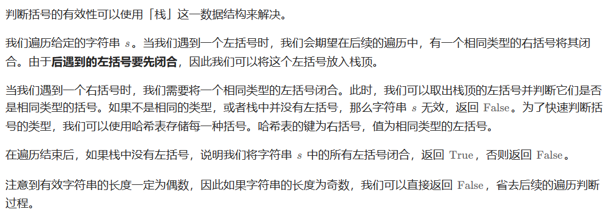
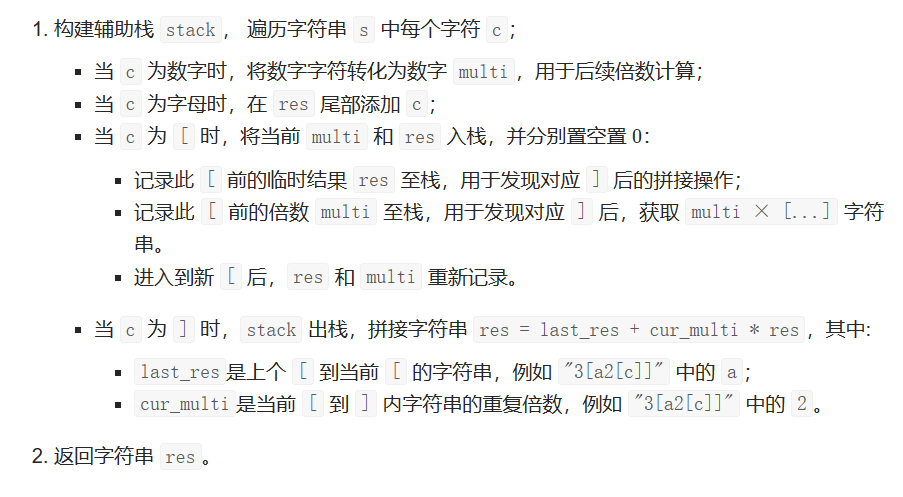
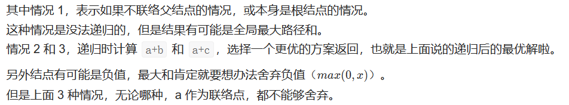
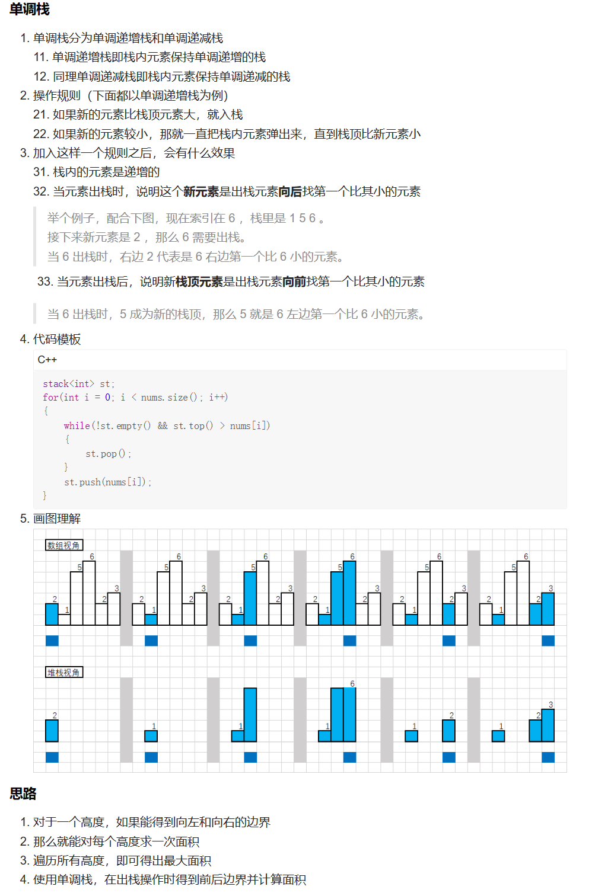

## 栈与队列

### 155 最小栈

#### 方法一：双栈（stack容器）

用stack容器创建两个栈，一个栈用来存储实际元素，一个栈用来存储最小元素

```cpp
#include <iostream>
using namespace std;
#include <stack>
#include <algorithm>


class MinStack {
public:
    MinStack() {
        min_stack.push(INT_MAX); //min_stack先初始化一个无穷大的数
    }

    void push(int x) {
        x_stack.push(x);
        min_stack.push(min(min_stack.top(), x)); //min_stack的栈顶元素一直是最小的
    }

    void pop() {
        x_stack.pop();
        min_stack.pop();
    }

    int top() {
        return x_stack.top();
    }

    int getMin() {
        return min_stack.top();
    }

private:
    stack<int> x_stack;
    stack<int> min_stack;
};
/**
 * Your MinStack object will be instantiated and called as such:
 * MinStack* obj = new MinStack();
 * obj->push(val);
 * obj->pop();
 * int param_3 = obj->top();
 * int param_4 = obj->getMin();
 */
```

### 225 用队列实现栈

#### 方法一：两个队列（queue容器）

通过一个辅助queue容器q2，将后插入的元素排到队头，而不是队尾

```cpp
#include <iostream>
using namespace std;
#include <queue>


class MyStack {
public:
    MyStack() {

    }

    void push(int x) {
        //q2用于辅助
        //queue容器是队列，先进先出
        //通过这种方式将后入的元素排到队头
        q2.push(x);
        while (!q1.empty()) {
            q2.push(q1.front());
            q1.pop();
        }
        swap(q1, q2);
    }

    int pop() {
        int r = q1.front();
        //pop是队头的元素
        q1.pop();
        return r;
    }

    int top() {
        int r = q1.front();
        return r;
    }

    bool empty() {
        return q1.empty();
    }
private:
    queue<int> q1;
    queue<int> q2;
};
```

#### 方法2：只有一个队列

队尾做栈顶，队头做栈底

```cpp
class MyStack {
public:
    queue<int> que;

    MyStack() {

    }

    void push(int x) {
        que.push(x);
    }

    int pop() {
        int size = que.size() - 1;
        while (size--) {
            que.push(que.front());
            que.pop();
        }
        int result = que.front();
        que.pop();
        return result;
    }

    int top() {
        return que.back();
    }

    bool empty() {
        return que.empty();
    }
};

/**
 * Your MyStack object will be instantiated and called as such:
 * MyStack* obj = new MyStack();
 * obj->push(x);
 * int param_2 = obj->pop();
 * int param_3 = obj->top();
 * bool param_4 = obj->empty();
 */
```


### 232 用栈实现队列

#### 方法1：

```cpp
class MyQueue {
public:
    stack<int> stIn;
    stack<int> stOut;

    MyQueue() {

    }

    void push(int x) {
        stIn.push(x);
    }

    int pop() {
        if (stOut.empty()) {
            while (!stIn.empty()) {
                stOut.push(stIn.top());
                stIn.pop();
            }
        }
        int result = stOut.top();
        stOut.pop();
        return result;
    }

    int peek() {
        int res = this->pop();
        stOut.push(res);
        return res;
    }

    bool empty() {
        return stIn.empty() && stOut.empty();
    }
};
```


### 20 有效的括号

#### 方法1：栈


- 第一种情况：已经遍历完了字符串，但是栈不为空，说明有相应的左括号没有右括号来匹配，所以return false
- 第二种情况：遍历字符串匹配的过程中，发现栈里没有要匹配的字符。所以return false
- 第三种情况：遍历字符串匹配的过程中，栈已经为空了，没有匹配的字符了，说明右括号没有找到对应的左括号return false
- 什么时候说明左括号和右括号全都匹配了呢，就是字符串遍历完之后，栈是空的，就说明全都匹配了。

```cpp
class Solution {
public:
    bool isValid(string s) {
        if (s.size() % 2 != 0) return false; // 如果s的长度为奇数，一定不符合要求
        stack<char> st;
        for (int i = 0; i < s.size(); i++) {
            if (s[i] == '(') st.push(')');
            else if (s[i] == '{') st.push('}');
            else if (s[i] == '[') st.push(']');
            // 第三种情况：遍历字符串匹配的过程中，栈已经为空了，没有匹配的字符了，说明右括号没有找到对应的左括号 return false
            // 第二种情况：遍历字符串匹配的过程中，发现栈里没有我们要匹配的字符。所以return false
            else if (st.empty() || st.top() != s[i]) return false;
            else st.pop(); // st.top() 与 s[i]相等，栈弹出元素
        }
        // 第一种情况：此时我们已经遍历完了字符串，但是栈不为空，说明有相应的左括号没有右括号来匹配，所以return false，否则就return true
        return st.empty();
    }
}
```

#### 第2次：栈



```cpp
class Solution {
public:
    bool isValid(string s) {
        int n=s.size();
        if(n%2==1){
            return false;
        }
        stack<char> st;
        unordered_map<char, char> umap={
            {')', '('},
            {']', '['},
            {'}', '{'}
        };

        for(int i=0;i<n;i++){
            if(umap.count(s[i])){
                // 右括号
                if(st.empty() || st.top()!=umap[s[i]]){
                    return false;
                }
                st.pop();
            }
            else{
                // 左括号
                st.push(s[i]);
            }
        }

        return st.empty();
    }
};
```


#### 第3次

```cpp
class Solution {
public:
    bool isValid(std::string s) {
        if (s.empty()) {
            return true;
        }
        
        std::stack<char> stack;
        for (char c : s) {
            if (c == '(') {
                stack.push(')');
            } else if (c == '{') {
                stack.push('}');
            } else if (c == '[') {
                stack.push(']');
            } else if (stack.empty() || c != stack.top()) {
                return false;
            } else {
                stack.pop();
            }
        }
        
        return stack.empty();
    }
};
```


### 1047 删除字符串中的所有相邻重复项

#### 方法1：栈

```cpp
// 把字符串直接当成栈
// 栈的目的，就是存放遍历过的元素，当遍历当前的这个元素的时候，去栈里看一下我们是不是遍历过相同数值的相邻元素,再做对应的消除操作
class Solution {
public:
    string removeDuplicates(string s) {
        string result;
        for (int i = 0; i < s.size();i++) {
            if (result.empty() || result.back() != s[i]) {
                result.push_back(s[i]);
            }
            else {
                result.pop_back();
            }
        }
        return result;
    }
};
```

### 150 求逆波兰表达式求值

#### 方法1：栈


```cpp
class Solution {
public:
    int evalRPN(vector<string>& tokens) {
        // 力扣修改了后台测试数据，需要用longlong
        stack<long long> st; 
        for (int i = 0; i < tokens.size(); i++) {
            if (tokens[i] == "+" || tokens[i] == "-" || tokens[i] == "*" || tokens[i] == "/") {
                long long num1 = st.top();
                st.pop();
                long long num2 = st.top();
                st.pop();
                if (tokens[i] == "+") st.push(num2 + num1);
                if (tokens[i] == "-") st.push(num2 - num1);
                if (tokens[i] == "*") st.push(num2 * num1);
                if (tokens[i] == "/") st.push(num2 / num1);
            } else {
                //stoll用于将字符串转换长整型long long
                st.push(stoll(tokens[i]));
            }
        }

        int result = st.top();
        st.pop(); // 把栈里最后一个元素弹出（其实不弹出也没事）
        return result;
    }
};
```


### 739 每日温度

#### 方法1：单调栈

**什么时候用单调栈：通常是一维数组，要寻找任一个元素的右边或者左边第一个比自己大或者小的元素的位置，此时我们就要想到可以用单调栈了**。

单调栈的本质是空间换时间，就是用一个栈来记录遍历过的元素。容器用单调栈

```
1.单调栈里存放的元素是什么？
单调栈里只需要存放元素的下标i就可以了，如果需要使用对应的元素，直接T[i]就可以获取。

2.单调栈里元素是递增呢？ 还是递减呢？
这里我们要使用递增循序（再强调一下是指从栈头到栈底的顺序），因为只有递增的时候，栈里要加入一个元素i的时候，才知道栈顶元素在数组中右面第一个比栈顶元素大的元素是i。
即：如果求一个元素右边第一个更大元素，单调栈就是递增的，如果求一个元素右边第一个更小元素，单调栈就是递减的。

```

```cpp
class Solution {
public:
    vector<int> dailyTemperatures(vector<int>& T) {
        stack<int> st; // 递增栈
        vector<int> result(T.size(), 0);
        for (int i = 0; i < T.size(); i++) {
            while (!st.empty() && T[i] > T[st.top()]) { // 注意栈不能为空
                result[st.top()] = i - st.top();
                st.pop();
            }
            st.push(i);

        }
        return result;
    }
};
```


### 496 下一个更大元素I

#### 方法1：单调栈

定义一个和nums1一样大小的数组result来存放结果。

题目说如果不存在对应位置就输出 -1 ，所以result数组如果某位置没有被赋值，那么就应该是是-1，所以就初始化为-1。

**题目中说是两个没有重复元素 的数组 nums1 和 nums2**。没有重复元素，我们就可以用map来做映射了。根据数值快速找到下标，还可以判断nums2[i]是否在nums1中出现过。

```cpp
class Solution {
public:
    vector<int> nextGreaterElement(vector<int>& nums1, vector<int>& nums2) {
        stack<int> st;
        vector<int> result(nums1.size(), -1);
        if (nums1.size() == 0) return result;

        unordered_map<int, int> umap; // key:下标元素，value：下标
        for (int i = 0; i < nums1.size(); i++) {
            umap[nums1[i]] = i;
        }
        st.push(0);
        for (int i = 1; i < nums2.size(); i++) {
            while (!st.empty() && nums2[i] > nums2[st.top()]) {
                if (umap.count(nums2[st.top()]) > 0) { // 看map里是否存在这个元素
                    int index = umap[nums2[st.top()]]; // 根据map找到nums2[st.top()] 在 nums1中的下标
                    result[index] = nums2[i];
                }
                st.pop();
            }
            st.push(i);
        }
        return result;
    }
};
```


### 503 下一个更大元素II

#### 方法1：单调栈

```cpp
class Solution {
public:
    vector<int> nextGreaterElements(vector<int>& nums) {
        vector<int> result(nums.size(), -1);
        if (nums.size() == 0) return result;
        stack<int> st;
        for (int i = 0; i < nums.size() * 2; i++) {
            // 模拟遍历两边nums，注意一下都是用i % nums.size()来操作
            while (!st.empty() && nums[i % nums.size()] > nums[st.top()]) {
                result[st.top()] = nums[i % nums.size()];
                st.pop();
            }
            st.push(i % nums.size());
        }
        return result;
    }
};
```


### 394 字符串解码

#### 方法1：辅助栈法

要Debug才能知道具体的步骤



```cpp
class Solution {
public:
    string decodeString(string s) {
        stack<pair<int, string>> sta;
        int num = 0;
        string res = "";
        // 循环检查字符串
        for (int i = 0; i < s.size(); i++) {
            // 遇到数字则存入num
            if (s[i] >= '0' && s[i] <= '9') {
                num *= 10;
                num += (s[i] - '0'); // 取出数字，十位数百位数都有可能
            }
            else if (s[i] == '[') {
                // 遇到'['，压栈数字和字符串，置零置空
                sta.push(make_pair(num, res));
                num = 0;
                res = "";
            } 
            else if (s[i] == ']') { // 遇到']'，出栈数字和字符串，然后进行组装
                int n = sta.top().first; //n指示的是res的循环次数，不是a的
                string a = sta.top().second;
                sta.pop();
                for (int i = 0; i < n; i++) a = a + res; //循环n次
                res = a;
            }
            else { // 遇到字符存入字符
                res += s[i];
            }
        }
        return res;
    }   
};
```


#### 09. 用两个栈实现队列

运行比较慢

```cpp
class CQueue {
public:
    stack<int> st1;
    stack<int> st2;

    CQueue() {

    }
    
    void appendTail(int value) {
        st1.push(value);
    }
    
    int deleteHead() {
        if(st1.size()==0){
            return -1;
        }
        // st1只放一个队头元素
        while(st1.size()!=1){
            st2.push(st1.top());
            st1.pop();
        }
        int value=st1.top();
        st1.pop();
        while(!st2.empty()){
            st1.push(st2.top());
            st2.pop();
        }
        return value;
    }
};

/**
 * Your CQueue object will be instantiated and called as such:
 * CQueue* obj = new CQueue();
 * obj->appendTail(value);
 * int param_2 = obj->deleteHead();
 */
```


 更好的做法，删除的时候不用来回倒腾

```cpp
class CQueue {
public:
    stack<int> st1;
    stack<int> st2;
    // size记录的是总的数据个数
    int size=0;


    CQueue() {

    }
    
    void appendTail(int value) {
        st1.push(value);
        size++;
    }
    
    int deleteHead() {
        if(size==0) return -1;

        if(st2.empty()){
            while(!st1.empty()){
                st2.push(st1.top());
                st1.pop();
            }
        }

        size--;
        // st2的最上面就是最早的数据
        int value = st2.top();
        st2.pop();
        return value;
    }
};

/**
 * Your CQueue object will be instantiated and called as such:
 * CQueue* obj = new CQueue();
 * obj->appendTail(value);
 * int param_2 = obj->deleteHead();
 */
```


### 42. 接雨水

#### 方法1：栈

说到栈，我们肯定会想到括号匹配了。我们仔细观察蓝色的部分，可以和括号匹配类比下。每次匹配出一对括号（找到对应的一堵墙），就计算这两堵墙中的水。

我们用栈保存每堵墙。

当遍历墙的高度的时候，如果当前高度小于栈顶的墙高度，说明这里会有积水，我们将墙的高度的下标入栈。

如果当前高度大于栈顶的墙的高度，说明之前的积水到这里停下，我们可以计算下有多少积水了。计算完，就把当前的墙继续入栈，作为新的积水的墙。

总体的原则就是，

- 当前高度小于等于栈顶高度，入栈，指针后移。

- 当前高度大于栈顶高度，出栈，计算出当前墙和栈顶的墙之间水的多少，然后计算当前的高度和新栈的高度的关系，重复第 2 步。直到当前墙的高度不大于栈顶高度或者栈空，然后把当前墙入栈，指针后移。


```cpp
class Solution {
public:
    int trap(vector<int>& height) {
        int sum=0;
        int current=0;
        stack<int> st;
        while(current<height.size()){
            while(!st.empty() && height[current]>height[st.top()]){
                int h=height[st.top()];
                st.pop();
                if(st.empty()){
                    break;
                }
                int distance = current-st.top()-1;
                int minh=min(height[st.top()], height[current]);
                sum+=distance*(minh-h);
            }
            st.push(current);
            current++;
        }
        return sum;
    }
};
```


### 124. 二叉树中的最大路径和

二叉树 abc，a 是根结点（递归中的 root），bc 是左右子结点（代表其递归后的最优解）。
最大的路径，可能的路径情况：

```
    a
   / \
  b   c
```

1. b + a + c。
2. b + a + a 的父结点。
3. a + c + a 的父结点。



代码中使用 val 来记录全局最大路径和。

- `ret` 是情况 2 和 3。
- `lmr` 是情况 1。

所要做的就是递归，递归时记录好全局最大和，返回联络最大和。

```cpp
class Solution {
public:
    int helper(TreeNode* root, int& val){
        if(root==nullptr) return 0;
        int left=helper(root->left, val);
        int right=helper(root->right, val);
        int lmr=root->val+max(0, left)+max(0, right);
        int ret=root->val+max(0, max(left, right));
        val=max(val, max(lmr, ret));
        // return ret是因为只有2、3情况需要继续往下递归
        return ret;
    }

    int maxPathSum(TreeNode* root) {
        int val=INT_MIN;
        helper(root, val);
        return val;
    }
};
```


### 239. 滑动窗口最大值

#### 方法1：双向队列

遍历数组，将 数 存放在双向队列中，并用 L,R 来标记窗口的左边界和右边界。

队列中保存的并不是真的 数，而是该数值对应的数组下标位置，并且数组中的数要从大到小排序。

如果当前遍历的数比队尾的值大，则需要弹出队尾值，直到队列重新满足从大到小的要求。

- 刚开始遍历时，L 和 R 都为 0，有一个形成窗口的过程，此过程没有最大值，L 不动，R 向右移。
- 当窗口大小形成时，L 和 R 一起向右移，每次移动时，判断队首的值的数组下标是否在 [L,R] 中，如果不在则需要弹出队首的值，当前窗口的最大值即为队首的数。

```cpp
class Solution {
public:
    vector<int> maxSlidingWindow(vector<int>& nums, int k) {
        vector<int> result;
        deque<int> que;
        int len=nums.size();
        for(int i=0;i<len;i++){
            while(!que.empty() && nums[que.back()]<nums[i]){
                que.pop_back();
            }
            while(!que.empty() && i-que.front()+1 > k){
                que.pop_front();
            }
            que.push_back(i);

            if(i+1>=k){
                result.push_back(nums[que.front()]);
            }
        }
        return result;
    }
};
```


### 32. 最长有效括号

#### 方法1：栈

具体做法是我们始终保持栈底元素为当前已经遍历过的元素中「最后一个没有被匹配的右括号的下标」，这样的做法主要是考虑了边界条件的处理，栈里其他元素维护左括号的下标：

- 对于遇到的每个 ‘(’，我们将它的下标放入栈中
- 对于遇到的每个 ‘)’，我们先弹出栈顶元素表示匹配了当前右括号：
  - 如果栈为空，说明当前的右括号为没有被匹配的右括号，我们将其下标放入栈中来更新我们之前提到的「最后一个没有被匹配的右括号的下标」
  - 如果栈不为空，当前右括号的下标减去栈顶元素即为「以该右括号为结尾的最长有效括号的长度」
    我们从前往后遍历字符串并更新答案即可。

需要注意的是，如果一开始栈为空，第一个字符为左括号的时候我们会将其放入栈中，这样就不满足提及的「最后一个没有被匹配的右括号的下标」，为了保持统一，我们在一开始的时候往栈中放入一个值为 −1 的元素。

```cpp
class Solution {
public:
    int longestValidParentheses(string s) {
        int maxans = 0;
        stack<int> stk;
        stk.push(-1);
        for (int i = 0; i < s.length(); i++) {
            if (s[i] == '(') {
                stk.push(i);
            } else {
                stk.pop();
                if (stk.empty()) {
                    stk.push(i);
                } else {
                    maxans = max(maxans, i - stk.top());
                }
            }
        }
        return maxans;
    }
};
```


### 227. 基本计算器 II

#### 方法1：栈和双指针

要实现一个基本计算器来计算表达式的值，可以使用栈和双指针的方法。具体思路如下：

1. 初始化一个栈 `nums` 用于存储数字，一个变量 `num` 用于记录当前数字的值，一个变量 `sign` 用于记录当前数字的符号（正号或负号，默认为正号）。
2. 遍历字符串表达式 `s` 的每个字符，进行如下操作：
   - 如果当前字符是数字字符，则将其转换为数字并更新 `num` 的值。
   - 如果当前字符是运算符（加号或减号），则根据 `sign` 的值将当前数字 `num` 加入栈 `nums`：
     - 如果 `sign` 为正号，则将 `num` 加入栈 `nums`。
     - 如果 `sign` 为负号，则将 `-num` 加入栈 `nums`。
     - 更新 `sign` 为当前运算符。
     - 将 `num` 重置为 0。
   - 如果当前字符是乘号或除号，则将 `num` 与栈顶元素进行相应的运算，并将结果重新压入栈 `nums`：
     - 如果当前字符是乘号，则将栈顶元素与 `num` 相乘，并将结果重新压入栈 `nums`。
     - 如果当前字符是除号，则将栈顶元素与 `num` 相除（整数除法），并将结果重新压入栈 `nums`。
     - 更新 `num` 为 0。
3. 遍历完所有字符后，将栈 `nums` 中的所有数字相加，即为最终的计算结果。

以下是使用 C++ 编写的代码，其中包含详细的注释：

```cpp
#include <iostream>
#include <stack>

using namespace std;

class Solution {
public:
    int calculate(string s) {
        stack<int> nums;
        int num = 0;
        char sign = '+';
        
        for (int i = 0; i < s.length(); i++) {
            char c = s[i];
            
            if (isdigit(c)) {
                // 当前字符是数字字符，更新 num 的值
                num = num * 10 + (c - '0');
            }
            
            if (!isdigit(c) && c != ' ' || i == s.length() - 1) {
                // 当前字符是运算符或字符串末尾，将当前数字加入栈中
                if (sign == '+') {
                    nums.push(num);
                } else if (sign == '-') {
                    nums.push(-num);
                } else if (sign == '*') {
                    int top = nums.top();
                    nums.pop();
                    nums.push(top * num);
                } else if (sign == '/') {
                    int top = nums.top();
                    nums.pop();
                    nums.push(top / num);
                }
                
                // 更新符号和数字
                sign = c;
                num = 0;
            }
        }
        
        // 将栈中的所有数字相加，得到最终的计算结果
        int result = 0;
        while (!nums.empty()) {
            result += nums.top();
            nums.pop();
        }
        
        return result;
    }
};

```


### 84 柱状图中的最大矩形



```cpp
int largestRectangleArea(vector<int>& heights)
{
    int ans = 0;
    vector<int> st;
    heights.insert(heights.begin(), 0);
    heights.push_back(0);
    for (int i = 0; i < heights.size(); i++)
    {
        while (!st.empty() && heights[st.back()] > heights[i])
        {
            int cur = st.back();
            st.pop_back();
            int left = st.back() + 1;
            int right = i - 1;
            ans = max(ans, (right - left + 1) * heights[cur]);
        }
        st.push_back(i);
    }
    return ans;
}

```


### 207、课程表

```cpp
class Solution {
public:
    bool canFinish(int numCourses, vector<vector<int>>& prerequisites) {
        vector<int> inDegree(numCourses, 0);
        vector<vector<int>> adjacencyList(numCourses, vector<int>());

        // 构建有向图的邻接表和入度数组
        for (const auto& prerequisite : prerequisites) {
            int course = prerequisite[0];
            int prerequisiteCourse = prerequisite[1];
            adjacencyList[prerequisiteCourse].push_back(course);
            inDegree[course]++;
        }

        queue<int> q;

        // 将入度为 0 的课程入队
        for (int i = 0; i < numCourses; i++) {
            if (inDegree[i] == 0) {
                q.push(i);
            }
        }

        int count = 0; // 记录已学习的课程数量

        while (!q.empty()) {
            int course = q.front();
            q.pop();
            count++;

            // 遍历当前课程的后续课程
            for (int nextCourse : adjacencyList[course]) {
                inDegree[nextCourse]--; // 将后续课程的入度减 1
                if (inDegree[nextCourse] == 0) {
                    q.push(nextCourse); // 入度为 0 的课程入队
                }
            }
        }

        return count == numCourses;
    }
};
```


