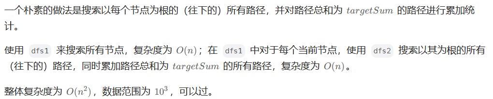
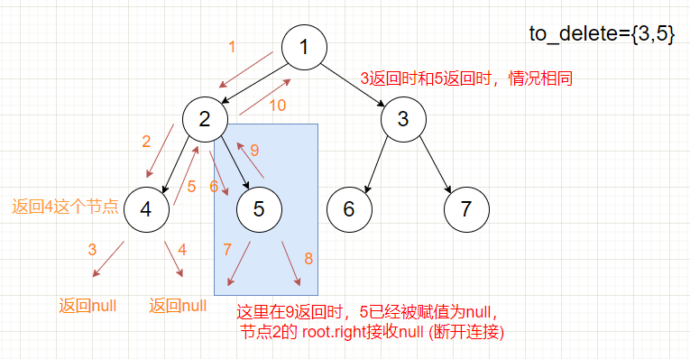
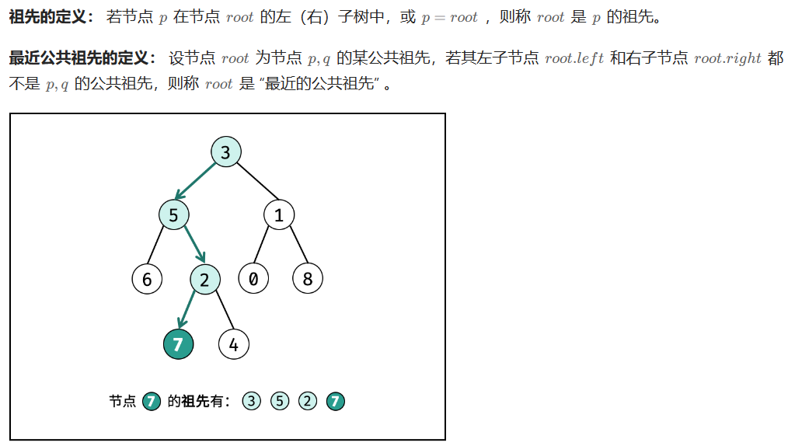
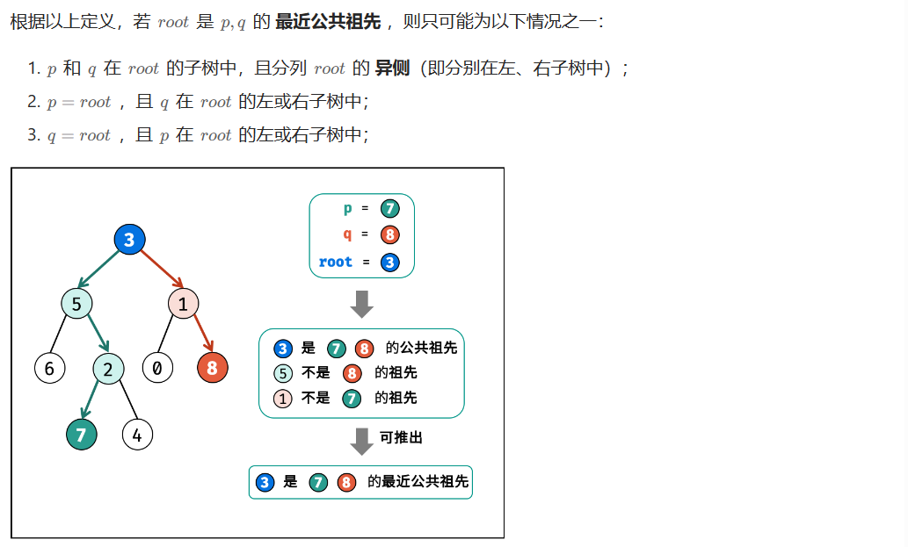
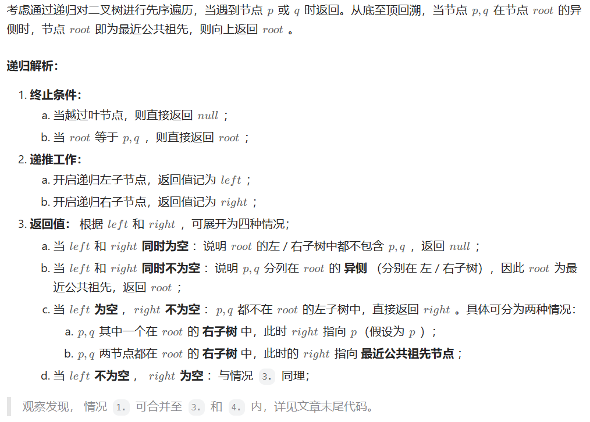
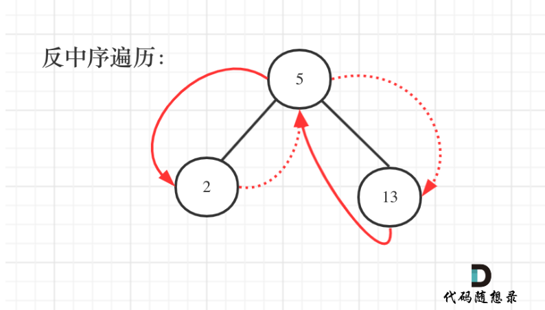

## 树

### 144 二叉树的前序遍历

#### 方法1：递归

```cpp
class Solution {
public:
    void traversal(TreeNode* cur, vector<int>& result) {
        if (cur == nullptr)  return;
        result.push_back(cur->val);
        traversal(cur->left,result);
        traversal(cur->right, result);

    }

    vector<int> preorderTraversal(TreeNode* root) {
        vector<int> result;
        traversal(root, result);
        return result;
    }
};
```

#### 方法2：迭代法

```cpp
class Solution {
public:
    vector<int> preorderTraversal(TreeNode* root) {
        stack<TreeNode*> st;
        vector<int> result;
        if (root == NULL) return result;
        st.push(root);
        while (!st.empty()) {
            TreeNode* node = st.top();                       // 中
            st.pop();
            result.push_back(node->val);
            if (node->right) st.push(node->right);           // 右（空节点不入栈）
            if (node->left) st.push(node->left);             // 左（空节点不入栈）
        }
        return result;
    }
};
```

### 145 二叉树的后序遍历

#### 方法1：递归

```cpp
class Solution {
public:
    void helper(TreeNode* cur, vector<int>& result) {
        if (cur == nullptr) return;
        helper(cur->left, result);
        helper(cur->right, result);
        result.push_back(cur->val);
    }

    vector<int> postorderTraversal(TreeNode* root) {
        vector<int> result;
        helper(root, result);
        return result;
    }
};
```

#### 方法2：后序遍历

```cpp
class Solution {
public:
    vector<int> postorderTraversal(TreeNode* root) {
        stack<TreeNode*> st;
        vector<int> result;
        if (root == NULL) return result;
        st.push(root);
        while (!st.empty()) {
            TreeNode* node = st.top();
            st.pop();
            result.push_back(node->val);
            if (node->left) st.push(node->left); // 相对于前序遍历，这更改一下入栈顺序 （空节点不入栈）
            if (node->right) st.push(node->right); // 空节点不入栈
        }
        reverse(result.begin(), result.end()); // 将结果反转之后就是左右中的顺序了
        return result;
    }
};
```


### 94 二叉树的中序遍历

#### 方法1：递归

```cpp
class Solution {
public:
    void helper(TreeNode* cur, vector<int>& result) {
        if (cur == nullptr) return;
        helper(cur->left, result);
        result.push_back(cur->val);
        helper(cur->right, result);
    }

    vector<int> inorderTraversal(TreeNode* root) {
        vector<int>result;
        helper(root, result);
        return result;
    }
};
```

#### 方法2：迭代法

```cpp
class Solution {
public:
    vector<int> inorderTraversal(TreeNode* root) {
        vector<int> result;
        stack<TreeNode*> st;
        TreeNode* cur = root;
        while (cur != NULL || !st.empty()) {
            if (cur != NULL) { // 指针来访问节点，访问到最底层
                st.push(cur); // 将访问的节点放进栈
                cur = cur->left;                // 左
            } else {
                cur = st.top(); // 从栈里弹出的数据，就是要处理的数据（放进result数组里的数据）
                st.pop();
                result.push_back(cur->val);     // 中
                cur = cur->right;               // 右
            }
        }
        return result;
    }
};
```


### 102 二叉树的层序遍历

#### 方法1：队列


```cpp
class Solution {
public:
    vector<vector<int>> levelOrder(TreeNode* root) {
        vector<vector<int>> result;
        if (root == nullptr) return result;
        queue<TreeNode*> que;
        que.push(root);
        while (!que.empty()) {
            int size = que.size();
            vector<int> vec;
            // 这里一定要使用固定大小size，不要使用que.size()，因为que.size是不断变化的
            // 每次size完，表示一层
            for (int i = 0; i < size; ++i) {
                TreeNode* node = que.front();
                que.pop();
                vec.push_back(node->val);
                if (node->left) que.push(node->left);
                if (node->right) que.push(node->right);
            }
            result.push_back(vec);
        }
        return result;
    }
};

```


### 104 求二叉树的最大深度

#### 方法一：递归调用

```cpp
#include <iostream>
using namespace std;
#include <vector>
#include <queue>

// Definition for a binary tree node.
 struct TreeNode {
     int val;
     TreeNode *left;
     TreeNode *right;
     TreeNode() : val(0), left(nullptr), right(nullptr) {}
     TreeNode(int x) : val(x), left(nullptr), right(nullptr) {}
     TreeNode(int x, TreeNode *left, TreeNode *right) : val(x), left(left), right(right) {}
 };
 
class Solution {
public:
    int maxDepth(TreeNode* root) {
        if (!root) {
            return 0;
        }
        int m = maxDepth(root->left);
        int n = maxDepth(root->right);
        if (m > n) {
            return m + 1;
        }
        else {
            return n + 1;
        }
    }
};


//根据数组，层次法创建二叉树
TreeNode* createTree(vector<int>& l_nums, int i) //层次法创建二叉树
{
    if (i >= l_nums.size() || l_nums[i] == 0) //数值为0或超出数组范围
        return nullptr;
    TreeNode* root = new TreeNode(l_nums[i]);
    root->left = createTree(l_nums, i * 2 + 1);
    root->right = createTree(l_nums, i * 2 + 2);
    return root;
}


int main()
{
    vector<int> nums = { 3,9,20,0,0,15,7 };
    TreeNode* root = createTree(nums, 0);
    
    Solution ss;
    cout << ss.maxDepth(root) << endl;

    system("pause");
    return 0;
}
```


### 111 二叉树的最小深度

#### 方法1：递归，后序遍历


- 如果左子树为空，右子树不为空，说明最小深度是 1 + 右子树的深度。
- 右子树为空，左子树不为空，最小深度是 1 + 左子树的深度。 
- 最后如果左右子树都不为空，返回左右子树深度最小值 + 1 。

```cpp
class Solution {
public:
    int getDepth(TreeNode* node) {
        if (node == nullptr) return 0;
        int leftDepth = getDepth(node->left); // 左
        int rightDepth = getDepth(node->right); // 右

        // 左子树为空，右子树不为空，说明最小深度是 1 + 右子树的深度
        if (node->left == nullptr && node->right != nullptr) {
            return 1 + rightDepth;
        }
        // 右子树为空，左子树不为空，最小深度是 1 + 左子树的深度
        if (node->left != nullptr && node->right == nullptr) {
            return 1 + leftDepth;
        }
        // 如果左右子树都不为空，返回左右子树深度最小值 + 1
        int result = 1 + min(leftDepth, rightDepth);
        return result;
    }

    int minDepth(TreeNode* root) {
        return getDepth(root);
    }
};
```


### 226 翻转二叉树

#### 方法1：前序遍历递归

```cpp
class Solution {
public:
    // 1.确定递归函数的参数和返回值
    // 返回值的话其实也不需要，但是题目中给出的要返回root节点的指针，可以直接使用题目定义好的函数，所以就函数的返回类型为TreeNode*。
    TreeNode* invertTree(TreeNode* root) {
        // 2.确定终止条件
        // 当前节点为空的时候，就返回
        if (root == nullptr) return nullptr;
        // 3.确定单层递归的逻辑
        // 因为是先前序遍历，所以先进行交换左右孩子节点，然后反转左子树，反转右子树。
        swap(root->left, root->right);
        invertTree(root->left);
        invertTree(root->right);
        return root;
    }
};
```

### 222 完全二叉树的节点个数

#### 方法1：递归

```cpp
class Solution {
private:
    // 确定递归函数的参数和返回值：参数就是传入树的根节点，返回就返回以该节点为根节点二叉树的节点数量，所以返回值为int类型。
    int getNodesNum(TreeNode* cur) {
        // 确定终止条件：如果为空节点的话，就返回0，表示节点数为0。
        if (cur == NULL) return 0;
        // 确定单层递归的逻辑：先求它的左子树的节点数量，再求右子树的节点数量，最后取总和再加一 （加1是因为算上当前中间节点）就是目前节点为根节点的节点数量。
        int leftNum = getNodesNum(cur->left);      // 左
        int rightNum = getNodesNum(cur->right);    // 右
        int treeNum = leftNum + rightNum + 1;      // 中
        return treeNum;
    }
public:
    int countNodes(TreeNode* root) {
        return getNodesNum(root);
    }
};
```


### 110 平衡二叉树

#### 方法一：自顶向下递归

```cpp
class Solution {
public:
	int height(TreeNode* root) {
		if (root == NULL) {
			return 0;
		}
		else {
			//获取当前子树的深度
			return max(height(root->left), height(root->right)) + 1;
		}
	}

	bool isBalanced(TreeNode* root) {
		if (root == NULL) {
			return true;
		}
		else {
			//左右子树的深度差皆满足条件
			return abs(height(root->left) - height(root->right)) <= 1 && isBalanced(root->left) && isBalanced(root->right);
		}
	}
};
```

### 543 二叉树的直径

#### 方法一：递归

```cpp
class Solution {
public:
	int maxDepth = 0;
    int diameterOfBinaryTree(TreeNode* root) {
		depth(root);
		return maxDepth;
    }

	int depth(TreeNode* node) {
		if (!node) {
			return 0;
		}
		int left = depth(node->left);
		int right = depth(node->right);
		//将每个节点最大直径（左子树深度+右子树深度）与当前最大值比较并取较大者
		maxDepth = max(left + right, maxDepth);
		//返回节点深度
		return max(left, right) + 1;
	}
};
```

### 437 路径总和III

#### 方法一：深度优先搜索，递归

```C++
class Solution {
public:
	int pathSum(TreeNode* root, int targetSum) {
		if (root) {
			return pathSumStartWithRoot(root, targetSum) + 
				pathSum(root->left, targetSum) + pathSum(root->right, targetSum);
		}
		else {
			return 0;
		}
	}

	long long pathSumStartWithRoot(TreeNode* root, long long sum) {
		if (!root) {
			return 0;
		}

		long long count;
		if (root->val == sum) {
			count = 1;
		}
		else {
			count = 0;
		}

		count += pathSumStartWithRoot(root->left, sum - root->val);
		count += pathSumStartWithRoot(root->right, sum - root->val);
		return count;
	}
};
```

#### 第2次：树的遍历+DFS

宫水三叶

[437. 路径总和 III - 力扣（LeetCode）](https://leetcode.cn/problems/path-sum-iii/solutions/1021490/gong-shui-san-xie-yi-ti-shuang-jie-dfs-q-usa7/)



```cpp
class Solution {
    int ans, t;
public:
    int pathSum(TreeNode* root, int targetSum) {
        t = targetSum;
        dfs1(root);
        return ans;
    }
    
    void dfs1(TreeNode* root) {
        if (root == nullptr) return;
        dfs2(root, root->val);
        dfs1(root->left);
        dfs1(root->right);
    }
    
    void dfs2(TreeNode* root, long long val) {
        if (val == t) ans++;
        if (root->left != nullptr) dfs2(root->left, val + root->left->val);
        if (root->right != nullptr) dfs2(root->right, val + root->right->val);
    }
};
```


### 101 对称二叉树

#### 方法一：递归

比较的是根节点的左子树与右子树是不是相互翻转的，理解这一点就知道了**其实我们要比较的是两个树（这两个树是根节点的左右子树）**，所以在递归遍历的过程中，也是要同时遍历两棵树。

```cpp
#include <iostream>
using namespace std;
#include <vector>
#include <queue>

// Definition for a binary tree node.
struct TreeNode {
	int val;
	TreeNode* left;
	TreeNode* right;
	TreeNode() : val(0), left(nullptr), right(nullptr) {}
	TreeNode(int x) : val(x), left(nullptr), right(nullptr) {}
	TreeNode(int x, TreeNode* left, TreeNode* right) : val(x), left(left), right(right) {}
};


class Solution {
public:
	bool isSymmetric(TreeNode* root) {
		if (root) {
			return isSymmetric(root->left, root->right);
		}
		else{
			return true;
		}
	}

	bool isSymmetric(TreeNode* left, TreeNode* right) {
		//如果两个子树都为空指针，则它们相等或对称
		if (!left && !right) {
			return true;
		}
		//如果两个子树只有一个为空指针，则它们不相等或不对称
		if (!left || !right) {
			return false;
		}
		//如果两个子树根结点的值不相等，则它们不相等或不对称
		if (left->val != right->val) {
			return false;
		}
		return isSymmetric(left->left, right->right) && isSymmetric(left->right, right->left);
	}
};


//根据数组，层次法创建二叉树
TreeNode* createTree(vector<int>& l_nums, int i) //层次法创建二叉树
{
	if (i >= l_nums.size() || l_nums[i] == 0) //数值为0或超出数组范围
		return nullptr;
	TreeNode* root = new TreeNode(l_nums[i]);
	root->left = createTree(l_nums, i * 2 + 1);
	root->right = createTree(l_nums, i * 2 + 2);
	return root;
}

//层次遍历，迭代法
void levelOrderIter(TreeNode* root) {
	queue<TreeNode*> que;
	que.push(root);
	while (!que.empty()) {
		cout << que.front()->val << " ";
		if (que.front()->left != nullptr) {
			que.push(que.front()->left);
		}
		if (que.front()->right != nullptr) {
			que.push(que.front()->right);
		}
		que.pop();
	}
	cout << endl;
}


int main()
{
	vector<int> nums = { 1,2,2,0,3,0,3 };
	TreeNode* root = createTree(nums, 0);
	levelOrderIter(root);

	Solution ss;
	cout << boolalpha << ss.isSymmetric(root) << endl;


	system("pause");
	return 0;
}
```

### 257 二叉树的所有路径

#### 方法1：递归


```cpp
class Solution {
public:
    // 递归函数参数以及返回值,要传入根节点，记录每一条路径的path，和存放结果集的result，这里递归不需要返回值
    void helper(TreeNode* cur, vector<int>& path, vector<string>& result) {
        // 因为是前序遍历，需要先处理中间节点，中间节点就是我们要记录路径上的节点，先放进path中。
        path.push_back(cur->val);
        // 当 cur不为空，其左右孩子都为空的时候，就找到叶子节点。是本题的终止条件
        if (cur->left == nullptr && cur->right == nullptr) { // 遇到叶子节点
            string sPath;
            for (int i = 0; i < path.size()-1; ++i) { // 将path里记录的路径转为string格式
                sPath += to_string(path[i]);
                sPath += "->";
            }
            // 记录最后一个节点（叶子节点）
            // 放在for循环外面是因为不需要再加一个"->"
            sPath += to_string(path[path.size() - 1]); 
            result.push_back(sPath); // 收集一个路径
            return;
        }

        // 递归前要加上判断语句，判断下面要递归的节点是否为空
        // 递归完，要做回溯啊，因为path 不能一直加入节点，它还要删节点，然后才能加入新的节点。
        if (cur->left) { // 左
            helper(cur->left, path, result);
            path.pop_back(); // 回溯
        }

        if (cur->right) { // 右
            helper(cur->right, path, result);
            path.pop_back(); // 回溯
        }
    }

    vector<string> binaryTreePaths(TreeNode* root) {
        vector<string> result;
        vector<int> path;
        if (root == nullptr) return result;
        helper(root, path, result);
        return result;
    }
};
```

### 404 左叶子之和

#### 方法1：递归

**节点A的左孩子不为空，且左孩子的左右孩子都为空（说明是叶子节点），那么A节点的左孩子为左叶子节点**

```cpp
class Solution {
public:
    // 确定递归函数的参数和返回值，判断一个树的左叶子节点之和，那么一定要传入树的根节点，递归函数的返回值为数值之和，所以为int
    int sumOfLeftLeaves(TreeNode* root) {
        // 确定终止条件
		// 如果遍历到空节点，那么左叶子值一定是0
        if (root == NULL) return 0;
        // 只有当前遍历的节点是父节点，才能判断其子节点是不是左叶子。 所以如果当前遍历的节点是叶子节点，那其左叶子也必定是0，那么终止条件为：
        if (root->left == NULL && root->right== NULL) return 0;

        // 确定单层递归的逻辑
		// 当遇到左叶子节点的时候，记录数值，然后通过递归求取左子树左叶子之和，和 右子树左叶子之和，相加便是整个树的左叶子之和。
        int leftValue = sumOfLeftLeaves(root->left);    // 左
        if (root->left && !root->left->left && !root->left->right) { // 左子树就是一个左叶子的情况
            leftValue = root->left->val;
        }
        int rightValue = sumOfLeftLeaves(root->right);  // 右

        int sum = leftValue + rightValue;               // 中
        return sum;
    }
};
```

### 513 找树左下角的值

#### 方法1：迭代法，层序遍历

使用层序遍历再合适不过了，只需要记录最后一行第一个节点的数值就可以了

```cpp
class Solution {
public:
    int findBottomLeftValue(TreeNode* root) {
        queue<TreeNode*> que;
        if (root != nullptr) que.push(root);
        int result = 0;
        while (!que.empty()) {
            int size = que.size();
            for (int i = 0; i < size; i++) {
                TreeNode* node = que.front();
                que.pop();
                if (i == 0) result = node->val; // 记录最后一行第一个元素
                if (node->left) que.push(node->left);
                if (node->right) que.push(node->right);
            }
        }
        return result;  
    }
};
```

### 112 路径总和

#### 方法1：递归


图中可以看出，遍历的路线，并不要遍历整棵树，所以递归函数需要返回值，可以用bool类型表示。


```cpp
class Solution {
private:
    // 确定递归函数的参数和返回类型
 	// 参数：需要二叉树的根节点，还需要一个计数器，这个计数器用来计算二叉树的一条边之和是否正好是目标和，计数器为int型。
    // 本题我们要找一条符合条件的路径，所以递归函数需要返回值，及时返回，那么返回类型是什么呢？
    bool traversal(TreeNode* cur, int count) {
        
		// 确定终止条件
        // 计数器如何统计这一条路径的和呢？
		// 不要去累加然后判断是否等于目标和，那么代码比较麻烦，可以用递减，让计数器count初始为目标和，然后每次减去遍历路径节点上的数值。
		// 如果最后count == 0，同时到了叶子节点的话，说明找到了目标和。
		// 如果遍历到了叶子节点，count不为0，就是没找到。
        if (!cur->left && !cur->right && count == 0) return true; // 遇到叶子节点，并且计数为0
        if (!cur->left && !cur->right) return false; // 遇到叶子节点而没有找到合适的边，直接返回

        // 确定单层递归的逻辑
   		// 因为终止条件是判断叶子节点，所以递归的过程中就不要让空节点进入递归了。
		// 递归函数是有返回值的，如果递归函数返回true，说明找到了合适的路径，应该立刻返回。
        if (cur->left) { // 左 （空节点不遍历）
            count -= cur->left->val; // 递归，处理节点;
            if (traversal(cur->left, count)) return true;
            count += cur->left->val; // 回溯，撤销处理结果
        }
        if (cur->right) { // 右 （空节点不遍历）
            count -= cur->right->val; // 递归，处理节点;
            if (traversal(cur->right, count)) return true;
            count += cur->right->val; // 回溯，撤销处理结果
        }
        return false;
    }

public:
    bool hasPathSum(TreeNode* root, int sum) {
        if (root == NULL) return false;
        return traversal(root, sum - root->val);
    }
};
```

### 1110 删点成林

#### 方法一：递归



构造一个helper辅助函数：对于一个root结点，如果是它是要被删除的结点，则向forest中添加其左右孩子，并将其置为null后返回，使其断开与其父结点之前的连接

```cpp
class Solution {
public:
	vector<TreeNode*> delNodes(TreeNode* root, vector<int>& to_delete) {
		vector<TreeNode*> forest;
		//容器元素都互不相等
		unordered_set<int> dict(to_delete.begin(), to_delete.end());
		root = helper(root, dict, forest);
		if (root) {
			//最后再将删除结点后的树放入forest中
			forest.push_back(root);
		}
		return forest;
	}

	TreeNode* helper(TreeNode* root, unordered_set<int>& dict, vector<TreeNode*>& forest) {
		if (!root) {
			return root;
		}
		root->left = helper(root->left, dict, forest);
		root->right = helper(root->right, dict, forest);
		if (dict.count(root->val)) {
			//被删除结点如果有左右子树就放入forest中
			if (root->left) {
				forest.push_back(root->left);
			}
			if (root->right) {
				forest.push_back(root->right);
			}
			//被删除的结点置为空
			root = NULL;
		}
		return root;
	}
};
```

### 637 二叉树的层平均值

#### 方法一：广度优先搜索，层次遍历法

```cpp
class Solution {
public:
	vector<double> averageOfLevels(TreeNode* root) {
		vector<double> ans;
		if (!root) {
			return ans;
		}
		queue<TreeNode*> q;
		q.push(root);
		while (!q.empty()) {
			//q的大小为上一次循环压入的某一层的结点总个数
			int count = q.size();
			double sum = 0;
			for (int i = 0; i < count; ++i) {
				TreeNode* node = q.front();
				q.pop();
				//q.size()次循环，获取到某一层结点值的总和
				sum += node->val;
				if (node->left) {
					q.push(node->left);
				}
				if (node->right) {
					q.push(node->right);
				}
			}
			ans.push_back(sum / count);
		}
		return ans;
	}
};
```

### 106 从中序与后序遍历序列构造二叉树

#### 方法1：递归

变量区间都采取左闭右开

```cpp
class Solution {
private:
    TreeNode* traversal (vector<int>& inorder, vector<int>& postorder) {
        // 1.如果数组大小为零的话，说明是空节点了。
        if (postorder.size() == 0) return NULL;

        // 2.如果不为空，那么取后序数组最后一个元素作为节点元素。
        int rootValue = postorder[postorder.size() - 1];
        TreeNode* root = new TreeNode(rootValue);

        // 叶子节点
        if (postorder.size() == 1) return root;

        // 3.找到后序数组最后一个元素在中序数组的位置，作为切割点
        int delimiterIndex;
        for (delimiterIndex = 0; delimiterIndex < inorder.size(); delimiterIndex++) {
            if (inorder[delimiterIndex] == rootValue) break;
        }

        // 4.切割中序数组，切成中序左数组和中序右数组 （顺序别搞反了，一定是先切中序数组）
        // 左闭右开区间：[0, delimiterIndex)
        vector<int> leftInorder(inorder.begin(), inorder.begin() + delimiterIndex);
        // [delimiterIndex + 1, end)
        vector<int> rightInorder(inorder.begin() + delimiterIndex + 1, inorder.end() );

        // postorder 舍弃末尾元素
        postorder.resize(postorder.size() - 1);

        // 5.切割后序数组，切成后序左数组和后序右数组
        // 依然左闭右开，注意这里使用了左中序数组大小作为切割点
        // [0, leftInorder.size)
        vector<int> leftPostorder(postorder.begin(), postorder.begin() + leftInorder.size());
        // [leftInorder.size(), end)
        vector<int> rightPostorder(postorder.begin() + leftInorder.size(), postorder.end());

        // 7.：递归处理左区间和右区间s
        root->left = traversal(leftInorder, leftPostorder);
        root->right = traversal(rightInorder, rightPostorder);

        return root;
    }
public:
    TreeNode* buildTree(vector<int>& inorder, vector<int>& postorder) {
        if (inorder.size() == 0 || postorder.size() == 0) return NULL;
        return traversal(inorder, postorder);
    }
};
```


### 654 最大二叉树

#### 方法1：递归

```cpp
class Solution {
private:
    // 在左闭右开区间[left, right)，构造二叉树
    TreeNode* traversal(vector<int>& nums, int left, int right) {
        if (left >= right) return nullptr;

        // 找分割点，分割左右子树
        // 分割点下标：maxValueIndex
        int maxValueIndex = left;
        for (int i = left + 1; i < right; ++i) {
            if (nums[i] > nums[maxValueIndex]) maxValueIndex = i;
        }

        TreeNode* root = new TreeNode(nums[maxValueIndex]);

        // 构造左子树
        // 左闭右开：[left, maxValueIndex)
        root->left = traversal(nums, left, maxValueIndex);

        // 构造右子树
        // 左闭右开：[maxValueIndex + 1, right)
        root->right = traversal(nums, maxValueIndex + 1, right);

        return root;
    }
public:
    TreeNode* constructMaximumBinaryTree(vector<int>& nums) {
        return traversal(nums, 0, nums.size());
    }
};
```


### 617 合并二叉树

#### 方法1：递归

前序遍历

```cpp
class Solution {
public:
    // 要合入两个二叉树，那么参数至少是要传入两个二叉树的根节点，返回值就是合并之后二叉树的根节点。
    TreeNode* mergeTrees(TreeNode* t1, TreeNode* t2) {
        if (t1 == NULL) return t2; // 如果t1为空，合并之后就应该是t2
        if (t2 == NULL) return t1; // 如果t2为空，合并之后就应该是t1
        // 修改了t1的数值和结构
        t1->val += t2->val;                             // 中
        t1->left = mergeTrees(t1->left, t2->left);      // 左
        t1->right = mergeTrees(t1->right, t2->right);   // 右
        return t1;
    }
}
```


### 700 二叉搜索树中的搜索

#### 方法1：递归

```cpp
class Solution {
public:
    TreeNode* searchBST(TreeNode* root, int val) {
        // 如果root为空，或者找到这个数值了，就返回root节点。
        if (root == NULL || root->val == val) return root;
        TreeNode* result = NULL;
        // 如果root->val > val，搜索左子树，如果root->val < val，就搜索右子树，最后如果都没有搜索到，就返回NULL。
        if (root->val > val) result = searchBST(root->left, val);
        if (root->val < val) result = searchBST(root->right, val);
        return result;
    }
};
```


### 98 验证二叉搜索树

#### 方法1：递归

- 将二叉搜索树转变成一个数组，判断数组是否是有序的，二叉搜索树中不能有重复元素

```cpp
class Solution {
public:
    vector<int> vec;
    void helper(TreeNode* root) {
        if (root == nullptr) return;
        helper(root->left);
        vec.push_back(root->val);
        helper(root->right);
    }

    bool isValidBST(TreeNode* root) {
        vec.clear();
        helper(root);
        for (int i = 1; i < vec.size(); i++) {
            if (vec[i] <= vec[i - 1]) return false;
        }
        return true;
    }
};
```


### 530 二叉搜索树的最小绝对差

#### 方法1：递归

需要用一个pre节点记录一下cur节点的前一个节点


```cpp
class Solution {
	private:
	int result = INT_MAX;
	TreeNode* pre = NULL;
	void traversal(TreeNode* cur) {
    	if (cur == NULL) return;
    	traversal(cur->left);   // 左
    	if (pre != NULL){       // 中
        	result = min(result, cur->val - pre->val);
    	}
    	pre = cur; // 记录前一个
    	traversal(cur->right);  // 右
	}
public:
    int getMinimumDifference(TreeNode* root) {
        traversal(root);
        return result;
    }
};
```


### 501 二叉搜索树中的众数

#### 方法1：二叉搜索树的中序遍历就是有序的

```cpp
class Solution {
private:
    int maxCount = 0; // 最大频率
    int count = 0; // 统计频率
    // 弄一个指针指向前一个节点，这样每次cur（当前节点）才能和pre（前一个节点）作比较。
	// 而且初始化的时候pre = NULL，这样当pre为NULL时候，我们就知道这是比较的第一个元素。
    TreeNode* pre = NULL;
    vector<int> result;
    void searchBST(TreeNode* cur) {
        if (cur == NULL) return ;

        searchBST(cur->left);       // 左
                                    // 中
        if (pre == NULL) { // 第一个节点
            count = 1;
        } else if (pre->val == cur->val) { // 与前一个节点数值相同
            count++;
        } else { // 与前一个节点数值不同
            count = 1;
        }
        pre = cur; // 更新上一个节点

        if (count == maxCount) { // 如果和最大值相同，放进result中
            result.push_back(cur->val);
        }

        if (count > maxCount) { // 如果计数大于最大值频率
            maxCount = count;   // 更新最大频率
            result.clear();     // 很关键的一步，不要忘记清空result，之前result里的元素都失效了
            result.push_back(cur->val);
        }

        searchBST(cur->right);      // 右
        return ;
    }

public:
    vector<int> findMode(TreeNode* root) {
        count = 0;
        maxCount = 0;
        TreeNode* pre = NULL; // 记录前一个节点
        result.clear();

        searchBST(root);
        return result;
    }
};
```


### 236 二叉树的最近公共祖先

#### 方法1：递归，回溯，后序遍历

后序遍历（左中右）就是天然的回溯过程，可以根据左右子树的返回值，来处理中间节点的逻辑。如果递归遍历遇到q，就将q返回，遇到p 就将p返回，那么如果 左右子树的返回值都不为空，说明此时的中节点，一定是q 和p 的最近祖先。

本题函数有返回值，是因为回溯的过程需要递归函数的返回值做判断，但本题我们依然要遍历树的所有节点。

递归函数有返回值就是要遍历某一条边，但有返回值也要看如何处理返回值！如果递归函数有返回值，如何区分要搜索一条边，还是搜索整个树呢？

搜索一条边的写法：

```cpp
// 递归函数返回值不为空的时候，立刻返回
if (递归函数(root->left)) return ;

if (递归函数(root->right)) return ;
```

搜索整个树写法：

```cpp
// 如果搜索整个树，直接用一个变量left、right接住返回值，这个left、right后序还有逻辑处理的需要，也就是后序遍历中处理中间节点的逻辑（也是回溯）
left = 递归函数(root->left);  // 左
right = 递归函数(root->right); // 右
left与right的逻辑处理;         // 中 
```

看出区别了没？

**在递归函数有返回值的情况下：如果要搜索一条边，递归函数返回值不为空的时候，立刻返回，如果搜索整个树，直接用一个变量left、right接住返回值，这个left、right后序还有逻辑处理的需要，也就是后序遍历中处理中间节点的逻辑（也是回溯）**。


不是直接返回7。

事实上还要遍历根节点右子树（即使此时已经找到了目标节点了），也就是图中的节点4、15、20。因为在如下代码的后序遍历中，如果想利用left和right做逻辑处理， 不能立刻返回，而是要等left与right逻辑处理完之后才能返回。

```cpp
left = 递归函数(root->left);  // 左
right = 递归函数(root->right); // 右
left与right的逻辑处理;         // 中 
```

为什么left为空，right不为空，目标节点通过right返回呢？


图中节点10的左子树返回null，右子树返回目标值7，那么此时节点10的处理逻辑就是把右子树的返回值（最近公共祖先7）返回上去！


```cpp
class Solution {
public:
    // 确定的返回值是最近公共节点，可以利用上题目中返回值是TreeNode * 
    // 如果遇到p或者q，就把q或者p返回，返回值不为空，就说明找到了q或者p
    TreeNode* lowestCommonAncestor(TreeNode* root, TreeNode* p, TreeNode* q) {
        // 如果 root == p，或者 root == 1，说明找到 p q ，则将其返回
        if (root == p || root == q || root == nullptr) return root;
        
        // 本题函数有返回值，是因为回溯的过程需要递归函数的返回值做判断，但本题我们依然要遍历树的所有节点
        // 先用left和right接住左子树和右子树的返回值
        TreeNode* left = lowestCommonAncestor(root->left, p, q);
        TreeNode* right = lowestCommonAncestor(root->right, p, q);
        
        // 如果递归遍历遇到q，就将q返回，遇到p 就将p返回，那么如果 左右子树的返回值都不为空，说明此时的中节点，一定是q 和p 的最近祖先。
        // 如果left 和 right都不为空，说明此时root就是最近公共节点。这个比较好理解
		// 如果left为空，right不为空，就返回right，说明目标节点是通过right返回的，反之依然。
        if (left != nullptr && right != nullptr) {
            // 如果 左右子树的返回值都不为空，说明此时的中节点，一定是q 和p 的最近祖先。
            return root;
        }
        else if (left == nullptr && right != nullptr) {
            // left为空，right不为空，目标节点通过right返回
            return right;
        }
        else if (left != nullptr && right == nullptr) {
            // left不为空，right为空，目标节点通过left 返回
            return left;
        }
        else {
            // 如果left和right都为空，则返回left或者right都是可以的，也就是返回空
            return nullptr;
        }
    }
};
```


#### 第2次








```java
class Solution {
    public TreeNode lowestCommonAncestor(TreeNode root, TreeNode p, TreeNode q) {
        if (root == null || root == p || root == q) {
            //只要当前根节点是p和q中的任意一个，就返回（因为不能比这个更深了，再深p和q中的一个就没了）
            return root;
        }
        //根节点不是p和q中的任意一个，那么就继续分别往左子树和右子树找p和q
        TreeNode left = lowestCommonAncestor(root.left, p, q);
        TreeNode right = lowestCommonAncestor(root.right, p, q);
        //p和q都没找到，那就没有
        if(left == null && right == null) {
            return null;
        }
        //左子树没有p也没有q，就返回右子树的结果
        if (left == null) {
            return right;
        }
        //右子树没有p也没有q就返回左子树的结果
        if (right == null) {
            return left;
        }
        //左右子树都找到p和q了，那就说明p和q分别在左右两个子树上，所以此时的最近公共祖先就是root
        return root;
    }
}

class Solution {
public:
    TreeNode* lowestCommonAncestor(TreeNode* root, TreeNode* p, TreeNode* q) {
        if(root==p || root==q || root==nullptr){
            return root;
        }

        TreeNode* left=lowestCommonAncestor(root->left, p, q);
        TreeNode* right=lowestCommonAncestor(root->right, p, q);

        if(left==nullptr && right==nullptr){
            return nullptr;
        }

        if(left==nullptr){
            return right;
        }

        if(right==nullptr){
            return left;
        }

        return root;


    }
};
```


### 701 二叉搜索树中的插入操作

#### 方法1：递归

```cpp
class Solution {
public:
    // 有返回值的话，可以利用返回值完成新加入的节点与其父节点的赋值操作
    TreeNode* insertIntoBST(TreeNode* root, int val) {
        // 终止条件：就是找到遍历的节点为null的时候，就是要插入节点的位置了，并把插入的节点返回
        if (root == nullptr) {
            TreeNode* node = new TreeNode(val);
            // 把要添加的节点返回给上一层，完成父子节点的赋值操作
            return node;
        }
	
        // 通过递归函数返回值完成新加入节点的父子关系赋值操作了
        // 也就是下一层将加入节点返回，本层用root->left或者root->right将其接住。
        if (root->val > val) {
            root->left = insertIntoBST(root->left, val);
        }
        if (root->val < val) {
            root->right = insertIntoBST(root->right, val);
        }
        return root;
    }
};
```


### 108 将有序数组转换为二叉搜索树

#### 方法1：递归

```cpp
class Solution {
public:
    // 左闭右闭区间[left, right]，循环不变量，接下来一直坚持左闭右闭的区间
    TreeNode* helper(vector<int>& nums,int left, int right) {
        // 这里定义的是左闭右闭的区间，所以当区间 left > right的时候，就是空节点了
        if (left > right) return nullptr;
        // 这样可以防止left和right都是最大int时，导致的越界
        int mid = left + (right - left) / 2;

        // 取了中间位置，就开始以中间位置的元素构造节点
        TreeNode* root = new TreeNode(nums[mid
                                           
        // 划分区间，root的左孩子接住下一层左区间的构造节点，右孩子接住下一层右区间构造的节点 
        root->left = helper(nums, left, mid - 1);
        root->right = helper(nums, mid + 1, right-1);
        return root;
    }

    TreeNode* sortedArrayToBST(vector<int>& nums) {
        // 传入的left和right是0和nums.size()-1，因为定义的区间为左闭右闭
        TreeNode* root = helper(nums, 0, nums.size()-1);
        return root;
    }
};

```


### 450 删除二叉搜索树中的节点

#### 方法1：递归

```cpp
class Solution {
public:
    // 可以通过递归返回值来加入新节点，也可以通过递归返回值删除节点
    TreeNode* deleteNode(TreeNode* root, int key) {
        // 第一种情况：没找到删除的节点，遍历到空节点直接返回
        if (root == nullptr) return root;
        if (root->val == key) {
            
            // 第二种情况：左右孩子都为空（叶子节点），直接删除节点， 返回NULL为根节点
            if (root->left == nullptr && root->right == nullptr) {
                ///! 内存释放
                delete root;
                return nullptr;
            }
            
            // 第三种情况：其左孩子为空，右孩子不为空，删除节点，右孩子补位 ，返回右孩子为根节点
            else if (root->left == nullptr) {
                auto retNode = root->right;
                delete root;
                return retNode;
            }
            
            // 第四种情况：其右孩子为空，左孩子不为空，删除节点，左孩子补位，返回左孩子为根节点
            else if (root->right == nullptr) {
                auto retNode = root->left;
                delete root;
                return retNode;
            }
            // 第五种情况：左右孩子节点都不为空，则将删除节点的左子树放到删除节点的右子树的最左面节点的左孩子的位置
            // 并返回删除节点右孩子为新的根节点
            else {
                TreeNode* cur = root->right; // 找右子树最左面的节点
                while (cur->left != nullptr) {
                    cur = cur->left;
                }
                cur->left = root->left; // 把要删除的节点（root）左子树放在cur的左孩子的位置
                TreeNode* tmp = root; // 把root节点保存一下，下面来删除
                root = root->right;  // 返回旧root的右孩子作为新root
                delete tmp;  // 释放节点内存（这里不写也可以，但C++最好手动释放一下吧）
                return root;
            }
        }

        if (root->val > key) root->left = deleteNode(root->left, key);
        if (root->val < key) root->right = deleteNode(root->right, key);

        return root;
    }
};
```


### 669 修剪二叉搜索树

#### 方法1：递归


```cpp
// 如下代码相当于把节点0的右孩子（节点2）返回给上一层，
if (root->val < low) {
    TreeNode* right = trimBST(root->right, low, high); // 寻找符合区间[low, high]的节点
    return right;
}


// 然后如下代码相当于用节点3的左孩子 把下一层返回的 节点0的右孩子（节点2） 接住。
root->left = trimBST(root->left, low, high);

```

题解：

```cpp
class Solution {
public:
    TreeNode* trimBST(TreeNode* root, int low, int high) {
        // 修剪的操作并不是在终止条件上进行的，所有遇到空节点返回就可以了
        if (root == nullptr) return nullptr;
        
        // 如果root（当前节点）的元素小于low的数值，那么应该递归右子树，并返回右子树符合条件的头结点。
        if (root->val < low) {
            TreeNode* right = trimBST(root->right, low, high);
            return right;
        }
       
        // 如果root(当前节点)的元素大于high的，那么应该递归左子树，并返回左子树符合条件的头结点。
        if (root->val > high) {
            TreeNode* left = trimBST(root->left, low, high);
            return left;
        }

        // 要将下一层处理完左子树的结果赋给root->left，处理完右子树的结果赋给root->right
        root->left = trimBST(root->left, low, high);
        root->right = trimBST(root->right, low, high);
        return root;
    }
};
```


### 538 把二叉搜索树转换成累加树

#### 方法1：递归

**从树中可以看出累加的顺序是右中左，所以我们需要反中序遍历这个二叉树，然后顺序累加就可以了**



```cpp
class Solution {
public:
    // 定义一个全局变量pre，用来保存cur节点的前一个节点的数值
    int pre = 0;
    // 不需要递归函数的返回值做什么操作，要遍历整棵树
    void helper(TreeNode* cur) {
        // 遇空就终止
        if (cur == nullptr) return;
        helper(cur->right); // 右中左遍历
        cur->val += pre;
        pre = cur->val;
        helper(cur->left);
    }

    TreeNode* convertBST(TreeNode* root) {
        pre = 0;
        helper(root);
        return root;
    }
};
```


### 114 将二叉树展开为链表

#### 方法1：前序遍历

```cpp
class Solution {
public:
    void flatten(TreeNode* root) {
        vector<TreeNode*> help;
        preorderTraversal(root, help);
        // 展开为单链表后，单链表中的节点顺序即为二叉树的前序遍历访问各节点的顺序
        for (int i = 1; i < help.size(); i++) {
            TreeNode* pre = help[i - 1], *cur = help[i];
            pre->left = nullptr;
            pre->right = cur;
        }
    }

    // 前序遍历
    void preorderTraversal(TreeNode* root, vector<TreeNode*>& help) {
        if (root != nullptr) {
            help.push_back(root);
            preorderTraversal(root->left, help);
            preorderTraversal(root->right, help);
        }
    }
};
```


### 面试题04.02. 最小高度树

#### 方法1：数组切割+递归

```cpp
class Solution {
public:
    /* 在左闭右开区间[left, right)，构造二叉树 */
    TreeNode* traversal(vector<int>& nums, int left, int right) {
        /* 递归截止条件 */
        if (left >= right) return nullptr;
        /* 求取分割点下标：midValueIndex */
        int midValueIndex = left + (right-left)/2;// 赋值很巧妙可以更新 新数组的起点
        /* 更新节点值 */
        TreeNode* root = new TreeNode(nums[midValueIndex]);
        /* 左闭右开：[left, midValueIndex) */
        root->left = traversal(nums, left, midValueIndex);
        /* 左闭右开：[midValueIndex + 1, right)*/
        root->right = traversal(nums, midValueIndex + 1, right);
        return root;
    }
    TreeNode* sortedArrayToBST(vector<int>& nums) {
        if(nums.size() == 0) return nullptr;
        return traversal(nums, 0, nums.size());
    }
};

```


### 662. 二叉树最大宽度

#### 方法1：两个队列

要计算二叉树的最大宽度，可以使用层序遍历的方法，并记录每个节点在当前层的位置。具体思路如下：

1. 创建一个队列 `queue` 用于层序遍历二叉树。
2. 创建一个队列 `indexQueue` 用于记录每个节点的位置。初始时，将根节点的位置 0 入队。
3. 初始化变量 `maxWidth` 为 0，用于记录最大宽度。
4. 进行层序遍历的循环，直到队列 `queue` 为空：
   - 获取当前层的节点个数 `size`。
   - 初始化变量 `left` 和 `right`，分别用于记录当前层的最左和最右节点的位置。
   - 进行 `size` 次循环，依次取出队列 `queue` 的节点和 `indexQueue` 的位置：
     - 如果是当前层的第一个节点，将其位置赋值给 `left`。
     - 如果是当前层的最后一个节点，将其位置赋值给 `right`。
     - 将当前节点的左右子节点的位置（相对于当前节点的位置）入队 `indexQueue`。
   - 计算当前层的宽度 `width`，即 `right - left + 1`。
   - 更新 `maxWidth` 为 `max(maxWidth, width)`。
5. 返回最大宽度 `maxWidth`。

以下是使用 C++ 编写的代码，其中包含详细的注释：

有点没事找事，必须要用unsigned long long才行

```cpp
class Solution {
public:
    int widthOfBinaryTree(TreeNode* root) {
        if (root == nullptr) {
            return 0;
        }
        
        ::queue<TreeNode*> queue;
        queue.push(root);
        
        ::queue<unsigned long long> indexQueue;
        indexQueue.push(0);
        
        int maxWidth = 0;
        
        while (!queue.empty()) {
            int size = queue.size();
            unsigned long long left = 0;
            unsigned long long right = 0;
            
            for (int i = 0; i < size; i++) {
                TreeNode* node = queue.front();
                queue.pop();
                
                unsigned long long index = indexQueue.front();
                indexQueue.pop();
                
                if (i == 0) {
                    left = index;
                }
                
                if (i == size - 1) {
                    right = index;
                }
                
                if (node->left != nullptr) {
                    queue.push(node->left);
                    indexQueue.push(2 * index);
                }
                
                if (node->right != nullptr) {
                    queue.push(node->right);
                    indexQueue.push(2 * index + 1);
                }
            }
            
            int width = right - left + 1;
            maxWidth = max(maxWidth, width);
        }
        
        return maxWidth;
    }
};
```


### 199. 二叉树的右视图

```cpp
class Solution {
public:
    vector<int> rightSideView(TreeNode* root) {
        vector<int> result;
        if (root == nullptr) {
            return result;  // 空树，直接返回空结果
        }
        
        queue<TreeNode*> q;
        q.push(root);
        
        while (!q.empty()) {
            int size = q.size();
            for (int i = 0; i < size; i++) {
                TreeNode* node = q.front();
                q.pop();
                
                if (i == size - 1) {
                    result.push_back(node->val);  // 将每层的最右节点值加入结果
                }
                
                if (node->left) {
                    q.push(node->left);
                }
                
                if (node->right) {
                    q.push(node->right);
                }
            }
        }
        
        return result;
    }
};
```


### 958. 二叉树的完全性检验

时间复杂度一般

```cpp
class Solution {
public:
    bool isCompleteTree(TreeNode* root) {
        queue<TreeNode*>q;
        q.push(root);
        bool flag=false;
        while(!q.empty()){
            auto node =q.front();
            q.pop();
            if(node==nullptr){
                flag=true;
                continue;
            }
            if(flag) return false;
            q.push(node->left);
            q.push(node->right);
            
        }
        return true;
    }
};
```


### 208. 实现 Trie (前缀树)

写得非常好

[Trie Tree 的实现 (适合初学者)🌳 - 实现 Trie (前缀树) - 力扣（LeetCode）](https://leetcode.cn/problems/implement-trie-prefix-tree/solution/trie-tree-de-shi-xian-gua-he-chu-xue-zhe-by-huwt/)

介绍 Trie🌳
Trie 是一颗非典型的多叉树模型，多叉好理解，即每个结点的分支数量可能为多个。

为什么说非典型呢？因为它和一般的多叉树不一样，尤其在结点的数据结构设计上，比如一般的多叉树的结点是这样的：

```cpp
struct TreeNode {
    VALUETYPE value;    //结点值
    TreeNode* children[NUM];    //指向孩子结点
};
```


而 Trie 的结点是这样的(假设只包含'a'~'z'中的字符)：

```cpp
struct TrieNode {
    bool isEnd; //该结点是否是一个串的结束
    TrieNode* next[26]; //字母映射表
};
```


要想学会 Trie 就得先明白它的结点设计。我们可以看到TrieNode结点中并没有直接保存字符值的数据成员，那它是怎么保存字符的呢？

这时字母映射表next 的妙用就体现了，TrieNode* next[26]中保存了对当前结点而言下一个可能出现的所有字符的链接，因此我们可以通过一个父结点来预知它所有子结点的值：

```cpp
for (int i = 0; i < 26; i++) {
    char ch = 'a' + i;
    if (parentNode->next[i] == NULL) {
        说明父结点的后一个字母不可为 ch
    } else {
        说明父结点的后一个字母可以是 ch
    }
}
```


我们来看个例子吧。

想象以下，包含三个单词 "sea","sells","she" 的 Trie 会长啥样呢？

它的真实情况是这样的：

Trie 中一般都含有大量的空链接，因此在绘制一棵单词查找树时一般会忽略空链接，同时为了方便理解我们可以画成这样：


接下来我们一起来实现对 Trie 的一些常用操作方法。

定义类 Trie

```cpp
class Trie {
private:
    bool isEnd;
    Trie* next[26];
public:
    //方法将在下文实现...
};
```

**插入**

描述：向 Trie 中插入一个单词 word

实现：这个操作和构建链表很像。首先从根结点的子结点开始与 word 第一个字符进行匹配，一直匹配到前缀链上没有对应的字符，这时开始不断开辟新的结点，直到插入完 word 的最后一个字符，同时还要将最后一个结点isEnd = true;，表示它是一个单词的末尾。

```cpp
void insert(string word) {
    Trie* node = this;
    for (char c : word) {
        if (node->next[c-'a'] == NULL) {
            node->next[c-'a'] = new Trie();
        }
        node = node->next[c-'a'];
    }
    node->isEnd = true;
}
```

查找
描述：查找 Trie 中是否存在单词 word

实现：从根结点的子结点开始，一直向下匹配即可，如果出现结点值为空就返回 false，如果匹配到了最后一个字符，那我们只需判断 node->isEnd即可。

```cpp
bool search(string word) {
    Trie* node = this;
    for (char c : word) {
        node = node->next[c - 'a'];
        if (node == NULL) {
            return false;
        }
    }
    return node->isEnd;
}
```


前缀匹配
描述：判断 Trie 中是或有以 prefix 为前缀的单词

实现：和 search 操作类似，只是不需要判断最后一个字符结点的isEnd，因为既然能匹配到最后一个字符，那后面一定有单词是以它为前缀的。

```cpp
bool startsWith(string prefix) {
    Trie* node = this;
    for (char c : prefix) {
        node = node->next[c-'a'];
        if (node == NULL) {
            return false;
        }
    }
    return true;
}
```


到这我们就已经实现了对 Trie 的一些基本操作，这样我们对 Trie 就有了进一步的理解。完整代码我贴在了文末。

总结
通过以上介绍和代码实现我们可以总结出 Trie 的几点性质：

Trie 的形状和单词的插入或删除顺序无关，也就是说对于任意给定的一组单词，Trie 的形状都是唯一的。

查找或插入一个长度为 L 的单词，访问 next 数组的次数最多为 L+1，和 Trie 中包含多少个单词无关。

Trie 的每个结点中都保留着一个字母表，这是很耗费空间的。如果 Trie 的高度为 n，字母表的大小为 m，最坏的情况是 Trie 中还不存在前缀相同的单词，那空间复杂度就为 O(m^n^)


最后，关于 Trie 的应用场景，希望你能记住 8 个字：一次建树，多次查询。(慢慢领悟叭~~)

```cpp

class Trie {
private:
    bool isEnd;
    Trie* next[26];
public:
    Trie() {
        isEnd = false;
        memset(next, 0, sizeof(next));
    }
    
    void insert(string word) {
        Trie* node = this;
        for (char c : word) {
            if (node->next[c-'a'] == NULL) {
                node->next[c-'a'] = new Trie();
            }
            node = node->next[c-'a'];
        }
        node->isEnd = true;
    }
    
    bool search(string word) {
        Trie* node = this;
        for (char c : word) {
            node = node->next[c - 'a'];
            if (node == NULL) {
                return false;
            }
        }
        return node->isEnd;
    }
    
    bool startsWith(string prefix) {
        Trie* node = this;
        for (char c : prefix) {
            node = node->next[c-'a'];
            if (node == NULL) {
                return false;
            }
        }
        return true;
    }
};
```


### 105 从前序遍历和后序遍历构建二叉树

```cpp
/**
 * Definition for a binary tree node.
 * struct TreeNode {
 *     int val;
 *     TreeNode *left;
 *     TreeNode *right;
 *     TreeNode() : val(0), left(nullptr), right(nullptr) {}
 *     TreeNode(int x) : val(x), left(nullptr), right(nullptr) {}
 *     TreeNode(int x, TreeNode *left, TreeNode *right) : val(x), left(left), right(right) {}
 * };
 */
class Solution {
private:
    unordered_map<int, int> index;

public:
    TreeNode* myBuildTree(const vector<int>& preorder, const vector<int>& inorder, int preorder_left, int preorder_right, int inorder_left, int inorder_right) {
        if (preorder_left > preorder_right) {
            return nullptr;
        }

        // 前序遍历中的第一个节点就是根节点
        int preorder_root = preorder_left;
        // 在中序遍历中定位根节点
        int inorder_root = index[preorder[preorder_root]];

        // 先把根节点建立出来
        TreeNode* root = new TreeNode(preorder[preorder_root]);
        // 得到左子树中的节点数目
        int size_left_subtree = inorder_root - inorder_left;
        // 递归地构造左子树，并连接到根节点
        // 先序遍历中「从 左边界+1 开始的 size_left_subtree」个元素就对应了中序遍历中「从 左边界 开始到 根节点定位-1」的元素
        root->left = myBuildTree(preorder, inorder, preorder_left + 1, preorder_left + size_left_subtree, inorder_left, inorder_root - 1);
        // 递归地构造右子树，并连接到根节点
        // 先序遍历中「从 左边界+1+左子树节点数目 开始到 右边界」的元素就对应了中序遍历中「从 根节点定位+1 到 右边界」的元素
        root->right = myBuildTree(preorder, inorder, preorder_left + size_left_subtree + 1, preorder_right, inorder_root + 1, inorder_right);
        return root;
    }

    TreeNode* buildTree(vector<int>& preorder, vector<int>& inorder) {
        int n = preorder.size();
        // 构造哈希映射，帮助我们快速定位根节点
        for (int i = 0; i < n; ++i) {
            index[inorder[i]] = i;
        }
        return myBuildTree(preorder, inorder, 0, n - 1, 0, n - 1);
    }
};
```


