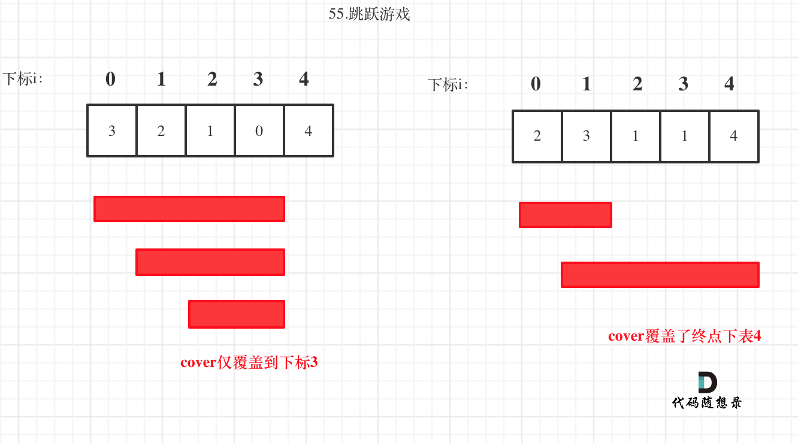
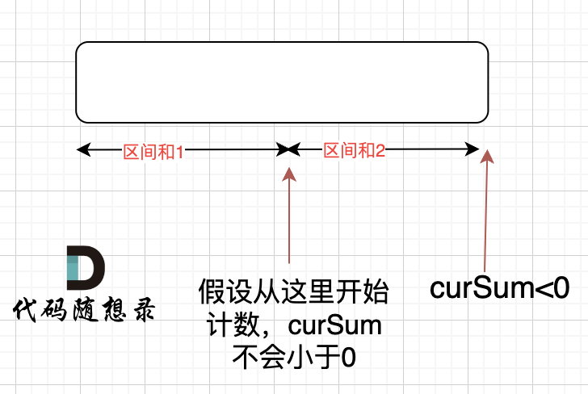

## 贪心算法

### 445 分发饼干

#### 方法一：贪心

- 因为饥饿度最小的孩子最容易吃饱，所以我们先考虑这个孩子。
- 为了尽量使得剩下的饼干可以满足饥饿度更大的孩子，所以我们应该把大于等于这个孩子饥饿度的、且大小最小的饼干给这个孩子。
- 满足了这个孩子之后，我们采取同样的策略，考虑剩下孩子里饥饿度最小的孩子，直到没有满足条件的饼干存在。

总结：给剩余孩子里最小饥饿度的孩子分配最小的能饱腹的饼干。

```cpp
#include <iostream>
using namespace std;
#include <vector>
#include <algorithm>

vector<int> createVector() {
	vector<int> ivec;
	int num;
	do
	{
		cin >> num;
		ivec.push_back(num);
	} while (getchar() != '\n');
	return ivec;
}

void printVector(vector<int>& v) {
	for (vector<int>::iterator it = v.begin(); it != v.end(); it++) {
		cout << *it << " ";
	}
	cout << endl;
}

class Solution {
public:
	int findContentChildren(vector<int>& g, vector<int>& s) {
		sort(g.begin(), g.end()); //排序方便之后的大小比较
		sort(s.begin(), s.end());
		int count = 0;
		int child = 0, cookie = 0;
		while (child < g.size() && cookie < s.size()) {
			if (g[child] <= s[cookie]) {
				++child;
				++count;
			}
			++cookie;
		}
		return count;
	}
};


int main()
{
	vector<int> g, s;
	g = createVector();
	s = createVector();

	Solution ss;
	cout << ss.findContentChildren(g, s) << endl;;

	system("pause");
	return 0;
}
```

### 135  分发糖果

#### 方法一：贪心策略

- 把所有孩子的糖果数初始化为1；
- 先从左往右遍历一遍，如果右边孩子的评分比左边的高，则右边孩子的糖果数更新为左边孩子的糖果数加 1；
- 再从右往左遍历一遍，如果左边孩子的评分比右边的高，且左边孩子当前的糖果数不大于右边孩子的糖果数，则左边孩子的糖果数更新为右边孩子的糖果数加 1。

```cpp
//第一次自己按照思路写出来
#include <iostream>
using namespace std;
#include <vector>
#include <algorithm>
#include <numeric>

vector<int> createVector() {
	vector<int> ivec;
	int num;
	do
	{
		cin >> num;
		ivec.push_back(num);
	} while (getchar() != '\n');
	return ivec;
}

void printVector(vector<int>& v) {
	for (vector<int>::iterator it = v.begin(); it != v.end(); it++) {
		cout << *it << " ";
	}
	cout << endl;
}

class Solution {
public:
	int candy(vector<int>& ratings) {
		vector<int> candyNum;
		int len = ratings.size(); //获取孩子总数
		//将所有孩子的糖果数初始化为1
		for (int i = 0; i < len; ++i) {
			candyNum.push_back(1); 
		}
		//先从左往右遍历一遍，如果右边孩子的评分比左边的高，
		//则右边孩子的糖果数更新为左边孩子的糖果数加 1；
		for (int i = 1; i < len; ++i) {
			if (ratings[i] > ratings[i - 1]) {
				candyNum[i] = candyNum[i - 1] + 1;
			}
		}
		//再从右往左遍历一遍，如果左边孩子的评分比右边的高，
		//且左边孩子当前的糖果数不大于右边孩子的糖果数，
		//则左边孩子的糖果数更新为右边孩子的糖果数加 1。
		for (int i = len - 1; i >= 1; --i) {
			if (ratings[i - 1] > ratings[i] && candyNum[i-1]<=candyNum[i]) {
				candyNum[i - 1] = candyNum[i] + 1;
			}
		}
		//计算candyNum容器内糖果的总数，accumulate函数在<numeric>中
		int total = accumulate(candyNum.begin(), candyNum.end(), 0);
		return total;
	}
};

int main()
{
	vector<int> ratings;
	ratings = createVector();

	Solution ss;
	cout << ss.candy(ratings) << endl;

	system("pause");
	return 0;
}
```

leetcode101-高畅

```cpp
int candy(vector<int>& ratings) {
	int size = ratings.size();
	if (size < 2) {
		return size;
	}
	vector<int> num(size, 1); //vector容器构造函数，将size个1拷贝给本身
	for (int i = 1; i < size; ++i) {
		if (ratings[i] > ratings[i - 1]) {
			num[i] = num[i - 1] + 1;
		}
	}
	for (int i = size - 1; i > 0; --i) {
		if (ratings[i] < ratings[i - 1]) {
			num[i - 1] = max(num[i - 1], num[i] + 1);
		}
	}
	// std::accumulate可以很方便地求和
	return accumulate(num.begin(), num.end(), 0);
}
```


### 860 柠檬水找零

#### 方法1：贪心算法

```cpp
class Solution {
public:
	bool lemonadeChange(vector<int>& bills) {
		int five = 0, ten = 0, twenty = 0;
		for (int bill : bills) {
            // 1.账单是5，直接收下。
			if (bill == 5) {
				five++;
			}
            // 2.账单是10，消耗一个5，增加一个10
			if (bill == 10) {
				if (five <= 0) return false;
				five--;
				ten++;
			}
			if (bill == 20) {
                // 优先消耗10美元，因为5美元的找零用处更大，能多留着就多留着
				if (five > 0 && ten > 0) {
					five--;
					ten--;
					twenty++;
				}
				else if (five >= 3) {
					five -= 3;
					twenty++;
				}
				else {
					return false;
				}
			}
		}
		return true;
	}
};

```


### 406 根据身高重建队列

#### 方法1：贪心算法

两个维度的话先确定一个维度，再确定另一个维度


按照身高排序之后，优先按身高高的people的k来插入，后序插入节点也不会影响前面已经插入的节点，最终按照k的规则完成了队列。

所以在按照身高从大到小排序后：

- **局部最优：优先按身高高的people的k来插入。插入操作过后的people满足队列属性**
- **全局最优：最后都做完插入操作，整个队列满足题目队列属性**

```cpp
class Solution {
public:
    // 身高从大到小排，后一位从小到大排
	static bool cmp(const vector<int>& a, const vector<int>& b) {
		if (a[0] == b[0]) return a[1] < b[1];
		else return a[0] > b[0];
	}

	vector<vector<int>> reconstructQueue(vector<vector<int>>& people) {
		sort(people.begin(), people.end(), cmp);
		vector<vector<int>> que;
		for (int i = 0; i < people.size(); i++) {
			int position = people[i][1];
			que.insert(que.begin() + position, people[i]);
		}
		return que;
	}
};

```


### 452 用最少数量的箭引爆气球

#### 方法1：贪心算法


**为了让气球尽可能的重叠，需要对数组进行排序**。**如果气球重叠了，重叠气球中右边边界的最小值 之前的区间一定需要一个弓箭**。

```cpp
class Solution {
private:
    static bool cmp(const vector<int>& a, const vector<int>& b) {
        return a[0] < b[0];
    }
public:
    int findMinArrowShots(vector<vector<int>>& points) {
        if (points.size() == 0) return 0;
        sort(points.begin(), points.end(), cmp);

        int result = 1; // points 不为空至少需要一支箭
        for (int i = 1; i < points.size(); i++) {
            if (points[i][0] > points[i - 1][1]) {  // 气球i和气球i-1不挨着，注意这里不是>=
                result++; // 需要一支箭
            }
            else {  // 气球i和气球i-1挨着
                points[i][1] = min(points[i - 1][1], points[i][1]); // 更新重叠气球最小右边界
            }
        }
        return result;
    }
};
```


### 435 无重叠区间

#### 方法1：贪心算法


```cpp
class Solution {
public:
    // 按照右边界从小到大排序
	static bool cmp(const vector<int>& a, const vector<int>& b) {
		return a[1] < b[1];
	}

	int eraseOverlapIntervals(vector<vector<int>>& intervals) {
		if (intervals.size() == 0) return 0;
		sort(intervals.begin(), intervals.end(), cmp);
		int count = 1; // 记录非重叠区间的个数
		int end = intervals[0][1]; // 记录区间分割点
		for (int i = 1; i < intervals.size(); i++) {
			if (end <= intervals[i][0]) {
				end = intervals[i][1];
				count++;
			}
		}
		return intervals.size() - count; // 相减得到需要移除的重叠区间个数
	}
};
```

#### 方法一：贪心策略

		求最少的移除区间个数，等价于尽量多保留不重叠的区间。在选择要保留区间时，区间的结尾十分重要：选择的区间结尾越小，余留给其它区间的空间就越大，就越能保留更多的区间。
因此，我们采取的贪心策略为，**优先保留结尾小且不相交的区间**。

- 先把区间按照结尾的大小进行增序排序
- 每次选择结尾最小且和前一个选择的区间不重叠的区间

```cpp
#include <iostream>
using namespace std;
#include <vector>
#include <algorithm>
#include <numeric>

//vector容器嵌套容器的打印
void printVectorInVector(vector<vector<int>>& v) {
	//通过大容器，把所有数据遍历一遍
	for (vector<vector<int>>::iterator it = v.begin(); it != v.end(); it++) {
		//(*it) ---- 容器 vector<int>
		for (vector<int>::iterator vit = (*it).begin(); vit != (*it).end(); vit++) {
			cout << *vit << " ";
		}
		cout << endl;
	}
	//每一个小容器输出，输出完了做一个换行的操作
}

//按照谓词（函数对象，仿函数）的方式传入sort进行自定义排序
class myCompare {
public:
	//先把区间按照结尾的大小进行增序排序
	bool operator()(vector<int>& a, vector<int>& b) {
		return a[1] < b[1]; //[1]取出区间的结尾
	}
};

class Solution {
public:
	int eraseOverlapIntervals(vector<vector<int>>& intervals) {
		if (intervals.empty()) {
			return 0;
		}
		int n = intervals.size();
		//sort传入谓词myCompare()，把区间按照结尾的大小进行增序排序
		sort(intervals.begin(), intervals.end(), myCompare());
		//prev初始化为第0个区间的结尾
		int removed = 0, prev = intervals[0][1];
		for (int i = 1; i < n; ++i) {
			//如果下一个区间的开头大于上一个区间的结尾，说明有重叠，++removed
			if (intervals[i][0] < prev) {
				++removed;
			}
			else {
				prev = intervals[i][1];
			}
		}
		return removed;
	}
};

int main()
{
	vector<vector<int>> intervals = { {1, 2},{2, 3},{3, 4},{1, 3} };
	printVectorInVector(intervals);

	Solution ss;
	cout << ss.eraseOverlapIntervals(intervals) << endl;

	system("pause");
	return 0;
}


```


leetcode101-高畅

```cpp
class Solution {
public:
	int eraseOverlapIntervals(vector<vector<int>>& intervals) {
		if (intervals.empty()) {
			return 0;
		}
		int n = intervals.size();
		sort(intervals.begin(), intervals.end(), [](vector<int>& a, vector<int>& b)
			{	//使用C++的lambda，结合std::sort()函数进行自定义排序
				return a[1] < b[1];
			});
		int removed = 0, prev = intervals[0][1];
		for (int i = 1; i < n; ++i) {
			if (intervals[i][0] < prev) {
				++removed;
			}
			else {
				prev = intervals[i][1];
			}
		}
		return removed;
	}
};
```


代码随想录

```cpp
// 时间复杂度：O(nlogn)
// 空间复杂度：O(1)
class Solution {
public:
    int findContentChildren(vector<int>& g, vector<int>& s) {
        sort(g.begin(), g.end());
        sort(s.begin(), s.end());
        int index = s.size() - 1; // 饼干数组的下标
        int result = 0;
        for (int i = g.size() - 1; i >= 0; i--) { // 遍历胃口 
            if (index >= 0 && s[index] >= g[i]) { // 遍历饼干 
                result++;
                index--;
            }
        }
        return result;
    }
};
```


### 376 摆动序列

#### 方法1：贪心算法

```cpp
class Solution {
public:
	int wiggleMaxLength(vector<int>& nums) {
		if (nums.size() <= 1) return nums.size();
		int curDiff = 0;
		int preDiff = 0;
		int result=1;
		for (int i = 0; i < nums.size() - 1; i++) {
			curDiff = nums[i + 1] - nums[i];
			if ((preDiff <= 0 && curDiff > 0) || (preDiff >= 0 && curDiff < 0)) {
				result++;
				preDiff = curDiff;
			}
		}
		return result;
	}
};
```


### 53 最大子数组和

#### 方法1：贪心算法

```cpp
class Solution {
public:
    int maxSubArray(vector<int>& nums) {
        int result = INT32_MIN;
        int count = 0;
        for (int i = 0; i < nums.size(); i++) {
            count += nums[i];
            if (count > result) { // 取区间累计的最大值（相当于不断确定最大子序终止位置）
                result = count;
            }
            if (count <= 0) count = 0; // 相当于重置最大子序起始位置，因为遇到负数一定是拉低总和
        }
        return result;
    }
};
```


### 121 买卖股票的最佳时机

#### 方法1：贪心

现在已经过不了，会超出时间限制

```cpp
class Solution {
public:
    int maxProfit(vector<int>& prices) {
        int result = 0;
        for (int i = 0; i < prices.size(); i++) {
            for (int j = i + 1; j < prices.size(); j++){
                result = max(result, prices[j] - prices[i]);
            }
        }
        return result;
    }
};
```


### 122 买卖股票的最佳时机II

#### 方法1：贪心算法


从图中可以发现，其实我们需要收集每天的正利润就可以，**收集正利润的区间，就是股票买卖的区间，而我们只需要关注最终利润，不需要记录区间**。

**局部最优：收集每天的正利润，全局最优：求得最大利润**。

```cpp
class Solution {
public:
	int maxProfit(vector<int>& prices) {
		int result = 0;
		for (int i = 1; i < prices.size(); i++) {
			if (prices[i] - prices[i - 1]>0) {
				result += prices[i] - prices[i - 1];
			}
		}
		return result;
	}
};
```

### 55 跳跃游戏

#### 方法1：贪心算法

**跳跃覆盖范围究竟可不可以覆盖到终点！**

**贪心算法局部最优解：每次取最大跳跃步数（取最大覆盖范围），整体最优解：最后得到整体最大覆盖范围，看是否能到终点**。



```cpp
class Solution {
public:
	bool canJump(vector<int>& nums) {
		int cover = 0;
		if (nums.size() == 1) return true;
        // i每次移动只能在cover的范围内移动，每移动一个元素，cover得到该元素数值（新的覆盖范围）的补充，让i继续移动下去。
		for (int i = 0; i <= cover; i++) {
            // 而cover每次只取 max(该元素数值补充后的范围, cover本身范围)。
			cover = max(i + nums[i], cover);
            // 如果cover大于等于了终点下标，直接return true就可以了。
			if (cover >= nums.size() - 1) {   
				return true;
			}
		}
		return false;
	}
};
```

#### 第2次：

```cpp
class Solution {
public:
    bool canJump(vector<int>& nums) {
        int n = nums.size();
        int rightmost = 0;
        for(int i = 0; i < n; i++){
            if(i <= rightmost){
                // 每次都找最大的覆盖范围
                rightmost = max(rightmost, i + nums[i]);
                // 一旦覆盖范围到了终点，就是true
                if(rightmost >= n - 1){
                    return true;
                }
            }
        }
        return false;
    }
};
```


### 56 合并区间

#### 方法1：贪心算法


按照左边界从小到大排序之后，如果 `intervals[i][0] <= intervals[i - 1][1]` 即intervals[i]的左边界 <= intervals[i - 1]的右边界，则一定有重叠。（本题相邻区间也算重贴，所以是<=）

接着用合并区间后左边界和右边界，作为一个新的区间，加入到result数组里就可以了。如果没有合并就把原区间加入到result数组。

```cpp
class Solution {
public:
    // 按照左边界从小到大排列
	static bool cmp(const vector<int>& a, const vector<int>& b) {
		return a[0] < b[0];
	}

	vector<vector<int>> merge(vector<vector<int>>& intervals) {
		vector<vector<int>> result;
		if (intervals.size() == 0) return result;
		sort(intervals.begin(), intervals.end(), cmp);
        // 第一个区间就可以放进结果集里，后面如果重叠，在result上直接合并
		result.push_back(intervals[0]);
		for (int i = 1; i < intervals.size(); i++) {
			if (result.back()[1] >= intervals[i][0]) { // 发现重叠区间
                // 合并区间，只更新右边界就好，因为result.back()的左边界一定是最小值，因为我们按照左边界排序的
				result.back()[1] = max(result.back()[1], intervals[i][1]);
			}
			else {
				result.push_back(intervals[i]); // 区间不重叠直接放入
			}
		}
		return result;
	}
};
```

#### 第2次

如果我们按照区间的左端点排序，那么在排完序的列表中，可以合并的区间一定是连续的。如下图所示，标记为蓝色、黄色和绿色的区间分别可以合并成一个大区间，它们在排完序的列表中是连续的：


我们用数组 `merged` 存储最终的答案。

首先，我们将列表中的区间按照左端点升序排序。然后我们将第一个区间加入 merged 数组中，并按顺序依次考虑之后的每个区间：

如果当前区间的左端点在数组 merged 中最后一个区间的右端点之后，那么它们不会重合，我们可以直接将这个区间加入数组 merged 的末尾；

否则，它们重合，我们需要用当前区间的右端点更新数组 merged 中最后一个区间的右端点，将其置为二者的较大值。

```cpp
class Solution {
public:
    vector<vector<int>> merge(vector<vector<int>>& intervals) {
        if(intervals.size()==0){
            return {};
        }

        sort(intervals.begin(), intervals.end());
        vector<vector<int>> merged;
        for(int i=0;i<intervals.size();i++){
            int l=intervals[i][0], r=intervals[i][1];
            if(!merged.size() || merged.back()[1]<l){
                merged.push_back({l, r});
            }
            else{
                merged.back()[1]=max(merged.back()[1], r);
            }
        }
        return merged;
    }
};
```

#### 第3次：

写的更简洁清晰，思路和第2次一样

```cpp
class Solution {
public:
    vector<vector<int>> merge(vector<vector<int>>& intervals) {
        if(intervals.size() == 0) return {};
        sort(intervals.begin(), intervals.end());
        vector<vector<int>> res;
        res.push_back(intervals[0]);
        for(int i = 1; i < intervals.size(); i++){
            if(intervals[i][0] <= res.back()[1]){
                res.back()[1] = max(res.back()[1], intervals[i][1]);
            }else{
                res.push_back(intervals[i]);
            }
        }
        return res;
    }
};
```


### 738 单调递增的数字

#### 方法1：贪心算法

从前向后遍历的话，遇到strNum[i - 1] > strNum[i]的情况，让strNum[i - 1]减一，但此时如果strNum[i - 1]减一了，可能又小于strNum[i - 2]。

这么说有点抽象，举个例子，数字：332，从前向后遍历的话，那么就把变成了329，此时2又小于了第一位的3了，真正的结果应该是299。

那么从后向前遍历，就可以重复利用上次比较得出的结果了，从后向前遍历332的数值变化为：332 -> 329 -> 299

确定了遍历顺序之后，那么此时局部最优就可以推出全局，找不出反例，试试贪心。

```cpp
class Solution {
public:
	int monotoneIncreasingDigits(int n) {
		string strNum = to_string(n);
        // flag用来标记赋值9从哪里开始
		int flag = strNum.size(); // 防止第二个for循环在flag没有被赋值的情况下执行
		for (int i = strNum.size() - 1; i > 0; i--) {
			if (strNum[i - 1] > strNum[i]) {
				flag = i;
				strNum[i - 1]--;
			}
		}
		for (int i = flag; i < strNum.size(); i++) {
			strNum[i] = '9';
		}
		return stoi(strNum);
	}
};
```


### 986 监控二叉树

#### 方法1：贪心算法

如果把摄像头放在叶子节点上，就浪费的一层的覆盖。所以把摄像头放在叶子节点的父节点位置，才能充分利用摄像头的覆盖面积。头结点放不放摄像头也就省下一个摄像头， 叶子节点放不放摄像头省下了的摄像头数量是指数阶别的。

**所以我们要从下往上看，局部最优：让叶子节点的父节点安摄像头，所用摄像头最少，整体最优：全部摄像头数量所用最少！**

大体思路就是从低到上，先给叶子节点父节点放个摄像头，然后隔两个节点放一个摄像头，直至到二叉树头结点。

##### 如何隔两个节点放一个摄像头

此时需要状态转移的公式，大家不要和动态的状态转移公式混到一起，本题状态转移没有择优的过程，就是单纯的状态转移！

来看看这个状态应该如何转移，先来看看每个节点可能有几种状态：

有如下三种：

- 该节点无覆盖
- 本节点有摄像头
- 本节点有覆盖

我们分别有三个数字来表示：

- 0：该节点无覆盖
- 1：本节点有摄像头
- 2：本节点有覆盖


### 45 跳跃游戏II

#### 方法1：贪心算法

**要从覆盖范围出发，不管怎么跳，覆盖范围内一定是可以跳到的，以最小的步数增加覆盖范围，覆盖范围一旦覆盖了终点，得到的就是最小步数！**

**这里需要统计两个覆盖范围，当前这一步的最大覆盖和下一步最大覆盖**。

如果移动下标达到了当前这一步的最大覆盖最远距离了，还没有到终点的话，那么就必须再走一步来增加覆盖范围，直到覆盖范围覆盖了终点。


**图中覆盖范围的意义在于，只要红色的区域，最多两步一定可以到！（不用管具体怎么跳，反正一定可以跳到）**

```cpp
// 版本二
class Solution {
public:
    int jump(vector<int>& nums) {
        int curDistance = 0;    // 当前覆盖的最远距离下标
        int ans = 0;            // 记录走的最大步数
        int nextDistance = 0;   // 下一步覆盖的最远距离下标
        for (int i = 0; i < nums.size() - 1; i++) { // 注意这里是小于nums.size() - 1，这是关键所在
            nextDistance = max(nums[i] + i, nextDistance); // 更新下一步覆盖的最远距离下标
            // 移动下标只要遇到当前覆盖最远距离的下标，直接步数加一，不考虑是不是终点的情况。
            // 想要达到这样的效果，只要让移动下标，最大只能移动到nums.size - 2的地方就可以了。
            if (i == curDistance) {                 // 遇到当前覆盖的最远距离下标
                curDistance = nextDistance;         // 更新当前覆盖的最远距离下标
                ans++;
            }
        }
        return ans;
    }
};
```


### 1005 K次取反后最大化的数组和

#### 方法1：贪心算法

```cpp
class Solution {
public:
	static bool cmp(int a, int b) {
		return abs(a) > abs(b);
	}

	int largestSumAfterKNegations(vector<int>& nums, int k) {
		sort(nums.begin(), nums.end(), cmp); // 第一步：将数组按照绝对值大小从大到小排序，注意要按照绝对值的大小
		for (int i = 0; i < nums.size(); i++) { // 第二步：从前向后遍历，遇到负数将其变为正数，同时K--；把数值最大的负数转为整数，可以让和最大化
			if (nums[i] < 0 && k>0) {
				nums[i] *= -1;
				k--;
			}
		}

		if (k % 2 == 1) nums[nums.size() - 1] *= -1; // 第三步：如果K还大于0，那么反复转变数值最小的元素，将K用完
		int result = 0;
		for (int num : nums) result += num; // 第四步：求和
		return result;
	}
};
```


### 134 加油站

#### 方法1：贪心算法

**for循环适合模拟从头到尾的遍历，而while循环适合模拟环形遍历，要善于使用while！**




如果 curSum<0 说明 区间和1 + 区间和2 < 0， 那么 假设从上图中的位置开始计数curSum不会小于0的话，就是 区间和2>0。

区间和1 + 区间和2 < 0 同时 区间和2>0，只能说明区间和1 < 0， 那么就会从假设的箭头初就开始从新选择其实位置了。

**那么局部最优：当前累加rest[i]的和curSum一旦小于0，起始位置至少要是i+1，因为从i之前开始一定不行。全局最优：找到可以跑一圈的起始位置**。

```cpp
class Solution {
public:
	int canCompleteCircuit(vector<int>& gas, vector<int>& cost) {
		int curSum = 0;
		int totalSum = 0;
		int start = 0;
		for (int i = 0; i < gas.size(); i++) { 
			curSum += gas[i] - cost[i];
			totalSum += gas[i] - cost[i];
			if (curSum < 0) { // 当前累加rest[i]和 curSum一旦小于0
				start = i + 1; // 起始位置更新为i+1
				curSum = 0; // curSum从0开始
			}
		}
		if (totalSum < 0) return -1; // curSum从0开始
		return start;
	}
};
```


### 944 删列造序

```cpp
class Solution {
public:
    int minDeletionSize(vector<string>& strs) {
        int len1=strs[0].size();
        int len2 =strs.size();
        int res=0;
        for(int i=0;i<len1;i++){
            for(int j=0;j<len2-1;j++){
                // 当前列，一旦后一个数大于前一个数直接break
                if(strs[j][i]>strs[j+1][i]){
                    res++;
                    break;
                }
            }
        }
        return res;
    }
};
```


### 1046. 最后一块石头的重量

#### 方法1：优先队列

元素大的具有最大优先级，排在队列最前面

```cpp
class Solution {
public:
    int lastStoneWeight(vector<int>& stones) {
        if(stones.size()==1) return stones[0];
        priority_queue<int> que;
        for(auto s:stones){
            que.push(s);
        }
        while(que.size()>1){
            int s1=que.top();
            que.pop();
            int s2=que.top();
            que.pop();
            // s1>=s2 所以这里是不需要用abs函数的
            if(s1!=s2){
                que.push(s1-s2);
            }
        }
        return que.empty()?0:que.top();
    }
};
```


### 1049. 最后一块石头的重量 II


### 1217 玩筹码

```cpp
class Solution {
public:
    int minCostToMoveChips(vector<int>& position) {
        int odd=0;
        int even=0;
        for(auto elem:position){
            if(elem % 2==1){
                odd++;
            }
            else{
                even++;
            }
        }
        return min(odd, even);
    }
};
```


#### 1221. 分割平衡字符串

#### 方法1：

```cpp
class Solution {
public:
    int balancedStringSplit(string s) {
        int res=0;
        stack<int> st;
        for(auto a:s){
            if(st.empty() || a==st.top()){
                st.push(a);
            }
            else{
                st.pop();
            }
            if(st.empty()) res++;
        }
        return res;
    }
};
```


### 402. 移掉 K 位数字


```cpp
class Solution {
public:
    string removeKdigits(string num, int k) {
        vector<char> stk;
        for (auto& digit: num) {
            while (stk.size() > 0 && stk.back() > digit && k) {
                stk.pop_back();
                k -= 1;
            }
            stk.push_back(digit);
        }

        for (; k > 0; --k) {
            stk.pop_back();
        }

        string ans = "";
        bool isLeadingZero = true;
        for (auto& digit: stk) {
            if (isLeadingZero && digit == '0') {
                continue;
            }
            isLeadingZero = false;
            ans += digit;
        }
        return ans == "" ? "0" : ans;
    }
};

```


