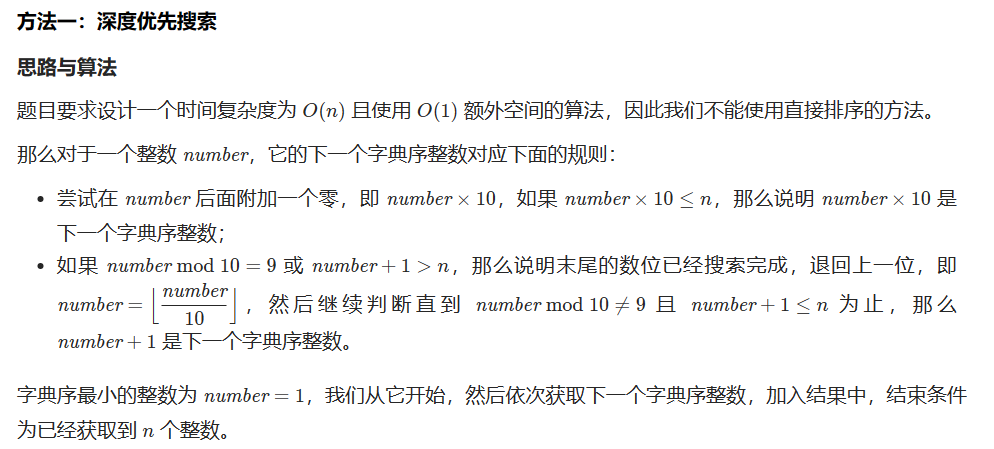

## 搜索

### 695 岛屿的最大面积

#### 方法一：深度优先搜索

创造一个数组 [-1, 0, 1, 0, -1]，每相邻两位为上下左右四个方向之一，(-1,0):left, (0,1):up, (1,0):right, (0,-1):down。

辅助函数内递归搜索时，判断是否越界，只有在合法的情况下才进行

```cpp
class Solution {
public:
	//(-1,0):left, (0,1):up, (1,0):right, (0,-1):down
	vector<int> direction{ -1,0,1,0,-1 };

	// 主函数
	int maxAreaOfIsland(vector<vector<int>>&grid) {
		if (grid.empty() || grid[0].empty()) return 0;
		int max_area = 0;
		for (int i = 0; i < grid.size(); ++i) {
			for (int j = 0; j < grid[0].size(); ++j) {
				//如果单元格为1，才进行广度优先搜索
				if (grid[i][j] == 1) {
					max_area = max(max_area, dfs(grid, i, j));
				}
			}
		}
		return max_area;
	}
	//辅函数
	int dfs(vector<vector<int>>& grid, int r, int c) {
		if (grid[r][c] == 0) return 0;
		grid[r][c] = 0;
		int x, y, area = 1;
		for (int i = 0; i < 4; ++i) {
			x = r + direction[i], y = c + direction[i + 1];
			//边界条件判定，合法了才进行下一步搜索
			if (x >= 0 && x < grid.size() && y >= 0 && y < grid[0].size()) {
				area += dfs(grid, x, y);
			}
		}
		return area;
	}
};
```


### 543 二叉树的直径

#### 方法1：深度优先搜索


```cpp
class Solution {
public:
    int ans;
    int depth(TreeNode* root) {
        if (root == nullptr) return 0;

        int left = depth(root->left);
        int right = depth(root->right);
        // 以该节点为起点的路径经过节点数的最大值为ans
        ans = max(ans, left + right + 1);
        // 以该节点为根的子树深度
        return max(left, right) + 1;

    }

    int diameterOfBinaryTree(TreeNode* root) {
        ans = 1;
        depth(root);
        return ans-1;
    }
};
```


```cpp
class Solution {
public:
    int ans;
    int depth(TreeNode* root){
        if(root==nullptr){
            return 0;
        }
        int left=depth(root->left);
        int right=depth(root->right);
        ans=max(ans, left+right);
        return max(left, right)+1;
    }

    int diameterOfBinaryTree(TreeNode* root) {
        ans=0;
        depth(root);
        return ans;
    }
};
```


### 200 岛屿数量

#### 方法1：DFS

最好的网格DFS：[岛屿类问题的通用解法、DFS 遍历框架 - 岛屿数量 - 力扣（LeetCode）](https://leetcode.cn/problems/number-of-islands/solution/dao-yu-lei-wen-ti-de-tong-yong-jie-fa-dfs-bian-li-/)

```cpp
class Solution {
public:
    // 0-海洋格子
    // 1-陆地格子（未遍历过）
    // 2-陆地格子（遍历过）
    int numIslands(vector<vector<char>>& grid) { 
        int res = 0;
        for (int i = 0; i < grid.size(); i++) {
            for (int j = 0; j < grid[0].size(); j++) {
                // 未遍历过的地方才遍历
                if (grid[i][j] == '1') {
                    dfs(grid, i, j);
                    res++;
                }
            }
        }
        return res;
    }

    void dfs(vector<vector<char>>& grid, int r, int c) {
        // 判断边界条件
        if (r < 0 || c < 0 || r >= grid.size() || c >= grid[0].size()) {
            return;
        }
		// 如果这个格子不是岛屿，直接返回
        if (grid[r][c] != '1') {
            return;
        }

        grid[r][c] = '2'; // 将格子标记为遍历过
        // 访问上、下、左、右四个相邻结点
        dfs(grid, r - 1, c);
        dfs(grid, r + 1, c);
        dfs(grid, r, c - 1);
        dfs(grid, r, c + 1);
    }
};
```


### 297. 二叉树的序列化与反序列化

#### 方法1：广度优先搜索

一层一层的遍历

```cpp
class Codec {
public:
    void helper1(TreeNode* root, string& str){
        if(root==nullptr){
            str+="None,";
        }
        else{
            str+=to_string(root->val)+",";
            helper1(root->left, str);
            helper1(root->right, str);
        }
    }

    // Encodes a tree to a single string.
    string serialize(TreeNode* root) {
        string ret;
        helper1(root, ret);
        return ret;
    }

    TreeNode* helper2(list<string>& dataArray){
        if(dataArray.front()=="None"){
            dataArray.erase(dataArray.begin());
            return nullptr;
        }

        TreeNode* root=new TreeNode(stoi(dataArray.front()));
        dataArray.erase(dataArray.begin());
        root->left=helper2(dataArray);
        root->right=helper2(dataArray);
        return root;
    }

    // Decodes your encoded data to tree.
    TreeNode* deserialize(string data) {
        list<string> dataArray;
        string str;
        for(auto& ch:data){
            if(ch==','){
                dataArray.push_back(str);
                str.clear();
            }
            else{
                str.push_back(ch);
            }
        }
        if(!str.empty()){
            dataArray.push_back(str);
            str.clear();
        }
        return helper2(dataArray);
    }
};

```


### 103. 二叉树的锯齿形层序遍历

#### 方法1：广度优先遍历

解决思路：

1. 首先，我们可以使用层序遍历的思想来遍历二叉树的每一层节点。
2. 在每一层遍历时，根据当前层数的奇偶性来决定节点值的存储顺序。
   - 如果当前层数是奇数层，则按照从左到右的顺序存储节点值。
   - 如果当前层数是偶数层，则按照从右到左的顺序存储节点值。
3. 最后，将每一层的节点值存储到结果数组中。

```cpp
class Solution {
public:
    vector<vector<int>> zigzagLevelOrder(TreeNode* root) {
        vector<vector<int>> result; // 存储结果的二维数组
        if (root == nullptr) {
            return result;
        }
        
        queue<TreeNode*> q;
        q.push(root);
        bool isOddLevel = true; // 标记当前层数是否为奇数层
        
        while (!q.empty()) {
            int levelSize = q.size();
            vector<int> levelValues(levelSize); // 存储当前层节点值的数组
            
            for (int i = 0; i < levelSize; i++) {
                TreeNode* node = q.front();
                q.pop();
                
                // 根据当前层数的奇偶性决定节点值的存储顺序
                int index = isOddLevel ? i : levelSize - 1 - i;
                levelValues[index] = node->val;
                
                // 将当前节点的左右子节点加入队列
                if (node->left) {
                    q.push(node->left);
                }
                if (node->right) {
                    q.push(node->right);
                }
            }
            
            result.push_back(levelValues); // 将当前层节点值存储到结果数组中
            isOddLevel = !isOddLevel; // 切换到下一层
        }
        
        return result;
    }
};

```


### 129. 求根节点到叶节点数字之和

#### 方法1：深度优先搜索

```cpp
class Solution {
public:
    int sumNumbers(TreeNode* root) {
        int sum = 0;
        
        // 使用深度优先搜索（DFS）遍历二叉树的所有路径
        dfs(root, 0, sum);
        
        return sum;
    }
    
private:
    void dfs(TreeNode* node, int pathSum, int& sum) {
        if (node == NULL) {
            return;
        }
        
        // 计算当前路径的数字和
        pathSum = pathSum * 10 + node->val;
        
        if (node->left == NULL && node->right == NULL) {
            // 当前节点是叶节点，将路径数字和加到总和中
            sum += pathSum;
            return;
        }
        
        // 递归遍历左子树和右子树
        dfs(node->left, pathSum, sum);
        dfs(node->right, pathSum, sum);
    }
```


### 386. 字典序排数



```cpp
class Solution {
public:
    vector<int> lexicalOrder(int n) {
        vector<int> ret(n);
        int number = 1;
        for (int i = 0; i < n; i++) {
            ret[i] = number;
            if (number * 10 <= n) {
                number *= 10;
            } else {
                while (number % 10 == 9 || number + 1 > n) {
                    number /= 10;
                }
                number++;
            }
        }
        return ret;
    }
};


```


### 301. 删除无效的括号

[【宫水三叶】将括号的「是否合法」转化为「数学判定」 - 删除无效的括号 - 力扣（LeetCode）](https://leetcode.cn/problems/remove-invalid-parentheses/solution/gong-shui-san-xie-jiang-gua-hao-de-shi-f-asu8/)

```cpp
class Solution {
public:
    int maxscore;
    int length;
    int n;
    unordered_set<string> hash;

    void dfs(const string& s, int score, const string& buf, int l, int r, int index){
        if(l<0||r<0||score<0||score>maxscore) return;//如果出现删过头（即l或r<0）的情况，或分数出现负数或超过最大值，返回
        if(l==0&&r==0&&buf.length()==length) hash.insert(buf);
        if(index==n) return;

        char ch = s[index];
        if(ch=='('){
            dfs(s,score+1,buf+'(',l, r, index+1); //选择添加左括号，则+1分，继续遍历
            dfs(s,score,buf,l-1, r, index+1);//选择不添加左括号，相当于删除左括号，则分数不变，继续遍历
        }
        else if(ch==')'){
            dfs(s,score-1,buf+')',l, r, index+1);//选择添加右括号，则-1分，继续遍历
            dfs(s,score,buf,l, r-1, index+1);//选择不添加右括号，相当于删除右括号，则分数不变，继续遍历
        }
        else{
            dfs(s,score,buf+ch,l,r,index+1);//遇到其他字符，直接添加，继续遍历
        }
    }

    vector<string> removeInvalidParentheses(string s) {
        //假设“(”为+1分,")"为-1分，那么合规的字符串分数一定是0
        //分数一定不会是负数，因为那样意味着)比(多，不可能合规
        //分数一定不会超过maxscore，maxscore就是所有可匹配的(都在左边，一直+1，能达到的最大分数
        maxscore = 0;
        n = s.size();
        int left=0;
        int right=0;
        int l=0,r=0;
        length=0;
        for(auto& ch:s){
            if(ch=='(') {//统计左括号数量
                l++; //需要删除的左括号数量
                left++;
            }
            else if(ch==')'){//统计右括号数量
                if(l!=0) l--; //遇到可匹配的右括号
                else r++;//需要删除的右括号数量
                right++;
            }
        }
        length = n-l-r;//排除需要删除的左括号和右括号后，字符串应该有的长度
        maxscore = left<right?left:right;//最大分数为可匹配的左括号或右括号的数量，故为括号数量较少的那一边
        dfs(s,0,"",l,r,0);
        return {hash.begin(),hash.end()};
    }
};
```


### 207 课程表

[207. 课程表 - 力扣（LeetCode）](https://leetcode.cn/problems/course-schedule/solutions/18806/course-schedule-tuo-bu-pai-xu-bfsdfsliang-chong-fa/)

```cpp
class Solution {
public:
    bool canFinish(int numCourses, vector<vector<int>>& prerequisites) {
        // 创建一个数组来记录每门课程的入度（有多少先修课程）
        vector<int> indegrees(numCourses, 0);
        
        // 创建一个邻接表来表示课程之间的依赖关系
        vector<vector<int>> adjacency(numCourses);
        
        // 创建一个队列来存储入度为0的课程
        queue<int> q;
        
        // 遍历先修课程数组，计算每门课程的入度和构建邻接表
        for (const auto& cp : prerequisites) {
            int course = cp[0]; // 当前的课程
            int prerequisite = cp[1]; // 先修课程
            indegrees[course]++; // 当前课程的入度加1
            adjacency[prerequisite].push_back(course); // 将当前课程添加到先修课程的邻接表中
        }
        
        // 找到入度为0的课程，将其加入队列中
        for (int i = 0; i < numCourses; i++) {
            if (indegrees[i] == 0) {
                q.push(i);
            }
        }
        
        // 进行广度优先搜索(BFS)，拓扑排序
        while (!q.empty()) {
            int pre = q.front(); // 当前入度为0的课程
            q.pop();
            numCourses--; // 完成了一门课程
            
            // 遍历当前课程的所有后继课程
            for (int cur : adjacency[pre]) {
                if (--indegrees[cur] == 0) { // 更新后继课程的入度，并将入度为0的课程加入队列中
                    q.push(cur);
                }
            }
        }
        
        // 如果完成了所有课程，返回true；否则，返回false
        return numCourses == 0;
    }
};

```

