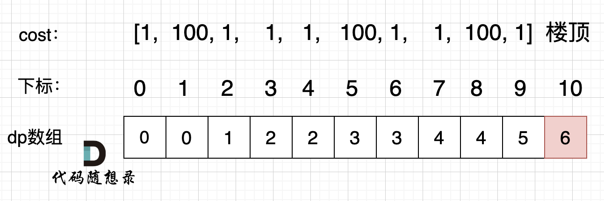
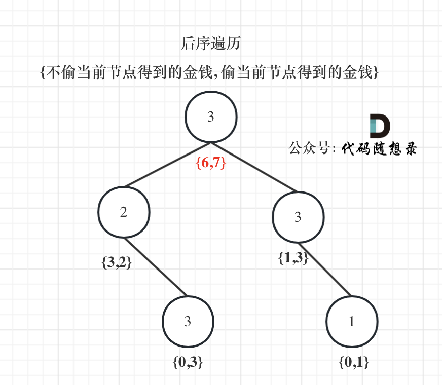

## 动态规划

### 70 爬楼梯

#### 方法一：动态规划

斐波那契数列

状态转移方程：dp[i]=dp[i-1]+dp[i-2]

1. 确定dp数组（dp table）以及下标的含义：
   dp[i]： 爬到第i层楼梯，有dp[i]种方法

2. 确定递推公式：

   首先是dp[i - 1]，上i-1层楼梯，有dp[i - 1]种方法，那么再一步跳一个台阶不就是dp[i]了么。

   还有就是dp[i - 2]，上i-2层楼梯，有dp[i - 2]种方法，那么再一步跳两个台阶不就是dp[i]了么。

   那么dp[i]就是 dp[i - 1]与dp[i - 2]之和！

   所以dp[i] = dp[i - 1] + dp[i - 2] 。

3. dp数组如何初始化：
   dp[1] = 1，dp[2] = 2，然后从i = 3开始递推

4. 确定遍历顺序：
   从递推公式dp[i] = dp[i - 1] + dp[i - 2];中可以看出，遍历顺序一定是从前向后遍历的

5. 举例推导dp数组：
   

```cpp
class Solution {
public:
	int climbStairs(int n) {
		if (n <= 2) {
			return n;
		}
		int first = 1, two = 2; //定义两个子问题的解
		int cur;
		for (int i = 3; i <= n; ++i) {
			cur = first + two; //当前问题的解等于两个子问题的解之和
			first = two;
			two = cur;
		}
		return cur;
	}
};
```


#### 方法1：动态规划

状态压缩节省内存

```cpp
class Solution {
public:
    

	int climbStairs(int n) {
		if(n==1 || n==2){
            return n;
        }
        int a=1, b=2;
        for(int i=3;i<=n;i++){
            int tmp=b;
            b=a+b;
            a=tmp;
        }
        return b;
	}
};
```


#### 方法2：完全背包

```
1.确定dp数组以及下标的含义
dp[i]：爬到有i个台阶的楼顶，有dp[i]种方法。

2.确定递推公式
求装满背包有几种方法，递推公式一般都是dp[i] += dp[i - nums[j]];
dp[i]有几种来源，dp[i - 1]，dp[i - 2]，dp[i - 3] 等等，即：dp[i - j]
递推公式为：dp[i] += dp[i - j]

3.dp数组如何初始化
递归公式是 dp[i] += dp[i - j]，那么dp[0] 一定为1，dp[0]是递归中一切数值的基础所在，如果dp[0]是0的话，其他数值都是0了。
下标非0的dp[i]初始化为0，因为dp[i]是靠dp[i-j]累计上来的，dp[i]本身为0这样才不会影响结果

4.确定遍历顺序
这是背包里求排列问题，即：1、2 步 和 2、1 步都是上三个台阶，但是这两种方法不一样！
需将target放在外循环，将nums放在内循环。
每一步可以走多次，这是完全背包，内循环需要从前向后遍历。


```

```cpp
class Solution {
public:
	int climbStairs(int n) {
		vector<int> dp(n + 1, 0);
		dp[0] = 1;
       	// 背包容量不会为0
		for (int i = 1; i <= n; i++) {
            // 不会走0阶台阶
			for (int j = 1; j <= 2; j++) {
				if (i - j >= 0) dp[i] += dp[i - j];
			}
		}
		return dp[n];
	}
};
```


### 322 零钱兑换

#### 方法1：完全背包

```
1.确定dp数组以及下标的含义
dp[j]：凑足总额为j所需钱币的最少个数为dp[j]

2.确定递推公式
凑足总额为j - coins[i]的最少个数为dp[j - coins[i]]，那么只需要加上一个钱币coins[i]即dp[j - coins[i]] + 1就是dp[j]（考虑coins[i]）
所以dp[j] 要取所有 dp[j - coins[i]] + 1 中最小的。
递推公式：dp[j] = min(dp[j - coins[i]] + 1, dp[j]);

3.p数组如何初始化
首先凑足总金额为0所需钱币的个数一定是0，那么dp[0] = 0;
考虑到递推公式的特性，dp[j]必须初始化为一个最大的数，否则就会在min(dp[j - coins[i]] + 1, dp[j])比较的过程中被初始值覆盖。
所以下标非0的元素都是应该是最大值。

4.确定遍历顺序
本题求钱币最小个数，那么钱币有顺序和没有顺序都可以，都不影响钱币的最小个数。
本题并不强调集合是组合还是排列。
如果求组合数就是外层for循环遍历物品，内层for遍历背包。
如果求排列数就是外层for遍历背包，内层for循环遍历物品。

本题钱币数量可以无限使用，那么是完全背包。所以遍历的内循环是正序
综上所述，遍历顺序为：coins（物品）放在外循环，target（背包）在内循环。且内循环正序。
```

```cpp
class Solution {
public:
    int coinChange(vector<int>& coins, int amount) {
        vector<int> dp(amount + 1, INT_MAX);
        dp[0] = 0;
        for (int i = 0; i < coins.size(); i++) { // 遍历物品
            for (int j = coins[i]; j <= amount; j++) { // 遍历背包
                // j在双层for循环里表示的是背包，所以是j-coins[i]
                if (dp[j - coins[i]] != INT_MAX) { // 如果dp[j - coins[i]]是初始值则跳过
                    dp[j] = min(dp[j - coins[i]] + 1, dp[j]);
                }
            }
        }
        if (dp[amount] == INT_MAX) return -1;
        return dp[amount];
    }
};
```

#### 第2次

这是一个使用动态规划解决凑零钱问题的代码。下面对代码进行详细解释：

首先，我们创建了一个大小为`amount+1`的数组`dp`，并将所有元素初始化为`amount+1`。这个`dp`数组用来记录凑成各个金额所需的最少硬币个数。

接下来，我们设置初始条件`dp[0] = 0`，表示凑成金额0所需的硬币个数为0。

然后，我们使用两层循环来进行动态规划求解。外层循环从1到目标金额`amount`，内层循环遍历硬币数组`coins`中的每个硬币。

在内层循环中，我们检查硬币的面额是否小于等于当前的金额`i`。如果是，则说明可以使用该硬币进行组合。我们更新`dp[i]`，将其更新为`dp[i-coin] + 1`和当前`dp[i]`的较小值。

最后，在完成动态规划的计算后，我们检查`dp[amount]`是否仍然为`amount + 1`。如果是，说明无法凑成目标金额，返回-1。否则，返回`dp[amount]`即可得到结果，即凑成目标金额所需的最少硬币个数。

通过使用动态规划，我们避免了重复计算，并且以最优子结构的方式求解了问题，得到了最少硬币个数的结果。这种解法的时间复杂度为O(amount * n)，其中n是硬币数组的大小。

```cpp
class Solution {
public:
    int coinChange(vector<int>& coins, int amount) {
        // 创建一个大小为amount+1的数组，并将所有元素初始化为amount+1
        vector<int> dp(amount + 1, amount + 1);
        
        // 设置初始条件
        dp[0] = 0;
        
        // 动态规划求解最少硬币个数
        for (int i = 1; i <= amount; i++) {
            for (int coin : coins) {
                if (coin <= i) {
                    dp[i] = min(dp[i], dp[i - coin] + 1);
                }
            }
        }
        
        // 如果dp[amount]仍然为amount + 1，说明无法凑成总金额，返回-1
        if (dp[amount] == amount + 1) {
            return -1;
        }
        
        // 返回最少硬币个数
        return dp[amount];
    }
};
```


### 279 完全平方数

#### 方法1：完全背包

```
完全平方数就是物品（可以无限件使用），凑个正整数n就是背包，问凑满这个背包最少有多少物品？

1.确定dp数组（dp table）以及下标的含义
dp[j]：和为j的完全平方数的最少数量为dp[j]

2.确定递推公式
dp[j] 可以由dp[j - i * i]推出， dp[j - i * i] + 1 便可以凑成dp[j]。
此时我们要选择最小的dp[j]，所以递推公式：dp[j] = min(dp[j - i * i] + 1, dp[j]);

3.dp数组如何初始化
dp[0]表示 和为0的完全平方数的最小数量，那么dp[0]一定是0。
从递归公式dp[j] = min(dp[j - i * i] + 1, dp[j]);中可以看出每次dp[j]都要选最小的，所以非0下标的dp[j]一定要初始为最大值，这样dp[j]在递推的时候才不会被初始值覆盖。

4.确定遍历顺序
我们知道这是完全背包，
如果求组合数就是外层for循环遍历物品，内层for遍历背包。
如果求排列数就是外层for遍历背包，内层for循环遍历物品。
本题是求最小数，无所谓。
```

```cpp
class Solution {
public:
    int numSquares(int n) {
        vector<int> dp(n + 1, INT_MAX);
        dp[0] = 0;
        for (int i = 1; i * i <= n; i++) { // 遍历物品
            for (int j = i * i; j <= n; j++) { // 遍历背包
                dp[j] = min(dp[j - i * i] + 1, dp[j]);
            }
        }
        return dp[n];
    }
};
```


### 139 单词拆分

#### 方法1：完全背包

```cpp
单词就是物品，字符串s就是背包，单词能否组成字符串s，就是问物品能不能把背包装满。
拆分时可以重复使用字典中的单词，说明就是一个完全背包！

1.确定dp数组以及下标的含义
dp[i] : 字符串长度为i的话，dp[i]为true，表示可以拆分为一个或多个在字典中出现的单词。

2.确定递推公式
如果确定dp[j] 是true，且 [j, i] 这个区间的子串出现在字典里，那么dp[i]一定是true。（j < i ）。
所以递推公式是 if([j, i] 这个区间的子串出现在字典里 && dp[j]是true) 那么 dp[i] = true。

3.dp数组如何初始化
从递推公式中可以看出，dp[i] 的状态依靠 dp[j]是否为true，那么dp[0]就是递推的根基，dp[0]一定要为true，否则递推下去后面都都是false了。
“给定一个非空字符串 s” 所以测试数据中不会出现i为0的情况，那么dp[0]初始为true完全就是为了推导公式。
下标非0的dp[i]初始化为false，只要没有被覆盖说明都是不可拆分为一个或多个在字典中出现的单词。

4.确定遍历顺序
完全背包问题，跟顺序有关
所以本题一定是先遍历背包，再遍历物品

```

```cpp
class Solution {
public:
    bool wordBreak(string s, vector<string>& wordDict) {
        unordered_set<string> wordSet(wordDict.begin(), wordDict.end());
        vector<bool> dp(s.size() + 1, false);
        dp[0] = true;
        for (int i = 1; i <= s.size(); i++) {   // 遍历背包
            for (int j = 0; j < i; j++) {       // 遍历物品
                string word = s.substr(j, i - j); //substr(起始位置，截取的个数)
                if (wordSet.find(word) != wordSet.end() && dp[j]) {
                    dp[i] = true;
                }
            }
        }
        return dp[s.size()];
    }
};
```

#### 方法2：动态规划

We use a boolean vector dp[]. dp[***i***] is set to true if a valid word (word sequence) ends there. The optimization is to look from current position ***i*** back and only substring and do dictionary look up in case the preceding position ***j*** with *dp[**j**] == true* is found.

我们使用一个布尔向量 dp[]。如果一个有效的单词（单词序列）在 dp[i] 结束，则 dp[i] 设置为 true。优化方法是从当前位置 i 开始往前查找，只查找子串，并在找到 dp[j] == true 的前一个位置 j 时进行字典查找。

```cpp
bool wordBreak(string s, unordered_set<string> &dict) {
    	unordered_set<string> dict(wordDict.begin(), wordDict.end());
        if(dict.size()==0) return false;
        
        vector<bool> dp(s.size()+1,false);
        dp[0]=true;
        
        for(int i=1;i<=s.size();i++)
        {
            for(int j=i-1;j>=0;j--)
            {
                if(dp[j])
                {
                    string word = s.substr(j,i-j);
                    if(dict.find(word)!= dict.end())
                    {
                        dp[i]=true;
                        break; //next i
                    }
                }
            }
        }
        
        return dp[s.size()];
    }
```


### 746 使用最小花费爬楼梯

#### 方法1：动态规划

1. 确定dp数组以及下标的含义

   **dp[i]的定义：到达第i台阶所花费的最少体力为dp[i]**。

2. 确定递推公式

   dp[i - 1] 跳到 dp[i] 需要花费 dp[i - 1] + cost[i - 1]。

   dp[i - 2] 跳到 dp[i] 需要花费 dp[i - 2] + cost[i - 2]。

   选最小的，所以dp[i] = min(dp[i - 1] + cost[i - 1], dp[i - 2] + cost[i - 2])

3. dp数组如何初始化

   可以选择从下标为 0 或下标为 1 的台阶开始爬楼梯

   初始化 dp[0] = 0，dp[1] = 0

4. 确定遍历顺序

   因为是模拟台阶，而且dp[i]由dp[i-1]dp[i-2]推出，所以是从前到后遍历cost数组就可以了。

5. 举例推导dp数组

   

```cpp
class Solution {
public:
	int minCostClimbingStairs(vector<int>& cost) {
		vector<int> dp(cost.size() + 1);
		dp[0] = 0;
		dp[1] = 0;
		for (int i = 2; i <= cost.size(); i++) {
			dp[i] = min(dp[i - 1] + cost[i - 1], dp[i - 2] + cost[i - 2]);
		}
		return dp[cost.size()];
	}
};
```

#### 第2次

因为最终目标是达到顶楼，所以dp初始化为size+1个

```cpp
class Solution {
public:
	int minCostClimbingStairs(vector<int>& cost) {
		int size=cost.size();
        vector<int> dp(size+1);
        dp[0]=0;
        dp[1]=0;
        for(int i=2;i<=size;i++){
            dp[i]=min(cost[i-1]+dp[i-1], cost[i-2]+dp[i-2]);
        }

        return dp[size];
	}
};
```


### 198 打家劫舍

#### 方法一：动态规划

		定义一个数组 dp，dp[i] 表示抢劫到第 i 个房子时，可以抢劫的最大数量。我们考虑 dp[i]，此时可以抢劫的最大数量有两种可能，一种是我们选择不抢劫这个房子，此时累计的金额即为dp[i-1]；另一种是我们选择抢劫这个房子，那么此前累计的最大金额只能是 dp[i-2]，因为我们不能够抢劫第 i-1 个房子，否则会触发警报机关。因此本题的状态转移方程为 dp[i] = max(dp[i-1], nums[i-1] + dp[i-2])。

```cpp
class Solution {
public:
	int rob(vector<int>& nums) {
		int len = nums.size();
		if (nums.empty()) {
			return 0;
		}
		if (len == 1) {
			return nums[0];
		}
		int first = 0, two = 0;
		int cur = 0;
		for (int i = 0; i < len; ++i) {
			cur = max(two, first + nums[i]);
			first = two;
			two = cur;
		}
		return cur;
	}
};
```


#### 方法2：动态规划 代码随想录

```
当前房屋偷与不偷取决于 前一个房屋和前两个房屋是否被偷了。
当前状态和前面状态会有一种依赖关系，那么这种依赖关系都是动规的递推公式。

1.确定dp数组（dp table）以及下标的含义
dp[i]：考虑下标i（包括i）以内的房屋，最多可以偷窃的金额为dp[i]。

2.确定递推公式
决定dp[i]的因素就是第i房间偷还是不偷。
如果偷第i房间，那么dp[i] = dp[i - 2] + nums[i] ，即：第i-1房一定是不考虑的，找出 下标i-2（包括i-2）以内的房屋，最多可以偷窃的金额为dp[i-2] 加上第i房间偷到的钱。
如果不偷第i房间，那么dp[i] = dp[i - 1]，即考 虑i-1房，（注意这里是考虑，并不是一定要偷i-1房，这是很多同学容易混淆的点）
然后dp[i]取最大值，即dp[i] = max(dp[i - 2] + nums[i], dp[i - 1]);

3.dp数组如何初始化
从递推公式dp[i] = max(dp[i - 2] + nums[i], dp[i - 1]);可以看出，递推公式的基础就是dp[0] 和 dp[1]
从dp[i]的定义上来讲，dp[0] 一定是 nums[0]，dp[1]就是nums[0]和nums[1]的最大值即：dp[1] = max(nums[0], nums[1]);

4.确定遍历顺序
dp[i] 是根据dp[i - 2] 和 dp[i - 1] 推导出来的，那么一定是从前到后遍历！
```

```cpp
class Solution {
public:
	int rob(vector<int>& nums) {
		if (nums.size() == 0) return 0;
		if (nums.size() == 1) return nums[0];
		vector<int> dp(nums.size());
		dp[0] = nums[0];
		dp[1] = max(nums[0], nums[1]);
		for (int i = 2; i < nums.size(); i++) {
			dp[i] = max(dp[i - 2] + nums[i], dp[i - 1]);
		}
		return dp[nums.size() - 1];
	}
};
```


#### 第2次

```cpp
class Solution {
public:
	int rob(vector<int>& nums) {
		int size=nums.size();
        if(size==0) return 0;
        if(size==1) return nums[0];
        vector<int> dp(size);
        dp[0]=nums[0];
        dp[1]=max(nums[0], nums[1]);
        for(int i=2;i<size;i++){
            dp[i]=max(dp[i-2]+nums[i], dp[i-1]);
        }

        return dp[size-1];

	}
};
```


### 213 打家劫舍II

#### 方法1：动态规划

```cpp
class Solution {
public:
	int rob(vector<int>& nums) {
		if (nums.size() == 0) return 0;
		if (nums.size() == 1) return nums[0];
        // 在不偷窃最后一个房子的情况下和不偷窃最后一个房子的情况下，取最大的那一个
		int result1 = robRange(nums, 0, nums.size() - 2);
		int result2 = robRange(nums, 1, nums.size() - 1);
		return max(result1, result2);
	}

	int robRange(vector<int>& nums, int start, int end) {
		if (start == end) return nums[start];
		vector<int> dp(nums.size());
		dp[start] = nums[start];
		dp[start + 1] = max(nums[start], nums[start + 1]);
		for (int i = start + 2; i <= end; i++) {
			dp[i] = max(dp[i - 2] + nums[i], dp[i - 1]);
		}
		return dp[end];
	}
};
```

### 第2次

偷了第一个，不偷最后一个；

投了最后一个，不偷第一个

```cpp
class Solution {
public:
    int helper(vector<int>& nums, int l, int r){
        int prev1=0, prev2=0;
        for(int i=l;i<=r;i++){
            int tmp=max(prev2+nums[i], prev1);
            prev2=prev1;
            prev1=tmp;
        }

        return prev1;
        
    }


    int rob(vector<int>& nums) {
        int size=nums.size();
        if(size==0) return 0;
        if(size==1) return nums[0];


        return max(helper(nums, 0, size-2), helper(nums,1,size-1));

    }
};
```


### 337 打家劫舍III

#### 方法1：动态规划

```
1.确定递归函数的参数和返回值
这里我们要求一个节点 偷与不偷的两个状态所得到的金钱，那么返回值就是一个长度为2的数组。
vector<int> robTree(TreeNode* cur)
这里的返回数组就是dp数组。
所以dp数组（dp table）以及下标的含义：下标为0记录不偷该节点所得到的的最大金钱，下标为1记录偷该节点所得到的的最大金钱。
## 在递归的过程中，系统栈会保存每一层递归的参数

2.确定终止条件
在遍历的过程中，如果遇到空节点的话，很明显，无论偷还是不偷都是0，所以就返回
if (cur == NULL) return vector<int>{0, 0};
```

```
3.确定遍历顺序
首先明确的是使用后序遍历。 因为要通过递归函数的返回值来做下一步计算。
通过递归左节点，得到左节点偷与不偷的金钱。
通过递归右节点，得到右节点偷与不偷的金钱。

// 下标0：不偷，下标1：偷
vector<int> left = robTree(cur->left); // 左
vector<int> right = robTree(cur->right); // 右
// 中
```

```
4.确定单层递归的逻辑
如果是偷当前节点，那么左右孩子就不能偷，val1 = cur->val + left[0] + right[0]; （如果对下标含义不理解就再回顾一下dp数组的含义）
如果不偷当前节点，那么左右孩子就可以偷，至于到底偷不偷一定是选一个最大的，所以：val2 = max(left[0], left[1]) + max(right[0], right[1]);
最后当前节点的状态就是{val2, val1}; 即：{不偷当前节点得到的最大金钱，偷当前节点得到的最大金钱}
```



```cpp
class Solution {
public:
    int rob(TreeNode* root) {
        vector<int> result = robTree(root);
        return max(result[0], result[1]);
    }
    // 长度为2的数组，0：不偷，1：偷
    vector<int> robTree(TreeNode* cur) {
        if (cur == NULL) return vector<int>{0, 0};
        vector<int> left = robTree(cur->left);
        vector<int> right = robTree(cur->right);
        // 偷cur，那么就不能偷左右节点。
        int val1 = cur->val + left[0] + right[0];
        // 不偷cur，那么可以偷也可以不偷左右节点，则取较大的情况
        int val2 = max(left[0], left[1]) + max(right[0], right[1]);
        return {val2, val1};
    }
};
```


### 62 不同路径

#### 方法1：动态规划


```cpp
class Solution {
public:
	int uniquePaths(int m, int n) {
        // dp[i][j] ：表示从（0 ，0）出发，到(i, j) 有dp[i][j]条不同的路径。
		vector<vector<int>> dp(m, vector<int>(n, 0));
        // 初始化，首先dp[i][0]一定都是1，因为从(0, 0)的位置到(i, 0)的路径只有一条，那么dp[0][j]也同理。
		for (int i = 0; i < m; i++) {
			dp[i][0] = 1;
		}
		for(int j=0;j<n;j++){
			dp[0][j] = 1;
		}
        // 递推公式dp[i][j] = dp[i - 1][j] + dp[i][j - 1]，dp[i][j]都是从其上方和左方推导而来，那么从左到右一层一层遍历就可以了。
		for (int i = 1; i < m; i++) {
			for (int j = 1; j < n; j++) {
                // dp[i][j] = dp[i - 1][j] + dp[i][j - 1]，因为dp[i][j]只有这两个方向过来
				dp[i][j] = dp[i - 1][j] + dp[i][j - 1];
			}
		}
		return dp[m - 1][n - 1];
	}
};
```


#### 第2次：

时间复杂度和空间复杂度都是 O(n)，n是网格的列数。


```cpp
class Solution {
public:
    int uniquePaths(int m, int n) {
        // 对于第一行和第一列，机器人只有一种方式到达任何位置（要么一直向右，要么一直向下）。
        vector<int> dp(n, 1);
        // 遍历网格每一个位置
        for(int i = 1; i < m; ++i){
            for(int j = 1; j < n; ++j)
                // 对于每一个位置，机器人可以从上方或左方到达，所以到达当前位置的路径数就是到达上方位置的路径数和到达左方位置的路径数的和
                dp[j] += dp[j-1];
        }
        return dp[n-1];
    }
};
```


### 63 不同路径II

#### 方法1：动态规划

有障碍的话，其实就是标记对应的dp table（dp数组）保持初始值(0)


```cpp
class Solution {
public:
	int uniquePathsWithObstacles(vector<vector<int>>& obstacleGrid) {
		int m = obstacleGrid.size();
		int n = obstacleGrid[0].size();
		if (obstacleGrid[m - 1][n - 1] == 1 || obstacleGrid[0][0] == 1) return 0;
		vector<vector<int>> dp(m, vector<int>(n, 0));
        // 首行和首列，有障碍的地方保持初始值为0
		for (int i = 0; i < m && obstacleGrid[i][0] == 0; i++) dp[i][0] = 1;
		for (int j = 0; j < n && obstacleGrid[0][j] == 0; j++) dp[0][j] = 1;
		for (int i = 1; i < m; i++) {
			for (int j = 1; j < n; j++) {
				if (obstacleGrid[i][j] == 1) continue; // 有障碍直接跳过，不推导
				dp[i][j] = dp[i - 1][j] + dp[i][j - 1];
			}
		}
		return dp[m - 1][n - 1];
	}
};
```


### 343 整数拆分

#### 方法1：动态规划

拆分一个数n 使之乘积最大，那么一定是拆分成m个近似相同的子数相乘才是最大的

```cpp
class Solution {
public:
    int integerBreak(int n) {
        vector<int> dp(n + 1);
        dp[2] = 1;
        for (int i = 3; i <= n ; i++) {
            for (int j = 1; j <= i / 2; j++) {
                // 有两种渠道得到dp[i]
                // 一个是j * (i - j) 直接相乘
                // 一个是j * dp[i - j]，相当于是拆分(i - j)
                // 每次计算dp[i]，取最大的而已
                dp[i] = max(dp[i], max((i - j) * j, dp[i - j] * j));
            }
        }
        return dp[n];
    }
};
```


### 96 不同的二叉搜索树

#### 方法1：动态规划

1. 确定dp数组（dp table）以及下标的含义
   **dp[i] ： 1到i为节点组成的二叉搜索树的个数为dp[i]**。i个不同元素节点组成的二叉搜索树的个数为dp[i] ，都是一样的。
2. > 确定递推公式
   > dp[i] += dp[以j为头结点左子树节点数量] * dp[以j为头结点右子树节点数量]。**j相当于是头结点的元素**，从1遍历到i为止。
   > 所以递推公式：dp[i] += dp[j - 1] * dp[i - j]; ，j-1 为j为头结点左子树节点数量，i-j 为以j为头结点右子树节点数量
3. 初始化：dp[0]=1
4. 确定遍历顺序
   遍历节点数，从递归公式：dp[i] += dp[j - 1] * dp[i - j]可以看出，节点数为i的状态是依靠 i之前节点数的状态。
   遍历i里面每一个数作为头结点的状态，用j来遍历

```cpp
class Solution {
public:
	int numTrees(int n) {
		vector<int> dp(n + 1);
		dp[0] = 1;
		for (int i = 1; i <= n; i++) {
			for (int j = 1; j <= i; j++) {
                // j-1为以j为头结点左子树节点数量，i-j为以j为头结点右子树节点数量
				dp[i] += dp[j - 1] * dp[i - j];
			}
		}
		return dp[n];
	}
};
```


### 416 分割等和子集

#### 方法1：动态规划

只要找到集合里能够出现 sum / 2 的子集总和，就算是可以分割成两个相同元素和子集了。

要注意题目描述中商品是不是可以重复放入。**一个商品如果可以重复多次放入是完全背包，而只能放入一次是01背包。**本题使用01背包，因为元素只能用一次。

**只有确定了如下四点，才能把01背包问题套到本题上来。**

- 背包的体积为sum / 2
- 背包要放入的商品（集合里的元素）重量为 元素的数值，价值也为元素的数值
- 背包如果正好装满，说明找到了总和为 sum / 2 的子集。
- 背包中每一个元素是不可重复放入。

1. 确定dp数组以及下标的含义
   01背包中，dp[j] 表示： 容量为j的背包，所背的物品价值最大可以为dp[j]。本题中每一个元素的数值既是重量，也是价值。**dp[j]表示 背包总容量（所能装的总重量）是j，放进物品后，背的最大重量为dp[j]**。如果背包容量为target， dp[target]就是装满 背包之后的重量，所以 当 ==dp[target] == target 的时候，背包就装满了。==
2. 确定递推公式
   01背包的递推公式为：dp[j] = max(dp[j], dp[j - weight[i]] + value[i]);   dp[j - weight[i]] 为背包容量为j - weight[i]时，所背物品的最大价值，加上value[i]就是背包放物品i得到的最大价值
   相当于背包里放入数值，那么物品i的重量是nums[i]，其价值也是nums[i]。
   所以递推公式：dp[j] = max(dp[j], dp[j - nums[i]] + nums[i]);
3. dp数组如何初始化
   只包含正整数的非空数组，所以非0下标的元素初始化为0就可以了
4. 确定遍历顺序
   如果使用一维dp数组，物品遍历的for循环放在外层，遍历背包的for循环放在内层，且内层for循环倒序遍历

```cpp
class Solution {
public:
    bool canPartition(vector<int>& nums) {
        int sum = 0;

        // dp[i]中的i表示背包内总和
        // 题目中说：每个数组中的元素不会超过 100，数组的大小不会超过 200
        // 总和不会大于20000，背包最大只需要其中一半，所以10001大小就可以了
        vector<int> dp(10001, 0);
        for (int i = 0; i < nums.size(); i++) {
            sum += nums[i];
        }
        // 也可以使用库函数一步求和
        // int sum = accumulate(nums.begin(), nums.end(), 0);
        if (sum % 2 == 1) return false;
        int target = sum / 2;

        // 开始 01背包
        for(int i = 0; i < nums.size(); i++) {
            for(int j = target; j >= nums[i]; j--) { // 每一个元素一定是不可重复放入，所以从大到小遍历
                dp[j] = max(dp[j], dp[j - nums[i]] + nums[i]);
            }
        }
        // 集合中的元素正好可以凑成总和target
        if (dp[target] == target) return true;
        return false;
    }
};
```


### 1049 最后一块石头的重量II

#### 方法1：动态规划，01背包

1. 确定dp数组以及下标的含义
   石头的重量是 stones[i]，石头的价值也是 stones[i] ，可以 “最多可以装的价值为 dp[j]” == “最多可以背的重量为dp[j]”
2. 确定递推公式
   01背包的递推公式为：dp[j] = max(dp[j], dp[j - weight[i]] + value[i]);
   本题则是：**dp[j] = max(dp[j], dp[j - stones[i]] + stones[i]);**
3. dp数组如何初始化
   重量都不会是负数，所以dp[j]都初始化为0就可以了，这样在递归公式dp[j] = max(dp[j], dp[j - stones[i]] + stones[i]);中dp[j]才不会初始值所覆盖。
4. 确定遍历顺序
   如果使用一维dp数组，物品遍历的for循环放在外层，遍历背包的for循环放在内层，且内层for循环倒序遍历！
5. 举例推导dp数组

```cpp
class Solution {
public:
    int lastStoneWeightII(vector<int>& stones) {
        vector<int> dp(15001, 0);
        int sum = 0;
        for (int i = 0; i < stones.size(); i++) sum += stones[i];
        int target = sum / 2;
        for (int i = 0; i < stones.size(); i++) { // 遍历物品
            for (int j = target; j >= stones[i]; j--) { // 遍历背包
                dp[j] = max(dp[j], dp[j - stones[i]] + stones[i]);
            }
        }
        
        // 在计算target的时候，target = sum / 2 因为是向下取整，所以sum - dp[target] 一定是大于等于dp[target]的。
        return sum - dp[target] - dp[target];
    }
};
```


### 413 等差数列划分

#### 方法一：动态规划

		这道题略微特殊，因为要求是等差数列，可以很自然的想到子数组必定满足 num[i] - num[i-1] = num[i-1] - num[i-2]。然而由于我们对于 dp 数组的定义通常为以 i 结尾的，满足某些条件的子数组数量，而等差子数组可以在任意一个位置终结，因此此题在最后需要对 dp 数组求和。

```cpp
class Solution {
public:
	int numberOfArithmeticSlices(vector<int>& nums) {
		int n = nums.size();
		if (n < 3) {
			return 0;
		}
		vector<int> dp(n, 0);
		//从第3个数开始研究
		for (int i = 2; i < n; ++i) {
			if (nums[i] - nums[i - 1] == nums[i - 1] - nums[i - 2]) {
				dp[i] = dp[i - 1] + 1;
			}
		}
		return accumulate(dp.begin(), dp.end(), 0);
	}
};
```


### 494 目标和

#### 方法1：动态规划

假设加法的总和为x，那么减法对应的总和就是sum - x。所以我们要求的是 x - (sum - x) = target，x = (target + sum) / 2，**此时问题就转化为，装满容量为x的背包，有几种方法**。

1. 确定dp数组以及下标的含义
   dp[j] 表示：填满j（包括j）这么大容积的包，有dp[j]种方法
2. 确定递推公式
   只要搞到nums[i]，凑成dp[j]就有dp[j - nums[i]] 种方法。
   dp[j] += dp[j - nums[i]]
3. dp数组如何初始化
4. 确定遍历顺序
   nums放在外循环，target在内循环，且内循环倒序。

```cpp
class Solution {
public:
    int findTargetSumWays(vector<int>& nums, int S) {
        int sum = 0;
        for (int i = 0; i < nums.size(); i++) sum += nums[i];
        if (abs(S) > sum) return 0; // 此时没有方案
        if ((S + sum) % 2 == 1) return 0; // 此时没有方案，因为数组中的树都是整数
        int bagSize = (S + sum) / 2;
        vector<int> dp(bagSize + 1, 0);
        dp[0] = 1;
        for (int i = 0; i < nums.size(); i++) {
            for (int j = bagSize; j >= nums[i]; j--) {
                dp[j] += dp[j - nums[i]];
            }
        }
        return dp[bagSize];
    }
};
```


### 64 最小路径和

#### 方法一：动态规划

		我们可以定义一个同样是二维的 dp数组，其中 dp\[i\]\[j\]表示从左上角开始到 (i, j)位置的最优路径的数字和。因为每次只能向下或者向右移动，我们可以很容易得到状态转移方程 dp\[i\]\[j\] =min(dp\[i-1\]\[j\], dp\[i]\[j-1\]) + grid\[i\]\[j\]，其中 grid表示原数组。

```cpp
class Solution {
public:
	int minPathSum(vector<vector<int>>& grid) {
		int m = grid.size();
		int n = grid[0].size();
		vector<vector<int>> dp(m, vector<int>(n, 0));
		for (int i = 0; i < m; ++i) {
			for (int j = 0; j < n; ++j) {
				if (i == 0 && j == 0) {
					dp[i][j] = grid[i][j];
				}
				else if (i == 0) {
					dp[i][j] = dp[i][j - 1] + grid[i][j];
				}
				else if (j == 0) {
					dp[i][j] = dp[i - 1][j] + grid[i][j];
				}
				else {
					dp[i][j] = min(dp[i - 1][j], dp[i][j - 1]) + grid[i][j];
				}
			}
		}
		return dp[m - 1][n - 1];
	}
};
```

#### 第2次：动态规划

```
dp[i][j]：从左上角到[i,j]的最短路径和
```

```cpp
class Solution {
public:
    int minPathSum(vector<vector<int>>& grid) {
        int m=grid.size();
        int n=grid[0].size();
        vector<vector<int>> dp(m, vector<int>(n));
        dp[0][0]=grid[0][0];
        for(int i=1;i<m;i++){
            dp[i][0]=dp[i-1][0]+grid[i][0];
        }
        for(int j=1;j<n;j++){
            dp[0][j]=dp[0][j-1]+grid[0][j];
        }
        for(int i=1;i<m;i++){
            for(int j=1;j<n;j++){
                dp[i][j]=min(dp[i][j-1],dp[i-1][j])+grid[i][j];
            }
        }

        return dp[m-1][n-1];
    }
};
```


### 509 斐波那契数

#### 方法1：动态规划

```cpp
class Solution {
public:
	int fib(int n) {
		if (n <= 1) return n;
		int dp[2];
        // 初始值
		dp[0] = 0;
		dp[1] = 1;
		for (int i = 2; i <= n; i++) {
            // 递推公式，状态转移方程
			int sum = dp[0] + dp[1];
			dp[0] = dp[1];
			dp[1] = sum;
		}
		return dp[1];
	}
};
```


### 474 一和零

#### 方法1：动态规划

```cpp
class Solution {
public:
    int findMaxForm(vector<string>& strs, int m, int n) {
        // dp[i][j]：最多有i个0和j个1的strs的最大子集的大小为dp[i][j]。
        vector<vector<int>> dp(m + 1, vector<int>(n + 1, 0));
        for (string str : strs) { // 遍历物品
            int zeroNum = 0, oneNum = 0;
            for (char c : str) {
                if (c == '0') zeroNum++;
                else oneNum++;
            }

            // dp[i][j] 可以由前一个strs里的字符串推导出来，strs里的字符串有zeroNum个0，oneNum个1。
            // dp[i][j] 就可以是 dp[i - zeroNum][j - oneNum] + 1。
            // 在遍历的过程中，取dp[i][j]的最大值。
            // 所以递推公式：dp[i][j] = max(dp[i][j], dp[i - zeroNum][j - oneNum] + 1);
            // 本题中，物品就是strs里的字符串，背包容量就是题目描述中的m和n。
            for (int i = m; i >= zeroNum; i--) { // 遍历背包容量且从后向前遍历！
                for (int j = n; j >= oneNum;j--) {
                    dp[i][j] = max(dp[i][j], dp[i - zeroNum][j - oneNum] + 1);
                }
            }

        }
        return dp[m][n];
    }
};
```


### 518 零钱兑换II

#### 方法1：动态规划

```text
1.确定dp数组以及下标的含义
dp[j]：凑成总金额j的货币组合数为dp[j]

2.确定递推公式
dp[j] 就是所有的dp[j - coins[i]]（考虑coins[i]的情况）相加。
所以递推公式：dp[j] += dp[j - coins[i]];
## 求装满背包有几种方法，公式都是：dp[j] += dp[j - nums[i]];

3.dp数组如何初始化
首先dp[0]一定要为1，dp[0] = 1是 递归公式的基础。如果dp[0] = 0 的话，后面所有推导出来的值都是0了。
那么 dp[0] = 1 有没有含义，其实既可以说 凑成总金额0的货币组合数为1，也可以说 凑成总金额0的货币组合数为0.
下标非0的dp[j]初始化为0，这样累计加dp[j - coins[i]]的时候才不会影响真正的dp[j]。
## dp[0]=1还说明了一种情况：如果正好选了coins[i]后，也就是j-coins[i] == 0的情况表示这个硬币刚好能选，此时dp[0]为1表示只选coins[i]存在这样的一种选法。
```


### 377 组合总和II

#### 方法1：动态规划

```text
1.确定dp数组以及下标的含义
dp[i]: 凑成目标正整数为i的排列个数为dp[i]

2.确定递推公式
dp[i]（考虑nums[j]）可以由 dp[i - nums[j]]（不考虑nums[j]） 推导出来。
因为只要得到nums[j]，排列个数dp[i - nums[j]]，就是dp[i]的一部分。
## 求装满背包有几种方法，递推公式一般都是dp[i] += dp[i - nums[j]];本题也一样。

3.dp数组如何初始化
因为递推公式dp[i] += dp[i - nums[j]]的缘故，dp[0]要初始化为1，这样递归其他dp[i]的时候才会有数值基础。
至于dp[0] = 1 有没有意义呢？
所以dp[0] = 1是没有意义的，仅仅是为了推导递推公式。
至于非0下标的dp[i]应该初始为多少呢？初始化为0，这样才不会影响dp[i]累加所有的dp[i - nums[j]]。

3.确定遍历顺序
个数可以不限使用，说明这是一个完全背包。
得到的集合是排列，说明需要考虑元素之间的顺序。

本题要求的是排列，那么这个for循环嵌套的顺序可以有说法了。
如果求组合数就是外层for循环遍历物品，内层for遍历背包。
如果求排列数就是外层for遍历背包，内层for循环遍历物品。
如果把遍历nums（物品）放在外循环，遍历target的作为内循环的话，举一个例子：计算dp[4]的时候，结果集只有 {1,3} 这样的集合，不会有{3,1}这样的集合，因为nums遍历放在外层，3只能出现在1后面！
所以本题遍历顺序最终遍历顺序：target（背包）放在外循环，将nums（物品）放在内循环，内循环从前到后遍历。
```

```cpp
class Solution {
public:
    int combinationSum4(vector<int>& nums, int target) {
        vector<int> dp(target + 1, 0);
        dp[0] = 1;
        for (int i = 0; i <= target; i++) { // 遍历背包
            for (int j = 0; j < nums.size(); j++) { // 遍历物品
                // C++测试用例有两个数相加超过int的数据，所以需要在if里加上dp[i] < INT_MAX - dp[i - num]。
                if (i - nums[j] >= 0 && dp[i] < INT_MAX - dp[i - nums[j]]) {
                    dp[i] += dp[i - nums[j]];
                }
            }
        }
        return dp[target];
    }
};
```


### 300 最长递增子序列

#### 方法1：动态规划

```
1.dp[i]的定义
dp[i]表示i之前包括i的以nums[i]结尾的最长递增子序列的长度

2.状态转移方程
位置i的最长升序子序列等于j从0到i-1各个位置的最长升序子序列 + 1 的最大值。
if (nums[i] > nums[j]) dp[i] = max(dp[i], dp[j] + 1);

3.dp[i]的初始化
每一个i，对应的dp[i]（即最长递增子序列）起始大小至少都是1.

4.确定遍历顺序
dp[i] 是有0到i-1各个位置的最长递增子序列 推导而来，那么遍历i一定是从前向后遍历。
j其实就是遍历0到i-1，那么是从前到后，还是从后到前遍历都无所谓，只要吧 0 到 i-1 的元素都遍历了就行了。 所以默认习惯 从前向后遍历。
```

```cpp
class Solution {
public:
	int lengthOfLIS(vector<int>& nums) {
		if (nums.size() <= 1) return nums.size();
		vector<int> dp(nums.size(), 1);
		int result = 0;
		for (int i = 1; i < nums.size(); i++) {
			for (int j = 0; j < i; j++) {
				if (nums[i] > nums[j]) dp[i] = max(dp[i], dp[j] + 1);
			}
			if (dp[i] > result) result = dp[i];
		}
		return result;
	}
};
```


### 674 最长连续递增序列

#### 方法1：动态规划

```
1.确定dp数组（dp table）以及下标的含义
dp[i]：以下标i为结尾的连续递增的子序列长度为dp[i]。

2.确定递推公式
如果 nums[i] > nums[i - 1]，那么以 i 为结尾的连续递增的子序列长度 一定等于 以i - 1为结尾的连续递增的子序列长度 + 1 。
即：dp[i] = dp[i - 1] + 1;
因为本题要求连续递增子序列，所以就只要比较nums[i]与nums[i - 1]，而不用去比较nums[j]与nums[i] （j是在0到i之间遍历）。
一层for循环即可

3.p数组如何初始化
以下标i为结尾的连续递增的子序列长度最少也应该是1，即就是nums[i]这一个元素。
所以dp[i]应该初始1;

```

```cpp
class Solution {
public:
	int findLengthOfLCIS(vector<int>& nums) {
		if (nums.size() <= 1) return nums.size();
		int result = 1;
		vector<int> dp(nums.size(), 1);
		for (int i = 1; i < nums.size(); i++) {
			if (nums[i] > nums[i - 1]) {
				dp[i] = dp[i - 1] + 1;
			}
			if (dp[i] > result) result = dp[i];
		}
		return result;
	}
};
```


### 718 最长重复子数组

#### 方法1：动态规划

```
1.确定dp数组（dp table）以及下标的含义
dp[i][j] ：以下标i - 1为结尾的A，和以下标j - 1为结尾的B，最长重复子数组长度为dp[i][j]。

2.确定递推公式
根据dp[i][j]的定义，dp[i][j]的状态只能由dp[i - 1][j - 1]推导出来。
即当A[i - 1] 和B[j - 1]相等的时候，dp[i][j] = dp[i - 1][j - 1] + 1;
根据递推公式可以看出，遍历i 和 j 要从1开始！

3.dp数组如何初始化
根据dp[i][j]的定义，dp[i][0] 和dp[0][j]其实都是没有意义的！
dp[i][0] 和dp[0][j]要初始值，因为 为了方便递归公式dp[i][j] = dp[i - 1][j - 1] + 1;所以dp[i][0] 和dp[0][j]初始化为0。

4.确定遍历顺序
外层for循环遍历A，内层for循环遍历B。没差
```

```cpp
class Solution {
public:
	int findLength(vector<int>& nums1, vector<int>& nums2) {
		vector<vector<int>> dp(nums1.size()+1, vector<int>(nums2.size()+1, 0));
		int result = 0;
		for (int i = 1; i <= nums1.size(); i++) {
			for (int j = 1; j <= nums2.size(); j++) {
				if (nums1[i - 1] == nums2[j - 1]) {
					dp[i][j] = dp[i - 1][j - 1] + 1;
				}
				if (dp[i][j] > result) result = dp[i][j];
			}	
		}
		return result;
	}
};
```


### 647 回文子串

#### 方法1：动态规划

```
1.确定dp数组（dp table）以及下标的含义
在判断字符串S是否是回文，那么如果我们知道 s[1]，s[2]，s[3] 这个子串是回文的，那么只需要比较 s[0]和s[4]这两个元素是否相同，如果相同的话，这个字符串s 就是回文串。
判断一个子字符串（字符串的下表范围[i,j]）是否回文，依赖于，子字符串（下表范围[i + 1, j - 1]）） 是否是回文。
布尔类型的dp[i][j]：表示区间范围[i,j]（注意是左闭右闭）的子串是否是回文子串，如果是dp[i][j]为true，否则为false。

2.确定递推公式
当s[i]与s[j]不相等，dp[i][j]一定是false。
当s[i]与s[j]相等时：
    情况一：下标i 与 j相同，同一个字符例如a，当然是回文子串
    情况二：下标i 与 j相差为1，例如aa，也是回文子串
    情况三：下标：i 与 j相差大于1的时候，例如cabac，此时s[i]与s[j]已经相同了，我们看i到j区间是不是回文子串就看aba是不是回文就可以了，那么aba的区间就是 i+1 与 j-1区间，这个区间是不是回文就看dp[i + 1][j - 1]是否为true。
    
3. dp数组如何初始化
一开始多不匹配，dp[i][j]初始化为false。

4.确定遍历顺序
如果这矩阵是从上到下，从左到右遍历，那么会用到没有计算过的dp[i + 1][j - 1]，也就是根据不确定是不是回文的区间[i+1,j-1]，来判断了[i,j]是不是回文，那结果一定是不对的。
所以一定要从下到上，从左到右遍历，这样保证dp[i + 1][j - 1]都是经过计算的。
```


```cpp
class Solution {
public:
    int countSubstrings(string s) {
        vector<vector<bool>> dp(s.size(), vector<bool>(s.size(), false));
        int result = 0;
        // 先遍历行，在遍历列
        for (int i = s.size() - 1; i >= 0; i--) {  // 注意遍历顺序
            for (int j = i; j < s.size(); j++) {
                if (s[i] == s[j]) {
                    if (j - i <= 1) { // 情况一 和 情况二
                        result++;
                        dp[i][j] = true;
                    } else if (dp[i + 1][j - 1]) { // 情况三
                        result++;
                        dp[i][j] = true;
                    }
                }
            }
        }
        return result;
    }
};
```


### 1143 最长公共子序列

#### 方法1：动态规划

```
1.确定dp数组（dp table）以及下标的含义
dp[i][j]：长度为[0, i - 1]的字符串text1与长度为[0, j - 1]的字符串text2的最长公共子序列为dp[i][j]
i-1和j-1 简化了dp数组第一行和第一列的初始化逻辑。

2.确定递推公式
主要就是两大情况： text1[i - 1] 与 text2[j - 1]相同，text1[i - 1] 与 text2[j - 1]不相同
如果text1[i - 1] 与 text2[j - 1]相同，那么找到了一个公共元素，所以dp[i][j] = dp[i - 1][j - 1] + 1;
如果text1[i - 1] 与 text2[j - 1]不相同，那就看看text1[0, i - 2]与text2[0, j - 1]的最长公共子序列 和 text1[0, i - 1]与text2[0, j - 2]的最长公共子序列，取最大的。
即：dp[i][j] = max(dp[i - 1][j], dp[i][j - 1]);

3.dp数组如何初始化
先看看dp[i][0]应该是多少呢？
test1[0, i-1]和空串的最长公共子序列自然是0，所以dp[i][0] = 0;
同理dp[0][j]也是0。
其他下标都是随着递推公式逐步覆盖，初始为多少都可以，那么就统一初始为0。
```

```cpp
class Solution {
public:
	int longestCommonSubsequence(string text1, string text2) {
		vector<vector<int>> dp(text1.size() + 1, vector<int>(text2.size() + 1, 0));
		for (int i = 1; i <= text1.size(); i++) {
			for (int j = 1; j <= text2.size(); j++) {
				if (text1[i - 1] == text2[j - 1]) {
					dp[i][j] = dp[i - 1][j - 1] + 1;
				}
				else {
					dp[i][j] = max(dp[i - 1][j], dp[i][j - 1]);
				}
			}
		}
		return dp[text1.size()][text2.size()];
	}
};
```


### 5 最长回文子串

#### 方法1：动态规划

```cpp
class Solution {
public:
	string longestPalindrome(string s) {
		int n = s.size();
		if (s.size() <= 1) return s;

		int maxLen = 1; int begin = 0;
         // 1.状态定义：dp[i][j] 表示 s[i..j] 是否是回文串
		vector<vector<int>> dp(n, vector<int>(n));
        // 2.初始化：所有长度为 1 的子串都是回文串
		for (int i = 0; i < n; i++) {
			dp[i][i] = true;
		}

        // 递推开始
        // 先枚举子串长度
		for (int L = 2; L <= n; L++) {
            // 枚举左边界，左边界的上限设置可以宽松一些
			for (int i = 0; i < n; i++) {
                // 由 L 和 i 可以确定右边界，即 j - i + 1 = L 得
				int j = L + i - 1;
                // 如果右边界越界，就可以退出当前循环
				if (j >= n) break;
                
                // 相等的情况下
                // 考虑头尾去掉以后没有字符剩余，或者剩下一个字符的时候，肯定是回文串
				if (s[i] != s[j]) {
					dp[i][j] = false;
				}
				else {
					if (j - i < 3) {
						dp[i][j] = true;
					}
					else {
                        // 状态转移
						dp[i][j] = dp[i + 1][j - 1];
					}
				}

                // 只要 dp[i][j] == true 成立，就表示子串 s[i..L] 是回文，
                // 此时记录回文长度和起始位置
				if (dp[i][j] && j - i + 1 > maxLen) {
					maxLen = j - i + 1;
					begin = i;
				}
			}
		}

		return s.substr(begin, maxLen);
	}
};
```


### 22 括号生成

#### 方法1：动态规划

```
1.确定dp数组（dp table）以及下标的含义
dp[i]表示i时的括号组，考虑i=n时相比n-1组括号增加的那一组括号的位置

2.确定递推公式
i等于n时增加的那组括号为"("   ")"
"(" + 【i=p时所有括号的排列组合】 + ")" + 【i=q时所有括号的排列组合】
p+q=n-1

3.dp数组如何初始化
dp[0] = { "" };
dp[1] = { "()" };

4.遍历顺序

```

```cpp
class Solution {
public:
    vector<string> generateParenthesis(int n) {
        if (n == 0) return {};
        if (n == 1) return { "()" };
        vector<vector<string>> dp(n + 1);
        dp[0] = { "" };
        dp[1] = { "()" };
        for (int i = 2; i <= n; i++) {
            for (int j = 0; j < i; j++) {
                for (string p : dp[j]) {
                    for(string q:dp[i-j-1]){
                        string str = "(" + p + ")"+q;
                        dp[i].push_back(str);
                    }
                }
            }
        }
        return dp[n];
    }
};
```


### 309 买卖股票的最佳时机含冷冻期

#### 方法1：动态规划

```cpp
// 思路：
//     考虑有多少种状态，每种状态有哪些选择，或者是做了哪些选择后得到哪种状态。
//     注意：到底是先选择了才有状态，还是先由状态才能选择。这里是先选择了，才有状态

// 状态类型有2种：天数和是否持有。
//     天数：一共为n-1天
//     是否持有：分为持有状态、没持有状态1、没持有状态2。
//         持有状态：选择 无处理 和 买入 都有可能达到该状态
//         没持有状态1：选择 无处理 后达到该状态。
//         没持有状态2：选择 卖出 后达到该状态。注意，卖出后进入一天的冻结期。
//     注意：这里为什么要分两种没持有状态，这是为了便于后续状态转移，如果不区分这两种状态，状态转移没法确定当天是否可以进行买入操作。

// dp表示的含义：
//     dp[i][2] : 第i天为没持有状态2时，此时的最大利润
//     dp[i][1] : 第i天为没持有状态1时，此时的最大利润
//     dp[i][0] ： 第i天为持有状态时，此时的最大利润
// 状态转移方程：
//     dp[i][0]: 第i天为持有状态时，此时的最大利润
//         无处理后达到该状态： dp[i][0] = dp[i-1][0] // 第i天没有处理就持有股票，证明上一天也持有
//         买入后达到该状态： dp[i][0] = dp[i-1][1]-prices[i] // 第i天能买入股票，证明上一天没持有股票，且没进行卖出操作
//         所以dp[i][0] = max(dp[i-1][0], dp[i-1][1]-prices[n]); // 这里思考个问题，两种情况都能到达这个状态的话，那如何选择？为什么是取他们的max？
//     dp[i][1]: 第i天为没持有状态1时，此时的最大利润
//         无处理后达到该状态： dp[i][1] = max(dp[i-1][1], dp[i-1][2]) // 有两种到达该状态的情况，取最大那个
//     dp[i][2]: 第i天为没持有状态2时，此时的最大利润
//         卖出后达到该状态： dp[i][2] = dp[i-1][0]+prices[i]

// 最后max(dp[n-1][1], dp[n-1][2])就是题目所需答案。即第n-1天没持有股票时的最大收益

// test case: 
// [1,2,3,0,2]
// [1,2,-2,0,33,0,2]
// [1,2,3,0,2,3,9,0,2,4]
// [2,1]
class Solution {
public:
    int maxProfit(vector<int>& prices) {
        if(prices.size() <= 1)
            return 0;
        int n = prices.size();
        vector<vector<int>> dp(n, vector<int>(3));
        dp[0][0] = -prices[0];
        dp[0][1] = 0;
        dp[0][2] = 0; // 假设默认持有0元股票
        for(int i=1; i<n; ++i){
            dp[i][0] = max(dp[i-1][0], dp[i-1][1]-prices[i]);
            dp[i][1] = max(dp[i-1][1], dp[i-1][2]);
            dp[i][2] = dp[i-1][0] + prices[i];
        }

        return max(dp[n-1][1], dp[n-1][2]);
    }
};
```


### 221 最大正方形

#### 方法1：动态规划


```cpp
class Solution {
public:
    int maximalSquare(vector<vector<char>>& matrix) {
        if (matrix.size() == 0 || matrix[0].size()==0) {
            return 0;
        }
        int maxSide = 0;
        int rows = matrix.size(), columns = matrix[0].size();
        vector<vector<int>> dp(rows, vector<int>(columns, 0));
        for (int i = 0; i < rows; i++) {
            for (int j = 0; j < columns; j++) {
                if (matrix[i][j] == '1') {
                    if (i == 0 || j == 0) {
                        // 如果i和j至少一个为0，以(i,j)为右下角的最大正方形边长只能是1
                        dp[i][j] = 1;
                    }
                    else {
                        // dp(i,j)的值由其上方、左方和左上方的三个相邻位置的dp值决定。当前位置的元素值等于三个相邻位置的元素中的最小值加1
                        dp[i][j] = min(min(dp[i - 1][j], dp[i][j - 1]), dp[i - 1][j - 1]) + 1;
                    }
                    maxSide = max(maxSide, dp[i][j]);
                }
            }
        }

        int square = maxSide * maxSide;
        return square;
    }
};
```


### 53 最大子数组和

题目要我们找出和最大的连续子数组的值是多少，「连续」是关键字，连续很重要，不是子序列。

题目只要求返回结果，不要求得到最大的连续子数组是哪一个。这样的问题通常可以使用「动态规划」解决。


```cpp
class Solution {
public:
	int maxSubArray(vector<int>& nums) {
		int len=nums.size();
        // dp[i] 表示：以 nums[i] 结尾的连续子数组的最大和
        vector<int> dp(len,0);
        dp[0]=nums[0];
        int result=dp[0];
        for(int i=1;i<len;i++){
            if(dp[i-1]>0){
                dp[i]=dp[i-1]+nums[i];
            }
            else{
                dp[i]=nums[i];
            }
            // cout<<"result="<<result<<endl;
            // cout<<"dp["<<i<<"]="<<dp[i]<<endl;
            result=max(result, dp[i]);
        }
        return result;
	}
}; 
```


### 72. 编辑距离


```cpp
class Solution {
public:
    int minDistance(string word1, string word2) {
        int n1=word1.size();
        int n2=word2.size();
        vector<vector<int>> dp(n1+1,vector<int>(n2+1, 0));
        for(int j=1;j<=n2;j++){
            dp[0][j]=dp[0][j-1]+1;
        }

        for(int i=1;i<=n1;i++){
            dp[i][0]=dp[i-1][0]+1;
        }
        

        for(int i=1;i<=n1;i++){
            for(int j=1;j<=n2;j++){
                if(word1[i-1]==word2[j-1]){
                    dp[i][j]=dp[i-1][j-1];
                }
                else{
                    dp[i][j]=min(dp[i-1][j-1],min(dp[i][j-1], dp[i-1][j]))+1;
                }
            }
        }
        return dp[n1][n2];
    }
};
```

#### 第2次

```cpp
class Solution {
public:
    int minDistance(string word1, string word2) {
        int m = word1.size(), n = word2.size();
        // dp[i][j] 表示将 word1 的前 i 个字符转换成 word2 的前 j 个字符所使用的最少操作数。
        vector<vector<int>> dp(m + 1, vector<int>(n + 1, 0));
        // 初始化 dp 数组的第一行和第一列。
        // dp[i][0] 表示将 word1 的前 i 个字符转换成空字符串所使用的最少操作数，
        // 显然就是 i 次删除操作。
        for (int i = 1; i <= m; i++) dp[i][0] = i;
        // j次插入操作
        for (int j = 1; j <= n; j++) dp[0][j] = j;
        for (int i = 1; i <= m; i++) {
            for (int j = 1; j <= n; j++) {
                // 如果 word1 的第 i 个字符和 word2 的第 j 个字符相同，
                // 那么 dp[i][j] = dp[i - 1][j - 1]，因为我们不需要进行任何操作。
                if (word1[i - 1] == word2[j - 1]){
                    dp[i][j] = dp[i - 1][j - 1];
                }
                // 如果 word1 的第 i 个字符和 word2 的第 j 个字符不同，
                // 那么 dp[i][j] 是 dp[i - 1][j - 1]（替换操作）、
                // dp[i - 1][j]（删除操作）和 dp[i][j - 1]（插入操作）三者中的最小值加 1。
                else {
                    dp[i][j] =
                        min(dp[i - 1][j - 1], dp[i][j - 1], dp[j][i - 1]) + 1;
                }
        }
        return dp[m][n];
    }
};
```


### 123. 买卖股票的最佳时机 III

```cpp
class Solution {
public:
    int maxProfit(vector<int>& prices) {
        int n=prices.size();
        int buy1=prices[0], sell1=0;
        int buy2=prices[0], sell2=0;

        for(int i=1;i<n;++i){
            // 第一次购买开销
            buy1=min(buy1, prices[i]);
            // 第一次售出利润
            sell1=max(sell1, prices[i]-buy1);
            // 第二次购买减去第一次的利润，相当于降低第二次买入的成本，所有的利润都叠加到第二次交易
            buy2=min(buy2, prices[i]-sell1);
            // 第二次售出，获取总的利润
            sell2=max(sell2, prices[i]-buy2);
        }
        return sell2;
    }
};
```


### 10 正则表达式

```cpp
class Solution {
public:
    bool isMatch(string s, string p) {
        int m = s.length();
        int n = p.length();

        // 创建一个二维动态规划数组，dp[i][j] 表示 s 的前 i 个字符和 p 的前 j 个字符是否匹配
        vector<vector<bool>> dp(m + 1, vector<bool>(n + 1, false));

        // 空字符串和空正则表达式匹配
        dp[0][0] = true;

        // 处理空正则表达式匹配非空字符串的情况
        for (int i = 1; i <= m; i++) {
            dp[i][0] = false;
        }

        // 处理空字符串匹配非空正则表达式的情况
        for (int j = 1; j <= n; j++) {
            // 如果当前正则表达式字符为 '*'，则可以将前面的字符和 '*' 一起忽略，继续匹配
            // 因此，dp[0][j] 的值与 dp[0][j-2] 的值相同
            if (p[j - 1] == '*') {
                dp[0][j] = dp[0][j - 2];
            }
        }

        // 填充动态规划数组
        for (int i = 1; i <= m; i++) {
            for (int j = 1; j <= n; j++) {
                if (p[j - 1] == '.' || p[j - 1] == s[i - 1]) {
                    // 如果当前表达式字符为 '.'，或者与当前字符串字符相同，则可以将它们匹配
                    dp[i][j] = dp[i - 1][j - 1];
                } else if (p[j - 1] == '*') {
                    // 如果当前正则表达式字符为 '*'，则有两种情况：
                    // 1. 将 '*' 和它前面的字符一起忽略，即 dp[i][j] = dp[i][j-2]
                    // 2. 如果它前面的字符与当前字符串字符相同，或者前面的字符为 '.'，则可以将当前字符串字符忽略，即 dp[i][j] = dp[i-1][j]
                    dp[i][j] = dp[i][j - 2] || (dp[i - 1][j] && (p[j - 2] == '.' || p[j - 2] == s[i - 1]));
                }
            }
        }

        return dp[m][n];
    }
};
```


### 312. 戳气球

题目描述是一个动态规划问题，可以使用动态规划来解决。

解决思路如下：

1. 首先，我们可以在原始数组 `nums` 的两端添加两个值为 1 的气球，表示边界情况。这样做是为了方便处理边界情况，使得原始数组中的所有气球都有相邻的气球。

2. 定义一个二维动态规划数组 `dp`，其中 `dp[i][j]` 表示戳破从 `i` 到 `j` 范围内的气球（不包括 `i` 和 `j`）所能获得的最大硬币数量。

3. 使用动态规划的思想，我们从小范围的子问题开始解决，逐步扩展到整个数组。具体的状态转移方程如下：
   - 对于 `dp[i][j]`，我们假设最后戳破的气球是 `k`（`i < k < j`），那么戳破 `k` 的硬币数量为 `nums[i] * nums[k] * nums[j]`。此时，我们需要考虑两个子问题：戳破 `i` 到 `k` 范围内的气球和戳破 `k` 到 `j` 范围内的气球。因此，`dp[i][j]` 的值可以通过以下方式计算得到：
     `dp[i][j] = max(dp[i][j], dp[i][k] + dp[k][j] + nums[i] * nums[k] * nums[j])`
   - 注意，上述的状态转移方程中，`k` 的范围是 `(i+1, j-1)`，因为在原始数组中，`i` 和 `j` 是边界气球，不可戳破。

4. 动态规划的边界条件是当范围内的气球数量小于等于 1 时，戳破气球所能获得的硬币数量为 0。

5. 最终，`dp[0][n+1]`（其中 `n` 是原始数组 `nums` 的长度）就是所能获得的最大硬币数量。

下面是使用 C++ 实现的代码，包含了详细的注释：

```cpp
#include <iostream>
#include <vector>

using namespace std;

class Solution {
public:
    int maxCoins(vector<int>& nums) {
        int n = nums.size();
        // 在原始数组两端添加边界气球
        vector<int> newNums(n + 2);
        newNums[0] = newNums[n + 1] = 1;
        for (int i = 1; i <= n; i++) {
            newNums[i] = nums[i - 1];
        }

        // 定义二维动态规划数组
        vector<vector<int>> dp(n + 2, vector<int>(n + 2, 0));

        // 动态规划计算最大硬币数量
        for (int len = 3; len <= n + 2; len++) {
            for (int i = 0; i <= n + 2 - len; i++) {
                int j = i + len - 1;
                for (int k = i + 1; k < j; k++) {
                    dp[i][j] = max(dp[i][j], dp[i][k] + dp[k][j] + newNums[i] * newNums[k] * newNums[j]);
                }
            }
        }

        return dp[0][n + 1];
    }
};

int main() {
    Solution solution;
    vector<int> nums = {3, 1, 5, 8};
    int maxCoins = solution.maxCoins(nums);
    cout << "Maximum coins: " << maxCoins << endl;
    return 0;
}
```

该算法的时间复杂度为 O(n^3)，其中 n 是原始数组 `nums` 的长度。空间复杂度为 O(n^2)。


