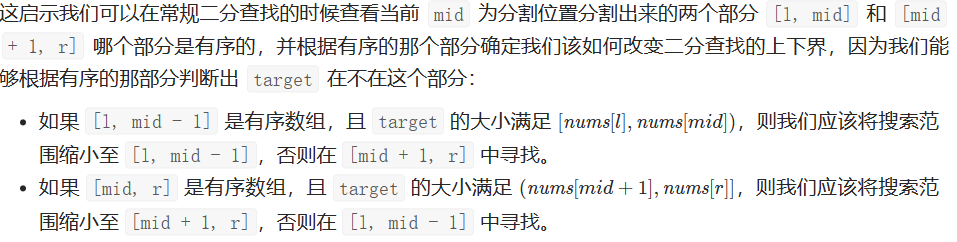

## 二分查找

### 69 x的平方根

#### 方法一：二分查找

```cpp
//最简单的的题目有自己做出来
class Solution {
public:
	int mySqrt(int x) {
		long low = 1, high = x; //防止int越界，long的取值范围大一点
		while (low <= high) {
			long mid = (low + high) / 2;
			if (mid* mid <= x) {
				if ((mid + 1) * (mid + 1) > x) {
					return mid; //此时的mid的平方小于等于x，但是加1后会大于x
				}
				
			}
			if (mid * mid < x) { 
				low = mid + 1;
			}
			if (mid * mid > x) {
				high = mid - 1;
			}
		}
		return 0;
	}
};
```

### 34 在排序数组中查找元素的第一个和最后一个位置

#### 方法 一：二分查找

找数组中【第一个等于target的位置】和【第一个大于target的位置减一】

```cpp
#include <iostream>
using namespace std;
#include <vector>

vector<int> createVector() {
	vector<int> ivec;
	int num;
	do
	{
		cin >> num;
		ivec.push_back(num);
	} while (getchar() != '\n');
	return ivec;
}

class Solution {
public:
	vector<int> searchRange(vector<int>& nums, int target) {
		//找第一个大于等于target的位置
		int low = 0, high = nums.size();
		while (low < high) {
			int mid = (low + high) / 2;
			
			if (target <= nums[mid]) {
				high = mid;
			}
			else {
				low = mid + 1;
			}
		}
		int lower = low;

		//找第一个大于target的位置减一
		low = 0, high = nums.size();
		while (low < high) {
			int mid = (low + high) / 2;
			if (nums[mid] > target) {
				high = mid;
			}
			else {
				low = mid + 1;
			}
		}
		int upper = low - 1;
		if (nums.empty()) {
			return vector<int>{-1, -1};
		}
		if (lower == nums.size() || nums[lower] != target) {
			return vector<int>{-1, -1};
		}
		return vector<int>{lower, upper};
	}
};


int main()
{
	vector<int> nums;
	int target;
	
	nums = createVector();
	cin >> target;

	Solution ss;
	vector<int> pos = ss.searchRange(nums, target);
	for (int i = 0; i < pos.size(); ++i) {
		cout << pos[i] << " ";
	}

	system("pause");
	return 0;
}
```

#### 方法2：

```cpp
class Solution {
public:
    int helper(vector<int>& nums, int target){
        int i=0, j=nums.size()-1;
        while(i<=j){
            int mid=(i+j)/2;
            if(nums[mid]<=target) i=mid+1;
            else j=mid-1;
        }
        return i;
    }


    vector<int> searchRange(vector<int>& nums, int target) {
        int low=helper(nums, target-1), high=helper(nums, target)-1;
        if(nums.empty()) return {-1, -1};
        if(low==nums.size() || nums[low]!=target){
            return {-1, -1};
        }
        return {low, high};
    }
};
```


### 81 搜索旋转排序数组II

#### 方法一：二分查找

```cpp
class Solution {
public:
	bool search(vector<int>& nums, int target) {
		int l = 0, r = nums.size() - 1;
		while (l <= r) {
			int mid = l + (r - l) / 2;
			if (nums[mid] == target) {
				return true;
			}
			if (nums[l] == nums[mid]) {
				//无法判断哪个区间是增序的
				++l;
			}
			else if (nums[r] == nums[mid]) {
				//无法判断哪个区间是增序的
				--r;
			}
			else if (nums[mid] < nums[r]) {
				//右区间是增序的
				if (target > nums[mid] && target <= nums[r]) {
					l = mid + 1;
				}
				else {
					r = mid - 1;
				}
			}
			else {//左区间是增序的
				if (target >= nums[l] && target < nums[mid]) {
					r = mid - 1;
				}
				else {
					l = mid + 1;
				}
			}
		}
		return false;
	}
};

```

#### 方法二：顺序查找

```cpp
class Solution {
public:
	bool search(vector<int>& nums, int target) {
		for (int i = 0; i < nums.size(); ++i) {
			if (nums[i] == target) {
				return true;
			}
		}
		return false;
	}
};
```

### 704 二分查找

左闭右开，用小于<

```cpp
class Solution {
public:
    int search(vector<int>& nums, int target) {
        int left = 0;
        int right = nums.size(); // 定义target在左闭右开的区间里，即：[left, right)
        while (left < right) { // 因为left == right的时候，在[left, right)是无效的空间，所以使用 <
            int middle = left + ((right - left) >> 1);
            if (nums[middle] > target) {
                right = middle; // target 在左区间，在[left, middle)中
            } else if (nums[middle] < target) {
                left = middle + 1; // target 在右区间，在[middle + 1, right)中
            } else { // nums[middle] == target
                return middle; // 数组中找到目标值，直接返回下标
            }
        }
        // 未找到目标值
        return -1;
    }
};
```


### 33 搜索旋转排序数组

#### 方法1：二分查找

我们将数组从中间分开成左右两部分的时候，一定有一部分的数组是有序的。拿示例来看，我们从 6 这个位置分开以后数组变成了 [4, 5, 6] 和 [7, 0, 1, 2] 两个部分，其中左边 [4, 5, 6] 这个部分的数组是有序的，其他也是如此。



```cpp
class Solution {
public:
    int search(vector<int>& nums, int target) {
        int n = nums.size();
        if (n == 0) return -1;
        if (n == 1) return nums[0] == target ? 0 : -1;
        int l = 0;
        int r = n - 1;
        while (l <= r) {
            int mid = (l + r) / 2;
            if (nums[mid] == target) return mid;
            // 第一种情况
            if (nums[0] <= nums[mid]) {
                if (nums[0] <= target && target < nums[mid]) {
                    r = mid - 1;
                }
                else {
                    l = mid + 1;
                }
            }
            // 第二种情况
            else {
                if (nums[mid] < target && target <= nums[n - 1]) {
                    l = mid + 1;
                }
                else {
                    r = mid - 1;
                }
            }
        }
        return -1;
    }
};

```


### 240 搜索二维矩阵

#### 方法1：二分查找

一行一行去执行二分查找

```cpp
class Solution {
public:
    bool searchMatrix(vector<vector<int>>& matrix, int target) {
        int m = matrix.size(), n = matrix[0].size();
        for (int i = 0; i < m; i++) {
            // 左闭右闭的二分查找
            int l = 0;
            int r = n - 1;
            while (l <= r) {
                int mid = (l + r) / 2;
                if (matrix[i][mid] == target) return true;
                else if (matrix[i][mid] < target) {
                    l = mid + 1;
                }
                else if (matrix[i][mid] > target) {
                    r = mid - 1;
                }
            }
        }
        return false;
    }
};
```


### 162. 寻找峰值

要在时间复杂度为 O(log n) 的情况下找到峰值元素，可以使用二分搜索的方法。具体思路如下：

1. 初始化左指针 `left` 为 0，右指针 `right` 为 `nums` 数组的长度减 1。
2. 在每一次迭代中，计算中间元素的索引 `mid`，即 `mid = (left + right) / 2`。
3. 如果 `nums[mid] > nums[mid + 1]`，则说明峰值元素在左侧或当前元素就是峰值，将右指针 `right` 更新为 `mid`。
4. 否则，说明峰值元素在右侧，将左指针 `left` 更新为 `mid + 1`。
5. 重复步骤 2-4，直到左指针 `left` 和右指针 `right` 相等，此时指向的索引就是峰值元素的位置。

```cpp
class Solution {
public:
    int findPeakElement(vector<int>& nums) {
        int left = 0;
        int right = nums.size() - 1;
        
        while (left < right) {
            int mid = left + (right - left) / 2;
            
            if (nums[mid] > nums[mid + 1]) {
                // 峰值在左侧或当前元素就是峰值
                right = mid;
            } else {
                // 峰值在右侧
                left = mid + 1;
            }
        }
        
        // 返回峰值元素的索引
        return left;
    }
};
```


### 153. 寻找旋转排序数组中的最小值

在 `findMin` 函数中，我们使用二分查找的思想来寻找旋转排序数组中的最小元素。首先判断数组是否已经有序，如果是，则直接返回第一个元素。否则，使用二分查找法不断缩小搜索范围，直到找到最小元素。

```cpp
class Solution {
public:
    int findMin(vector<int>& nums) {
        int left = 0;
        int right = nums.size() - 1;

        // 如果数组没有旋转，直接返回第一个元素
        if (nums[left] < nums[right]) {
            return nums[left];
        }

        // 进行二分查找
        while (left < right) {
            int mid = left + (right - left) / 2;

            // 如果中间元素大于右边界元素，说明最小元素在右半部分
            if (nums[mid] > nums[right]) {
                left = mid + 1;
            }
            // 如果中间元素小于右边界元素，说明最小元素在左半部分或者就是中间元素
            else if (nums[mid] < nums[right]) {
                right = mid;
            }
            // 如果中间元素等于右边界元素，无法判断最小元素在哪一部分，缩小右边界
            else {
                right--;
            }
        }

        return nums[left];
    }
};
```


### 74. 搜索二维矩阵

```cpp
class Solution {
public:
    bool searchMatrix(vector<vector<int>>& matrix, int target) {
        int m = matrix.size();
        int n = matrix[0].size();
        int left = 0, right = m * n - 1; // 将二维矩阵转换为一维数组进行二分查找

        while (left <= right) {
            int mid = left + (right - left) / 2;
            int row = mid / n; // 行索引
            int col = mid % n; // 列索引

            if (matrix[row][col] == target) {
                return true;
            } else if (matrix[row][col] < target) {
                left = mid + 1; // 在右半部分继续查找
            } else {
                right = mid - 1; // 在左半部分继续查找
            }
        }

        return false; // 没有找到目标元素
    }
};
```


