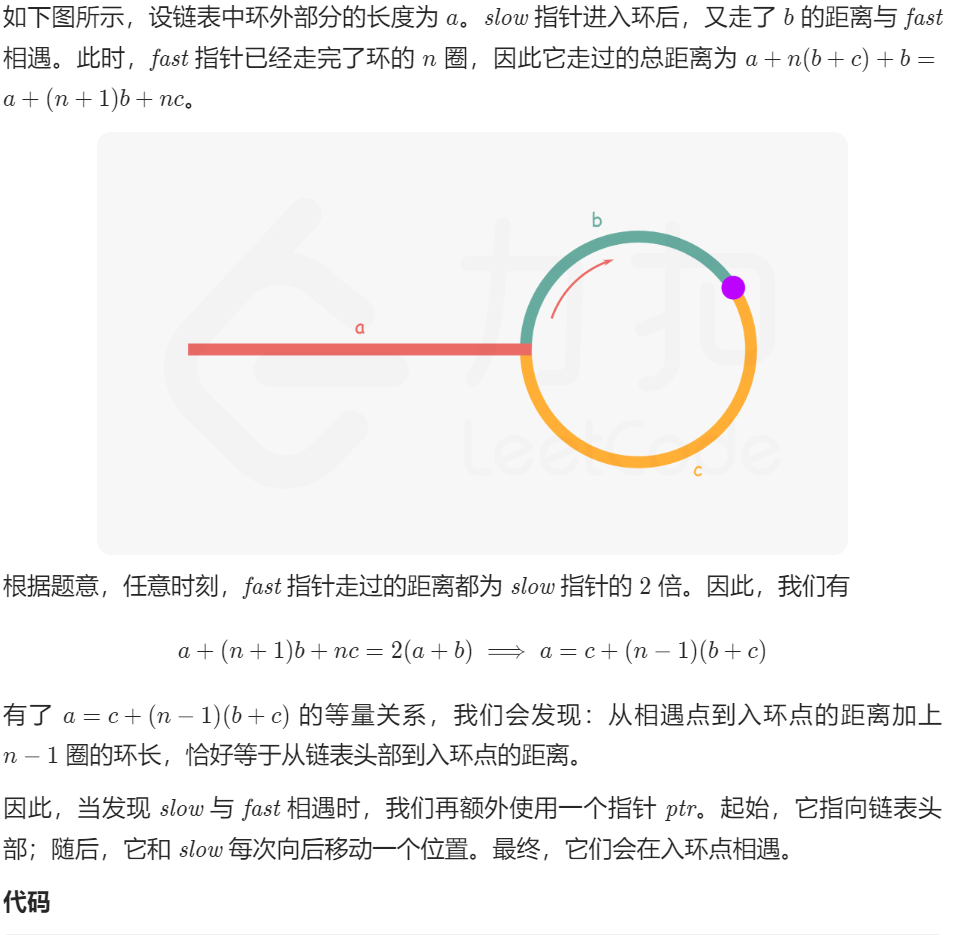
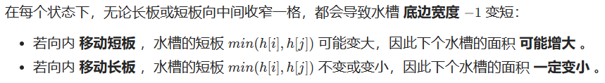
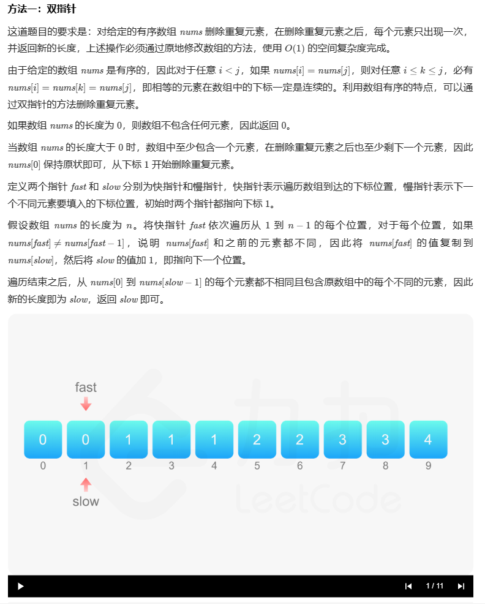

## 双指针

### 167 两数之和II-输入有序数组

#### 方法一：排序数组，双指针遍历方向相反

		因为数组已经排好序，我们可以采用方向相反的双指针来寻找这两个数字，一个初始指向最小的元素，即数组最左边，向右遍历；一个初始指向最大的元素，即数组最右边，向左遍历。

- 如果两个指针指向元素的和等于给定值，那么它们就是我们要的结果。
- 如果两个指针指向元素的和小于给定值，我们把左边的指针右移一位，使得当前的和增加一点。如果两个指针指向元素的和大于给定值，我们把右边的指针左移一位，使得当前的和减少一点。

		可以证明，对于排好序且有解的数组，双指针一定能遍历到最优解。证明方法如下：假设最优解的两个数的位置分别是 l和 r。我们假设在左指针在 l左边的时候，右指针已经移动到了 r；此时两个指针指向值的和小于给定值，因此左指针会一直右移直到到达 l。同理，如果我们假设在右指针在 r右边的时候，左指针已经移动到了 l；此时两个指针指向值的和大于给定值，因此右指针会一直左移直到到达 r。所以双指针在任何时候都不可能处于 (l,r)之间，又因为不满足条件时指针必须移动一个，所以最终一定会收敛在 l和 r

```cpp
#include <iostream>
using namespace std;
#include <vector>
#include <algorithm>

vector<int> createVector() {
	vector<int> ivec;
	int num;
	do
	{
		cin >> num;
		ivec.push_back(num);
	} while (getchar() != '\n');
	return ivec;
}

void printVector(vector<int>& v) {
	for (vector<int>::iterator it = v.begin(); it != v.end(); it++) {
		cout << *it << " ";
	}
	cout << endl;
}

class Solution {
public:
	vector<int> twoSum(vector<int>& numbers, int target) {
		//l一开始在最左边，r在最右边
		int l = 0, r = numbers.size() - 1, sum;
		while (l < r) {
			sum = numbers[l] + numbers[r];
			if (sum == target) { //两个指针指向元素的和等于给定值，结束
				break;
			}
			if (sum < target) { //如果小了，左指针往右移
				++l;
			}
			else { //如果大了，右指针往左移
				--r;
			}
		}
		return vector<int>{ l + 1,r + 1 }; //因为下标从1开始，多加1
	}
};


int main()
{
	vector<int> numbers;
	numbers = createVector();
	int target;
	cin >> target;

	Solution ss;
	vector<int> result = ss.twoSum(numbers, target);
	cout << result[0] <<" "<<result[1] << endl;;

	system("pause");
	return 0;
}
```


### 15 三数之和

#### 方法1：双指针

```cpp
class Solution {
public:
	vector<vector<int>> threeSum(vector<int>& nums) {
		vector<vector<int>> result;
		sort(nums.begin(), nums.end());
		for (int i = 0; i < nums.size(); i++) {
			if (nums[i] > 0) {
				return result;
			}
			if (i>0 && nums[i]==nums[i-1]) {
				continue;
			}
			int left = i + 1;
			int right = nums.size() - 1;
			while (right > left) {
				if (nums[i] + nums[left] + nums[right] > 0) right--;
				else if (nums[i] + nums[left] + nums[right] < 0) left++;
				else {
					result.push_back(vector<int>{nums[i], nums[left], nums[right]});
					while (right > left && nums[right] == nums[right - 1]) right--;
					while (right > left && nums[left] == nums[left + 1])left++;
					right--;
					left++;
				}
			}
		}
		return result;
	}
};
```

#### 方法2：排序+双指针 k神

[15. 三数之和 - 力扣（LeetCode）](https://leetcode.cn/problems/3sum/solutions/11525/3sumpai-xu-shuang-zhi-zhen-yi-dong-by-jyd/)

```cpp
class Solution {
public:
    vector<vector<int>> threeSum(vector<int>& nums) {
        sort(nums.begin(), nums.end());
        
        vector<vector<int>> res;
        for(int k=0;k<nums.size()-2;k++){
            
            if(nums[k]>0) break;
            if(k>0 && nums[k]==nums[k-1]) continue;
            int i=k+1, j=nums.size()-1;
            while(i<j){
                int sum=nums[k]+nums[i]+nums[j];
                if(sum<0){
                    while(i<j && nums[i]==nums[++i]);
                }
                else if(sum>0){
                    while(i<j && nums[j]==nums[--j]);
                }
                else{
                    res.push_back({nums[k],nums[i],nums[j]});
                    while(i<j && nums[i]==nums[++i]);
                    while(i<j && nums[j]==nums[--j]);
                }

            }
        }

        return res;
    }
};
```


### 18 四数之和

#### 方法1：双指针

```cpp
class Solution {
public:
	vector<vector<int>> fourSum(vector<int>& nums, int target) {
		vector<vector<int>> result;
		sort(nums.begin(), nums.end());
		for (int k = 0; k < nums.size(); k++) {
			// 剪枝处理
			if (nums[k] > target && nums[k] >= 0) {
				break;
			}
			// 对nums[k]去重
			if (k > 0 && nums[k] == nums[k - 1]) {
				continue;
			}
			for (int i = k + 1; i < nums.size(); i++) {
				// 2级剪枝处理
				if (nums[k] + nums[i] > target && nums[k] + nums[i] >= 0) {
					break;
				}
				// 对nums[i]去重
				if (i > k + 1 && nums[i] == nums[i - 1]) {
					continue;
				}
				int left = i + 1;
				int right = nums.size() - 1;
				while (right > left) {
					if ((long)nums[k] + nums[i] + nums[left] + nums[right] > target) {
						right--;
					}
					else if ((long)nums[k] + nums[i] + nums[left] + nums[right] < target) {
						left++;
					}
					else {
						result.push_back(vector<int>{nums[k], nums[i], nums[left], nums[right]});
						// nums[left]和nums[right]去重
						while (right > left && nums[right] == nums[right - 1]) right--;
						while (right > left && nums[left] == nums[left + 1]) left++;
						// 找到答案时，双指针同时收缩
						right--;
						left++;
					}
				}
			}
		}
		return result;
	}
};
```


### 88 合并两个有序数组

#### 方法一：双指针

每次从两个数组的头部取出比较小的数字放到结果中

```cpp
#include <iostream>
using namespace std;
#include <vector>
#include <algorithm>

vector<int> createVector() {
	vector<int> ivec;
	int num;
	do
	{
		cin >> num;
		ivec.push_back(num);
	} while (getchar() != '\n');
	return ivec;
}

class Solution {
public:
	void merge(vector<int>& nums1, int m, vector<int>& nums2, int n) {
		//双指针
		int p1 = 0, p2 = 0;
		//创建一个新的数组，暂存排好序的数
		int *sorted=new int[m + n];
		int cur;
		while (p1 < m || p2 < n) {
			if (p1 == m) {
				cur = nums2[p2++];
			}
			else if (p2 == n) {
				cur = nums1[p1++];
			}
			else if (nums1[p1] < nums2[p2]) {
				cur = nums1[p1++];
			}
			else {
				cur = nums2[p2++];
			}
			sorted[p1 + p2 - 1] = cur;
		}
		//降排好序的数组赋给nums1
		for (int i = 0; i < m + n; ++i) {
			nums1[i] = sorted[i];
		}
		delete[] sorted;
	}
};

int main()
{
	vector<int> nums1, nums2;
	int m, n;
	nums1 = createVector();
	cin >> m;
	nums2 = createVector();
	cin >> n;

	Solution ss;
	ss.merge(nums1, m, nums2, n);

	for (int i = 0; i < m + n; ++i) {
		cout << nums1[i] << " ";
	}

	system("pause");
	return 0;
}
```


#### 第2次：双指针

写的更好看，仿照合并两个有序列表写的

```cpp
class Solution {
public:
    void merge(vector<int>& nums1, int m, vector<int>& nums2, int n) {
        int i=0, j=0;
        int k=0;
        vector<int> nums(m+n);
        while(i<m && j<n){
            if(nums1[i]<=nums2[j]){
                nums[k]=nums1[i];
                k++;
                i++;
            }
            else{
                nums[k]=nums2[j];
                k++;
                j++;
            }
        }

        if(i<m){
            while(i<m){
                nums[k]=nums1[i];
                k++;
                i++;
            }
        }
        else{
            while(j<n){
                nums[k]=nums2[j];
                k++;
                j++;
            }
        }

        nums1=nums;
    }
};
```


### 142 环形链表II

#### 方法一：快慢指针

对于链表找环路的问题，有一个通用的解法——快慢指针（Floyd判圈法）。

- 给定两个指针，分别命名为 slow和 fast，起始位置在链表的开头。
- 每次 fast前进两步，slow前进一步。如果 fast可以走到尽头，那么说明没有环路；
- 如果 fast可以无限走下去，那么说明一定有环路，且一定存在一个时刻 slow和 fast相遇。
- 当 slow和 fast第一次相遇时，我们将 fast重新移动到链表开头，并让 slow和 fast每次都前进一步。当 slow和 fast第二次相遇时，相遇的节点即为环路的开始点 



```cpp
class Solution {
public:
	ListNode* detectCycle(ListNode* head) {
		ListNode* slow = head, * fast = head;
		//判断还是否存在环路
		do {
			//如果存在fast为空，或者fast->next为空的情况，
			//说明fast可以走到尽头，就说明没有环路
			if (!fast || !fast->next) {
				return nullptr;
			}
			//每次fast前进两步，slow前进一步
			fast = fast->next->next;
			slow = slow->next;
		} while (fast != slow); //如果存在环路，一定存在一个时刻slow和fast相遇
		//当slow和first第一次相遇时，将fast重新移动到链表开头
		fast = head;
		while (fast != slow) { //当slow和fast第二次相遇时，相遇的节点即为环路的开始点
			//让slow和fast每次都前进一步
			slow = slow->next;
			fast = fast->next;
		}
		return fast;
	}
};
```

### 76 最小覆盖子串

#### 方法一：滑动窗口

滑动窗口机制，一个用于【延伸】现有窗口的r指针，一个用于【收缩】窗口的l指针，在任意时刻，只有一个指针运动，而另一个保持静止。

**我们在 s 上滑动窗口，通过移动 r 指针不断扩张窗口。当窗口包含 t 全部所需的字符后，如果能收缩，我们就收缩窗口直到得到最小窗口。**

使用长度为128的数组来映射字符，其中chars表示目前每个字符缺少的数量，flag表示每个字符中是否在t中存在

```cpp
class Solution {
public:
	string minWindow(string S, string T) {
		vector<int> chars(128, 0);
		vector<bool> flag(128, false);
		//先统计T中的字符情况
		for (int i = 0; i < T.size(); ++i) {
			flag[T[i]] = true; //在flag中，将t字符串中字母对应的ASCII码位置为true
			++chars[T[i]]; //在chars中，将t字符串中字母对应的ASCII位上，统计相应字母的个数s
		}
		//移动滑动窗口，不断更改统计数据
		int cnt = 0, l = 0, min_l = 0, min_size = S.size() + 1;
		for (int r = 0; r < S.size(); ++r) {
			if (flag[S[r]]) {
				//对应的字母个数减1s
				if (--chars[S[r]] >= 0) {
					//cnt++，表示有一个相符
					++cnt;
				}
				//若目前滑动窗口已包含T中全部字符，
				//则尝试将l右移，在不影响结果的情况下获得最短子字符串
				while (cnt == T.size()) {
					if (r - l + 1 < min_size) {
						min_l = l;
						min_size = r - l + 1;
					}
					if (flag[S[l]] && ++chars[S[l]] > 0) {
						--cnt;
					}
					++l;
				}
			}
		}
		return min_size > S.size() ? "" : S.substr(min_l, min_size);
	}
};
```


### 438 找到字符串中所有字母异位词

#### 方法1：滑动窗口

==滑动窗口很好的题解：==[我写了一首诗，把滑动窗口算法变成了默写题 - 找到字符串中所有字母异位词 - 力扣（LeetCode）](https://leetcode.cn/problems/find-all-anagrams-in-a-string/solution/hua-dong-chuang-kou-tong-yong-si-xiang-jie-jue-zi-/)

```cpp
class Solution {
public:
    vector<int> findAnagrams(string s, string p) {
        unordered_map<char, int> need, window;
        for (char c : p) need[c]++;

        int left = 0, right = 0;
        int valid = 0;
        vector<int> res; // 记录结果
        while (right < s.size()) {
            char c = s[right];
            right++;
            // 进行窗口内数据的一系列更新
            if (need.count(c)) {
                window[c]++;
                if (window[c] == need[c]) 
                    valid++;
            }
            // 判断左侧窗口是否要收缩
            while (right - left >= p.size()) {
                // 当窗口符合条件时，把起始索引加入 res
                if (valid == need.size())
                    res.push_back(left);
                char d = s[left];
                left++;
                // 进行窗口内数据的一系列更新
                if (need.count(d)) {
                    if (window[d] == need[d])
                        valid--;
                    window[d]--;
                }
            }
        }
        return res;
    }
};
```


#### 第2种 双指针实现滑动窗口

[438. 找到字符串中所有字母异位词 - 力扣（LeetCode）](https://leetcode.cn/problems/find-all-anagrams-in-a-string/solutions/1125936/gong-shui-san-xie-shuang-zhi-zhen-shi-xi-t5hc/)

```cpp
class Solution {
public:
    vector<int> findAnagrams(string s, string p) {
        vector<int> ans;
        int n = s.length(), m = p.length();
        vector<int> c1(26, 0), c2(26, 0);
        // 统计词频
        for (char ch : p) c2[ch - 'a']++;
        // 统计滑动窗口内的s的子串词频
        for (int l = 0, r = 0; r < n; r++) {
            c1[s[r] - 'a']++;
            
            if (r - l + 1 > m) c1[s[l++] - 'a']--;
            
            if (check(c1, c2)) ans.push_back(l);
        }
        
        return ans;
    }
    
    bool check(vector<int>& c1, vector<int>& c2) {
        for (int i = 0; i < 26; i++) {
            if (c1[i] != c2[i]) return false;
        }
        
        return true;
    }
};
```


### 202 快乐数

#### 方法一：快慢指针

快指针每次走两步，慢指针每次走一步，当二者相等时，即为一个循环周期。循环结束后，判断是不是1，是的话就是快乐数，否则不是快乐数。

```cpp
class Solution {
public:
	int bitSquareSum(int n) {
		int sum = 0;
		while (n > 0) {
			int bit = n % 10;
			sum += bit * bit;
			n = n / 10;
		}
		return sum;
	}

	bool isHappy(int n) {
		int slow = n, fast = n;
		do {
			slow = bitSquareSum(slow);
			fast = bitSquareSum(fast);
			fast = bitSquareSum(fast);
		} while (slow != fast);

		return slow == 1;
	}
};
```


### 27 移除元素

#### 方法1：双指针法（快慢指针）


- 快指针：寻找新数组的元素，新数组就是不含有目标元素的数组
- 慢指针：指向更新 新数组下标的位置

```cpp
class Solution {
public:
    int removeElement(vector<int>& nums, int val) {
        int slow = 0;
        for (int fast = 0; fast < nums.size(); fast++) {
            if (nums[fast] != val) {
                nums[slow] = nums[fast];
                ++slow;
            }
        }
        return slow;
    }
};
```


### 977 有序数组的平方

#### 方法1：双向指针


```cpp
class Solution {
public:
    vector<int> sortedSquares(vector<int>& nums) {
        int m = nums.size() - 1;
        vector<int> ans(nums.size(), 0);
        int i = 0;
        int j = nums.size() - 1;
        while (i <= j) {
            if (nums[i] * nums[i] < nums[j] * nums[j]) {
                ans[m--] = nums[j] * nums[j];
                --j;
            }
            else {
                ans[m--] = nums[i] * nums[i];
                ++i;
            }
        }
        return ans;
    }
};
```

### 209 长度最小的子数组

#### 方法1：滑动窗口

在本题中实现滑动窗口，主要确定如下三点：

- 窗口内是什么？
- 如何移动窗口的起始位置？
- 如何移动窗口的结束位置？

窗口就是 满足其和 ≥ s 的长度最小的 连续 子数组。

窗口的起始位置如何移动：如果当前窗口的值大于s了，窗口就要向前移动了（也就是该缩小了）。

窗口的结束位置如何移动：窗口的结束位置就是遍历数组的指针，也就是for循环里的索引。

解题的关键在于 窗口的起始位置如何移动，如图所示：


```cpp
class Solution {
public:
    int minSubArrayLen(int target, vector<int>& nums) {
        int len = nums.size();
        int ans =INT_MAX;
        int sum = 0; // 滑动窗口数值之和
        int l = 0; // 滑动窗口起始位置
        for (int r = 0; r < len; ++r) {
            sum += nums[r];
            // 注意这里使用while，每次更新 l（起始位置），并不断比较子序列是否符合条件
            while (sum >= target) {
                int sublength = (r - l + 1); // 取子序列的长度
                ans = ans < sublength ? ans : sublength;
                sum -= nums[l++]; // 这里体现出滑动窗口的精髓之处，不断变更l（子序列的起始位置）
            }
        }
        // ans没有被赋值的话，就返回0，说明没有符合条件的子序列
        return ans == INT_MAX ? 0 : ans;
    }
};
```


### 3 无重复字符的最长子串

#### 方法1：滑动窗口

```cpp
class Solution {
public:
	int lengthOfLongestSubstring(string s) {
		if (s.size() == 0) return 0;
		unordered_set<char> lookup;
		int maxStr = 0;
		int left = 0;
		for (int i = 0; i < s.size(); i++) {
			while (lookup.find(s[i]) != lookup.end()) {
				// 找到了，移动队列并把队列左边的元素移出
				lookup.erase(s[left]);
				left++;
			}
			// 一直找出队列最长的长度
			maxStr = max(maxStr, i - left + 1);
			lookup.insert(s[i]);
		}
		return maxStr;
	}
};
```


### 11 盛最多水的容器

#### 方法1：双指针

此题的面积公式：
$ s(i,j)=min(h[i],h[j])*(j-1) $



因此，初始化双指针分列水槽左右两端，循环每轮将短板向内移动一格，并更新面积最大值，直到两指针相遇时跳出；即可获得最大面积。

```cpp
class Solution {
public:
    int maxArea(vector<int>& height) {
        int i = 0, j = height.size() - 1, res = 0;
        while (i < j) {
            if (height[i] < height[j]) {
                res = max(res, (j - i) * height[i++]);
            }
            else {
                res = max(res, (j - i) * height[j--]);
            }
        }
        return res;
    }
};
```


#### 287 寻找重复数

#### 方法1：快慢指针

[287. 寻找重复数 - 力扣（LeetCode）](https://leetcode.cn/problems/find-the-duplicate-number/solutions/58841/287xun-zhao-zhong-fu-shu-by-kirsche/)

1.数组中有一个重复的整数 <=> 链表中存在环
2.找到数组中的重复整数 <=> 找到链表的环入口

```cpp
class Solution {
public:
    int findDuplicate(vector<int>& nums) {
        int slow = 0;
        int fast = 0;
        slow = nums[slow];
        fast = nums[nums[fast]];
        while (slow != fast) {
            slow = nums[slow];
            fast = nums[nums[fast]];
        }

        int pre1 = 0;
        int pre2 = slow;
        while (pre1 != pre2) {
            pre1 = nums[pre1];
            pre2 = nums[pre2];
        }
        return pre1;
    }
};

```


### 925 长按键入

#### 方法1：双指针

```cpp
class Solution {
public:
    bool isLongPressedName(string name, string typed) {
        if(typed.size()<name.size()) return false;
        int i=0,j=0;
        int lenName=name.size(),lenTyped=typed.size();
        while(i<lenName && j< lenTyped){
            // 如果相同就都移动，如果不同就只移动typed
            if(name[i]==typed[j]){
                ++i;
                ++j;
            }
            else{
                ++j;
            }
        }

        if(i==lenName && j<=lenTyped){
            return true;
        }
        else{
            return false;
        }
    }
};
```


### 1498. 满足条件的子序列数目

```cpp
class Solution {
public:
    int numSubseq(vector<int>& nums, int target) {
        int mod=1e9+7;
        // 求子序列不必保持数组顺序，先把数据排序
        sort(nums.begin(), nums.end());
        int n=nums.size();
        int res=0;
        vector<int> pw(n, 0);
        pw[0]=1;
        // 算组合数需要多次算 2 的幂，所以直接把幂运算的结果存在数组
        for(int i=1;i<n;i++){
            pw[i]=(pw[i-1]*2)%mod;
        }
        // 滑动窗口，先固定左边界，然后找右边界，右边界值尽量大且满足左边界值 + 右边界值 < target，该区间的组合数为 2 的 n-1 次幂，n 为区间元素个数
        for(int i=0, j=n-1;i<n;i++){
            while(i<=j && nums[i]+nums[j]>target) j--;
            if(i>j) break;
            res=(res+pw[j-i])%mod; //固定住底下一位，最多就p[j-i]种，
            //比如 i=1 j =2，就两种情况 一是nums[i]，二是nums[i]和nums[j] ，所以是pw[j-i]
        }
        return res;
    }
};
```


### 1004. 最大连续1的个数 III

#### 方法1：双指针

```cpp
class Solution {
public:
    int longestOnes(vector<int>& nums, int k) {
        int left=0, right=0;
        int size=nums.size();
        int result=0;
        int count=0;
        while(right<size){
            if(nums[right]==0){
                count++;
            }
            while(count>k){//当窗口内0的个数大于K时，需要缩小窗口
                if(nums[left]==0){
                    count--;
                }
                left++;
            }
            //窗口内0的个数小于等于k时，也就是可以该窗口内的0都可以替换，根据该窗口长度来确定是否更新result
            result=max(result, right-left+1);
            right++;
        }
        return result;
    }
};
```


#### 57. 和为s的两个数字

因为是排序好的序列，打了high往左移，小了low往右移

```cpp
class Solution {
public:
    vector<int> twoSum(vector<int>& nums, int target) {
        int low=0, high=nums.size()-1;
        while(low<high){
            int sum=nums[low]+nums[high];
            if(sum==target){
                return {nums[low], nums[high]};
            }
            else if(sum>target){
                high--;
            }
            else{
                low++;
            }
        }
        return {};
    }
};
```


#### 57 - II. 和为s的连续正数序列

##### 方法1：滑动窗口

```cpp
class Solution {
public:
    vector<vector<int>> findContinuousSequence(int target) {
        vector<vector<int>> result;
        int low=1, high=2;
        while(low<high){
            // （首项+末项）*项数/2
            int sum=(low+high)*(high-low+1)/2;
            if(sum==target){
                vector<int> vec;
                for(int i=low;i<=high;i++){
                    vec.push_back(i);
                }
                result.push_back(vec);
                //即使当前满足，那么依然要前进的，这有点滑动窗口的意思吧
                low++;
            }
            else if(sum<target){
                high++;
            }
            else{
                low++;
            }
        }
        return result;
    }
};
```


### 26. 删除有序数组中的重复项



```cpp
class Solution {
public:
    int removeDuplicates(vector<int>& nums) {
        int n = nums.size();
        if (n == 0) {
            return 0;
        }
        int fast = 1, slow = 1;
        while (fast < n) {
            if (nums[fast] != nums[fast - 1]) {
                nums[slow] = nums[fast];
                ++slow;
            }
            ++fast;
        }
        return slow;
    }
};
```


