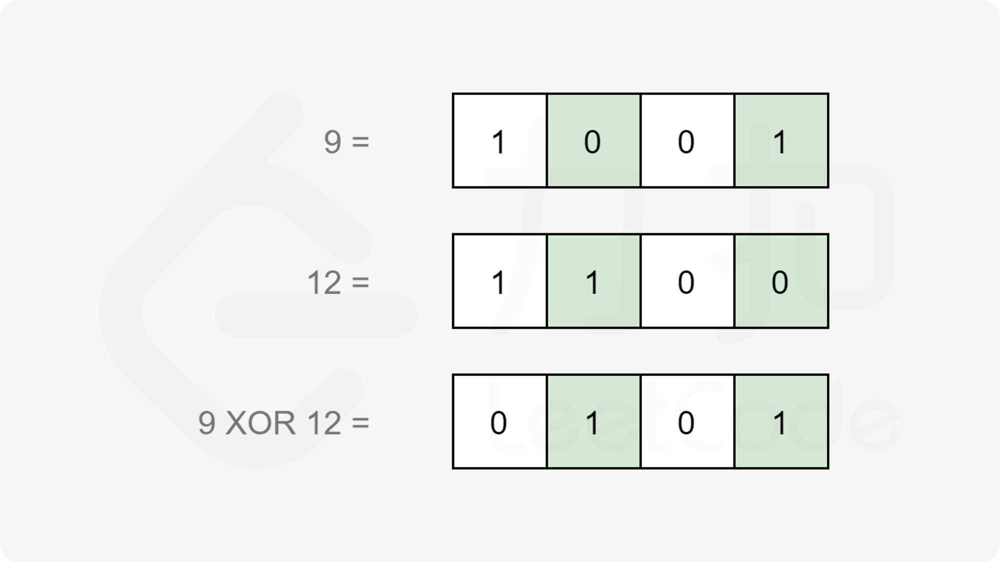

## 数学

### 204 计数质数

#### 方法1：埃拉托斯特尼筛法（Sieve of Eratosthenes，简称埃氏筛法）

1、初始化长度 O(n)O(n) 的标记数组，表示这个数组是否为质数。数组初始化所有的数都是质数.

2、从 2 开始将当前数字的倍数全都标记为合数。标记到sqrt(n)时停止即可。

```cpp
class Solution {
public:
	int countPrimes(int n) {
		vector<bool> primes(n, true);
		// 从2开始枚举到sqrt(n)
		for (int i = 2; i * i < n; ++i) {
			// 如果当前是质数
			if (primes[i]) {
				// 就把从i*i开始，i的所有倍数都设置为false
				// 因为如果x>2，2*x被2过滤掉了，3*x被3过滤掉了，...，最小未被过滤的是x^2
				for (int j = i * i; j < n; j += i) {
					primes[i] = false;
				}
			}
		}
		int count = 0;
		for (int i = 2; i < n; ++i) {
			if (primes[i]) {
				++count;
			}
		}
		return count;
	}
};
```

### 504 七进制数

#### 方法1：

```cpp
class Solution {
public:
	string convertToBase7(int num) {
		string ans = "";
		if (num == 0) {
			return "0";
		}
		int flag = num < 0 ? 1 : 0;
		if (flag) {
			num = -num;
		}
		while (num) {
			int tmp = num % 7;
            //to_string结果转为字符串
			ans = to_string(tmp) + ans;
			num = num / 7;
		}
		return flag ? "-" + ans : ans;
	}
};
```


### 136 只出现一次的数字

#### 方法1：异或运算

```
1.任何数和 0做异或运算，结果仍然是原来的数，即 a⊕0=a。
2.任何数和其自身做异或运算，结果是0，即 a⊕a=0。
3.异或运算满足交换律和结合律，即 
a⊕b⊕a=b⊕a⊕a=b⊕(a⊕a)=b⊕0=b。

假设数组中有2m+1个数，其中有m个数各出现两次，一个数出现一次。令a1、a2、...、am为出现两次的m个数，am+1为出现一个的数
```


```cpp
class Solution {
public:
    int singleNumber(vector<int>& nums) {
        int ret=0;
        for(auto e:nums) ret^=e;
        return ret;
    }
};
```


### 338 比特位计数

##### 方法1：


```cpp
class Solution {
public:
    vector<int> countBits(int n) {
        vector<int> result(n + 1);
        result[0] = 0;
        for (int i = 1; i <= n; i++) {
            if (i % 2 == 1) {
                result[i] = result[i - 1] + 1;
            }
            else {
                result[i] = result[i / 2];
            }
        }
        return result;
    }
};
```


### 461 汉明距离

#### 方法1：移位实现位计数



计算x和y之间的汉明距离，可以先计算x异或y，然后统计结果中等于1的位数。


具体地，记 s=x⊕y，我们可以不断地检查 s 的最低位，如果最低位为 1，那么令计数器加一，然后我们令 s 整体右移一位，这样 s 的最低位将被舍去，原本的次低位就变成了新的最低位。我们重复这个过程直到 s=0 为止。这样计数器中就累计了 s 的二进制表示中 1 的数量。

```cpp
class Solution {
public:
    int hammingDistance(int x, int y) {
        int s = x ^ y;
        int ret = 0;
        while (s) {
            // s & 1可以把最低位取出来
            ret += s & 1;
            // s右移一位，s=s>>1;
            s >>= 1;
        }
        return ret;
    }
};
```


### 31 下一个排列


```cpp
class Solution {
public:
    void nextPermutation(vector<int>& nums) {
        if (nums.size() <= 1) return;
        int i = nums.size() - 2, j = nums.size() - 1, k = nums.size() - 1;
        while (i >= 0 && nums[i] >= nums[j]) {
            i--;
            j--;
        }

        if (i >= 0) {
            while (k>=j && nums[i] >= nums[k]) {
                k--;
            }
            swap(nums[i], nums[k]);
        }
        reverse(nums.begin() + j, nums.end());
    }
};
```


### 9 回文数

通过取整和取余操作获取整数中对应的数字进行比较。

举个例子：1221 这个数字。

- 通过计算 1221 / 1000， 得首位1
- 通过计算 1221 % 10， 可得末位 1
- 进行比较
- 再将 22 取出来继续比较

```cpp
class Solution {
public:
    bool isPalindrome(int x) {
        if(x<0) return false;
        int div=1;
        while(x/div>=10) div*=10;
        while(x>0){
            int left=x/div;
            int right=x%10;
            if(left!=right) return false;
            // 去掉头尾两位的数字
            x=(x%div)/10;
            div/=100;
        }
        return true;
    }
};
```


