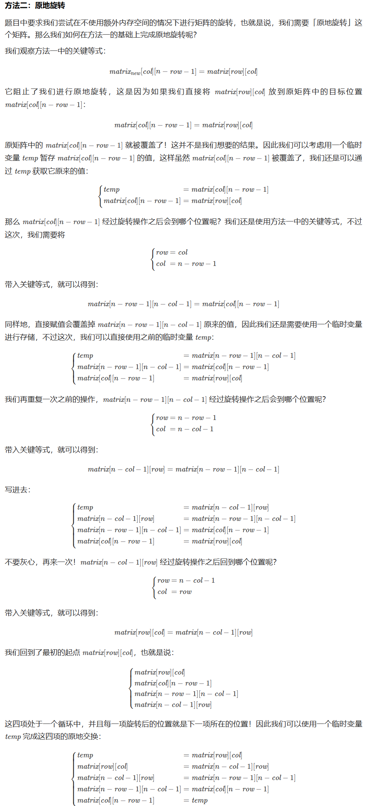
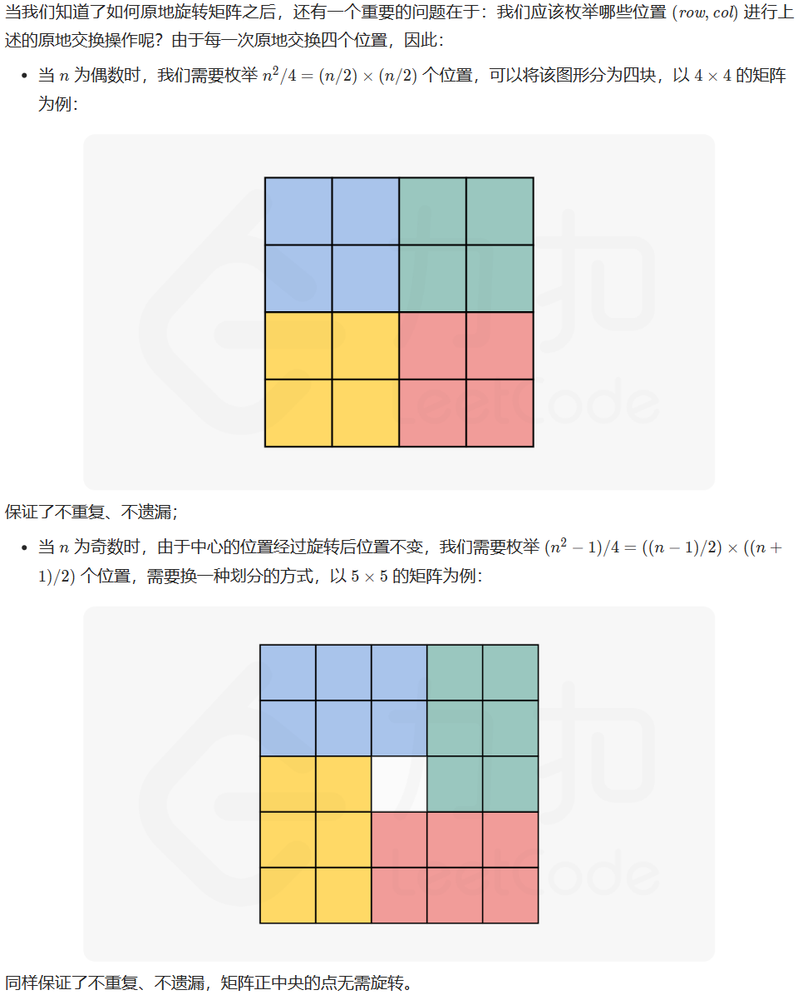
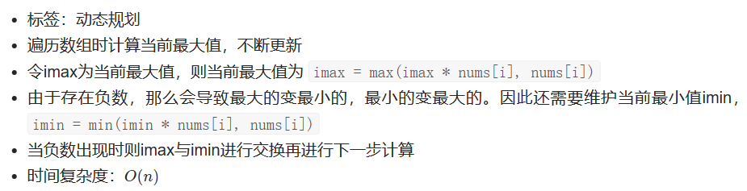
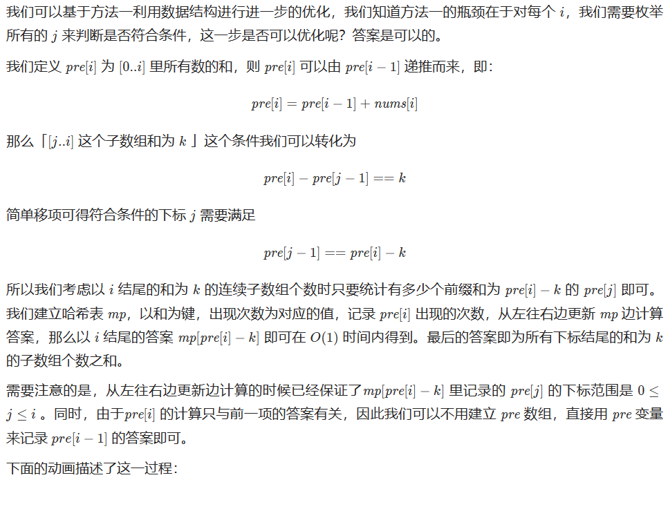
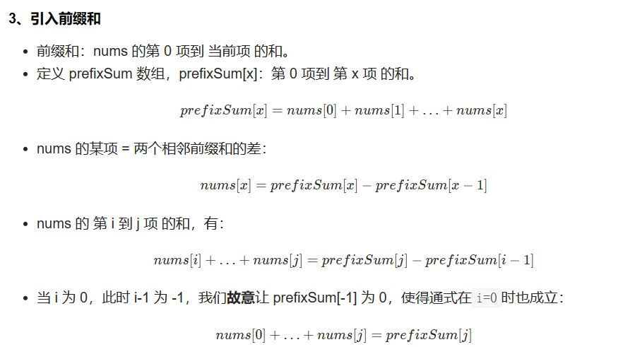
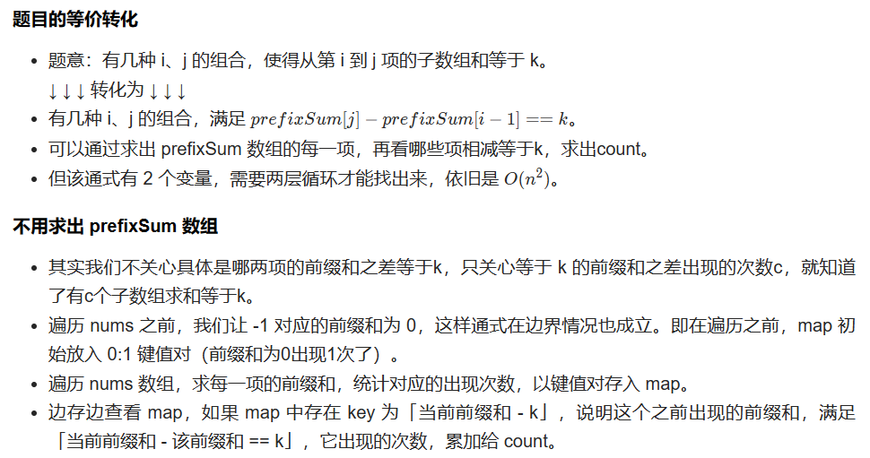
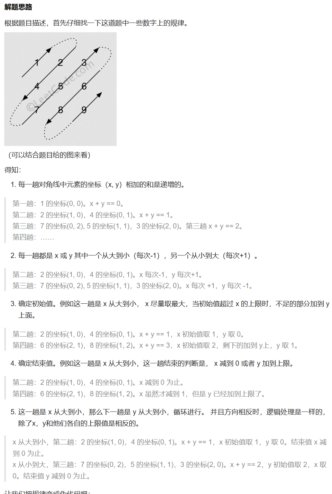
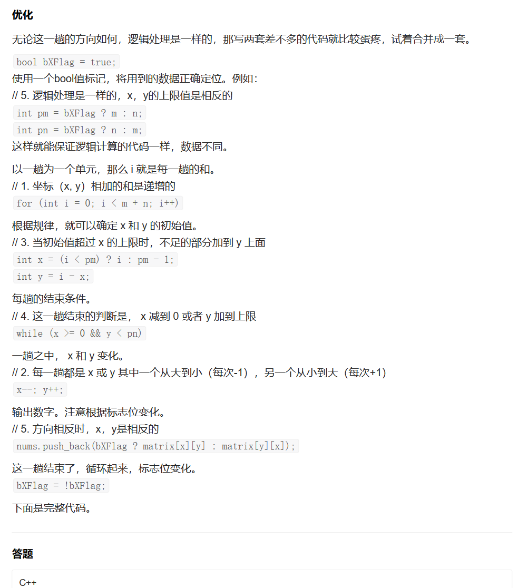
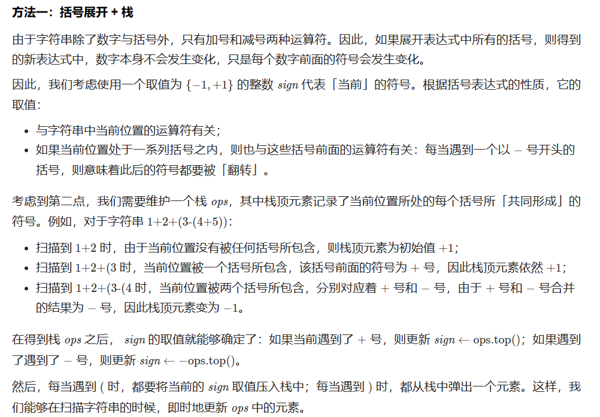

## 其他

### 48 旋转图像

#### 方法1：原地旋转

需要一个一个去推





```cpp
class Solution {
public:
    void rotate(vector<vector<int>>& matrix) {
        int n = matrix.size();
        for (int i = 0; i < n / 2; i++) {
            for (int j = 0; j < (n + 1) / 2; j++) {
                int temp = matrix[i][j];
                matrix[i][j] = matrix[n - j - 1][i];
                matrix[n - j - 1][i] = matrix[n - i - 1][n - j - 1];
                matrix[n - i - 1][n - j - 1] = matrix[j][n - i - 1];
                matrix[j][n - i - 1] = temp;
            }
        }

    }
};
```


### 75 颜色分类

#### 方法1：单指针

```cpp
class Solution {
public:
    void sortColors(vector<int>& nums) {
        int n = nums.size();
        // 用ptr表示头部的范围
        // 从0到ptr-1都属于头部
        int ptr = 0;
        // 把0都交换到头部的范围
        for (int i = 0; i < n; i++) {
            if (nums[i] == 0) {
                swap(nums[i], nums[ptr]);
                ++ptr;
            }
        }
		// 从0后面开始，把1都交换到头部的范围
        for (int i = ptr; i < n; i++) {
            if (nums[i] == 1) {
                swap(nums[i], nums[ptr]);
                ++ptr;
            }
        }
    }
};
```


### 152 乘积最大子序列

#### 方法1：



```cpp
class Solution {
public:
    int maxProduct(vector<int>& nums) {
        int resMax=INT_MIN, imax = 1, imin = 1;
        for (int i = 0; i < nums.size(); i++) {
            if (nums[i] < 0) {
                int tmp = imax;
                imax = imin;
                imin = tmp;
            }

            imax = max(imax * nums[i], nums[i]);
            imin = min(imin * nums[i], nums[i]);
            resMax = max(resMax, imax);
        }
        return resMax;
    }
};
```


### 560 和为K的子数组

#### 方法1：前缀表+哈希表优化



```cpp
class Solution {
public:
    int subarraySum(vector<int>& nums, int k) {
        unordered_map<int, int> mp;
        mp[0] = 1;
        int count = 0, pre = 0;
        for (auto x : nums) {
            pre += x;
            if (mp.find(pre - k) != mp.end()) {
                count += mp[pre - k];
            }
            mp[pre]++;
        }
        return count;
    }
};
```


### 560 和为K的子数组

#### 方法1：哈希表+前缀和





遍历nums之前，让-1对应的前缀和为0，这样通式在边界情况也成立。即在遍历之前，map初始放入0:1键值对（前缀和为0出现1次了）

```cpp
class Solution {
public:
    int subarraySum(vector<int>& nums, int k) {
        unordered_map<int, int> mp;
        mp[0] = 1;
        int count = 0, pre = 0;
        for (auto& x : nums) {
            // 遍历nums数组，求每一项的前缀和
            pre += x;
            // 边存边查看mp，如果mp中存在key为[当前前缀和-k],
            // 说明之前出现过前缀和满足：prefixSum[j]-prefixSum[i-1]=k
            if (mp[pre-k]>0) {
                // 将这样前缀和的个数累加给count
                count += mp[pre - k];
            }
            // 统计该前缀和出现的次数，以键值对存入哈希表mp
            mp[pre]++;
        }
        return count;
    }
};
```


### 238 除自身以外数组的乘积

#### 方法1：

```cpp
class Solution {
public:
    vector<int> productExceptSelf(vector<int>& nums) {
        int length = nums.size();

        // L 和 R 分别表示左右两侧的乘积列表
        vector<int> L(length, 0), R(length, 0);

        vector<int> answer(length);

        // L[i] 为索引 i 左侧所有元素的乘积
        // 对于索引为 '0' 的元素，因为左侧没有元素，所以 L[0] = 1
        L[0] = 1;
        for (int i = 1; i < length; i++) {
            L[i] = nums[i - 1] * L[i - 1];
        }

        // R[i] 为索引 i 右侧所有元素的乘积
        // 对于索引为 'length-1' 的元素，因为右侧没有元素，所以 R[length-1] = 1
        R[length - 1] = 1;
        for (int i = length - 2; i >= 0; i--) {
            R[i] = nums[i + 1] * R[i + 1];
        }

        // 对于索引 i，除 nums[i] 之外其余各元素的乘积就是左侧所有元素的乘积乘以右侧所有元素的乘积
        for (int i = 0; i < length; i++) {
            answer[i] = L[i] * R[i];
        }
        return answer;
    }
};

```


### 621. 任务调度器

[【任务调度器】C++ 桶子_配图理解 - 任务调度器 - 力扣（LeetCode）](https://leetcode.cn/problems/task-scheduler/solution/tong-zi-by-popopop/)


1、记录最大任务数量 N，看一下任务数量并列最多的任务有多少个，即最后一个桶子的任务数 X，计算 NUM1=(N-1)*(n+1)+x

2、NUM2=tasks.size()
输出其中较大值即可
因为存在空闲时间时肯定是 NUM1 大，不存在空闲时间时肯定是 NUM2>=NUM1

```cpp
class Solution {
public:
    int leastInterval(vector<char>& tasks, int n) {
        int len=tasks.size();
        vector<int> vec(26);
        for(auto c:tasks){
            vec[c-'A']++;
        }
        int cnt=1;
        // 降序排列
        sort(vec.begin(), vec.end() ,[](const int& x, const int& y){return x>y;});
        // cnt就是最后一行的个数
        while(cnt<vec.size() && vec[cnt]==vec[0]) cnt++;
        return max(len, cnt+(n+1)*(vec[0]-1));
    }

};
```


### 399. 除法求值

[🎦 399. 除法求值 - 除法求值 - 力扣（LeetCode）](https://leetcode.cn/problems/evaluate-division/solution/399-chu-fa-qiu-zhi-nan-du-zhong-deng-286-w45d/)

很难，不懂

```cpp
class UnionFind {
private:
    vector<int> parent; // 存放父节点
    vector<double> weight; // 指向父节点的权值
    
public:
    UnionFind(int n) {
        for (int i = 0; i < n; ++i) {
            parent.push_back(i);
            weight.push_back(1.0); // 权重初始化为1
        }
    }
    // 路径压缩。返回根节点id
    int find(int x) {
        // 递归寻找根节点，更新该点到根的权重为该点父节点到根的权重
        if (x != parent[x]) {
            int origin = parent[x];
            parent[x] = find(parent[x]);
            weight[x] *= weight[origin];
        }
        return parent[x];
    }
    // 返回除法结果。如果两个值不存在则-1
    double isConected(int x, int y) {
        int rootX = find(x);
        int rootY = find(y);
        // 如果两个值有共同的根也就是可以计算，则算结果。否则不在同一个并查集，-1
        if (rootX == rootY) {
            return weight[x] / weight[y];
        } else {
            return -1.00000;
        }
    }
    void myunion(int x, int y, double value) {
        // 分别找到二者的根节点
        int rootX = find(x), rootY = find(y);
        if (rootX == rootY) {
            return; // 二者已经指向同一个根节点
        }
        // 令分子指向分母的根节点，权重为分母到根的权重*分母除分子的值/分子到根的权重。一开始都是1
        parent[rootX] = rootY;
        weight[rootX] = weight[y] * value / weight[x];
    }
};
class Solution {
public:
    vector<double> calcEquation(vector<vector<string>>& equations, vector<double>& values, vector<vector<string>>& queries) {
        // 初始化并查集
        int equationsSize = equations.size();
        UnionFind unionFind(2 * equationsSize);
        // 第 1 步：预处理，将变量的值与 id 进行映射
        map<string, int> hashMap;
        int id = 0;
        for (int i = 0; i < equationsSize; ++i) {
            // 存分子，分母，值为id
            vector<string> equation = equations[i];
            string var1 = equation[0];
            string var2 = equation[1];
            if (!hashMap.count(var1)) {
                hashMap[var1] = id;
                ++id;
            }
            if (!hashMap.count(var2)) {
                hashMap[var2] = id;
                ++id;
            }
            // 把分子分母用有向边连起来
            unionFind.myunion(hashMap[var1], hashMap[var2], values[i]);
        }
        // 第 2 步：做查询
        int queriesSize = queries.size();
        vector<double> res(queriesSize, -1.00000);
        for (int i = 0; i < queriesSize; ++i) {
            string var1 = queries[i][0];
            string var2 = queries[i][1];
            int id1, id2;
            // 如果两个值有至少一个不在equations中，结果为-1，否则做除法
            if (hashMap.count(var1) && hashMap.count(var2)) {
                id1 = hashMap[var1];
                id2 = hashMap[var2];
                res[i] = unionFind.isConected(id1, id2);
            }
        }
        return res;
    }
};
```


当解决这个问题时，我们可以使用拓扑排序的思路来判断是否可以完成所有课程的学习。

拓扑排序是一种对有向无环图（DAG）进行排序的算法。在这个问题中，课程之间的依赖关系可以看作是一个有向图，其中课程表示图中的节点，先修课程关系表示节点之间的有向边。我们的目标是判断是否存在一种拓扑排序，即是否存在一种学习课程的顺序，满足所有的依赖关系。

我们可以使用入度（in-degree）数组和邻接表来表示有向图。**入度数组记录每门课程的入度，即有多少门课程依赖于它**；**邻接表记录每门课程的后续课程，即它依赖的其他课程**。

具体的解决思路如下：

1. 根据输入的先修课程关系，构建有向图的邻接表和入度数组。遍历先修课程关系列表，对于每个关系 `[ai, bi]`，表示课程 `ai` 依赖于课程 `bi`，我们在邻接表中将 `bi` 添加到 `ai` 的后续课程列表中，并将 `ai` 的入度加 1。

2. 初始化一个队列，将入度为 0 的课程入队。这些课程没有任何先修课程要求，可以直接学习。

3. 使用广度优先搜索（BFS）的方式进行拓扑排序。从队列中取出一个课程，表示学习了该课程，将学习的课程数量加 1。然后遍历该课程的后续课程列表，在入度数组中将后续课程的入度减 1。如果某个后续课程的入度减为 0，表示它的所有先修课程都已学习完毕，将该课程入队。

4. 重复步骤 3，直到队列为空。如果学习的课程数量等于总课程数量，说明可以完成所有课程的学习，返回 true；否则，返回 false。

以上是解决该问题的思路。下面是相应的代码实现：

```cpp
#include <iostream>
#include <vector>
#include <queue>

using namespace std;

bool canFinish(int numCourses, vector<vector<int>>& prerequisites) {
    vector<int> inDegree(numCourses, 0); // 入度数组
    vector<vector<int>> adjacencyList(numCourses, vector<int>()); // 邻接表

    // 构建有向图的邻接表和入度数组
    for (const auto& prerequisite : prerequisites) {
        int course = prerequisite[0];
        int prerequisiteCourse = prerequisite[1];
        adjacencyList[prerequisiteCourse].push_back(course); // 将课程 course 添加到 prerequisiteCourse 的后续课程列表中
        inDegree[course]++; // course 的入度加 1
    }

    queue<int> q;

    // 将入度为 0 的课程入队
    for (int i = 0; i < numCourses; i++) {
        if (inDegree[i] == 0) {
            q.push(i);
        }
    }

    int count = 0; // 记录已学习的课程数量

    while (!q.empty()) {
        int course = q.front();
        q.pop();
        count++;

        // 遍历当前课程的后续课程
        for (int nextCourse : adjacencyList[course]) {
            inDegree[nextCourse]--; // 将后续课程的入度减 1
            if (inDegree[nextCourse] == 0) {
                q.push(nextCourse); // 入度为 0 的课程入队
            }
        }
    }

    return count == numCourses; // 如果已学习的课程数量等于总课程数量，则可以完成所有课程学习
}

int main() {
    int numCourses;
    cout << "请输入课程数量：";
    cin >> numCourses;

    int numPrerequisites;
    cout << "请输入先修课程数量：";
    cin >> numPrerequisites;

    vector<vector<int>> prerequisites(numPrerequisites, vector<int>(2));

    cout << "请输入先修课程的依赖关系：\n";
    for (int i = 0; i < numPrerequisites; i++) {
        cin >> prerequisites[i][0] >> prerequisites[i][1];
    }

    bool canFinishAllCourses = canFinish(numCourses, prerequisites);

    cout << "是否可以完成所有课程的学习？" << (canFinishAllCourses ? "是" : "否") << endl;

    return 0;
}
```

在这段代码中，我们首先根据输入的先修课程关系构建了有向图的邻接表和入度数组。然后使用广度优先搜索进行拓扑排序，判断是否可以完成所有课程的学习。最后根据结果输出相应的信息。

希望这次的解释更加详细，如果还有其他问题，请随时提问。


### 4. 寻找两个正序数组的中位数

#### 方法1：合并后求中位数

```cpp
class Solution {
public:
    vector<int> helper(vector<int>& nums1, vector<int>& nums2){
        int m=nums1.size(), n=nums2.size();
        vector<int> nums(m+n);
        int count=0;
        int i=0, j=0;
        while(i<m && j<n){
            if(nums1[i]<=nums2[j]){
                nums[count]=nums1[i];
                count++;
                i++;
            }
            else{
                nums[count]=nums2[j];
                count++;
                j++;
            }
        }
        if(i!=nums1.size()){
            while(i!=m){
                nums[count]=nums1[i];
                count++;
                i++;
            }
        }
        else{
            while(j!=n){
                nums[count]=nums2[j];
                count++;
                j++;
            }
        }
        return nums;
    }


    double findMedianSortedArrays(vector<int>& nums1, vector<int>& nums2) {
        vector<int> nums=helper(nums1, nums2);
        double res;
        int len=nums.size();
        if(len%2==0){
            res=(nums[len/2-1]+nums[len/2])/2.0;
        }
        else{
            res=(double)nums[len/2];
        }
        return res;
    }
};
```


### 54. 螺旋矩阵

#### 方法1：四个指针

解决思路：

1. 定义四个变量 `top`, `bottom`, `left`, `right` 分别表示当前螺旋遍历的上边界、下边界、左边界和右边界。
2. 初始化这些变量：`top = 0`, `bottom = m - 1`, `left = 0`, `right = n - 1`。
3. 创建一个结果数组 `result`，用于存储螺旋遍历的元素。
4. 使用一个循环进行螺旋遍历，循环条件是 `top <= bottom` 且 `left <= right`。
5. 在每一次循环中，按照顺时针螺旋的顺序遍历矩阵的外圈元素，依次将元素添加到结果数组中。
   - 遍历上边界：从 `left` 到 `right`，行号为 `top`。
   - 遍历右边界：从 `top + 1` 到 `bottom`，列号为 `right`。
   - 遍历下边界：从 `right - 1` 到 `left`，行号为 `bottom`。
   - 遍历左边界：从 `bottom - 1` 到 `top + 1`，列号为 `left`。
6. 每次遍历完一条边界后，更新边界值，即 `top++`, `bottom--`, `left++`, `right--`。
7. 循环结束后，返回结果数组 `result`。

```cpp
class Solution {
public:
    vector<int> spiralOrder(vector<vector<int>>& matrix) {
        vector<int> result; // 存储螺旋遍历的结果
        
        if (matrix.empty()) {
            return result;
        }
        
        int m = matrix.size(); // 矩阵的行数
        int n = matrix[0].size(); // 矩阵的列数
        
        int top = 0; // 上边界
        int bottom = m - 1; // 下边界
        int left = 0; // 左边界
        int right = n - 1; // 右边界
        
        while (top <= bottom && left <= right) {
            // 遍历上边界
            for (int i = left; i <= right; i++) {
                result.push_back(matrix[top][i]);
            }
            top++;
            
            // 遍历右边界
            for (int i = top; i <= bottom; i++) {
                result.push_back(matrix[i][right]);
            }
            right--;
            
            // 遍历下边界 
            if (top <= bottom) { //因为前面++，必须要再判断一下是不是还满足边界条件，不然会重复遍历
                for (int i = right; i >= left; i--) {
                    result.push_back(matrix[bottom][i]);
                }
                bottom--;
            }
            
            // 遍历左边界
            if (left <= right) {
                for (int i = bottom; i >= top; i--) {
                    result.push_back(matrix[i][left]);
                }
                left++;
            }
        }
        
        return result;
    }
};
```


### 179. 最大数

#### 方法1：模板特化

```cpp
class Solution {
public:
    static bool compare(int a, int b) {
        string str1 = to_string(a);
        string str2 = to_string(b);

        // 将两个字符串拼接起来，比较拼接后的结果大小
        return str1 + str2 > str2 + str1;
    }

    string largestNumber(vector<int>& nums) {
        // 对 nums 中的数字进行排序，排序规则为 compare 函数
        sort(nums.begin(), nums.end(), compare);

        // 特殊情况处理，如果最大的数字是 0，则直接返回 "0"
        if (nums[0] == 0) {
            return "0";
        }

        // 将排序后的数字拼接成一个字符串
        string result;
        for (int num : nums) {
            result += to_string(num);
        }

        return result;
    }
};
```


### 440. 字典序的第K小数字

`findKthNumber` 函数是主要的解决问题的函数。它通过模拟字典序的生成过程来找到字典序第 k 小的数字。在每一步中，我们计算当前数字到下一个数字的步数，然后根据步数决定是进入下一个数字还是进入下一层。通过循环迭代，直到找到字典序第 k 小的数字。

```cpp
class Solution {
public:
    int findKthNumber(int n, int k) {
        int curr = 1; // 当前所在的数字
        k--; // 减去第一个数字 1
        while (k > 0) {
            long long steps = 0; // 当前数字到下一个数字的步数
            long long first = curr; // 当前所在的数字
            long long last = curr + 1; // 下一个数字
            // 计算当前所在的数字到下一个数字的步数
            while (first <= n) {
                steps += min(static_cast<long long>(n + 1), last) - first; // 使用 static_cast 进行类型转换
                first *= 10; // 向下一层进一位
                last *= 10; // 向下一层进一位
            }
            if (steps <= k) {
                curr++; // 进入下一个数字
                k -= steps; // 减去已经跳过的步数
            } else {
                curr *= 10; // 进入下一层
                k--; // 进入下一个数字
            }
        }
        return curr;
    }
};
```


### 498 对角线遍历





```cpp
class Solution {
public:
    vector<int> findDiagonalOrder(vector<vector<int>>& matrix) 
    {
        vector<int> nums;
        int m = matrix.size();
        if (m == 0) return nums;
        int n = matrix[0].size();
        if (n == 0) return nums;

        bool bXFlag = true;
        for (int i = 0; i < m + n; i++)
        {
            int pm = bXFlag ? m : n;
            int pn = bXFlag ? n : m;

            int x = (i < pm) ? i : pm - 1;
            int y = i - x;                

            while (x >= 0 && y < pn)
            {
                nums.push_back(bXFlag ? matrix[x][y] : matrix[y][x]);
                x--;
                y++;
            }

            bXFlag = !bXFlag;
        }
        return nums;
    }


};
```


### 224. 基本计算器



```
class Solution {
public:
    int calculate(string s) {
        stack<int> ops;
        ops.push(1);
        int sign = 1;

        int ret = 0;
        int n = s.length();
        int i = 0;
        while (i < n) {
            if (s[i] == ' ') {
                i++;
            } else if (s[i] == '+') {
                sign = ops.top();
                i++;
            } else if (s[i] == '-') {
                sign = -ops.top();
                i++;
            } else if (s[i] == '(') {
                ops.push(sign);
                i++;
            } else if (s[i] == ')') {
                ops.pop();
                i++;
            } else {
                long num = 0;
                while (i < n && s[i] >= '0' && s[i] <= '9') {
                    num = num * 10 + s[i] - '0';
                    i++;
                }
                ret += sign * num;
            }
        }
        return ret;
    }
};


```


### 7 整数反转

```cpp
class Solution {
public:
    int reverse(int x) {
        int res = 0;
        while(x!=0) {
            //每次取末尾数字
            int tmp = x%10;
            //判断是否 大于 最大32位整数
            if (res>214748364 || (res==214748364 && tmp>7)) {
                return 0;
            }
            //判断是否 小于 最小32位整数
            if (res<-214748364 || (res==-214748364 && tmp<-8)) {
                return 0;
            }
            res = res*10 + tmp;
            x /= 10;
        }
        return res;
    }
};
```


### 85. 最大矩形

[最大矩形 - 最大矩形 - 力扣（LeetCode）](https://leetcode.cn/problems/maximal-rectangle/solution/zui-da-ju-xing-by-leetcode-solution-bjlu/)

```cpp
class Solution {
public:
    int maximalRectangle(vector<vector<char>>& matrix) {
        int m = matrix.size();
        if (m == 0) {
            return 0;
        }
        int n = matrix[0].size();
        vector<vector<int>> left(m, vector<int>(n, 0));

        for (int i = 0; i < m; i++) {
            for (int j = 0; j < n; j++) {
                if (matrix[i][j] == '1') {
                    left[i][j] = (j == 0 ? 0: left[i][j - 1]) + 1;
                }
            }
        }

        int ret = 0;
        for (int j = 0; j < n; j++) { // 对于每一列，使用基于柱状图的方法
            vector<int> up(m, 0), down(m, 0);

            stack<int> stk;
            for (int i = 0; i < m; i++) {
                while (!stk.empty() && left[stk.top()][j] >= left[i][j]) {
                    stk.pop();
                }
                up[i] = stk.empty() ? -1 : stk.top();
                stk.push(i);
            }
            stk = stack<int>();
            for (int i = m - 1; i >= 0; i--) {
                while (!stk.empty() && left[stk.top()][j] >= left[i][j]) {
                    stk.pop();
                }
                down[i] = stk.empty() ? m : stk.top();
                stk.push(i);
            }

            for (int i = 0; i < m; i++) {
                int height = down[i] - up[i] - 1;
                int area = height * left[i][j];
                ret = max(ret, area);
            }
        }
        return ret;
    }
};

```


### 121. 买卖股票的最佳时机

#### 方法1：一次遍历

很喜欢的一种做法

```cpp
class Solution {
public:
    int maxProfit(vector<int>& prices) {
        int minPrice=INT_MAX, maxProfit=0;
        for(auto price:prices){
            maxProfit=max(maxProfit, price-minPrice);
            minPrice=min(minPrice, price);
        }
        return maxProfit;
    } 
};

```

