# 剑指offer


## 数据结构

​        数组和字符串是两种最基本的数据结构，它们用连续内存分别存储数字和字符。
​		链表和树是面试中出现频率最高的数据结构。由于操作树需要操作大量的指针，应聘者在解决相关问题的时候一定要留意鲁棒性，否则容易出现程序崩溃的问题。
​		栈是一个与递归紧密相关的数据结构，同样队列也与广度优先遍历算法紧密相关，深刻理解这两种数据结
构能帮助我们解决很多算法问题。

### 数组

​		为了解决数组空间效率不高的问题，人们又设计实现了多种动态数组，比如C++的STL 中的 vector。为了避免浪费，我们先为数组开辟较小的空间，然后往数组中添加数据。当数据的数目超过数组的容量时，我们再重新分配一块更大的空间(STL的 vector 每次扩充容量时，新的容量都是前一次的两倍)，把之前的数据复制到新的数组中，再把之前的内存释放，这样就能减少内存的浪费。==但我们也注意到每一次扩充数组容量时都有大量的额外操作，这对时间性能有负面影响，因此使用动态数组时要尽量减少改变数组容量大小的次数。==

​		当我们声明一个数组时，数组的名字也是一个指针，该指针指向数组的第一个元素。C/C++没有记录数组的大小，因此在用指针访问数组中的元素是，要确保没有超出数组的边界。

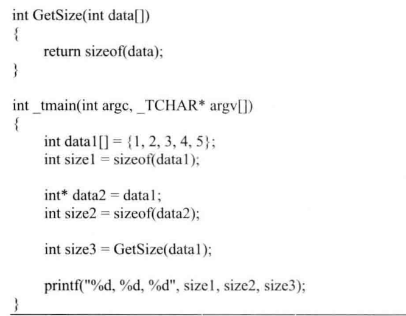

```
输出“20,4,4”
data1是一个数组，sizeof(data1)是求数组的大小，数组包含5个整数，每个整数4字节，一共20字节
data2声明为指针，32位系统上，对任意指针求sizeof，得到的结果都是4
C/C++中，数组最为函数的参数进行传递时，数组会自动退化成同类型的指针，所以size3也为4
```

#### 3 、数组中重复的数字

##### 方法一：哈希表

```cpp
class Solution {
public:
	int findRepeatNumber(vector<int>& nums) {
		//哈希表记录数组中的各个数字
		unordered_map<int, bool> map;
		//遍历数组nums中的每个数字num
		for (auto num : nums) {
			//当num在哈希表中，说明重复，直接返回num
			if (map[num]) {
				return num;
			}
			//将num添加至哈希表中
			map[num] = true;
		}
		return -1;
	}
};
```

##### 第2次：

```cpp
class Solution {
public:
    int findRepeatNumber(vector<int>& nums) {
        unordered_set<int> s;
        for(int i=0;i<nums.size();i++){
            if(s.count(nums[i])==0){
                // cout<<nums[i];
                s.insert(nums[i]);
                // cout<<*s.begin();
            }
            else{
                // cout<<nums[i];
                return nums[i];
            }
            
        }
        return -1;
    }
};
```


#### 4、二维数组中的查找

##### 方法一：标志数

从左下角开始找

```cpp
class Solution {
public:
	bool findNumberIn2DArray(vector<vector<int>>& matrix, int target) {
		int i = matrix.size() - 1;
		int j = 0;
		while (i >= 0 && j <matrix[0].size()) {
			//如果当前值大于target，则target一定在当前值的行上方，--i消去当前行
			if (matrix[i][j] > target) {
				--i;
			}
			//当前值小于target，则target一定在当前值的列右方，++j消去当前列
			else if (matrix[i][j] < target) {
				++j;
			}
			else {
				return true;
			}
		}
		return false;
	}
};
```

### 字符串

#### 5、替换空格

##### 方法一：原地修改

- 初始化：空格数量 count ，字符串 s 的长度 len ；
- 统计空格数量：遍历 s ，遇空格则 count++ ；
- 修改 s 长度：添加完 "%20" 后的字符串长度应为 len + 2 * count ；
- 倒序遍历修改：i 指向原字符串尾部元素， j 指向新字符串尾部元素；当 i = j 时跳出（代表左方已没有空格，无需继续遍历）；
  1）当 s[i] 不为空格时：执行 s[j] = s[i] ；
  2）当 s[i] 为空格时：将字符串闭区间 [j-2, j] 的元素修改为 "%20" ；由于修改了 3 个元素，因此需要 j -= 2 ；
- 返回值：已修改的字符串 s ；

```cpp
class Solution {
public:
    string replaceSpace(string s) {
        int count = 0, len = s.size();
        // 统计空格数量
        for (char c : s) {
            if (c == ' ') count++;
        }
        // 修改 s 长度
        s.resize(len + 2 * count);
        // 倒序遍历修改
        for (int i = len - 1, j = s.size() - 1; i < j; i--, j--) {
            if (s[i] != ' ')
                s[j] = s[i];
            else {
                s[j - 2] = '%';
                s[j - 1] = '2';
                s[j] = '0';
                j -= 2;
            }
        }
        return s;
    }
};
```

#### 58、左旋转字符串

##### 方法1：三次反转（leetcode上可过，牛客上过不了）

```cpp
class Solution {
public:
    string reverseLeftWords(string s, int n) {
		reverse(s.begin(), s.begin() + n); //反转区间为前n的子串
		reverse(s.begin() + n, s.end()); //反转区间为n到末尾的子串
		reverse(s.begin(), s.end()); //反转整个字符串
		return s;
    }
};
```

##### 第2次：牛客上可过

```cpp
#include <algorithm>
class Solution {
public:
    /**
     * 代码中的类名、方法名、参数名已经指定，请勿修改，直接返回方法规定的值即可
     *
     * 
     * @param str string字符串 
     * @param n int整型 
     * @return string字符串
     */
    string LeftRotateString(string str, int n) {
        if(str.size()==0) return "";
        n = n % str.size();
        // write code here
        reverse(str.begin(), str.begin()+n);
        reverse(str.begin()+n, str.end());
        reverse(str.begin(), str.end());
        return str;
    }
};
```


### 链表

#### 6、从尾到头打印链表

##### 方法一：栈

后进先出，可以选择栈作为数据结构

```cpp
class Solution {
public:
	vector<int> reversePrint(ListNode* head) {
		ListNode* temp = head;
		stack<int> s;
		vector<int> v;
		while (temp != nullptr) {
			s.push(temp->val);
			temp = temp->next;
		}

		while (!s.empty()) {
			v.push_back(s.top());
			s.pop();
		}
		return v;
	}
};
```

**JZ6** **从尾到头打印链表**

```cpp
class Solution {
  public:
    vector<int> printListFromTailToHead(ListNode* head) {
        if(head==nullptr){
            return {};
        }

        vector<int> ans;
        while(head){
            ans.insert(ans.begin(), head->val);
            head=head->next;
        }

        return ans;
    }
};
```


#### 24、反转链表

##### 方法一：迭代

```cpp
class Solution {
public:
	ListNode* reverseList(ListNode* head) {
		ListNode* cur = head;
		ListNode* pre = nullptr;

		while (cur) {
			ListNode* temp = cur->next;
			cur->next = pre;
			pre = cur;
			cur = temp;
		}
		return pre;
	}
};
```

#### 24、合并两个排序的链表

##### 方法一：递归

```cpp
class Solution {
public:
	ListNode* mergeTwoLists(ListNode* l1, ListNode* l2) {
		if (l1 == nullptr) {
			return l2;
		}
		else if (l2 == nullptr) {
			return l1;
		}
		
		if (l1->val < l2->val) {
			l1->next = mergeTwoLists(l1->next, l2);
			return l1;
		}
		else {
			l2->next = mergeTwoLists(l1, l2->next);
			return l2;
		}
	}
};
```

#### 52、两个链表的第一个公共结点

##### 方法一：双指针

```cpp
class Solution {
public:
    ListNode* getIntersectionNode(ListNode* headA, ListNode* headB) {
		ListNode* curA = headA;
		ListNode* curB = headB;
		while (curA != curB) {
			curA = curA ? curA->next : headB;
			curB = curB ? curB->next : headA;
		}
		return curA;
    }
};
```

#### II 22、链表中环的入口结点

##### 方法一：哈希表

```cpp
class Solution {
public:
	ListNode* detectCycle(ListNode* head) {
		unordered_set<ListNode*> uset;
		ListNode* cur = head;
		while (cur != nullptr) {
            //一旦遇到了此前遍历过得结点，说明有环，并返回该结点
			if (uset.count(cur)) {
				return cur;
			}
			uset.insert(cur);
			cur = cur->next;
		}
		return nullptr;
	}
};
```

#### 22、链表中倒数第k个结点

##### 方法一：双指针

1. 后一个指针先走k步
2. 然后两个指针一起走，直到后一个指针为空
3. 返回前一个指针

```cpp
class Solution {
public:
	ListNode* getKthFromEnd(ListNode* head, int k) {
		ListNode* former = head, * latter = head;
		for (int i = 1; i <= k; ++i) {
			latter = latter->next;
		}

		while (latter != nullptr) {
			latter = latter->next;
			former = former->next;
		}
		return former;
	}
};
```


#### JZ22 链表中倒数最后k个结点

多了链表长度小于k，则返回一个长度为0的链表

```cpp
/**
 * struct ListNode {
 *	int val;
 *	struct ListNode *next;
 *	ListNode(int x) : val(x), next(nullptr) {}
 * };
 */
class Solution {
public:
    /**
     * 代码中的类名、方法名、参数名已经指定，请勿修改，直接返回方法规定的值即可
     *
     * 
     * @param pHead ListNode类 
     * @param k int整型 
     * @return ListNode类
     */
    ListNode* FindKthToTail(ListNode* pHead, int k) {
        // write code here
        ListNode* p1=pHead;
        ListNode* p2=pHead;
        for(int i=0;i<k;i++){
            if(p1!=nullptr){
                p1=p1->next;
            }
            else{
                return nullptr;
            }
        }
        while(p1!=nullptr){
            p1=p1->next;
            p2=p2->next;
        }
        return p2;
    }
};
```


#### 18、删除链表的结点

##### 方法一：两个指针

1. 特例处理： 当应删除头节点 head 时，直接返回 head.next 即可。
2. 初始化： `pre = head` , `cur = head.next` 。
3. 定位节点： 当 cur 为空 或 cur 节点值等于 val 时跳出。
   1. 保存当前节点索引，即 `pre = cur` 。
   2. 遍历下一节点，即 `cur = cur.next` 。
4. 删除节点： 若 `cur` 指向某节点，则执行 `pre.next = cur.next` ；若 `cur` 指向 `null`，代表链表中不包含值为 `val` 的节点。
5. 返回值： 返回链表头部节点 `head` 即可


```cpp
class Solution {
public:
	ListNode* deleteNode(ListNode* head, int val) {
		if (head->val == val) {
			return head->next;
		}
		ListNode* cur = head, * pre = head;
		while (cur->next != nullptr && cur->val != val) {
			pre = cur;
			cur = cur->next;
		}
		if (cur != nullptr) {
			pre->next = cur->next;
		}
		return head;
	}
};
```

##### 第2次

```cpp
class Solution {
public:
    ListNode* deleteNode(ListNode* head, int val) {
        ListNode* dummy=new ListNode();
        dummy->next=head;
        ListNode* cur=head;
        ListNode* pre=dummy;

        while(cur!=nullptr){
            if(cur->val==val){
                pre->next=cur->next;
                break;
            }
            pre=pre->next;
            cur=cur->next;
        }

        return dummy->next;
    }
};
```


### 哈希表

#### 剑指 Offer II 004. 只出现一次的数字

##### 方法1：很慢的哈希表

```cpp
class Solution {
public:
    int singleNumber(vector<int>& nums) {
        unordered_map<int, int> umap;
        for(int i=0;i<nums.size();i++){
            umap[nums[i]]++;
        }
        for(auto num:nums){
            if(umap[num]==1){
                return num;
            }
        }
        return -1;
    }
};
```


#### 56 - II. 数组中数字出现的次数 II

[剑指 Offer 56 - II. 数组中数字出现的次数 II - 力扣（LeetCode）](https://leetcode.cn/problems/shu-zu-zhong-shu-zi-chu-xian-de-ci-shu-ii-lcof/solutions/176390/shu-zu-zhong-shu-zi-chu-xian-de-ci-shu-ii-ha-xi-bi/)

```cpp
class Solution {
public:
    int singleNumber(vector<int>& nums) {
        unordered_map<int,int> umap;
        for(auto num:nums) umap[num]++;
        int ans;
        for(auto pr:umap){
            if(pr.second==1){
                ans=pr.first;
            }
        }
        return ans;
    }
};
```


#### **JZ53** **数字在升序数组中出现的次数**

##### 方法1：可以过，但是不符合logn

```cpp
class Solution {
public:
    int GetNumberOfK(vector<int>& nums, int k) {
        // write code here
        unordered_map<int, int> umap;
        for(auto num:nums) umap[num]++;
        return umap[k];
    }
};
```

##### 方法2：二分查找，因为是排序数组

```cpp
class Solution {
public:
    int GetNumberOfK(vector<int>& data, int k) {
        // write code here
        int low=0;
        int high=data.size();
        int mid=0;
        int num=0;

        if(data.size()==0) return 0;

        while(low<=high){
            mid=(high+low)/2;
            if(data[mid]>k){
                high=mid-1;
            }
            else if(data[mid]<k){
                low=mid+1;
            }
            else{
                num=1;
                //从右边开始找有几个数等于k
                int tmp=mid+1;
                while(data[tmp]==k){
                    num++;
                    tmp++;
                    if(tmp>data.size()) break;
                }
                //从左边开始找有几个等于k
                tmp=mid-1;
                while(data[tmp]==k){
                    num++;
                    tmp--;
                    if(tmp<0) break;
                }

                break;
            }
        }

        return num;
    }
};
```


#### 35. 复杂链表的复制

##### 方法1：哈希表

本题要求我们对一个特殊的链表进行深拷贝。如果是普通链表，我们可以直接按照遍历的顺序创建链表节点。而本题中因为随机指针的存在，当我们拷贝节点时，「当前节点的随机指针指向的节点」可能还没创建 

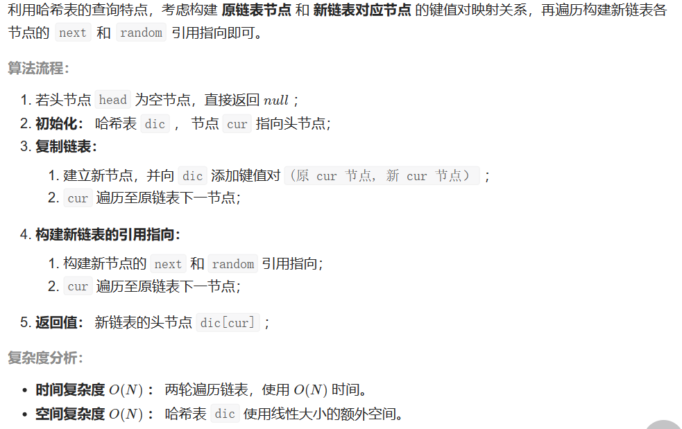

```cpp
/*
// Definition for a Node.
class Node {
public:
    int val;
    Node* next;
    Node* random;
    
    Node(int _val) {
        val = _val;
        next = NULL;
        random = NULL;
    }
};
*/
class Solution {
public:
    Node* copyRandomList(Node* head) {
        if(head==nullptr) return nullptr;
        // 复制各节点，并建立 “原节点 -> 新节点” 的 Map 映射
        unordered_map<Node*, Node*> map;
        Node* cur=head;
        while(cur!=nullptr){
            map[cur]=new Node(cur->val);
            cur=cur->next;
        }
        cur=head;
        // 构建新节点的 next 和 random 指向
        while(cur!=nullptr){
            map[cur]->next=map[cur->next];
            map[cur]->random=map[cur->random];
            cur=cur->next;
        }
        // 返回新链表的头节点
        return map[head];
    }
};
```


#### 39、数组中出现次数超过一半的数字

```cpp
class Solution {
public:
    int majorityElement(vector<int>& nums) {
        unordered_map<int, int> umap;
        int len=nums.size();
        for(int i=0;i<len;i++){
            umap[nums[i]]++;
            if(umap[nums[i]]>(len/2)) return nums[i];
        }
        return NULL;
    }
};
```


### 栈与队列

#### 59 - I. 滑动窗口的最大值

deque中，最前面的总是最大的

```cpp
class Solution {
public:
    vector<int> maxSlidingWindow(vector<int>& nums, int k) {
        vector<int> result;
        int len =nums.size();
        if(len==0 || k==0 || k>len) return result;
        //deque 中存储的是num的下标
        deque<int> que;
        for(int i=0;i<len;i++){
            //当前值比队列从后往前的大，成为下一个待选值
            while(!que.empty() && nums[que.back()]<nums[i]){
                que.pop_back();
            }
            //最大值已不在窗口中
            while(!que.empty() && i-que.front()+1 > k){
                que.pop_front();
            }
            que.push_back(i);

            //当滑动窗口首地址i大于等于size时才开始写入窗口最大值
            if(i+1>=k){
                result.push_back(nums[que.front()]);
            }
        }
        return result;

    }
};
```


#### 59 - II. 队列的最大值（单调双向队列，清晰图解）

[剑指 Offer 59 - II. 队列的最大值 - 力扣（LeetCode）](https://leetcode.cn/problems/dui-lie-de-zui-da-zhi-lcof/solutions/540181/jian-zhi-offer-59-ii-dui-lie-de-zui-da-z-0pap/)

```cpp
class MaxQueue {
    queue<int> que;
    deque<int> deq;
public:
    MaxQueue() { }
    int max_value() {
        return deq.empty() ? -1 : deq.front();
    }
    void push_back(int value) {
        que.push(value);
        while(!deq.empty() && deq.back() < value)
            deq.pop_back();
        deq.push_back(value);
    }
    int pop_front() {
        if(que.empty()) return -1;
        int val = que.front();
        if(val == deq.front())
            deq.pop_front();
        que.pop();
        return val;
    }
};


```


#### 40. 最小的k个数

##### 方法1：优先队列

```cpp
class Solution {
public:
    vector<int> getLeastNumbers(vector<int>& arr, int k) {
        priority_queue<int, vector<int>, greater<int>> pq;
        for(auto a:arr){
            pq.push(a);
        }
        vector<int> result;
        while(k--){
            result.push_back(pq.top());
            pq.pop();
        }
        return result;
    }
};
```

```cpp
class Solution {
public:
    

    vector<int> getLeastNumbers(vector<int>& arr, int k) {
        if(k==0) return {};
        priority_queue<int, vector<int>, less<int>> maxHeap;
        for(int i=0;i<k;i++){
            maxHeap.push(arr[i]);
        }

        for(int i=k;i<arr.size();i++){
            if(arr[i]<maxHeap.top()){
                maxHeap.pop();
                maxHeap.push(arr[i]);
            }
        }

        vector<int> result;
        // 因为这里maxHeap的大小是动态变化的，所以不能用for循环
        while(!maxHeap.empty()){
            result.push_back(maxHeap.top());
            maxHeap.pop();
        }

        return result;
    }
};
```


##### 方法2：快速排序

```cpp
class Solution {
public:
    vector<int> getLeastNumbers(vector<int>& arr, int k) {
        quickSort(arr, 0, arr.size() - 1);
        vector<int> res;
        res.assign(arr.begin(), arr.begin() + k);
        return res;
    }
private:
    void quickSort(vector<int>& arr, int l, int r) {
        // 子数组长度为 1 时终止递归
        if (l >= r) return;
        // 哨兵划分操作（以 arr[l] 作为基准数）
        int i = l, j = r;
        while (i < j) {
            while (i < j && arr[j] >= arr[l]) j--;
            while (i < j && arr[i] <= arr[l]) i++;
            swap(arr[i], arr[j]);
        }
        swap(arr[i], arr[l]);
        // 递归左（右）子数组执行哨兵划分
        quickSort(arr, l, i - 1);
        quickSort(arr, i + 1, r);
    }
};

```

我的

```cpp
class Solution {
public:
    void helper(vector<int>& arr, int l, int r){
        if(l>=r) return;
        int i=l, j=r;
        while(i<j){
            while(i<j && arr[j]>=arr[l]) j--;
            while(i<j && arr[i]<=arr[l]) i++;
            swap(arr[i], arr[j]);
        }
        swap(arr[i], arr[l]);
        helper(arr, l, i-1);
        helper(arr, i+1, r);
    }

    vector<int> getLeastNumbers(vector<int>& arr, int k) {
        helper(arr, 0, arr.size()-1);
        vector<int> res;
        res.assign(arr.begin(), arr.begin()+k);
        return res;
    }
};
```


#### 41. 数据流中的中位数

##### 方法1：优先队列

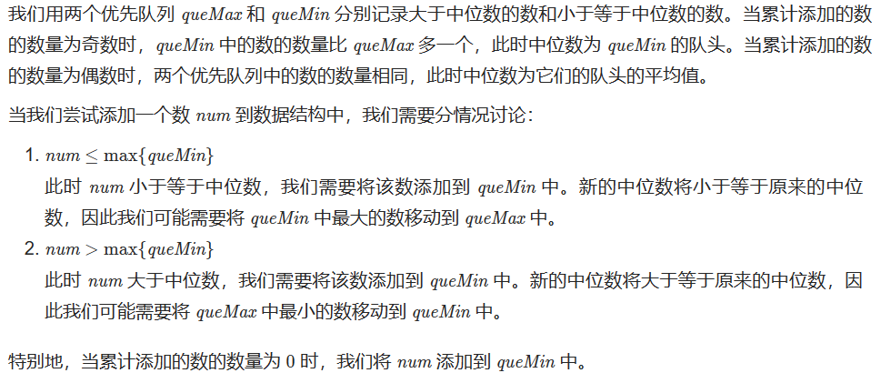

- 方法一解释有些错误
- 题解中给的解释是“用两个优先队列 queMax 和 queMin 分别记录大于中位数的数和小于等于中位数的数”，但是实际运行过程中会出现违背这个定义的情况，比如当中位数重复时，会出现相同数值存在于queMax的情况
- 个人认为更好的解释是维护两个平衡优先队列，queMax保存了数据流中较大的那一半元素，queMin保存了数据流中较小的那一半元素，同时平衡的意思是两个队列的大小之差小于等于1，且只能queMin比queMax大1

```cpp
class MedianFinder {
public:

    // 大的在前
    priority_queue<int, vector<int>, less<int>> queMin;
    // 小的在前
    priority_queue<int, vector<int>, greater<int>> queMax;

    /** initialize your data structure here. */
    MedianFinder() {

    }
    
    void addNum(int num) {
        if(queMin.empty() || num<=queMin.top()){
            queMin.push(num);
            if(queMax.size()+1<queMin.size()){
                queMax.push(queMin.top());
                queMin.pop();
            }
        }
        else{
            queMax.push(num);
            if(queMax.size()>queMin.size()){
                queMin.push(queMax.top());
                queMax.pop();
            }
        }
    }
    
    double findMedian() {
        if (queMin.size() > queMax.size()) {
            return queMin.top();
        }
        return (queMin.top() + queMax.top()) / 2.0;
    }

    
};

/**
 * Your MedianFinder object will be instantiated and called as such:
 * MedianFinder* obj = new MedianFinder();
 * obj->addNum(num);
 * double param_2 = obj->findMedian();
 */
```


##### 第2次：k神

[剑指 Offer 41. 数据流中的中位数 - 力扣（LeetCode）](https://leetcode.cn/problems/shu-ju-liu-zhong-de-zhong-wei-shu-lcof/solutions/227309/mian-shi-ti-41-shu-ju-liu-zhong-de-zhong-wei-shu-y/)

小顶堆的最小值也要大于大顶堆的最大值。

奇数的话优先放在小顶堆。

```cpp
class MedianFinder {
public:
    // 最大堆，堆顶为最大元素
    priority_queue<int, vector<int>, less<int>> maxHeap;
    // 最小堆，堆顶为最小元素
    priority_queue<int, vector<int>, greater<int>> minHeap;
    /** initialize your data structure here. */
    MedianFinder() {
    }
    void addNum(int num) {
   
        if (maxHeap.size() == minHeap.size()) {
            maxHeap.push(num);
            int top = maxHeap.top();
            maxHeap.pop();
            minHeap.push(top);
        } else {
            minHeap.push(num);
            int top = minHeap.top();
            minHeap.pop();
            maxHeap.push(top);
        }
    }
    
    double findMedian() {
        if (maxHeap.size() == minHeap.size()) {
            return (maxHeap.top()+minHeap.top())*1.0/2;
        } else {
            return minHeap.top()*1.0;
        }
    }
};
```


#### 31. 栈的压入、弹出序列

每次都用栈顶元素跟poped对比，相等就弹出

最后判断栈stack是不是空的

```cpp
class Solution {
public:
    bool validateStackSequences(vector<int>& pushed, vector<int>& popped) {
        stack<int> st;
        int i=0;
        for(auto num:pushed){
            st.push(num); // num 入栈
            // 循环判断与出栈
            while(!st.empty() && st.top()==popped[i]){
                st.pop();
                i++;
            }
        }
        return st.empty();
    }
};
```


#### 30. 包含min函数的栈

```cpp
class MinStack {
public:
    /** initialize your data structure here. */
    stack<int> x_stack;
    stack<int> min_stack;

    MinStack() {
        min_stack.push(INT_MAX);
    }
    
    void push(int x) {
        //注意当前类中也有一个min函数，
        //所以我们需要明确此时的min函数是哪个函数
        x_stack.push(x);
        min_stack.push(std::min(min_stack.top(), x));
    }
    
    void pop() {
        x_stack.pop();
        min_stack.pop();
    }
    
    int top() {
        return x_stack.top();
    }
    
    int min() {
        return min_stack.top();    
    }   
};

/**
 * Your MinStack object will be instantiated and called as such:
 * MinStack* obj = new MinStack();
 * obj->push(x);
 * obj->pop();
 * int param_3 = obj->top();
 * int param_4 = obj->min();
 */
```

#### 7、用两个栈实现队列

```cpp
class CQueue {
public:
    stack<int> st1;
    stack<int> st2;
    int size=0;


    CQueue() {

    }
    
    void appendTail(int value) {
        st1.push(value);
        size++;
    }
    
    int deleteHead() {
        if(size==0) return -1;

        if(st2.empty()){
            while(!st1.empty()){
                st2.push(st1.top());
                st1.pop();
            }
        }

        size--;
        int value = st2.top();
        st2.pop();
        return value;
    }
};

/**
 * Your CQueue object will be instantiated and called as such:
 * CQueue* obj = new CQueue();
 * obj->appendTail(value);
 * int param_2 = obj->deleteHead();
 */
```


### 树

#### 55、二叉树的深度

##### 方法一：递归

```cpp
class Solution {
public:
    int maxDepth(TreeNode* root) {
        //当root为空，说明已经越过叶子结点，返回深度0
        if (!root) {
            return 0;
        }
        //本质上是后序遍历
        //递归计算右子树和左子树的深度
        return max(maxDepth(root->left), maxDepth(root->right)) + 1;
    }
};
```

#### 27、二叉树的镜像

##### 方法一：写得很差的递归

```cpp
class Solution {
public:
    TreeNode* mirrorTree(TreeNode* root) {
        if (root == nullptr) {
            return nullptr;
        }
        TreeNode* temp = root->left;
        root->left = root->right;
        root->right = temp;
        if (root->left) {
            mirrorTree(root->left);
        }
        if (root->right) {
            mirrorTree(root->right);
        }
        return root;
    }
};
```

##### 第2次：递归

```cpp
/**
 * Definition for a binary tree node.
 * struct TreeNode {
 *     int val;
 *     TreeNode *left;
 *     TreeNode *right;
 *     TreeNode(int x) : val(x), left(NULL), right(NULL) {}
 * };
 */
class Solution {
public:
    TreeNode* mirrorTree(TreeNode* root) {
        if(root==nullptr){
            return nullptr;
        }
        TreeNode* left=mirrorTree(root->left);
        TreeNode* right=mirrorTree(root->right);

        root->left=right;
        root->right=left;

        return root;
    }
};
```

##### 第3次：

```cpp
class Solution {
public:
    TreeNode* mirrorTree(TreeNode* root) {
        if (root == nullptr) return nullptr;
        TreeNode* tmp = root->left;
        root->left = mirrorTree(root->right);
        root->right = mirrorTree(tmp);
        return root;
    }
};
```


#### 32、从上到下打印二叉树

##### 方法一：层次遍历

用队列来实现层次遍历（做了几次之后，已经比较简单了），先进先出

```cpp
class Solution {
public:
    vector<int> levelOrder(TreeNode* root) {
        queue<TreeNode*> q;
        vector<int> v;
        if (root == nullptr) {
            return v;
        }
        q.push(root);
        while (!q.empty()) {
            v.push_back(q.front()->val);
            if (q.front()->left != nullptr) {
                q.push(q.front()->left);
            }
            if (q.front()->right != nullptr) {
                q.push(q.front()->right);
            }
            q.pop();
        }
        return v;
    }
};
```

#### 68、二叉搜索树的最近公共祖先

##### 方法一：递归

最近公共祖先的定义： 设节点 root 为节点 p,q 的某公共祖先，若其左子节点 root.left 和右子节点 root.right 都不是 p,q 的公共祖先，则称 root 是 “最近的公共祖先” 。

根据以上定义，若 root 是 p,q 的 **最近公共祖先** ，则只可能为以下情况之一：

1. p 和 q 在 root 的子树中，且分列 root 的 **异侧**（即分别在左、右子树中）；
2. p = root，且 q 在 root 子树中；
3. q = root，且 p 在 root 的左或右子树中；


本题给定了两个重要条件：① 树为 二叉搜索树 ，② 树的所有节点的值都是 唯一 的。根据以上条件，可方便地判断 p,q 与 root 的子树关系，即：

1. 若 root.val < p.val ，则 p 在 root 右子树 中；
2. 若 root.val > p.val ，则 p 在 root 左子树 中；
3. 若 root.val = p.val ，则 p 和 root 指向 同一节点 。

```cpp
class Solution {
public:
    TreeNode* lowestCommonAncestor(TreeNode* root, TreeNode* p, TreeNode* q) {
        //终止条件：不需要，因为官方给了均存在与树中的条件
        //递归操作
        //第一种情况：
        if (root->val < p->val && root->val < q->val) {//看看是不是都是左儿子的后代
            return lowestCommonAncestor(root->right, p, q);//是的话就丢给左儿子去认后代（继续递归）
        }
        //第二种情况：
        if (root->val > p->val && root->val > q->val) {//不是左儿子的后代，看看是不是都是右儿子的后代
            return lowestCommonAncestor(root->left, p, q);//是的话就丢给右儿子去认后代（继续递归）
        }
        //第三种情况：
        //左儿子和右儿子都只认识一个，当前root就是最近的祖先，因为root本来就是p、q的公共的祖先
        //第三种才是题目需要找到的解，所以返回
        return root;
    }
};
```


#### 68-II 二叉树的最近公共祖先

[剑指 Offer 68 - II. 二叉树的最近公共祖先 - 力扣（LeetCode）](https://leetcode.cn/problems/er-cha-shu-de-zui-jin-gong-gong-zu-xian-lcof/solutions/217281/mian-shi-ti-68-ii-er-cha-shu-de-zui-jin-gong-gon-7/)

```cpp
class Solution {
public:
    TreeNode* lowestCommonAncestor(TreeNode* root, TreeNode* p, TreeNode* q) {
        if(root==nullptr || root==p || root==q){
            return root;
        }
        TreeNode* left =lowestCommonAncestor(root->left, p, q);
        TreeNode* right=lowestCommonAncestor(root->right, p, q);

        //root的左右子树都不包含p、q，返回nullptr
        if(left==nullptr && right==nullptr){
            return nullptr;
        }
        //p、q都不在root的左子树中，直接返回right
        if(left == nullptr){
            return right;
        }
        //p、q都不在root的右子树中，直接返回left
        if(right==nullptr){
            return left;
        }
        
        //同时不为空，说明p、q分处root两侧，因此root为最近公共祖先
        return root;
    }
};
```


#### 28、对称的二叉树

##### 方法1：递归

做过的题不要再忘了

```cpp
class Solution {
public:
    bool isSymmetric(TreeNode* root) {
        if (root) {
            return helper(root->left, root->right);
        }
        else {
            return true;
        }
    }

    bool helper(TreeNode* p, TreeNode* q) {
        if (!p && !q) {
            return true;
        }
        if (!p || !q) {
            return false;
        }
        if(p->val!=q->val){
            return false;
        }
        return helper(p->left, q->right) && helper(p->right, q->left);
    }

};
```

#### 54、二叉搜索树的第k大结点

##### 方法1：中序遍历（迭代法）

```cpp
class Solution {
public:
    int kthLargest(TreeNode* root, int k) {
        vector<int> v;
        stack<TreeNode*> s;
        while (root || !s.empty()) {
            while (root) {
                s.push(root);
                //找到最最左的结点
                root = root->left;
            }
            root = s.top();
            s.pop();
            v.emplace_back(root->val);
            //取右子树
            root = root->right;
        }
        //取第k个大的数
        return v[v.size() - k];
    }
};
```

##### 第2次：递归法

递归法中序遍历更好记

```cpp
class Solution {
public:
    void helper(TreeNode* root, vector<int>& result){
        if(root==nullptr) return;
        helper(root->left, result);
        result.push_back(root->val);
        helper(root->right, result);
    }

    int kthLargest(TreeNode* root, int k) {
        vector<int> result;
        helper(root, result);
        return result[result.size()-k];
    }
};
```


#### **JZ54** **二叉搜索树的第k个节点**

```cpp
class Solution {
public:
    /**
     * 代码中的类名、方法名、参数名已经指定，请勿修改，直接返回方法规定的值即可
     *
     * 
     * @param proot TreeNode类 
     * @param k int整型 
     * @return int整型
     */
    vector<int> vec;

    void helper(TreeNode* root){
        if(root==nullptr) return;
        helper(root->left);
        vec.push_back(root->val);
        helper(root->right);

    }

    int KthNode(TreeNode* proot, int k) {
        // write code here
        if(proot==nullptr) return -1;
        if(k==0) return -1;
        helper(proot);
        if(k>vec.size()) return -1;
        return vec[k-1];
        
    }
};
```


#### 7、重建二叉树

##### 方法1：分支算法

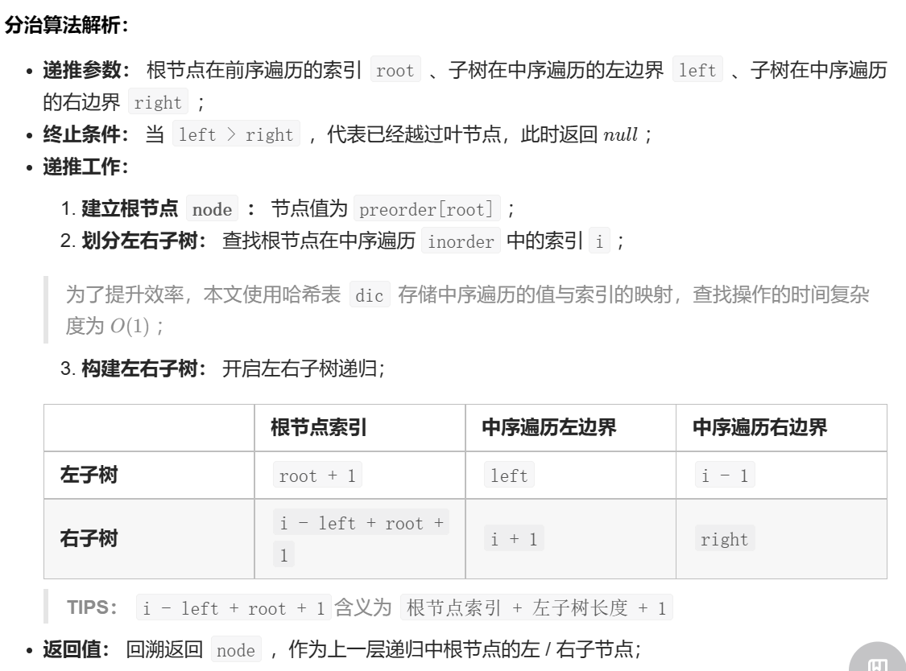

主要是左右子树边界条件的判断比较难懂

```cpp
class Solution {
public:
	vector<int> preorder;
	unordered_map<int, int> dic;

	TreeNode* buildTree(vector<int>& preorder, vector<int>& inorder) {
		this->preorder = preorder;
		//建立哈希表dic，键：结点的值，值：在中序遍历中出现的位置
		for (int i = 0; i < inorder.size(); ++i) {
			dic[inorder[i]] = i;
		}
		return helper(0, 0, inorder.size() - 1);
	}
	//输入参数
	//root:根结点在前序遍历的索引
	//left:子树在中序遍历的左边界
	//right:子树在中序遍历的右边界
	TreeNode* helper(int root, int left, int right) {
		//当left>right，代表已经越过叶节点，此时返回null
		if (left > right) return nullptr;
		//1、建立根结点node：结点值为preorder[root]
		TreeNode* node = new TreeNode(preorder[root]);
		//2、划分左右子树：查找根结点在中序遍历inorder中的索引i
		int i = dic[preorder[root]];
		//左子树的根结点索引：root+1
		node->left = helper(root + 1, left, i - 1);
		//右子树的根结点索引：root + i - left + 1（根结点索引+左子树长度+1）
		node->right = helper(root + i - left + 1, i + 1, right);
		//返回值：回溯返回node，作为上一层递归中根结点的左/右子结点
		return node;
	}
};
```

##### 方法2：同上，复习

```cpp
/**
 * Definition for a binary tree node.
 * struct TreeNode {
 *     int val;
 *     TreeNode *left;
 *     TreeNode *right;
 *     TreeNode(int x) : val(x), left(NULL), right(NULL) {}
 * };
 */
class Solution {
public:

    TreeNode* buildTree(vector<int>& preorder, vector<int>& inorder) {
        unordered_map<int, int> umap;
        for(int i=0;i<inorder.size();i++){
            umap[inorder[i]]=i;
        }
        return helper(preorder, umap, 0,0, inorder.size()-1);
    }

    TreeNode* helper(vector<int>& preorder, unordered_map<int, int>& umap, int root, int left, int right){
        if(left>right) return nullptr;
        TreeNode* node=new TreeNode(preorder[root]);
        int i=umap[preorder[root]];
        node->left=helper(preorder, umap, root+1, left, i-1);
        node->right=helper(preorder, umap, root+1+i-left, i+1, right);
        return node;
    }    
};
```

##### 第3次

```cpp
class Solution {
public:
    unordered_map<int, int> umap;

    TreeNode* helper(vector<int>& preorder, vector<int>& inorder, int preorderleft, int preorderright, int inorderleft, int inorderright){
        if(preorderleft>preorderright) return nullptr;
        int preorderroot=preorder[preorderleft];
        int inorderroot=umap[preorderroot];
        TreeNode* root=new TreeNode(preorderroot);
        int size_of_left=inorderroot-inorderleft;
        root->left=helper(preorder, inorder, preorderleft+1, preorderleft+size_of_left,inorderleft, inorderroot-1);
        root->right=helper(preorder, inorder, preorderleft+size_of_left+1, preorderright, inorderroot+1, inorderright);
        return root;
    }

    TreeNode* buildTree(vector<int>& preorder, vector<int>& inorder) {
        int m=preorder.size();
        for(int i=0;i<m;i++){
            umap[inorder[i]]=i;
        }

        TreeNode* root=helper(preorder, inorder, 0, m-1, 0, m-1);
        return root;
    }
};
```


#### 33、二叉搜索树的后序遍历序列

##### 方法1：递归

```CPP
class Solution {
public:
    bool verifyPostorder(vector<int>& postorder) {
        if(postorder.empty()) return true;
        return helper(postorder, 0, postorder.size()-1);
    }

    bool helper(vector<int>& postorder, int start, int end){
        if(start>=end){
            return true;
        }
        int left=start;
        // 一直到左子树为止，左子树所有都要小于根
        // 根postorder[end]
        while(left<end && postorder[left]<postorder[end]){
            ++left;
        }
        // 这里验证右子树，右子树所有都要大于根
        for(int i=left;i<end;i++){
            if(postorder[i]<postorder[end]){
                return false;
            }
        }
        return helper(postorder, start, left-1) && helper(postorder, left, end-1);
    }
};
```


#### 34、二叉树中和为某一值的路径

##### 方法1：递归，应该算回溯

```cpp
/**
 * Definition for a binary tree node.
 * struct TreeNode {
 *     int val;
 *     TreeNode *left;
 *     TreeNode *right;
 *     TreeNode() : val(0), left(nullptr), right(nullptr) {}
 *     TreeNode(int x) : val(x), left(nullptr), right(nullptr) {}
 *     TreeNode(int x, TreeNode *left, TreeNode *right) : val(x), left(left), right(right) {}
 * };
 */
class Solution {
public:
    vector<vector<int>> result;
    vector<int> path;

    void helper(TreeNode* root, int sum){
        if(root==nullptr){
            return;
        }
        path.push_back(root->val);
        if(root->left==nullptr && root->right ==nullptr && root->val==sum){
            result.push_back(path);
        }
        else{
            if(root->left!=nullptr){
                helper(root->left, sum-root->val);
            }
            if(root->right!=nullptr){
                helper(root->right, sum-root->val);
            }
        }
        // 到叶子节点才会pop
        path.pop_back();
        
    }

    vector<vector<int>> pathSum(TreeNode* root, int target) {
        helper(root, target);
        return result;
    }
};
```


#### JZ84 二叉树中和为某一值的路径(三)

```cpp
/**
 * struct TreeNode {
 *	int val;
 *	struct TreeNode *left;
 *	struct TreeNode *right;
 *	TreeNode(int x) : val(x), left(nullptr), right(nullptr) {}
 * };
 */
class Solution {
public:
    /**
     * 代码中的类名、方法名、参数名已经指定，请勿修改，直接返回方法规定的值即可
     *
     * 
     * @param root TreeNode类 
     * @param sum int整型 
     * @return int整型
     */
    int FindPath(TreeNode* root, int sum) {
        // 时间复杂度O(N^2)，空间复杂度O(N)
        if (root == nullptr) return 0;
        return FindPath(root->left, sum) + FindPath(root->right, sum) + dfs(root, sum);
    }
    int dfs(TreeNode *root, int cur) {
        if (root == nullptr) return 0;
        int res = root->val == cur ? 1 : 0;
        return res + dfs(root->left, cur - root->val) + dfs(root->right, cur - root->val);
    }
};
```


   


#### 26、树的子结构

```cpp
/**
 * Definition for a binary tree node.
 * struct TreeNode {
 *     int val;
 *     TreeNode *left;
 *     TreeNode *right;
 *     TreeNode(int x) : val(x), left(NULL), right(NULL) {}
 * };
 */
class Solution {
public:
    bool helper(TreeNode* root1, TreeNode* root2){
        // p2为空，不管p1是不是空都是正确的
        if(root2==nullptr) return true; 
        // p1为空，p2不为空，一定是错误的
        if(root1==nullptr) return false;
        if(root1->val==root2->val){
            return helper(root1->left, root2->left) && helper(root1->right, root2->right);
        }
        else{
            return false;
        }
    }
    
    bool isSubStructure(TreeNode* A, TreeNode* B)
    {
        // 题目约定空树不是任意一个树的子结构
        // 所有只要一个为空了，直接返回false
        if(A==nullptr || B==nullptr) return false;
        return isSubStructure(A->left, B) || isSubStructure(A->right, B) || helper(A, B);
    }
};
```


#### 32 - II. 从上到下打印二叉树 II

```cpp
class Solution {
public:
    vector<vector<int>> levelOrder(TreeNode* root) {
        vector<vector<int>> result;
        if(root==nullptr) return result;
        queue<TreeNode*> que;
        que.push(root);
        while(!que.empty()){
            vector<int> vec;
            int size=que.size();
            for(int i=0;i<size;i++){
                TreeNode* node=que.front();
                que.pop();
                vec.push_back(node->val);
                if(node->left) que.push(node->left);
                if(node->right) que.push(node->right);
            }
            result.push_back(vec);
        }
        return result;
    }
};
```


##### 第2次

```cpp
/**
 * Definition for a binary tree node.
 * struct TreeNode {
 *     int val;
 *     TreeNode *left;
 *     TreeNode *right;
 *     TreeNode(int x) : val(x), left(NULL), right(NULL) {}
 * };
 */
class Solution {
public:
    vector<vector<int>> levelOrder(TreeNode* root) {
        queue<TreeNode*> q;
        vector<vector<int>> res;
        if(root==nullptr){
            return res;
        }

        q.push(root);
        while(!q.empty()){
            int size=q.size();
            vector<int> tmp;
            for(int i=0;i<size;i++){
                tmp.push_back(q.front()->val);
                if(q.front()->left){
                    q.push(q.front()->left);
                }
                if(q.front()->right){
                    q.push(q.front()->right);
                }
                q.pop();
            }
            res.push_back(tmp);
        }

        return res;
    }
};
```


#### 32 - III. 从上到下打印二叉树 III

```cpp
/**
 * Definition for a binary tree node.
 * struct TreeNode {
 *     int val;
 *     TreeNode *left;
 *     TreeNode *right;
 *     TreeNode(int x) : val(x), left(NULL), right(NULL) {}
 * };
 */
class Solution {
public:
    vector<vector<int>> levelOrder(TreeNode* root) {
        vector<vector<int>> result;
        if(root==nullptr) return result;
        queue<TreeNode*> que;
        que.push(root);
        bool flag=false;
        while(!que.empty()){
            vector<int> vec;
            int size=que.size();
            for(int i=0;i<size;i++){
                TreeNode* node=que.front();
                vec.push_back(node->val);
                que.pop();
                if(node->left) que.push(node->left);
                if(node->right) que.push(node->right);
            }
            flag=!flag;
            if(flag){
                result.push_back(vec);
            }
            else{
                result.push_back(vector<int>(vec.rbegin(), vec.rend()));
            }
        }
        return result;
    }
};
```


####  37. 序列化二叉树

[剑指 Offer 37. 序列化二叉树 - 力扣（LeetCode）](https://leetcode.cn/problems/xu-lie-hua-er-cha-shu-lcof/solutions/187388/mian-shi-ti-37-xu-lie-hua-er-cha-shu-ceng-xu-bian-/)

```cpp
class Codec {
public:

    // Encodes a tree to a single string.
    string serialize(TreeNode* root) {
        // bfs
        string res;
        if (!root) return res;
        queue<TreeNode*> q;
        q.push(root); 

        while (!q.empty()) {
            TreeNode* front = q.front();
            q.pop();
            if (front) {
                res += to_string(front->val) + ",";
                q.push(front->left);
                q.push(front->right);
            }
            else res += "null,";
        }
        // 最后一个逗号不要
        return res.substr(0, res.size() - 1);
    }

    // Decodes your encoded data to tree.
    TreeNode* deserialize(string data) {
        if (data.empty()) return nullptr;
        vector<string> s = split(data);
        
        queue<TreeNode*> q;
        TreeNode* root = new TreeNode(stoi(s[0]));
        q.push(root);
        int i = 1;

        while (!q.empty()) {
            TreeNode* front = q.front();
            q.pop();
            if (s[i] != "null") {
                front->left = new TreeNode(stoi(s[i]));
                q.push(front->left);
            }
            ++i;
            if (s[i] != "null") {
                front->right = new TreeNode(stoi(s[i]));
                q.push(front->right);
            }
            ++i;
        }
        return root;
    }

    vector<string> split(string& s) {
        vector<string> res;
        int n = s.size();
        int i = 0;

        while (i < n) {
            int j = i + 1;
            while (j < n && s[j] != ',') ++j;
            res.push_back(s.substr(i, j - i));
            i = j + 1;
        }
        return res;
    }
};
```


#### 55 - II. 平衡二叉树

##### 方法1：后序遍历+剪枝（从底至顶）

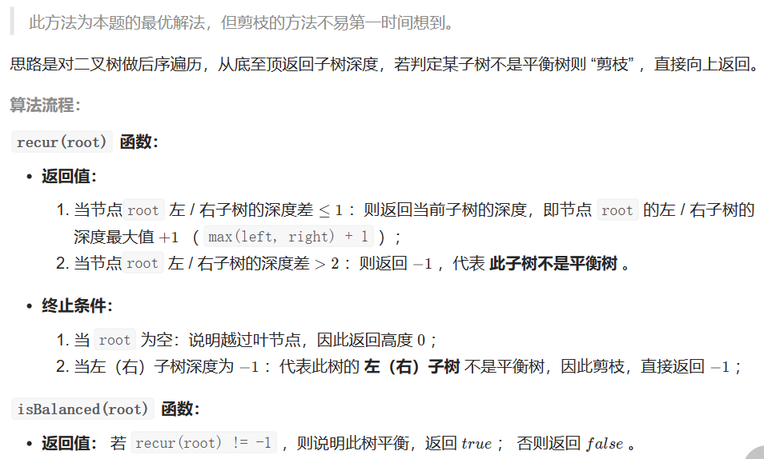

```cpp
class Solution {
public:
    int recur(TreeNode* node){
        if(node==nullptr) return 0;
        int left=recur(node->left);
        if(left==-1) return -1;
        int right=recur(node->right);
        if(right==-1) return -1;
        return abs(left-right)<2?max(left, right)+1:-1;
    }

    bool isBalanced(TreeNode* root) {
        return recur(root)!=-1;
    }
};
```

##### 方法2：自顶向下的递归

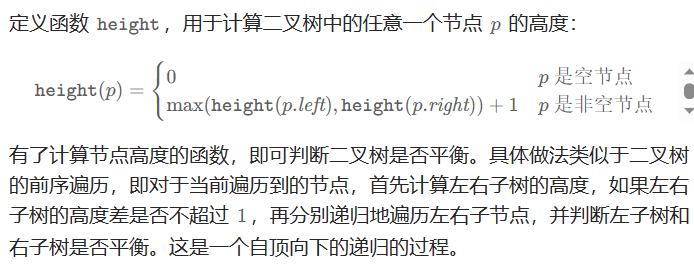

```cpp
class Solution {
public:
    int height(TreeNode* root){
        if(root==nullptr) return 0;
        return max(height(root->left), height(root->right))+1;
    }

    bool isBalanced(TreeNode* root) {
        if(root==nullptr) return true;
        return abs(height(root->left)-height(root->right))<=1 && isBalanced(root->left) && isBalanced(root->right);
    }
};
```


#### **JZ77** **按之字形顺序打印二叉树**

```cpp
#include <vector>
class Solution {
public:
    /**
     * 代码中的类名、方法名、参数名已经指定，请勿修改，直接返回方法规定的值即可
     *
     * 
     * @param pRoot TreeNode类 
     * @return int整型vector<vector<>>
     */
    vector<vector<int> > Print(TreeNode* pRoot) {
        if(pRoot==nullptr) return {};
        vector<vector<int>> result;
        queue<TreeNode*> q;
        q.push(pRoot);
        bool flag=false;
        while(!q.empty()){
            int size=q.size();
            vector<int> vec;
            for(int i=0;i<size;i++){
                TreeNode* node=q.front();
                vec.push_back(node->val);
                q.pop();
                if(node->left) q.push(node->left);
                if(node->right) q.push(node->right);
            }

            flag=!flag;
            if(flag){
                result.push_back(vec);
            }
            else{
                result.push_back(vector<int>(vec.rbegin(), vec.rend()));
            }
                
            
        }

        return result;

    }
};
```


## 算法

### 多指针

#### 57 - II. 和为s的连续正数序列

```cpp
class Solution {
public:
    vector<vector<int>> findContinuousSequence(int target) {
        vector<vector<int>> result;
        int low=1, high=2;
        while(low<high){
            int sum =(low+high)*(high-low+1)/2;
            if(sum<target){
                high++;
            }
            else if(sum>target){
                low++;
            }
            else{
                vector<int> vec;
                for(int i=low;i<=high;i++){
                    vec.push_back(i);
                }
                result.push_back(vec);
                low++;
            }
        }

        return result;

    }
};
```


#### 58 - I. 翻转单词顺序

##### 方法1：双指针法

[剑指 Offer 58 - I. 翻转单词顺序 - 力扣（LeetCode）](https://leetcode.cn/problems/fan-zhuan-dan-ci-shun-xu-lcof/solutions/195224/mian-shi-ti-58-i-fan-zhuan-dan-ci-shun-xu-shuang-z/)

```cpp
class Solution {
public:
    string reverseWords(string s) {
        int n = s.size(); 
        string res = "";
        for(int i=n-1; i>=0; --i){ // 从尾部开始循环
            if(s[i] != ' '){ // 找到一个非空字符
                int right = i; // 记录这个非空字符的右边起始位置
                while(s[i] != ' ' && i>=0){ // 看看这个非空字符有多少个连着的
                    --i;
                    if(i==-1) break; // 找到头了
                }
                res += s.substr(i+1, right-i) + " "; // 将这个连续的非空字符添加到结果中
            }
        }
        return res.substr(0, res.size()-1); // 去掉最后一个空字符
    }
};
```


#### 49. 丑数

丑数（Ugly Number）是指只包含质因子2、3和5的正整数。换句话说，如果一个正整数只能被2、3和5整除，而不能被其他质数整除，那么它就是一个丑数。

丑数序列的前几个数是：1, 2, 3, 4, 5, 6, 8, 9, 10, 12, 15, 16, 18, 20, 24, ...

可以观察到，丑数可以通过将较小的丑数乘以2、3或5来获得。例如，2是第一个丑数，将它乘以2得到4，将4乘以2得到8，以此类推。同样地，将2乘以3得到6，将2乘以5得到10，以及将3乘以3得到9等。

```cpp
class Solution {
public:
    int nthUglyNumber(int n) {
        if(n<7) return n;
        vector<int> result(n,0);
        result[0]=1;
        int twoIndex=0, threeIndex=0, fiveIndex=0;
        for(int i=1;i<n;i++){
            // cout<<i<<endl;
            int minNum=min(min(result[twoIndex]*2, result[threeIndex]*3), result[fiveIndex]*5);
            if(minNum==result[twoIndex]*2) twoIndex++;
            if(minNum==result[threeIndex]*3) threeIndex++;
            if(minNum==result[fiveIndex]*5) fiveIndex++;
            result[i]=minNum;
        }
        return result[n-1];
    }
};
```


#### 21. 调整数组顺序使奇数位于偶数前面

##### 方法1：双指针

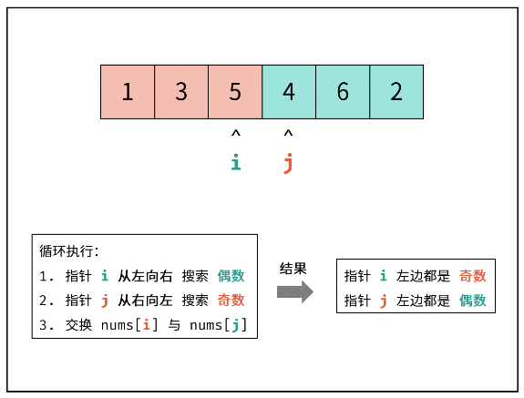

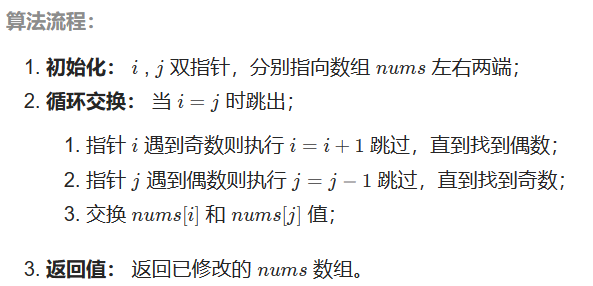

```cpp
class Solution {
public:
    vector<int> exchange(vector<int>& nums) {
        int i=0, j=nums.size()-1;
        while(i<j){
            while(i<j && nums[i]%2==1) i++;
            while(i<j && nums[j]%2==0) j--;
            swap(nums[i], nums[j]);
        }
        return nums;
    }
};
```

##### 第2次：奇数位于偶数前且相对顺序不变

```cpp
class Solution {
  public:
    /**
     * 代码中的类名、方法名、参数名已经指定，请勿修改，直接返回方法规定的值即可
     *
     *
     * @param array int整型vector
     * @return int整型vector
     */
    vector<int> reOrderArray(vector<int>& array) {
        // write code here
        vector<int> odd;
        int len = array.size();
        for (int i = 0; i < len; i++) {
            if (array[i] % 2 == 1) {
                odd.push_back(array[i]);
            }
        }

        for (int i = 0; i < len; i++) {
            if (array[i] % 2 == 0) {
                odd.push_back(array[i]);
            }
        }
        return odd;
    }
};
```


#### 48. 最长不含重复字符的子字符串

使用滑动窗口算法来解决问题。我们使用两个指针 `left` 和 `right` 表示滑动窗口的左右边界。我们还使用一个哈希集合 `charSet` 来存储当前窗口中的字符集合。

我们从左到右遍历字符串，不断移动右指针。对于每个字符，我们检查它是否已经在当前窗口中存在。如果存在，我们移动左指针，并从字符集合中移除对应的字符，直到窗口中不再包含重复的字符。

然后，我们将当前字符加入窗口，并更新最长子字符串的长度。最后，我们将右指针向右移动，继续遍历下一个字符。

通过遍历整个字符串，我们可以找到最长的不包含重复字符的子字符串的长度。

```cpp
class Solution {
public:
    int lengthOfLongestSubstring(string s) {
        int n = s.length();
        int left = 0, right = 0; // 滑动窗口的左右指针
        int maxLength = 0; // 最长子字符串的长度
        unordered_set<char> charSet; // 用于存储当前窗口中的字符集合

        while (right < n) {
            // 如果当前字符已经在窗口中存在，则移动左指针，并从字符集合中移除对应的字符
            while (charSet.count(s[right]) > 0) {
                charSet.erase(s[left]);
                left++;
            }

            // 将当前字符加入窗口，并更新最长子字符串的长度
            charSet.insert(s[right]);
            maxLength = max(maxLength, right - left + 1);

            right++; // 右指针向右移动
        }

        return maxLength;
    }
};
```


##### 第2次

```cpp
class Solution {
public:
    int lengthOfLongestSubstring(string s) {
        if(s.size()==0) return 0;
        int maxStr=0;
        int left=0;
        unordered_set<char> lookup;
        for(int i=0;i<s.size();i++){
            while(lookup.find(s[i])!=lookup.end()){
                lookup.erase(s[left]);
                left++;
            }
            maxStr=max(maxStr, i-left+1);
            lookup.insert(s[i]);
        }

        return maxStr;

    }
};
```


### 递归

#### 62. 圆圈中最后剩下的数字

[剑指 Offer 62. 圆圈中最后剩下的数字 - 力扣（LeetCode）](https://leetcode.cn/problems/yuan-quan-zhong-zui-hou-sheng-xia-de-shu-zi-lcof/solutions/607638/jian-zhi-offer-62-yuan-quan-zhong-zui-ho-dcow/)

```cpp
class Solution {
public:
    int lastRemaining(int n, int m) {
        if(n<=0 || m<0) return -1;
        // n为1时，可直接的res=0
        int res=0;
        for(int i=2;i<=n;i++){
            res=(res+m)%i;
        }
        return res;
    }
};                                                                            
```

##### 第2次：最直观的做法

```cpp
#include <iostream>
#include <vector>

class Solution {
public:
    int LastRemaining_Solution(int n, int m) {
        if (n == 0)
            return -1;
        
        std::vector<int> array;
        for (int i = 0; i < n; i++) {
            array.push_back(i);
        }
        
        int index = (m - 1) % array.size();
        
        while (array.size() != 1) {
            array.erase(array.begin() + index);
            index = (index + (m - 1)) % array.size();
        }
        
        return array[0];
    }
};

```


#### 36. 二叉搜索树与双向链表

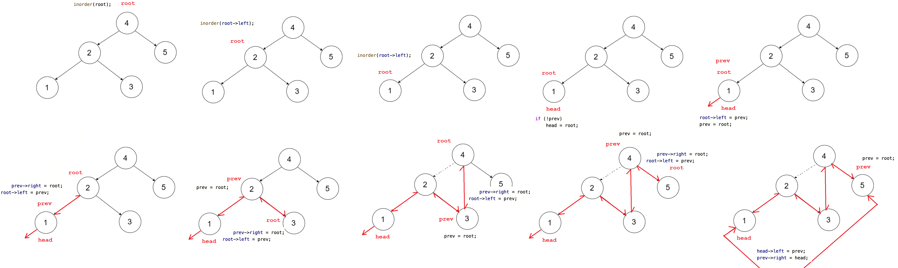

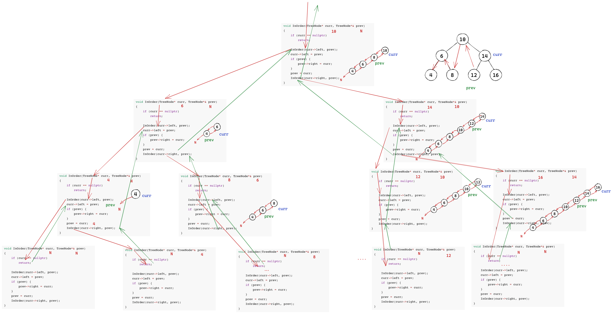

```cpp
/*
// Definition for a Node.
class Node {
public:
    int val;
    Node* left;
    Node* right;

    Node() {}

    Node(int _val) {
        val = _val;
        left = NULL;
        right = NULL;
    }

    Node(int _val, Node* _left, Node* _right) {
        val = _val;
        left = _left;
        right = _right;
    }
};
*/
class Solution {
public:
    Node *head, *pre;
    void dfs(Node* cur){
        if(cur==nullptr) return;
        dfs(cur->left);

        //pre用于记录双向链表中位于cur左侧的节点，即上一次迭代中的cur,当pre==null时，cur左侧没有节点,即此时cur为双向链表中的头节点
        if(pre==nullptr) head=cur;
        //反之，pre!=null时，cur左侧存在节点pre，需要进行pre.right=cur的操作。
        else pre->right=cur;
        
        //pre是否为null对这句没有影响,且这句放在上面两句if else之前也是可以的。
        cur->left=pre;
        
		//pre指向当前的cur
        pre=cur;
        //全部迭代完成后，pre指向双向链表中的尾节点
        dfs(cur->right);
    }

    Node* treeToDoublyList(Node* root) {
        if(root==nullptr) return nullptr;
        dfs(root);

        //进行头节点和尾节点的相互指向，这两句的顺序也是可以颠倒的
        pre->right=head;
        head->left=pre;

        return head;
    }
};
```

##### 牛客上的

```cpp
/*
struct TreeNode {
	int val;
	struct TreeNode *left;
	struct TreeNode *right;
	TreeNode(int x) :
			val(x), left(NULL), right(NULL) {
	}
};*/
class Solution {
public:
	TreeNode* head, *pre;
	void helper(TreeNode* cur){
		if(cur==nullptr) return;
		helper(cur->left);

		if(pre==nullptr ) head=cur;
		else pre->right=cur;

		cur->left=pre;
		pre=cur;
		helper(cur->right);


	}

    TreeNode* Convert(TreeNode* pRootOfTree) {
        if(pRootOfTree==nullptr) return nullptr;
		helper(pRootOfTree);

		return head;

    }
};

```


### 回溯

#### 13. 机器人的运动范围

##### 方法1：借助标记法

不算回溯法

```cpp
class Solution {
public:
    bool canReach(int threshold, int x, int y){
        int sum=0;
        while(x>0){
            sum+=x%10;
            x/=10;
        }
        while(y>0){
            sum+=y%10;
            y/=10;
        }
        return sum<=threshold;
    }

    int helper(int threshold, int i, int m, int j, int n, vector<vector<bool>>& visit){
        if(i<0 || i>=m || j<0 || j>=n || canReach(threshold, i, j)==false ||visit[i][j]==true) return 0;
        visit[i][j]=true;

        return helper(threshold, i-1, m, j, n, visit)+
               helper(threshold, i+1, m, j, n, visit)+
               helper(threshold, i, m, j-1, n, visit)+
               helper(threshold, i, m, j+1, n, visit)+1;
    }

    int movingCount(int m, int n, int k) {
        vector<vector<bool>> visit(m, vector<bool>(n, false));
        return helper(k, 0, m, 0, n, visit);
    }
};
```


#### 12. 矩阵中的路径

##### 方法1：回溯

```cpp
class Solution {
public:
    /*参数说明  k 字符串索引初始为0即先判断字符串的第一位*/
    bool helper(vector<vector<char>>& board, int i, int m, int j, int n, int k, string word, vector<vector<bool>>& visit){
        if(i<0 || i>=m || j<0 || j>=n || board[i][j]!=word[k] || visit[i][j]==true) return false;
        // 已匹配完整
        if(k==word.size()-1) return true;
        // 标记访问过
        visit[i][j]=true;
        if(helper(board, i-1, m, j, n, k+1, word, visit ) || 
           helper(board, i+1, m, j, n, k+1, word, visit) || 
           helper(board, i, m, j-1, n, k+1, word, visit) ||
           helper(board, i, m, j+1, n, k+1, word, visit)){
               return true;
        }
        // 走到这，说明这一条路不通，还原，再试其他的路径
        visit[i][j]=false;
        return false;
    }

    bool exist(vector<vector<char>>& board, string word) {
        
        int m=board.size(), n=board[0].size();
        if (board.empty() || m < 1 || n < 1 || word.empty()) return false;
        vector<vector<bool>> visit(m, vector<bool>(n, false));
        for(int i=0;i<m;i++){
            for(int j=0;j<n;j++){
                if(helper(board, i, m, j, n, 0, word, visit))
                {
                    return true;
                }
            }
        }
        return false;
    }
};
```


#### 38. 字符串的排列

DFS+回溯算法

时间和空间复杂度都不太好

```cpp
class Solution {
public:
    vector<string>  result;
    void PermutationCore(string &s,int begin,int end){
        if(begin == end){
            result.push_back(s);
            return ;
        }
        unordered_map<int,int> visited;
        for(int i = begin; i<= end; ++i){
            if(visited[s[i]] == 1) continue;
            swap(s[i],s[begin]);
            PermutationCore(s,begin+1,end);
            swap(s[i],s[begin]);
            visited[s[i]] =1;

        }

    }
    
    vector<string> permutation(string str) {
    if(str.size()==0) return vector<string>();
    
    PermutationCore(str,0,str.size()-1);
    sort(result.begin(),result.end());
	return  result;
    }
};
```

##### 第2次：

```cpp
class Solution {
public:
    vector<string> permutation(string s) {
        dfs(s, 0);
        return res;
    }
private:
    vector<string> res;
    void dfs(string s, int x) {
        if(x == s.size() - 1) {
            res.push_back(s);                       // 添加排列方案
            return;
        }
        set<int> st;
        for(int i = x; i < s.size(); i++) {
            if(st.find(s[i]) != st.end()) continue; // 重复，因此剪枝
            st.insert(s[i]);
            swap(s[i], s[x]);                       // 交换，将 s[i] 固定在第 x 位
            dfs(s, x + 1);                          // 开启固定第 x + 1 位字符
            swap(s[i], s[x]);                       // 恢复交换
        }
    }
};

```

##### 第3种

[剑指 Offer 38. 字符串的排列 - 力扣（LeetCode）](https://leetcode.cn/problems/zi-fu-chuan-de-pai-lie-lcof/solutions/839108/dai-ma-sui-xiang-lu-jian-zhi-offer-38-zi-gwt6/)

字符串

```cpp
// 正解 回溯三部曲
class Solution {
public:
    vector<string> res;
    string comb = "";
    vector<string> permutation(string s) {
        vector<bool> used(s.size(), false); 
        sort(s.begin(), s.end());
        backtracking(s, used);
        return res;
    }

    void backtracking(const string& s, vector<bool>& used){
        if(comb.size() == s.size()){
            res.push_back(comb);
            return;
        }
        for(int i=0; i<s.size(); i++){
            if(used[i] == true){
                continue;
            }
            if(i>0 && s[i] == s[i-1] && used[i-1] == false){
                continue;
            }
            comb.push_back(s[i]);
            used[i] = true;
            backtracking(s, used);
            used[i] = false;
            comb.pop_back();
        }
    }
};
```

数组

```cpp
class Solution {
private:
    vector<vector<int>> result;
    vector<int> path;
    void backtracking (vector<int>& nums, vector<bool>& used) {
        // 此时说明找到了一组
        if (path.size() == nums.size()) {
            result.push_back(path);
            return;
        }
        for (int i = 0; i < nums.size(); i++) {
            // used[i - 1] == true，说明同一树支nums[i - 1]使用过
            // used[i - 1] == false，说明同一树层nums[i - 1]使用过
            // 如果同一树层nums[i - 1]使用过则直接跳过
            if (i > 0 && nums[i] == nums[i - 1] && used[i - 1] == false) {
                continue;
            }
            if (used[i] == false) {
                used[i] = true;
                path.push_back(nums[i]);
                backtracking(nums, used);
                path.pop_back();
                used[i] = false;
            }
        }
    }
public:
    vector<vector<int>> permuteUnique(vector<int>& nums) {
        result.clear();
        path.clear();
        sort(nums.begin(), nums.end()); // 排序
        vector<bool> used(nums.size(), false);
        backtracking(nums, used);
        return result;
    }
};

```


### 动态规划


#### 42、连续子数组的最大和

##### 方法一：动态规划

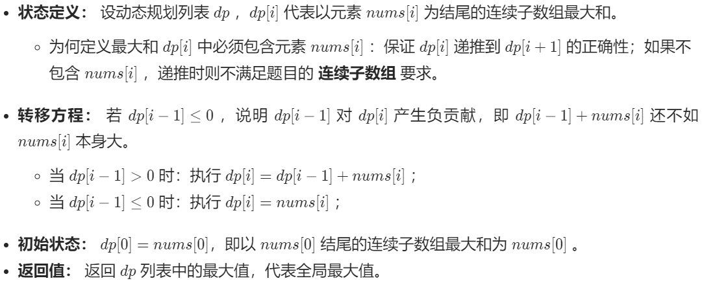

```cpp
class Solution {
public:
	int maxSubArray(vector<int>& nums) {
        //初始化最大值为nums第一个数
		int maxAns = nums[0];
		for (int i = 1; i < nums.size(); ++i) {
			nums[i] += max(nums[i - 1], 0);
			maxAns = max(maxAns, nums[i]);
		}
		return maxAns;	
	}
};


class Solution {
public:
    int maxSubArray(vector<int>& nums) {
        int len=nums.size();
        vector<int> dp(len, 0);
        dp[0]=nums[0];
        int result=nums[0];
        for(int i=1;i<nums.size();i++){
            if(dp[i-1]>0){
                dp[i]=dp[i-1]+nums[i];
            }
            else{
                dp[i]=nums[i];
            }

            result=max(result, dp[i]);
        }
        return result;
    }
};
```

#### **JZ85** **连续子数组的最大和(二)**

```cpp
class Solution {
  public:
    /**
     * 代码中的类名、方法名、参数名已经指定，请勿修改，直接返回方法规定的值即可
     *
     *
     * @param array int整型vector
     * @return int整型vector
     */
    vector<int> FindGreatestSumOfSubArray(vector<int>& array) {
        // write code here
        vector<int> res;
        vector<int> dp(array.size(), 0); //记录到下标i为止的最大连续子数组和
        dp[0] = array[0];
        int maxsum = dp[0];
        int left = 0, right = 0; //滑动区间
        int resl = 0, resr = 0; //记录最长的区间
        for (int i = 1; i < array.size(); i++) {
            right++;
            dp[i] = max(dp[i - 1] + array[i], array[i]); //状态转移：连续子数组和最大值
            if (dp[i - 1] + array[i] < array[i]) //区间新起点
                left = right;
            if (dp[i] > maxsum || dp[i] == maxsum &&
                    (right - left + 1) > (resr - resl + 1)) { //更新最大值
                maxsum = dp[i];
                resl = left;
                resr = right;
            }
        }
        for (int i = resl; i <= resr; i++) //取数组
            res.push_back(array[i]);
        return res;
        

    }
};
```


#### 42、斐波那契数列

##### 方法一：动态规划

```cpp
class Solution {
public:
	int fib(int n) {
		if (n <= 1) {
			return n;
		}
		int pre1 = 0, pre2 = 1;
		int cur;
		for (int i = 2; i <= n; ++i) {
            //题目有一个取模操作的要求
			cur = (pre1 + pre2) % 1000000007;
			pre1 = pre2;
			pre2 = cur;
		}
		return cur;
	}
};
```

##### 第2次：

```cpp
class Solution {
public:
    int fib(int n) {
        if(n<=1) return n;
        vector<int> dp(n+1);
        dp[0]=0;
        dp[1]=1;
        for(int i=2;i<=n;i++){
            dp[i]=(dp[i-1]+dp[i-2])%1000000007;
        }

        return dp[n];
    }
};

class Solution {
public:
	int fib(int n) {
		if (n <= 1) return n;
		int dp[2];
        // 初始值
		dp[0] = 0;
		dp[1] = 1;
		for (int i = 2; i <= n; i++) {
            // 递推公式，状态转移方程
			int sum = dp[0] + dp[1];
			dp[0] = dp[1];
			dp[1] = sum;
		}
		return dp[1];
	}
};
```


#### 46、把数字翻译成字符串

##### 方法1：动态规划

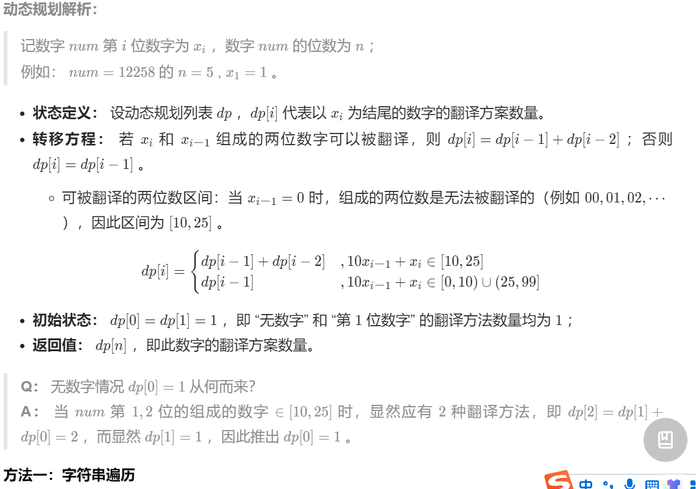

```cpp
class Solution {
public:
	int translateNum(int num) {
		int a = 1, b = 1;
		int c = 1;
        //求余
		int x, y = num % 10;
		while (num != 0) {
            //取整
			num /= 10;
            //其实是从右往左的遍历
			x = num % 10;
			int tmp = 10 * x + y;
			c = (tmp >= 10 && tmp <= 25) ? a + b : b;
			a = b;
			b = c;
			y = x;
		}
		return c;
	}
};
```


#### **JZ46** **把数字翻译成字符串**

[【JZ46 把数字翻译成字符串】_事a将数字编码成小写字母来交流:a>1,b->2以此类推“a至z但是由于没有分隔符,数字-CSDN博客](https://blog.csdn.net/Sugar_wolf/article/details/124333220)

```cpp
class Solution {
    public:
    int solve(string nums) {
        int len = nums.size();
        if (len == 0)
            return 0;
        for (int k = 0;k < len;k++)
        {
            if (nums[k]=='0')
            {
                if (k == 0)
                    return 0;
                else if (nums[k-1] != '1' && nums[k-1] != '2')
                    return 0;
            }
        }//如果0位于第一位或者0的前面不是1或者2，则无法进行译码
        int dp[len+1],temp;
        dp[0] = 1;
        dp[1] = 1;
        for (int k=1;k<len;k++)
        {
            temp=(nums[k]-'0')+(nums[k-1]-'0')*10;
            if (temp > 0 && temp <= 26 && nums[k]!= '0'&& nums[k-1] != '0')
                dp[k+1] = dp[k]+dp[k-1];
            else
                dp[k+1] = dp[k];
        }
        return dp[len];
    }
};

```


#### 63、股票的最大利润

##### 方法1：动态规划

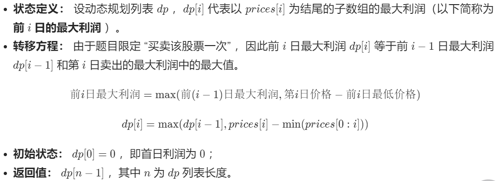

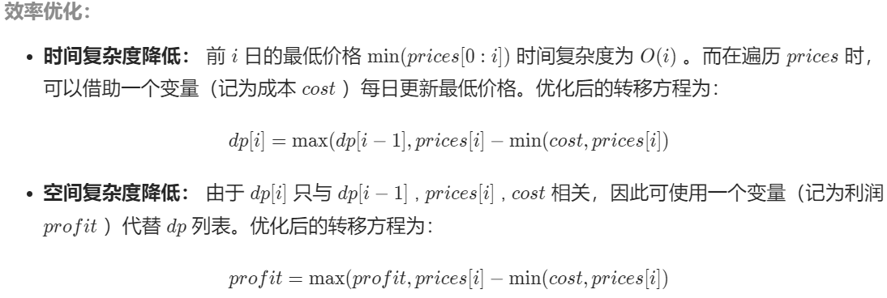

```cpp
class Solution {
public:
	int maxProfit(vector<int>& prices) {
		int cost = INT_MAX;
		int profit = 0;
		for (auto price:prices) {
			cost = min(cost, price);
			profit = max(profit, price - cost);
		}
		return profit;
	}
};
```

#### 47、礼物的最大值

##### 方法1：写的比较差的动态规划

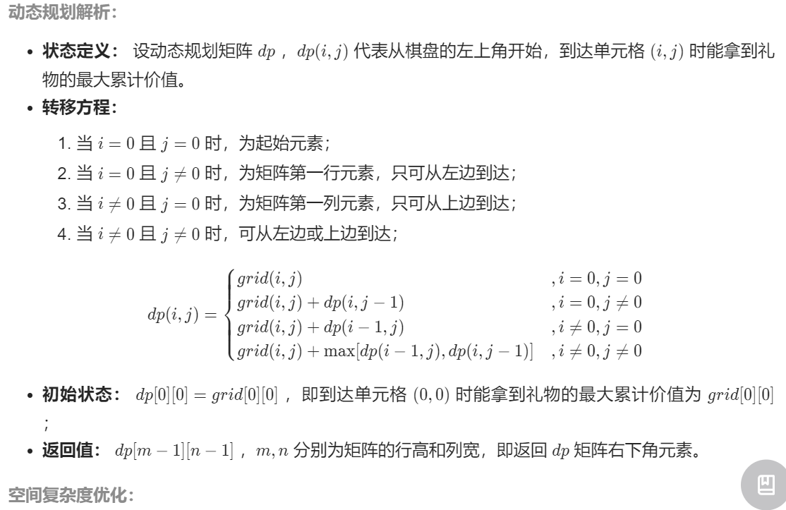

```cpp
class Solution {
public:
	int maxValue(vector<vector<int>>& grid) {
		int m = grid.size();
		int n = grid[0].size();
		vector<vector<int>> dp(m, vector<int>(n, 0));
		for (int i = 0; i < m; ++i) {
			for (int j = 0; j < n; ++j) {
				if (i == 0 && j == 0) {
					dp[i][j] = grid[i][j];
				}
				else if (i == 0) {
					dp[i][j] = dp[i][j - 1] + grid[i][j];
				}
				else if (j == 0) {
					dp[i][j] = dp[i - 1][j] + grid[i][j];
				}
				else {
					dp[i][j] = max(dp[i - 1][j], dp[i][j - 1]) + grid[i][j];
				}
			}
		}
		return dp[m - 1][n - 1];
	}
};
```

##### 方法2：优化一点空间复杂度的动态规划

```cpp
//牺牲内存，优化一点时间复杂度
//方法：多开一行一列的空间，省略边界条件的判断
class Solution {
public:
	int maxValue(vector<vector<int>>& grid) {
		int m = grid.size();
		int n = grid[0].size();
		vector<vector<int>> dp(m + 1, vector<int>(n + 1, 0));
		for (int i = 1; i < m + 1; ++i) {
			for (int j = 1; j < n + 1; ++j) {
				dp[i][j] = max(dp[i - 1][j], dp[i][j - 1]) + grid[i-1][j-1];
			}
		}
		return dp[m][n];
	}
};
```


```cpp
class Solution {
public:
    int maxValue(vector<vector<int>>& grid) {
        int m = grid.size(), n = grid[0].size();
        vector<int> dp(n + 1, 0);
        for (int i = 0; i < m; ++i) 
            for (int j = 1; j <= n; ++j) 
                dp[j] = max(dp[j - 1], dp[j]) + grid[i][j - 1];
        return dp[n];
    }
};
```


解这题需要把题意仔细研究清楚，反正我试了好多次才明白的。

 首先，**考虑特殊情况**： 1. 两个字符串都为空，返回true  2.当第一个字符串不空，而第二个字符串空了，返回false（因为这样，就无法 匹配成功了,而如果第一个字符串空了，第二个字符串非空，还是可能匹配成 功的，比如第二个字符串是“aaaa”,由于‘’之前的元素可以出现0次， 所以有可能匹配成功） 之后就开始匹配第一个字符，这里有两种可能：**匹配成功或匹配失败**。

 但考虑到pattern 下一个字符可能是‘’， 这里我们分两种情况讨论：pattern下一个字符为‘’或 不为‘’： 1. pattern下一个字符不为‘’：这种情况比较简单，直接匹配当前字符。如果 匹配成功，继续匹配下一个；如果匹配失败，直接返回false。

 注意这里的 “匹配成功”，除了两个字符相同的情况外，还有一种情况，就是pattern的 当前字符为‘.’,同时str的当前字符不为‘\0’。 2. pattern下一个字符为‘’时，稍微复杂一些，因为‘’可以代表0个或多个。

 这里把这些情况都考虑到： a>当‘’匹配0个字符时，str当前字符不变，pattern当前字符后移两位， 跳过这个‘’符号； b>当‘’匹配1个或多个时，str当前字符移向下一个，pattern当前字符 不变。

（这里匹配1个或多个可以看成一种情况，因为：当匹配一个时， 由于str移到了下一个字符，而pattern字符不变，就回到了上边的情况a； 当匹配多于一个字符时，相当于从str的下一个字符继续开始匹配） 之后再写代码就很简单了。


#### 10- II. 青蛙跳台阶问题

> 求多少种可能性的题目一般都有递推性质

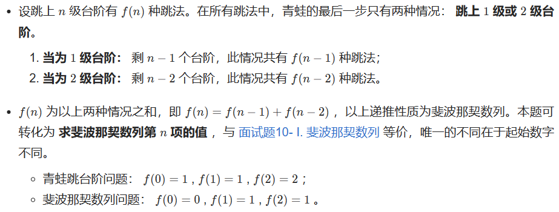

```cpp
class Solution {
public:
    int numWays(int n) {
        if(n==0) return 1;
        if(n==1) return 1;
        vector<int> dp(n+1);
        dp[0]=1;
        dp[1]=1;
        for(int i=2;i<n+1;i++){
            
            dp[i]=(dp[i-1]+dp[i-2])%1000000007;
        }
        return dp[n];
    }
};
```


#### **JZ71** **跳台阶扩展问题**

关于本题，前提是n个台阶会有一次n阶的跳法。分析如下:

f(1) = 1

f(2) = f(2-1) + f(2-2)         //f(2-2) 表示2阶一次跳2阶的次数。

f(3) = f(3-1) + f(3-2) + f(3-3) 

...

f(n) = f(n-1) + f(n-2) + f(n-3) + ... + f(n-(n-1)) + f(n-n) 

 

说明： 

1）这里的f(n) 代表的是n个台阶有一次1,2,...n阶的 跳法数。

2）n = 1时，只有1种跳法，f(1) = 1

3) n = 2时，会有两个跳得方式，一次1阶或者2阶，这回归到了问题（1） ，f(2) = f(2-1) + f(2-2) 

4) n = 3时，会有三种跳得方式，1阶、2阶、3阶，

​    那么就是第一次跳出1阶后面剩下：f(3-1);第一次跳出2阶，剩下f(3-2)；第一次3阶，那么剩下f(3-3)

​    因此结论是f(3) = f(3-1)+f(3-2)+f(3-3)

5) n = n时，会有n中跳的方式，1阶、2阶...n阶，得出结论：

​    f(n) = f(n-1)+f(n-2)+...+f(n-(n-1)) + f(n-n) => f(0) + f(1) + f(2) + f(3) + ... + f(n-1)

​    

6) 由以上已经是一种结论，但是为了简单，我们可以继续简化：

​    f(n-1) = f(0) + f(1)+f(2)+f(3) + ... + f((n-1)-1) = f(0) + f(1) + f(2) + f(3) + ... + f(n-2)

​    f(n) = f(0) + f(1) + f(2) + f(3) + ... + f(n-2) + f(n-1) = f(n-1) + f(n-1)

​    可以得出：

​    f(n) = 2*f(n-1)

​    

7) 得出最终结论,在n阶台阶，一次有1、2、...n阶的跳的方式时，总得跳法为：

​              | 1       ,(n=0 ) 

f(n) =     | 1       ,(n=1 )

​              | 2*f(n-1),(n>=2)

```cpp
class Solution {
public:
    /**
     * 代码中的类名、方法名、参数名已经指定，请勿修改，直接返回方法规定的值即可
     *
     * 
     * @param number int整型 
     * @return int整型
     */
    int jumpFloorII(int number) {
        // write code here

        if(number==0){
            return 1;
        }
        else if(number==1) {
            return 1;
        }
        else{
            return 2*jumpFloorII(number-1);
        }
    }
};
```


#### 60. n个骰子的点数

[剑指 Offer 60. n个骰子的点数 - 力扣（LeetCode）](https://leetcode.cn/problems/nge-tou-zi-de-dian-shu-lcof/solutions/106630/nge-tou-zi-de-dian-shu-dong-tai-gui-hua-ji-qi-yo-3/)

```cpp
class Solution {
public:
    vector<double> twoSum(int n) {
//定义一个数组保存所有状态，一维是第n次时，二维为第n次时所有可能情况
        int dp[15][70]={0};
//我们只能知道第一次的情况，也是边界条件
        for(int i=1;i<=6;i++)
        {
            dp[1][i]=1;
        }
//一层循环，每多一个色子的情况
        for(int i=2;i<=n;i++)
        {
//二层循环是这么多色子情况下的所有可能和
            for(int j=i;j<=6*i;j++)
            {
//三层循环是为了找到能得到这种可能和时，对于少一个色子时的所有可能情况，相加即是当前可能总和
                for(int cur=1;cur<=6;cur++)
                {
                    if(j-cur<=0) break;
                     dp[i][j]+=dp[i-1][j-cur];
                }
            }
        }
//第n次的所有可能情况
        int all=pow(6,n);
        vector<double> res;
//push 到res中
        for(int i=n;i<=6*n;i++)
        {
        //实现整形到浮点型的转换
        res.push_back(dp[n][i]*1.0/all);
        }        
        return res;  
    }
};
```

**JZ70** **矩形覆盖**

依旧是斐波那契数列

`2*n`的大矩形，和n个`2*1`的小矩形

其中`target*2`为大矩阵的大小

有以下几种情形：

1 target <= 0 大矩形为<= `2*0`,直接return 1；

2 target = 1大矩形为`2*1`，只有一种摆放方法，return1；

3 target = 2 大矩形为`2*2`，有两种摆放方法，return2；

4 target = n 分为两步考虑：

​        第一次摆放一块 2*1 的小矩阵，则摆放方法总共为f(target - 1)

| √    |      |      |      |      |      |      |      |
| ---- | ---- | ---- | ---- | ---- | ---- | ---- | ---- |
| √    |      |      |      |      |      |      |      |

第一次摆放一块`1*2`的小矩阵，则摆放方法总共为f(target-2)

因为，摆放了一块`1*2`的小矩阵（用√√表示），对应下方的`1*2`（用××表示）摆放方法就确定了，所以为f(targte-2)

| √    | √    |      |      |      |      |      |      |
| ---- | ---- | ---- | ---- | ---- | ---- | ---- | ---- |
| ×    | ×    |      |      |      |      |      |      |

```cpp
class Solution {
public:
    int rectCover(int number) {
        if(number==0){
            return 0;
        }

        if(number*2==2){
            return 1;
        }
        else if(number*2==4){
            return 2;
        }
        else{
            return rectCover(number-1)+rectCover(number-2);
        }
    }
};
```


### 二分查找

#### 53 - I. 在排序数组中查找数字 I

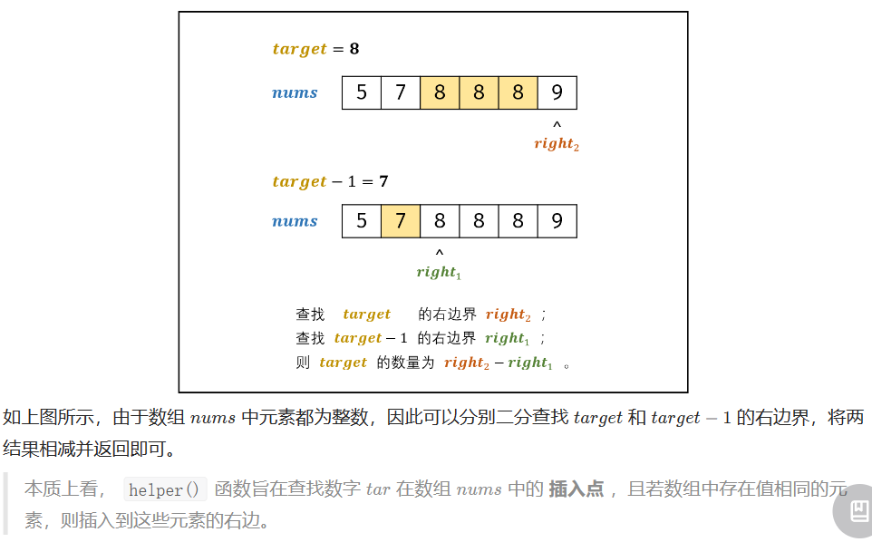

很巧妙地去查找右边界，target-1

```cpp
class Solution {
public:
    int helper(vector<int>& nums, int target){
        int i=0,j=nums.size()-1;
        
        while(i<=j){
            int mid=(i+j)/2;
            if(nums[mid]<=target) i=mid+1;
            else{
                j=mid-1;
            }
            
        }
        // 这是右边界
        return i;
    }

    int search(vector<int>& nums, int target) {
        return helper(nums, target)-helper(nums, target-1);
    }
};
```


#### 11. 旋转数组的最小数字


```cpp
class Solution {
public:
    int minArray(vector<int>& numbers) {
        int n=numbers.size();
        int l=0, r=n-1;
        while(l<r){
            int mid=l+(r-l)/2;
            if(numbers[mid]>numbers[r]){
                l=mid+1;
            }
            else if(numbers[mid]<numbers[r]){
                r=mid;
            }
            else{
                r--;
            }
        }
        return numbers[l];
        // return numbers[r]; r、l相等一样
    }
};
```


#### 53 - II. 0～n-1中缺失的数字

##### 方法1：二分查找

```cpp
class Solution {
public:
    int missingNumber(vector<int>& nums) {
        int l=0, r=nums.size()-1;
        int res=-1;
        while(l<=r){
            int m=l+(r-l)/2;
            if(nums[m]==m){
                l=m+1;
            }
            else{
                res=m;
                r=m-1;
            }
        }

        return res==-1?nums.size():res;
    }
};
```


### 模拟

#### 20. 表示数值的字符串

```cpp
class Solution {
private:
    // 整数的格式可以用[+|-]B表示, 其中B为无符号整数
    bool scanInteger(const string s, int& index){

        if(s[index] == '+' || s[index] == '-')
            ++index;

        return scanUnsignedInteger(s, index);
    }
    
    bool scanUnsignedInteger(const string s, int& index){

        int befor = index;
        while(index != s.size() && s[index] >= '0' && s[index] <= '9')
            index ++;

        return index > befor;
    }
public:
    // 数字的格式可以用A[.[B]][e|EC]或者.B[e|EC]表示，
    // 其中A和C都是整数（可以有正负号，也可以没有），而B是一个无符号整数
    bool isNumber(string s) {

        if(s.size() == 0)
            return false;
        int index = 0;

        //字符串开始有空格，可以返回true
        while(s[index] == ' ')  //书中代码没有该项测试
            ++index;

        bool numeric = scanInteger(s, index);

        // 如果出现'.'，接下来是数字的小数部分
        if(s[index] == '.'){

            ++index;

            // 下面一行代码用||的原因：
            // 1. 小数可以没有整数部分，例如.123等于0.123；
            // 2. 小数点后面可以没有数字，例如233.等于233.0；
            // 3. 当然小数点前面和后面可以有数字，例如233.666
            numeric = scanUnsignedInteger(s, index) || numeric;
        }

        // 如果出现'e'或者'E'，接下来跟着的是数字的指数部分
        if(s[index] == 'e' || s[index] == 'E'){

            ++index;

            // 下面一行代码用&&的原因：
            // 1. 当e或E前面没有数字时，整个字符串不能表示数字，例如.e1、e1；
            // 2. 当e或E后面没有整数时，整个字符串不能表示数字，例如12e、12e+5.4
            numeric = numeric && scanInteger(s ,index);
        }

        //字符串结尾有空格，可以返回true
        while(s[index] == ' ')
            ++index;
        // cout << s.size() << " " << index;   //调试用

        return numeric && index == s.size();
    }
};
```

##### 第2次

```cpp
class Solution {
public:
    bool scanUnsignedInteger(string& s, int& index){
        int before=index;
        while(index!=s.size() && s[index]>='0' && s[index]<='9'){
            ++index;
        }
        return index>before;
    }

    bool scanInteger(string& s, int& index){
        if(s[index]=='+' || s[index]=='-'){
            ++index;
        }
        return scanUnsignedInteger(s, index);
    }

    bool isNumber(string s) {
        if(s.size()==0){
            return false;
        }
        int index=0;
        while(s[index]==' '){
            ++index;
        }

        bool numeric =  scanInteger(s, index);

        if(s[index]=='.'){
            ++index;
            numeric=scanUnsignedInteger(s, index) || numeric;
        }

        if(s[index]=='e' || s[index]=='E'){
            ++index;
            numeric=numeric && scanInteger(s, index);
        }

        while(s[index]==' '){
            ++index;
        }

        cout<<s.size() <<" "<<index;

        return numeric && index==s.size();
    }
};
```


#### 29、顺时针打印矩阵

##### 第1次

```cpp
class Solution {
public:
	vector<int> spiralOrder(vector<vector<int>>& matrix) {
        //当matrix为空时，直接返回空列表[]
		if (matrix.size() == NULL) {
			return vector<int>{};
		}
		int l=0, r=matrix[0].size()-1, t=0, b=matrix.size()-1;
		vector<int> res;
		while (true) {
            //根据边界打印
			for (int i = l; i <= r; ++i) {
				res.push_back(matrix[t][i]);
			}
            //边界向内收缩1，并判断是否打印完毕（边界是否相遇）
			if (++t > b) break;
			for (int i = t; i <= b; ++i) {
				res.push_back(matrix[i][r]);
			}
			if (--r < l) break;
			for (int i = r; i >= l; --i) {
				res.push_back(matrix[b][i]);
			}
			if (--b < t) break;
			for (int i = b; i >= t; --i) {
				res.push_back(matrix[i][l]);
			}
			if (++l > r) break;
		}	
		return res;
	}
};
```

##### 第2次：leetcode上

```cpp
class Solution {
public:
    vector<int> spiralOrder(vector<vector<int>>& matrix) {
        
        if (matrix.size() == NULL) {
			return {};
		}

        int m=matrix.size()-1, n=matrix[0].size()-1;
        
        int l=0, r=n, t=0, b=m;

        vector<int> res;
        while(l<=r && t<=b){
            for(int i=l;i<=r;i++){
                res.push_back(matrix[t][i]);
            }
            ++t;
            if(t>b) break;

            for(int i=t;i<=b;i++){
                res.push_back(matrix[i][r]);
            }
            --r;
            if(l>r) break;

            for(int i=r;i>=l;i--){
                res.push_back(matrix[b][i]);
            }
            --b;
            if(t>b) break;

            for(int i=b;i>=t;i--){
                res.push_back(matrix[i][l]);
            }
            ++l;
            if(l>r) break;

        }

        return res;
    }
};

```


##### 第2次：牛客上才行

```cpp
class Solution {
public:
    vector<int> printMatrix(vector<vector<int> > matrix) {
        vector<int> ans;
        int t=0;
        int b =matrix.size()-1;
        int l=0;
        int r=matrix[0].size()-1;
        while(l<=r && t<=b){
            for (int i = l; i <= r; i++) ans.push_back(matrix[t][i] );// left to right.
            ++t;
            if(t>b) break;
            for (int i = t; i <= b; i++) ans.push_back(matrix[i][r]); // top to bottom.
            --r;
            if(l>r) break;
            for (int i = r; i >= l; i--) ans.push_back(matrix[b][i]); // right to left.
            b--;
            if(t>b) break;
            for (int i = b; i >= t; i--) ans.push_back(matrix[i][l]); // bottom to top.
            l++;
            if(l>r) break;
        }
        return ans;
    }
};
```


#### 61、扑克牌中的顺子

1、遍历五张牌(遇到大小王，跳过)，将5张牌加入set；
2、如果在set中出现重复，即返回false，不构成顺子；
3、并且在遍历过程中获得最大值与最小值；

```cpp
class Solution {
public:
	bool isStraight(vector<int>& nums) {
		set<int> s;
		//min和max是函数名
		//加_其实也表示私有成员变量，类的属性
		int _min = 14;
		int _max = 0;
		for (int i : nums) {
			if (i == 0) continue;
			_min = min(_min, i);
			_max = max(_max, i);
			if (s.count(i)) return false;
			s.insert(i);
		}
		return _max-_min < 5;
	}
};
```


#### 14- I. 剪绳子

题目分析：

- 先举几个例子，可以看出规律来。
- 4 ： 2*2
- 5 ： 2*3
- 6 ： 3*3
- 7 ： 2*2*3 或者4*3
- 8 ： 2*3*3
- 9 ： 3*3*3
- 10：2*2*3*3 或者4*3*3
- 11：2*3*3*3
- 12：3*3*3*3
- 13：2*2*3*3*3 或者4*3*3*3

下面是分析：

- 首先判断k[0]到k[m]可能有哪些数字，实际上只可能是2或者3。
- 当然也可能有4，但是4=2*2，我们就简单些不考虑了。
- 5<2*3,6<3*3,比6更大的数字我们就更不用考虑了，肯定要继续分。
- 其次看2和3的数量，2的数量肯定小于3个，为什么呢？因为2*2*2<3*3，那么题目就简单了。
- 直接用n除以3，根据得到的余数判断是一个2还是两个2还是没有2就行了。
- 由于题目规定m>1，所以2只能是1 1，3只能是2 1，这两个特殊情况直接返回就行了。
- 乘方运算的复杂度为：O(log n)，用动态规划来做会耗时比较多。

```cpp
class Solution {
public:
    int cuttingRope(int n) {
        if(n==2){
            return 1;
        }
        if(n==3){
            return 2;
        }
        int x=n % 3, y=n/3;
        if(x==0){
            return pow(3, y);
        }
        else if(x==1){
            return 2*2*pow(3, y-1); // 2*2>3
        }
        else{
            return 2*pow(3, y);
        }

    }
};
```

#### 剑指 Offer 14- II. 剪绳子 II

```cpp
class Solution {
public:
    int cuttingRope(int n) {
        if (n <= 3) return n - 1;
        
        long long result = 1;
        while (n > 4) {
            result = (result * 3) % 1000000007;
            n -= 3;
        }
        
        return (result * n) % 1000000007;
    }
};


```


#### 67、把字符串转换成整数

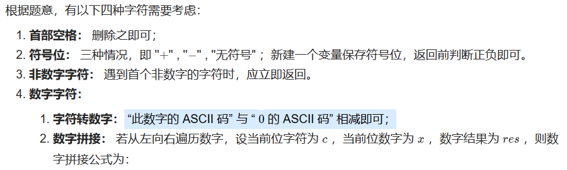

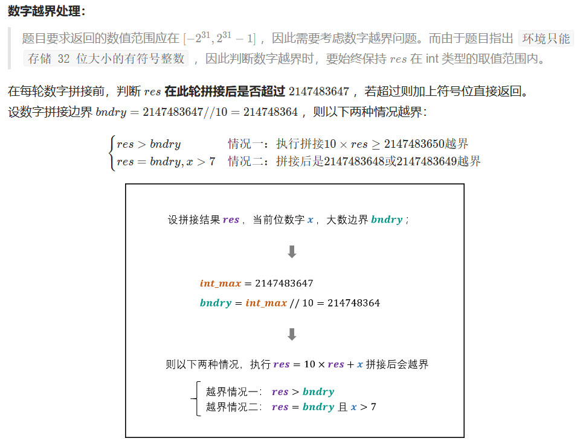

```cpp
class Solution {
public:
	int strToInt(string str) {
		int i = 0, flag = 1; //默认flag=1，正数
		int res = 0;
		//首部空格，删除之
		while (str[i] == ' ') ++i;
		//符号位，-1表示负数
		if (str[i] == '-') flag = -1;
		//符号位再+1
		if (str[i] == '-' || str[i] == '+') ++i;
		//如果是数字
		for (; i < str.size() && isdigit(str[i]); ++ i) {
			//判断是否越界
			if (res > INT_MAX / 10 || (res == INT_MAX / 10 && str[i] - '0' > 7))
				return flag == 1 ? INT_MAX : INT_MIN;
			// “此数字的 ASCII 码“与“0的ASCII 码”相减即可；
			//数字拼接
			res = res * 10 + (str[i] - '0');
		}
		return flag * res;
	}
};
```


### 位运算

#### JZ64 求1+2+3+…+n

从1连加到n，不能使用城乘除法，那就只能相加了。一个一个加，但是循环需要判断什么时候截止，我们又不能用关键词，这就难办了。

如果我们的和加上了n，则剩余的问题就是该数字加上1到n-1的和，这是一个子问题，因此可以用递归，从n回到1，再累加递归的结果。但是我们需要判断递归停止的条件，即到0时停止递归，不能用if、switch、？：等操作，我们可以采用与运算的短路操作： **在函数中，如果与运算成立，则继续，否则终止函数直接返回false。**

**具体做法：**

- step 1：用与运算判断n是否为正数，如果不是则结束递归。
- step 2：如果是累加子问题的和，并返回n。

```cpp
class Solution {
public:
    int Sum_Solution(int n) {
        n && (n+=Sum_Solution(n-1));
        return n;
    }
};
```


[剑指 Offer 64. 求1+2+…+n - 力扣（LeetCode）](https://leetcode.cn/problems/qiu-12n-lcof/solutions/208315/mian-shi-ti-64-qiu-1-2-nluo-ji-fu-duan-lu-qing-xi-/)

```cpp
class Solution {
    int res = 0;
    public int sumNums(int n) {
        boolean x = n > 1 && sumNums(n - 1) > 0;
        res += n;
        return res;
    }
}

作者：Krahets
链接：https://leetcode.cn/problems/qiu-12n-lcof/solutions/208315/mian-shi-ti-64-qiu-1-2-nluo-ji-fu-duan-lu-qing-xi-/
来源：力扣（LeetCode）
著作权归作者所有。商业转载请联系作者获得授权，非商业转载请注明出处。
```


#### 56-I 数组中只出现一次的两个数字

所以，当只有一个出现了一次的数字的时候，则只需要将全部数进行异或运算，运算结果就剩下了那个只出现一次的数字了。

```cpp
public int[] singleNumber(int[] nums) {
    int x = 0;
    for(int num : nums)  // 1. 遍历 nums 执行异或运算
        x ^= num;
    return x;            // 2. 返回出现一次的数字 x
}
```

当二进制&1结果为1的时候，为奇数，反之为偶数。它们是按照最低位的不同来分组的。

**两个不同的数如何分组**：

需要找到两者中的那一位不同的二进制，然后得到分组的与值

那要怎么找到那一位不同的二进制呢？

> 我们看一个例子： 1，1，4，6
>
> 全部做异或运算结果为 4⊕6 = 0100⊕0110 = 0010
>
> 异或的运算规则是什么？ 相同的为0，不同的为1。所以我们根据两者异或出来的结果 0010，不就可以知道那一位不同了嘛？（为1的那一位就是不同的）

**答案**：

```cpp
class Solution {
public:
    /**
     * 代码中的类名、方法名、参数名已经指定，请勿修改，直接返回方法规定的值即可
     *
     * 
     * @param nums int整型vector 
     * @return int整型vector
     */
    vector<int> FindNumsAppearOnce(vector<int>& nums) {
        // write code here
        // 先将全部数进行异或运算，得出最终结果
        int x=0;
        for(auto num:nums){
            x^=num;
        }
        int num=x;

        // 找到那个可以充当分组去进行与运算的数
        // 从最低位开始找起
        int mask=1;
        while((num&mask)==0){
            mask<<=1;
        }

        // 进行分组，分成两组，转换为两组 求出现一次的数字 去求
        int a=0;
        int b=0;
        for(auto num:nums){
            if((num&mask)==0){
                a^=num;
            }
            else{
                b^=num;
            }
        }

        // 因为题目要求小的数放前面，所以这一做个判断
        if(a>b){
            int tmp=a;
            a=b;
            b=tmp;
        }

        return {a,b};

    }
};
```

##### 第2次：leetcode

```cpp
class Solution {
public:
    vector<int> singleNumbers(vector<int>& nums) {
        int x=0;
        for(auto num:nums){
            x^=num;
        }
        int num=x;
        int mask=1;
        while((num&mask)==0){
            mask<<=1;
        }

        int a=0;
        int b=0;
        for(auto it:nums){
            if((it&mask)==0){
                a^=it;
            }
            else{
                b^=it;
            }
        }

        return {a, b};
    }
};
```

```cpp

for(auto it:nums){
	if((it&mask)==0){
		a^=it;
	}
    // 这样是错的，因为不是为1，而是某一位为1
	if((it&mask)==1){
		b^=it;
	}
}
```


#### 56 - II. 数组中数字出现的次数 II

1. 值得注意的是：如果某个数字出现3次，那么这个3个数字的和肯定能被3整除，则其对应二进制位的每一位的和也能被3整除
2. 统计数组中每个数字的二进制中每一位的和，判断该和是否能被3整除。
3. 若可以，则只出现一次的数字的二进制数中那一位为0，否则为1

```cpp
class Solution {
public:
    int singleNumber(vector<int>& nums) {
        int ans = 0;
        for(int i = 0; i < 32; ++i){
            int cnt = 0;
            for(int n : nums){
                // n & 1 << i 的值大于0即为真
                if(n & (1 << i)) cnt++;
            }
            // 构造只出现一次的那个数字，采用异或的方法生成二进制中的每一位
            if(cnt % 3 == 1) ans ^= (1 << i);
        }
        return ans;
    }
};

```

 

#### JZ16 数值的整数次方

```cpp
class Solution {
public:
    double Pow(double x, int y ){
        cout<<x<<endl;
        double res=1;
        for(int i=0;i<y;i++){
            res*=x;
            cout<<res<<endl;
        }
        return res;
    }

    double Power(double base, int exponent) {
        if(exponent<0){
            base=1/base;
            cout<<base<<endl;
            exponent=-exponent;
        }
        return Pow(base, exponent);
    }
};
```


#### JZ15 二进制中1的个数

**具体做法：**

- step 1：遍历二进制的32位，通过移位0-31次实现。
- step 2：将移位后的1与数字进行位与运算，结果为1就记录一次。

```cpp
class Solution {
public:
    /**
     * 代码中的类名、方法名、参数名已经指定，请勿修改，直接返回方法规定的值即可
     *
     * 
     * @param n int整型 
     * @return int整型
     */
    int NumberOf1(int n) {
        // write code here
        int res=0;
        for(int i=0;i<32;i++){
            if((n&(1<<i))!=0){
                res++;
            }
        }
        return res;
    }
};
```

##### 第2次

```cpp
class Solution {
public:
    int hammingWeight(uint32_t n) {
        int res=0;
        for(int i=0;i<32;i++){
            if((n&(1<<i))!=0){
                res++;
            }
        }
        return res;
    }
};
```


#### 65 不用加减乘除做加法

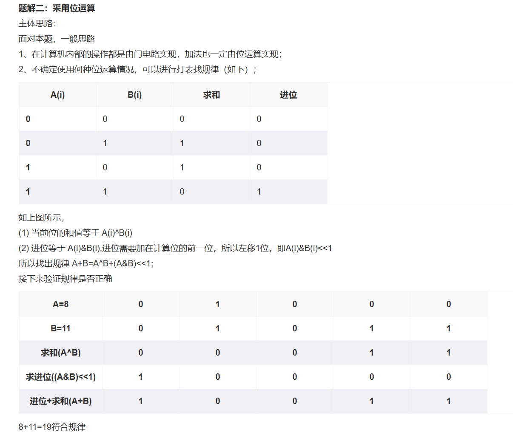

```cpp
class Solution {
public:
    int Add(int num1, int num2) {
        while(num2!=0){
            int sum =num1^num2;
            int tmp=(num1&num2)<<1;
            num1=sum;
            num2=tmp;
        }
        return num1;
    }
};
```

##### 第2次

[剑指 Offer 65. 不用加减乘除做加法 - 力扣（LeetCode）](https://leetcode.cn/problems/bu-yong-jia-jian-cheng-chu-zuo-jia-fa-lcof/solutions/210882/mian-shi-ti-65-bu-yong-jia-jian-cheng-chu-zuo-ji-7/)

```cpp
class Solution {
public:
    int add(int a, int b) {
        while(b!=0){
            int c=(a&b)<<1;
            a=a^b;
            b=c;
        }
        return a;
    }
};
```


#### 65. 不用加减乘除做加法

[剑指 Offer 65. 不用加减乘除做加法 - 力扣（LeetCode）](https://leetcode.cn/problems/bu-yong-jia-jian-cheng-chu-zuo-jia-fa-lcof/solutions/210882/mian-shi-ti-65-bu-yong-jia-jian-cheng-chu-zuo-ji-7/)

```cpp
class Solution {
    public int add(int a, int b) {
        if(b==0) return a;
        return add(a^b,(a&b)<<1);
    }
}
```

```cpp
class Solution {
public:
    int add(int a, int b) {
        while (b != 0) {
            // 进位
            unsigned int carry = (unsigned int)(a & b) << 1;
            // 非进位和
            a = a ^ b;
            b = carry;
        }
        return a;
    }
};

```


#### 15. 二进制中1的个数

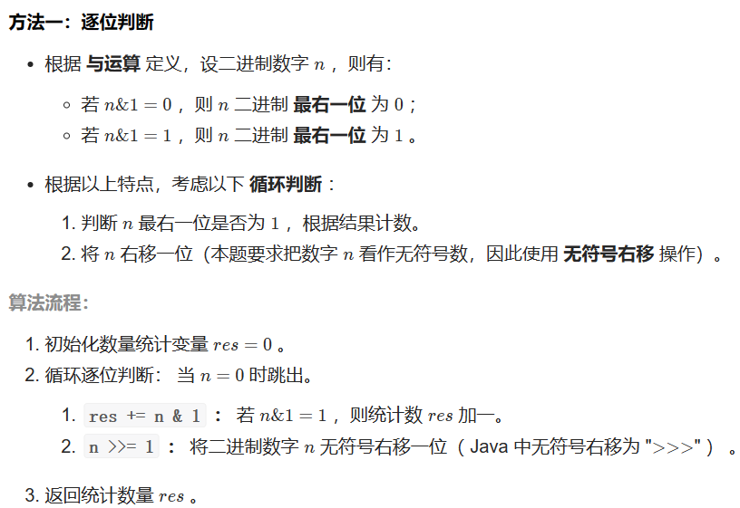

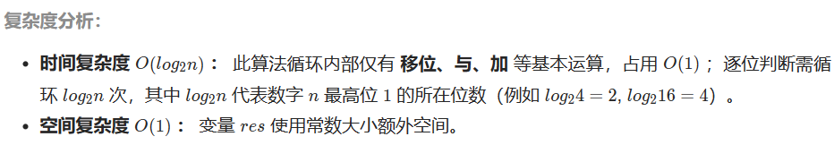

```cpp
class Solution {
public:
    int hammingWeight(uint32_t n) {
        int res=0;
        while(n!=0){
            res+=(n&1);
            n>>=1;
        }
        return res;
    }
};
```


### 排序

#### JZ3 数组中重复的数字

##### 方法1：利用set集合

**核心思想：**
        引入set集合，遍历数组元素，检查元素是否在集合中，不在则将元素插入到集合里面；否则表明当前元素在数组中重复，返回当前元素。

**复杂度分析：**
        代码使用了循环，循环次数为数组大小，因此该方法的时间复杂度为O(N)。由于引入额外的集合空间，因此空间复杂度为O(N)，最坏的情况是数组中的元素都不重复。

```cpp
class Solution {
public:
    /**
     * 代码中的类名、方法名、参数名已经指定，请勿修改，直接返回方法规定的值即可
     *
     * 
     * @param numbers int整型vector 
     * @return int整型
     */
    int duplicate(vector<int>& numbers) {
        // write code here
        set<int> s;
        for(auto number : numbers){
            if(s.count(number)>0){
                return number;
            }
            else{
                s.insert(number);
            }
        }
        return -1;
    }
};
```


#### 45. 把数组排成最小的数

##### 方法1：非常棒的排序方法

```cpp
class Solution {
public:
    string minNumber(vector<int>& nums) {
        vector<string> vec;
        for(int i=0;i<nums.size();i++){
            vec.push_back(to_string(nums[i]));
        }
        sort(vec.begin(), vec.end(), [](const string& a,const string& b){return a+b<b+a;});
        string res;
        for(int i=0;i<vec.size();i++){
            res+=vec[i];
        }
        return res;
    }
};
```


### 分治

#### 51. 数组中的逆序对

##### 方法一：归并排序

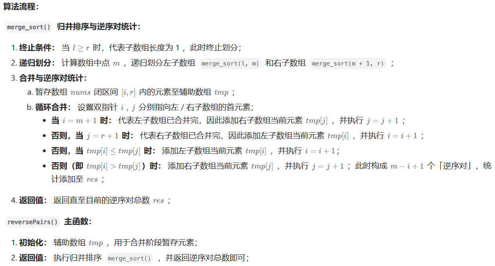

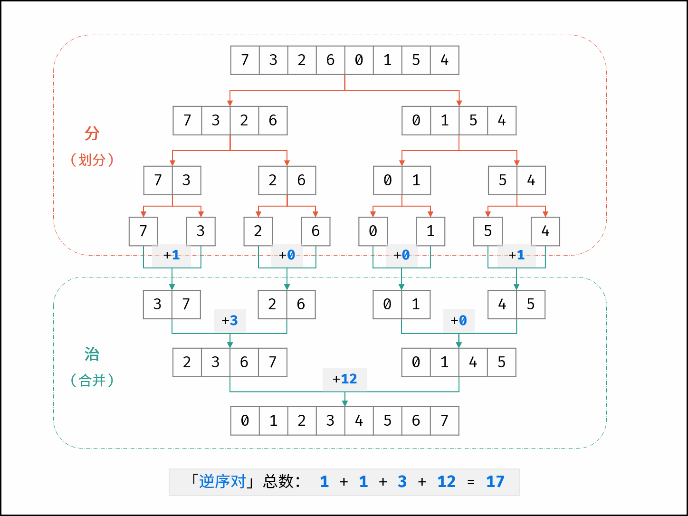

```cpp
class Solution {
public:
    int reversePairs(vector<int>& nums) {
        vector<int> tmp(nums.size());
        return mergeSort(0, nums.size() - 1, nums, tmp);
    }
private:
    int mergeSort(int l, int r, vector<int>& nums, vector<int>& tmp) {
        // 终止条件
        if (l >= r) return 0;
        // 递归划分
        int m = (l + r) / 2;
        int res = mergeSort(l, m, nums, tmp) + mergeSort(m + 1, r, nums, tmp);
        // 合并阶段
        int i = l, j = m + 1;
        for (int k = l; k <= r; k++)
            tmp[k] = nums[k];
        for (int k = l; k <= r; k++) {
            if (i == m + 1)
                nums[k] = tmp[j++];
            else if (j == r + 1 || tmp[i] <= tmp[j])
                nums[k] = tmp[i++];
            else {
                nums[k] = tmp[j++];
                res += m - i + 1; // 统计逆序对
            }
        }
        return res;
    }
};
```

```cpp
class Solution {
public:
    int reversePairs(vector<int>& nums) {
        vector<int> vec(nums.size());
        return merge_sort(0,nums.size()-1,nums,vec);
    }
private:
    int merge_sort(int l, int r, vector<int>& nums, vector<int>& tmp)
    {
        //终止条件
        if(l >= r) return 0;
        //划分
        int m = (l + r) / 2;
        //分成两份后分别的结果相加
        int res = merge_sort(l,m,nums,tmp) + merge_sort(m+1,r,nums,tmp);
        //将[l,r]用一个数组保存合并之前的模样
        for(int k = l; k <= r; k++)
        {
            tmp[k] = nums[k];
        }
        //对[l,r]中的[l,m]、[m+1,r]开始合并
        int i = l;
        int j = m + 1;
        for(int k = l; k <= r; k++)
        {
            //m及其左边元素合并完毕,把右边剩下的放入合并后的数组
            if(i==m+1)
            {
                nums[k] = tmp[j];
                j++;
            }
            //m+1及其右边元素合并完毕,把左边剩下的放入合并后的数组 或者 左边数组的元素小于等于右边,将左边数组的元素放入结果数组中,并让索引i加1
            else if(j==r+1 || tmp[i]<=tmp[j])
            {
                nums[k] = tmp[i];
                i++;
            }
            //右边数组的元素小于左边,将右边数组的元素其放入结果数组中,并让索引j加1
            //并且此时左边数组中的从i到m的所有数都是大于tmp[j]的(因为m左右的数组都是已经排好序的，第15行代码的功劳)
            //即此时有m-i+1个逆序对，加到res上即可
            else //即if(tmp[i]>tmp[j])这种情况
            {
                nums[k] = tmp[j];
                j++;
                res += m-i+1;
            }
        }
        return res;
    }
};
```

##### 方法2：我自己写的归并排序上使用

```cpp
class Solution {
  public:
    /**
     * 代码中的类名、方法名、参数名已经指定，请勿修改，直接返回方法规定的值即可
     *
     *
     * @param nums int整型vector
     * @return int整型
     */
    const int MOD = 1e9 + 7;

    int sort(vector<int>& nums, vector<int>& numsTemp, int low, int high) {
        if (low >= high)
            return 0;  // 基本情况，数组为空或只有一个元素，无需排序

        int len = high - low;
        int mid = low + len / 2;  // 计算中间索引
        int start1 = low, end1 = mid, start2 = mid + 1, end2 = high;

        int res=sort(nums, numsTemp, start1, end1)+sort(nums, numsTemp, start2, end2);

        int index = low;  // 合并排序后的两部分
        while (start1 <= end1 && start2 <= end2) {
            if(nums[start1]<=nums[start2]){
                numsTemp[index++]=nums[start1++];
            }
            else{
                numsTemp[index++]=nums[start2++];
                res+=mid-start1+1;
                res%=MOD;
            }
        }

        while (start1 <= end1) {
            numsTemp[index++] =
                nums[start1++];  // 将剩余元素从左半部分复制到临时数组
        }
        while (start2 <= end2) {
            numsTemp[index++] =
                nums[start2++];  // 将剩余元素从右半部分复制到临时数组
        }

        for (index = low; index <= high; ++index) {
            nums[index]=numsTemp[index];  // 将临时数组中的排好序的元素复制回原数组
        }

        return res;
    }


    int InversePairs(vector<int>& nums) {
        // write code here
        vector<int> numsTemp(nums.size());
        return sort(nums, numsTemp, 0, nums.size() - 1);
    }
};
```


### 其他

#### 66、构建乘积数组


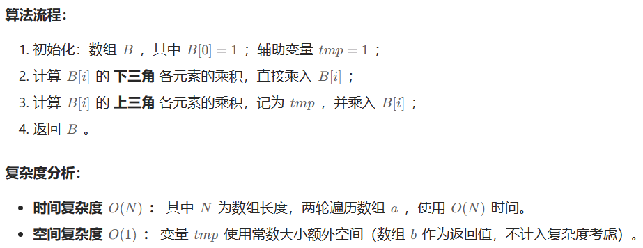


```cpp
class Solution {
public:
	vector<int> constructArr(vector<int>& a) {
		int len = a.size();
		if (len == 0) {
			return {};
		}
		//1 初始化数组ans,辅助变量total=1；
		vector<int> ans(len, 1);
		int tmp = 1;
		//2 计算 B[i] 的 下三角 各元素的乘积，直接乘入 B[i]；
		for (int i = 1; i < len; ++i) {
			ans[i] = ans[i-1] * a[i-1];
		}
		//3 计算 B[i] 的 上三角 各元素的乘积，记为 tmp，并乘入 B[i]；
		for (int i = len - 1; i > 0; --i) {
			tmp *= a[i];
			ans[i - 1] *= tmp;
		}
		return ans;
	}
};
```


#### 50、第一个只出现一次的字符

```cpp
class Solution {
public:
	char firstUniqChar(string s) {
		unordered_map<char, bool> m;
		int len = s.length();
		for (auto c : s) {
			//查找key是否存在，存在返回该键的元素的迭代器；不存返回map.end()
			//第一次不存在，找不到就是true
			//重复出现时，就会找到，=false
			m[c] = m.find(c) == m.end();
		}
		for (auto c : s) {
			//返回第一个为true的数
			if (m[c]) return c;
		}
		return ' ';
	}
};
```


##### 第2次

```cpp
class Solution {
public:
    char firstUniqChar(string s) {
        if(s.size()==0){
            return ' ';
        }
        unordered_map<char, int> umap;
        for(int i=0;i<s.size();i++){
            umap[s[i]]++;

        }
        for(auto c:s){
            if(umap[c]==1) return c;
        }
        return ' ';

    }
};
```


#### 43. 1～n 整数中 1 出现的次数（超难）

[剑指 Offer 43. 1～n 整数中 1 出现的次数 - 力扣（LeetCode）](https://leetcode.cn/problems/1nzheng-shu-zhong-1chu-xian-de-ci-shu-lcof/solutions/229751/mian-shi-ti-43-1n-zheng-shu-zhong-1-chu-xian-de-2/)

```cpp
class Solution {
public:
    int countDigitOne(int n) {
        int high = n / 10, cur = n % 10, low = 0;
        long long res = 0, digit = 1;//digit最后两个样例会溢出需用long long声明
        //当前位cur还有值时会变成高位仍可能影响答案
        while(high || cur)
        {
            if(cur == 0) res += high * digit;
            else if(cur == 1) res += high * digit + low + 1;
            else res += (high + 1)* digit;
            //更新当前位及低位划分
            digit *= 10;
            cur = high % 10;
            high /= 10;
            low = n % digit;
        }
        return res;
    }
};
```

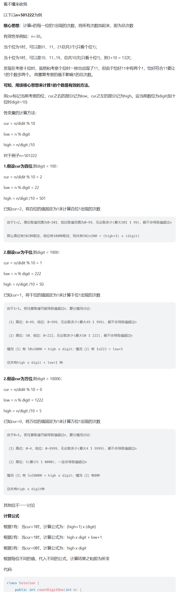

```cpp
class Solution {
public:
    int NumberOf1Between1AndN_Solution(int n) {
        int count = 0;
        int digit = 1;
        int tmp = n;

        while(tmp>0){
            int cur = n/digit %10;
            int low = n%digit;
            int high = n/digit/10;
            tmp /= 10;
            
            if(cur>1){
                count += (high+1)*digit;
                digit *=10;
            }
            else if(cur == 1){
                count += high*digit + low +1;
                digit *=10;
            }
            else {
               count += high * digit;
               digit *=10; 
            }
        }
        return count;
    }
};
```


#### 16. 数值的整数次方

##### 方法1：快速幂

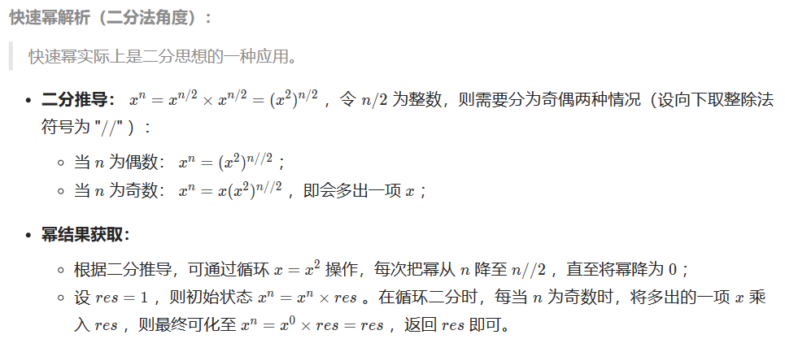

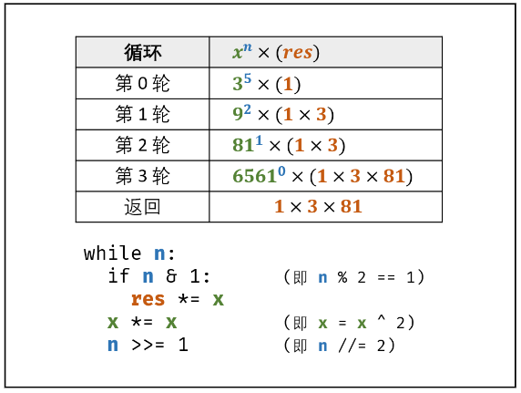

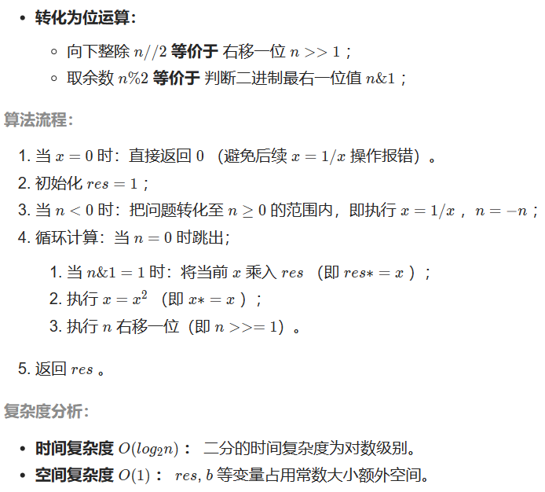

```cpp
class Solution {
public:
    double myPow(double x, int n) {
        if(x==0) return 0;
        long b=n;
        double res=1.0;
        if(b<0){
            x=1/x;
            b=-b;
        }
        while(b>0){
            if((b&1)==1) res*=x; // 奇数
            x*=x;
            b>>=1;
        }
        return res;
    }
};
```


#### 17、打印从1到最大的n位数

面试不能这么写；

```cpp
class Solution {
public:
    vector<int> printNumbers(int n) {
        vector<int> res;
        string maxNum(n, '9');

        int m=stoi(maxNum);
        for(int i=1;i<=m;i++){
            res.emplace_back(i);
        }

        return res;
    }
};
```


##### 方法1：在字符串上模拟数字加法

```cpp
class Solution {
public:
    vector<int> printNumbers(int n) {
        if (n <= 0) return {};

        vector<int> result;
        string number(n, '0');

        while (!increment(number)) {
            result.push_back(stoi(number));
        }

        return result;
    }

   
private:
    bool increment(string& number) {
        int carry = 0;
        int len = number.length();

        for (int i = len - 1; i >= 0; --i) {
            int sum = number[i] - '0' + carry;

            if (i == len - 1) sum++;

            if (sum >= 10) {
                if (i == 0) {
                    return true;
                }
                else {
                    sum -= 10;
                    carry = 1;
                    number[i] = '0' + sum;
                }
            }
            else {
                number[i] = '0' + sum;
                break;
            }
        }

        return false;
    }
};

```


##### 方法2：数字排列，递归

```cpp
class Solution {
public:
    vector<int> printNumbers(int n) {
        if (n <= 0) return {};

        vector<int> result;
        string number(n, '0');

        dfs(number, result, n, 0);

        // 去除开头的0，并调整顺序
        result.erase(result.begin());

        return result;
    }

private:
    void dfs(string& number, vector<int>& result, int n, int index) {
        if (index == n) {
            result.push_back(stoi(number));
            return;
        }

        for (char digit = '0'; digit <= '9'; digit++) {
            number[index] = digit;
            dfs(number, result, n, index + 1);
        }
    }
};


```


#### 44、数字序列中某一位的数字

[剑指 Offer 44. 数字序列中某一位的数字 - 力扣（LeetCode）](https://leetcode.cn/problems/shu-zi-xu-lie-zhong-mou-yi-wei-de-shu-zi-lcof/solutions/219252/mian-shi-ti-44-shu-zi-xu-lie-zhong-mou-yi-wei-de-6/)

```cpp
class Solution {
public:

    int findNthDigit(int n) {

        //当n=0不存在。  
        //分段

        //第一段（1-9）数字10-1 个，长度 9*1
        //第二段（10-99）数字(100-10)个，长度（100-10）*2 = 90*2
        //第三段（100-999）数字(1000-100)个, 长度（1000-100）*3 =900*3

        //n=1，返回1 。n=10 对应第二段的第一个数字10。取第一位为1

        int i=1;//分段 第1段开始 

        while(n > 9*pow(10,i-1) *i)//找到n在第几段 ，如第二段有90*2 个字符
        {
            n = n - 9*pow(10,i-1) *i;
            i++;
        }
        //到这里已经知道是第几段i。 且是这一段的第几个字符
        
        int min_num = pow(10,i-1);//这一段的最小值。比如第二段，最小为10
        int cur_num = min_num + (n-1)/i;//知道是属于哪个数字 每个数字长度为i  第0数字是它本身
        int cur_bit = (n-1)%i;//看是这个数字的第几位，第0位为最高位，第1位为次高位。

       string s = to_string(cur_num);
       return   s[cur_bt]-'0';//返回这一位的数字

    }
};
```

