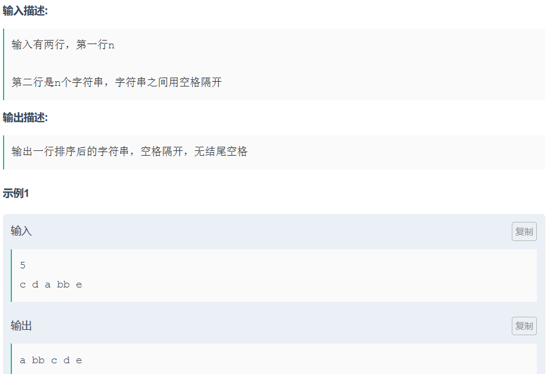
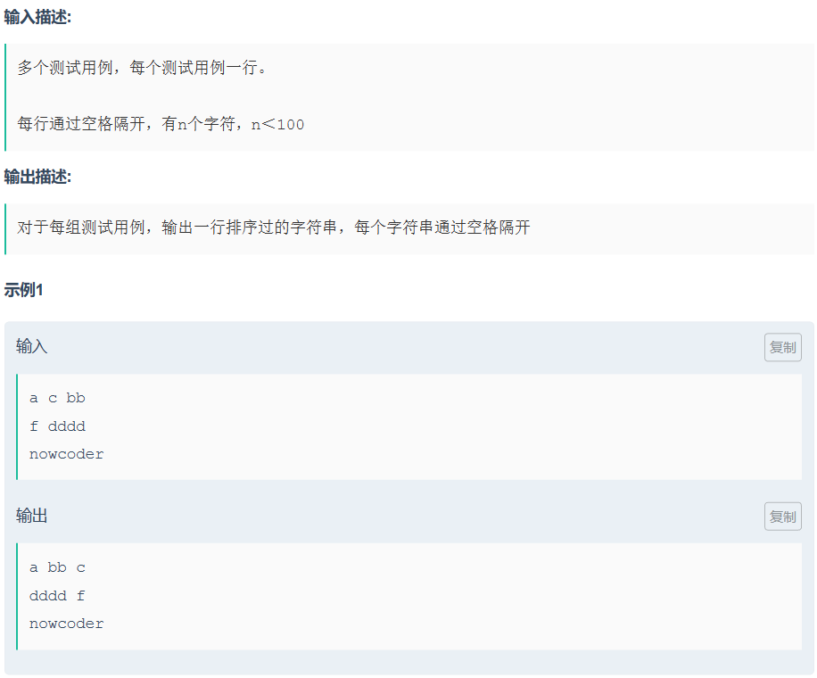
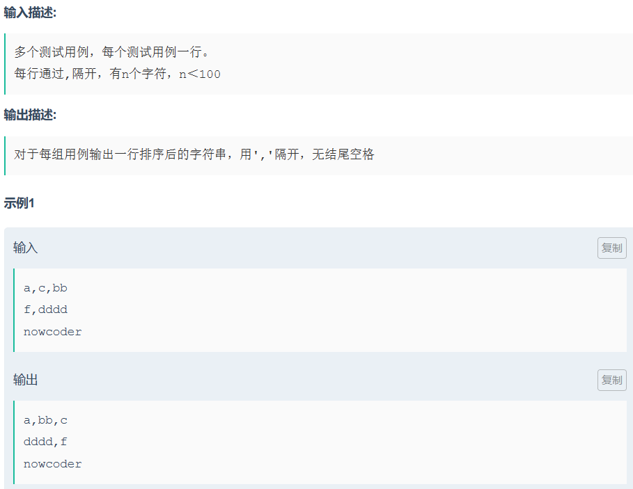

# ACM模式输入输出

[ACM模式输入输出攻略 | C++篇_牛客网 (nowcoder.com)](https://www.nowcoder.com/discuss/460145181203931136)

## 1、输入

首先，在C++语言中，要使用标准的输入，需要包含头文件`<iostream>`

### （1）cin

cin是C++中， 标准的输入流对象，下面列出cin的两个用法，**单独读入**，和**批量读入**

cin的原理，简单来讲，是有一个缓冲区，我们键盘输入的数据，会先存到缓冲区中，用cin可以从缓冲区中读取数据。

> 注意1：cin可以连续从键盘读入数据
>
> 注意2：cin以**空格、tab、换行符**作为分隔符
>
> 注意3：cin从第一个非空格字符开始读取，直到遇到分隔符结束读取

示例：

```cpp
// 用法1，读入单数据
int num;
cin >> num;
cout << num << endl;  // 输出读入的整数num

// 用法2，批量读入多个数据
vector<int> nums(5);
for(int i = 0; i < nums.size(); i++) {
	cin >> nums[i];
}
// 输出读入的数组
for(int i = 0; i < nums.size(); i++) {
	cout << nums[i] << " ";
}
```

### （2）getline()

从cin的注意中，也可以看出，当我们要求读取的字符串中间存在空格的时候，cin会读取不全整个字符串，这个时候，可以采用getline()函数来解决。

> 注意1：使用getline()函数的时候，需要包含头文件`<string>`
>
> 注意2：getline()函数会读取一行，读取的字符串包括空格，遇到换行符结束

示例：

```cpp
string s;
getline(cin, s);
// 输出读入的字符串
cout << s << endl;
```

### （3）getchar()

该函数会从缓存区中读出一个字符，经常被用于判断是否换行

示例：

```cpp
char ch;
ch = getchar();
// 输出读入的字符
cout << ch << endl;
```


## 2、输出

同样的，在C++语言中，要使用标准的输出，也需要包含头文件`<iostream>`

输出这边，主要介绍一个函数，就是用的最多的`cout`，需要注意的是，如果输出`endl`对象的时候，会输出一个换行符，类似`\n`。

示例：

```cpp
string s = "hello, Irray~";
// 看看二者有何不同
cout << "hello, Irray~";
cout << s << endl;
```

当然，C++中的输入输出函数不止这几个，其他的输入函数包括`scanf()`，`cin.get()`等等方式，输出函数也有`printf()`，`clog`，`cerr`等方式，要根据**具体的使用场景**，选择具体的输入输出函数。

但，接下来的案例中，掌握上述三个方法是足够的。不想介绍太多，也是因为，记忆太多方法，容易记混，不如用**最简洁的方式**实现全部问题。

## 3.案例

### （1）一维数组

此类输入，每个元素为一个int或者char，有两类常见的案例：

#### 1.固定数目

##### 输入格式：

```
3
1 2 3
```

```cpp
int n;
cin >> n; // 读入3，说明数组的大小是3
// getchar(); // 读取一个换行，其实不需要
vector<int> nums(n); // 创建大小为3的vector<int>
for(int i = 0; i < n; i++) {
	cin >> nums[i];
}

// 验证是否读入成功
for(int i = 0; i < nums.size(); i++) {
	cout << nums[i] << " ";
}
cout << endl;
```

or

```
3 1 2 3
```

##### 解析：

对于第一组，第一行的3为整数的个数，第二行为三个用空格隔开的整数，因此可以采用`cin`来进行读取

对于第二组，第一行的3为整数的个数，空格后面的数据为三个用空格隔开的整数，因此可以采用`cin`来进行读取

此类问题，可以先创建一个`vector<int>`，大小设置为给定值，然后通过`for`循环来循环输入

##### 答案：

```cpp
int n;
cin >> n; // 读入3，说明数组的大小是3
vector<int> nums(n); // 创建大小为3的vector<int>
for(int i = 0; i < n; i++) {
	cin >> nums[i];
}

// 验证是否读入成功
for(int i = 0; i < nums.size(); i++) {
	cout << nums[i] << " ";
}
cout << endl;
```

#### 2.不固定数目

##### 输入格式：

```
1 2 3 4
```

##### 解析：

输入的数据为四个用空格间隔的整数，没有指定整数个数，因此可以用`while`循环结合`cin`来处理该问题。

##### 答案：

```cpp
vector<int> nums;
int num;
while(cin >> num) {
	nums.push_back(num);
	// 读到换行符，终止循环
	if(getchar() == '\n') {
		break;
	}
}

// 验证是否读入成功
for(int i = 0; i < nums.size(); i++) {
	cout << nums[i] << " ";
}
cout << endl;
```

### （2）二维数组

除了一维数组这种最基础的输入外，还会考察二维数组的输入，尤其是在dfs、dp类型的题目中。

二维数组主要有两种方式：

#### 1.常规模式

##### 输入格式：

```
2 3
1 2 3
1 2 3
```

##### 解析：

第一行的2，代表数据为2行，3代表数据为3列，因此根据第一行，可以得出，所输入数据为2行3列的二维数组。接下来的6个数字，就是按照空格和换行符分隔开的2x3二维数组，因此用`for`循环和`cin`即可处理

##### 答案：

```cpp
int m; // 接收行数
int n; // 接收列数

cin >> m >> n;
// getchar(); // 其实不需要

vector<vector<int>> matrix(m, vector<int>(n));

for(int i = 0; i < m; i++) {
	for(int j = 0; j < n; j++) {
		cin >> matrix[i][j];
	}
}

// 验证是否读入成功
for(int i = 0; i < m; i++) {
	for(int j = 0; j < n; j++) {
		cout << matrix[i][j] << " ";
	}
	cout << endl;
}
```

#### 2.每一行数据是逗号隔开的整数

##### 输入格式：

```
2 3
1,2,3
1,2,3
```

##### 解析：

第一行的2，代表数据为2行，3代表数据为3列，因此根据第一行，可以得出，所输入数据为2行3列的二维数组。接下来的2行，分别是一个字符串，字符串中用逗号隔开每个整数。这里采用读入字符串的方式，并将读入的字符串进行按逗号分开。

##### 答案：

> 对于getline来说，会把空格、换行符也读成一行
> 对于cin，是以空格、tab、换行符作为分隔符

```cpp
int m; // 接收行数
int n; // 接收列数

cin >> m >> n;
getchar(); // 把换行符读取掉，
// 这里对于getline来说，会把空格、换行符也读成一行
// 而对于cin，是以空格、tab、换行符作为分隔符

vector<vector<int>> matrix(m);

for(int i = 0; i < m; i++) {
    // 读入字符串
	string s;
	getline(cin, s);
	
	// 将读入的字符串按照逗号分隔为vector<int>
	vector<int> vec;
	int p = 0;
	for(int q = 0; q < s.size(); q++) {
		p = q;
		while(s[p] != ',' && p < s.size()) {
			p++;
		}
		string tmp = s.substr(q, p - q);
		vec.push_back(stoi(tmp));
		q = p;
	}
	
	//写入matrix
	matrix[i] = vec;
	vec.clear();
}

// 验证是否读入成功
for(int i = 0; i < matrix.size(); i++) {
	for(int j = 0; j < matrix[i].size(); j++) {
		cout << matrix[i][j] << " ";
	}
	cout << endl;
}
```

### （3）字符串

#### 1.单字符串

##### 输入格式：

```
abc
```

##### 解析：

用`cin`读入即可

##### 答案：

```cpp
string s;
cin >> s;

// 验证是否读入成功
cout << s << endl;
```

#### 2.给定数目多字符串

##### 输入格式：

```
3 abc ab a
```

##### 解析：

第一行的3，代表有3个字符串，后续为用空格隔开的3个字符串，采用`for`循环和`cin`读入即可

##### 答案：

```cpp
int n;
cin >> n; // 读入3，说明字符串数组的大小是3
vector<string> strings(n); // 创建大小为3的vector<string>
for(int i = 0; i < n; i++) {
	cin >> strings[i];
}

// 验证是否读入成功
for(int i = 0; i < strings.size(); i++) {
	cout << strings[i] << " ";
}
cout << endl;
```


#### 3.不给定数目多字符串

##### 输入格式：

```
abc ab a d
```

##### 解析：

输入为用空格隔开的若干个字符串。

##### 答案：

```cpp
vector<string> strings;
string str;
while(cin >> str) {
	strings.push_back(str);
	// 读到换行符，终止循环
	if(getchar() == '\n') {
		break;
	}
}

// 验证是否读入成功
for(int i = 0; i < strings.size(); i++) {
	cout << strings[i] << " ";
}
cout << endl;
```


#### 4.字符串转整数数组

##### 输入格式：

```
11,22,3,4
```

##### 解析：

输入为一个完整字符串，字符串内容是按照逗号隔开的一个数组，可以先读入完成字符串，然后根据逗号进行分隔

##### 答案：

```cpp
vector<int> vec;

// 读入字符串
string s;
getline(cin, s);

// 将读入的字符串按照逗号分隔为vector<int>
int p = 0;
for(int q = 0; q < s.size(); q++) {
    p = q;
    while(s[p] != ',' && p < s.size()) {
        p++;
    }
    string tmp = s.substr(q, p - q);
    vec.push_back(stoi(tmp));
    q = p;
}

// 验证是否读入成功
for(int i = 0; i < vec.size(); i++) {
	cout << vec[i] << " ";
}
cout << endl;
```

## 4.ACM模式练习平台

除了在笔试中实战之外，也可以在牛客平台进行练习：https://ac.nowcoder.com/acm/contest/5652

同时，牛客上也有很多专门的ACM模式算法题。

这里给出一个案例：

**解答：**

因为比较简单，就直接给出代码了。

```cpp
#include <iostream>
using namespace std;

int main() {
    int a;
    int b;
    while(cin >> a >> b) {
        cout << a + b << endl;
    }
    
    return 0;
}
```


## 5.常见数据结构定义

在ACM模式中，链表、二叉树这些数据结构的定义也需要自己去定义，接下来就给出二者的定义、输入和输出。

这里就直接给出代码了，想必大伙对数据结构都是了如指掌的。

### 1.链表

用的是尾插法创建

```cpp
#include <iostream>
using namespace std;

// 链表定义，并给出两个有参构造函数
struct ListNode
{
    int val;
    ListNode* next;
    ListNode(int _val):val(_val),next(nullptr){}
    ListNode(int _val,ListNode* _next):val(_val),next(_next){}
};

int main()
{

	// 根据控制台的输入，创建一条单链表
    ListNode* LHead = new ListNode(-1);
    ListNode* pre = LHead;
    // ListNode* cur = nullptr;
    
    // 这里用的是尾插法
    int num;
    while(cin >> num)
    {
    	// 为了简单起见，设置为-1退出，后续可优化，这里只是给出一个例子
        if(num == -1){
           pre->next = nullptr;
           break; 
        } 
        ListNode* cur = new ListNode(num);
        pre->next = cur;
        pre = cur;
    }
    
    cur = LHead->next;
    
    // 输出单链表的value
    while(cur)
    {
        cout << cur->val << " ";
        cur = cur->next;
    }
    
    cout << endl;
    
    return 0;
}
```

#### **封装成函数**

> 输入时，用-1来做结尾

```cpp
#include <iostream>
using namespace std;

struct ListNode{
    int val;
    ListNode* next;
    ListNode(int x):val(x){}
};

ListNode* create(){
    ListNode* dummy=new ListNode(-1);
    ListNode* pre=dummy;
    ListNode* cur=nullptr;

    int num;
    while(cin>>num){
        // 用-1来做结尾
        if(num==-1){
            pre->next = nullptr;
            break;
        } 
        cur=new ListNode(num);
        pre->next=cur;
        pre=cur;
    }

    return dummy->next;
}

void output(ListNode* head){
    while(head){
        cout<<head->val<<" ";
        head=head->next;
    }
    cout<<endl;
}

```

> 输入时，用换行符'\n'来做结尾

```cpp
ListNode* create(){
    ListNode* dummy=new ListNode(-1);
    ListNode* pre=dummy;
    ListNode* cur=nullptr;

    int num;
    while(cin>>num){
        cur=new ListNode(num);
        pre->next=cur;
        pre=cur;
        // 用换行符'\n'来做结尾
        if(getchar()=='\n'){
            pre->next=nullptr;
            break;
        }
    }

    return dummy->next;
}

void output(ListNode* head){
    while(head){
        cout<<head->val<<" ";
        head=head->next;
    }
    cout<<endl;
}
```


### 2.二叉树

#### 第1种

```cpp
#include <iostream>
#include <vector>
#include <queue>

using namespace std;

//定义树节点
struct TreeNode
{
    int val;
    TreeNode* left;
    TreeNode* right;
    TreeNode():val(0),left(nullptr),right(nullptr){}
    TreeNode(int _val):val(_val),left(nullptr),right(nullptr){}
    TreeNode(int _val,TreeNode* _left,TreeNode* _right): val(_val), left(_left), right(_right){}
};

//根据数组生成树
TreeNode* buildTree(const vector<int>& v)
{
    vector<TreeNode*> vTree(v.size(),nullptr);
    TreeNode* root = nullptr;
    for(int i = 0; i < v.size(); i++)
    {
        TreeNode* node = nullptr;
        if(v[i] != -1)
        {
            node = new TreeNode(v[i]);
        }
        vTree[i] = node;
    }
    root = vTree[0];
    for(int i = 0; 2 * i + 2 < v.size(); i++)
    {
        if(vTree[i] != nullptr)
        {
            vTree[i]->left = vTree[2 * i + 1];
            vTree[i]->right = vTree[2 * i + 2];
        }
    }
    return root;
}

//根据二叉树根节点层序遍历并打印
void printBinaryTree(TreeNode* root)
{
    if (!root) return;

    queue<TreeNode*> q;
    q.push(root);

    while (!q.empty()) {
        int size = q.size();
        bool hasNonNullNode = false; // 用于标记当前层是否有非空节点

        for (int i = 0; i < size; ++i) {
            TreeNode* node = q.front();
            q.pop();
            
            if (node) {
                cout << node->val << " ";
                q.push(node->left);
                q.push(node->right);
                if(node->left || node->right){
                    hasNonNullNode = true;
                }
                
            } else {
                cout << "-1 ";
            }
        }
        cout << endl;  // 输出完一层后换行
        // 如果当前层没有非空节点，说明后面的层都是全空节点，可以退出循环
        if (!hasNonNullNode) {
            break;
        }
    }
    
}

int main()
{
	// 验证
    vector<int> v = {4,1,6,0,2,5,7,-1,-1,-1,3,-1,-1,-1,8};
    TreeNode* root = buildTree(v);
    printBinaryTree(root);
    
    return 0;
}

// 输出
4 
1 6
0 2 5 7
-1 -1 -1 3 -1 -1 -1 8
```


#### 第2种 迭代法，可记这种

```cpp
#include <iostream>
#include <vector>
#include <queue>

using namespace std;

//定义树节点
struct TreeNode
{
    int val;
    TreeNode* left;
    TreeNode* right;
    TreeNode():val(0),left(nullptr),right(nullptr){}
    TreeNode(int _val):val(_val),left(nullptr),right(nullptr){}
    TreeNode(int _val,TreeNode* _left,TreeNode* _right): val(_val), left(_left), right(_right){}
};

//根据数组生成树
TreeNode* buildTree(const vector<int>& nums)
{
    if (nums.empty()) {
        return nullptr;
    }

    queue<TreeNode*> q;
    TreeNode* root = new TreeNode(nums[0]);
    q.push(root);

    int i = 1;
    while (i < nums.size()) {
        TreeNode* cur = q.front();
        q.pop();

        // 左子节点
        if (i < nums.size() && nums[i] != -1) {
            cur->left = new TreeNode(nums[i]);
            q.push(cur->left);
        }
        i++;

        // 右子节点
        if (i < nums.size() && nums[i] != -1) {
            cur->right = new TreeNode(nums[i]);
            q.push(cur->right);
        }
        i++;
    }

    return root;
}

//根据二叉树根节点层序遍历并打印
void printBinaryTree(TreeNode* root)
{
    if (!root) return;

    queue<TreeNode*> q;
    q.push(root);

    while (!q.empty()) {
        int size = q.size();
        bool hasNonNullNode = false; // 用于标记当前层的下一层是否有非空节点

        for (int i = 0; i < size; ++i) {
            TreeNode* node = q.front();
            q.pop();
            
            if (node) {
                cout << node->val << " ";
                q.push(node->left);
                q.push(node->right);
                if(node->left || node->right){
                    hasNonNullNode = true;
                }
                
            } else {
                cout << "-1 ";
            }
        }

        cout << endl;  // 输出完一层后换行

        // 如果当前层的下一层没有非空节点，说明后面的层都是全空节点，可以退出循环
        if (!hasNonNullNode) {
            break;
        }
    }
    
}

int main()
{
	// 验证
    vector<int> v = {4,1,6,0,2,5,7,-1,-1,-1,3,-1,-1,-1,8};
    TreeNode* root = buildTree(v);
    printBinaryTree(root);
    
    return 0;
}


// 输出
4 
1 6
0 2 5 7
-1 -1 -1 3 -1 -1 -1 8

```

#### 第3种：递归法，代码短

```cpp
TreeNode* createTree(vector<int>& nums, int i) //层次法创建二叉树
{
    if (i >= nums.size() || nums[i] == -1) //数值为-1或超出数组范围
        return nullptr;
    TreeNode* root = new TreeNode(nums[i]);
    root->left = createTree(nums, i * 2 + 1);
    root->right = createTree(nums, i * 2 + 2);
    return root;
}

//但是打印的话还是用迭代法方便一点
```


## OJ在线编程输入输出

### A+B(1)

输入包括两个正整数a,b(1 <= a, b <= 1000),输入数据包括多组。

```cpp
#include <iostream>
using namespace std;

int main(){
    int a, b;
    while(cin>>a>>b){
        cout<<a+b<<endl;
    }
    return 0;
}
```

### A+B(2)

输入第一行包括一个数据组数t(1 <= t <= 100)
接下来每行包括两个正整数a,b(1 <= a, b <= 1000)  


我的，很简单实现，也能过

```cpp
#include <iostream>
using namespace std;

int main(){
    int t;
    int a, b;
    cin>>t;
    while(t--){
        cin>>a>>b;
        cout<<a+b<<endl;
    }
    return 0;
}
```

多了一个数组

```cpp
#include<iostream>
#include<vector>
using namespace std;

int main() {
    int num;
    cin >> num;
    int a, b;
    vector<int> vec;
    
    while(num--) {
        cin >> a >> b;
        vec.push_back(a+b);
    }
    
    for (int i = 0; i < vec.size(); i++) {
        cout << vec[i] << endl;
    }
    
    
    return 0;
}
```

### A+B(3)

输入包括两个正整数a,b(1 <= a, b <= 10^9),输入数据有多组, 如果输入为0 0则结束输入  

```
#include <iostream>
using namespace std;

int main(){
    int a, b;
    while(cin>>a>>b){
        if(a!=0 && b!=0){
            cout<<a+b<<endl;
        }    
    }
    return 0;
}
```

### A+B(4)

输入数据包括多组。
每组数据一行,每行的第一个整数为整数的个数n(1 <= n <= 100), n为0的时候结束输入。
接下来n个正整数,即需要求和的每个正整数。  

```cpp
#include <iostream>
using namespace std;

int main(){
    int tmp;
    int n;
    int sum;
    while(cin>>n && n>0){
        sum=0;
        while(n--){
            cin>>tmp;
            sum+=tmp;
        }
        cout<<sum<<endl;
    }
    return 0;
}
```

### A+B(5)

输入的第一行包括一个正整数t(1 <= t <= 100), 表示数据组数。
接下来t行, 每行一组数据。
每行的第一个整数为整数的个数n(1 <= n <= 100)。
接下来n个正整数, 即需要求和的每个正整数。  

```cpp
#include <iostream>
using namespace std;

int main(){
    int t;
    cin>>t;
    while(t--){
        int n;
        int tmp;
        while(cin>>n){
            int sum=0;
            while(n--){
                cin>>tmp;
                sum+=tmp;
            }
            cout<<sum<<endl;
        }
    }
    return 0;
}
```

### A+B(6)

输入数据有多组, 每行表示一组输入数据。
每行的第一个整数为整数的个数n(1 <= n <= 100)。
接下来n个正整数, 即需要求和的每个正整数。  

```cpp
#include<iostream>
using namespace std;

int main(){
	int num,sum;
	int n;
	while(cin>>n&&n>0){
		sum=0;
		while(n--){
			cin>>num;
			sum+=num;
		}
		cout<<sum<<endl;
	}
}
```

### A+B(7)

输入数据有多组, 每行表示一组输入数据。

每行不定有n个整数，空格隔开。(1 <= n <= 100)。  

```cpp
#include<iostream>
using namespace std;
 
int main (){
     
    int n, a;
         
    int count=0;
    while(cin>>a){
         count+=a;
        // 在读一个字符，如果为'\n'说明这一行读完了
        if(cin.get()=='\n'){
            cout<<count<<endl;
            count = 0;
        }      
    }
    return 0;
}
```

### 字符串排序(1)

输入有两行，第一行n

第二行是n个字符串，字符串之间用空格隔开



```cpp
#include <iostream>
#include <vector>
#include <algorithm>

using namespace std;

int main(){
    int n;
    cin>>n;
    vector<string> arr(n);
    for(int i=0;i<n;i++){
        cin>>arr[i];
    }
    sort(arr.begin(), arr.end());
    for(auto x:arr){
        cout<<x+" ";
    }
    return 0;
}
```

### 字符串排序(2)

多个测试用例，每个测试用例一行。

每行通过空格隔开，有n个字符，n＜100



```cpp
#include <iostream>
#include <vector>
#include <algorithm>
#include <string>

using namespace std;

int main(){
    string s;
    vector<string> v;
    while(cin>>s){
        v.push_back(s);
        if(cin.get()=='\n'){
            sort(v.begin(), v.end());
            for(string t:v){
                cout<<t<<' ';
            }
            cout<<endl;
            v.clear();
        }
    }
    return 0;
}
```

### 字符串排序(3)

多个测试用例，每个测试用例一行。
每行通过,隔开，有n个字符，n＜100



```cpp
#include <iostream>
#include <algorithm>
#include <vector>
#include <string>
#include <sstream>
using namespace std;

int main(){
    vector<string> result;
    string input;
    // 读取的是一整行
    while(cin >> input){
        // 使用 stringstream 对输入的一行数据进行处理。stringstream 是一个流，可以将字符串分割成多个部分
        stringstream s(input);
        string temp;
        // 使用 getline(s, temp, ',') 函数从 stringstream 中读取一个以逗号分隔的部分，并将其存储到 temp 中
        while(getline(s,temp,',')){
            result.push_back(temp);
        }
        sort(result.begin(),result.end());
        for(int i = 0; i < result.size(); i++){
            cout << result[i];
            // 最后一个字符串后面不加","
            if(i != result.size() - 1) cout << ",";
        }
        cout << endl;
        result.clear();
    }
    return 0;
}
```


