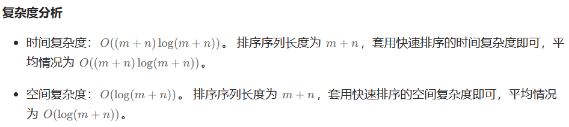

## 剑指25、合并两个有序链表

```cpp
#include <iostream>
using namespace std;

struct ListNode{
    int val;
    ListNode* next;
    ListNode(int x):val(x){}
};

ListNode* merge(ListNode* p1, ListNode* p2){
    ListNode* p3=new ListNode(0);
    ListNode* dummy=p3;
    while(p1!=nullptr && p2!=nullptr){
        if(p1->val <= p2->val){
            p3->next=p1;
            p1=p1->next;
            p3=p3->next;
        }
        else{
            p3->next=p2;
            p2=p2->next;
            p3=p3->next;
        }

    }
    p3->next=p1?p1:p2;
    return dummy->next;
}

ListNode* create(){
    ListNode* dummy=new ListNode(-1);
    ListNode* pre=dummy;
    // ListNode* cur=nullptr;

    int num;
    while(cin>>num){
        if(num==-1){
            pre->next = nullptr;
            break;
        } 
        ListNode* cur=new ListNode(num);
        pre->next=cur;
        pre=cur;
    }

    return dummy->next;
}

void output(ListNode* head){
    while(head){
        cout<<head->val<<" ";
        head=head->next;
    }
    cout<<endl;
}

int main(){
    ListNode* p1=create();
    ListNode* p2=create();
    // output(p1);
    // output(p2);

    ListNode* p3=merge(p1, p2);
    output(p3);
    
    
    return 0;
}
```


## 反转链表

```cpp
#include <iostream>
using namespace std;
struct ListNode{
    int val;
    ListNode* next;
    ListNode(int x):val(x), next(nullptr){}
};

ListNode* reverse(ListNode* head){
    ListNode* cur=head;
    ListNode* pre=nullptr;
    while(cur){
        ListNode* tmp=cur->next;
        cur->next=pre;
        pre=cur;
        cur=tmp;
    }
    return pre;
}

ListNode* create(){
    ListNode* dummy=new ListNode(-1);
    ListNode* pre=dummy;
    ListNode* cur=nullptr;
    int num;
    while(cin>>num){
        if(num==-1){
            pre->next=nullptr;
            break;
        }
        cur=new ListNode(num);
        pre->next=cur;
        pre=cur;
    }
    return dummy->next;
}

int main(){
    ListNode* p1=create();
    p1=reverse(p1);
    while(p1){
        cout<<p1->val<<" ";
        p1=p1->next;
    }
    cout<<endl;

    return 0;
}
```


## LRU缓存

```cpp
#include <iostream>
#include <unordered_map>
using namespace std;

struct DLinkedNode{
    int key, val;
    DLinkedNode* pre, *next;
    DLinkedNode():key(0), val(0), pre(nullptr), next(nullptr){}
    DLinkedNode(int _key, int _val):key(_key), val(_val), pre(nullptr), next(nullptr){}
};

class LRUCache{
public:
    unordered_map<int, DLinkedNode*> cache;
    DLinkedNode* head;
    DLinkedNode* tail;
    int size;
    int capacity;

public:
    LRUCache(int _capacity){
        size=0;
        capacity=_capacity;
        head=new DLinkedNode();
        tail=new DLinkedNode();
        head->next=tail;
        tail->pre=head;

    }

    int get(int key){
        if(!cache.count(key)){
            return -1;
        }
        DLinkedNode* node=cache[key];
        moveToHead(node);
        return node->val;

    }

    void put(int key, int value){
        if(!cache.count(key)){
            DLinkedNode* node=new DLinkedNode(key, value);
            cache[key]=node;
            addTohead(node);
            ++size;
            if(size>capacity){
                DLinkedNode* removed=removeTail();
                cache.erase(removed->key);
                delete removed;
                --size;
            }
        }
        else{
            DLinkedNode* node=cache[key];
            node->val=value;
            moveToHead(node);
        }
    }

    void addTohead(DLinkedNode* node){
        node->pre=head;
        node->next=head->next;
        head->next->pre=node;
        head->next=node;
    }

    void removeNode(DLinkedNode* node){
        node->next->pre=node->pre;
        node->pre->next=node->next;
    }

    void moveToHead(DLinkedNode* node){
        removeNode(node);
        addTohead(node);
    }

    
    DLinkedNode* removeTail(){
        DLinkedNode* node=tail->pre;
        removeNode(node);
        return node;
    }

};


int main(){
    LRUCache cache(2);
    DLinkedNode* cur=nullptr;
    cache.put(1, 1);
    cache.put(2, 2);
    cache.get(1);       // 返回  1
    cache.put(3, 3);    // 该操作会使得密钥 2 作废
    // cur=cache.head->next;
    // while(cur!=cache.tail){
    //     cout<<cur->val<<" ";
    //     cur=cur->next;
    // }
    cache.get(2);       // 返回 -1 (未找到)
    cache.put(4, 4);    // 该操作会使得密钥 1 作废
    cur=cache.head->next;
    while(cur!=cache.tail){
        cout<<cur->val<<" ";
        cur=cur->next;
    }
    cache.get(1);       // 返回 -1 (未找到)
    cache.get(3);       // 返回  3
    cache.get(4);       // 返回  4

    return 0;
}
```

### 第2种

```cpp
#include <iostream>
#include <unordered_map>
#include <list>
using namespace std;

class LRUCache{
public:
    list<pair<int,int>> cache;
    unordered_map<int, list<pair<int,int>>::iterator> map;
    int cap;
public:
    LRUCache(int capacity){
        cap=capacity;
    }

    int get(int key){
        if(map.count(key)>0){
            auto temp=*map[key];
            cache.erase(map[key]);
            map.erase(key);
            cache.push_front(temp);
            map[key]=cache.begin();
            return temp.second;
        }

        return -1;
    }

    void put(int key, int value){
        if(map.count(key)>0){
            cache.erase(map[key]);
            map.erase(key);
        }
        else if(cap==cache.size()){
            auto temp=cache.back();
            map.erase(temp.first);
            cache.pop_back();
        }

        cache.push_front(pair<int, int>(key, value));
        map[key]=cache.begin();
    }
};

int main(){
    LRUCache cache(2);
    // DLinkedNode* cur=nullptr;
    cache.put(1, 1);
    cache.put(2, 2);
    cache.get(1);       // 返回  1
    cache.put(3, 3);    // 该操作会使得密钥 2 作废
    
    cache.get(2);       // 返回 -1 (未找到)
    cache.put(4, 4);    // 该操作会使得密钥 1 作废
    auto it=cache.cache.begin();;
    while(it!=cache.cache.end()){
        cout<<it->first<<":"<<it->second<<endl;
        it++;
    }
    cache.get(1);       // 返回 -1 (未找到)
    cache.get(3);       // 返回  3
    cache.get(4);       // 返回  4

    return 0;
}
```


## 奇偶链表

```cpp
#include <iostream>
using namespace std;

struct ListNode{
    int val;
    ListNode* next;
    ListNode(int _val):val(_val), next(nullptr){}
};

ListNode* oddEvenList(ListNode* head){
    if(head==nullptr || head->next==nullptr || head->next->next==nullptr){
        return head;
    }

    ListNode* first=head;
    ListNode* second=head->next;
    ListNode* tmp=second;

    while(second!=nullptr && second->next!=nullptr){
        first->next=first->next->next;
        first=first->next;
        second->next=second->next->next;
        second=second->next;
    }

    first->next=tmp;
    return head;
}

ListNode* create(){
    ListNode* dummy=new ListNode(-1);
    ListNode* pre=dummy;
    int num;
    while(cin>>num){
        if(num==-1){
            pre->next=nullptr;
            break;
        }
        ListNode* cur=new ListNode(num);
        pre->next=cur;
        pre=cur;
    }
    return dummy->next;
}

int main(){
    ListNode* head=create();
    head=oddEvenList(head);
    while(head!=nullptr){
        cout<<head->val<<" ";
        head=head->next;
    }
}
```


## 写三个线程交叉打印ABC

C++标准库中的线程、互斥锁和条件变量来实现线程间的同步和协作

```cpp
#include<iostream>
#include<thread>
#include<mutex>
#include<condition_variable>
using namespace std;

// 定义一个互斥锁，用于同步多线程访问共享资源
mutex mymutex;

// 定义一个条件变量，用于在多个线程间同步某些条件
condition_variable cv;

// 一个整数变量，表示当前应执行的线程
int flag=0;

// 打印字符'a'的线程函数
void printa(){
    // 使用unique_lock进行锁的管理，当离开作用域时自动释放锁
    unique_lock<mutex> lk(mymutex);

    int count=0;
    // 循环打印10次字符'a'
    while(count<10){
        // 如果flag不为0，则当前线程需要等待
        while(flag!=0) cv.wait(lk);

        cout<<"thread 1: a"<<endl;  // 打印字符'a'
        flag=1;  // 设置标志为1，表示下一个执行的应该是线程2
        cv.notify_all();  // 通知所有等待的线程检查条件
        count++;
    }
    cout<<"my thread 1 finish"<<endl;  // 表示线程1的执行完成
}

// 打印字符'b'的线程函数
void printb(){
    unique_lock<mutex> lk(mymutex);

    for(int i=0;i<10;i++){
        // 如果flag不为1，则当前线程需要等待
        while(flag!=1) cv.wait(lk);

        cout<<"thread 2: b"<<endl;  // 打印字符'b'
        flag=2;  // 设置标志为2，表示下一个执行的应该是线程3
        cv.notify_all();  // 通知所有等待的线程检查条件
    }
    cout<<"my thread 2 finish"<<endl;  // 表示线程2的执行完成
}

// 打印字符'c'的线程函数
void printc(){
    unique_lock<mutex> lk(mymutex);

    for(int i=0;i<10;i++){
        // 如果flag不为2，则当前线程需要等待
        while(flag!=2) cv.wait(lk);

        cout<<"thread 3: c"<<endl;  // 打印字符'c'
        flag=0;  // 设置标志为0，表示下一个执行的应该是线程1
        cv.notify_all();  // 通知所有等待的线程检查条件
    }
    cout<<"my thread 3 finish"<<endl;  // 表示线程3的执行完成
}


int main(){
    thread th1(printb);
    thread th2(printa); 
    thread th3(printc);

    th1.join();
    th2.join();
    th3.join();
    cout<<" main thread "<<endl;


}

```


这段代码是一个线程函数 `printb`，用于打印字符'b'。它使用了互斥锁和条件变量来实现多线程之间的同步和协调。让我们逐步解析代码的作用机制：

1. `unique_lock<mutex> lk(mymutex);`：在函数内部，首先创建了一个 `unique_lock` 对象 `lk`，它使用了 `mymutex` 互斥锁。`unique_lock` 是一种智能锁，它可以管理锁的生命周期，确保在函数执行完毕或出现异常时自动释放锁。这一步确保了在函数内部只有一个线程可以获得互斥锁，从而避免了多个线程同时访问共享资源的问题。

2. 循环部分：代码进入一个循环，该循环打印字符'b'，然后进行一些同步操作。

   - `while(flag!=1) cv.wait(lk);`：这是一个循环，其作用是等待条件 `flag == 1` 满足。如果 `flag` 不等于 1，线程会调用 `cv.wait(lk)` 进入等待状态。在等待期间，线程会释放互斥锁 `lk`，从而允许其他线程继续执行。等待期间，线程会一直等待，直到其他线程调用 `cv.notify_*()` 函数通知条件已满足。

   - 一旦条件 `flag == 1` 被满足，线程会从等待状态被唤醒，重新获得互斥锁 `lk`，然后继续执行下面的代码。

   - `cout<<"thread 2: b"<<endl;`：一旦线程获得锁并且条件满足，它会打印字符'b'。

   - `flag=2;`：设置 `flag` 的值为 2，表示下一个应该执行的线程是线程3（printc 函数）。

   - `cv.notify_all();`：通知所有等待的线程检查条件。这将唤醒其他线程，使它们能够重新检查条件并决定是否继续执行。

3. `cout<<"my thread 2 finish"<<endl;`：这一行代码表示线程2的执行完成，它会在循环执行完成后输出。注意，在这里并没有显式释放互斥锁 `lk`，但由于 `unique_lock` 对象 `lk` 在离开作用域时会自动释放锁，所以在函数结束时会自动释放互斥锁。

总结：这段代码利用互斥锁和条件变量，使线程2等待条件 `flag == 1` 的满足。一旦条件满足，线程2会打印字符'b'，然后设置 `flag` 为2，通知其他等待的线程检查条件。通过这种方式，线程之间实现了有序的执行，避免了忙等待，从而有效地同步和协调了多个线程的操作。

```cpp
void printb(){
    unique_lock<mutex> lk(mymutex);

    for(int i=0;i<10;i++){
        // 如果flag不为1，则当前线程需要等待
        while(flag!=1) cv.wait(lk);

        cout<<"thread 2: b"<<endl;  // 打印字符'b'
        flag=2;  // 设置标志为2，表示下一个执行的应该是线程3
        cv.notify_all();  // 通知所有等待的线程检查条件
    }
    cout<<"my thread 2 finish"<<endl;  // 表示线程2的执行完成
}
```


### 第2次：自己写

```cpp
#include <iostream>
#include <thread>
#include <mutex>
#include <condition_variable>
using namespace std;

mutex mymutex;
condition_variable cv;
int flag=0;
int n=10;

void printa(){
    unique_lock<mutex> lk(mymutex);
    for(int i=0;i<n;i++){
        while(flag!=0) cv.wait(lk);
        cout<<"A"<<endl;
        flag=1;
        cv.notify_all();
    }
}

void printb(){
    unique_lock<mutex> lk(mymutex);
    for(int i=0;i<n;i++){
        while(flag!=1) cv.wait(lk);
        cout<<"B"<<endl;
        flag=2;
        cv.notify_all();
    }
}

void printc(){
    unique_lock<mutex> lk(mymutex);

    for(int i=0;i<n;i++){
        while(flag!=2) cv.wait(lk);
        cout<<"C"<<endl;
        flag=0;
        cv.notify_all();
    }
}

int main(){
    thread th1(printa);
    thread th2(printb);
    thread th3(printc);

    th1.join();
    th2.join();
    th3.join();

    return 0;
}
```


## Top K

```cpp
#include <iostream>
#include <queue>
#include <algorithm>
#include <functional>
using namespace std;

// 用堆的方式来解决
vector<int> TopK(vector<int>& nums, int k){
    vector<int> res;
    priority_queue<int, vector<int>, greater<int>> minHeap;
    for(int i=0;i<k;i++) {
        minHeap.push(nums[i]);
    }
    for(int i=k;i<nums.size();i++){
        if(nums[i]> minHeap.top()){
            minHeap.pop();
            minHeap.push(nums[i]);
        }
    }
    while(!minHeap.empty()){
        res.push_back(minHeap.top());
        minHeap.pop();
    }
    sort(res.begin(), res.end(), greater<int>());
    return res;
}

vector<int> create(){
    vector<int> nums;
    int num;
    while(cin>>num){
        nums.push_back(num);
        if(getchar()=='\n'){
            break;
        }
    }
    return nums;
}

int main(){
    vector<int> nums=create();
    vector<int> res=TopK(nums, 3);
    

    for(int i=0;i<res.size();i++){
        cout<<res[i]<<" ";
    }
    return 0;

}
```


## 合并两个有序数组

### 方法1：双指针法

需要一个额外的数组空间，每次把nums1和nums2中较小的数存放到这个数组空间。

```cpp
class Solution {
public:
    void merge(vector<int>& nums1, int m, vector<int>& nums2, int n) {
        int i=0, j=0;
        int k=0;
        vector<int> nums(m+n);
        while(i<m && j<n){
            if(nums1[i]<=nums2[j]){
                nums[k]=nums1[i];
                k++;
                i++;
            }
            else{
                nums[k]=nums2[j];
                k++;
                j++;
            }
        }

        if(i<m){
            while(i<m){
                nums[k]=nums1[i];
                k++;
                i++;
            }
        }
        else{
            while(j<n){
                nums[k]=nums2[j];
                k++;
                j++;
            }
        }

        nums1=nums;
    }
};
```


### 方法2：直接合并后进行排序

```cpp
class Solution {
public:
    void merge(vector<int>& nums1, int m, vector<int>& nums2, int n) {
        for (int i = 0; i != n; ++i) {
            nums1[m + i] = nums2[i];
        }
        sort(nums1.begin(), nums1.end());
    }
};
```




### 方法3：从后面开始确定

[88. 合并两个有序数组 - 力扣（LeetCode）](https://leetcode.cn/problems/merge-sorted-array/solutions/126371/88-by-ikaruga/)

1. 思路的重点一个是从后往前确定两组中该用哪个数字
2. 另一个是结束条件以第二个数组全都插入进去为止

```cpp
void merge(vector<int>& nums1, int m, vector<int>& nums2, int n) {
    int i = nums1.size() - 1;
    m--;
    n--;
    while (n >= 0) {
        while (m >= 0 && nums1[m] > nums2[n]) {
            swap(nums1[i--], nums1[m--]);
        }
        swap(nums1[i--], nums2[n--]);
    }
}
```


