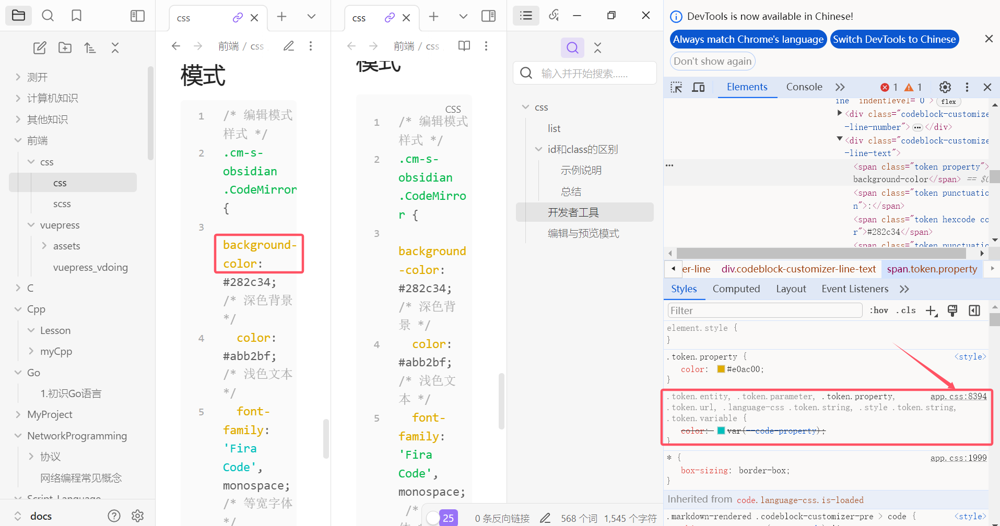

# css

## list

- ul：无序列表
- ol：有序列表
- li：子元素列表项

## id和class的区别

1. **唯一性**：
   - `id` 是唯一的。一个页面中每个 `id` 只能出现一次。它通常用于标识单个元素，并且在 JavaScript 中也常用于获取特定的元素。
   - `class` 可以在多个元素上使用。它通常用于标识一组具有相同样式或行为的元素。
2. **选择器优先级**：
   - `id` 选择器的优先级比 `class` 选择器高。在 CSS 中，`id` 选择器的优先级是 100，而 `class` 选择器的优先级是 10。
   - 这意味着在冲突的情况下，`id` 选择器的样式会覆盖 `class` 选择器的样式。

### 示例说明

假设您有如下 HTML 和 CSS：

```html
<!DOCTYPE html>
<html lang="zh-CN">
<head>
  <meta charset="UTF-8">
  <title>示例页面</title>
  <style>
    #main-title {
      color: red; /* 仅应用于 id 为 main-title 的元素 */
    }
    .vp-hero-title {
      font-size: 2em; /* 应用于 class 为 vp-hero-title 的所有元素 */
    }
  </style>
</head>
<body>
  <h1 id="main-title" class="vp-hero-title">smileatl Repository</h1>
  <h2 class="vp-hero-title">Another Title</h2>
</body>
</html>
```

在这个示例中：

- `<h1>` 元素将会应用红色的文字颜色和 2 倍于默认大小的字体。
- `<h2>` 元素将会应用 2 倍于默认大小的字体，但不会应用红色的文字颜色，因为它没有 `id="main-title"`。

### 总结

- 使用 `id` 来唯一标识一个元素，并为其设置特定样式或行为。
- 使用 `class` 来标识一组元素，并为它们设置相同的样式或行为。
- `id` 选择器的优先级高于 `class` 选择器。
## 开发者工具

通过开发这工具F12查看页面元素。

在obsidian中是 `ctrl+shift+i`

（1）鼠标悬停在该元素上面-右键-检查  
（2）在开发者工具的左上角，你会看到一个类似于箭头或鼠标指针的图标（通常是一个方框内有一个箭头）。点击这个图标启用元素选择器工具。

点击对应的元素，找到它的属性代码，可以从app.css文件中直接copy



## 编辑与预览模式

```css
/* 编辑模式样式 */
.cm-s-obsidian .CodeMirror {
  background-color: #282c34; /* 深色背景 */
  color: #abb2bf; /* 浅色文本 */
  font-family: 'Fira Code', monospace; /* 等宽字体 */
}
/* 阅读模式样式 */
.markdown-preview-view {
  background-color: #ffffff; /* 白色背景 */
  color: #333333; /* 深色文本 */
  font-family: 'Georgia', serif; /* 衬线字体 */
  line-height: 1.6; /* 增加行高 */
}
```

## `<span> </span>和 <div> </div>和<a> </a>和<p> </p>有什么区别`

HTML 标签，用于在网页中定义和组织内容的不同部分。它们之间的区别如下：

```
1. <span></span> 标签是一个内联元素，用于对文本或其他内联元素进行分组并应用样式。它通常用于对特定文本进行样式化或添加额外的标记。例如，可以使用<span>标签来设置文本的颜色、字体大小或应用其他样式。
    
2. <div></div> 标签是一个块级元素，用于创建一个独立的区块，可用于组织和布局页面的内容。它通常用于创建页面的不同部分，如头部、侧边栏、内容区域和页脚等。<div>标签可以通过 CSS 进行样式化，并且可以容纳其他 HTML 元素。
3. <a></a> 标签是超链接元素，用于创建链接到其他网页、文件或位置的锚点。它通常用于创建文本或图像的可点击链接。在<a>标签中，href 属性定义了链接目标的 URL。例如，<a href="https://www.example.com">链接文本</a> 将创建一个指向 [https://www.example.com](https://www.example.com/) 的链接。
    
4. <p></p> 标签用于定义段落。它是一个块级元素，用于在文档中创建段落，通常用于分隔和组织文本内容。<p>标签会在段落前后创建一些间距，并自动换行。
```

## 空格和点号区别

在上述的 CSS 代码中，`.rounded-button.red` 和 `.rounded-button span` 是两个不同的选择器，它们之间的空格代表了不同的关系。

- `.rounded-button.red` 是一个组合选择器，它选择同时具有 `rounded-button` 类和 `red` 类的元素。这意味着一个元素必须同时具有这两个类才会被选择。引用时 `rounded-button red`
- `.rounded-button span` 是一个后代选择器，它选择 `.rounded-button` 元素内部的 `span` 元素。这意味着 `span` 元素必须是 `.rounded-button` 元素的后代元素才会被选择。

所以，这两个选择器的区别在于它们选择元素的方式不同。`.rounded-button.red` 选择具有两个类的元素，而 `.rounded-button span` 选择 `.rounded-button` 元素内部的 `span` 元素。