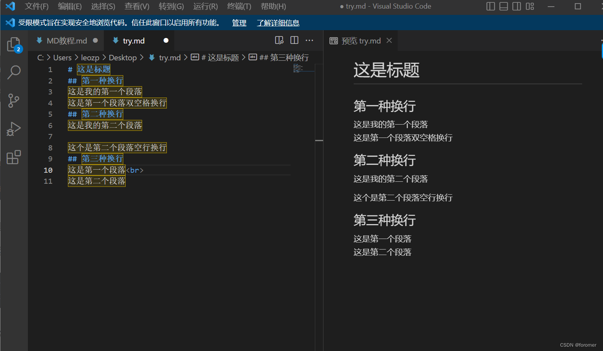

### 对于目录结构词的设置

Catalogue目录中的 pageComponent.data.path，要为其生成目录页的文件夹的相对路径，必需

- 必须是在`docs`目录底下的文件夹相对路径
- 示例：`01.学习笔记`或`01.学习笔记/01.前端`(有序号的要带序号)


当目录页的路径具有三个或更多级别时，切换到目录页时可能会发生显示问题，前几项内容可能会被覆盖。

1. 要么就三级目录，三级目录下放.md文件，二级目录做链接
2. 可以四级目录，四级目录下放.md文；但是要保证二级目录的内容一定要是有用的，这样path就可以只写到二级路径，不用说写到三级目录，导致目录页切换时的显示问题，然后二级目录做链接


### 侧边栏标题

侧边栏文件的目录是从2级标题开始的，所以在2级标题开始写重要的东西

  

### algolia只搜索到文件夹

这是因为至少要有三级索引，非导航栏的每个目录算一级，md文件的每级标题也算一级

不够的会用document替换


### 高亮、加粗失败

```
1）typora中高亮是==词==，但是vuepress是markdown-it渲染器，没有这个语法，高亮可以用<mark>词</mark>
2）**词：**词，这样会没办法加粗，对于有符号的加粗情况，需要第2词前空1格，**词：** 词
```


### 标红

```
<font color='red'></font>
```


### article属性

- `false` 判定当前页面为非文章页

对于非文章页，如目录页、关于、友情链接等自定义页面，需要设置此项。设置之后这个页面将被认定为非文章页，不显示面包屑和作者、时间，不显示最近更新栏，不会参与到最近更新文章的数据计算中。

<https://www.r2coding.com/#/>

\<mark\>

### 网页链接的方式

```markdown
1）<https://www.r2coding.com/#/>
2）[Road To Coding](https://www.r2coding.com/#/)
```


1）、2）的链接方式会有一个链接的小图标

```markdown
3）<a href="/pdf/heima-C-basic-2018.pdf" target="_blank" rel="noopener">黑马C基础讲义2018修订版</a>
target="_blank"：在新窗口打开
rel="noopener"：不重复打开同一个
```

3）的链接是没有链接的小图标

### 链接到指定标题

```
[ 联系 ](/about/#联系)
```

::: note 序言
记录习惯，生活更加可见性有序。

`<!-- more -->` 是一种在博客文章中截断正文，只显示前面一部分内容的标记符号。使用该标记可以让读者快速了解文章的主要内容，并且在列表页面上显示摘要而不是完整文章，更加美观和便于阅读。

在Markdown语言中，您可以在文章正文中添加 `<!-- more -->` 来指定截断位置，之后的内容将不会被显示。一些静态网站生成器（如Hexo、Jekyll等）会根据该标记符号自动将文章截断并生成摘要。

示例代码：

```
复制代码这里是文章的开头部分...

<!-- more -->

这里是文章的后续部分...
```

上述代码中，`<!-- more -->` 标记符号以下的内容将被省略不显示，只有前面的部分会在列表页面中进行展示。

### 换行




### vuepress编译乱掉问题

打不开可能：

```
<>， 被识别成html
图片问题，路径乱掉
不把冒号：放在****里面，标点符号问题
```

我的文件助手 20:33:13

```
<mark></mark>  # 高亮
<font color='red'></font>  # 标红
```

git commit后才能有最近更新时间


### 打不开可能

```
1）<word>，这样会被识别成html语言，要\<word\>    _word_会被识别成斜体，也要\_word\_
2）图片问题，存在中文路径，导致路径乱掉
```


### npm run deploy失败

大概率是因为图片路径错误，包含中文或者乱码

### npm run dev可以找到图片，但是部署到github page上时找不到

这种情况通常是因为在本地开发环境中，图片路径是相对于本地服务器的根目录，而在部署到 GitHub Pages 上时，图片路径需要相对于 GitHub Pages 的根目录。

为了解决这个问题，你可以在你的 VuePress 项目中使用相对路径来引用图片。具体来说，你可以在你的 Markdown 文件中使用相对路径来引用图片，如下所示：

```markdown

```

这将会相对于当前 Markdown 文件的路径来引用 `my-image.png` 图片。

另外，你还需要将图片文件夹添加到你的 VuePress 项目的 `docs/.vuepress/public` 文件夹中。这样，当你部署到 GitHub Pages 上时，图片文件夹将会被自动复制到 GitHub Pages 的根目录中，从而可以正确地引用图片。

在本地开发环境中，图片将会从 `http://localhost:8080/images/my-image.png` 加载。在部署到 GitHub Pages 上后，图片将会从 `https://<username>.github.io/<repository>/images/my-image.png` 加载。


### 网页利用浏览器pdf在线预览与下载

```markdown
<a :href="$withBase('/your-pdf-file.pdf')" target="_blank">点击此处在线阅读</a>
```

在HTML中，**href**是一个超链接的属性，它指定了链接跳转的目标URL。在这个例子中，href="/pdf/test.pdf"指定了PDF文件的路径。**target**属性指定了在哪个窗口或框架中打开链接，_blank表示在新的窗口中打开链接。rel属性指定了链接与目标URL之间的关系，**noopener**表示在打开新窗口时防止新窗口访问原来的页面，以提高安全性。

### 目录问题

```
assets/		从当前文件所在目录下去找
./assets	从当前文件所在目录下去找

/assets/	从根目录下的assets去找，
			对于window下的vscode来说是当前文件目录，但是要打开md文件所在的文件夹
			对于windows下的Typora来说也是当前文件目录
```

所以以后编辑时，直接在本地把图片的路径改为assets/，这样移到vuepress项目里时改成/assets/


### 文章title

- 类型: `string`
- 默认：`.md`文件的名称  （其他vuepress主题可能是h1_title）

当前页面的标题


### Emoji表情

[Emoji百科(opens new window)](https://emojipedia.org/)

小技巧

在任意输入框快速打开emoji表情方法：
Windows系统下按Win + .
Mac系统下按Control + Command + 空格


###   其他注意事项

- 图片名字不能太长
- 图片注意用复制而不用移动