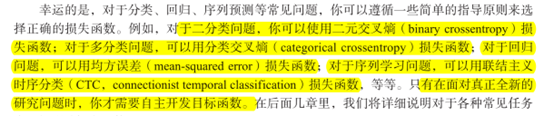
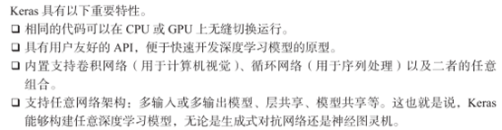
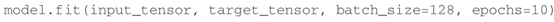
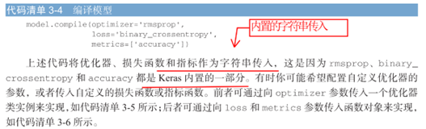
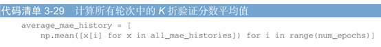
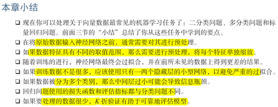
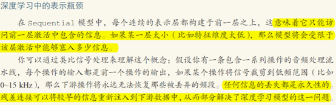

## 第二章 神经网络的数学基础

### 2.2 神经网络的数据表示

#### 张量定义：

张量是矩阵向任意维度的推广［注意，张量的维度（dimension）通常叫作轴（axis）］。

#### 2.2.1 标量（0D张量）

仅包含一个数字的张量叫作标量（scalar，也叫标量张量、零维张量、0D张量）

#### 2.2.2 向量（1D张量）

数字组成的数组叫作向量（vector）或一维张量（1D张量）。

#### 2.2.3 矩阵（2D张量）

向量组成的数组叫作矩阵（matrix）或二维张量（2D张量）。

#### 2.2.4 3D张量与更高维张量

1、将多个矩阵组合成一个新的数组，可以得到一个 3D张量，你可以将其直观地理解为数字组成的立方体。

2、将多个 3D张量组合成一个数组，可以创建一个 4D张量，以此类推

#### 2.2.5 关键属性

前面矩阵示例的形状为 (3, 5)，3D张量示例的形状为 (3, 3, 5)。向量的形状只包含一个元素，比如 (5,)，而标量的形状为空，即 ()。

<mark>（把向量理解成列向量，5行1列）</mark>

#### 2.2.7 数据批量的概念

##### 样本轴：

常来说，深度学习中所有<mark>数据张量的第一个轴（0轴，因为索引从 0开始）都是样本轴</mark>（samples axis，有时也叫样本维度）

##### 批量张量：

对于这种批量张量，第一个轴（0轴）叫作批量轴（batch axis）或批量维度（batch dimension）。

#### 2.2.8 现实世界中的数据张量

我们用几个你未来会遇到的示例来具体介绍数据张量。你需要处理的数据几乎总是以下类

别之一。

- 向量数据：2D张量，形状为 (samples, features)。
- 时间序列数据或序列数据：3D张量，形状为 (samples, timesteps, features)。
- 图像：4D张量，形状为 (samples, height, width, channels)或 (samples, channels, height, width)。
- 视频：5D张量，形状为 (samples, frames, height, width, channels)或 (samples, frames, channels, height, width)。

#### 2.2.9 向量数据

这是最常见的数据。对于这种数据集，每个数据点都被编码为一个向量，因此一个数据批量就被编码为 2D张量（即向量组成的数组），其中<mark>第一个轴是样本轴，第二个轴是特征轴</mark>。

#### 2.2.10 时间序列数据或序列数据

当时间（或序列顺序）对于数据很重要时，应该将数据存储在带有时间轴的 3D张量中。

每个样本可以被编码为一个向量序列（即 2D张量），因此一个数据批量就被编码为一个 3D张量

根据惯例，时间轴始终是第 2个轴（索引为 1的轴）。我们来看几个例子。

- 股票价格数据集。每一分钟，我们将股票的当前价格、前一分钟的最高价格和前一分钟的最低价格保存下来。因此每分钟被编码为一个 3D向量，整个交易日被编码为一个形状为 (390, 3)的 2D张量（一个交易日有 390分钟），而 250天的数据则可以保存在一个形状为 (250, 390, 3)的 3D张量中。这里每个样本是一天的股票数据。
- 推文数据集。我们将每条推文编码为 280个字符组成的序列，而每个字符又来自于 128个字符组成的字母表。在这种情况下，每个字符可以被编码为大小为 128的二进制向量 （只有在该字符对应的索引位置取值为 1，其他元素都为 0）。那么每条推文可以被编码为一个形状为 (280, 128)的 2D张量，而包含 100万条推文的数据集则可以存储在一个形状为 (1000000, 280, 128)的张量中。

### 2.3 张量运算

#### 2.3.3 张量点积

图 2-5中，x、y和 z都用矩形表示（元素按矩形排列）。x的行和 y的列必须大小相同，因此 x的宽度一定等于 y的高度。如果你打算开发新的机器学习算法，可能经常要画这种图。

更一般地说，你可以对更高维的张量做点积，只要其形状匹配遵循与前面 2D张量相同的

原则：

(a, b, c, d) . (d,) -> (a, b, c) 

(a, b, c, d) . (d, e) -> (a, b, c, e)

#### 2.3.4 张量变形

##### 变形：

x = x.reshape((6, 1))

##### 转置：

x = np.transpose(x)

#### 2.3.5 张量的几何解释

通常来说，仿射变换、旋转、缩放等基本的几何操作都可以表示为张量运算。

举个例子，要将一个二维向量旋转 theta角，可以通过与一个 2×2矩阵做点积来实现，这个矩阵为 R = [u, v]，其中 u和 v都是平面向量：u = [cos(theta), sin(theta)]，v = [-sin(theta), cos(theta)]。

### 2.4 梯度优化

一种更好的方法是利用网络中所有运算都是可微（differentiable）的这一事实，计算损失相对于网络系数的梯度（gradient），然后向梯度的反方向改变系数，从而使损失降低。

 

#### step因子、学习率

如果取值太小，则沿着曲线的下降需要很多次迭代，而且可能会陷入局部极小点。如果取值太大，则更新权重值之后可能会出现在曲线上完全随机的位置。

你不可能将神经网络的实际训练过程可视化，因为你无法用人类可以理解的方式来可视化 1 000 000维空间。因此最好记住，在这些低维表示中形成的直觉在实践中不一定总是准确的。这在历史上一直是深度学习研究的问题来源

此外，SGD还有多种变体，其区别在于<mark>计算下一次权重更新时还要考虑上一次权重更新，而不是仅仅考虑当前梯度值，比如带动量的 SGD、Adagrad、RMSProp等变体</mark>。这些变体被称为**优化方法（optimization method）或优化器（optimizer）**。其中动量的概念尤其值得关注，它在许多变体中都有应用。<mark>动量解决了 SGD的两个问题：收敛速度和局部极小点。</mark>

#### 2.4.4 链式求导

及未来数年，人们将使用能够进行符号微分（symbolic differentiation）的现代框架来实现神经网络，比如 TensorFlow。也就是说，<mark>给定一个运算链，并且已知每个运算的导数，这些框架就可以利用链式法则来计算这个运算链的梯度函数，将网络参数值映射为梯度值</mark>。对于这样的函数，<mark>反向传播就简化为调用这个梯度函数</mark>。由于符号微分的出现，你无须手动实现反向传播算法。

#### fit

现在你明白在调用 fit时发生了什么：网络开始在训练数据上进行迭代（每个小批量包含128个样本），共迭代 5次［在所有训练数据上迭代一次叫作一个轮次（epoch）］。在每次迭代过程中，网络会计算批量损失相对于权重的梯度，并相应地更新权重。5轮之后，网络进行了2345次梯度更新（每轮 469次），网络损失值将变得足够小，使得网络能够以很高的精度对手写数字进行分类。

## 第三章 神经网络入门

### 3.1神经网络剖析

#### 训练神经网络主要围绕以下四个方面。

- 层，多个层组合成网络（或模型）。
- 输入数据和相应的目标。
- 损失函数，即用于学习的反馈信号。
- 优化器，决定学习过程如何进行。

如图 3-1所示：多个层链接在一起组成了网络，将输入数据映射为预测值。然后损失函数将这些预测值与目标进行比较，得到损失值，用于衡量网络预测值与预期结果的匹配程度。优化器使用这个损失值来更新网络的权重。

#### 3.1.1 层

我们在第 2章中介绍过，神经网络的基本数据结构是层。层是一个数据处理模块，将一个或多个输入张量转换为一个或多个输出张量。有些层是无状态的，但<mark>大多数的层是有状态的，即层的权重</mark>。权重是利用随机梯度下降学到的一个或多个张量，其中包含网络的知识。

<mark>不同的张量格式与不同的数据处理类型需要用到不同的层。</mark>

简单的向量数据保存在形状为 (samples, features)的 2D张量中，通常用密集连接层［densely connected layer，也叫全连接层（fully connected layer）或密集层（dense layer），对应于 Keras的 Dense类］来处理。

序列数据保存在形状为 (samples, timesteps, features)的 3D张量中，通常用循环层（recurrent layer，比如 Keras的 LSTM层）来处理。

图像数据保存在 4D张量中，通常用二维卷积层（Keras的 Conv2D）来处理。

例子：

#### 3.1.3 损失与优化器

具有多个输出的神经网络可能具有多个损失函数（每个输出对应一个损失函数）。但是，梯度下降过程必须基于单个标量损失值。<mark>因此，对于具有多个损失函数的网络，需要将所有损失函数取平均，变为一个标量值。</mark>

##### 分类、回归、序列问题损失函数选择

### 3.2 keras

#### keras具有以下重要特性

#### 3.2.1 Keras、T ensorFlow、Theano和 CNTK

#### 3.2.2 使用 Keras开发：概述

##### 定义模型：sequential类、函数式API

###### 使用sequential类定义的两层模型

###### 使用函数API定义相同模型

###### 指定使用的优化器、损失函数、训练过程想要监控的指标

###### 学习过程就是通过 fit()方法将输入数据的 Numpy数组（和对应的目标数据）传入模型

### 3.4 二分类

#### （1）不能直接将整数序列直接输入神经网络，需要将列表转换为向量

#### 1、代码:将整数序列转为二进制编码

#### （2）标签向量

#### （3）sigmoid可以将输出看作概率值

#### （4）二分类，sigmoid，二元交叉熵

#### 2、代码：编译模型

#### 3、代码：使用自定义的损失和指标

#### （4）由于网络的随机初始化不同，你得到的结果可能不同

#### （5）进一步实验，改隐藏层数、神经元数、损失函数、激活函数

#### （6）小结

### 3.5 多分类问题

#### （1）单标签多分类、多标签多分类

#### 1、代码：编码数据，将标签列表转换为整数张量

#### 2、代码：one-hot编码

#### （2）多分类问题最好的损失函数

最好的损失函数是categorical_crossentropy（分类交叉熵）。

#### 3、代码：将标签转换为整数张量，采用sparse_categorical_crossentropy

注：one hot采用categorical_crossentropy

#### （3）小结

### 3.6 回归问题

#### （1）logistic回归不是回归算法，而是分类算法  

#### （2）准备数据，标准化，预处理

#### 1、代码：数据标准化

##### 注意：用于测试数据标准化的均值和标准差都是在训练数据上计算得到的

#### （3）训练数据数据越少，过拟合会越严重，而较小的网络可以降低过拟合

#### 2、代码：模型定义

##### 注意：最后一层线性层，mse损失函数回归问题中常用

#### 4）验证集非常小，误差很大波动，验证集的划分方式可能造成验证分数上很大的方差

#### 3.6.4 K折交叉验证

#### 3、代码：K折验证

##### 注意：数据集小的时候应该用K折交叉验证

#### 4、代码：保存每折的验证结果

#### 5、代码：计算所有轮次中的 K折验证分数平均值

#### 6、代码：绘制验证分数（删除前10个数据点）

#### 7、代码：训练最终模型，在所有训练数据上训练

#### （5）小结

- 回归常用损失mse
- 不用精度，用MAE做回归指标
- 输入特征具备不同的取值范围，应该预处理
- 数据集小，使用K折验证
- 可用训练数据少，隐层要少，避免过拟合

### 本章小结：

## 第四章 机器学习基础

### 4.1 机器学习分支：监督、无监督、自监督、强化学习

#### （1）有监督学习：有标注、有标签

#### （2）无监督：学习

##### 降维、聚类

#### （3）自监督学习：没有标签，标签仍然存在（因为总要有什么东西来监督学习过程），但它们是从输入数据中生成的，通常是使用启发式算法生成的。

#### （4）强化学习

除游戏外还没有取得实践上的重大成功

### 分类和回归术语表

### 4.2 评估机器学习模型

#### （1）过拟合是机器学习中的核心难点

#### （2）基于验证集调节超参数，本质上就是一种学习，可能导致模型在验证集上过拟合。

##### a、信息泄露：验证集的信息泄露到模型中

##### b、所以需要全新的测试集

#### （3）三种经典评估方法：简单的留出验证、K折验证，以及带有打乱数据的重复 K折验证。

##### a、简单的留出验证

##### 1、代码：留出验证

##### b、K折交叉验证

##### 2、代码：K折交叉验证

##### c、带有打乱数据的重复K折验证

### 4.3 数据预处理、特征工程、特征学习

#### （1）神经网络数据预处理

##### a、向量化

##### b、值标准化+代码

##### c、处理缺失值

#### （2）特征工程的本质：用更简单的方式表述问题，从而使问题变得简单

### 4.4 过拟合与欠拟合的定义

#### （4）正则化：调节允许模型允许存储的信息量，或对模型允许存储的信息加以约束

##### a、减小网络大小

###### smaller model：更小网络开始过拟合的时间要晚于参考网络，而过拟合之后，它的性能变差的速度也更慢

###### bigger model

##### b、添加权重正则化

###### 简单模型比复杂模型更不容易过拟合

###### L1正则化、L2正则化（权重衰减）

###### 1、代码：keras向模型添加权重正则化

###### L2正则化惩罚更不容易过拟合

###### 2、代码：keras中添加不同的权重正则化项

##### c、添加dropout正则化

##### d、获取更多的训练数据

### 4.5 机器学习的通用过程

#### （1）可以将一年中的时间作为模型的一个输入

#### （2）在过去的数据上机器学习预测未来，需假设未来的规律和过去相同，但事实往往并非如此。

#### （3）浏览kaggle网站，获取各种各样的问题和评估指标

#### （4）数据量大留出验证集，少K折交叉验证、重复的K折验证

#### （5）准备数据：数据格式化为张量、张量的取值缩放，数据标准化（不同的特征具有不同的取值范围），特征工程（小数据问题）

#### （6）开发比基准更好的模型：输出可根据输入进行预测，可用数据包含足够多的信息

#### 重重重点:最后一层激活和损失的选择

#### （7）开发过拟合模型：机器学习中无处不在的对立是优化和泛化的对立

#### （8）模型正则化和调节超参数：开发出令人满意的模型配置，你就可以在所有可用数据（训练数据 +验证数据）上训练最终的生产模型，然后在测试集上最后评估一次。

#### 小结:

- a/定义问题与要训练的数据。收集这些数据，有需要的话用标签来标注数据。
-  b/选择衡量问题成功的指标。你要在验证数据上监控哪些指标？
-  c/确定评估方法：留出验证？ K折验证？你应该将哪一部分数据用于验证？
-  d/开发第一个比基准更好的模型，即一个具有统计功效的模型。
-  e/开发过拟合的模型。
-  f/基于模型在验证数据上的性能来进行模型正则化与调节超参数。许多机器学习研究往往只关注这一步，但你一定要牢记整个工作流程。

## 第五章 深度学习用于计算机视觉

### 5.1 卷积神经网络简介

#### （1）卷积运算

密集层和卷积层的根本区别在于，Dense层从输入特征空间中学到的是全局模式（全局模式就是涉及所有像素的模式）

第一个参数，位置固定，含义是过滤器的个数，或者叫卷积核个数，这个与卷积后的输出通道一样，当filters为5时，卷积输出的通道数（最后一位）就是5。

第二个位置参数kernel_size，卷积核尺寸，一般为3×3或者5×5，此处用两个整数的元组或者列表表示，（3，3）、（5，5）。如果height，width长宽一样，直接用一个整数表示就行，比如3或者5。

进行10分类，最后一层使用带10个输出的softmax激活。

在进入两个Dense层之前，形状（3,3,64）的输出形状被展平为形状（576，）的向量，而卷积层学到的是局部模式。学到的就是在输入图像的二维小窗口中发现的模式，上面的例子中这些窗口的大小都是3×3.

##### 特性：

1）学到的模式具有平移不变性：在图像的右下角学到某个模式之后，可以在任何地方识别这个模式。对于密集连接网络来说，如果模式出现在新的位置，只能重新学习这个模式。使得卷积神经网络在处理图像时可以高效利用数据（<mark>因为视觉世界从根本上具有平移不变性</mark>），只需要更少的训练样本就可以学到具有泛化能力的数据表示。

2）可以学到模式的空间层次结构：第一个卷积层将学习到较小的局部模式（比如边缘），第二个卷积层将学习由第一层特征组成的更大的模式，以此类推。这使得卷积神经网络可以有效地学习越来越复杂、越来越抽象的视觉概念（<mark>因为视觉世界从根本上具有空间层次结构</mark>）。

​       对于包含两个空间轴（高度和宽度）和一个深度轴（也叫通道轴）的 3D 张量，其卷积也叫特征图（feature map）。对于 RGB 图像，深度轴的维度大小等于 3，因为图像有 3 个颜色通道：红色、绿色和蓝色。对于黑白图像（比如 MNIST 数字图像），深度等于 1（表示灰度等级）。卷积运算从输入特征图中提取图块，并对所有这些图块应用相同的变换，生成输出特征图（output feature map）。该输出特征图仍是一个 3D 张量，具有宽度和高度，其深度可以任意取值，因为

输出深度是层的参数，深度轴的不同通道不再像 RGB 输入那样代表特定颜色，而是代表过滤器（filter）。过滤器对输入数据的某一方面进行编码，比如，单个过滤器可以从更高层次编码这样一个概念：“输入中包含一张脸。”

在输入上计算32个过滤器，对于 32个输出通道是过滤器对输入的响应图，表示这个过滤器模式在输入中不同位置的响应。

特征图：深度轴的每个维度都是一个特征（或过滤器），而2D 张量output[:, :, n] 是这个过滤器在输入上的响应的二维空间图（map）。

##### 卷积由以下两个关键参数所定义：

1）从输入中提取的图块尺寸：这些图块的大小通常是 3×3 或 5×5。本例中为 3×3这是很常见的选择。

2）输出特征图的深度：卷积所计算的过滤器的数量。本例第一层的深度为32，最后一层的深度是64。

##### keras中Conv2D层：

在3D特征图上滑动窗口，提取周围特征的3D图块（形状：window_height,window_width,input_depth）同同一权重矩阵（卷积核）做张量积——转化成形状为（output_depth，）的1D向量——对所有这些向量进行空间重组，转化为形状为（height，width，output_depth）的3D输出特征图（输出特征图的每个空间位置都对应于输入特征图中的相同位置）。

##### 输出的宽度和高度可能与输入的宽度和高度不同：

1）边界效应，可以通过对输入特征图进行填充来抵消

5×5的特征图、3×3的窗口，变成了3×3的输出特征图

如果希望输出特征图的空间维度与输入相同，可以使用填充。3×3的窗口，左右各添加一列，上下各添加一行；5×5的窗口，各添加两行和两列。

对于Conv2D层，可以通过padding参数来设置填充。“valid”不填充（只使用有效的窗口位置）；“same”表示填充后输出的宽度与高度和输入相同。padding的默认参数值为“valid”。

2）使用了步幅（stride）

步进卷积：使用步幅为2的3×3卷积从5×5输入中提取的图块。

步幅为2意味着特征图的宽度和高度都被做了2倍下采样，在实践中很少使用。通常使用最大池化（max-pooling）运算。

#### （2）最大池化运算

##### 作用：

在每个MaxPooling2D层之后，特征图的尺寸都会减半。

最大池化从输入特征中提取窗口，并输出每个通道的最大值。使用硬编码的max张量运算对局部图块进行变化，而不是使用学到的线性变换（卷积核）。最大池化使用2×2的窗口和步幅为2，其目的是将特征图下采样2倍；而卷积使用3×3窗口和步幅1.

##### 不使用池化层的问题：

1）这种架构不利于学习特征的空间层级结构。第三层的 3×3 窗口中只包含初始输入的7×7 窗口中所包含的信息。卷积神经网络学到的高级模式相对于初始输入来说仍然很小，这可能不足以学会对数字进行分类（你可以试试仅通过7 像素×7 像素的窗口观察图像来识别其中的数字）。我们需要让最后一个卷积层的特征包含输入的整体信息。

2）最后一层的特征图对每个样本共有 22×22×64=30 976 个元素。这太多了。如果你将其展平并在上面添加一个大小为512 的Dense 层，那一层将会有1580万个参数。这对于这样一个小模型来说太多了，会导致严重的过拟合。

##### 下采样的原因：

1）减少需要处理的特征图的元素个数

2）让连续卷积层的观察窗口越来越大（即窗口覆盖原始输入的比例越来越大）

 

特征中往往编码了某种模式或概念在在特征图的不同位置是否存在，观察不同特征的最大值而不是平均能够给出更多的信息。

##### 合理的子采样策略：

1）首先生成密集的特征图（通过无步进的卷积），

2）然后观察特征每个小图块上的最大激活，而不是通过查看输入的稀疏窗口（通过步进卷积）或者对输入图块取平均，因为后两种方法可能导致错过或淡化特征是否存在的信息。

### 5.2 在小型数据集上从头开始训练一个卷积神经网络

#### 1）

##### 策略：

从头开始训练一个小型模型、使用预训练的网络做特征提取、对预训练的网络进行微调。

##### 注意：

处理更大的图像和更复杂的问题，需要相应地增大网络，即再增加一个Conv2D+MaxPooling2D的组合。既可以增大网络容量，也可以进一步减小特征图的尺寸，使其连接在Flatten层时尺寸不会太大。

 

网络中特征图的深度在逐渐增大（从32增大到128），而特征图的尺寸在逐渐减小（从150×150减小到7×7）。这几乎是所有卷积神经网络的模式。

##### 1、代码：将猫狗分类的小型卷积神经网络实例化

特征图的维度随着每层的变化情况

#### 2）数据增强

​       过拟合的原因是学习样本太少，导致无法训练出能够泛化到新数据的模型。如果拥有无限的数据，那么模型能够观察到数据分布的所有内容，这样就永远不会过拟合。数据增强是从现有的训练样本中生成更多的训练数据，其方法是利用多种能够生成可信图像的随机变换来增加（augment）样本。其目标是，模型在训练时不会两次查看完全相同的图像。这让模型能够观察到数据的更多内容，从而具有更好的泛化能力。 

​        <mark>使用数据增强对于防止小型图像数据集的过拟合非常重要。</mark> 

### 5.3 使用预训练的卷积神经网络

#### 含义：

预训练网络是一个保存好的网络，之前已在大型数据集（通常是大规模图像分类任务）上训练好。

#### （1）特征提取 

特征提取是使用之前网络学到的表示来从新样本中提取出有趣的特征。然后将这些特征输入一个新的分类器，从头开始训练。

首先是一系列池化层和卷积层，叫做模型的卷积基。对于卷积神经网络而言，特征提取就是取出之前训练好的网络的卷积基，在上面运行新数据，然后在输出上面训练一个新的分类器。

不重复使用密集连接器。因为卷积基学到的表示可能更加通用，因此更适合重复使用。卷积神经网络的特征图表示通用概念在图像中是否存在，无论面对什么样的计算机视觉问题，这种特征图都可能很有用。

但是，分类器学到的表示必然是针对于模型训练的类别，其中仅包含某个类别出现在整张图像的概率信息。密集连接层的表示不在包含物体在输入图像中的位置信息。密集连接层舍弃了空间的概念，而物体位置信息仍然有卷积特征图描述。如果物体位置对于问题很重要，那么密集连接层的特征在很大程度上是无用的。

某个卷积层的提取的表示的通用（以及复用性）取决于该层在模型中的深度。模型中更靠近底部的层提取的是局部的、高度通用的特征图（比如视觉边缘、颜色和纹理），而更靠近顶部的层提取的是更加抽象的概念（比如“猫耳朵”或“狗眼睛”）。因此，<mark>如果你的新数据集与原始模型训练的数据集有很大差异，那么最好只是使用模型的前几层来做特征提取，而不是使用整个卷积基。</mark>

##### 注意：

更靠近底部的层是指在定义模型时先添加到模型中的层，而更靠近顶部的层则是后添加到模型中的层。

##### 接下来有两种做法：

1）在你的数据集上运行卷积基，将输出保存成硬盘中的 Numpy 数组，然后用这个数据作为输入，输入到独立的密集连接分类器中（与本书第一部分介绍的分类器类似）。这种方法速度快，计算代价低，因为对于每个输入图像只需运行一次卷积基，而卷积基是目前流程中计算代价最高的。但出于同样的原因，这种方法不允许你使用数据增强。

2）在顶部添加 Dense 层来扩展已有模型（即 conv_base），并在输入数据上端到端地运行整个模型。这样你可以使用数据增强，因为每个输入图像进入模型时都会经过卷积基。但出于同样的原因，这种方法的计算代价比第一种要高很多。

##### 冻结的定义：

在编译和训练模型之前，一定要“冻结”卷积基。冻结一个或多个层是指在训练过程中保持其权重不变。不然卷积基之前学到的表示将会在训练过程中被修改。因为其上添加的Dense层是随机初始化的，所以非常大的权重更新将会在网络中传播，对之前学到的表示造成很大破坏。

#### （2）微调模型

对于用特征提取的冻结的模型基，微调是指将其顶部的基层“解冻”，并将这解冻的几层和新增加的部分（此处是全连接分类器）联合训练。微调是指只是略微调整了所复用模型中更加抽象的表示，一遍让这些表示与手头的问题更加相关。

##### 为什么不微调更多的层：

1）卷积基中更靠底部的层编码的是更加通用的可复用特征，而更靠顶部的层编码的是更专业化的特征。微调这些更专业化的特征更加有用，因为它们需要在你的新问题上改变用途。微调更靠底部的层，得到的回报会更少。

2）训练的参数越多，过拟合的风险越大。卷积基有 1500 万个参数，所以在你的小型数据集上训练这么多参数是有风险的。

#### 小结：

1）卷积神经网络是用于计算机视觉任务的最佳机器学习模型。即使在非常小的数据集上也可以从头开始训练一个卷积神经网络，而且得到的结果还不错。

2）在小型数据集上的主要问题是过拟合。在处理图像数据时，数据增强是一种降低过拟合的强大方法。

3）利用特征提取，可以很容易将现有的卷积神经网络复用于新的数据集。对于小型图像数据集，这是一种很有价值的方法。

4）作为特征提取的补充，你还可以使用微调，将现有模型之前学到的一些数据表示应用于 新问题。这种方法可以进一步提高模型性能。

## 第六章 深度学习用于文本和序列

### 6.2 循环神经网络

#### SimpleRNN

##### （1）简单RNN

##### （2）keras中的simpleRNN层

##### 1、代码：simpleRNN

###### 多层时，让所有中间层都返回完整的输出序列

##### 2、代码：使用Embedding层和SimpleRNN层来训练模型

##### （3）simpleRNN不擅长处理长序列，比如文本

#### LSTM

#### （1）只需指定LSTM层的输出维度

#### 3、代码：使用keras中的LSTM层

##### 调节超参数：嵌入维度、LSTM的输出维度，可能缺少正则化

### 6.3 循环神经网络的高级用法

#### （1）循环dropout层、堆叠循环层、双向循环层

#### （2）温度预测问题

##### a）准备数据

##### 1、代码：数据标准化

##### 2、代码：生成时间序列样本及其目标的生成器

##### 3、代码：准备训练生成器、验证生成器和测试生成器

###### 注：训练集中的样本可以打乱

##### 4、代码：计算符合常识的基准方法MAE

##### 5、代码:训练并评估一个密集连接模型，建立一种基本的机器学习方法

##### b）我们的常识中包含了大量有价值的信息，而机器学习模型并不知道这些信息

##### c）如果学习算法没有被硬编码要求去寻找特定类型的简单模型，有时候参数学习是无法找到简单问题的简单解决方案的

##### 6、代码：训练并评估一个基于GRU的模型

##### d）每个时间步使用相同的dropout掩码，为了对GRU、LSTM正则化，应该将不随时间变化的dropout掩码应用于层的内部循环激活（叫做循环dropout掩码）

##### 7、代码：dropout正则化的GRU模型

##### 8、代码：dropout正则化，堆叠GRU模型

##### e）双向RNN，两个RNN分别沿一个方向对输入序列处理整合，可能捕捉到被单项RNN 忽略的模式

##### 9、代码：逆序序列训练并评估一个LSTM

##### 10、代码：训练评估一个双向LSTM

##### 11、代码：双向GRU

##### f）更多尝试：

#### g）小结

### 6.4 用卷积神经网络处理序列

## 第七章 高级深度学习最佳实践

### 7.1 keras函数API

#### sequential

#### 7.1.1 函数式的API

##### 1、代码：sequential及对应的函数API实现

### 深度学习中的表示瓶颈

### 深度学习中的梯度消失及处理

