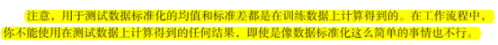
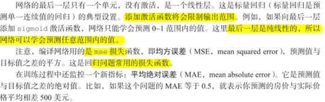
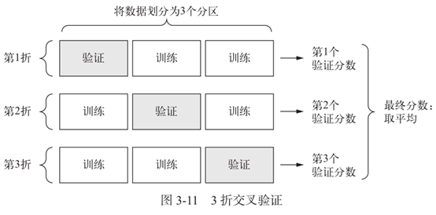
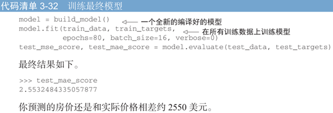

## 1、用神经网络解决回归问题

### 3.6 回归问题

#### （1）logistic回归不是回归算法，而是分类算法

#### （2）准备数据，标准化

#### 1、代码：数据标准化

##### 注意：用于测试数据标准化的均值和标准差都是在训练数据上计算得到的

#### （3）训练数据数据越少，过拟合会越严重，而较小的网络可以降低过拟合

#### 2、代码：模型定义

##### 注意：最后一层线性层，mse损失函数回归问题中常用

#### （4）验证集非常小，误差很大波动，验证集的划分方式可能造成验证分数上很大的方差

#### 3.6.4 K折交叉验证

#### 3、代码：K折验证

##### 注意：数据集小的时候应该用K折交叉验证

#### 4、代码：保存每折的验证结果

#### 5、代码：计算所有轮次中的 K折验证分数平均值

#### 6、代码：绘制验证分数（删除前10个数据点）

#### 7、代码：训练最终模型，在所有训练数据上训练

#### （5）小结

1. 回归常用损失mse
2. 不用精度，用MAE做回归指标
3. 输入特征具备不同的取值范围，应该预处理
4. 数据集小，使用K折验证
5. 可用训练数据少，隐层要少，避免过拟合

### 本章小结：

## 其他

### Embedding层

**Embeding层在某种程度上就是用来降维的**

embedding层，在某种程度上，就是用来降维的，降维的原理就是矩阵乘法。在卷积网络中，可以理解为特殊全连接层操作，跟1x1卷积核异曲同工

A X B时，B的行数必须等于A的列数得出的结果为A的行数 X B的列数的一个矩阵。也就是说，假如我们有一个100W X10W的矩阵，用它乘上一个10W X 20的矩阵，我们可以把它降到100W X 20，瞬间量级降了。。。10W/20=5000倍！！！

这就是嵌入层的一个作用——降维。然后中间那个10W X 20的矩阵，可以理解为查询表，也可以理解为映射表，也可以理解为过度表，whatever。

### 数据泄漏为什么会引起过拟合

数据泄漏会导致模型在训练过程中接触到了本应该被保留的测试数据，从而使得模型在训练集上表现很好但在实际测试集上表现不佳。这会使得模型对测试数据出现过拟合现象，即过度依赖于训练数据中的噪声和异常值，而无法泛化到新的数据集上。

### 如何用GAN生成带有标签的数据

GAN（生成对抗网络）是一种无监督学习的方法，它可以生成与训练数据集相似的新数据。如果需要生成带有标签的数据，可以采用以下方法：

1. 准备带有标签的原始数据集。这些数据应该包含标签信息，以便在生成新数据时可以指定标签。

2. 训练一个条件GAN模型（CGAN），它可以生成带有指定标签的新数据。CGAN是一种特殊的GAN，它在生成新数据时可以指定条件，例如标签信息。

3. 在训练CGAN模型时，需要将原始数据集中的标签信息与数据一起输入模型。这样，模型可以学习如何根据标签信息生成相应的数据。

4. 训练完成后，可以使用CGAN模型生成带有指定标签的新数据。只需输入所需的标签信息，模型就可以生成相应的数据。

需要注意的是，生成的数据可能存在一定的噪声和偏差，因此需要对生成的数据进行筛选和清洗，以保证数据的质量和可靠性。此外，还需要注意生成的数据与原始数据集的分布是否一致，以避免引入偏差和误差。

总之，使用CGAN生成带有标签的数据是一种有效的方法，可以生成符合特定标签要求的数据，但需要注意数据的质量和分布的一致性。

### 怎么样才算深度学习，普通的ANN算吗

深度学习是一种机器学习的方法，它使用多层神经网络来学习数据的特征表示。通常情况下，如果神经网络的层数较少，例如只有一层或两层，那么这种方法就不被称为深度学习。
因此，普通的ANN（人工神经网络）通常不被认为是深度学习。ANN通常只包含一层或两层神经元，用于解决一些简单的分类或回归问题。而深度学习模型通常包含多个隐藏层，可以处理更复杂的数据和任务，例如图像识别、自然语言处理等。
总之，深度学习通常指的是包含多个隐藏层的神经网络模型，而普通的ANN通常不被认为是深度学习。

### 输入特征长度不一致：

您可以使用循环神经网络（RNN）结合全连接层来处理不同长度的输入序列。一种常见的方法是使用RNN对输入序列进行编码，然后使用RNN的输出作为固定长度的编码向量，再将该编码向量输入到全连接神经网络中进行处理。

以下是一个基本的流程：

1. **输入不同长度的向量**：您可以将不同长度的输入向量馈送到RNN中。这些向量可以是时间步长不同的序列数据，例如自然语言处理中的单词序列或时间序列数据。
2. **RNN 编码**：使用RNN 对不同长度的输入序列进行编码。RNN 可以接受变长序列作为输入，并输出相应长度的隐藏状态序列。这些隐藏状态可以被视为输入序列的编码。
3. **获取固定长度编码**：对于每个输入序列，您可以选择不同的方法来获取固定长度的编码。例如，您可以使用最终的RNN 隐藏状态作为整个序列的编码，或者使用池化操作（如平均池化或最大池化）来获得固定长度的编码。
4. **全连接神经网络**：将获得的固定长度编码输入到全连接神经网络中进行处理。由于编码是固定长度的，因此全连接神经网络可以接收不同长度的输入特征。

