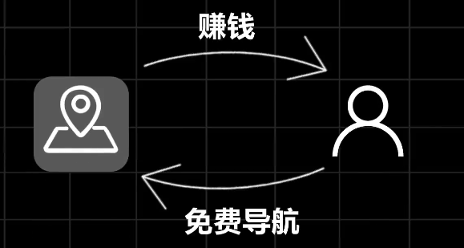

# 商业市场杂拾

## 地图软件年亏几十亿，为什么大厂还做

[一年亏几十亿的地图软件，为什么大厂们还要做？_哔哩哔哩_bilibili](https://www.bilibili.com/video/BV1wXsUeFE5n/?spm_id_from=333.999.0.0&vd_source=75e186a4ea53b333296d6f44a426177c)

用户用免费导航，大厂从用户身上赚钱（地图软件辐射功能，吃喝玩乐、酒店住宿、生活服务、物流快递都与互联网大厂有关；还有汽车厂商，车机自带地图、智能驾驶，都离不开地图软件厂商的背书）

所以虽然年年亏钱，但是还是得做的更好。

