# 厦门两天一夜游

## 中山路

中山路，可以去老街看一看，厦门老城区

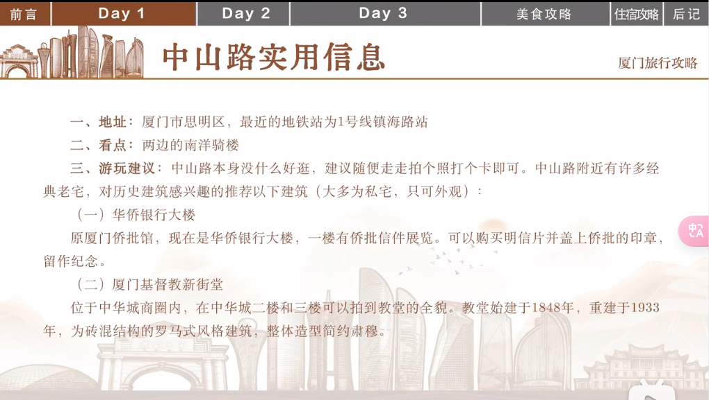

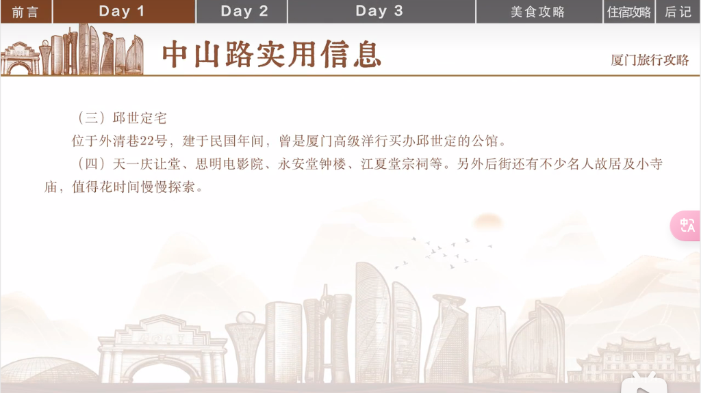

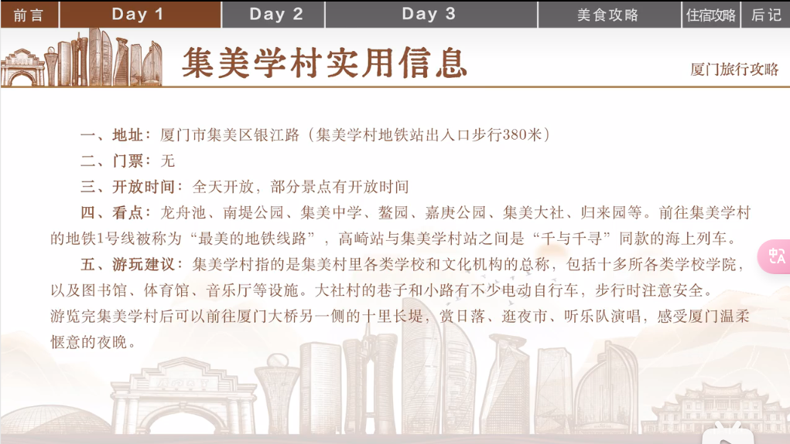

## 集美学村

傍晚可以在十里长堤看日落，夜晚

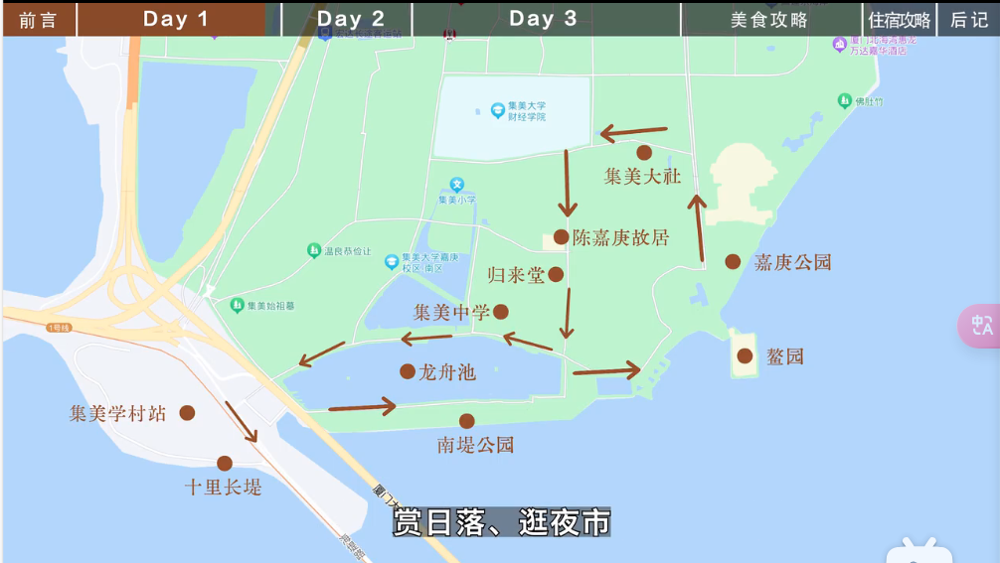

## 厦门铁路文化公园

一小段游玩即可，推荐大生里穿过鸿山隧道一段，可以了解到鹰厦铁路的建设背景，可以顺道上鸿山公园俯瞰厦门城

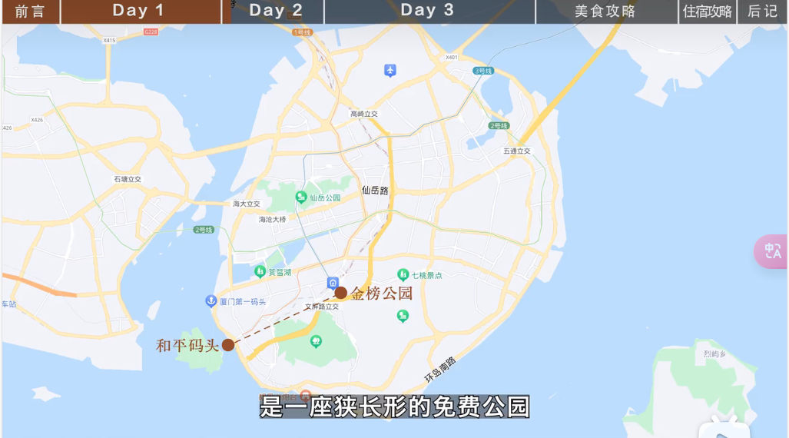

## 沙滩

时间紧张的话就音乐广场到椰风寨沙滩，

再细点，金沙湾1号到黄厝沙滩

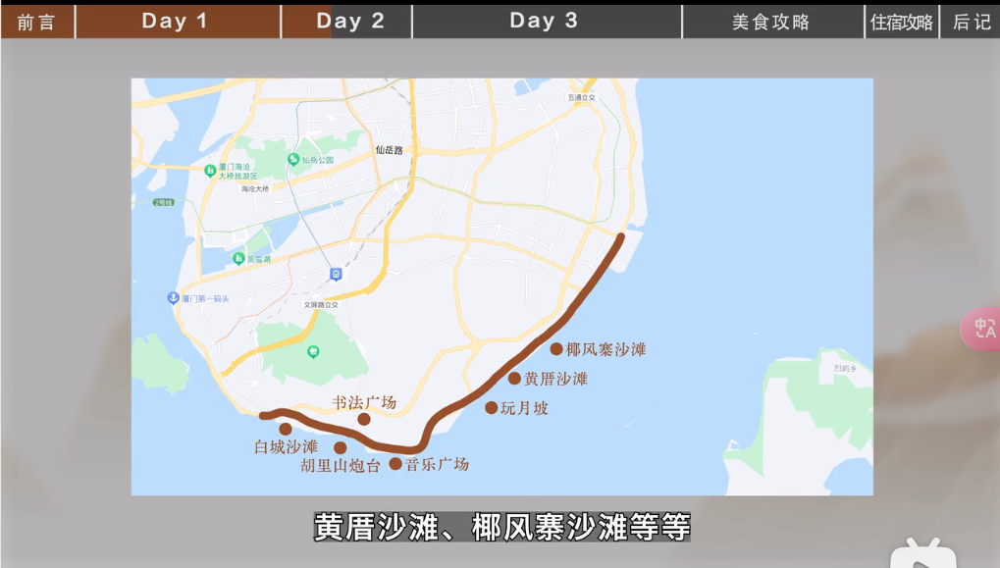

沙坡尾，彩虹墙在西区二楼天台

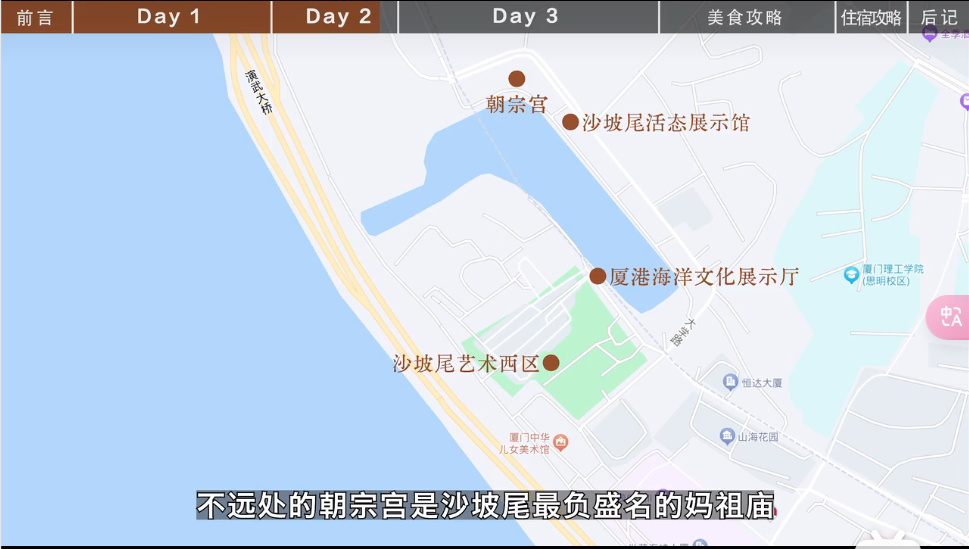

## 鼓浪屿

鼓浪屿一日游

鸦片战争后，成为租界，西方列强在岛上修建了 大量领事馆，

一战爆发，原本在南洋经商的华侨纷纷逃到这里，并且修筑了大量的别墅

鼓浪屿“万国建筑博物馆
之称也由此而来

屿见厦门，

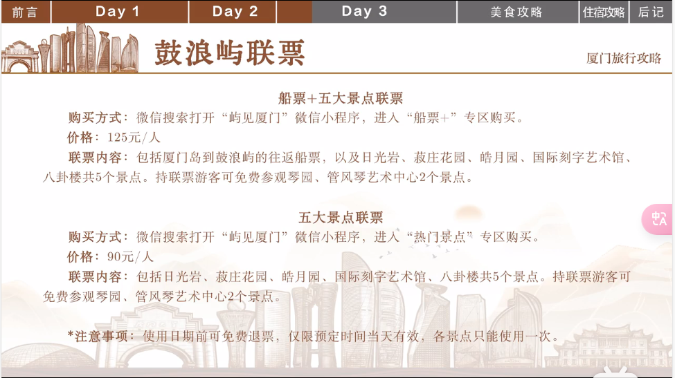

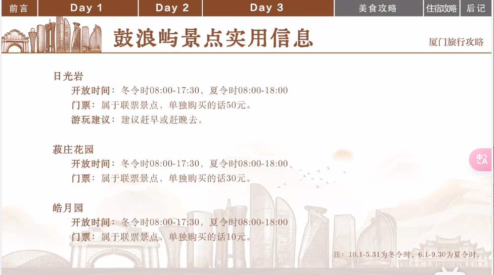

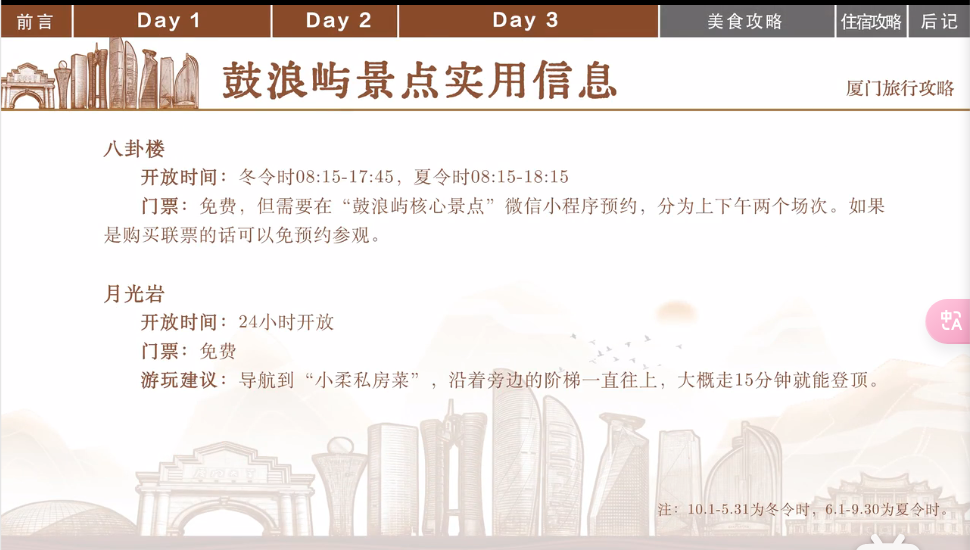

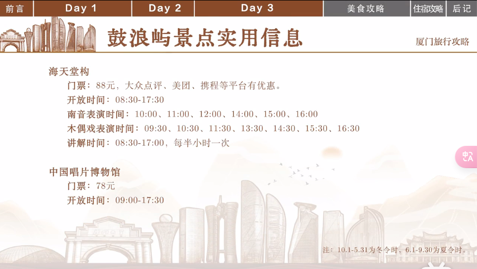

## 美食

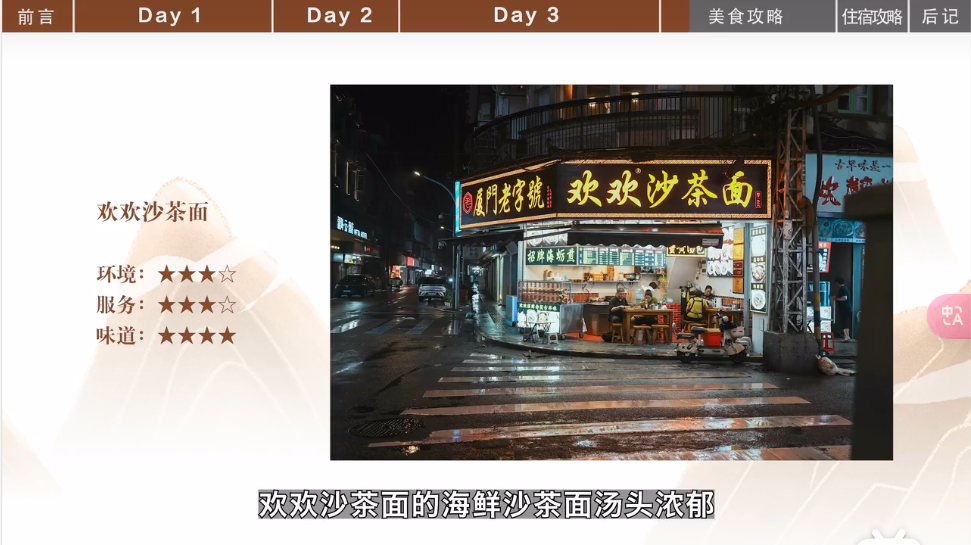

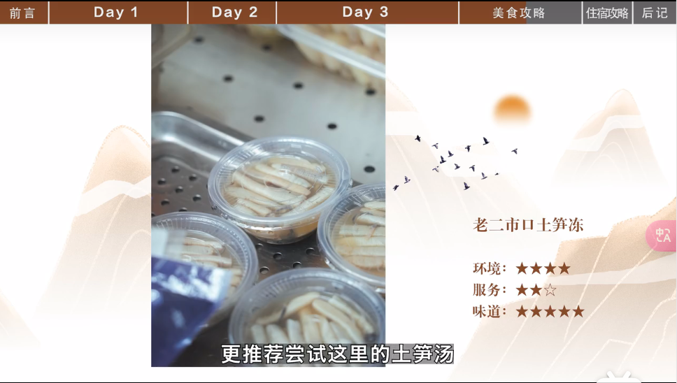

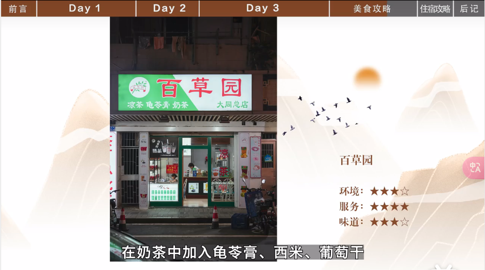

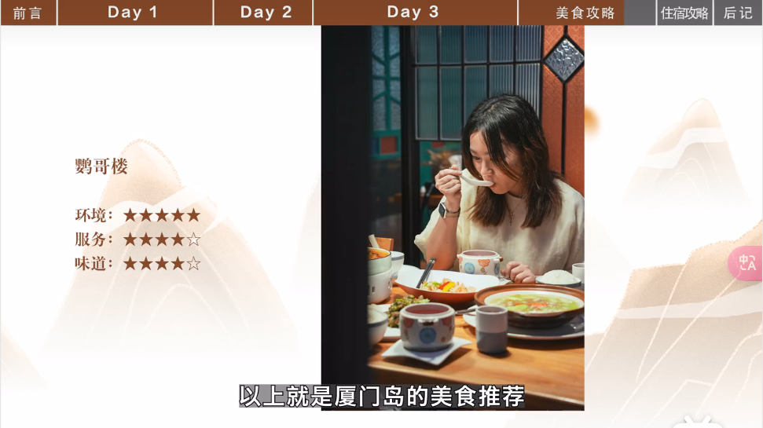

## 住宿

吕厝地铁站

