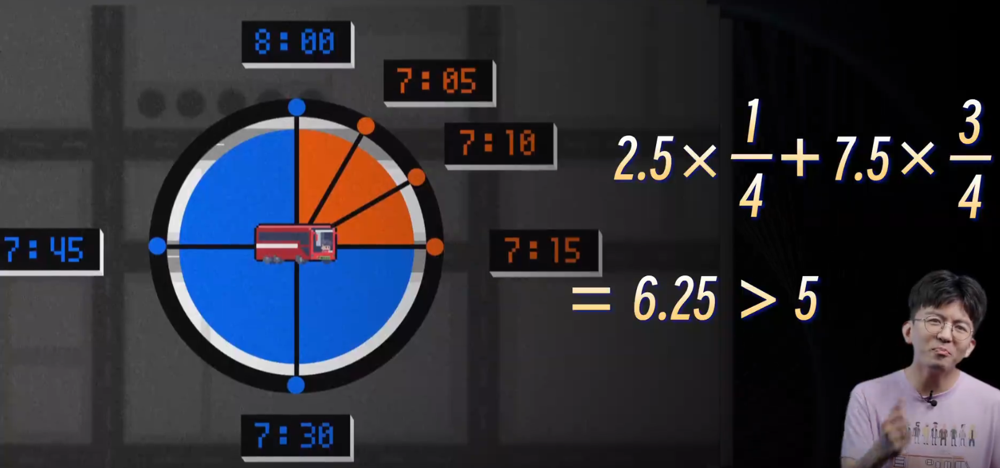
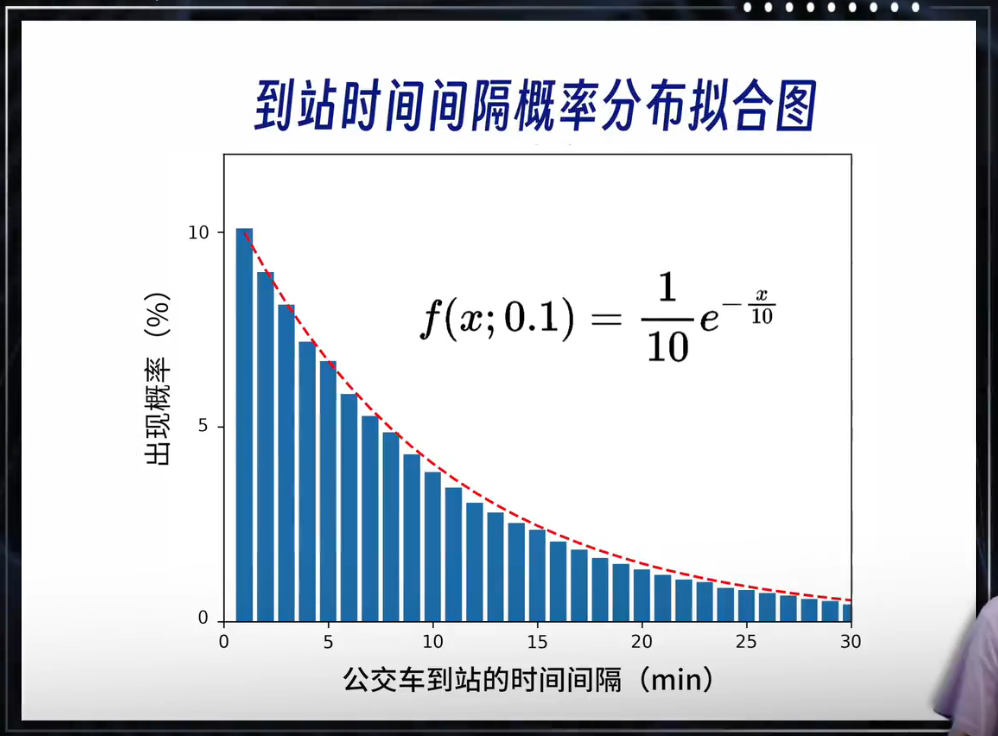
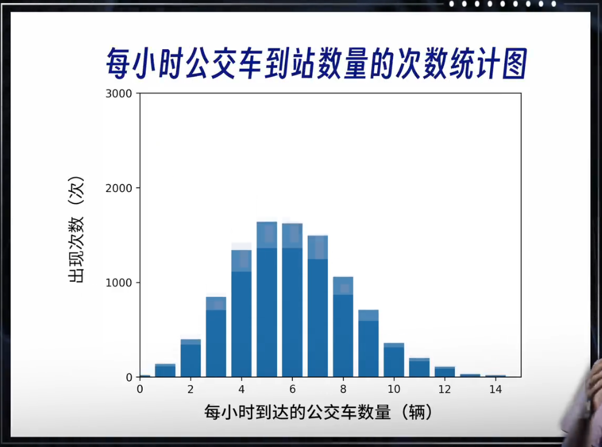

# 公交车悖论（等待时间悖论）

## 链接

b站毕导视频：

[【毕导】看了这个视频，你会释怀你倒霉的一生_哔哩哔哩_bilibili](https://www.bilibili.com/video/BV1PE421w7jL/?spm_id_from=333.999.0.0&vd_source=75e186a4ea53b333296d6f44a426177c)

## 知识点

**假设**：假设1小时6辆公交车，发车间隔时间为10分钟。

如果公交车的平均等车时间是5分钟，那平均等车时间一定比你想象的更难等。

假设公交车前面3辆间隔5分钟，后面间隔15分钟，那么平均等待时间计算可得6.25分钟>5分钟。

核心原因：坐上慢车和坐上快车的概率并不是相等的，落入慢车区间的概率是更大的，从而拉长了平均等待时间。快车的快乐取代不了慢车的漫长。  

 

如果公交车完全随机的到达：

到站的时间间隔遵循指数分布

一小时到站的公交车数量遵循泊松分布

**在这种情况下你的平均等车时间就等于发车的时间间隔，也就是说10分钟一班的公交车，你平均就得等10分钟。**

