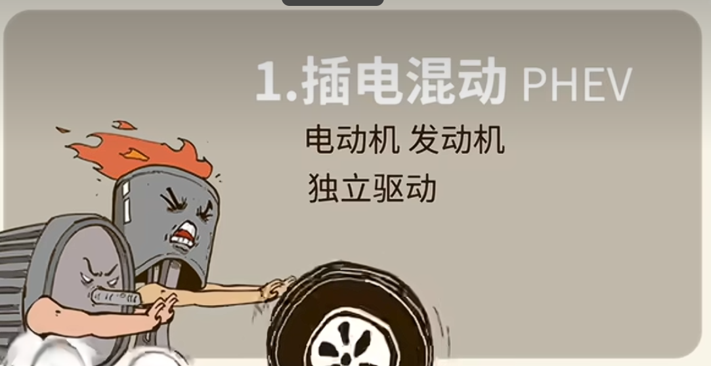

## 插电式混动

电动机、发电机独立驱动

- 平时上下班通勤，纯电搞定，安静又省钱，
- 电量告急，自动烧油接着跑，长途远门根本不慌，就是这么全能，
- 缺点就是电池容量小，不禁用，续航一般在百公里以内，适合经常跨省出行，爱自驾游，但又想省点油钱的精打细算档，

## 油电式混动

- 油电混动简称HEV车是油车，但多了块小电池发动机，
- 当主力电机打辅助起步时，电机帮一把丝滑又省油，冲冲冲；速度一起来，发动机立刻接管，带着车轱辘嗖嗖转，只能加油，不能充电。
- 靠发动机回收能量，存进小电池，这一款适合不想折腾充电，只想省点油钱的老司机，

## 增程式

- 增程式简称REEV，车是电车，但背个小发动机，
- 发动机不开车，全靠电池驱动，火力全开，等没电了，发动机再烧油，给电池续命，
- 所以这哪是发动机，这分明是充电宝啊，适合喜欢电动车驾驶感，但又担心没电或充电不方便的小伙伴，