# 阅读生涯个人喜好表

|  最喜欢        | 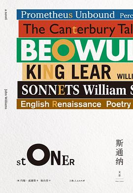 **最影响我**      | 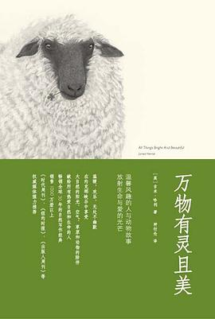 最多遍       | 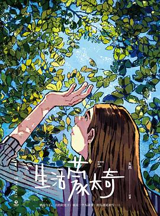 最惊艳        | 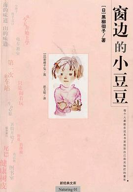 最想推荐     |
| ------------------------------------------------------------ | ------------------------------------------------------------ | ------------------------------------------------------------ | ------------------------------------------------------------ | ------------------------------------------------------------ |
|  **最喜欢的剧情** | 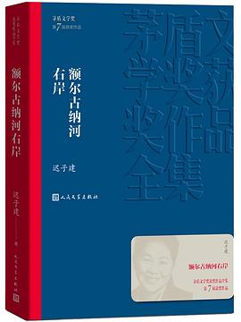 **最喜欢的文笔** |  **最喜欢的角色** | 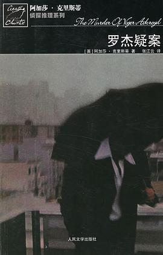 **最喜欢的结局** | 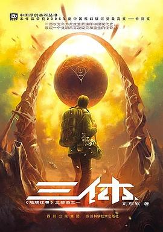 **最喜欢的设定**     |
| 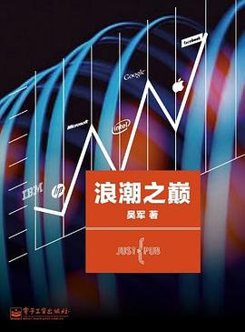 **浪潮之巅**     | 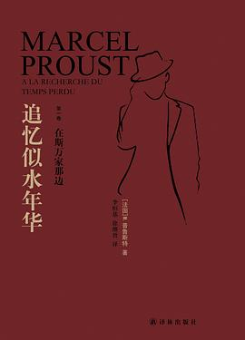 **最痛苦**  | 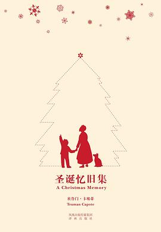 **最感动**     | 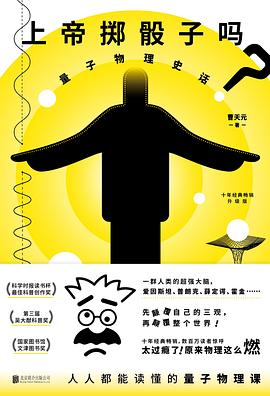 **最被低估** |  **最被高估** |
|  **阅读黑历史** |  **记忆里的第一本** | 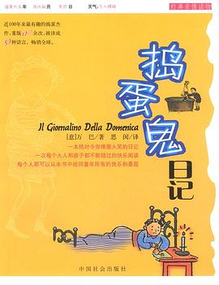 **我为啥会读这个** |  **战争与和平** | 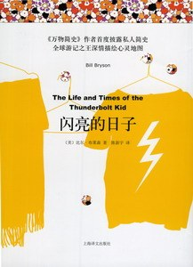 **小众但我喜欢** |

