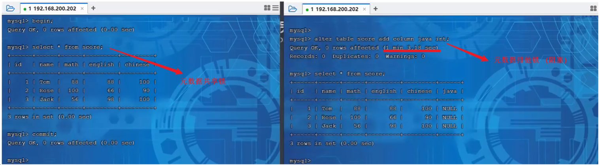

## 概述

### MySQL数据库

#### 客户端连接

1). 方式一：使用MySQL提供的客户端命令行工具


2). 方式二：使用系统自带的命令行工具执行指令

```shell
mysql  [-h 127.0.0.1]  [-P 3306]  -u root -p

参数：

    -h : MySQL服务所在的主机IP
    -P : MySQL服务端口号， 默认3306
    -u : MySQL数据库用户名
    -p ： MySQL数据库用户名对应的密码
```

[]内为可选参数，如果需要连接远程的MySQL，需要加上这两个参数来指定远程主机IP、端口，如果
连接本地的MySQL，则无需指定这两个参数。


> 注意： 使用这种方式进行连接时，需要安装完毕后配置PATH环境变量。

#### 数据模型

MySQL是关系型数据库，是基于二维表进行数据存储的，具体的结构图下:


- 我们可以通过MySQL客户端连接数据库管理系统DBMS，然后通过DBMS操作数据库。
- 可以使用SQL语句，通过数据库管理系统操作数据库，以及操作数据库中的表结构及数据。
- 一个数据库服务器中可以创建多个数据库，一个数据库中也可以包含多张表，而一张表中又可以包
  含多行记录。

## 基础篇

### 通用语法及分类

在学习具体的SQL语句之前，先来了解一下SQL语言的同于语法

1. SQL语句可以单行或多行书写，以分号结尾。

2. SQL语句可以使用空格/缩进来增强语句的可读性。

3. MySQL数据库的SQL语句不区分大小写，关键字建议使用大写。

4. 注释：

   单行注释：-- 注释内容  或  ## 注释内容

   多行注释：/* 注释内容 */


- DDL: 数据定义语言，用来定义数据库对象（数据库、表、字段）
- DML: 数据操作语言，用来对数据库表中的数据进行增删改
- DQL: 数据查询语言，用来查询数据库中表的记录
- DCL: 数据控制语言，用来创建数据库用户、控制数据库的控制权限

#### DDL（数据定义语言）

数据定义语言

##### 数据库操作

查询所有数据库：
`SHOW DATABASES;`
查询当前数据库（查看当前处于哪一个数据库里面）：
`SELECT DATABASE();`
创建数据库：
`CREATE DATABASE [ IF NOT EXISTS ] 数据库名 [ DEFAULT CHARSET 字符集] [COLLATE 排序规则 ];`
删除数据库：
`DROP DATABASE [ IF EXISTS ] 数据库名;`
使用切换数据库：
`USE 数据库名;`

###### 注意事项

- UTF8字符集长度为3字节，有些符号占4字节，所以推荐用utf8mb4字符集

##### 表操作

查询当前数据库所有表：
`SHOW TABLES;`
查询表结构：
`DESC 表名;`
查询指定表的建表语句：
`SHOW CREATE TABLE 表名;`

创建表：
```sql
CREATE TABLE 表名(
	字段1 字段1类型 [COMMENT 字段1注释],
	字段2 字段2类型 [COMMENT 字段2注释],
	字段3 字段3类型 [COMMENT 字段3注释],
	...
	字段n 字段n类型 [COMMENT 字段n注释]
)[ COMMENT 表注释 ];
```
**最后一个字段后面没有逗号**

添加字段：
`ALTER TABLE 表名 ADD 字段名 类型(长度) [COMMENT 注释] [约束]s;`
例：`ALTER TABLE emp ADD nickname varchar(20) COMMENT '昵称';`

修改数据类型：
`ALTER TABLE 表名 MODIFY 字段名 新数据类型(长度);`
修改字段名和字段类型：
`ALTER TABLE 表名 CHANGE 旧字段名 新字段名 类型(长度) [COMMENT 注释] [约束];`
例：将emp表的nickname字段修改为username，类型为varchar(30)
`ALTER TABLE emp CHANGE nickname username varchar(30) COMMENT '昵称';`

删除字段：
`ALTER TABLE 表名 DROP 字段名;`

修改表名：
`ALTER TABLE 表名 RENAME TO 新表名`

删除表：
`DROP TABLE [IF EXISTS] 表名;`
删除表，并重新创建该表：
`TRUNCATE TABLE 表名;`

#### DML（数据操作语言）

##### 添加数据

指定字段：
`INSERT INTO 表名 (字段名1, 字段名2, ...) VALUES (值1, 值2, ...);`
全部字段：
`INSERT INTO 表名 VALUES (值1, 值2, ...);`

批量添加数据：
`INSERT INTO 表名 (字段名1, 字段名2, ...) VALUES (值1, 值2, ...), (值1, 值2, ...), (值1, 值2, ...);`
`INSERT INTO 表名 VALUES (值1, 值2, ...), (值1, 值2, ...), (值1, 值2, ...);`

###### 注意事项

- 插入数据时，指定的字段顺序需要与值得顺序是一一对应的

- 字符串和日期类型数据应该包含在引号中
- 插入的数据大小应该在字段的规定范围内

##### 更新和删除数据

修改数据：
`UPDATE 表名 SET 字段名1 = 值1, 字段名2 = 值2, ... [ WHERE 条件 ];`
例：
`UPDATE emp SET name = 'Jack' WHERE id = 1;`

**注意事项**

- 修改语句的条件可以有，也可以没有，如果没有条件，则会修改整张表的所有数据

删除数据：
`DELETE FROM 表名 [ WHERE 条件 ];`

**注意事项**

- delete语句的条件可以有，也可以没有，如果没有条件，则会删除整张表的所有数据。
- delete 语句不能删除某一个字段的值(可以使用update，将该字段值置为NULL即可)。
- 当进行删除全部数据操作时，datagrip会提示我们，询问时候确认删除，我们直接点击Execute即可。

#### DQL（数据查询语言）

Data Query Language

语法：
```sql
SELECT
	字段列表
FROM
	表名字段
WHERE
	条件列表
GROUP BY
	分组字段列表
HAVING
	分组后的条件列表
ORDER BY
	排序字段列表
LIMIT
	分页参数
```

##### 基础查询

查询多个字段：
`SELECT 字段1, 字段2, 字段3, ... FROM 表名;`
`SELECT * FROM 表名;`

设置别名：
`SELECT 字段1 [ AS 别名1 ], 字段2 [ AS 别名2 ], 字段3 [ AS 别名3 ], ... FROM 表名;`
`SELECT 字段1 [ 别名1 ], 字段2 [ 别名2 ], 字段3 [ 别名3 ], ... FROM 表名;`

去除重复记录：
`SELECT DISTINCT 字段列表 FROM 表名;`

转义：
`SELECT * FROM 表名 WHERE name LIKE '/_张三' ESCAPE '/'`
/ 之后的\_不作为通配符

##### 条件查询

语法：
`SELECT 字段列表 FROM 表名 WHERE 条件列表;`

条件：

| 比较运算符          | 功能                                        |
| ------------------- | ------------------------------------------- |
| >                   | 大于                                        |
| >=                  | 大于等于                                    |
| <                   | 小于                                        |
| <=                  | 小于等于                                    |
| =                   | 等于                                        |
| <> 或 !=            | 不等于                                      |
| BETWEEN ... AND ... | 在某个范围内（含最小、最大值）              |
| IN(...)             | 在in之后的列表中的值，多选一                |
| LIKE 占位符         | 模糊匹配（\_匹配单个字符，%匹配任意个字符） |
| IS NULL             | 是NULL                                      |

| 逻辑运算符         | 功能                         |
| ------------------ | ---------------------------- |
| AND 或 &&          | 并且（多个条件同时成立）     |
| OR 或 &#124;&#124; | 或者（多个条件任意一个成立） |
| NOT 或 !           | 非，不是                     |

例子：
```sql
-- 年龄等于30
select * from employee where age = 30;
-- 年龄小于30
select * from employee where age < 30;
-- 小于等于
select * from employee where age <= 30;
-- 没有身份证
select * from employee where idcard is null or idcard = '';
-- 有身份证
select * from employee where idcard;
select * from employee where idcard is not null;
-- 不等于
select * from employee where age != 30;
-- 年龄在20到30之间
select * from employee where age between 20 and 30;
select * from employee where age >= 20 and age <= 30;
-- 下面语句不报错，但查不到任何信息
select * from employee where age between 30 and 20;
-- 性别为女且年龄小于30
select * from employee where age < 30 and gender = '女';
-- 年龄等于25或30或35
select * from employee where age = 25 or age = 30 or age = 35;
select * from employee where age in (25, 30, 35);
-- 姓名为两个字
select * from employee where name like '__';
-- 身份证最后为X
select * from employee where idcard like '%X';
```

##### 聚合查询（聚合函数）

常见聚合函数：

| 函数  | 功能     |
| ----- | -------- |
| count | 统计数量 |
| max   | 最大值   |
| min   | 最小值   |
| avg   | 平均值   |
| sum   | 求和     |

语法：
`SELECT 聚合函数(字段列表) FROM 表名;`
例：
`SELECT count(id) from employee where workaddress = "广东省";`

##### 分组查询

语法：
`SELECT 字段列表 FROM 表名 [ WHERE 条件 ] GROUP BY 分组字段名 [ HAVING 分组后的过滤条件 ];`

where 和 having 的区别：

- 执行时机不同：where是分组之前进行过滤，不满足where条件不参与分组；having是分组后对结果进行过滤。
- 判断条件不同：where不能对聚合函数进行判断，而having可以。

例子：

```sql
-- 根据性别分组，统计男性和女性数量（只显示分组数量，不显示哪个是男哪个是女）
select count(*) from employee group by gender;
-- 根据性别分组，统计男性和女性数量
select gender, count(*) from employee group by gender;
-- 根据性别分组，统计男性和女性的平均年龄
select gender, avg(age) from employee group by gender;
-- 年龄小于45，并根据工作地址分组
select workaddress, count(*) from employee where age < 45 group by workaddress;
-- 年龄小于45，并根据工作地址分组，获取员工数量大于等于3的工作地址
select workaddress, count(*) address_count from employee where age < 45 group by workaddress having address_count >= 3;
```

###### 注意事项

- 执行顺序：where > 聚合函数 > having
- 分组之后，查询的字段一般为聚合函数和分组字段，查询其他字段无任何意义

##### 排序查询

语法：
`SELECT 字段列表 FROM 表名 ORDER BY 字段1 排序方式1, 字段2 排序方式2;`

排序方式：

- ASC: 升序（默认）
- DESC: 降序

例子：

```sql
-- 根据年龄升序排序
SELECT * FROM employee ORDER BY age ASC;
SELECT * FROM employee ORDER BY age;
-- 两字段排序，根据年龄升序排序，入职时间降序排序
SELECT * FROM employee ORDER BY age ASC, entrydate DESC;
```

###### 注意事项

- 如果是升序，可以不指定排序方式ASC

- 如果是多字段排序，当第一个字段值相同时，才会根据第二个字段进行排序


##### 分页查询

语法：
`SELECT 字段列表 FROM 表名 LIMIT 起始索引, 查询记录数;`

例子：

```sql
-- 查询第一页数据，展示10条
SELECT * FROM employee LIMIT 0, 10;
-- 查询第二页
SELECT * FROM employee LIMIT 10, 10;
```

###### 注意事项

- 起始索引从0开始，起始索引 = （查询页码 - 1） * 每页显示记录数
- 分页查询是数据库的方言，不同数据库有不同实现，MySQL是LIMIT
- 如果查询的是**第一页数据，起始索引可以省略**，直接简写 LIMIT 10

##### **DQL执行顺序**

**FROM -> WHERE -> GROUP BY -> SELECT -> ORDER BY -> LIMIT**

**from ... where ... group by ... having ... select ... order by ... limit ...**

#### DCL（数据控制语言）

##### 管理用户

查询用户：

```sql
USE mysql;
SELECT * FROM user;
```

创建用户:
`CREATE USER '用户名'@'主机名' IDENTIFIED BY '密码';`

修改用户密码：
`ALTER USER '用户名'@'主机名' IDENTIFIED WITH mysql_native_password BY '新密码';`

删除用户：
`DROP USER '用户名'@'主机名';`

例子：

```sql
-- 创建用户test，只能在当前主机localhost访问
create user 'test'@'localhost' identified by '123456';
-- 创建用户test，能在任意主机访问
create user 'test'@'%' identified by '123456';
create user 'test' identified by '123456';
-- 修改密码
alter user 'test'@'localhost' identified with mysql_native_password by '1234';
-- 删除用户
drop user 'test'@'localhost';
```

###### 注意事项

- 主机名可以使用 % 通配

##### 权限控制

常用权限：

| 权限                | 说明               |
| ------------------- | ------------------ |
| ALL, ALL PRIVILEGES | 所有权限           |
| SELECT              | 查询数据           |
| INSERT              | 插入数据           |
| UPDATE              | 修改数据           |
| DELETE              | 删除数据           |
| ALTER               | 修改表             |
| DROP                | 删除数据库/表/视图 |
| CREATE              | 创建数据库/表      |

更多权限请看[权限一览表](#权限一览表 "权限一览表")

查询权限：
`SHOW GRANTS FOR '用户名'@'主机名';`

授予权限：
`GRANT 权限列表 ON 数据库名.表名 TO '用户名'@'主机名';`

撤销权限：
`REVOKE 权限列表 ON 数据库名.表名 FROM '用户名'@'主机名';`

###### 注意事项

- 多个权限用逗号分隔
- 授权时，数据库名和表名可以用 * 进行通配，代表所有

### 函数

- 字符串函数
- 数值函数
- 日期函数
- 流程函数

#### 字符串函数

常用函数：

| 函数  | 功能  |
| ------------ | ------------ |
| CONCAT(s1, s2, ..., sn)  | 字符串拼接，将s1, s2, ..., sn拼接成一个字符串  |
| LOWER(str)  | 将字符串全部转为小写  |
| UPPER(str)  | 将字符串全部转为大写  |
| LPAD(str, n, pad)  | 左填充，用字符串pad对str的左边进行填充，达到n个字符串长度  |
| RPAD(str, n, pad)  | 右填充，用字符串pad对str的右边进行填充，达到n个字符串长度  |
| TRIM(str)  | 去掉字符串头部和尾部的空格  |
| SUBSTRING(str, start, len)  | 返回从字符串str从start位置起的len个长度的字符串  |
| REPLACE(column, source, replace)  | 替换字符串  |

使用示例：

```sql
-- 拼接
SELECT CONCAT('Hello', 'World');
-- 小写
SELECT LOWER('Hello');
-- 大写
SELECT UPPER('Hello');
-- 左填充
SELECT LPAD('01', 5, '-');  ## ---01
-- 右填充
SELECT RPAD('01', 5, '-');  ## 01---
-- 去除空格
SELECT TRIM(' Hello World ');
-- 切片（起始索引为1）
SELECT SUBSTRING('Hello World', 1, 5);
```

#### 数值函数

常见函数：

| 函数  | 功能  |
| ------------ | ------------ |
| CEIL(x)  | 向上取整  |
| FLOOR(x)  | 向下取整  |
| MOD(x, y)  | 返回x/y的模  |
| RAND() | 返回0~1内的随机数 |
| ROUND(x, y) | 求参数x的四舍五入值，保留y位小数 |

**例子**

通过数据库的函数，生成一个六位数的随机验证码。
思路： 获取随机数可以通过rand()函数，但是获取出来的随机数是在0-1之间的，所以可以在其基础
上乘以1000000，然后舍弃小数部分，如果长度不足6位，补0

```sql
select lpad(round(rand()*1000000 , 0), 6, '0');  ## 241032
```


#### 日期函数

常用函数：

| 函数  | 功能  |
| ------------ | ------------ |
| CURDATE()  | 返回当前日期  |
| CURTIME()  | 返回当前时间  |
| NOW()  | 返回当前日期和时间  |
| YEAR(date)  | 获取指定date的年份  |
| MONTH(date)  | 获取指定date的月份  |
| DAY(date)  | 获取指定date的日期  |
| DATE_ADD(date, INTERVAL expr type)  | 返回一个日期/时间值加上一个时间间隔expr后的时间值  |
| DATEDIFF(date1, date2)  | 返回起始时间date1和结束时间date2之间的天数  |

例子：

```sql
-- DATE_ADD
SELECT DATE_ADD(NOW(), INTERVAL 70 YEAR);
```

#### 流程函数

常用函数：

| 函数  | 功能  |
| ------------ | ------------ |
| IF(value, t, f)  | 如果value为true，则返回t，否则返回f  |
| IFNULL(value1, value2)  | 如果value1不为空，返回value1，否则返回value2  |
| CASE WHEN [ val1 ] THEN [ res1 ] ... ELSE [ default ] END  | 如果val1为true，返回res1，... 否则返回default默认值  |
| CASE [ expr ] WHEN [ val1 ] THEN [ res1 ] ... ELSE [ default ] END  | 如果expr的值等于val1，返回res1，... 否则返回default默认值  |

例子：

```sql
select
	name,
	(case when age > 30 then '中年' else '青年' end)
from employee;
select
	name,
	(case workaddress when '北京市' then '一线城市' when '上海市' then '一线城市' else '二线城市' end) as '工作地址'
from employee;
```

### 约束

分类：

| 约束  | 描述  | 关键字  |
| ------------ | ------------ | ------------ |
| 非空约束  | 限制该字段的数据不能为null  | NOT NULL  |
| 唯一约束  | 保证该字段的所有数据都是唯一、不重复的  | UNIQUE  |
| 主键约束  | 主键是一行数据的唯一标识，要求非空且唯一  | PRIMARY KEY  |
| 默认约束  | 保存数据时，如果未指定该字段的值，则采用默认值  | DEFAULT  |
| 检查约束（8.0.1版本后）  | 保证字段值满足某一个条件  | CHECK  |
| 外键约束  | 用来让两张图的数据之间建立连接，保证数据的一致性和完整性  | FOREIGN KEY  |

约束是作用于表中字段上的，可以==在创建表/修改表==的时候添加约束。

#### 常用约束

概念：约束是作用于表中字段上的规则，用于限制存储在表中的数据，可以在创建表/修改表的时候添加约束
目的：保证数据库中数据的正确、有效性和完整性。

**分类：**

|         **约束**         |                         **描述**                         | **关键字**  |
| :----------------------: | :------------------------------------------------------: | :---------: |
|         非空约束         |                限制该字段的数据不能为null                |  NOT NULL   |
|         唯一约束         |          保证该字段的所有数据都是唯一、不重复的          |   UNIQUE    |
|         主键约束         |         主键是一行数据的唯一标识，要求非空且唯一         | PRIMARY KEY |
|         默认约束         |      保存数据时，如果未指定该字段的值，则采用默认值      |   DEFAULT   |
| 检查约束(8.0.16版本之后) |                 保证字段值满足某一个条件                 |    CHECK    |
|         外键约束         | 用来让两张表的数据之间建立连接，保证数据的一致性和完整性 | FOREIGN KEY |

| 约束条件  | 关键字  |
| ------------ | ------------ |
| 主键  | PRIMARY KEY  |
| 自动增长  | AUTO_INCREMENT  |
| 不为空  | NOT NULL  |
| 唯一  | UNIQUE  |
| 逻辑条件  | CHECK  |
| 默认值  | DEFAULT  |

例子：

```sql
create table user(
	id int primary key auto_increment,
	name varchar(10) not null unique,
	age int check(age > 0 and age < 120),
	status char(1) default '1',
	gender char(1)
);
```

#### 外键约束

添加外键：

```sql
CREATE TABLE 表名(
	字段名 字段类型,
	...
	[CONSTRAINT] [外键名称] FOREIGN KEY(外键字段名) REFERENCES 主表(主表列名)
);
ALTER TABLE 表名 ADD CONSTRAINT 外键名称 FOREIGN KEY (外键字段名) REFERENCES 主表(主表列名);

-- 例子
alter table emp add constraint fk_emp_dept_id foreign key(dept_id) references dept(id);  ## fk_emp_dept_id自己取的外键名称
```

删除外键：
`ALTER TABLE 表名 DROP FOREIGN KEY 外键名;`

```sql
alter table emp drop foreign key fk_emp_dept_id;
```

查询系统中所有数据库下，所有存在外键的表：

```sql
select * from INFORMATION_SCHEMA.KEY_COLUMN_USAGE
where REFERENCED_TABLE_NAME != "";
```


##### 删除/更新行为

| 行为  | 说明  |
| ------------ | ------------ |
| NO ACTION  | 当在父表中删除/更新对应记录时，首先检查该记录是否有对应外键，如果有则不允许删除/更新（与RESTRICT一致）  |
| RESTRICT  | 当在父表中删除/更新对应记录时，首先检查该记录是否有对应外键，如果有则不允许删除/更新（与NO ACTION一致）  |
| CASCADE  | 当在父表中删除/更新对应记录时，首先检查该记录是否有对应外键，如果有则也删除/更新外键在子表中的记录  |
| SET NULL  | 当在父表中删除/更新对应记录时，首先检查该记录是否有对应外键，如果有则设置子表中该外键值为null（要求该外键允许为null）  |
| SET DEFAULT  | 父表有变更时，子表将外键设为一个默认值（Innodb不支持）  |

更改删除/更新行为：
`ALTER TABLE 表名 ADD CONSTRAINT 外键名称 FOREIGN KEY (外键字段) REFERENCES 主表名(主表字段名) ON UPDATE 行为 ON DELETE 行为;`

### 多表查询

#### 多表关系

- 一对多（多对一）
- 多对多
- 一对一

##### 一对多

案例：部门与员工
关系：一个部门对应多个员工，一个员工对应一个部门
实现：在多的一方建立外键，指向一的一方的主键

##### 多对多

案例：学生与课程
关系：一个学生可以选多门课程，一门课程也可以供多个学生选修
实现：建立第三张中间表，中间表至少包含两个外键，分别关联两方主键

##### 一对一

案例：用户与用户详情
关系：一对一关系，多用于单表拆分，将一张表的基础字段放在一张表中，其他详情字段放在另一张表中，以提升操作效率
实现：在任意一方加入外键，关联另外一方的主键，并且设置外键为唯一的（UNIQUE）

#### 查询

合并查询（笛卡尔积，会展示所有组合结果）：
`select * from employee, dept;`

> 笛卡尔积：两个集合A集合和B集合的所有组合情况（在多表查询时，需要消除无效的笛卡尔积）

消除无效笛卡尔积：
`select * from employee, dept where employee.dept = dept.id;`

#### 内连接查询

内连接查询的是两张表**交集**的部分

隐式内连接：
`SELECT 字段列表 FROM 表1, 表2 WHERE 条件 ...;`

显式内连接：
`SELECT 字段列表 FROM 表1 [ INNER ] JOIN 表2 ON 连接条件 ...;`

显式性能比隐式高

例子：

```sql
-- 查询员工姓名，及关联的部门的名称
-- 隐式
select e.name, d.name from employee as e, dept as d where e.dept = d.id;
-- 显式
select e.name, d.name from employee as e inner join dept as d on e.dept = d.id;
```

**注意事项**

- 一旦为表起了别名，就不能再使用表名来指定对应的字段了，此时只能够使用别名来指定字段。

#### 外连接查询

左外连接：
查询左表所有数据，以及两张表交集部分数据
`SELECT 字段列表 FROM 表1 LEFT [ OUTER ] JOIN 表2 ON 条件 ...;`
相当于查询表1的所有数据，包含表1和表2交集部分数据

右外连接：
查询右表所有数据，以及两张表交集部分数据
`SELECT 字段列表 FROM 表1 RIGHT [ OUTER ] JOIN 表2 ON 条件 ...;`

例子：

```sql
-- 左
select e.*, d.name from employee as e left outer join dept as d on e.dept = d.id;
select d.name, e.* from dept d left outer join emp e on e.dept = d.id;  -- 这条语句与下面的语句效果一样
-- 右
select d.name, e.* from employee as e right outer join dept as d on e.dept = d.id;
```

左连接可以查询到没有dept的employee，右连接可以查询到没有employee的dept

**注意事项**

- 左外连接和右外连接是可以相互替换的，只需要调整在连接查询时SQL中，表结构的先后顺序就可以了。而我们在日常开发使用时，更偏向于左外连接。


#### 自连接查询

当前表与自身的连接查询，自连接必须使用表别名

语法：
`SELECT 字段列表 FROM 表A 别名A JOIN 表A 别名B ON 条件 ...;`

自连接查询，可以是内连接查询，也可以是外连接查询

例子：

```sql
-- 查询员工及其所属领导的名字
select a.name, b.name from employee a, employee b where a.manager = b.id;
-- 没有领导的也查询出来
select a.name, b.name from employee a left join employee b on a.manager = b.id;
```

**注意事项**

在自连接查询中，必须要为表起别名，要不然我们不清楚所指定的条件、返回的字段，到底是哪一张表的字段。

#### 联合查询 union, union all

把多次查询的结果合并，形成一个新的查询集

- 对于联合查询的多张表的列数必须保持一致，字段类型也需要保持一致。
- union all 会将全部的数据直接合并在一起，union 会对合并之后的数据去重。

语法：

```sql
SELECT 字段列表 FROM 表A ...
UNION [ALL]
SELECT 字段列表 FROM 表B ...
```

##### 注意事项

- UNION ALL 会有重复结果，UNION 不会
- 联合查询比使用or效率高，不会使索引失效

#### 子查询

SQL语句中嵌套SELECT语句，称谓嵌套查询，又称子查询。
`SELECT * FROM t1 WHERE column1 = ( SELECT column1 FROM t2);`
**子查询外部的语句可以是 INSERT / UPDATE / DELETE / SELECT 的任何一个**

根据子查询结果可以分为：

- 标量子查询（子查询结果为单个值）
- 列子查询（子查询结果为一列）
- 行子查询（子查询结果为一行）
- 表子查询（子查询结果为多行多列）

根据子查询位置可分为：

- WHERE 之后
- FROM 之后
- SELECT 之后

##### 标量子查询

子查询返回的结果是单个值（数字、字符串、日期等）。
常用操作符：- < > > >= < <=

例子：

```sql
-- 查询销售部所有员工
select id from dept where name = '销售部';
-- 根据销售部部门ID，查询员工信息
select * from employee where dept = 4;
-- 合并（子查询）
select * from employee where dept = (select id from dept where name = '销售部');

-- 查询xxx入职之后的员工信息
select * from employee where entrydate > (select entrydate from employee where name = 'xxx');
```

##### 列子查询

返回的结果是一列（可以是多行）。

常用操作符：

| 操作符  | 描述  |
| ------------ | ------------ |
| IN  | 在指定的集合范围内，多选一  |
| NOT IN  | 不在指定的集合范围内  |
| ANY  | 子查询返回列表中，有任意一个满足即可  |
| SOME  | 与ANY等同，使用SOME的地方都可以使用ANY  |
| ALL  | 子查询返回列表的所有值都必须满足  |

例子：

```sql
-- 查询销售部和市场部的所有员工信息
select * from employee where dept in (select id from dept where name = '销售部' or name = '市场部');
-- 查询比财务部所有人工资都高的员工信息
select * from employee where salary > all(select salary from employee where dept = (select id from dept where name = '财务部'));
-- 查询比研发部任意一人工资高的员工信息
select * from employee where salary > any (select salary from employee where dept = (select id from dept where name = '研发部'));
```

##### 行子查询

返回的结果是一行（可以是多列）。
常用操作符：=, <, >, IN, NOT IN

例子：

```sql
-- 查询与xxx的薪资及直属领导相同的员工信息
select * from employee where (salary, manager) = (12500, 1);
select * from employee where (salary, manager) = (select salary, manager from employee where name = 'xxx');
```

##### 表子查询

返回的结果是多行多列
常用操作符：IN

例子：

```sql
-- 查询与xxx1，xxx2的职位和薪资相同的员工
select * from employee where (job, salary) in (select job, salary from employee where name = 'xxx1' or name = 'xxx2');
-- 查询入职日期是2006-01-01之后的员工，及其部门信息
select e.*, d.* from (select * from employee where entrydate > '2006-01-01') as e left join dept as d on e.dept = d.id;
```

##### 案例

```sql
-- 查询低于本部门平均工资的员工信息
select * from emp e2 where e2.salary < ( select avg(e1.salary) from emp e1 where 
e1.dept_id = e2.dept_id );
-- 查询所有的部门信息, 并统计部门的员工人数
select d.id, d.name , ( select count(*) from emp e where e.dept_id = d.id ) '人数' 
from dept d;
-- 查询所有学生的选课情况, 展示出学生名称, 学号, 课程名称
select s.name,s.no,c.name from student s,student_course sc,course c where s.id=sc.studentid and sc.courseid=c.id;
```


### 事务

事务是一组操作的集合，事务会把所有操作作为一个整体一起向系统提交或撤销操作请求，即这些操作要么同时成功，要么同时失败。

**注意**：默认MySQL的事务是自动提交的，也就是说，当执行完一条DML语句时，MySQL会立即隐式的提交事务。

基本操作：

```sql
-- 1. 查询张三账户余额
select * from account where name = '张三';
-- 2. 将张三账户余额-1000
update account set money = money - 1000 where name = '张三';
-- 此语句出错后张三钱减少但是李四钱没有增加
模拟sql语句错误
-- 3. 将李四账户余额+1000
update account set money = money + 1000 where name = '李四';

-- 查看事务提交方式
SELECT @@AUTOCOMMIT;
-- 设置事务提交方式，1为自动提交，0为手动提交，该设置只对当前会话有效
SET @@AUTOCOMMIT = 0;
-- 提交事务
COMMIT;
-- 回滚事务
ROLLBACK;

-- 设置手动提交后上面代码改为：
select * from account where name = '张三';
update account set money = money - 1000 where name = '张三';
update account set money = money + 1000 where name = '李四';
commit;
```

操作方式二：

开启事务：
`START TRANSACTION 或 BEGIN TRANSACTION;`
提交事务：
`COMMIT;`
回滚事务：
`ROLLBACK;`

操作实例：

```sql
start transaction;
select * from account where name = '张三';
update account set money = money - 1000 where name = '张三';
update account set money = money + 1000 where name = '李四';
commit;
```

#### 四大特性ACID

- 原子性(Atomicity)：事务是不可分割的最小操作单元，要么全部成功，要么全部失败
- 一致性(Consistency)：事务完成时，必须使所有数据都保持一致状态
- 隔离性(Isolation)：数据库系统提供的隔离机制，保证事务在不受外部并发操作影响的独立环境下运行
- 持久性(Durability)：事务一旦提交或回滚，它对数据库中的数据的改变就是永久的

#### 并发事务

| 问题  | 描述  |
| ------------ | ------------ |
| 脏读  | 一个事务读到另一个事务还没提交的数据  |
| 不可重复读  | 一个事务先后读取同一条记录，但两次读取的数据不同  |
| 幻读  | 一个事务按照条件查询数据时，没有对应的数据行，但是再插入数据时，又发现这行数据已经存在  |

> 这三个问题的详细演示：https://www.bilibili.com/video/BV1Kr4y1i7ru?p=55cd 

并发事务隔离级别：

| 隔离级别  | 脏读  | 不可重复读  | 幻读  |
| ------------ | ------------ | ------------ | ------------ |
| Read uncommitted  | √  | √  | √  |
| Read committed  | ×  | √  | √  |
| Repeatable Read(默认)  | ×  | ×  | √  |
| Serializable  | ×  | ×  | ×  |

- √表示在当前隔离级别下该问题会出现
- Serializable 性能最低；Read uncommitted 性能最高，数据安全性最差

查看事务隔离级别：
`SELECT @@TRANSACTION_ISOLATION;`
设置事务隔离级别：
`SET [ SESSION | GLOBAL ] TRANSACTION ISOLATION LEVEL {READ UNCOMMITTED | READ COMMITTED | REPEATABLE READ | SERIALIZABLE };`
SESSION 是会话级别，表示只针对当前会话有效，GLOBAL 表示对所有会话有效

## 进阶篇

### 存储引擎

MySQL体系结构：


**引擎层**：

存储引擎层， 存储引擎真正的负责了MySQL中数据的存储和提取，服务器通过API和存储引擎进行通
信。不同的存储引擎具有不同的功能，这样我们可以根据自己的需要，来选取合适的存储引擎。数据库
中的索引是在存储引擎层实现的。

存储引擎就是存储数据、建立索引、更新/查询数据等技术的实现方式。==存储引擎是基于表而不是基于库的，所以存储引擎也可以被称为表引擎。==
默认存储引擎是InnoDB。

相关操作：

```sql
-- 查询建表语句
show create table account;
-- 建表时指定存储引擎
CREATE TABLE 表名(
	...
) ENGINE=INNODB;
-- 查看当前数据库支持的存储引擎
show engines;
```

#### InnoDB

InnoDB 是一种兼顾高可靠性和高性能的通用存储引擎，在 MySQL 5.5 之后，InnoDB 是默认的 MySQL 引擎。

特点：

- DML 操作遵循 ACID 模型，支持**事务**
- **行级锁**，提高并发访问性能
- 支持**外键**约束，保证数据的完整性和正确性

文件：

- xxx.ibd: xxx代表表名，InnoDB 引擎的每张表都会对应这样一个表空间文件，存储该表的表结构（frm、sdi）、数据和索引。

参数：innodb_file_per_table，决定多张表共享一个表空间还是每张表对应一个表空间

知识点：

查看 Mysql 变量：
`show variables like 'innodb_file_per_table';`

从idb文件提取表结构数据：
（在cmd运行）
`ibd2sdi xxx.ibd`

InnoDB 逻辑存储结构：


- 表空间 : InnoDB存储引擎逻辑结构的最高层，ibd文件其实就是表空间文件，在表空间中可以
  包含多个Segment段。
- 段 : 表空间是由各个段组成的， 常见的段有数据段、索引段、回滚段等。InnoDB中对于段的管
  理，都是引擎自身完成，不需要人为对其控制，一个段中包含多个区。
- 区 : 区是表空间的单元结构，每个区的大小为1M。 默认情况下， InnoDB存储引擎页大小为
  16K， 即一个区中一共有64个连续的页。
- 页 : 页是组成区的最小单元，页也是InnoDB 存储引擎磁盘管理的最小单元，每个页的大小默
  认为 16KB。为了保证页的连续性，InnoDB 存储引擎每次从磁盘申请 4-5 个区。
- 行 : InnoDB 存储引擎是面向行的，也就是说数据是按行进行存放的，在每一行中除了定义表时
  所指定的字段以外，还包含两个隐藏字段(后面会详细介绍)。

#### MyISAM

MyISAM 是 MySQL 早期的默认存储引擎。

特点：

- 不支持事务，不支持外键
- 支持表锁，不支持行锁
- 访问速度快

文件：

- xxx.sdi: 存储表结构信息
- xxx.MYD: 存储数据
- xxx.MYI: 存储索引

#### Memory

Memory 引擎的表数据是存储在内存中的，受硬件问题、断电问题的影响，只能将这些表作为临时表或缓存使用。

特点：

- 存放在内存中，速度快
- hash索引（默认）

文件：

- xxx.sdi: 存储表结构信息

#### 存储引擎特点

| 特点  | InnoDB  | MyISAM  | Memory  |
| ------------ | ------------ | ------------ | ------------ |
| 存储限制  | 64TB  | 有  | 有  |
| 事务安全  | 支持  | -  | -  |
| 锁机制  | 行锁  | 表锁  | 表锁  |
| B+tree索引  | 支持  | 支持  | 支持  |
| Hash索引  | -  | -  | 支持  |
| 全文索引  | 支持（5.6版本之后）  | 支持  | -  |
| 空间使用  | 高  | 低  | N/A  |
| 内存使用  | 高  | 低  | 中等  |
| 批量插入速度  | 低  | 高  | 高  |
| 支持外键  | 支持  | -  | -  |

**面试题：**

InnoDB引擎与MyISAM引擎的区别 ?
 ①. InnoDB引擎, 支持事务, 而MyISAM不支持。
 ②. InnoDB引擎, 支持行锁和表锁, 而MyISAM仅支持表锁, 不支持行锁。
 ③. InnoDB引擎, 支持外键, 而MyISAM是不支持的。

#### 存储引擎的选择

在选择存储引擎时，应该根据应用系统的特点选择合适的存储引擎。对于复杂的应用系统，还可以根据实际情况选择多种存储引擎进行组合。

- InnoDB: 如果应用对事物的完整性有比较高的要求，在并发条件下要求数据的一致性，数据操作除了插入和查询之外，还包含很多的更新、删除操作，则 InnoDB 是比较合适的选择
- MyISAM: 如果应用是以读操作和插入操作为主，只有很少的更新和删除操作，并且对事务的完整性、并发性要求不高，那这个存储引擎是非常合适的。
- Memory: 将所有数据保存在内存中，访问速度快，通常用于临时表及缓存。Memory 的缺陷是对表的大小有限制，太大的表无法缓存在内存中，而且无法保障数据的安全性

电商中的足迹和评论适合使用 MyISAM 引擎，缓存适合使用 Memory 引擎。

### 性能分析

#### 查看执行频次

查看当前数据库的 INSERT, UPDATE, DELETE, SELECT 访问频次：
`SHOW GLOBAL STATUS LIKE 'Com_______';` 或者 `SHOW SESSION STATUS LIKE 'Com_______';`
例：`show global status like 'Com_______'`

```sql
-- session 是查看当前会话 ;
-- global 是查询全局数据 ;
SHOW  GLOBAL STATUS LIKE  'Com_______'; 
```

> 通过上述指令，我们可以查看到当前数据库到底是以查询为主库优化提供参考依据。 如果是以增删改为主，我们可以考虑不对其进行索引的优化查询为主，那么就要考虑对数据库的索引进行优化了。

#### 慢查询日志

慢查询日志记录了所有执行时间超过指定参数（long_query_time，单位：秒，默认10秒）的所有SQL语句的日志。
MySQL的慢查询日志默认没有开启，需要在MySQL的配置文件（/etc/my.cnf）中配置如下信息：

```sql
## 查看慢查询日志开关状态：
show variables like 'slow_query_log';
```


```sql
## 开启慢查询日志开关
slow_query_log=1
## 设置慢查询日志的时间为2秒，SQL语句执行时间超过2秒，就会视为慢查询，记录慢查询日志
long_query_time=2
```

更改后记得重启MySQL服务，日志文件位置：/var/lib/mysql/localhost-slow.log

```sql
systemctl restart mysqld
```

#### profile

show profile 能在做SQL优化时帮我们了解时间都耗费在哪里。通过 have_profiling 参数，能看到当前 MySQL 是否支持 profile 操作：
`SELECT @@have_profiling;`
profiling 默认关闭，可以通过set语句在session/global级别开启 profiling：
`SET profiling = 1;`
查看所有语句的耗时：
`show profiles;`
查看指定query_id的SQL语句各个阶段的耗时：
`show profile for query query_id;`
查看指定query_id的SQL语句CPU的使用情况
`show profile cpu for query query_id;`

#### explain

EXPLAIN 或者 DESC 命令获取 MySQL 如何执行 SELECT 语句的信息，包括在 SELECT 语句执行过程中表如何连接和连接的顺序。
语法：

```sql
## 直接在select语句之前加上关键字 explain / desc
EXPLAIN SELECT 字段列表 FROM 表名 HWERE 条件;
```

EXPLAIN 各字段含义：

- id：select 查询的序列号，表示查询中执行 select 子句或者操作表的顺序（id相同，执行顺序从上到下；id不同，值越大越先执行）
- select_type：表示 SELECT 的类型，常见取值有 SIMPLE（简单表，即不适用表连接或者子查询）、PRIMARY（主查询，即外层的查询）、UNION（UNION中的第二个或者后面的查询语句）、SUBQUERY（SELECT/WHERE之后包含了子查询）等
- type：表示连接类型，性能由好到差的连接类型为 NULL、system、const、eq_ref、ref、range、index、all
- possible_key：可能应用在这张表上的索引，一个或多个
- Key：实际使用的索引，如果为 NULL，则没有使用索引
- Key_len：表示索引中使用的字节数，该值为索引字段最大可能长度，并非实际使用长度，在不损失精确性的前提下，长度越短越好
- rows：MySQL认为必须要执行的行数，在InnoDB引擎的表中，是一个估计值，可能并不总是准确的
- filtered：表示返回结果的行数占需读取行数的百分比，filtered的值越大越好

### 索引

索引是帮助 MySQL **高效获取数据**的**数据结构（有序）**。在数据之外，数据库系统还维护着满足特定查找算法的数据结构，这些数据结构以某种方式引用（指向）数据，这样就可以在这些数据结构上实现高级查询算法，这种数据结构就是索引。

优缺点：

优点：

- 提高数据检索效率，降低数据库的IO成本
- 通过索引列对数据进行排序，降低数据排序的成本，降低CPU的消耗

缺点：

- 索引列也是要占用空间的
- 索引大大提高了查询效率，但降低了更新的速度，比如 INSERT、UPDATE、DELETE

#### 索引结构

| 索引结构  | 描述  |
| ------------ | ------------ |
| B+Tree  | 最常见的索引类型，大部分引擎都支持B+树索引  |
| Hash  | 底层数据结构是用哈希表实现，只有精确匹配索引列的查询才有效，不支持范围查询  |
| R-Tree(空间索引)  | 空间索引是 MyISAM 引擎的一个特殊索引类型，主要用于地理空间数据类型，通常使用较少  |
| Full-Text(全文索引)  | 是一种通过建立倒排索引，快速匹配文档的方式，类似于 Lucene, Solr, ES  |

| 索引  | InnoDB  | MyISAM  | Memory  |
| ------------ | ------------ | ------------ | ------------ |
| B+Tree索引  | 支持  | 支持  | 支持  |
| Hash索引  | 不支持  | 不支持  | 支持  |
| R-Tree索引  | 不支持  | 支持  | 不支持  |
| Full-text  | 5.6版本后支持  | 支持  | 不支持  |

**注意：** 我们平常所说的索引，如果没有特别指明，都是指B+树结构组织的索引。

##### B-Tree


二叉树的缺点可以用红黑树来解决：

红黑树也存在大数据量情况下，层级较深，检索速度慢的问题。

为了解决上述问题，可以使用 B-Tree 结构。
B-Tree (多路平衡查找树) 以一棵最大度数（max-degree，指一个节点的子节点个数）为5（5阶）的 b-tree 为例（每个节点最多存储4个key，5个指针）


> B-Tree 的数据插入过程动画参照：https://www.bilibili.com/video/BV1Kr4y1i7ru?p=68
演示地址：https://www.cs.usfca.edu/~galles/visualization/BTree.html

##### B+Tree

结构图：


> 演示地址：https://www.cs.usfca.edu/~galles/visualization/BPlusTree.html

与 B-Tree 的区别：

- 所有的数据都会出现在叶子节点
- 叶子节点形成一个单向链表

MySQL 索引数据结构对经典的 B+Tree 进行了优化。在原 B+Tree 的基础上，增加一个指向相邻叶子节点的链表指针，就形成了带有顺序指针的 B+Tree，提高区间访问的性能。


##### Hash

哈希索引就是采用一定的hash算法，将键值换算成新的hash值，映射到对应的槽位上，然后存储在hash表中。
如果两个（或多个）键值，映射到一个相同的槽位上，他们就产生了hash冲突（也称为hash碰撞），可以通过链表来解决。


特点：

- Hash索引只能用于对等比较（=、in），不支持范围查询（betwwn、>、<、...）
- 无法利用索引完成排序操作
- 查询效率高，通常只需要一次检索就可以了，效率通常要高于 B+Tree 索引

存储引擎支持：

- Memory
- InnoDB: 具有自适应hash功能，hash索引是存储引擎根据 B+Tree 索引在指定条件下自动构建的

##### 面试题

1. 为什么 InnoDB 存储引擎选择使用 B+Tree 索引结构？

- 相对于二叉树，层级更少，搜索效率高
- 对于 B-Tree，无论是叶子节点还是非叶子节点，都会保存数据，这样导致一页中存储的键值减少，指针也跟着减少，要同样保存大量数据，只能增加树的高度，导致性能降低
- 相对于 Hash 索引，B+Tree 支持范围匹配及排序操作

#### 索引分类

| 分类  | 含义  | 特点  | 关键字  |
| ------------ | ------------ | ------------ | ------------ |
| 主键索引  | 针对于表中主键创建的索引  | 默认自动创建，只能有一个  | PRIMARY  |
| 唯一索引  | 避免同一个表中某数据列中的值重复  | 可以有多个  | UNIQUE  |
| 常规索引  | 快速定位特定数据  | 可以有多个  |   |
| 全文索引  | 全文索引查找的是文本中的关键词，而不是比较索引中的值  | 可以有多个  | FULLTEXT  |

在 InnoDB 存储引擎中，根据索引的存储形式，又可以分为以下两种：

| 分类  | 含义  | 特点  |
| ------------ | ------------ | ------------ |
| 聚集索引(Clustered Index)  | 将数据存储与索引放一块，索引结构的叶子节点保存了行数据  | 必须有，而且只有一个  |
| 二级索引(Secondary Index)  | 将数据与索引分开存储，索引结构的叶子节点关联的是对应的主键  | 可以存在多个  |

演示图：


- 聚集索引的叶子节点下挂的是这一行的数据 。
- 二级索引的叶子节点下挂的是该字段值对应的主键值。

聚集索引选取规则：

- 如果存在主键，主键索引就是聚集索引
- 如果不存在主键，将使用第一个唯一(UNIQUE)索引作为聚集索引
- 如果表没有主键或没有合适的唯一索引，则 InnoDB 会自动生成一个 rowid 作为隐藏的聚集索引

##### 思考题

1\. 以下 SQL 语句，哪个执行效率高？为什么？

```sql
select * from user where id = 10;
select * from user where name = 'Arm';
-- 备注：id为主键，name字段创建的有索引
```

答：第一条语句（存在主键，主键索引就是聚集索引），因为第二条需要回表查询，相当于两个步骤。因为A语句直接走聚集索引，直接返回数据。 而B语句需要先查询name字段的二级索引，然后再查询聚集索引，也就是需要进行回表查询。

2\. InnoDB 主键索引的 B+Tree 高度为多少？

答：假设一行数据大小为1k，一页中可以存储16行这样的数据。InnoDB 的指针占用6个字节的空间，主键假设为bigint，占用字节数为8.
可得公式：`n * 8 + (n + 1) * 6 = 16 * 1024`，其中 8 表示 bigint 占用的字节数，n 表示当前节点存储的key的数量，(n + 1) 表示指针数量（比key多一个）。算出n约为1170。

如果树的高度为2，那么他能存储的数据量大概为：`1171 * 16 = 18736`；
如果树的高度为3，那么他能存储的数据量大概为：`1171 * 1171 * 16 = 21939856`。

另外，如果有成千上万的数据，那么就要考虑分表，涉及运维篇知识。

#### 语法

创建索引：
`CREATE [ UNIQUE | FULLTEXT ] INDEX index_name ON table_name (index_col_name, ...);`
如果不加 CREATE 后面不加索引类型参数，则创建的是常规索引

查看索引：
`SHOW INDEX FROM table_name;`

删除索引：
`DROP INDEX index_name ON table_name;`

查看索引：

`SHOW INDEX FROM table_name;`

案例：

```sql
-- name字段为姓名字段，该字段的值可能会重复，为该字段创建索引
create index idx_user_name on tb_user(name);
-- phone手机号字段的值非空，且唯一，为该字段创建唯一索引
create unique index idx_user_phone on tb_user (phone);
-- 为profession, age, status创建联合索引
create index idx_user_pro_age_stat on tb_user(profession, age, status);
-- 为email建立合适的索引来提升查询效率
create index idx_user_email on tb_user(email);

-- 查看tb_user表的所有的索引数据
show index from tb_user;

-- 删除索引
drop index idx_user_email on tb_user;
```

#### 使用规则

##### 最左前缀法则

如果索引关联了多列（联合索引），要遵守最左前缀法则，最左前缀法则指的是查询从索引的最左列开始，并且不跳过索引中的列。
如果跳跃某一列，索引将部分失效（后面的字段索引失效）。


联合索引中，出现范围查询（<, >），范围查询右侧的列索引失效。在业务允许的情况下，尽量使用>=或者<=来规避索引失效问题。

##### 索引失效情况

1. 在索引列上进行运算操作，索引将失效。如：`explain select * from tb_user where substring(phone, 10, 2) = '15';`

2. 字符串类型字段使用时，不加引号，索引将失效。如：`explain select * from tb_user where phone = 17799990015;`，此处phone的值没有加引号

   ==（如果字符串不加单引号，对于查询结果，没什么影响，但是数据库存在隐式类型转换，索引将失效。）==

3. 模糊查询中，如果仅仅是尾部模糊匹配，索引不会是失效；如果是头部模糊匹配，索引失效。如：`explain select * from tb_user where profession like '%工程';`，前后都有 % 也会失效。

4. 用 or 分割开的条件，如果 or 其中一个条件的列没有索引，那么涉及的索引都不会被用到。

5. 如果 MySQL 评估使用索引比全表更慢，则不使用索引。

   1. MySQL在查询时，会评估使用索引的效率与走全表扫描的效率，如果走全表扫描更快，则放弃索引，走全表扫描。 因为索引是用来索引少量数据的，如果通过索引查询返回大批量的数据，则还不如走全表扫描来的快，此时索引就会失效。
   2. 一模一样的SQL语句，先后执行了两次，结果查询计划是不一样的，为什么会出现这种现象，这是和数据库的数据分布有关系。查询时MySQL会评估，走索引快，还是全表扫描快，如果全表扫描更快，则放弃索引走全表扫描。 因此，is null 、is not null是否走索引，得具体情况具体分析，并不是固定的。


##### SQL 提示

是优化数据库的一个重要手段，简单来说，就是在SQL语句中加入一些人为的提示来达到优化操作的目的。

例如，使用索引：
`explain select * from tb_user use index(idx_user_pro) where profession="软件工程";`
不使用哪个索引：
`explain select * from tb_user ignore index(idx_user_pro) where profession="软件工程";`
必须使用哪个索引：
`explain select * from tb_user force index(idx_user_pro) where profession="软件工程";`

use 是建议，实际使用哪个索引 MySQL 还会自己权衡运行速度去更改，force就是无论如何都强制使用该索引。

##### 覆盖索引&回表查询

**覆盖索引：**覆盖索引是指查询使用了索引，并且需要返回的列，在该索引中已经全部能够找到 。

尽量使用覆盖索引（查询使用了索引，并且需要返回的列，在该索引中已经全部能找到），减少 select *。

explain 中 extra 字段含义：
`using index condition`：查找使用了索引，但是需要回表查询数据
`using where; using index;`：查找使用了索引，但是需要的数据都在索引列中能找到，所以不需要回表查询

- 如果一直使用select * 查询返回所有字段值，很容易就会造成回表查询（除非是根据主键查询，此时只会扫描聚集索引）。

如果在聚集索引中直接能找到对应的行，则直接返回行数据，只需要一次查询，哪怕是select \*；如果在辅助索引中找聚集索引，如`select id, name from xxx where name='xxx';`，也只需要通过辅助索引(name)查找到对应的id，返回name和name索引对应的id即可，只需要一次查询；如果是通过辅助索引查找其他字段，则需要回表查询，如`select id, name, gender from xxx where name='xxx';`

所以尽量不要用`select *`，容易出现回表查询，降低效率，除非有联合索引包含了所有字段

> 面试题：一张表，有四个字段（id, username, password, status），由于数据量大，需要对以下SQL语句进行优化，该如何进行才是最优方案：
> `select id, username, password from tb_user where username='itcast';`
>
> 解：
>
> ```sql
> -- 针对于 username, password建立联合索引, sql为: 
> create index idx_user_name_pass on tb_user(username,password);
> ```
>
> 给username和password字段建立联合索引，则不需要回表查询，直接覆盖索引

##### 前缀索引

当字段类型为字符串（varchar, text等）时，有时候需要索引很长的字符串，这会让索引变得很大，查询时，浪费大量的磁盘IO，影响查询效率，此时可以只降字符串的一部分前缀，建立索引，这样可以大大节约索引空间，从而提高索引效率。

语法：`create index idx_xxxx on table_name(columnn(n));`
前缀长度：可以根据索引的选择性来决定，而选择性是指不重复的索引值（基数）和数据表的记录总数的比值，索引选择性越高则查询效率越高，唯一索引的选择性是1，这是最好的索引选择性，性能也是最好的。
求选择性公式：

```sql
select count(distinct email) / count(*) from tb_user;
select count(distinct substring(email, 1, 5)) / count(*) from tb_user;
```

show index 里面的sub_part可以看到接取的长度

##### 单列索引&联合索引

单列索引：即一个索引只包含单个列
联合索引：即一个索引包含了多个列

> 在业务场景中，如果存在多个查询条件，考虑针对于查询字段建立索引时，建议建立联合索引，而非单列索引。

单列索引情况：
`explain select id, phone, name from tb_user where phone = '17799990010' and name = '韩信';`
这句只会用到phone索引字段

###### 注意事项

- 多条件联合查询时，MySQL优化器会评估哪个字段的索引效率更高，会选择该索引完成本次查询

#### 设计原则

1. 针对于数据量较大，且查询比较频繁的表建立索引
2. 针对于常作为查询条件（where）、排序（order by）、分组（group by）操作的字段建立索引
3. 尽量选择区分度高的列作为索引，尽量建立唯一索引，区分度越高，使用索引的效率越高
4. 如果是字符串类型的字段，字段长度较长，可以针对于字段的特点，建立前缀索引
5. 尽量==使用联合索引，减少单列索引==，查询时，联合索引很多时候可以覆盖索引，节省存储空间，避免回表，提高查询效率
6. 要控制索引的数量，索引并不是多多益善，索引越多，维护索引结构的代价就越大，会影响增删改的效率
7. 如果索引列不能存储NULL值，请在创建表时使用NOT NULL约束它。当优化器知道每列是否包含NULL值时，它可以更好地确定哪个索引最有效地用于查询


### SQL 优化

#### 插入数据

普通插入：

1. 采用批量插入（一次插入的数据不建议超过1000条）

2. 手动提交事务

   

3. 主键顺序插入

   

大批量插入：
如果一次性需要插入大批量数据，使用insert语句插入性能较低，此时可以使用MySQL数据库提供的load指令插入。

```sql
## 客户端连接服务端时，加上参数 --local-infile（这一行在bash/cmd界面输入）
mysql --local-infile -u root -p
## 设置全局参数local_infile为1，开启从本地加载文件导入数据的开关
set global local_infile = 1;
select @@local_infile;
## 执行load指令将准备好的数据，加载到表结构中
load data local infile '/root/sql1.log' into table 'tb_user' fields terminated by ',' lines terminated by '\n';
```

#### 主键优化

数据组织方式：在InnoDB存储引擎中，表数据都是根据主键顺序组织存放的，这种存储方式的表称为索引组织表（Index organized table, IOT）

- 在InnoDB引擎中，数据行是记录在逻辑结构 page 页中的，而每一个页的大小是固定的，默认16K。那也就意味着， 一个页中所存储的行也是有限的，如果插入的数据行row在该页存储不小，将会存储到下一个页中，页与页之间会通过指针连接。

页分裂：页可以为空，也可以填充一般，也可以填充100%，每个页包含了2-N行数据（如果一行数据过大，会行溢出），根据主键排列。
(移动数据，并插入id为50的数据之后，那么此时，这三个页之间的数据顺序是有问题的
页，应该是3#， 3#的下一个页是2#。 所以，此时，需要重新设置链表指针。)

页合并：当删除一行记录时，实际上记录并没有被物理删除，只是记录被标记（flaged）为删除并且它的空间变得允许被其他记录声明使用。当页中删除的记录到达 MERGE_THRESHOLD（默认为页的50%），InnoDB会开始寻找最靠近的页（前后）看看是否可以将这两个页合并以优化空间使用。
(MERGE_THRESHOLD：合并页的阈值，可以自己设置，在创建表或创建索引时指定)

> 文字说明不够清晰明了，具体可以看视频里的PPT演示过程：https://www.bilibili.com/video/BV1Kr4y1i7ru?p=90

主键设计原则：

- 满足业务需求的情况下，尽量降低主键的长度
- 插入数据时，尽量选择顺序插入，选择使用 AUTO_INCREMENT 自增主键
- 尽量不要使用 UUID 做主键或者是其他的自然主键，如身份证号
- 业务操作时，避免对主键的修改

#### order by优化

1. Using filesort：通过表的索引或全表扫描，读取满足条件的数据行，然后在排序缓冲区 sort buffer 中完成排序操作，所有不是通过索引直接返回排序结果的排序都叫 FileSort 排序
2. Using index：通过有序索引顺序扫描直接返回有序数据，这种情况即为 using index，不需要额外排序，操作效率高

- 排序时,也需要满足最左前缀法则,否则也会出现 filesort。因为在创建索引的时候， age是第一个字段，phone是第二个字段，所以排序时，也就该按照这个顺序来，否则就会出现 Using filesort。

- 如果order by字段全部使用升序排序或者降序排序，则都会走索引，但是如果一个字段升序排序，另一个字段降序排序，则不会走索引，explain的extra信息显示的是`Using index, Using filesort`，
  如果要优化掉Using filesort，则需要另外再创建一个索引，如：`create index idx_user_age_phone_ad on tb_user(age asc, phone desc);`  –索引中age升序排列、phone降序排列，此时使用`select id, age, phone from tb_user order by age asc, phone desc;`会全部走索引

总结：

- 根据排序字段建立合适的索引，多字段排序时，也遵循最左前缀法则
- 尽量使用覆盖索引
- 多字段排序，一个升序一个降序，此时需要注意联合索引在创建时的规则（ASC/DESC）
- 如果不可避免出现filesort，大数据量排序时，可以适当增大排序缓冲区大小 sort_buffer_size（默认256k）

#### group by优化

- 在分组操作时，可以通过索引来提高效率
- 分组操作时，索引的使用也是满足最左前缀法则的

如索引为`idx_user_pro_age_stat`，则句式可以是`select ... where profession order by age`，这样也符合最左前缀法则

#### limit优化

常见的问题如`limit 2000000, 10`，此时需要 MySQL 排序前2000000条记录，但仅仅返回2000000 - 2000010的记录，其他记录丢弃，查询排序的代价非常大。
优化方案：一般分页查询时，通过创建覆盖索引能够比较好地提高性能，可以通过覆盖索引加子查询形式进行优化

例如：

```sql
-- 此语句耗时很长
select * from tb_sku limit 9000000, 10;
-- 通过覆盖索引加快速度，直接通过主键索引进行排序及查询（主键的id索引就是覆盖索引）
select id from tb_sku order by id limit 9000000, 10;
-- 下面的语句是错误的，因为 MySQL 不支持 in 里面使用 limit
-- select * from tb_sku where id in (select id from tb_sku order by id limit 9000000, 10);
-- 通过连表查询即可实现第一句的效果，并且能达到第二句的速度
select * from tb_sku as s, (select id from tb_sku order by id limit 9000000, 10) as a where s.id = a.id;
```

#### count优化

MyISAM 引擎把一个表的总行数存在了磁盘上，因此执行 count(\*) 的时候会直接返回这个数，效率很高（前提是不适用where）；
InnoDB 在执行 count(\*) 时，需要把数据一行一行地从引擎里面读出来，然后累计计数。
优化方案：自己计数，如创建key-value表存储在内存或硬盘，或者是用redis

count的几种用法：

- 如果count函数的参数（count里面写的那个字段）不是NULL（字段值不为NULL），累计值就加一，最后返回累计值
- 用法：count(\*)、count(主键)、count(字段)、count(1)
- count(主键)跟count(\*)一样，因为主键不能为空；count(字段)只计算字段值不为NULL的行；count(1)引擎会为每行添加一个1，然后就count这个1，返回结果也跟count(\*)一样；count(null)返回0

各种用法的性能：

- count(主键)：InnoDB引擎会遍历整张表，把每行的主键id值都取出来，返回给服务层，服务层拿到主键后，直接按行进行累加（主键不可能为空）
- count(字段)：没有not null约束的话，InnoDB引擎会遍历整张表把每一行的字段值都取出来，返回给服务层，服务层判断是否为null，不为null，计数累加；有not null约束的话，InnoDB引擎会遍历整张表把每一行的字段值都取出来，返回给服务层，直接按行进行累加
- count(1)：InnoDB 引擎遍历整张表，但不取值。服务层对于返回的每一层，放一个数字 1 进去，直接按行进行累加
- count(\*)：InnoDB 引擎并不会把全部字段取出来，而是专门做了优化，不取值，服务层直接按行进行累加

按效率排序：count(字段) < count(主键) < count(1) < count(\*)，所以尽量使用 count(\*)

#### update优化（避免行锁升级为表锁）


InnoDB 的行锁是针对索引加的锁，不是针对记录加的锁，并且该索引不能失效，否则会从行锁升级为表锁。

如以下两条语句：
`update student set no = '123' where id = 1;`，这句由于id有主键索引，所以只会锁这一行；
`update student set no = '123' where name = 'test';`，这句由于name没有索引，所以会把整张表都锁住进行数据更新，解决方法是给name字段添加索引

### 视图/存储过程/触发器

#### 视图

视图（View）是一种虚拟存在的表。视图中的数据并不在数据库中实际存在，行和列数据来自定义视
图的查询中使用的表，并且是在使用视图时动态生成的。

```sql
## 创建
CREATE   [OR REPLACE]   VIEW  视图名称[(列名列表)]   AS   SELECT语句   [ WITH [ 
CASCADED  |  LOCAL ]  CHECK  OPTION ]
## 查询
查看创建视图语句：SHOW  CREATE  VIEW  视图名称;
查看视图数据：SELECT  *  FROM   视图名称 ...... ;
## 修改
方式一：CREATE   [OR REPLACE]   VIEW  视图名称[(列名列表)]   AS   SELECT语句   [ WITH 
[ CASCADED  |  LOCAL ]  CHECK  OPTION ]
方式二：ALTER   VIEW  视图名称[(列名列表)]   AS   SELECT语句   [ WITH [ CASCADED  |  
LOCAL ]  CHECK  OPTION ]
## 删除
DROP VIEW [IF EXISTS] 视图名称 [,视图名称] ... 
```

可以通过视图来插入、更新数据

##### 检查选项

当使用WITH CHECK OPTION子句创建视图时，MySQL会通过视图检查正在更改的每个行，例如 插入，更新，删除，以使其符合视图的定义。

**确定检查范围**：

1. CASCADED 级联
   v2视图是基于v1视图的，如果在v2视图创建的时候指定了检查选项为 cascaded，但是v1视图创建时未指定检查选项。 则在执行检查时，不仅会检查v2，还会级联检查v2的关联视图v1。
2. LOCAL 本地
   v2视图是基于v1视图的，如果在v2视图创建的时候指定了检查选项为 local ，但是v1视图创建时未指定检查选项。 则在执行检查时，知会检查v2，不会检查v2的关联视图v1。

##### 视图的更新

要使视图可更新，视图中的行与基础表中的行之间必须存在一对一的关系。如果视图包含以下任何一项，则该视图不可更新：

A. 聚合函数或窗口函数（SUM()、 MIN()、 MAX()、 COUNT()等）
B. DISTINCT
C. GROUP BY
D. HAVING
E. UNION 或者 UNION ALL

##### 视图的作用

1). 简单
视图不仅可以简化用户对数据的理解，也可以简化他们的操作。那些被经常使用的查询可以被定义为视
图，从而使得用户不必为以后的操作每次指定全部的条件。
2). 安全
数据库可以授权，但不能授权到数据库特定行和特定的列上。通过视图用户只能查询和修改他们所能见
到的数据
3). 数据独立
视图可帮助用户屏蔽真实表结构变化带来的影响。

#### 存储过程

存储过程是事先经过编译并存储在数据库中的一段 SQL 语句的集合，调用存储过程可以简化应用开发人员的很多工作，减少数据在数据库和应用服务器之间的传输，对于提高数据处理的效率是有好处的。

存储过程思想上很简单，就是数据库 SQL 语言层面的代码封装与重用。


**特点：**

- 封装，复用 -----------------------> 可以把某一业务SQL封装在存储过程中，需要用到的时候直接调用即可。
- 可以接收参数，也可以返回数据 --------> 再存储过程中，可以传递参数，也可以接收返回值。
- 减少网络交互，效率提升 -------------> 如果涉及到多条SQL，每执行一次都是一次网络传输。 而如果封装在存储过程中，我们只需要网络交互一次可能就可以了。

##### 基本语法

```sql
## 创建
CREATE  PROCEDURE   存储过程名称 ([ 参数列表 ])
BEGIN
    -- SQL语句
END ;
## 调用
CALL 名称 ([ 参数 ]); 
## 查看
SELECT * FROM INFORMATION_SCHEMA.ROUTINES WHERE ROUTINE_SCHEMA = 'xxx';  -- 查询指定数据库的存储过程及状态信息
SHOW  CREATE  PROCEDURE   存储过程名称 ;  -- 查询某个存储过程的定义
## 删除
DROP PROCEDURE [ IF EXISTS ] 存储过程名称 ；

--  在命令行中，执行创建存储过程的SQL时，需要通过关键字 delimiter 指定SQL语句的结束符。
```

##### 变量

###### 1、系统变量：

是MySQL服务器提供，不是用户定义的，属于服务器层面。分为全局变量（GLOBAL）、会话
变量（SESSION）。

```sql
## 查看系统变量
SHOW  [ SESSION | GLOBAL ]   VARIABLES ;                    -- 查看所有系统变量
SHOW  [ SESSION | GLOBAL ]   VARIABLES  LIKE  '......';     -- 可以通过LIKE模糊匹配方
式查找变量
SELECT  @@[SESSION | GLOBAL]  系统变量名;                    --  查看指定变量的值
## 设置系统变量
SET  [ SESSION | GLOBAL ]   系统变量名 = 值 ; 
SET  @@[SESSION | GLOBAL]系统变量名 = 值 ;
```

**注意：**如果没有指定SESSION/GLOBAL，默认是SESSION，会话变量。

（mysql服务重新启动之后，所设置的全局参数会失效，要想不失效，可以在 /etc/my.cnf 中配置。）

 A. 全局变量(GLOBAL): 全局变量针对于所有的会话。
 B. 会话变量(SESSION): 会话变量针对于单个会话，在另外一个会话窗口就不生效了。

###### 2、用户定义变量：

用户定义变量 是用户根据需要自己定义的变量，用户变量不用提前声明，在用的时候直接用 "@变量名" 使用就可以。其作用域为当前连接。

```sql
## 赋值
方式一：赋值时，可以使用 = ，也可以使用 := 。
SET   @var_name = expr  [, @var_name = expr] ... ; 
SET   @var_name := expr  [, @var_name := expr] ... ; 
方式二：
SELECT   @var_name := expr  [, @var_name := expr] ... ; 
SELECT  字段名  INTO @var_name  FROM  表名;
## 使用
SELECT @var_name ; 
```

**注意:** 用户定义的变量无需对其进行声明或初始化，只不过获取到的值为NULL。

###### 3、局部变量：

局部变量 是根据需要定义的在局部生效的变量，访问之前，需要DECLARE声明。可用作存储过程内的局部变量和输入参数，局部变量的范围是在其内声明的BEGIN ... END块。

```sql
## 声明
DECLARE 变量名 变量类型 [DEFAULT ... ] ; -- 变量类型就是数据库字段类型：INT、BIGINT、CHAR、VARCHAR、DATE、TIME等。
## 赋值
SET  变量名 = 值 ;
SET  变量名 := 值 ;
SELECT  字段名  INTO  变量名  FROM  表名 ... ;
```

##### if

```sql
IF  条件1  THEN 
    .....
ELSEIF  条件2  THEN       -- 可选
    .....
ELSE                     -- 可选
    .....
END  IF;
```

##### 参数


```sql
CREATE  PROCEDURE   存储过程名称 ([ IN/OUT/INOUT  参数名  参数类型 ])
BEGIN
    -- SQL语句
END ;

create procedure p4(in score int ,out result varchar(10))
begin
    if score >= 85 then
        set result := '优秀';
    elseif score >= 60 then
        set result := '及格';
    else
        set result := '不及格';
    end if;
end;
-- 定义用户变量 @result来接收返回的数据, 用户变量可以不用声明
call p4(18,@result);
select @result;

-- inout和out参数需要用@变量名，in不用
p5(inout score double)
set @score = 198;
call p5(@score);
```

##### case

```sql
-- 含义： 当case_value的值为 when_value1时，执行statement_list1，当值为 when_value2时，
执行statement_list2， 否则就执行 statement_list
CASE  case_value
    WHEN  when_value1  THEN  statement_list1
   [ WHEN  when_value2  THEN  statement_list2] ...
   [ ELSE  statement_list ]
END  CASE;

-- 含义： 当条件search_condition1成立时，执行statement_list1，当条件search_condition2成
立时，执行statement_list2， 否则就执行 statement_list
CASE
  WHEN  search_condition1  THEN  statement_list1
  [WHEN  search_condition2  THEN  statement_list2] ...
  [ELSE  statement_list]
END CASE;
## 如果判定条件有多个，多个条件之间，可以使用 and 或 or 进行连接。
```

##### while

```sql
-- 先判定条件，如果条件为true，则执行逻辑，否则，不执行逻辑
WHILE  条件  DO
    SQL逻辑...    
END WHILE;


## 案例
-- A. 定义局部变量, 记录累加之后的值;
-- B. 每循环一次, 就会对n进行减1 , 如果n减到0, 则退出循环
create procedure p7(in n int)
begin
    declare total int default 0;
    
    while n>0 do
    	set total := total + n;
         set n := n - 1;
    end while;
    
    select total;
end;

call p7(100);
```

##### repeat

repeat是有条件的循环控制语句, 当满足until声明的条件的时候，则退出循环 。具体语法为：

```sql
-- 先执行一次逻辑，然后判定UNTIL条件是否满足，如果满足，则退出。如果不满足，则继续下一次循环
REPEAT
    SQL逻辑...  
    UNTIL  条件
END REPEAT;

## 案例
-- A. 定义局部变量, 记录累加之后的值;
-- B. 每循环一次, 就会对n进行-1 , 如果n减到0, 则退出循环
create procedure p8(in n int)
begin
    declare total int default 0;

    repeat
        set total := total + n;
        set n := n - 1;
    until  n <= 0
    end repeat;

    select total;
end;

call p8(10);
call p8(100);
```

##### loop

LOOP 实现简单的循环，如果不在SQL逻辑中增加退出循环的条件，可以用其来实现简单的死循环
LOOP可以配合一下两个语句使用：

- LEAVE ：配合循环使用，退出循环。
- ITERATE：必须用在循环中，作用是跳过当前循环剩下的语句，直接进入下一次循环。

```sql
[begin_label:]  LOOP
    SQL逻辑...  
END  LOOP  [end_label];

LEAVE  label;   -- 退出指定标记的循环体
ITERATE  label; -- 直接进入下一次循环
-- egin_label，end_label，label 指的都是我们所自定义的标记。

-- A. 定义局部变量, 记录累加之后的值;
-- B. 每循环一次, 就会对n进行-1 , 如果n减到0, 则退出循环 ----> leave xx
create procedure p9(in n int)
begin
    declare total int default 0;

    sum:loop
        if n<=0 then
            leave sum;
        end if;
        
        set total := total + n;
        set n := n - 1;
    end loop sum;

    select total;
end;
call p9(100);


## 案例
-- A. 定义局部变量, 记录累加之后的值;
-- B. 每循环一次, 就会对n进行-1 , 如果n减到0, 则退出循环 ----> leave xx
-- C. 如果当次累加的数据是奇数, 则直接进入下一次循环. --------> iterate xx
create procedure p10(in n int)
begin
    declare total int default 0;

    sum:loop
        if n<=0 then
            leave sum;
        end if;

        if n%2 = 1 then
            set n := n - 1;
            iterate sum;
        end if;

        set total := total + n;
        set n := n - 1;
    end loop sum;
    select total;
end;

call p10(100);
```

##### 游标

游标（CURSOR）是用来存储查询结果集的数据类型 , 在存储过程和函数中可以使用游标对结果集进行循环的处理。游标的使用包括游标的声明、OPEN、FETCH 和 CLOSE，其语法分别如下。

```sql
## 声明
DECLARE 游标名称 CURSOR FOR 查询语句 ;
## 打开游标
OPEN 游标名称 ;
## 获取游标记录
FETCH 游标名称 INTO 变量 [, 变量 ] ;
## 关闭游标
CLOSE 游标名称 ;
```

```sql
## 案例
根据传入的参数uage，来查询用户表tb_user中，所有的用户年龄小于等于uage的用户姓名
（name）和专业（profession），并将用户的姓名和专业插入到所创建的一张新表
(id,name,profession)中。
-- 逻辑:
-- A. 声明游标, 存储查询结果集
-- B. 准备: 创建表结构
-- C. 开启游标
-- D. 获取游标中的记录
-- E. 插入数据到新表中
-- F. 关闭游标

reate procedure  p11(in uage int)
begin
    declare uname varchar(100);
    declare upro varchar(100);
    declare u_cursor cursor for select name,profession from tb_user where age<=uage;

    drop table if exists tb_user_pro;
    create table if not exists tb_user_pro(
        id int primary key auto_increment,
        name varchar(100),
        profession varchar(100)
    );

    open u_cursor;
    while true do
        fetch u_cursor into uname,upro;
        insert into tb_user_pro values(null,uname,upro);
    end while;
    close u_cursor;
end;
call p11(30);

#上述的存储过程，最终我们在调用的过程中，会报错，之所以报错是因为上面的while循环中，并没有退出条件。当游标的数据集获取完毕之后，再次获取数据，就会报错，从而终止了程序的执行。
-- 声明条件处理程序 ： 当SQL语句执行抛出的状态码为02000时，将关闭游标u_cursor，并退出
    declare exit handler for SQLSTATE '02000' close u_cursor;
    ## 加入条件处理语句可以解决这一问题
```

##### 条件处理程序

条件处理程序（Handler）可以用来定义在流程控制结构执行过程中遇到问题时相应的处理步骤。

```sql
DECLARE   handler_action   HANDLER FOR    condition_value  [, condition_value] 
...   statement ;

handler_action 的取值： 
    CONTINUE: 继续执行当前程序
    EXIT: 终止执行当前程序
    
condition_value 的取值： 
    SQLSTATE  sqlstate_value: 状态码，如 02000
    
    SQLWARNING: 所有以01开头的SQLSTATE代码的简写
    NOT FOUND: 所有以02开头的SQLSTATE代码的简写
    SQLEXCEPTION: 所有没有被SQLWARNING 或 NOT FOUND捕获的SQLSTATE代码的简写
    
declare exit handler for SQLSTATE '02000' close u_cursor;
declare exit handler for not found close u_cursor;
```

##### 存储函数

存储函数是有返回值的存储过程，存储函数的参数只能是IN类型的。具体语法如下：

```sql
CREATE  FUNCTION   存储函数名称 ([ 参数列表 ])
RETURNS  type  [characteristic ...]
BEGIN
    -- SQL语句
    RETURN ...;
END ;

characteristic说明：
DETERMINISTIC：相同的输入参数总是产生相同的结果
NO SQL ：不包含 SQL 语句。
READS SQL DATA：包含读取数据的语句，但不包含写入数据的语句。
```

#### 触发器

触发器是与表有关的数据库对象，指在insert/update/delete之前(BEFORE)或之后(AFTER)，触发并执行触发器中定义的SQL语句集合。触发器的这种特性可以协助应用在数据库端确保数据的完整性 , 日志记录 , 数据校验等操作 。

使用别名OLD和NEW来引用触发器中发生变化的记录内容，这与其他的数据库是相似的。现在触发器还
只支持行级触发，不支持语句级触发。


```sql
## 创建
CREATE  TRIGGER  trigger_name 
BEFORE/AFTER  INSERT/UPDATE/DELETE
ON tbl_name   FOR EACH ROW  -- 行级触发器
BEGIN
    trigger_stmt ;
END;
## 查看
SHOW TRIGGERS ;
## 删除
DROP  TRIGGER  [schema_name.]trigger_name ;  -- 如果没有指定schema_name，默认为当前数据库 。
```

### 锁

锁是计算机协调多个进程或线程并发访问某一资源的机制。

在数据库中，除传统的计算资源（CPU、RAM、I/O）的争用以外，数据也是一种供许多用户共享的资源。如何保证数据并发访问的一致性、有效性是所有数据库必须解决的一个问题，锁冲突也是影响数据库并发访问性能的一个重要因素。

#### 全局锁

全局锁就是对整个数据库实例加锁，加锁后整个实例就处于只读状态，后续的DML的写语句，DDL语
句，已经更新操作的事务提交语句都将被阻塞。（典型的使用场景是做全库的逻辑备份，对所有的表进行锁定，从而获取一致性视图，保证数据的完整性。）


对数据库进行进行逻辑备份之前，先对整个数据库加上全局锁，一旦加了全局锁之后，其他的DDL、DML全部都处于阻塞状态，但是可以执行DQL语句，也就是处于只读状态，而数据备份就是查询操作。那么数据在进行逻辑备份的过程中，数据库中的数据就是不会发生变化的，这样就保证了数据的一致性和完整性。

```sql
## 加全局锁
flush tables with read lock ;
## 数据备份
mysqldump -uroot –p1234 itcast > itcast.sql -- 数据备份的相关指令
## 释放锁
unlock tables ;
```

数据库中加全局锁，是一个比较重的操作，存在以下问题：

- 如果在主库上备份，那么在备份期间都不能执行更新，业务基本上就得停摆。
- 如果在从库上备份，那么在备份期间从库不能执行主库同步过来的二进制日志（binlog），会导
  致主从延迟。

在InnoDB引擎中，我们可以在备份时加上参数 --single-transaction 参数来完成不加锁的一致
性数据备份。

```
mysqldump --single-transaction -uroot –p123456 itcast > itcast.sql
```

#### 表级锁

表级锁，每次操作锁住整张表。锁定粒度大，发生锁冲突的概率最高，并发度最低。应用在MyISAM、InnoDB、BDB等存储引擎中。

三类：表锁、元数据锁（meta data lock，MDL）、意向锁

```sql
## 加锁：
lock tables 表名... read/write。
## 释放锁：
unlock tables / 客户端断开连接 。
```

##### 表锁

表共享读锁（read lock）、表独占写锁（write lock）

**读锁**


**写锁**


结论: 读锁不会阻塞其他客户端的读，但是会阻塞写。写锁既会阻塞其他客户端的读，又会阻塞其他客户端的写。

##### 元数据锁

（meta data lock，MDL）

MDL加锁过程是系统自动控制，无需显式使用，在访问一张表的时候会自动加上。MDL锁主要作用是维护表元数据的数据一致性，==在表上有活动事务的时候，不可以对元数据进行写入操作==。为了避免DML与DDL冲突，保证读写的正确性。

- 某一张表涉及到未提交的事务时，是不能够修改这张表的表结构的。
- 当对一张表进行增删改查的时候，加MDL读锁(共享)；当对表结构进行变更操作的时候，加MDL写锁(排他)。


当执行SELECT、INSERT、UPDATE、DELETE等语句时，添加的是元数据共享锁（SHARED_READ / SHARED_WRITE），之间是兼容的。


左边select语句，添加的是元数据共享锁（SHARED_READ）会阻塞元数据排他锁
（EXCLUSIVE），之间是互斥的。

右边对表结构进行变更操作的时候，加MDL写锁，元数据排他锁（阻塞）。



```sql
## 查询
select object_type,object_schema,object_name,lock_type,lock_duration from 
performance_schema.metadata_locks ;
```

##### 意向锁

为了避免DML在执行时，加的行锁与表锁的冲突，在InnoDB中引入了意向锁，使得表锁不用检查每行数据是否加锁，使用意向锁来减少表锁的检查。

1. 客户端一，在执行DML操作时，会对涉及的行加行锁，同时也会对该表加上意向锁。
2. 而其他客户端，在对这张表加表锁的时候不用逐行判断行锁情况了。

**分类**

- 意向共享锁(IS): 由语句select ... lock in share mode添加 。 与表锁共享锁(read)兼容，与表锁排他锁(write)互斥。
- 意向排他锁(IX): 由insert、update、delete、select...for update添加 。与表锁共享锁(read)及排他锁(write)都互斥，意向锁之间不会互斥。

> 一旦事务提交了，意向共享锁、意向排他锁，都会自动释放。

```sql
## 查询
select object_schema,object_name,index_name,lock_type,lock_mode,lock_data from performance_schema.data_locks;
```

#### **行级锁**

行级锁，每次操作锁住对应的行数据。锁定粒度最小，发生锁冲突的概率最低，并发度最高。应用在InnoDB存储引擎中。

InnoDB的数据是基于索引组织的，行锁是通过对索引上的索引项加锁来实现的，而不是对记录加的锁。

**三类**


##### 行锁

InnoDB实现了以下两种类型的行锁：
共享锁（S）：允许一个事务去读一行，阻止其他事务获得相同数据集的排它锁。
排他锁（X）：允许获取排他锁的事务更新数据，阻止其他事务获得相同数据集的共享锁和排他锁。


常见的SQL语句，在执行时，所加的行锁如下：


默认情况下，InnoDB在 REPEATABLE READ事务隔离级别运行，InnoDB使用 next-key 锁进行搜索和索引扫描，以防止幻读。
针对唯一索引进行检索时，对已存在的记录进行等值匹配时，将会自动优化为行锁。InnoDB的行锁是针对于索引加的锁，不通过索引条件检索数据，那么InnoDB将对表中的所有记录加锁，此时就会升级为表锁。

```sql
## 查询
select object_schema,object_name,index_name,lock_type,lock_mode,lock_data from 
performance_schema.data_locks;
```

A. select...lock in share mode，加共享锁，共享锁与共享锁之间兼容。


 共享锁与排他锁之间互斥。


 客户端一获取的是id为1这行的共享锁，客户端二是可以获取id为3这行的排它锁的，因为不是同一行
数据。 而如果客户端二想获取id为1这行的排他锁，会处于阻塞状态，以为共享锁与排他锁之间互
斥。

B. 排它锁与排他锁之间互斥


当客户端一，执行update语句，会为id为1的记录加排他锁； 客户端二，如果也执行update语句更新id为1的数据，也要为id为1的数据加排他锁，但是客户端二会处于阻塞状态，因为排他锁之间是互斥的。 直到客户端一，把事务提交了，才会把这一行的行锁释放，此时客户端二，解除阻塞。

C. 无索引行锁升级为表锁


在客户端一中，开启事务，并执行update语句，更新name为Lily的数据，也就是id为19的记录 。 然后在客户端二中更新id为3的记录，却不能直接执行，会处于阻塞状态，为什么呢？
原因就是因为此时，客户端一，根据name字段进行更新时，name字段是没有索引的，如果没有索引，此时行锁会升级为表锁(因为行锁是对索引项加的锁，而name没有索引)。

再针对name字段建立索引，索引建立之后，再次做一个测试：
此时我们可以看到，客户端一，开启事务，然后依然是根据name进行更新。而客户端二，在更新id为3
的数据时，更新成功，并未进入阻塞状态。 这样就说明，我们根据索引字段进行更新操作，就可以避
免行锁升级为表锁的情况。

##### 间隙锁&临键锁

默认情况下，InnoDB在 REPEATABLE READ事务隔离级别运行，InnoDB使用 next-key 锁进行搜索和索引扫描，以防止幻读。

- 索引上的等值查询(唯一索引)，给不存在的记录加锁时, 优化为间隙锁 。
- 索引上的等值查询(非唯一普通索引)，向右遍历时最后一个值不满足查询需求时，next-key lock 退化为间隙锁。
- 索引上的范围查询(唯一索引)--会访问到不满足条件的第一个值为止。

> 注意：间隙锁唯一目的是防止其他事务插入间隙。==间隙锁可以共存，一个事务采用的间隙锁不会阻止另一个事务在同一间隙上采用间隙锁。==

A. 索引上的等值查询(唯一索引)，给不存在的记录加锁时, 优化为间隙锁 。


B. 索引上的等值查询(非唯一普通索引)，向右遍历时最后一个值不满足查询需求时，next-key lock 退化为间隙锁。

我们知道InnoDB的B+树索引，叶子节点是有序的双向链表。 假如，我们要根据这个二级索引查询值为18的数据，并加上共享锁，我们是只锁定18这一行就可以了吗？ 并不是，因为是非唯一索引，这个结构中可能有多个18的存在，所以，在加锁时会继续往后找，找到一个不满足条件的值（当前案例中也就是29）。此时会对18加临键锁，并对29之前的间隙加锁。


C. 索引上的范围查询(唯一索引)--会访问到不满足条件的第一个值为止。


查询的条件为id>=19，并添加共享锁。 此时我们可以根据数据库表中现有的数据，将数据分为三个部分： 
[s19]
(19,25]
(25,+∞]
所以数据库数据在加锁是，就是将19加了行锁，25的临键锁（包含25及25之前的间隙），正无穷的临
键锁(正无穷及之前的间隙)。

### InnoDB引擎

#### 逻辑存储结构


- **表空间：**表空间是InnoDB存储引擎逻辑结构的最高层， 如果用户启用了参数 innodb_file_per_table(在8.0版本中默认开启) ，则==每张表都会有一个表空间（xxx.ibd）==，一个mysql实例可以对应多个表空间，用于存储记录、索引等数据。
- **段：**分为数据段（Leaf node segment）、索引段（Non-leaf node segment）、回滚段（Rollback segment），InnoDB是索引组织表，数据段就是B+树的叶子节点， 索引段即为B+树的非叶子节点。段用来管理多个Extent（区）。
- **区：**表空间的单元结构，每个区的大小为1M。 默认情况下， InnoDB存储引擎页大小为16K， 即一个区中一共有64个连续的页。
- **页：**是InnoDB 存储引擎磁盘管理的最小单元，每个页的大小默认为 16KB。为了保证页的连续性，InnoDB 存储引擎每次从磁盘申请 4-5 个区。
- **行：**InnoDB 存储引擎数据是按行进行存放的。
  在行中，默认有两个隐藏字段： 
  Trx_id：每次对某条记录进行改动时，都会把对应的事务id赋值给trx_id隐藏列。
  Roll_pointer：每次对某条引记录进行改动时，都会把旧的版本写入到undo日志中，然后这个隐藏列就相当于一个指针，可以通过它来找到该记录修改前的信息。

#### 架构


##### 内存结构


1、Buffer Pool

InnoDB存储引擎基于磁盘文件存储，访问物理硬盘和在内存中进行访问，速度相差很大，为了尽可能弥补这两者之间的I/O效率的差值，就需要==把经常使用的数据加载到缓冲池中，避免每次访问都进行磁盘I/O==。

缓冲池 Buffer Pool，是主内存中的一个区域，里面可以缓存磁盘上经常操作的真实数据，在执行增删改查操作时，先操作缓冲池中的数据（若缓冲池没有数据，则从磁盘加载并缓存），然后再以一定频率刷新到磁盘，从而减少磁盘IO，加快处理速度。

缓冲池以Page页为单位，底层采用链表数据结构管理Page。根据状态，将Page分为三种类型：
• free page：空闲page，未被使用。
• clean page：被使用page，数据没有被修改过。
• dirty page：脏页，被使用page，数据被修改过，也中数据与磁盘的数据产生了不一致。

2、Change Buffer

更改缓冲区（针对于非唯一二级索引页），在执行DML语句时，如果这些数据Page没有在Buffer Pool中，不会直接操作磁盘，而会将数据变更存在更改缓冲区 Change Buffer 中，在未来数据被读取时，再将数据合并恢复到Buffer Pool中，再将合并后的数据刷新到磁盘中。

比如：与聚集索引不同，二级索引通常是非唯一的，并且以相对随机的顺序插入二级索引。同样，删除和更新可能会影响索引树中不相邻的二级索引页，如果每一次都操作磁盘，会造成大量的磁盘IO。有了ChangeBuffer之后，我们可以在缓冲池中进行合并处理，减少磁盘IO。

3、Adaptive Hash Index

自适应hash索引，用于优化对Buffer Pool数据的查询。MySQL的innoDB引擎中虽然没有直接支持hash索引，但是给我们提供了一个功能就是这个自适应hash索引。因为前面我们讲到过，hash索引在进行等值匹配时，一般性能是要高于B+树的，因为hash索引一般只需要一次IO即可，而B+树，可能需要几次匹配，所以hash索引的效率要高，但是hash索引又不适合做范围查询、模糊匹配等。

InnoDB存储引擎会监控对表上各索引页的查询，如果观察到在特定的条件下hash索引可以提升速度，则建立hash索引，称之为自适应hash索引。

**自适应哈希索引，无需人工干预，是系统根据情况自动完成。**

```
参数：adaptive_hash_index
```

4、Log Buffer

日志缓冲区，用来保存要写入到磁盘中的log日志数据（redo log 、undo log），默认大小为 16MB，日志缓冲区的日志会定期刷新到磁盘中。如果需要更新、插入或删除许多行的事务，增加日志缓冲区的大小可以节省磁盘 I/O。

```
参数：
innodb_log_buffer_size：缓冲区大小
innodb_flush_log_at_trx_commit：日志刷新到磁盘时机，取值主要包含以下三个：
 1: 日志在每次事务提交时写入并刷新到磁盘，默认值。
 0: 每秒将日志写入并刷新到磁盘一次。
 2: 日志在每次事务提交后写入，并每秒刷新到磁盘一次。
```

##### 磁盘结构


1、System Tablespace

系统表空间是更改缓冲区的存储区域。如果表是在系统表空间而不是每个表文件或通用表空间中创建的，它也可能包含表和索引数据。

```
参数：innodb_data_file_path 
系统表空间，默认的文件名叫 ibdata1。
```

2、File-Per-Table Tablespaces

```
如果开启了innodb_file_per_table开关 ，则每个表的文件表空间包含单个InnoDB表的数据和索引 ，并存储在文件系统上的单个数据文件中。
```

3、General Tablespaces

通用表空间，需要通过 CREATE TABLESPACE 语法创建通用表空间，在创建表时，可以指定该表空间。

```sql
## 创建表空间
CREATE TABLESPACE ts_name ADD DATAFILE 'file_name' ENGINE = engine_name;
## 创建表时指定表空间
CREATE TABLE xxx ... TABLESPACE ts_name;
```

4、Undo Tablespaces

撤销表空间，MySQL实例在初始化时会自动创建两个默认的undo表空间（初始大小16M），用于存储
undo log日志。

5、Temporary Tablespaces

InnoDB 使用会话临时表空间和全局临时表空间。存储用户创建的临时表等数据。

6、Doublewrite Buffer Files

双写缓冲区，innoDB引擎将数据页从Buffer Pool刷新到磁盘前，先将数据页写入双写缓冲区文件中，便于系统异常时恢复数据。


7、Redo Log

重做日志，是用来实现事务的持久性。该日志文件由两部分组成：重做日志缓冲（redo log buffer）以及重做日志文件（redo log）,前者是在内存中，后者在磁盘中。当事务提交之后会把所有修改信息都会存到该日志中, 用于在刷新脏页到磁盘时,发生错误时, 进行数据恢复使用。

以循环方式写入重做日志文件，涉及两个文件：


##### 后台线程


1、Master Thread

核心后台线程，负责调度其他线程，还负责将缓冲池中的数据异步刷新到磁盘中, 保持数据的一致性， 还包括脏页的刷新、合并插入缓存、undo页的回收 。

2、IO Thread

在InnoDB存储引擎中大量使用了AIO来处理IO请求, 这样可以极大地提高数据库的性能，而IO Thread主要负责这些IO请求的回调。


```sql
## 查看到InnoDB的状态信息，其中就包含IO Thread信息。
show engine innodb status \G;
```


3、Purge Thread

主要用于回收事务已经提交了的undo log，在事务提交之后，undo log可能不用了，就用它来回收。

4、Page Cleaner Thread

协助 Master Thread 刷新脏页到磁盘的线程，它可以减轻 Master Thread 的工作压力，减少阻塞。

#### 事务原理

事务：是一组操作的集合，它是一个不可分割的工作单位，事务会把所有的操作作为一个整体一起向系统提交或撤销操作请求，即这些操作要么同时成功，要么同时失败。

• 原子性（Atomicity）：事务是不可分割的最小操作单元，要么全部成功，要么全部失败。
• 一致性（Consistency）：事务完成时，必须使所有的数据都保持一致状态。
• 隔离性（Isolation）：数据库系统提供的隔离机制，保证事务在不受外部并发操作影响的独立环境下运行。
• 持久性（Durability）：事务一旦提交或回滚，它对数据库中的数据的改变就是永久的。

原子性、一致性、持久化，实际上是由InnoDB中的两份日志来保证的，一份是redo log日志，一份是undo log日志。 而持久性是通过数据库的锁，加上MVCC来保证的。


##### redo log

重做日志，记录的是事务提交时数据页的物理修改，是用来实现事务的持久性。

该日志文件由两部分组成：重做日志缓冲（redo log buffer）以及重做日志文件（redo log file）,前者是在内存中，后者在磁盘中。当事务提交之后会把所有修改信息都存到该日志文件中, 用于在刷新脏页到磁盘,发生错误时, 进行数据恢复使用。


1）有了redolog之后，当对缓冲区的数据进行增删改之后，会首先将操作的数据页的变化，记录在redo log buffer中。
2）在事务提交时，会将redo log buffer中的数据刷新到redo log磁盘文件中。 
3）过一段时间之后，如果刷新缓冲区的脏页到磁盘时，发生错误，此时就可以借助于redo log进行数据恢复，这样就保证了事务的持久性。 而如果脏页成功刷新到磁盘 或 或者涉及到的数据已经落盘，此时redolog就没有作用了，就可以删除了，所以存在的两个redolog文件是循环写的。

**那为什么每一次提交事务，要刷新redo log 到磁盘中呢，而不是直接将buffer pool中的脏页刷新到磁盘呢？**
答：因为在业务操作中，我们操作数据一般都是随机读写磁盘的，而不是顺序读写磁盘。 而redo log在往磁盘文件中写入数据，由于是日志文件，所以都是顺序写的。顺序写的效率，要远大于随机写。 这种先写日志的方式，称之为 WAL（Write-Ahead Logging）。

##### undo log

回滚日志，用于记录数据被修改前的信息 , 作用包含两个 : 提供回滚(保证事务的原子性) 和 MVCC(多版本并发控制) 。

**undo log和redo log记录物理日志不一样，它是逻辑日志。**可以认为当delete一条记录时，undo log中会记录一条对应的insert记录，反之亦然，当update一条记录时，它记录一条对应相反的update记录。当执行rollback时，就可以从undo log中的逻辑记录读取到相应的内容并进行回滚。

- Undo log销毁：undo log在事务执行时产生，事务提交时，并不会立即删除undo log，因为这些
  日志可能还用于MVCC。
- Undo log存储：undo log采用段的方式进行管理和记录，存放在前面介绍的 rollback segment 
  回滚段中，内部包含1024个undo log segment。

##### MVCC

###### 基本概念

1). 当前读
读取的是记录的最新版本，读取时还要保证其他并发事务不能修改当前记录，会对读取的记录进行加锁。对于我们日常的操作，如：select ... lock in share mode(共享锁)，select ... for update、update、insert、delete(排他锁)都是一种当前读。

```
即使是在默认的RR隔离级别下，事务A中依然可以读取到事务B最新提交的内容，因为在查询语句后面加上了 lock in share mode 共享锁，此时是当前读操作。当然，当我们加排他锁的时候，也是当前读操作。
```

2). 快照读
简单的select（不加锁）就是快照读，读取的是记录数据的可见版本，有可能是历史数据，不加锁，是非阻读。

• Read Committed：每次select，都生成一个快照读。
• Repeatable Read：开启事务后第一个select语句才是快照读的地方。
• Serializable：快照读会退化为当前读。


```
在测试中,我们看到即使事务B提交了数据,事务A中也查询不到。 原因就是因为普通的select是快照读，而在当前默认的RR隔离级别下，开启事务后第一个select语句才是快照读的地方，后面执行相同的select语句都是从快照中获取数据，可能不是当前的最新数据，这样也就保证了可重复读。
```

3). MVCC
全称 Multi-Version Concurrency Control，多版本并发控制。指==维护一个数据的多个版本，使得读写操作没有冲突，快照读为MySQL实现MVCC提供了一个非阻塞读功能。==MVCC的具体实现，还需要依赖于数据库记录中的三个隐式字段、undo log日志、readView。

######  隐藏字段


创建表时，显式看到的这三个字段。InnoDB还会自动的给我们添加三个隐藏字段及其含义分别是：


###### undolog

Undo log版本链

回滚日志，在insert、update、delete的时候产生的便于数据回滚的日志。
当insert的时候，产生的undo log日志只在回滚时需要，在事务提交后，可被立即删除。
而update、delete的时候，产生的undo log日志不仅在回滚时需要，在快照读时也需要，不会立即被删除。


```sql
DB_TRX_ID : 代表最近修改事务ID，记录插入这条记录或最后一次修改该记录的事务ID，是自增的。
DB_ROLL_PTR ： 由于这条数据是才插入的，没有被更新过，所以该字段值为null。
```

> 不同事务或相同事务对同一条记录进行修改，会导致该记录的undolog生成一条记录版本链表，链表的头部是最新的旧记录，链表尾部是最早的旧记录。

###### ReadView

ReadView（读视图）是 快照读 SQL执行时MVCC提取数据的依据，记录并维护系统当前活跃的事务
（未提交的）id。

四个核心字段：


**版本链数据的访问规则**，trx_id 代表当前undolog版本链对应事务ID。


###### 原理分析

不同的隔离级别，生成ReadView的时机不同：

- READ COMMITTED ：在事务中每一次执行快照读时生成ReadView。
- REPEATABLE READ：仅在事务中第一次执行快照读时生成ReadView，后续复用该ReadView。


MVCC的实现原理就是通过 InnoDB表的隐藏字段、UndoLog 版本链、ReadView来实现的。 而MVCC + 锁，则实现了事务的隔离性。 而一致性则是由redolog 与 undolog保证。

### MySQL管理

#### 系统数据库


#### 常用工具

##### mysql

```sql
语法 ：    
    mysql   [options]   [database]
选项 ： 
    -u, --user=name         #指定用户名
    -p, --password[=name]           #指定密码
    -h, --host=name         #指定服务器IP或域名
    -P, --port=port             #指定连接端口
    -e, --execute=name          #执行SQL语句并退出
    
-e选项可以在Mysql客户端执行SQL语句，而不用连接到MySQL数据库再执行，对于一些批处理脚本，这种方式尤其方便。    
## 示例：
mysql -uroot –p123456 db01 -e "select * from stu";
```

##### mysqladmin

```sql
mysqladmin 是一个执行管理操作的客户端程序。可以用它来检查服务器的配置和当前状态、创建并删除数据库等。
通过帮助文档查看选项：
    mysqladmin --help
    
语法: 
    mysqladmin [options] command ...
选项:
    -u, --user=name             #指定用户名
    -p, --password[=name]       #指定密码
    -h, --host=name             #指定服务器IP或域名
    -P, --port=port             #指定连接端口
    
## 示例
mysqladmin -uroot –p1234 drop 'test01';
mysqladmin -uroot –p1234 version;
```

##### mysqlbinlog 

```sql
由于服务器生成的二进制日志文件以二进制格式保存，所以如果想要检查这些文本的文本格式，就会使用到mysqlbinlog 日志管理工具。

语法 ：    
    mysqlbinlog [options]  log-files1 log-files2 ...
选项 ： 
    -d, --database=name         指定数据库名称，只列出指定的数据库相关操作。
    -o, --offset=##              忽略掉日志中的前n行命令。
    -r,--result-file=name       将输出的文本格式日志输出到指定文件。
    -s, --short-form            显示简单格式， 省略掉一些信息。
    --start-datatime=date1  --stop-datetime=date2       指定日期间隔内的所有日志。
    --start-position=pos1 --stop-position=pos2          指定位置间隔内的所有日志。
    
## 示例
## 查看 binlog.000008这个二进制文件中的数据信息,太复杂了，-s来显示简单格式
mysqlbinlog -s binlog.000008
```

##### mysqlshow

```sql
mysqlshow 客户端对象查找工具，用来很快地查找存在哪些数据库、数据库中的表、表中的列或者索引。

语法 ：    
    mysqlshow [options] [db_name [table_name [col_name]]]
选项 ： 
    --count     显示数据库及表的统计信息（数据库，表 均可以不指定）
    -i      显示指定数据库或者指定表的状态信息
示例：
    #查询test库中每个表中的字段书，及行数
    mysqlshow -uroot -p2143 test --count

    #查询test库中book表的详细情况
    mysqlshow -uroot -p2143 test book --count
    
    ## 查询每个数据库的表的数量及表中记录的数量
    mysqlshow -uroot -p1234 --count
    ## 查看数据库db01的统计信息
    mysqlshow -uroot -p1234 db01 --count
    ## 查看数据库db01中的course表的信息
    mysqlshow -uroot -p1234 db01 course --count
    ## 查看数据库db01中的course表的id字段的信息
    mysqlshow -uroot -p1234 db01 course id --count
```

mysqldump 

```sql
mysqldump 客户端工具用来备份数据库或在不同数据库之间进行数据迁移。备份内容包含创建表，及插入表的SQL语句。

语法 ：    
    mysqldump [options] db_name [tables]
    mysqldump [options] --database/-B db1 [db2 db3...]
    mysqldump [options] --all-databases/-A
连接选项 ：  
    -u, --user=name                 指定用户名
    -p, --password[=name]           指定密码
    -h, --host=name                 指定服务器ip或域名
    -P, --port=##                    指定连接端口
输出选项：

    --add-drop-database         在每个数据库创建语句前加上 drop database 语句
    --add-drop-table            在每个表创建语句前加上 drop table 语句 , 默认开启 ; 不
开启 (--skip-add-drop-table)
    -n, --no-create-db          不包含数据库的创建语句
    -t, --no-create-info        不包含数据表的创建语句
    -d --no-data                不包含数据
     -T, --tab=name             自动生成两个文件：一个.sql文件，创建表结构的语句；一
个.txt文件，数据文件

## 示例
## 备份db01数据库
mysqldump -uroot -p1234 db01 > db01.sql
备份出来的数据包含： 
·删除表的语句
·创建表的语句
·数据插入语句
如果我们在数据备份时，不需要创建表，或者不需要备份数据，只需要备份表结构，都可以通过对应的
参数来实现。

## 备份db01数据库中的表数据，不备份表结构(-t)
mysqldump -uroot -p1234 -t db01 > db01.sql
## 打开 db02.sql ，来查看备份的数据，只有insert语句，没有备份表结构。

## 查看哪些目录是MySQL信任的目录
show variables lik '%secure_file_priv'
## 将db01数据库的表的表结构与数据分开备份(-T)
mysqldump -uroot -p1234 -T /var/lib/mysql-files/ db01 score
## 会产生两个文件
score.sql 中记录的就是表结构文件
score.txt 就是表数据文件，但是需要注意表数据文件，并不是记录一条条的insert语句，而是按照一定的格式记录表结构中的数据。如下：
```


##### mysqlimport/source 

```sql
mysqlimport 是客户端数据导入工具，用来导入mysqldump 加 -T 参数后导出的文本文件。
语法 ：    
    mysqlimport [options]  db_name  textfile1  [textfile2...]
示例 ： 
    mysqlimport -uroot -p2143 db01 /var/lib/mysql-files/score.txt
```

```sql
如果需要导入sql文件,可以使用mysql中的source 指令 : 
语法 ：    
    source /root/xxxxx.sql
```


## 数据类型

### 整型

| 类型名称      | 取值范围                                  | 大小    |
| ------------- | ----------------------------------------- | ------- |
| TINYINT       | -128〜127                                 | 1个字节 |
| SMALLINT      | -32768〜32767                             | 2个宇节 |
| MEDIUMINT     | -8388608〜8388607                         | 3个字节 |
| INT (INTEGHR) | -2147483648〜2147483647                   | 4个字节 |
| BIGINT        | -9223372036854775808〜9223372036854775807 | 8个字节 |

无符号在数据类型后加 unsigned 关键字。

### 浮点型

| 类型名称            | 说明               | 存储需求   |
| ------------------- | ------------------ | ---------- |
| FLOAT               | 单精度浮点数       | 4 个字节   |
| DOUBLE              | 双精度浮点数       | 8 个字节   |
| DECIMAL (M, D)，DEC | 压缩的“严格”定点数 | M+2 个字节 |

### 日期和时间

| 类型名称  | 日期格式            | 日期范围                                          | 存储需求 |
| --------- | ------------------- | ------------------------------------------------- | -------- |
| YEAR      | YYYY                | 1901 ~ 2155                                       | 1 个字节 |
| TIME      | HH:MM:SS            | -838:59:59 ~ 838:59:59                            | 3 个字节 |
| DATE      | YYYY-MM-DD          | 1000-01-01 ~ 9999-12-3                            | 3 个字节 |
| DATETIME  | YYYY-MM-DD HH:MM:SS | 1000-01-01 00:00:00 ~ 9999-12-31 23:59:59         | 8 个字节 |
| TIMESTAMP | YYYY-MM-DD HH:MM:SS | 1980-01-01 00:00:01 UTC ~ 2040-01-19 03:14:07 UTC | 4 个字节 |

### 字符串

| 类型名称   | 说明                                         | 存储需求                                                   |
| ---------- | -------------------------------------------- | ---------------------------------------------------------- |
| CHAR(M)    | 固定长度非二进制字符串                       | M 字节，1<=M<=255                                          |
| VARCHAR(M) | 变长非二进制字符串                           | L+1字节，在此，L< = M和 1<=M<=255                          |
| TINYTEXT   | 非常小的非二进制字符串                       | L+1字节，在此，L<2^8                                       |
| TEXT       | 小的非二进制字符串                           | L+2字节，在此，L<2^16                                      |
| MEDIUMTEXT | 中等大小的非二进制字符串                     | L+3字节，在此，L<2^24                                      |
| LONGTEXT   | 大的非二进制字符串                           | L+4字节，在此，L<2^32                                      |
| ENUM       | 枚举类型，只能有一个枚举字符串值             | 1或2个字节，取决于枚举值的数目 (最大值为65535)             |
| SET        | 一个设置，字符串对象可以有零个或 多个SET成员 | 1、2、3、4或8个字节，取决于集合 成员的数量（最多64个成员） |

### 二进制类型

| 类型名称       | 说明                 | 存储需求               |
| -------------- | -------------------- | ---------------------- |
| BIT(M)         | 位字段类型           | 大约 (M+7)/8 字节      |
| BINARY(M)      | 固定长度二进制字符串 | M 字节                 |
| VARBINARY (M)  | 可变长度二进制字符串 | M+1 字节               |
| TINYBLOB (M)   | 非常小的BLOB         | L+1 字节，在此，L<2^8  |
| BLOB (M)       | 小 BLOB              | L+2 字节，在此，L<2^16 |
| MEDIUMBLOB (M) | 中等大小的BLOB       | L+3 字节，在此，L<2^24 |
| LONGBLOB (M)   | 非常大的BLOB         | L+4 字节，在此，L<2^32 |

## 权限一览表

> 具体权限的作用详见[官方文档](https://dev.mysql.com/doc/refman/8.0/en/privileges-provided.html "官方文档")

GRANT 和 REVOKE 允许的静态权限

| Privilege                                                    | Grant Table Column           | Context                               |
| :----------------------------------------------------------- | :--------------------------- | :------------------------------------ |
| [`ALL [PRIVILEGES]`](https://dev.mysql.com/doc/refman/8.0/en/privileges-provided.html#priv_all) | Synonym for “all privileges” | Server administration                 |
| [`ALTER`](https://dev.mysql.com/doc/refman/8.0/en/privileges-provided.html#priv_alter) | `Alter_priv`                 | Tables                                |
| [`ALTER ROUTINE`](https://dev.mysql.com/doc/refman/8.0/en/privileges-provided.html#priv_alter-routine) | `Alter_routine_priv`         | Stored routines                       |
| [`CREATE`](https://dev.mysql.com/doc/refman/8.0/en/privileges-provided.html#priv_create) | `Create_priv`                | Databases, tables, or indexes         |
| [`CREATE ROLE`](https://dev.mysql.com/doc/refman/8.0/en/privileges-provided.html#priv_create-role) | `Create_role_priv`           | Server administration                 |
| [`CREATE ROUTINE`](https://dev.mysql.com/doc/refman/8.0/en/privileges-provided.html#priv_create-routine) | `Create_routine_priv`        | Stored routines                       |
| [`CREATE TABLESPACE`](https://dev.mysql.com/doc/refman/8.0/en/privileges-provided.html#priv_create-tablespace) | `Create_tablespace_priv`     | Server administration                 |
| [`CREATE TEMPORARY TABLES`](https://dev.mysql.com/doc/refman/8.0/en/privileges-provided.html#priv_create-temporary-tables) | `Create_tmp_table_priv`      | Tables                                |
| [`CREATE USER`](https://dev.mysql.com/doc/refman/8.0/en/privileges-provided.html#priv_create-user) | `Create_user_priv`           | Server administration                 |
| [`CREATE VIEW`](https://dev.mysql.com/doc/refman/8.0/en/privileges-provided.html#priv_create-view) | `Create_view_priv`           | Views                                 |
| [`DELETE`](https://dev.mysql.com/doc/refman/8.0/en/privileges-provided.html#priv_delete) | `Delete_priv`                | Tables                                |
| [`DROP`](https://dev.mysql.com/doc/refman/8.0/en/privileges-provided.html#priv_drop) | `Drop_priv`                  | Databases, tables, or views           |
| [`DROP ROLE`](https://dev.mysql.com/doc/refman/8.0/en/privileges-provided.html#priv_drop-role) | `Drop_role_priv`             | Server administration                 |
| [`EVENT`](https://dev.mysql.com/doc/refman/8.0/en/privileges-provided.html#priv_event) | `Event_priv`                 | Databases                             |
| [`EXECUTE`](https://dev.mysql.com/doc/refman/8.0/en/privileges-provided.html#priv_execute) | `Execute_priv`               | Stored routines                       |
| [`FILE`](https://dev.mysql.com/doc/refman/8.0/en/privileges-provided.html#priv_file) | `File_priv`                  | File access on server host            |
| [`GRANT OPTION`](https://dev.mysql.com/doc/refman/8.0/en/privileges-provided.html#priv_grant-option) | `Grant_priv`                 | Databases, tables, or stored routines |
| [`INDEX`](https://dev.mysql.com/doc/refman/8.0/en/privileges-provided.html#priv_index) | `Index_priv`                 | Tables                                |
| [`INSERT`](https://dev.mysql.com/doc/refman/8.0/en/privileges-provided.html#priv_insert) | `Insert_priv`                | Tables or columns                     |
| [`LOCK TABLES`](https://dev.mysql.com/doc/refman/8.0/en/privileges-provided.html#priv_lock-tables) | `Lock_tables_priv`           | Databases                             |
| [`PROCESS`](https://dev.mysql.com/doc/refman/8.0/en/privileges-provided.html#priv_process) | `Process_priv`               | Server administration                 |
| [`PROXY`](https://dev.mysql.com/doc/refman/8.0/en/privileges-provided.html#priv_proxy) | See `proxies_priv` table     | Server administration                 |
| [`REFERENCES`](https://dev.mysql.com/doc/refman/8.0/en/privileges-provided.html#priv_references) | `References_priv`            | Databases or tables                   |
| [`RELOAD`](https://dev.mysql.com/doc/refman/8.0/en/privileges-provided.html#priv_reload) | `Reload_priv`                | Server administration                 |
| [`REPLICATION CLIENT`](https://dev.mysql.com/doc/refman/8.0/en/privileges-provided.html#priv_replication-client) | `Repl_client_priv`           | Server administration                 |
| [`REPLICATION SLAVE`](https://dev.mysql.com/doc/refman/8.0/en/privileges-provided.html#priv_replication-slave) | `Repl_slave_priv`            | Server administration                 |
| [`SELECT`](https://dev.mysql.com/doc/refman/8.0/en/privileges-provided.html#priv_select) | `Select_priv`                | Tables or columns                     |
| [`SHOW DATABASES`](https://dev.mysql.com/doc/refman/8.0/en/privileges-provided.html#priv_show-databases) | `Show_db_priv`               | Server administration                 |
| [`SHOW VIEW`](https://dev.mysql.com/doc/refman/8.0/en/privileges-provided.html#priv_show-view) | `Show_view_priv`             | Views                                 |
| [`SHUTDOWN`](https://dev.mysql.com/doc/refman/8.0/en/privileges-provided.html#priv_shutdown) | `Shutdown_priv`              | Server administration                 |
| [`SUPER`](https://dev.mysql.com/doc/refman/8.0/en/privileges-provided.html#priv_super) | `Super_priv`                 | Server administration                 |
| [`TRIGGER`](https://dev.mysql.com/doc/refman/8.0/en/privileges-provided.html#priv_trigger) | `Trigger_priv`               | Tables                                |
| [`UPDATE`](https://dev.mysql.com/doc/refman/8.0/en/privileges-provided.html#priv_update) | `Update_priv`                | Tables or columns                     |
| [`USAGE`](https://dev.mysql.com/doc/refman/8.0/en/privileges-provided.html#priv_usage) | Synonym for “no privileges”  | Server administration                 |

GRANT 和 REVOKE 允许的动态权限 

| Privilege                                                    | Context                                           |
| :----------------------------------------------------------- | :------------------------------------------------ |
| [`APPLICATION_PASSWORD_ADMIN`](https://dev.mysql.com/doc/refman/8.0/en/privileges-provided.html#priv_application-password-admin) | Dual password administration                      |
| [`AUDIT_ABORT_EXEMPT`](https://dev.mysql.com/doc/refman/8.0/en/privileges-provided.html#priv_audit-abort-exempt) | Allow queries blocked by audit log filter         |
| [`AUDIT_ADMIN`](https://dev.mysql.com/doc/refman/8.0/en/privileges-provided.html#priv_audit-admin) | Audit log administration                          |
| [`AUTHENTICATION_POLICY_ADMIN`](https://dev.mysql.com/doc/refman/8.0/en/privileges-provided.html#priv_authentication-policy-admin) | Authentication administration                     |
| [`BACKUP_ADMIN`](https://dev.mysql.com/doc/refman/8.0/en/privileges-provided.html#priv_backup-admin) | Backup administration                             |
| [`BINLOG_ADMIN`](https://dev.mysql.com/doc/refman/8.0/en/privileges-provided.html#priv_binlog-admin) | Backup and Replication administration             |
| [`BINLOG_ENCRYPTION_ADMIN`](https://dev.mysql.com/doc/refman/8.0/en/privileges-provided.html#priv_binlog-encryption-admin) | Backup and Replication administration             |
| [`CLONE_ADMIN`](https://dev.mysql.com/doc/refman/8.0/en/privileges-provided.html#priv_clone-admin) | Clone administration                              |
| [`CONNECTION_ADMIN`](https://dev.mysql.com/doc/refman/8.0/en/privileges-provided.html#priv_connection-admin) | Server administration                             |
| [`ENCRYPTION_KEY_ADMIN`](https://dev.mysql.com/doc/refman/8.0/en/privileges-provided.html#priv_encryption-key-admin) | Server administration                             |
| [`FIREWALL_ADMIN`](https://dev.mysql.com/doc/refman/8.0/en/privileges-provided.html#priv_firewall-admin) | Firewall administration                           |
| [`FIREWALL_EXEMPT`](https://dev.mysql.com/doc/refman/8.0/en/privileges-provided.html#priv_firewall-exempt) | Firewall administration                           |
| [`FIREWALL_USER`](https://dev.mysql.com/doc/refman/8.0/en/privileges-provided.html#priv_firewall-user) | Firewall administration                           |
| [`FLUSH_OPTIMIZER_COSTS`](https://dev.mysql.com/doc/refman/8.0/en/privileges-provided.html#priv_flush-optimizer-costs) | Server administration                             |
| [`FLUSH_STATUS`](https://dev.mysql.com/doc/refman/8.0/en/privileges-provided.html#priv_flush-status) | Server administration                             |
| [`FLUSH_TABLES`](https://dev.mysql.com/doc/refman/8.0/en/privileges-provided.html#priv_flush-tables) | Server administration                             |
| [`FLUSH_USER_RESOURCES`](https://dev.mysql.com/doc/refman/8.0/en/privileges-provided.html#priv_flush-user-resources) | Server administration                             |
| [`GROUP_REPLICATION_ADMIN`](https://dev.mysql.com/doc/refman/8.0/en/privileges-provided.html#priv_group-replication-admin) | Replication administration                        |
| [`GROUP_REPLICATION_STREAM`](https://dev.mysql.com/doc/refman/8.0/en/privileges-provided.html#priv_group-replication-stream) | Replication administration                        |
| [`INNODB_REDO_LOG_ARCHIVE`](https://dev.mysql.com/doc/refman/8.0/en/privileges-provided.html#priv_innodb-redo-log-archive) | Redo log archiving administration                 |
| [`NDB_STORED_USER`](https://dev.mysql.com/doc/refman/8.0/en/privileges-provided.html#priv_ndb-stored-user) | NDB Cluster                                       |
| [`PASSWORDLESS_USER_ADMIN`](https://dev.mysql.com/doc/refman/8.0/en/privileges-provided.html#priv_passwordless-user-admin) | Authentication administration                     |
| [`PERSIST_RO_VARIABLES_ADMIN`](https://dev.mysql.com/doc/refman/8.0/en/privileges-provided.html#priv_persist-ro-variables-admin) | Server administration                             |
| [`REPLICATION_APPLIER`](https://dev.mysql.com/doc/refman/8.0/en/privileges-provided.html#priv_replication-applier) | `PRIVILEGE_CHECKS_USER` for a replication channel |
| [`REPLICATION_SLAVE_ADMIN`](https://dev.mysql.com/doc/refman/8.0/en/privileges-provided.html#priv_replication-slave-admin) | Replication administration                        |
| [`RESOURCE_GROUP_ADMIN`](https://dev.mysql.com/doc/refman/8.0/en/privileges-provided.html#priv_resource-group-admin) | Resource group administration                     |
| [`RESOURCE_GROUP_USER`](https://dev.mysql.com/doc/refman/8.0/en/privileges-provided.html#priv_resource-group-user) | Resource group administration                     |
| [`ROLE_ADMIN`](https://dev.mysql.com/doc/refman/8.0/en/privileges-provided.html#priv_role-admin) | Server administration                             |
| [`SESSION_VARIABLES_ADMIN`](https://dev.mysql.com/doc/refman/8.0/en/privileges-provided.html#priv_session-variables-admin) | Server administration                             |
| [`SET_USER_ID`](https://dev.mysql.com/doc/refman/8.0/en/privileges-provided.html#priv_set-user-id) | Server administration                             |
| [`SHOW_ROUTINE`](https://dev.mysql.com/doc/refman/8.0/en/privileges-provided.html#priv_show-routine) | Server administration                             |
| [`SYSTEM_USER`](https://dev.mysql.com/doc/refman/8.0/en/privileges-provided.html#priv_system-user) | Server administration                             |
| [`SYSTEM_VARIABLES_ADMIN`](https://dev.mysql.com/doc/refman/8.0/en/privileges-provided.html#priv_system-variables-admin) | Server administration                             |
| [`TABLE_ENCRYPTION_ADMIN`](https://dev.mysql.com/doc/refman/8.0/en/privileges-provided.html#priv_table-encryption-admin) | Server administration                             |
| [`VERSION_TOKEN_ADMIN`](https://dev.mysql.com/doc/refman/8.0/en/privileges-provided.html#priv_version-token-admin) | Server administration                             |
| [`XA_RECOVER_ADMIN`](https://dev.mysql.com/doc/refman/8.0/en/privileges-provided.html#priv_xa-recover-admin) | Server administration                             |

## 图形化界面工具

- Workbench(免费): http://dev.mysql.com/downloads/workbench/
- navicat(收费，试用版30天): https://www.navicat.com/en/download/navicat-for-mysql
- Sequel Pro(开源免费，仅支持Mac OS): http://www.sequelpro.com/
- HeidiSQL(免费): http://www.heidisql.com/
- phpMyAdmin(免费): https://www.phpmyadmin.net/
- SQLyog: https://sqlyog.en.softonic.com/

## 安装

## 小技巧

1. 在SQL语句之后加上`\G`会将结果的表格形式转换成行文本形式

   在MySQL的sql语句后加上`\G`，表示将查询结果进行按列打印，可以使每个字段打印到单独的行。即**将查到的结构旋转90度变成纵向；**

2. 查看Mysql数据库占用空间：
```sql
SELECT table_schema "Database Name"
     , SUM(data_length + index_length) / (1024 * 1024) "Database Size in MB"
FROM information_schema.TABLES
GROUP BY table_schema;
```

## 其他

### mycat

能够将mysql数据组成一个分布式的集群，可以把物理上多个独立的mysql数据库，搞成一个逻辑上的整体，使开发者感受不到的物理上的独立。这些物理上独立的mysql数据库按照配置不同各自完成各自的工作。

## 后续内容

后续内容因为跟当前学习、工作计划有冲突，所以后续课程的学习计划会无限期推后。
目前的工作重点放在重做一个学习笔记网站，当然这是边做边学的，开发过程中遇到的难点和知识点我也会记录下来供大家学习。
**在此感谢B站同样爱学习的同学 @守心-人 提供的后续课程笔记，大家有条件一定要去给个star，你的每一个star和点赞都是我们前进的动力**
**[https://github.com/Buildings-Lei/mysql_note/blob/main/README.md](https://github.com/Buildings-Lei/mysql_note/blob/main/README.md)**