# linu系统基础


## 入门知识

### 文件或目录颜色一般情况

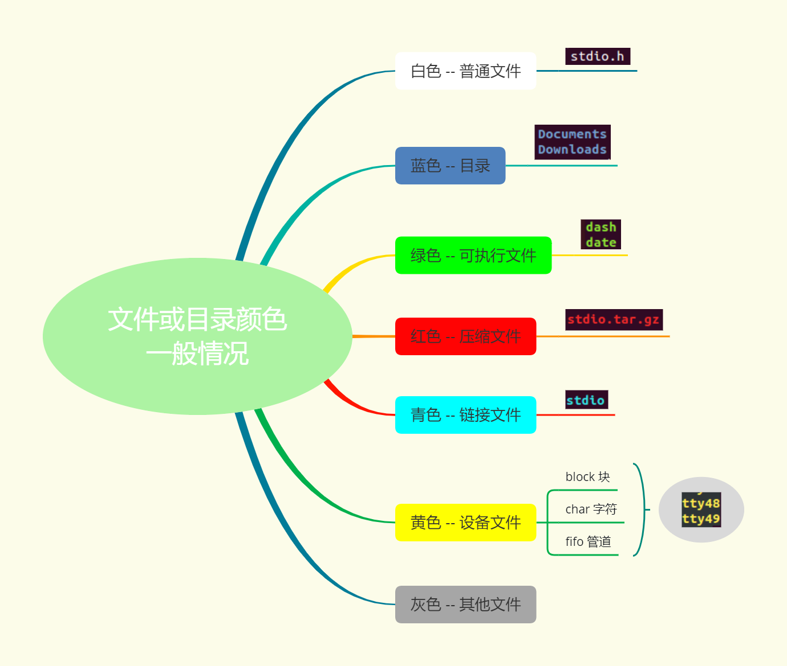

### 命令参数前的横杠-

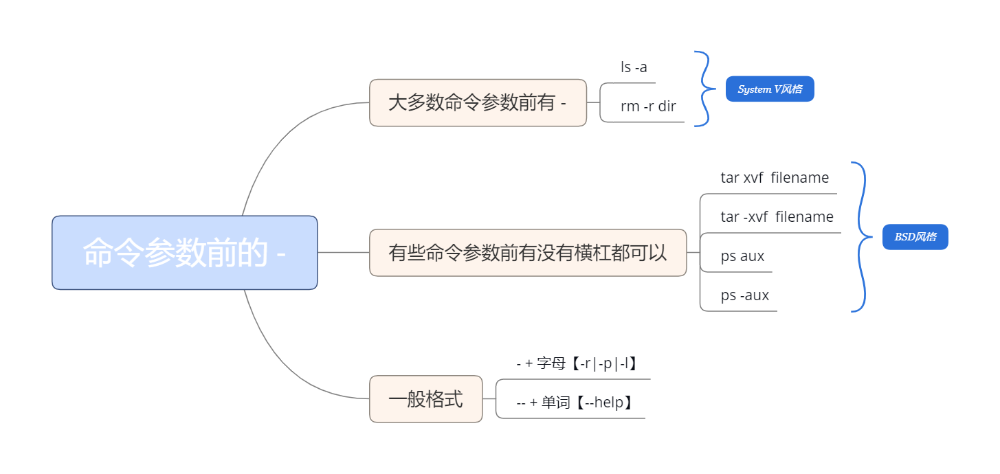

### Ubuntu

```bash
	# 切换到超级用户
		sudo su
	# 退出超级用户
		exit
	#普通用户使用超级用户权限执行命令
		sudo + 命令
		sudo mv aa bb
```

### 命令解析器

对用户输入的命令进行解析，调用对应的执行程序

- shell：Bourne Shell（/bin/sh）
- bash：Bourne Again Shell(/bin/bash)   <mark>最常用</mark>
- C Shell（/usr/bin/csh）
- ......

### 终端

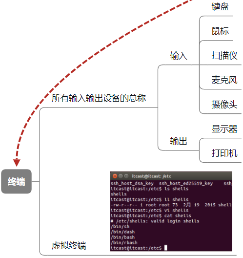

### 命令和路径补齐

在虚拟终端下
使用 tab 键

- 补齐命令
- 补齐目录
- 提高效率，降低出错率

### 主键盘快捷键

光标移动的位置
  1. 向上↑： ctrl+p (previous)
 2. 向下↓： ctrl+n (next)
 3. 向左←：ctrl+b (backward)
 4. 右→：ctrl+f (forward)
 5. 移动到行首: ctrl + a
6. 移动到行尾: ctrl + e
 7. 一个单词地移动：ctrl+左键，ctrl+右键

  

删除字符

1. 删除光标后边的: ctrl + d  
    ctrl d ：删除的是字符b  
	
2. 删除光标前边的: Backspace
	ctrl + h
3. 删除光标前的所有内容：ctrl + u
4. 删除光标后的所有内容：ctrl + k

## 目录结构

### 类unix系统目录结构


### 主要目录介绍(/)

#### dev

设备目录（device的缩写）

该目录下的所有文件称之为设备文件

Linux下所见皆文件 --> linux 下看到的所有的东西都被虚拟成文件

- cup，内存，显卡，声卡，网卡
- 鼠标，键盘
- 。。。

举例：查看鼠标设备（mice）

- cd /dev/input
- sudo cat mice (管理员权限查看)
- 鼠标移动会有命令行输出，数据会以二进制方式写入文件中，

以ASCII码形式展示到屏幕上（乱码）

```
- 乱码：数据的存储和数据读取的方式不一致导致的。
```

#### etc

包含了当前操作系统用户所有配置的相关信息

- ftp、nfs服务器搭建涉及的一个目录
- 系统软件的启动和配置文件
- 系统在启动过程中需要读取的文件
- 用户登录时的用户名、密码也存储在该目录下
  - 查看：vi /etc/passwd

#### home

当前操作系统所安装的用户的主目录

家目录(宿主目录、用户主目录)

- 1. /home/itcast(当前用户)/
- 2. cd /home/itcast == cd ~== <mark>cd 空</mark>

#### lib

操作系统使用的库文件已经相关的配置都放在此目录下

- 标准C库：/lib/i386-linux-gnu/libc.so.6
- i386-linux-gnu根据系统不同目录名字会有差异

lib --> library

#### mnt

手动挂载的目录

#### media

系统自动挂载目录

#### usr

unix软件资源包管理目录，存放的是当前用户下的一些东西

usr --> unix software resource

- games 游戏
- include 头文件
- lib 应用程序库文件

#### bin

Linux操作系统下可执行的系统级的二进制命令

shell解析输入的命令时，会进入到该目录执行对应的二进制命令

- 如：./date

binary 的缩写

#### sbin

超级用户需要用到的一些二进制命令存储在该目录

sbin --> super binary

#### boot

系统开机时需要加载的一些文件和配置

初学者不要碰该目录下的文件

#### lost+found

存放系统错误产生的文件碎片，方便用户查找和恢复

#### proc

内核提供的一个接口，主要用来存储系统统计信息

#### root

root用户的家目录（宿主目录）

ubuntu用户切换到root用户：sudo su

#### run

存放系统运行时需要的一些文件

用户目录

/home/lsl

### 绝对路径

从根目录开始描述的路径，也就是从 / 开始

： 与 $ 直接的部分 --> 当前shell进程所在的工作目录位置

### 相对路径

从当前位置开始描述的路径

. 表示当前目录

.. 表示当前目录的上一级目录

-两个临近目录直接进行切换  cd -

### itcast@itcast:~$

1. 第一个itcast：当前登录的用户
2. @：英文at，在的意思
3. 第二个itcast：主机名
4. ~：当前工作目录的位置，宿主目录
5. $：表示当前登录的用户为普通用户
6. #：表示root用户   itcast@itcast:~#

## 文件与文件夹

### ls -l


### rm

```bash
#删除文件
rm 文件
#删除文件夹
rm -r 文件夹
#强制删除不询问
rm -rf 文件/文件夹
```

### which和whereis

都是linux操作系统下查找可执行文件路径的命令

**which**

查找系统`PATH`路径下的可执行文件。就是查找已经安装好的可以直接执行的命令

```sh
$ which ls

/bin/ls
```

which查找的可执行文件，必须是`PATH`下的可执行文件，而不能是没有加入`PATH`的可执行文件。即使是可以行的文件，但是没有加入到系统搜索路径中给你，它仍然无法被which发现

**whereis**

查找二进制（命令）、源文件、man文件。与which不同的是这条命令可以是通过文件索引数据库而非PATH来查找的，所以查找的面比which要广

```shell
$ whereis ls

ls: /bin/ls
/usr/share/man/man1/ls.1.gz
```

可以看到，whereis不仅找到了ls可执行文件的位置，还找到了其`man`帮助文件，可见其搜索范围比较广，不局限于PATH

### 权限管理

```bash
chown
	将指定文件的拥有者改为指定的用户或组 -- change owner
	用法
		chown + 文件所属用户 + 文件或目录名
			sudo chown nobody text.txt
		chown + 文件所属用户：文件所属组 + 文件或目录名
			sudo chown nobody：nogroup text.txt
chgrp
	改变文件或目录的所属群组
	用法
		chgrp + 用户组 + 文件或目录名
		sudo chgrp nogroup text.txt

这两个命令需要超级用户权限才能执行
```

### 共享文件夹

1、在vmware中启用共享文件夹

2、查看共享文件夹是否设置成功

vmware-hgfsclient


3、挂在共享文件夹到/mnt目录下

sudo vmhgfs-fuse .host:/ /mnt -o nonempty -o allow_other


### 给文件/文件夹创建桌面快捷方式

将文件夹建立软链接到桌面

```bash
ln -s ‘/home/lsl/Downloads’ ~/桌面
```

以创建一个名为 `python` 的符号链接，指向 `python3`，从而方便地使用 `python` 命令来调用 Python 3 解释器。以下是创建这样一个链接的命令：

```shell
sudo ln -s /usr/bin/python3 /usr/local/bin/python
```


## 压缩包管理

### 打包

#### tar

- 该命令可以只打包不压缩
- 通过添加参数，来完成文件的压缩和解压
  - 参数
    1. z -> 用 gzip 来压缩/解压缩文件
    2. j -> 用 bzip2 来压缩/解压缩文件      （1,2）互斥     
    3. c -> create，创建新的压缩文件。如果用户想备份一个目录或是一些文件，就要选择这个选项。
    4. x -> 从压缩文件中释放文件              （3,4）互斥
    5. v -> 详细报告tar处理的文件信息
    6. f -> 指定压缩文件的名字
  - 压缩
    - tar + 参数（zcvf） + 压缩包名字.tar.gz + 原材料（要打包压缩的文件或目录）
    - tar + 参数（jcvf） + 压缩包名字.tar.bz2 + 原材料（要打包压缩的文件或目录）
  - 解压缩
    - tar + 参数（zxvf） + 已有的压缩包（test.tar.gz）
    - tar + 参数（jxvf） + 已有的压缩包（test.tar.bz2）
    - 指定解压目录：添加参数 -C（大写）
      - tar zxvf test.tar.gz -C + 解压目录（./mytest）	

### 压缩

#### .gz 格式

- 使用 gzip 命令压缩 
  - 压缩过程中不保留源文件
  - 不能对目录进行压缩
  - 不能对多个文件进行打包压缩
- 解压缩：gunzip 命令

#### .bz2 格式

- 使用 bzip2 命令压缩
  - 通过使用参数 -k(keep) 保留源文件
  - 不能对目录进行压缩
  - 不能对多个文件进行打包压缩
- 解压缩：bunzip2 命令

<mark>弊病：</mark>不能对多个文件进行打包压缩，不能对目录进行压缩

### rar

- 使用前需要安装 rar 工具
  - sudo apt-get install rar
- 用法：
  - rar \<命令> -\<选项1> ….-\<选项N> \<操作文档> \<文件…> \<@文件列表…> \<解压路径>
    - 命令
      - a -> 添加文件到操作文档
      - x -> 带路径解压文档中内容到当前目录
    - 选项
      - r -> 递归子目录
- 打包：
  - rar a -r + 压缩文件名（newdir） + 压缩的目录（./mydir）
  - 打包的生成的新文件不需要指定后缀
- 解包：
  - rar x newdir.rar
  - 解压到指定目录
    - rar x all.rar + 目录（/home/itcast/test）

### zip

- 打包：
  - 对目录打包需要添加参数： -r
  - zip -r + 打包之后的文件名（dir.zip） + （打包的目录）dir
- 解包：
  - unzip dir.zip
  - 解压到指定目录：
    - 使用参数 -d 来指定目录
    - unzip dir.zip -d /home/itcast/test

命令 [参数] 压缩文件名 压缩的文件和目录

## 进程管理

tty：终端设备的统称。

tty一词源于Teletypes，或者teletypewriters，原来指的是电传打字机，是通过串行线用打印机键盘通过阅读和发送信息的东西，后来这东西被键盘与显示器取代，所以现在叫终端比较合适。终端是一种[字符型](https://so.csdn.net/so/search?q=字符型&spm=1001.2101.3001.7020)设备，它有多种类型，通常使用tty来简称各种类型的终端设备。

tty1～6是文本型控制台，tty7是X Window图形显示管理器。

在本地机器上可以通过Ctrl+Alt+F1（F1-F7键）切换到对应的登录控制台。

### who

查看当前在线用户的情况

- 登录的用户名
- 使用的设备终端（pts）
- 登录到系统的时间

tty 设备

- tty1 - tty6 表示文字界面
  - ctrl + alt + [F1-F6]
- tty7 图形界面
  - ctrl +　alt + F7

### ps

查看整个系统内部所运行的进程状况

涉及的参数

- a：（all）当前系统所有用户的进程
- u：查看进程所有者及其他一些信息
- x：显示没有控制终端的进程 -- 不能与用户进行交互的进程【输入、输出】

显示当前用户下所有进程

- ps aux

对显示的进程过滤

- ps aux | grep xxx
  - 什么是管道（|）
    - 指令1的输出作为指令2的输入
      - 指令2处理完毕，将信息输出到屏幕
  - grep查询是需要占用一个进程的，所有结果 > 2 才能说明查询结果存在
  - 如果结果有一条，表示没有查询的进程
  - 查询结果中PID表示进程ID

### top

相当于windows下的任务管理器

- 文字版
- 不能翻页

top命令可以实时动态地查看系统的整体运行情况，是一个综合了多方信息监测系统性能和运行信息的实用工具，TOP命令是Linux下常用的性能分析工具，**能够实时显示系统中各个进程的资源占用状况**，有点像window系统的任务管理器

param为：

- -b：以批处理模式操作；
- -c：显示完整的治命令；
- -d：屏幕刷新间隔时间；
- -I：忽略失效过程；
- -s：保密模式；
- -S：累积模式；
- -u [用户名]：指定用户名；
- -p [进程号]：指定进程；
- -n [次数]：循环显示的次数。
- -H：查看进程下面的子线程

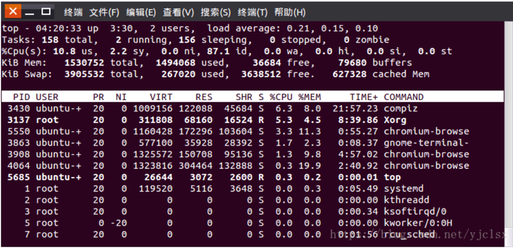

### squeue

查看slurm调度器中的任务队列

squeue -a | grep lsl7270 -c

查看计算队列中的进程

### kill

用来终止指定的进程（terminate a process）的运行

查看信号编号

- kill -l

杀死进程

- kill -SIGKILL 89899【PID-进程标识号】
  - 向当前进程发送了9号信号（SIGKILL）

### pkill

杀死指定用户的指定进程名的进程

pkill -9 -u lsl7270 python  

### 结束、停止、杀死进程的区别

停止进程就是挂起

结束进程是要等程序响应的，正常终止

kill进程不会等程序响应（有点异常终止，有问题还是会询问一下），kill -9是无条件终止信号

### env

查看当前进程环境变量

环境变量

- 当前系统下用户的配置路径信息
- 格式为键值对：key=value：value  （多个值之间用 ： 分隔）
- PATH：该环境变量中记录着shell命令解析器去查找命令的目录位置，从前往后的顺序查找
  - LANG: 语言以及字符集

## 网络管理

### ifconfig

获取网络接口配置信息，还可以修改这些配置。

获取网络接口信息

ping

测试与目标主机的连通性

命令格式

- ping [参数] [主机名或IP地址]

参数

- -c 数目：在发送指定数目的包后停止。
- -i 秒数：设定间隔几秒送一个网络封包给一台机器，预设值是一秒送一次

### nslookup

查看服务器域名对应的IP地址

一般访问网站都是使用域名，如：www.baidu.com，使用该命令就可查看百度所有服务器的IP地址


## 用户管理

### 创建用户

（1）sudo adduser + 用户名（luffy），adduser会自动在/home目录下创建同名文件夹  

默认情况下：

adduser在创建用户时会主动调用 /etc/adduser.conf；

在创建用户主目录时默认在/home下，而且创建为 /home/用户名 

如果主目录已经存在，就不再创建，但是此主目录虽然作为新用户的主目录，而且默认登录时会进入这个目录下，但是这个目录并不是属于新用户，当使用userdel删除新用户时，并不会删除这个主目录，因为这个主目录在创建前已经存在且并不属于这个用户。

为用户指定shell版本为：/bin/bash

（2）sudo useradd -s /bin/bash -g itcast -d /home/itcast -m itcast，  
useradd创建了一个用户名，没有在/home/目录下创建同名文件夹，也没有创建密码，需要sudo passwd itcast

- -s 指定新用户登陆时shell类型
- -g 指定所属组，该组必须已经存在
- -d 用户家目录
- -m 用户家目录不存在时，自动创建该目录

设置用户组

```
sudo groupadd itcast
```

（3）之后如果想修改用户密码，都可以使用sudo passwd username来实现

### 删除用户

sudo deluser + \<username\>，自动把用户的主目录一起删除

sudo delusr –remove-home \<username\>，要删除的用于及其主目录和邮件假脱机，可以运行该命令

sudo userdel -r itcast

- 选项 -r 的作用是把用户的主目录一起删除

### 切换用户

su + 用户名（sanji）

### root用户

sudo su

#### 修改root密码

1.第一步：执行如下命令，设置密码

sudo passwd

2.第二步：输入当前用户的密码

3.第三步：输入root用户的密码

4.第四步：再次输入root用户的密码

5.第五步：执行以下命令，切换到root用户

su root

### 设置密码

sudo passwd + 用户名（luffy）

sudo passwd root

sudo passwd

### 退出登录用户

exit

### 获知用户身份

```bash
id username：输出用户ID，组ID和账户的组成员身份
UID=1000(jacob) GID=1000(jacob) groepen=1000(jacob),4(adm),24(cdrom),27(sudo),30
“ 27（sudo）”表示我是“ sudo”组的成员，并且可以选择使用运行命令sudo，换句话说：我是管理员。
相比之下，“普通”用户的输出为：
UID=1001(testpersoon) GID=1001(testpersoon) groepen=1001(testpersoon),1000(jacob)
要将“普通”用户转变为管理员，将用户添加到组sudo中
sudo adduser <username> sudo  (from an administrator's user account)
```


### 授予用户sudo权限

#### 方法一、将用户添加到sudoers文件中定义的sudo组中

验证用户是否具有sudo访问权限：

```bash
$ sudo -l -U Senthil
User senthil is not allowed to run sudo on ubuntu2204.
```

将用户添加到 sudo 组：

```bash
$ sudo usermod -aG sudo Senthil
```

要验证用户是否已添加到 sudo 组中，请运行：

```bash
$ sudo -l -U Senthil
```


在这里，“（全部：全部）全部”line 表示用户拥有无限权限，可以在系统上运行任何命令。在我们的例子中，“ senthil ”用户已被添加到sudo 用户组中。从现在开始，他可以执行各种管理任务。

#### 方法二、将用户添加到sudoers文件中（不推荐）

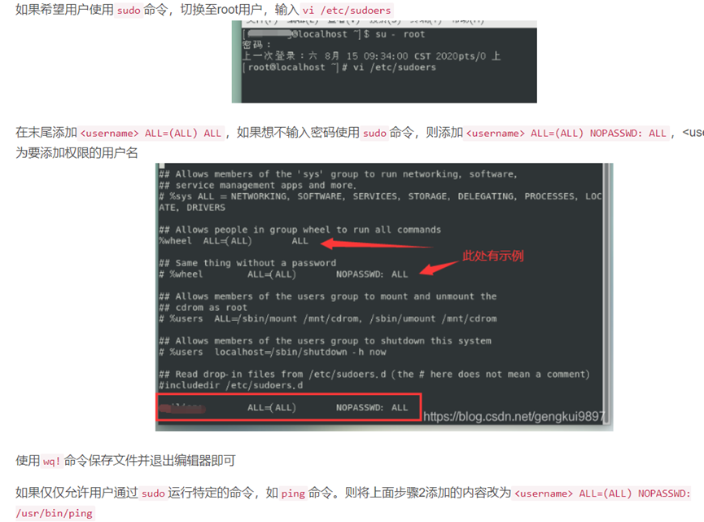

#### 方法三、在/etc/sudoers.d目录中创建授权文件（推荐）

通过在 /etc/sudoers.d 目录中创建具有授权规则的新文件来实现相同的操作，运行命令echo "\<username\> ALL=(ALL) NOPASSWD: ALL" | sudo tee /etc/sudoers.d/\<username\>可以实现相同的效果，这种方法更易于维护，推荐使用

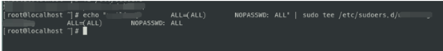

（或者创建文件名为用户名的文件，在其中输入: lsl  ALL=(ALL:ALL)  ALL

#### 查看sudoers文件内容

```bash
$ sudo cat /etc/sudoers
```

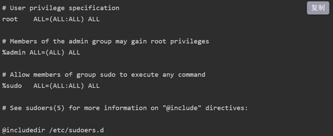

- 第一个 ALL 是允许的用户。

- 第二个 ALL 是主机。如果您将相同的“sudoers”文件分发给许多主机，用户可以在所有主机上执行管理命令。

- 第三个是运行命令时的用户。

- 最后一个是允许的命令。


#### 删除用户的sudo访问权限

要撤销用户的 sudo 权限（例如 senthil），命令将是：

```bash
$ sudo deluser senthil sudo
```

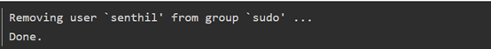

或者，运行以下命令来撤销用户的 sudo 权限：

```bash
$ sudo gpasswd -d senthil sudo
```

### 更改文件夹所属用户/用户组

使用chown修改文件所属用户/用户组：

```shell
chown -R username filedir

chown [-cfhvR] [--help] [--version] user[:group] file...
1.	user : 新的文件拥有者的使用者 ID group : 新的文件拥有者的使用者组(group)
2.	-c : 显示更改的部分的信息
3.	-f : 忽略错误信息
4.	-h :修复符号链接
5.	-v : 显示详细的处理信息
6.	-R : 处理指定目录以及其子目录下的所有文件
7.	–help : 显示辅助说明
8.	–version : 显示版本
```


## 磁盘管理

磁盘命名

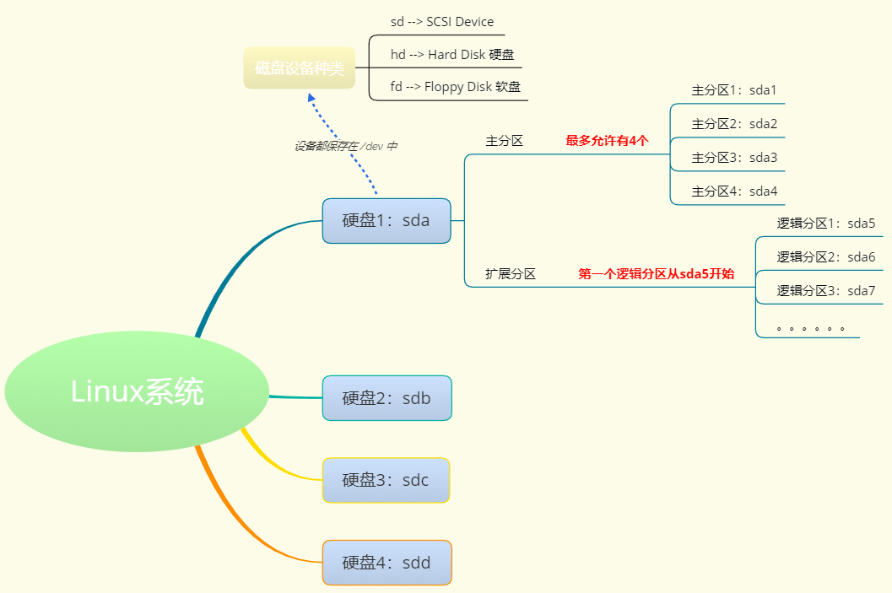

### 挂载 mount

```bash
系统默认挂载目录：/media
手动挂载目录：/mnt
挂载方式：mount + 设备名 + 挂载目录
	设备名
		检测设备名称： sudo fdisk -l
		磁盘命名规则
	挂载目录
		默认手动挂载到　/mnt
		挂载到/mnt以外的目录 -- 挂载成功后会遮蔽掉目录中原来的东西，卸载设备之后才能看到目录中原来的数据
```

### 卸载 umount

```bash
卸载的时候，用户的当前位置一定不能再 /mnt（/media）或者其子目录下，否则无法卸载
sudo umount /mnt
```


## 远程连接

### nc

```shell
nc localhost 9981
# 在nc中，回车键通常被解释为换行字符（`\n`）
```


### telnet

```shell
telnet localhost 9981
# 在telnet中，回车键通常被解释为回车和换行字符的组合（`\r\n`）
```

#### 退出telnet

1. ctrl + ]
2. quit/exit


## 查看、查找和检索

### 查看常用命令

linux命令中cat、more、less、tail、head均可用来查看文件内容，主要区有：

cat是一次性显示整个文件的内容，适用于文件内容少的情况；

more和less一般用于显示文件内容超过一屏的内容，并且提供翻页的功能。

tail 和 head分别显示文件的后几行和前几行内容。常用于大文件的截取。

### cat

cat命令是整个文件的内容从上到下显示在屏幕上。还可以将多个文件连接起来显示，它常与重定向符号配合使用，适用于文件内容少的情况.

-n 对文件进行顺序编号，即输出行号

### more

more命令会以一页一页的显示方便使用者逐页阅读，而最基本的指令就是按空白键（space）就往下一页显示，按 b 键就会往回（back）一页显示，而且还有搜寻字串的功能 。more命令从前向后读取文件，因此在启动时就加载整个文件。

### less

less 工具也是对文件或其它输出进行分页显示的工具，应该说是linux正统查看文件内容的工具，功能极其强大。less 的用法比起 more 更加的有弹性。

在 more 的时候，我们并没有办法向前面翻， 只能往后面看，但若使用了 less 时，就可以使用 [pageup] [pagedown] 等按键的功能来往前往后翻看文件，更容易用来查看一个文件的内容！除此之外，在 less 里头可以拥有更多的搜索功能，不止可以向下搜，也可以向上搜。

### find

```bash
按文件名查询：-name
	find + 路径 + -name + 文件名
	find /home -name a.txt
	
按文件大小查询：-size
	find + 路径 + -size + 范围
		范围
			大于：+表示  -- +100k
			小于：-表示  --  -100k
			等于: 不需要添加符号  -- 100k
		大小
			M 必须大写
			k 必须小写
	例子:
		等于100k的文件: find ~/ -size 100k
		大于100k的文件: find ~/ -size +100k
		大于50k, 小于100k的文件: find ~/ -size +50k -size -100k
		
按文件类型查询：-type
	find + 路径 + -type + 类型
		类型
				1. 普通文件类型用 f 表示而不是 -
				2. d -> 目录
				3. l -> 符号链接
				4. b -> 块设备文件
				5. c -> 字符设备文件
				6. s -> socket文件，网络套接字
				7. p -> 管道
				
使用通配符
	* -- 通配 0 - n个字符
	？-- 通配1个字符
```

**例子**

```shell
find /path/to/directory -type f -name "*keyword*" -print  # 在指定目录下查找包含指定关键字的文件，并打印出来
find /path/to/directory -type f -name "*keyword*" -exec rm {} \;
# find /path/to/directory：find 命令用于在指定的目录中进行文件搜索。将 /path/to/directory 替换为你要搜索的目录路径。
# -type f：这是 find 命令的选项之一，用于指定搜索的对象类型。f 表示只搜索普通文件，而不包括目录、链接等其他类型的文件。 -d是文件夹
# -name "*keyword*"：这是 find 命令的另一个选项，用于指定要匹配的文件名模式。*keyword* 是一个通配符模式，可以匹配包含指定关键字的文件名。你可以根据需要修改关键字的值。
# -exec rm {} \;：这是 find 命令的一个参数，用于在找到匹配的文件后执行指定的命令。在这个例子中，指定的命令是 rm {}，表示删除找到的文件。{} 是一个占位符，表示找到的文件名。\; 是用来告诉 find 命令 -exec 选项的结束，转义字符，用于将分号;作为普通字符处理，而不是作为命令分隔符。
```


### grep

1. grep是独立命令
2. `|` 是管道命令
3. `|` grep就是指把上个命令运行的结果通过管道命令带入到grep的参数里执行
4. 所以单纯的grep没什么意义，一般使用都是通过管道符来使用grep

```bash
在一个具体的文件中查找：
grep "main" test.c

递归查找目录及子目录的内容：
-r 
grep -r + “查找的关键字” + 路径
grep -r "main void" /home/itcast

-c 计数
```

### tail

```bash
tail -n access.log # 输出倒数n行
tail -f # 会是阻塞状态，有新日志输出的时候，就会实时显示出来
```

## 软件安装

### 在线安装

```bash
apt-get
	安装：sudo apt-get install tree -- 在线下载安装
	移除：sudo apt-get remove tree
	更新：sudo apt-get update -- 更新软件列表
	清理所有软件安装包: sudo apt-get clean
		实际清理的是: /var/cache/apt/archives 目录下的 .deb 文件
aptitude
	安装：sudo aptitude install tree
	重新安装：sudo aptitude reinstall tree
	更新：sudo apt-get update
	移除：sudo aptitude remove tree
	显示状态：sudo aptitude show tree
```

**查找apt源有哪些安装包**

```shell
apt-cache search maven
```


### deb包安装

安装
	sudo dpkg -i xxx.deb
删除
	sudo dpkg -r xxx

### 源码安装

1. 解压缩源代码包
2. 进入到安装目录：cd dir
3. 检测文件是否缺失，创建Makefile，检测编译环境： ./configure
4. 编译源码，生成库和可执行程序：make
5. 把库和可执行程序，安装到系统目录下：sudo make install
6. 删除和卸载软件：sudo make distclean
7. 上述安装步骤并不是绝对的，应该先查看附带的 README 文件

### 常见问题

#### Linux安装到哪个目录

##### 1、软件安装

usr:系统级目录。可理解为C:Windows/，

usr/lib:可理解为C:Windows/System32。

usr/local:用户级的程序目录。可理解为C:/Progrem Files/。用户自己编译的软件默认安装到这里。

/opt:用户级的程序目录，可理解为D:/Software,opt用于放置第三方大型软件，当不需要时，直接rm-f即可。当硬盘容量不够时，也可将opt单独挂载到其他磁盘上使用。

##### 2、源码

usr/src：系统级源码目录。

usr/local/src：用户级源码目录。

##### 3、常用目录及用途

```bash
/bin: 存放二进制可执行文件(ls,cat,mkdir等)，常用命令一般都在这里。
/etc: 存放系统管理和配置文件
/home: 存放所有用户文件的根目录，是用户主目录的基点，比如用户user的主目录就是home/user,可以用~user表示
/usr: 用于存放系统应用程序，比较重要的目录us小ocl本地系统管理员软件安装目录（安装系统级的应用）。这是最庞大的目录，要用到的应用程序和文件几乎都在这个目录。
/usr/x11r6: 存放x window的目录
/usr/bin: 众多的应用程序
/usr/sbin: 超级用户的一些管理程序
/usr/doc: linux文档
/usr/include: linux下开发和编译应用程序所需要的头文件
/usr/lib: 常用的动态链接库和软件包的配置文件
/usr/man: 帮助文档
/usr/src: 源代码，linux内核的源代码就放在/usr/src/linux里
/usr/local/bin: 本地增加的命令
/usr/local/Iib: 本地增加的库
/opt: 额外安装的可选应用程序包所放置的位置。一般情况下，我们可以把omcat等都安装到这里。
/proc: 虚拟文件系统目录，是系统内存的映射。可直接访问这个目录来获取系统信息。
/root: 超级用户（系统管理员）的主目录（特权阶级）
/sbin: 存放二进制可执行文件，只有root才能访问。这里存放的是系统管理员使用的系统级别的管理命令和程序。如lifconfig等。
/dev: 用于存放设备文件。
/mmt: 系统管理员安装临时文件系统的安装点，系统提供这个目录是让用户临时挂载其他的文件系统。
/boot: 存放用于系统引导时使用的各种文件
/lib: 存放跟文件系统中的程序运行所需要的共享库及内核模块。共享库又叫动态链接共享库，作用类似windows.里的.dl文件，存放了根文件
系统程序运行所需的共享文件。
/tmp: 用于存放各种临时文件，是公用的临时文件存储点。
/var: 用于存放运行时需要改变数据的文件，也是某些大文件的溢出区，比方说各种服务的日志文件（系统启动日志等。）等。
```

#### Ubuntu安装matlab遇到的问题

##### 安装Matlab时无/usr/local/MATLAB/R2021b文件夹的写入权限的解决方案

授予用户对该文件夹以及所有子文件夹和目录的所有权，从而可以以该用户进行读取和写入。

```bash
sudo chown -R username filedir/file
```


如果还不行，可以使用chmod命令来修复权限

```bash
sudo chmod u+rwx -R filedir/file
```

（安装完软件后，要把文件夹所属用户改为root，这样所有用户才可以一起使用）

##### 添加环境变量

###### a、仅针对当前用户

```bash
vi /home/lsl/.bashrc
eport PATH=$PATH:/home/share/software/matlab/bin:
```


```bash
wq
source /home/lsl/.bashrc
```

###### b、针对系统所有用户

1）在/etc/profile.d文件夹中vi matlab.sh文件，然后export，source /etc/profile

2）在/etc/bash.bashrc文件中export，然后source /etc/bash.bashrc

3）在/etc/profile文件中export，然后source /etc/profile

#### Ubuntu安装anaconda

**1）安装教程**

[(23条消息) Ubuntu安装Anaconda详细步骤（Ubuntu21.10，Anaconda3）_萝北村的枫子的博客-CSDN博客_ubuntu安装anaconda](https://blog.csdn.net/thy0000/article/details/122878599?ops_request_misc=%7B%22request%5Fid%22%3A%22165828824316782391869373%22%2C%22scm%22%3A%2220140713.130102334..%22%7D&request_id=165828824316782391869373&biz_id=0&utm_medium=distribute.pc_search_result.none-task-blog-2~all~top_click~default-1-122878599-null-null.142^v32^pc_search_result_control_group,185^v2^control&utm_term=ubuntu anaconda&spm=1018.2226.3001.4187)

**2）更改环境变量**

##### a、

方法一：

```
$ vi ~/.bashrc
```

在最后一行添加`PATH=$PATH:/my_new_path:`

`$source ~/.bashrc`

仅当前用户可用

方法二：注意：修改环境变量PATH。具体：修改`/etc/bash.bashrc`文件（所有用户都可用）

`$sudo vim /etc/bash.bashrc`

在文件末尾添加：

`export PATH=$PATH:/my_new_path:`

修改PATH后，关掉终端，重新打开终端（或重启）

改完之后要source激活一下

##### b、

Ubuntu安装anaconda3后找不到conda命令的原因是没有把anaconda3添加到路径，类似于Windows中添加到环境变量，所以找不到命令。解决方法是在终端中运行一下命令：

`echo 'export PATH="/home/你的用户名/anaconda3/bin:$PATH"' >> ~/.bashrc`

（可以把这个添加到`/etc/bash.bashrc`，这样所有用户都可以用）

添加完source激活一下

##### c、最好的方法

在`/etc/profile.d/`通过vi建立anaconda.sh文件

编辑输入：

`export PATH=$PATH:/usr/local/Software/Anaconda/bin:`

然后激活profile：

`source /etc/profile`

#### 3）一进终端就进入base环境

通过以下方式设置取消自动激活

`conda config --set auto_activate_base false`

然后重开终端

其配置文件位于~用户目录下的`.condarc`

如果反悔了还想要base一直留着的话可以使用以下语句来恢复

`conda config --set auto_activate_base true`

4）python和matlab联调

需要找到`matlab/engines/python/setup.py`

1、激活环境

2、sudo ……指定环境下/python setup.py

（不然sudo python就是默认的python2.7）

#### Ubuntu安装fastgithub

1、运行已编译好的可执行 fastgithub

$ ./fastgithub   （可加nohup，不挂起）

2、设置系统自动代理为

```
http://127:0:0:1:38457
```


3、firefox浏览器导入证书


这样浏览器就可以登录[www.github.com](http://www.github.com)

##### 遇到问题：

1、git时

fatal: 无法访问 'https://github.com/smileatl/MIT6.S081-xv6-labs-2020.git/'：Failed to connect to github.com port 443: 拒绝连接

 

如果你开启了VPN，很可能是因为代理的问题，这时候设置一下http.proxy就可以了。（我只要设置http.proxy就可以了，）

一定要查看自己的VPN端口号，假如你的端口号是7890，在git bash命令行中输入以下命令即可：

git config --global http.proxy 127.0.0.1:38457

git config --global https.proxy 127.0.0.1:38457

 

如果你之前git中已经设置过上述配置，则使用如下命令取消再进行配置即可：

git config --global --unset http.proxy

git config --global --unset https.proxy

 

下面是几个常用的git配置查看命令：

git config --global http.proxy #查看git的http代理配置

git config --global https.proxy #查看git的https代理配置

git config --global -l #查看git的所有配置


## 其他

### 查看man手册

**man man -> 共九个章节**

1. ​	<mark>可执行程序或shell命令</mark>
2. ​	<mark>系统调用（内核提供的函数）</mark>
3. ​	<mark>库调用（程序库中提供的函数）</mark>
4. ​	特殊文件（通常位于/dev）
5. ​	<mark>文件格式和规范（如：/etc/passwd）</mark>
6. ​	游戏
7. ​	杂项
8. ​	系统管理命令
9. ​	内核例程

### 环境变量分类

环境变量可以简单的分成用户自定义的环境变量以及系统级别的换变量

用户级别环境变量定义文件：`~/.bashrc、~/.profile`（部分系统为：`~/.bash_profile`

系统级别环境变量定义文件：`/etc/bashrc、/etc/profiile`（部分系统为：`/etc/bash_profile`、`/etc/environment`）

另外在用户环境变量中，系统会首先读取`~/.bash_profile`（或者`~/.profile`）文件，如果没有该文件则读取`~/.bash_login`，根据这些文件中内容再去读取`~/.bashrc`


### 系统配置检查

#### 查看cpu核数

##### 1、物理cpu的个数

物理核心就是计算机上实际配置的CPU个数。

```bash
# wc -l 是统计行数
cat /proc/cpuinfo | grep "physical id" | sort -u | wc -l
```

##### 2、每个CPU的核数

指CPU上集成的处理数据的CPU核心个数，单核指CPU核心数一个，双核则指的是两个。

```bash
# uniq 可以去重连续出现的相同记录
cat /proc/cpuinfo | grep "cpu cores" | uniq
```

##### 3、逻辑处理器数量

操作系统可以使用逻辑 CPU 来模拟出真实 CPU 的效果。

在之前没有多核处理器的时候，一个 CPU 只有一个核，而现在有了多核技术，其效果就好像把多个 CPU 集中在一个 CPU 上。

当计算机没有开启超线程时，逻辑 CPU 的个数就是计算机的核数。而当超线程开启后，逻辑 CPU 的个数是核数的两倍。实际上逻辑 CPU的数量就是平时称呼的几核几线程中的线程数量。

```bash
# sort -u = sort | uniq 先排序，后去重
cat /proc/cpuinfo | grep "processor" | sort -u | wc -l
```

##### 4、arch

查看linux的内核版本

arm64是ARM中64位体系架构，属于精简指令集体系，汇编指令比较简单

x64是x86系列中的64位体系，属于复杂指令集体系，汇编指令较多。

属于两种不同的体系

##### 5、小结

CPU 总核数 = 物理 CPU 个数 X 每颗物理 CPU 的核数

CPU 逻辑数 = 物理 CPU 个数 X 每颗物理 CPU 的核数 X 超线程数

#### 查看显卡型号、显卡信息、

##### 一、查看显卡型号

1、查看显卡型号命令

```bash
lspci | grep -i vga
#----output------
01:00.0 VGA compatible controller: NVIDIA Corporation Device 1f06 (rev a
```

可以看到，查看到的显卡型号名称是一个十六进制数字代码。
 接下来将得到的十六进制数字代码，带入网址中查询具体显卡型号。

2、以下网址输入数字代码查询显卡型号

[PCI devices (ucw.cz)](http://pci-ids.ucw.cz/mods/PC/10de?action=help?help=pci)


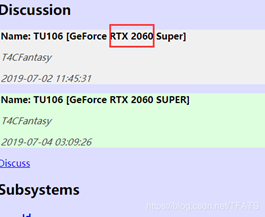

##### 二、查看显卡信息

1、查看显卡信息命令

1. nvidia-smi
2. nvidia-smi（显示一次当前GPU占用情况）
3. nvidia-smi -l（每秒刷新一次并显示）
4. watch -n 5 nvidia-smi （其中，5表示每隔6秒刷新一次终端的显示结果）


2、显卡信息详解

1. 第一栏的Fan：N/A是风扇转速，从0到100%之间变动，这个速度是计算机期望的风扇转速，实际情况下如果风扇堵转，可能打不到显示的转速。有的设备不会返回转速，因为它不依赖风扇冷却而是通过其他外设保持低温（比如我们实验室的服务器是常年放在空调房间里的）。
2. 第二栏的Temp：是温度，单位摄氏度。
3. 第三栏的Perf：是性能状态，从P0到P12，P0表示最大性能，P12表示状态最小性能。
4. 第四栏下方的Pwr：是能耗，上方的Persistence-M：是持续模式的状态，持续模式虽然耗能大，但是在新的GPU应用启动时，花费的时间更少，这里显示的是off的状态。
5. 第五栏的Bus-Id是涉及GPU总线的东西
6. 第六栏的Disp.A是Display Active，表示GPU的显示是否初始化。
7. 第五第六栏下方的Memory Usage是显存使用率。
8. 第七栏是浮动的GPU利用率。
9. 第八栏上方是关于ECC的东西。
10. 第八栏下方Compute M是计算模式。
11. 下面一张表示每个进程占用的显存使用率。

注: 显存占用和GPU占用是两个不一样的东西，显卡是由GPU和显存等组成的，显存和GPU的关系有点类似于内存和CPU的关系。 

#### uname -a

看内核版本和发行版本

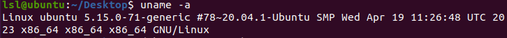

#### arch

查看操作系统架构类型：

arm64是ARM中64位体系架构，属于精简指令集体系，汇编指令比较简单

x64是x86系列中的64位体系，属于复杂指令集体系，汇编指令较多。

属于两种不同的体系

#### dpkg --print-architecture

正在运行的处理器架构

arm64，arm的

amd64就是x86-64，intel和amd的


### 其他命令


#### echo

```bash
在显示器上显示数据
	普通数据：echo 字符串
	显示环境变量：echo $PATH
	显示上一次程序退出值：echo $?
	$ : 取值
	？：最近一次程序退出时的返回值
```

#### 终端翻页

Shift + PageUp -> 上翻页
Shift + PageDown -> 下翻页

#### 清屏

clear
Ctrl + l

#### 创建终端

Ctrl + Alt + T （Ubuntu）
Ctrl + Shift +T （添加新标签页）

#### 设置或查看别名

```bash
查看
	alias
设置
	alias pag='ps aux | grep'
		需要长久有效需要去设置配置文件：.bashrc
```


#### 关键重启

```bash
poweroff
reboot
shutdown
	参数
		-t 秒数 : 设定在切换至不同的runlevel之前, 警告和删除二讯号之间的延迟时间(秒).
		-k : 仅送出警告讯息文字, 但不是真的要 shutdown.
		-r : shutdown 之後重新开机.
		-h : shutdown 之後关机.
		-n : 不经过 init , 由 shutdown 指令本身来做关机动作.(不建议你用)
		-f : 重新开机时, 跳过 fsck 指令, 不检查档案系统.
		-F : 重新开机时, 强迫做 fsck 检查.
		-c : 将已经正在 shutdown 的动作取消.
	例子:
		shutdown -r now 立刻重新开机
		shutdown -h now 立刻关机
		shutdown -k now 'Hey! Go away! now....' 发出警告讯息, 但没有真的关机
		shutdown -t3 -r now 立刻重新开机, 但在警告和删除processes 之间, 延迟3秒钟.
		shutdown -h 10:42 'Hey! Go away!' 10:42 分关机
		shutdown -r 10 'Hey! Go away!' 10 分钟後关机
		shutdown -c 将刚才下的 shutdown 指令取消,必须切换至其它tty, 登入之後, 才能下此一指令.
		shutdown now 切换至单人操作模式(不加任何选项时)
```

## 其他问题

### 远程连接软件连接不上ubuntu

需要保证当前系统支持ssh远程连接服务

1、在ubuntu系统中安装ssh服务

执行命令：sudo apt-get install openssh-server

2、然后执行ps -e | grep ssh确认ssh-server是否启动

如果只有ssh-agent的话 那么说明ssh-server还未启动


3、重启ssh服务 ssh-server配置文件位于/ etc/ssh/sshd_config

执行命令：sudo /etc/init.d/ssh restart

重新启动ssh服务

### U盘只读文件系统

```bash
lsblk/df h：查看分区

sudo umount /media/linhuihuang/XIAKE : 卸载U盘

sudo dosfsck -v -a /dev/sdb1 : 修复U盘文件系统故障
# 或者用win10修理磁盘
```

U盘拔了再插

有时需要注销用户，重开

### linux的super键就是windows的win键。

### ./filename.sh文件 你没有足够权限

1）chmod +x xxxx.sh

加上可执行权限

2）bash filename.sh

直接用bash解析器解析

### apt-get和 apt

apt-get是老版的命令，apt是新版的命令，apt还包含了apt-get cache等等，用起来更方便。因为apt刚刚出来，所以允许有apt-get和apt共存，以后apt-get就要淘汰了。