# 第二章-信息的表示和处理

## 信息存储

**为什么会有二进制？二进制有什么含义和优势**：

**二值信号能够很容易地被表示、存储和传输**。例如，可以表示为穿孔卡片上有洞或无洞、导线上的高电压或低电压，或者顺时针或逆时针的磁场。对二值信号进行存储和执行计算的电子电路非常简单和可靠，制造商能够在一个单独的硅片上集成数百万甚至数十亿个这样的电路。孤立地讲，单个的位不是非常有用。

然而，**当把位组合在一起，再加上某种解释，即赋予不同的可能位模式以含义**，我们就能够表示任何有限集合的元素。比如，使用一个二进制数字系统，我们能够**用位组来编码非负数**。通过使用标准的字符码我们能够**对文档中的字母和符号进行编码**。

**计算机的三种编码方式**：

- **无符号**：无符号（unsigned）编码基于传统的二进制表示法，表示大于或者等于零的数字。
- **补码**：补码（two’ s-complement）编码是表示有符号整数的最常见的方式，有符号整数就是可以为正或者为负的数字。
- **浮点数**：浮点数（ floating-point）编码是表示实数的科学记数法的以2为基数的版本。

**整数&浮点数**：

在计算机中，整数的运算符合运算符的交换律和结合律，溢出的结果会表示为负数。整数的编码范围比较小，但是其结果表示是精确的。

浮点数的运算是不可结合的，并且其溢出会产生特殊的值——正无穷。浮点数的编码范围大，但是其结果表示是近似的。

造成上述不同的原因主要是因为计算机对于整数和浮点数的编码格式不同。

**虚拟内存&虚拟地址空间**：

大多数计算机使用8位的块，或者字节（byte），作为**最小的可寻址的内存单位**，而不是访问内存中单独的位。  
不同字长对应不同的虚拟地址空间大小。机器级程序将内存视为一个非常大的**字节数组**，称为**虚拟内存（ virtual memory）**。内存的每个字节都由一个唯一的数字来标识，称为它的**地址（address）**，所有可能地址的集合就称为**虚拟地址空间**

指针是由**数据类型和指针值**构成的，它的值表示某个**对象的位置**，而它的**类型表示那个位置上所存储对象的类型（比如整数或者浮点数）**。  
语言中任何一个类型的指针值对应的都是一个**虚拟地址**。  
C语言编译器可以根据**不同类型的指针值生成不同的机器码来访问存储在指针所指向位置处的值**。但是它生成的实际**机器级程序并不包含关于数据类型的信息**。  
(32位机器，使用4字节的地址；64位的机器使用8字节的地址.)

##  Words

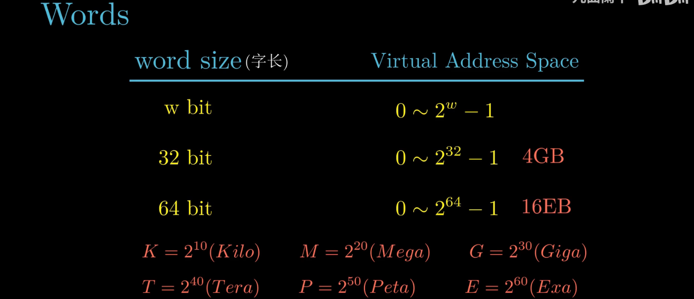

高性能服务器、个人电脑以及智能手机以完成32位字长到64位字长迁移，但是一些嵌入式机器中还是32位的。

64位的机器还是可以运行32位的程序（向后兼容）。通过修改编译选项，就可以编译生成在不同位机器上运行的程序。但是64位的程序只能运行在64位的机器上。

32位的程序还是64位的，主要的区别在于程序是如何编译的，而不是运行机器的类型。

## 不同数据类型存储空间大小

为了避免由于依赖“典型”大小和不同编译器设置带来的奇怪行为，ISO C99 引人了一类数据类型，其**`_t` 数据大小是固定的，不随编译器和机器设置而变化**。其中就有数据类型
int32_t 和int64_t, 它们分别为4 个字节和8 个字节。使用确定大小的整数类型是程序员准确控制数据表示的最佳途径。

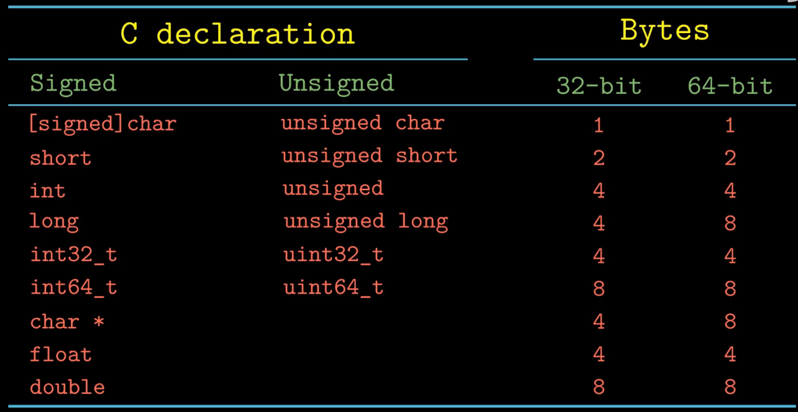

## 大小端存储法

大多数Intel兼容机采用小端模式，IBM和Sun公司的机器大多数机器采用大端法；只是大多数，并不是全部；很多新处理器，支持双端法，可以配置成大端或者小端运行。

但是Android系统和iOS系统却只能运行在小端模式。

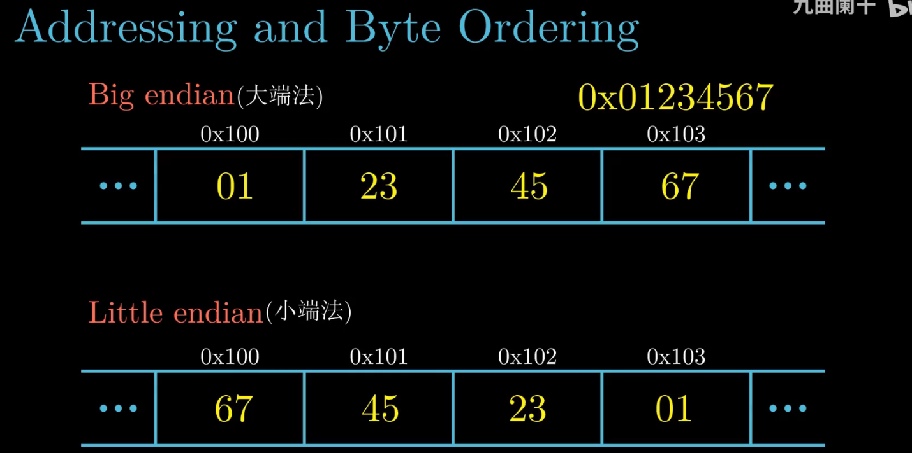

1、不同设备的数据传输：A设备为小端模式，B设备为大端模式。当通过网络将A设备的数据传输到B设备时，就会出现问题。

2、阅读反汇编代码

## 指针的大小

32位机器，使用4字节的地址；64位的机器使用8字节的地址。

## 整数的表示

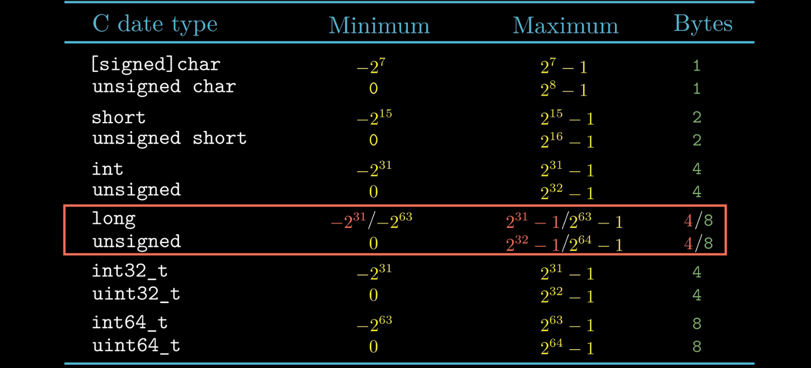

### 有符号数的编码

采用补码的形式，

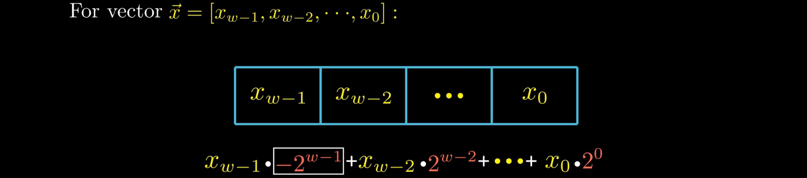

符号位需要理解负权重的概念，而不是简单的负号。（-0和-1的区别）

对于4位补码，可以表示的最小值位-8，最大值位7。（看1011的计算就知道了）

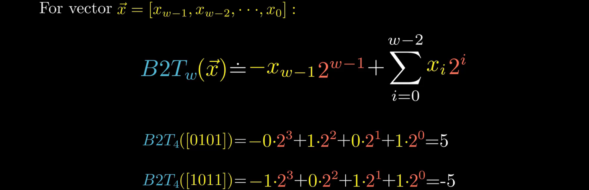

### 数值范围

#### **无符号数的数值范围**：

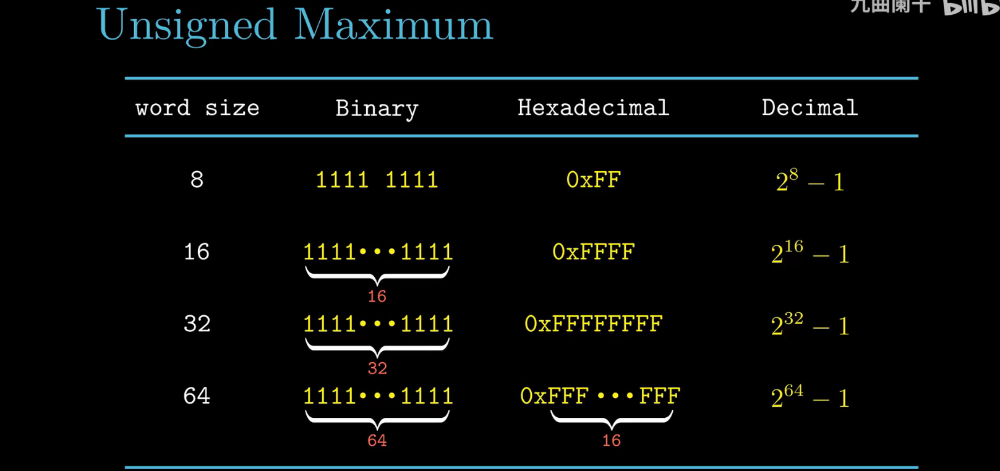

#### **有符号数的数值范围**：

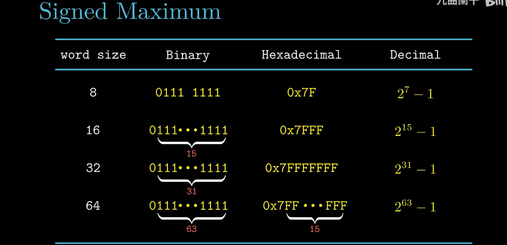

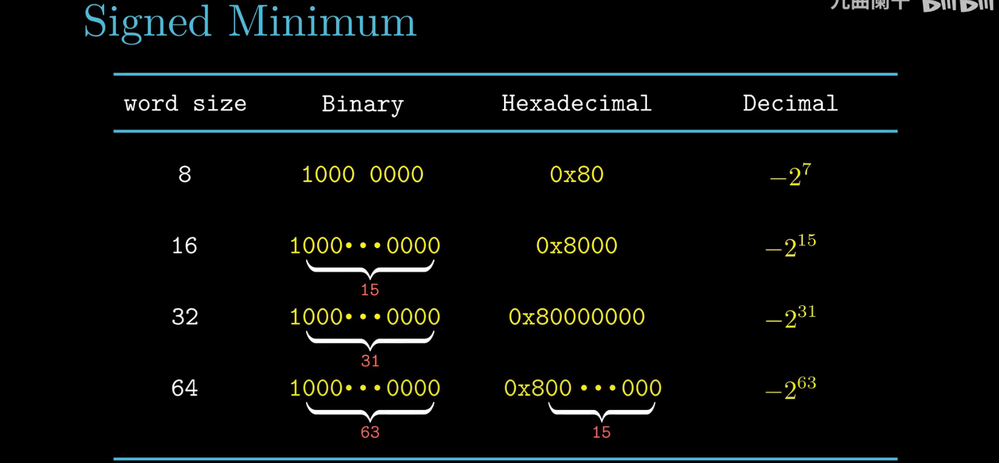

#### Special Numeric

-1的补码与无符号数的最大值有着相同的二进制位表示。虽然C语言的标准中并没有要求用补码来表示有符号数，但是几乎所有的机器都是用补码来表示有符号数

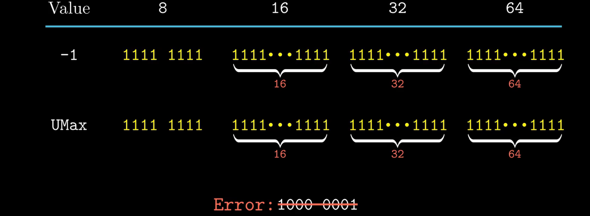

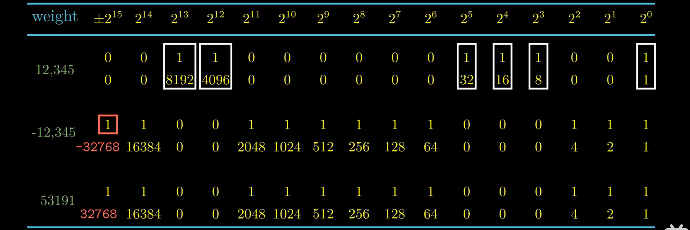

### 无符号数与有符号数转换

#### 示例

C语言：位模式不变，但是解释这些位的方式改变了

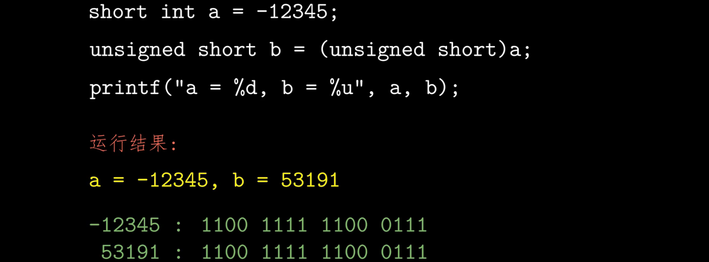

#### 补码转无符号数

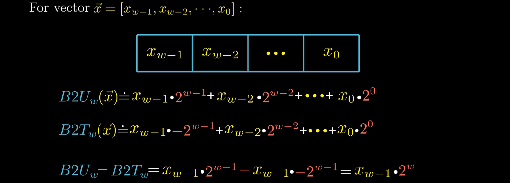

#### 转换公式

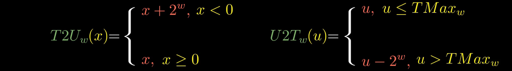

注意：当执行一个运算时，如果它的一个运算数是有符号的而另一个是无符号的，那么C语言会隐式地**将有符号参数强制类型转换为无符号数，并假设这两个数都是非负的**，来执行这个运算。  
比如，假设数据类型int表示为32位补码，求表达式-1<0U的值。因为第二个运算数是无符号的，**第一个运算数就会被隐式地转换为无符号数**，因此表达式就等价于4294967295U<0U，所以表达式的值为0。

### 扩展数字

要将一个无符号数转换为一个更大的数据类型，我们只要简单地在表示的开头添加0。这种运算被称为**零扩展**（ zero extension）。    
比如，将16位的无符号数12（0xC）,扩展为32位为0x0000000C。

要将一个补码数字转换为一个更大的数据类型，可以执行一个**符号扩展**（ sign exten sion），即扩展符号位。  
比如，将16位的有符号数-25（0x8019，1000000000011001），扩展为32位为0xffff8019。

### 截断数字

#### 无符号数

无符号数的截断公式为：

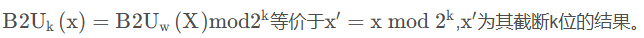

比如，将9从int转换为short，即需要截断16位，k=16。 9 mod 2^16^ = 9。因此，9从int转换为short的结果为9。

#### 有符号数

有符号数的截断公式为：

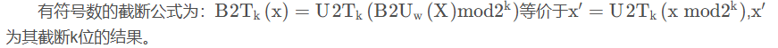

比如，将53791从int转换为short，即需要截断16位，k=16。53791 mod 2^16^ 53791, U2T~16~(53791) = 53791 -  65536 = -12345。因此，53791从int转换为short的结果为-12345。

#### 小结

关于有符号数和无符号数的转换，数字的扩展与截断，经常发生于**不同类型**，**不同位长**数字的转换，这些操作一般都是由计算机自动完成的，但是我们最好要知道计算机是如何完成转换的，这对于我们检查BUG是特别有用的。这些内容我们不一定要都记住，但是当发生错误时，我们是要知道从哪里检查。

## 整数运算

### 无符号数加法

对满足：

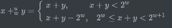

正常情况下，x+y的值保持不变，而溢出情况则是该和减去 $2^{\rm{w}}$。

比如，考虑一个4位数字表示（最大值为16），x=9，y=12，和为21，超出了范围。那么x+y的结果为9+12-16=5。

### 补码加法

对满足：

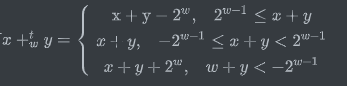

当 ${2^{w - 1} ≤ x + y}$，产生正溢出，当$${w + y < - {2^{w - 1}}}$$,产生负溢出。当$ - {2^{w - 1}} \le x + y < {2^{w - 1}}$,正常。具体参考下图。

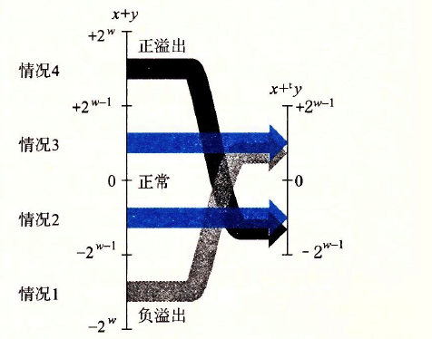

举例如下表所示（以4位补码加法为例）

| x           | y           | x+y           | $x + _4^ty$ | 情况 |
| ----------- | ----------- | ------------- | ----------- | ---- |
| \-8\[1000\] | \-5\[1011\] | \-13\[10011\] | 3\[0011\]   | 1    |
| \-8\[1000\] | \-8\[1000\] | \-16\[10000\] | 0\[0000\]   | 1    |
| \-8\[1000\] | 5\[0101\]   | \-3\[11101\]  | \-3\[1101\] | 2    |
| 2\[0010\]   | 5\[0101\]   | 7\[00111\]    | 7\[0111\]   | 3    |
| 5\[0101\]   | 5\[0101\]   | 10\[01010\]   | \-6\[1010\] | 4    |

### 补码的非

对满足 $TMi{n_w} \le x \le TMa{x_w}$的x，其补码的非$_w^tx$由下式给出

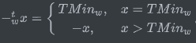

也就是说，对w位的补码加法来说，$TMi{n_w}$ 是自己的加法的逆，而对其他任何数值x都有-x作为其加法的逆。

### 无符号数的乘法

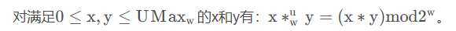

### 补码的乘法

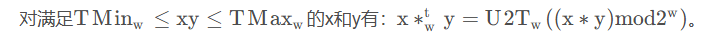

举例,3位数字乘法的结果

| 模式   | x           | y           | x \* y         | 截断的x \* y |
| ------ | ----------- | ----------- | -------------- | ------------ |
| 无符号 | 4 \[100\]   | 5 \[101\]   | 20 \[010100\]  | 4 \[100\]    |
| 补码   | \-4 \[100\] | \-3 \[101\] | 12 \[001100\]  | \-4 \[100\]  |
| 无符号 | 2 \[010\]   | 7 \[111\]   | 14 \[001110\]  | 6 \[110\]    |
| 补码   | 2 \[010\]   | \-1 \[111\] | \-2 \[111110\] | \-2 \[110\]  |
| 无符号 | 6 \[110\]   | 6 \[110\]   | 36 \[100100\]  | 4 \[100\]    |
| 补码   | \-2 \[110\] | \-2 \[110\] | 4 \[000100\]   | \-4 \[100\]  |

### 常数与符号数的乘法

在大多数机器上，整数乘法指令相当慢，需要10个或者更多的时钟周期，然而其他整数运算（例如加法、减法、位级运算和移位）只需要1个时钟周期。因此，编译器使用了一项重要的优化，试着用移位和加法运算的组合来代替乘以常数因子的乘法。

由于整数乘法比移位和加法的代价要大得多，许多C语言编译器试图以移位、加法和减法的组合来消除很多整数乘以常数的情况。  

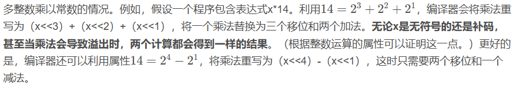

归纳以下，对于某个常数的K的表达式x * K生成代码。我们可以用下面两种不同形式中的一种来计算这些位对乘积的影响

- 形式A: $ (x < < n) + (x < < (n - 1)) + \cdots + (x < < m) $

- 形式B: $(x < < (n + 1)) - (x < < m)$ 

对于嵌入式开发中，我们经常使用这种方式来操作寄存器了。在编程中，**我们要习惯使用移位运算来代替乘法运算，可以大大提高代码的效率**。

### 常数与符号数的除法

在大多数机器上，整数除法要比整数乘法更慢—需要30个或者更多的时钟周期。除以2的幂也可以用移位运算来实现，只不过我们用的是右移，而不是左移。无符号和补码数分别使用**逻辑移位**和**算术移位**来达到目的。

#### 无符号数的除法

对无符号运算使用移位是非常简单的，部分原因是由于无符号数的右移一定是**逻辑右移**。同时注意，**移位总是舍入到零**。

举例如下，以12340的16位表示逻辑右移k位的结果。左端移入的零以粗体表示。

| k    | \>>k(二进制)         | 十进制 | $12340/{2^k}$ |
| ---- | -------------------- | ------ | ------------- |
| 0    | 0011000000110100     | 12340  | 12340.0       |
| 1    | **0**001100000011010 | 6170   | 6170.0        |
| 4    | **0000**001100000011 | 771    | 771.25        |
| 8    | **00000000**00110000 | 48     | 48.203125     |

#### 补码的除法（向下舍入）

对于除以2的幂的补码运算来说，情况要稍微复杂一些。首先，为了保证负数仍然为负，移位要执行的是**算术右移**。

对于x≥0，变量x的最高有效位为0，所以效果与逻辑右移是一样的。因此，对于非负数来说，算术右移k位与除以  ${2^k}$ 是一样的。

举例如下所示，对-12340的16位表示进行算术右移k位。对于不需要舍入的情况（k=1），结果是 k $x/{2^k}$ 。当需要进行舍入时，移位导致结果**向下舍入**。例如，右移4位将会把-771.25向下舍入为-772。我们需要调整策略来处理负数x的除法。

| k    | \>>k（二进制）       | 十进制  | $-12340/{2^k}$ |
| ---- | -------------------- | ------- | -------------- |
| 0    | 1100111111001100     | \-12340 | \-12340.0      |
| 1    | **1**110011111100110 | \-6170  | \-6170.0       |
| 4    | **1111**110011111100 | \-772   | \-771.25       |
| 8    | **11111111**11001111 | \-49    | \-48.203125    |

#### 补码的除法（向上舍入）

我们可以通过在移位之前“偏置（ biasing）”这个值，来修正这种不合适的舍入。

下表说明在执行算术右移之前加上一个适当的偏置量是如何导致结果正确舍入的。在第3列，我们给出了-12340加上偏量值之后的结果，低k位（那些会向右移出的位）以斜体表示。我们可以看到，低k位左边的位可能会加1，也可能不会加1。对于不需要舍入的情况（k=1），加上偏量只影响那些被移掉的位。对于需要舍入的情况，加上偏量导致较高的位加1，所以结果会**向零舍入**。

| k    | 偏量 | \-12340+偏量         | \>>k（二进制）       | 十进制  | $-12340/{2^k}$ |
| ---- | ---- | -------------------- | -------------------- | ------- | -------------- |
| 0    | 0    | 1100111111001100     | 1100111111001100     | \-12340 | \-12340.0      |
| 1    | 1    | 110011111100110**1** | **1**110011111100110 | \-6170  | \-6170.0       |
| 4    | 15   | 110011111101**1011** | **1111**110011111100 | \-771   | \-771.25       |
| 8    | 255  | 11010000**11001011** | **11111111**11001111 | \-48    | \-48.203125    |

可以看到，除以2的幂可以通过逻辑或者算术右移来实现。这也正是为什么大多数机器上提供这两种类型的右移。不幸的是，这种方法不能推广到除以任意常数。同乘法不同，我们不能用除以2的幂的除法来表示除以任意常数K的除法。

## 浮点数

### 二进制小数

一种关于二进制的小数编码：$b = \sum\limits_{i = - n}^m {{2^i} \times {b_i}}$ 

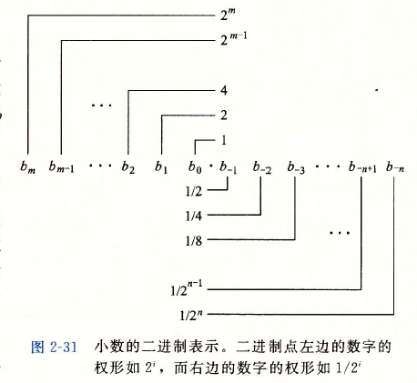

二进制小数点向左移动一位相当于这个数被2除，二进制小数点向右移动一位相当于将数乘2。

### IEEE浮点表示

IEEE浮点标准用 $V = {( - 1)^s} \times M \times {2^E} $

- 符号（sign）s决定这数是负数（s=1）还是正数（s=0），而对于数值0的符号位解释作为特殊情况处理。
- 尾数（ significand）M是一个二进制小数，它的范围是$1 \sim 2 - \varepsilon $，或者是$0 \sim 1 - \varepsilon $。
- 阶码（ exponent）E的作用是对浮点数加权，这个权重是2的E次幂（可能是负数）。将浮点数的位表示划分为三个字段，分别对这些值进行编码：
- 一个单独的符号位s直接编码符号s
- k位的阶码字段 $\exp = {e_{k - 1}} \cdots {e_1}{e_0}$编码阶码E。
- n位小数字段 $frac = {f_{n - 1}} \cdots {f_1}{f_0}$ 编码尾数M，但是编码出来的值也依赖于阶码字段的值是否等于0。

C语言中的编码方式：

- 单精度浮点格式（float） —— s、exp和frac字段分别为1位、k = 8位和n = 23位，得到一个32位表示。

- 双精度浮点格式（double） —— s、exp和frac字段分别为1位、k = 11位和n = 52位，得到一个64位表示。
  

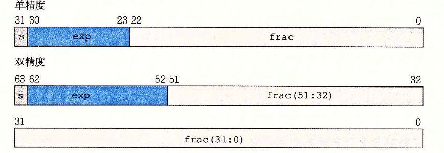

## 浮点数运算规则

### 整数和浮点数相乘

  规则： $x{ + _f}y = Round(x + y)$ ， $x{ \times _f}y = Round(x \times y) $，其中 R o u n d ( x × y ) $Round(x \times y)$ Round(x×y)要遵循下表的舍入规则。

|                      | 1.4  | 1.6  | 1.5  | 2.5  | \-1.5 |
| -------------------- | ---- | ---- | ---- | ---- | ----- |
| 向0舍入              | 1    | 1    | 1    | 2    | \-1   |
| 向负无穷舍入         | 1    | 1    | 1    | 2    | \-2   |
| 向正无穷舍入         | 2    | 2    | 2    | 3    | \-1   |
| 偶数舍入（四舍五入） | 1    | 2    | 2    | 2    | \-2   |

### 两个浮点数相乘

两个浮点数相乘规则：$({( - 1)^{s1}} \times M1 \times {2^{E1}}) \times ({( - 1)^{s2}} \times M2 \times {2^{E2}}) = {( - 1)^S} \times M \times {2^E}$ 

S:s1^s2

M:M1+M2

E:E1+E2

### 两个浮点数相加

浮点数相加规则： ${( - 1)^{s1}} \times M1 \times {2^{E1}} + {( - 1)^{s2}} \times M2 \times {2^{E2}} = {( - 1)^S} \times M \times {2^E}$ 

S和M的值为两个浮点数小数点对齐后相加的结果。

E:E1 (假设E1>E2) 

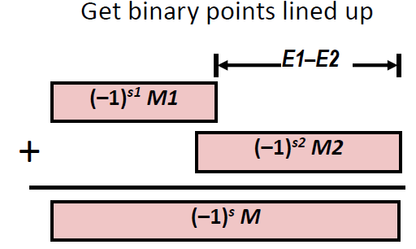

### 浮点数的偶数舍入

例如有效数字超出规定数位的多余数字是1001，它**大于超出规定最低位的一半（即0.5）**，故最低位进1。如果多余数字是0111，它小于最低位的一半，则舍掉多余数字（截断尾数、截尾）即可。对于多余数字是1000、正好是最低位一半的特殊情况，**最低位为0则舍掉多余位，最低位为1则进位1、使得最低位仍为0（偶数）。**

注意这里说明的数位都是指二进制数。

> 举例：要求保留小数点后3位。
>
> 对于1.0011001，舍入处理后为1.010（去掉多余的4位，加0.001）  
> 对于1.0010111，舍入处理后为1.001（去掉多余的4位）  
> 对于1.0011000，舍入处理后为1.010（去掉多余的4位，加0.001，使得最低位为0）
>
> 对于1.1001001，舍入处理后为1.101（去掉多余的4位，加0.001）  
> 对于1.1000111，舍入处理后为1.100（去掉多余的4位）  
> 对于1.1001000，舍入处理后为1.100（去掉多余的4位，不加，因为最低位已经为0）
>
> 对于1.01011，舍入处理后为1.011（去掉多余的2位，加0.001）  
> 对于1.01001，舍入处理后为1.010（去掉多余的2位）  
> 对于1.01010，舍入处理后为1.010（去掉多余的2位，不加）

**注意：浮点数的运算不支持结合律。**

> 举例：(1e10+3.14)-1e10=0，3.14+（1e10-1e10）=3.14。因为舍入的原因，第一个表达式会丢失3.14。
>
> 举例：（1e20 \* 1e20）*1e-20 求值为正无穷，而1e20 \* （1e20*1e-20） = 1e20。

### C语言中的浮点数

在C语言中，当在int、float和 double格式之间进行强制类型转换时，程序改变数值和位模式的原则如下（假设int是32位的）

+   从int转换成 float，数字不会溢出，但是可能被舍入。
+   从int或float转换成 double，因为double有更大的范围（也就是可表示值的范围），也有更高的精度（也就是有效位数），所以能够保留精确的数值。
+   从 double转换成float，因为范围要小一些，所以值可能溢出成 $+ \infty$ +∞或 $- \infty$。
    +   另外，由于精确度较小，它还可能被舍入，从float或者 double转换成int，值将会向零舍入。例如，1.999将被转换成1，而-1.999将被转换成-1。
    +   进一步来说，值可能会溢出。C语言标准没有对这种情况指定固定的结果。
    +   一个从浮点数到整数的转换，如果不能为该浮点数找到一个合理的整数近似值，就会产生这样一个值。因此，表达式(int)+1e10会得到-21483648，即从一个正值变成了一个负值。

> 举例：int x = …； float f = …；double d =… ;
>
> | 表达式                 | 对/错 | 备注                                                         |
> | ---------------------- | ----- | ------------------------------------------------------------ |
> | x == (int)(float)x     | 错    | **float** 类型不能精确表示某些较大的整数。 对于 32 位的浮点数来说，23 位尾数意味着它可以精确表示的整数最大是 $2^{23} = 8,388,608$。 float没有足够的位表示int，转换会造成精度丢失 因此`x != (int)(float)x`，但如果整数在 `float` 能精确表示的范围内，则不会发生精度丢失。 |
> | x == (int)(double)x    | 对    |                                                              |
> | f ==(float)(double)f   | 对    |                                                              |
> | d == (double)(float)d  | 错    | float->double精度不够                                        |
> | f == -(-f)             | 对    |                                                              |
> | 2/3 == 2/3.0           | 错    |                                                              |
> | d<0.0 ==> ((d\*2)<0.0) | 对    |                                                              |
> | d>f ==> -f >-d         | 对    |                                                              |
> | d\*d >=0.0             | 对    |                                                              |
> | (d+f)-d == f           | 错    | 没有结合律                                                   |

## 总结

本章中需要掌握的内容主要有：无符号数，补码，有符号数的编码方式，可表示的范围大小，相互转换的规则，运算规则。浮点数的编码方式了解即可，这部分有点难以理解，如果后面有用到的话再回来细看，但是对于C语言中其他数据类型到浮点数的转换规则是要掌握的。