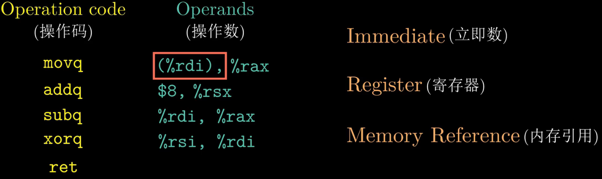

# 第三章-程序的机器级表示

### 3.1 程序的机器级表示


英特尔处理器发展历史：


其中编译选项-Og是用来告诉编译器生成符合原始C代码整体结构的机器代码。

在实际的项目，为了获得更高的编译性能，会使用-O1或-O2，甚至更高级别的编译选项。但是使用高级别的优化产生的代码会严重变形，导致产生的机器代码与最初的源代码之间的关系难以理解。


其中以”.”开头的行都是指导汇编器和链接器工作的伪指令.

- pushq 这条指令的意思是将寄存器rbx的值压人程序栈进行保存，在使用pop指令，恢复寄存器rbx的内容。寄存器rbx是被调用者保存寄存器。
- 第二行汇编代码的含义是将寄存器rdx的内容复制到寄存器rbx，这条指令执行结束后，寄存器rbx与寄存器rdx的内容一致，都是dest指针所指向的内存地址。mov指分的后缀“q”表示数据的大小
- call指分对应于C代码中的医数调用，这一行代码比较容易理解。该函数的返回值会保存到寄存器rax中。因此寄存器rax中保存了x和y的乘积结果。 
- 下一条指分将寄存器rax的值送到内存中。**内存的地址就存放在寄存器rbx中**
- 最后一条指令ret就是函数返回

函数的三个入参分别保存在寄存器rdi, rsi和 rdx中


Intel用字（word）来表示16位的数据类型。所以，32位的数据类型称为双字，64位的数据类型就称为四字。所以，32位的数据类型称为双字，64位的数据类型就称为四字。大多数GCC生成的汇编指分都有一个字符后缀来表示操作数的大小。 


move有四个变种，其中l是long word的缩写。

在Intelx86-64的处理器中包含了16个通用目的的寄存器，这些寄存器用来存放整数数据和指针，他们的名字都以%r开头。


两个概念，调用者保存寄存器 和 被调用者保存寄存器：


函数A调用者，函数B为被调用者

由于调用了函数B，寄存器rbx在函数B中被修改了
，逻辑上寄存器rbx的内容在调用函数B的前后应该保持一致

两个策略：

调用者保存策略：一个是函数A在调用函数B之前，提前保存寄存器rbx的内容，执行完函数B之后，再恢复寄存器rbx原来存储的内容


被调用者保存策略：函数B在使用寄存器rbx之前，先保存寄存器rbx的值，在函数B返回之前，先恢复寄存器rbx原来存储的内容


对于具体使用哪一种策略，不同的寄存器被定义成不同的策略。


接下来我们看一下C代码是如何翻译成机器代码的，只需要将编译选项-S替换成-c。执行这条命令，即可生产mstore.c所对应的机器代码文件mstore.0。


通过图中的命令，我们可以查看mstore.o中的相关信息。


细微差别：反汇编代码省略了很多指令的后缀的“q’，但在call和ret指合添加后缀'q'，由于q只是表示大小指示符，大多数情况下是可以省略的


### 3.2 寄存器与数据传送指令


8个通用寄存器，寄存器随着处理器位数的扩展而扩展，后面还额外增加了8个寄存器


- rax：用来保存函数的返回值
- rsp：用来保存程序栈的结束位置
- 有标识argument的寄存器（6个），用来传递函数参数


指令：大多数指令包含两部分-操作码和操作数

不同指令的操作数大致可以分为三类，分别为立即数、寄存器以及内存引用

- 在AT&T格式的汇编中，立即数是以$符号开头的，后面跟一个整数（这个证书需要满足标准C语言的定义）

- 64位的机器上，32、16、8位寄存器也都可以作为操作数，

- 带了小括号（%rdi），表示的是内存引用



**内存引用**

最常用的内存引用包含四个部分：

- 立即数
- 基址寄存器
- 变址寄存器
- 比例因子

引用数组元素时，会使用到这种通用的形式。

有效地址是通过立即数与基址寄存器的值相加，再加上变址寄存器与比例因子的乘积，具体的计算方法如图所示：

实际上比例因子的取值是与源代码中定义的数组类型的是相关的，编译器会根据数组的类型来确定比例因子的数值（char：1，int：4，double：8）


需要特别注意两种：

- 不带 `$` 符号的立即数
- 和带了括号的寄存器


data movement instructions


- 目的操作数不能是一个立即数，
- x86寄存器还限制就是mov指令的源操作数和目的操作数不能都是内存的地址


如果需要将数据从一个内存地址移动到复制到另一个内存地址


- 寄存器eax是32位，与双字l对应
- 寄存器al是8位，与字节b对应


当源操作数的数位小于目的操作数时，

我们需要对目的操作数剩余的字节进行零扩展或者符号位扩展

- 零扩展数据传送指分有5条，其中字符z是zero的缩写
- 指令的最后两个字符都是大小指示符，第一个字母表示源操作数的大小，第二个字母表示目的操作数的大小


- 符号位扩展传送指令有6条，其中字符s是sign的缩写
- 同样最后的两个字符也是大小指示符
- cltq：该指令的源操作数总是寄存器eax，目的操作数总是寄存器是rax


### 3.3 栈与数据传送指令

按照寄存器的使用惯例，寄存器rdi和rsi分别用来保存函数传递的第一个参数和第二个参数


- push指令的本质还是将数据写入到内存中，
- 实际上pop指令是通过修改栈顶指针所指向的内存地址来实现数据删除的，此时，内存地址0x100内所保存的数据0x123仍然存在，直到下次push操作，此处保存的数值才会被覆盖


### 3.4 算术和逻辑运算指令

- 对于leaq指合所执行的操作并不是去内存地址(5x+7)处读取数据
- 而是将有效地址
  (5x+7)这个值直接写人到目的寄存器rax


12*z为什么不能一步到位：因为比例因子取值只能1、2、4、8，


一元操作指令：

- 只有一个操作数
- 操作数既是源操作数，越是目的操作数
- 操作数可以是寄存器，也可以是内存地址


二元操作：

- 源操作数：这个操作数可以是立即数、寄存器或者内存地址
- 第二个操作数既是源操作数也是目的操作数，这个操作数可以是寄存器或者内存地址，但不能是立即数


移位指令：

- 右移指令：分为算术右移和逻辑右移
- 算术右移需要填符号位
- 逻辑右移需要填零


对于移位量k，可以是一个立即数，或者是放在寄存器cl中的数（特别注意：对于移位指令只允许以特定的寄存器cl作为操作数，其他寄存器不行）

由于寄存器cl的长度为8，原则上移位量的编码范围可达2的8次方减1(255)

实际上，对于w位的操作数进行移位操作，移位量是由寄存器cl的低m位来决定


我们重点看一下z*48 这行代码所对应的汇编指令

- 第一步，首先计算3*z，指令leaq来实现，计算结果保存到寄存器rax
- 第二步，将寄存器rax进行左移4位，左移4位的操作是等效于乘以2的四次方，也就是乘以16
- 通过一条leaq指分和一条左移指令，来实现乘法操作

乘法指令的执行需要更长的时间，因此编译器在生成汇编指令时，会优先考虑更高效的方式


**特殊指令**


对于汇编指分学习，最关键的是了解指令相关的基本概念，并不需要去记指令的细枝末节，学会查阅指令手册，能够找到需要的信息即可

### 3.5 指令和条件码

- 例如图中的这条减法指令的执行，需要用到算术逻辑单元，简称ALU
- ALU从寄存器中读取数据后，执行相应的运算
- 然后将运算结果返回到目的寄存器rdx


ALU除了执行算术和逻辑运算指令外，还会根据该运算的结果去设置条件码寄存器

- 条件码寄存器它是由CPU来维护的，长度是单个比特位，它描述了最近执行操作的属性
- 假如ALU执行两条连续的算术指令，t1时刻执行指令1，t2时刻执行指令2，t1时刻条件码寄存器中保存的是指令1的执行结果的属性
- t2时刻，条件码寄存器中的内容将被下一条指令所覆盖


- CF（carry flag）-进位标志，当CPU最近执行的一条指令最高位产生了进位时，进位标志(CF)会被置为1，它可以用来检查无符号数操作的溢出。例如，无符号数a和b相加，当a=255，b=1时，由于最高位会发生进位操作，相加的结果发生溢出，此时进位标志
  (CF)被置1  
  
- ZF（zero flag）-零标志，当最近操作的结果等于零时，零标志
  (ZF)会被置1
- SF（sign flag）-符号标志，当最近的操作结果小于雾时，符号标志(SF)会被置1
- OF（overflow flag）-溢出标志，针对有符号数，最近的操作导致正溢出或者负溢出时溢出标志
  (OF)会被置1

条件码寄存器的值是由ALU在执行算术和运算指令时写入的，图中的这些算术和逻辑运算指分都会改变条件码寄存器的内容，对于不同的指令也定义了相应的规则来设置条件码寄存器

- 例如逻辑操作指分xor，进位标志
  (CF)和溢出标志(OF)会置0
- 对于加一指令和减一指令会设置溢出标志(OF)和标志(ZF)，但不会改变进位标志（CF）


除此之外，还有两类指令可以设置条件码寄存器

- cmp指分是根据两个操作数的差来设置条件码寄存器，cmp指分和减法指分
  (sub)类似，也是根据两个操作是的差来设置条件码，二者不同的是cmp指分只是设置条件码寄存器，并不会更新目的寄存器的值
- test指分和and指分类似，同样test指分只是设置条件码寄存器，而不改变目的寄存器的值


- 当a和b的值相等时，指令cmp会将零标志位设置为1
- 在这个例子中，指分sete根据零标志(ZF)的值对寄存器al进行赋值，后缀e是equal的缩写  
  
- move指令对寄存器al进行零扩展，最后返回判断结果


- a小于b的情况，可以通过条件码的异或组合来实现  
  


针对无符号数的比较，采用的是进位标志和零标志的组合


### 3.6 跳转指令与循环

指分cmp会根据
的结果来设置符号标志(SF)和出标志
(OF)
(x-y)

图中的跳转指合jl，根据符号标志(SF)和溢出标志
(OF)的异或结果来判断，究竟是顺序执行，还是跳转到L4处执行

- 当x大于y时，指令顺序执行，然后返回执行结果，L4处的指令不会被执行
- 当x小于y时，程序跳转到L4处执行，然后返回执行结果


**跳转指令**

跳转指令会根据条件寄存器的某种组合来决定是否进行跳转，与set指令的设置条件是一样的


在现代处理器上，以上方式的执行效率可能比较低

替代策略：使用数据的条件转移来代替控制的条件转移，执行效率高

- 前面这几条指分都是普通的数据传送和减法操作
- 指令cmov是根据条件码的某种组合来进行有条件的传送数据。当满足规定的条件时，将寄存器rdx内的数据复制到寄存器rax内；在这个例子中，只有当大于等于y时，才会执行这一条指令  
  


为什么基于条件传送的代码会比基于跳转指令的代码效率高：

- 现代处理器通过流水线来获得高性能，当遇到条件跳转时，处理器会根据分支预测器来猜测每条跳转指分是否执行，当发生错误预测时，会浪费大量的时间，导致程序性能严重下降


**循环结构**

- 汇编语言中没有定义专门的指分来实现循环结构，循环语句是通过条件测试与跳转的结合来实现的

do while

- 指合cmp与跳转指合的组合实现了循环操作，当n大于1时，跳转到L2处执行循环


所产生的汇编代码，除了跳转指令不同，其他部分都是一致的，汇编代码是采用-Og选项产生的


三种循环语句都是通过条件测试和跳转指令来实现

switch语句：通过跳转表数据结构，使得实现更加高效

- 指合cmp判断参数n与立即数6的大小，如果n 大于6，程序跳转到default对应的L8程序段
- 对于case0~case6的情况，可以通过跳转表来方位不同分支
- C代码将跳转表声明为一个长度为7的数组，每个元素都是一个指向代码位置的指针
- 数组的长度为7，是因为需要覆盖Case 0~Case6 的情况，对于重复的情况case4和case6使用了相同的标号，对于确实的case1和case5的情况，采用默认情况的标号
- 在这个例子中，程序使用跳转表来处理多重分支，当switch有上百种情况时，虽然跳转表的长度会增加，但是程序的执行只需要一次跳转也能处理复杂分支的情况，

与使用一组很长的if else相比，使用跳转表的优点是执行switch语句的时间与case的数量是无关的（效率高，空间换时间）


### 3.7 过程（函数调用）

过程涉及到以下几种情况：


**栈帧**

当函数执行所需要的存储空间超出寄存器能够存放的大小时，就会借助栈上的存储空间，我们把这部分存储空间称为数的栈帧

- 对于函数P调用函数Q的例子，包括较早的帧、调用函数P的帧，还有正在执行函数O的帧，具体如图所示
- 当函数P调用函数Q时，会把返回地址压入栈中，该地址指明了当函数Q执行结束返回时要从函数P的哪个位置继续执行，这个返回地址的压栈操作并不是由指合push来执行的，而是由函数调用指令call来实现的

**示例**

反汇编获取到汇编代码


- 这一条call指令对应于multstore函数的调用，指分call不仅要将函数multstore的第一条指令的地址，写人到程序指合寄存器rip中，以此实现数调用；同时还要将返回地址压入栈中，这个返回地址就是函数multstore调用执行完毕后，下一条指令的地址
- 当函数multstore执行完毕，指分ret从栈中将返回地址弹出，写入到指令寄存器rip中，函数返回继续执行main函数中相关的操作


参数传递：如果一个函数的参数数量大于6，超出的部分就要通过栈来传递

- 参数1至参数6的传递可以使用对应的寄存器，


- 通过栈来传递参数时，所有数据的大小都是向8的倍数对齐，虽然变量a4只占一个字节，但是仍然为其分配了8个字节的存储空间
- 由于返回地址占用了栈顶的位置，所以这两个参数距离栈顶指针的距离分别位8和16


- 利用寄存器传递参数时，寄存器的使用是由特殊顺序规定的，
- 寄存器名字的使用取决于传递参数的大小
- 如果第一个参数大小是4字节，
  需要用寄存器edi来保存


- 第一条减法指令将栈顶指针减去16，它表示的含义是在栈上分配16个字节的空间；
- 再根据两条move指令，可以推断出变量arg1和arg2存储在函数caller的栈帧上
- 接下来分别计算arg1和arg2的存储地址，参数准备完毕，执行call指令调用swap函数  
  
- 最后函数caller返回之前，通过栈顶指针加上16的操作来释放栈帧


- 由于函数proc需要8个参数，因此参数7和参数8需要通过栈帧来传递，注意，传递的参数需要8个字节对齐，而局部变量是不需要对齐的
- 当函数运行需要局部存储空间时，栈提供了内存分配与回收的机制


- 在程序执行的过程中，寄存器是被所有函数共享的一种资源
- 为了避免寄存器的使用过程中出现数据覆盖的问题，处理器规定了寄存器的使用惯例，所有的函数调用都必须遵守这个惯例
- 对于16个通用寄存器，除了寄存器rsp之外，其他15个寄存器分别被定义为调用者保存和被调用者保存


**递归调用**


- 由于使用寄存器rbx来保存n的值，根据寄存器使用惯例，首先保存寄存器rbx的值，
- 由于n=3，所以跳转指令jle不会跳转到L35处执行，
- 指令leaq用来计算n-1，然后再次调用该函数


- 递归调用一个函数本身与调用其他函数是一样的，每次函数调用都有它自己私有的状态信息
- 栈分配与释放的规则与函数调用返回的顺序也是匹配的
- 不过当n的值非常大时，并不建议使用递归调用，可能导致栈溢出

### 3.8 数组的分配和访问

- 虽然都是对指针进行加一的运算，但是得到的结果却不同，计算结果会根据该指针引用的数据类型进行相应的伸缩


访问元素


将`A[i][j]`的值复制到寄存器eax中，


- 变长数组作为函数参数时，参数n必须在数组A之前，
- 需要使用乘法指令来计算n乘以i


### 3.9 结构体和联合体

- 可以画出各个学段相对于结构体起始地址处的字节偏移
- 数组a的元素时嵌入到结果体中的
- 无论时单个元素和数组元素，都是通过起始地址加偏移零的方式来访问


- 任何K字节的基本对象的地址必须是K的倍数，
- 也就是说对于short类型，起始地址必须是2的倍数；对于占8个字节的数据类型，起始地址必须是8的倍数
- 编译器可能需要在字段的地址空间分配时插入间隙，保证每个结构体的元素都满足对齐的要求


- 分配9个字节的存储空间，无法满足所有数组元素的对齐要求，因此，编译器会在结构体的末端增加3个字节的填充，这样一来所有的对齐限制都满足了


**联合体**

- 联合体中的所有字段共享同一存储区域，
- 因此联合体的大小取决于它最大字段的大小，变量v和数组i的大小都是8字节，
- 联合体的一种应用情况是，我们事先知道两个不同字段的使用是互斥的，可以将这两个字段声明成一个结构体


示例：

- 二叉树的任意一个节点不是内部节点就是叶子节点，可以用联合体来定义节点
- 每个节点只需要16个字节的存储空间，先对于结构体的定义可以节省一半的空间
- 这种编码存在一个问题，没办法确定一个节点到底是叶子节点还是内部节点


- 引入一个枚举类型，然后创建一个结构体，它包含一个标签和一个联合体
- type类型占4个字节，联合体占16个字节，type和联合体之间需要加入4个间隙，整个结构体的大小为24个字节
- 节省空间，但是给代码编写带来麻烦，
- 因此对于由较多字段的情况，对于较多字段的情况，使用联合体带来的空间节省才会更吸引人


### 4.10 缓冲区溢出

- 在C语言中，对数组的引用不会进行任何的边界检查
- 如果对越界的数组进行写操作，就会破坏存储在栈中的状态信息
- 当程序使用了被修改的返回地址时，就会导致严重的错误


实际上当输人字符串的长度不超过23时，不会发生严重的后果

超过以后，返回地址以及更多的状态信息会被破坏，返回指令会导致程序跳转到一个完全意想不到的地方


## 程序编码

### 计算机的抽象模型

计算机利用更简单的抽象模型来隐藏实现的细节。

对于机器级编程来说，其中**两种抽象尤为重要**：

- 第一种是由**指令集体系结构或指令集架构**（ Instruction Set Architecture,ISA）来定义机器级程序的格式和行为，它定义了**处理器状态**、**指令的格式**，以及**每条指令对状态的影响**。  
  大多数ISA，包括x86-64，将程序的行为描述成**好像每条指令都是按顺序执行的**，一条指令结束后，下一条再开始。处理器的硬件远比描述的精细复杂，它们并发地执行许多指令，但是可以采取措施保证整体行为与ISA指定的顺序执行的行为完全一致。
- 第二种抽象是，**机器级程序使用的内存地址是虚拟地址，提供的内存模型看上去是一个非常大的字节数组**。存储器系统的实际实现是将多个硬件存储器和操作系统软件组合起来。

### 汇编代码中的寄存器

程序计数器（通常称为“PC”，在x86-64中用号%rip表示）给出将要执行的下一条指令在内存中的地址。

整数寄存器文件包含16个命名的位置，分别存储64位的值。这些寄存器可以存储地址（对应于C语言的指针）或整数数据。有的寄存器被用来记录某些重要的程序状态，而其他的寄存器用来保存临时数据，例如过程的参数和局部变量，以及函数的返回值。

条件码寄存器保存着最近执行的算术或逻辑指令的状态信息。它们用来实现控制或数据流中的条件变化，比如说用来实现if和 while语句

一组向量寄存器可以存放一个或多个整数或浮点数值

### 机器代码示例

假如我们有一个main.c文件，使用 gcc -0g -S main.c可以产生一个汇编文件。接着使用gcc -0g -c main.c就可以产生目标代码文件main.o。通常，这个.o文件是二进制格式的，无法直接查看，我们打开编辑器可以调整为十六进制的格式，示例如下所示。

```
53 48 89 d3 e8 00 00 00 00 48 89 03 5b c3
```

这就是汇编指令对应的**目标代码**。从中得到一个重要信息，即**机器执行的程序只是一个字节序列，它是对一系列指令的编码。机器对产生这些指令的源代码几乎一无所知。**

### 反汇编简介

查看机器代码文件的内容，有一类称为反汇编器（ disassembler）的程序非常有用。这些程序根据机器代码产生一种类似于汇编代码的格式。在 Linux系统中，使用命令 objdump -d main.o可以产生反汇编文件。示例如下图。（汇编器将汇编代码翻译成二进制的机器代码，那么反汇编器就是机器代码翻译成汇编代码）