# 处理器体系结构

### 4.1 指令系统结构

指令系统是计算机软件和硬件交互的接口

程序员根据指令系统设计软件，处理器设计人员根据指令系统实现硬件

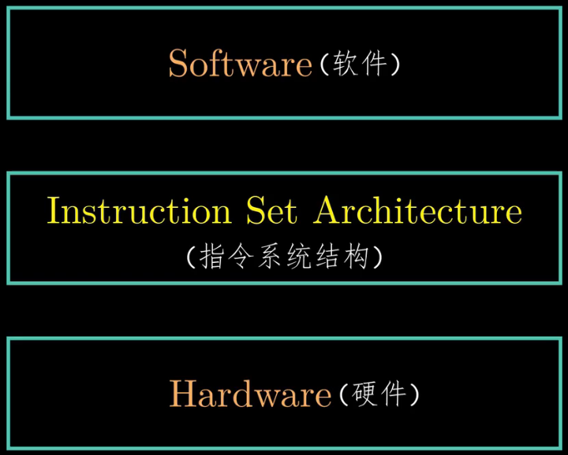

指令系统包括：状态单元、指令集、它们的编码、编程规范以及异常处理这几部分。

- 可见状态是指每条指分都会去读取或者修改处理器的某些部分，例如内存、寄存器、条件码、程序计数器以及程序状态等。  
  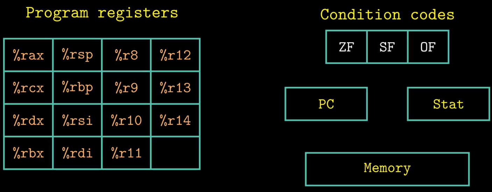
- 较于第三章中熟悉的x86-64的指令系统少了一个 %r15 ，是为了降低指令编码的复杂度。每个程序寄存器存储一个64位的字
- 寄存器 %rsp 被入栈、出栈、调用和返回指令作为栈指针。其余的没有固定的含义或固定值。
- 同时Y86-64的指令系统还简化了条件码寄存器，只有 3 个一位的条件码：ZF、SF、OF，它们保存着最近的算术或逻辑指令所造成影响的有关信息。
- 程序计数器（PC）是用来存放当前正在执行指令的地址。（**不是指令的内容**）
- 然后关于内存，从概念上来说，内存实际上就是一个很大的字节数组，保存着程序和数据。Y86-64 程序采用 **虚拟地址** 来引用内存位置。硬件和操作系统软件联合起来将虚拟地址翻译成实际或 **物理地址** ，指明数据实际存在内存中哪个地方。
- 最后就是程序状态了，程序状态的最后一个部分是状态码Stat，它是用来表明程序执行的总状态。是正常运行呢，还是出现了异常。

**对指令进行编码**

- 每条指令的第一个字节表明指令的类型，这个字节分为两部分，每一部分占4个比特位
  - 高四位表示指令代码，第四位表示指令功能
  - 对于定义的数据传送指令，指令功能部分都是0
  - 当指令中由寄存器类型的操作数时，会附加一个字节，这个字节被称为寄存器指示符字节，来指定一个或者两个寄存器，因此还需要对寄存器进行编码

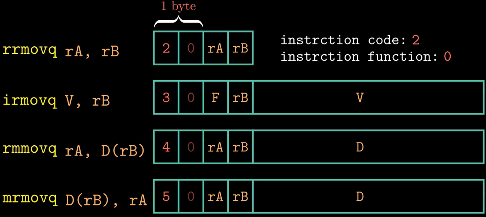

### 4.2 数字电路和处理器设计

- 在处理器内部，寄存器文件和算术逻辑单元(ALU)是串联的
- 寄存器文件的输出端口号ALU的输入端口相连
- 例如执行图中这条减法指令，ALU从寄存器文件中读取操作数，然后执行减法操作，最后将计算结果写入到寄存器文件中。

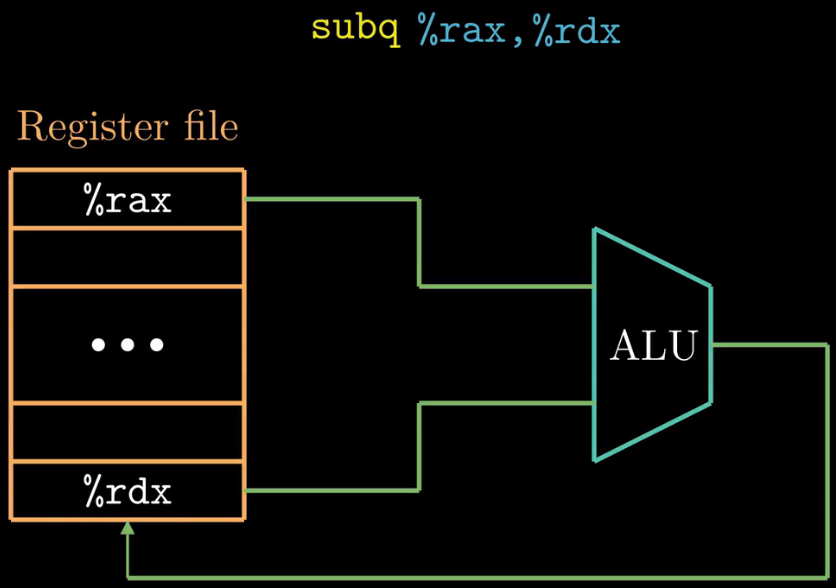

**Register File（寄存器文件、寄存器堆）**

- 我们规定读写操作共用地址线，由于我们定义了15个程序寄存器，因此地址线的宽度设计成4位即可满足寻址的要求
- 此外还有时钟信号、复位信号以及写使能信号
- 我们可以使用硬件描述语言(IDL)对寄存器文件进行行为级建模，常用的硬件描述语言有两种，最常用的是Verilog，另外一种是VHDI

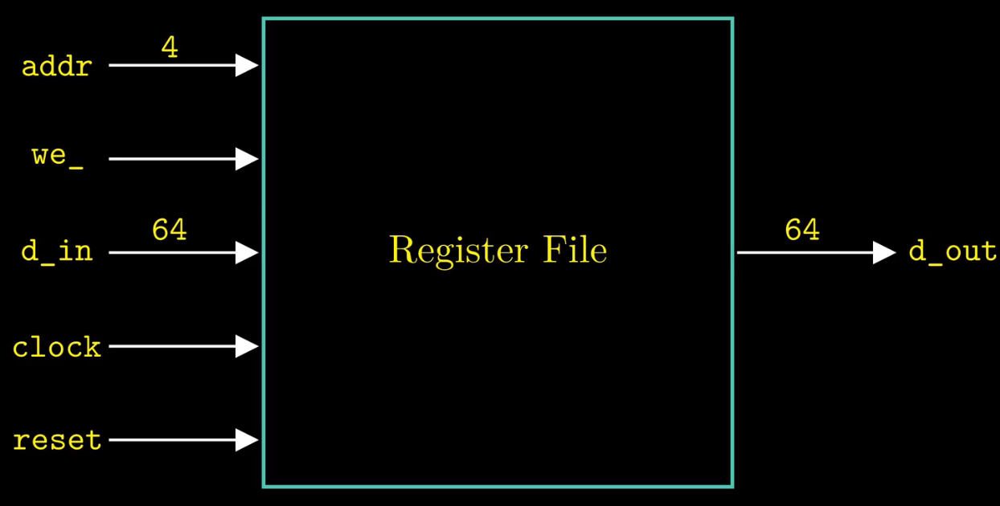

图中的verilog程序就是对寄存器文件的描述

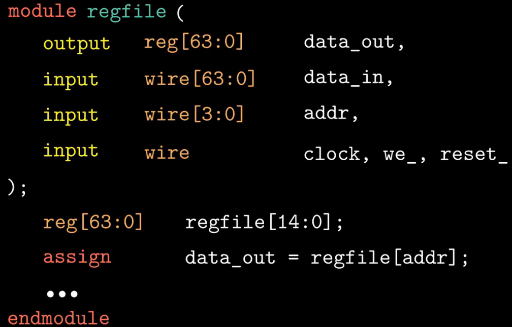

- 采用电子设计自动化(EDA)工具对这段程序进行逻辑综合，得到的电路就能实现预期的功能
- 逻辑综合的过程与编译有点类似

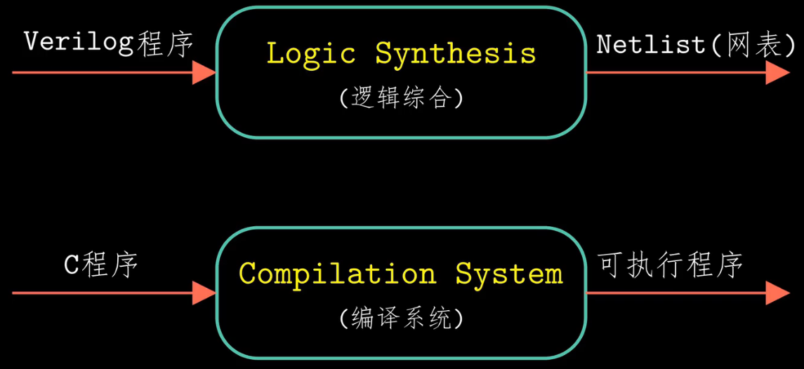

**寄存器文件的内部结构**

- 当执行读取操作时，使用地址线来传输寄存器的编号，多路选择器根据地址信号筛选出寄存器的值，最终数值会通过输出信号输出
- 执行写操作需要确定三个参数：目的寄存器的ID、写人的数据以及是否能够写人
- 输入数据信号线与每一个寄存器单元都相连
- 能不能执行写入操作由we信号线来确定，we是write enable的缩写，这个例子中地址信号线是读操作和写操作共用的，经过地址解析后的信号与we信号共同来确定对哪个寄存器执行写操作

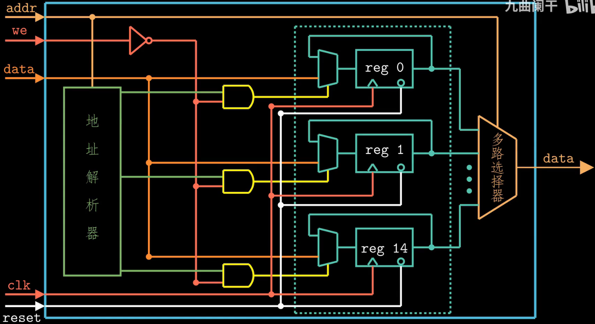

逻辑门由晶体管级电路实现的，在现代计算机中，晶体管通常是指基于CMOS工艺的

CMOS两种晶体管：N管，P管

- N管P管串联形成非门，

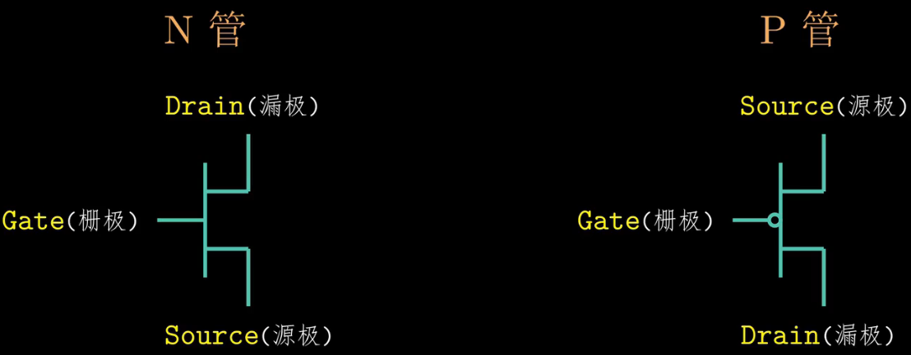

- 将二者漏极连在一起作为输出，栅极连在一起作为输入
- 将P管的源极接电源，N管的源极接地
- 当输入为高电平时，N管导通，P管不导通，输出为0；当输入为低电平，P管导通，N管不导通，输出为1

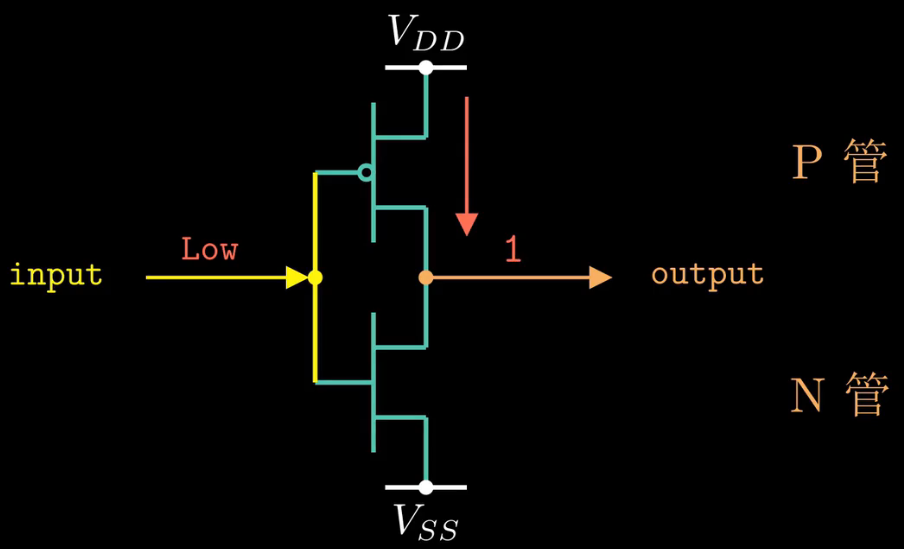

- 很早以前，电路设计是将一个个门电路绘制在图纸上，但是随着半导体技术的发展，这种方式很难高效的实现大规模的复杂电路
- 目前，电路的逻辑设计通常采用硬件描述语言来实现，然后采用电子设计自动化(EDA)工具进行综合和后端设计；硬件描述语言和综合工具的应用使得工程师们更多关注硬件功能的设计，而不是单个晶体管或者逻辑门的设计
- verilog语言的语法跟C语言有许多类似的地方，但是表达的含义与C语言有着本质的区别；Verilog程序是并行执行的，而C程序是串行执行的，所以硬件设计人员需要从电路的角度来理解Verilog语言，而不是软件的思维

- 其中组合逻辑电路的输出值仅由当前的输人状态来决定
- 而时序逻辑电路的输出值不仅与当前输入的状态有关，而且与原来的状态也有关
- 学会了这三种语句，所有的设计都够了

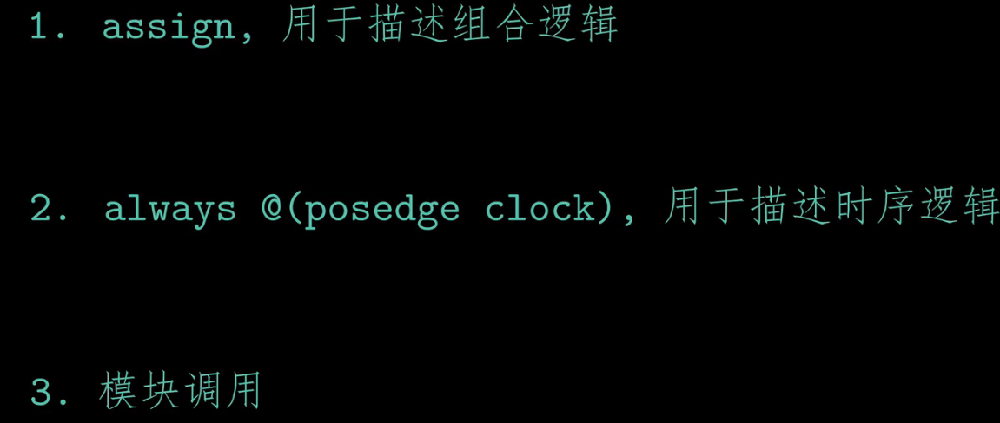